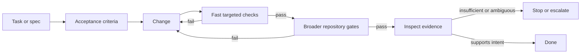
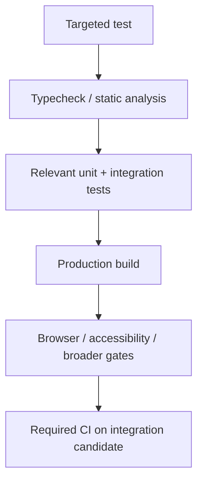
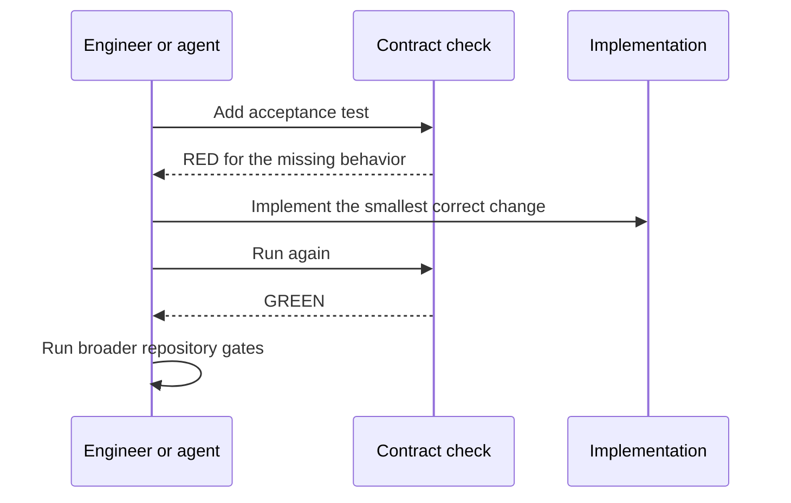

# Verification Loops & Machine-Checkable Guardrails

## TL;DR

A coding agent is not done when it has produced a plausible diff. It is done only when the change has **fresh evidence** that it satisfies the task and the repository's required constraints.

A practical verification loop is:

1. turn the task into explicit **acceptance criteria**;
2. make the smallest coherent change;
3. run the fastest targeted checks that can disprove the change;
4. run the broader repository gates required for integration;
5. inspect the evidence, not just the exit code;
6. fix the implementation when a check exposes a real problem;
7. stop or escalate when intent cannot be established safely.

A **machine-checkable guardrail** is a constraint a tool can evaluate deterministically enough to provide reliable feedback: schemas, types, tests, lint rules, builds, accessibility checks, security checks, required CI statuses, or narrowly scoped repository invariants.

Do not delete or weaken a failing check merely to make the change green. If the requirement is wrong, change it explicitly with evidence and review; otherwise fix the implementation.

## Verification is a loop, not a final ceremony



The important property is **feedback before confidence**. Each pass through the loop should either strengthen evidence or reveal why the current change is not acceptable.

<TermBox term="Verification loop">
A **verification loop** is the repeated cycle of changing software, running checks that can falsify the intended result, inspecting their evidence, and revising the change until the acceptance criteria are supported.

**Why it matters:** coding agents can produce changes quickly, so an unverified mistake can also propagate quickly. Short feedback loops keep generation speed coupled to engineering evidence.
</TermBox>

## Start with acceptance criteria that can fail

“Improve reliability” is an intention, not yet a useful completion condition.

Translate it into observable outcomes. For example:

```text
Task: make duplicate checkout submissions safe.

Acceptance criteria:
- repeated requests with the same idempotency key create one order;
- a retry after a timeout returns the previously committed result;
- a different payload cannot silently reuse the same key;
- existing checkout behavior remains green;
- lint, typecheck, tests, build, and required browser checks pass.
```

Good acceptance criteria answer three questions:

- **Behavior:** what must users or dependent systems observe?
- **Invariants:** what must remain true even when inputs, failures, or retries vary?
- **Integration gates:** what repository evidence must be green before the change can merge?

If a criterion cannot be checked automatically, say what human evidence is required instead of pretending automation can establish it.

## Choose the narrowest reliable guardrail

Not every engineering rule belongs in a prompt. If a constraint can be checked reliably, prefer a guardrail near the source of truth.

| Constraint | Better machine-checkable guardrail |
| --- | --- |
| configuration must match a schema | schema validation |
| a TypeScript value must satisfy an interface | typecheck |
| a pure function must preserve an invariant | unit or property test |
| two services must agree on an API shape | contract/integration test |
| a route must render and remain keyboard accessible | browser + accessibility test |
| a production bundle must compile | build gate |
| all authored concept IDs must exist in a canonical map | focused repository invariant test |
| a branch may merge only after approved CI | required status check / ruleset |

<TermBox term="Machine-checkable guardrail">
A **machine-checkable guardrail** is a narrow engineering constraint whose outcome can be evaluated by a deterministic tool with clear pass/fail evidence.

**Why it matters:** prose can explain intent, but a machine-checkable invariant can reject a violating change even when the author or agent overlooks the instruction.
</TermBox>

Do not automate subjective judgment merely because it is possible to produce a score. Architectural taste, prose quality, product intent, and ambiguous security decisions often still need human review.

## Layer checks from cheap to expensive

A fast loop does not mean running every check after every keystroke. Order checks so inexpensive, high-signal failures arrive early.



A useful strategy is:

- during implementation, run the smallest check that directly exercises the changed behavior;
- before declaring the slice green, run the repository-required baseline;
- before merge, verify the required checks belong to the **latest commit** or integration candidate that will actually be merged;
- after merge when the repository uses a push-to-main verification run, confirm the merged result also passes.

GitHub status checks are designed to communicate whether commits satisfy repository conditions such as builds, tests, scans, or deployments. When a required check protects a branch, the relevant required checks must pass before merge. GitHub's troubleshooting guidance also emphasizes that a required check must succeed for the latest relevant commit SHA; an older green run is stale evidence after the head changes.

## Evidence is more than “exit code 0”

A command can succeed while proving the wrong thing.

Suppose a test says:

```text
expect(response.status).toBe(200)
```

but the acceptance criterion is “a duplicate submission must not create a second order.” The test can pass while the real invariant is untested.

Inspect verification evidence by asking:

- did the check exercise the changed path?
- did it assert the acceptance criterion or only a proxy?
- did the expected failure occur during the RED phase?
- is the passing run from the current code?
- did a broad gate skip the relevant job because of path filters or conditions?
- are failures being hidden by retries, snapshots, broad mocks, or ignored warnings?

A green badge is evidence only for what the underlying check actually evaluates.

## Use RED → GREEN to prove a new guardrail has signal

When adding a new invariant, first observe it fail for the intended reason.



Without the RED observation, a newly written test might already pass because it never touched the intended behavior, asserted the wrong condition, or accidentally tested existing behavior.

RED should fail because the capability is missing—not because of a syntax error, broken fixture, incorrect path, or unrelated dependency failure.

## Never game a guardrail

A failing check creates two legitimate branches:

1. **The implementation violates a valid requirement.** Fix the implementation.
2. **The requirement or check is wrong.** Revisit it explicitly, with evidence and appropriate review.

The illegitimate shortcut is to make the signal disappear without resolving either branch.

Examples of gaming include:

- deleting the failing assertion;
- changing a required field to optional only because new content does not satisfy it;
- excluding the changed file from lint or typecheck;
- adding a blanket accessibility exception instead of fixing the violation;
- marking an important failing test as skipped;
- broadening a mock until it no longer represents the production boundary;
- citing a green run from an older commit after the branch changed.

Machine-checkable guardrails are valuable only when the workflow treats their failures as information rather than obstacles to bypass.

## Separate repository gates from task-specific evidence

A repository baseline answers “is this change compatible with our general engineering constraints?” It may not answer “did this feature satisfy its particular requirement?”

For a content-heavy repository, a baseline might include:

```text
lint
→ typecheck
→ unit/content tests
→ production build
→ browser and accessibility tests
```

A task can require additional evidence. A database change may need migration rollback testing. A permissions change may need negative authorization cases. A retry change may need duplicate-delivery tests. An accessibility-sensitive interactive component may need keyboard-flow verification.

Think in two sets:

```text
required evidence = repository baseline + task-specific evidence
```

Passing only one set is incomplete.

## Know when automation cannot establish intent

Verification loops should include a stop condition. An agent should **stop or escalate** rather than fabricate confidence when:

- requirements conflict or remain materially ambiguous;
- a destructive or irreversible action lacks explicit authorization;
- the available environment cannot reproduce the relevant behavior;
- credentials or permissions required for safe verification are unavailable;
- automated checks can establish consistency but not product, legal, security, or architecture intent;
- a failing check appears wrong but changing the guardrail would broaden policy beyond the task scope.

Escalation is part of a safe verification system, not a failure of automation.

## Production scenario: a permissions refactor with stale green evidence

An agent refactors a service authorization layer. It adds a unit test for the happy path and sees a green CI run. Then it changes the policy matcher to support wildcard resources but does not rerun the full suite. The pull request still displays an older successful run in the conversation, and the agent reports the task complete.

**Impact:** the new head commit allows a support role to match resources outside its assigned tenant. The authorization regression is merged because the reported evidence belonged to the previous commit rather than the latest commit.

**Root cause:** the workflow treated “a green check exists” as equivalent to “the current integration candidate is verified.” Acceptance criteria did not include cross-tenant denial, and the agent did not require fresh required checks after changing policy logic.

**Correct pattern:** write explicit positive and negative authorization acceptance criteria; observe the negative case fail before the fix; implement the policy change; run targeted tests, type/static checks, and the repository baseline; verify required CI on the latest commit; and stop or escalate instead of weakening a failing security guardrail. If the repository protects `main` with required status checks, configure those checks so a stale or failing head cannot merge through the normal path.

## Self-check

You add a schema guardrail requiring every deployment config to specify an owner. Your new service config has no owner, so CI fails. A teammate proposes changing `owner` to optional because “everything else is green.”

What should happen next?

<details>
<summary>Show the reasoning</summary>

Do not weaken the guardrail merely to make the branch green. First ask whether the ownership requirement is still valid. If it is, fix the service config and rerun the relevant checks. If the requirement is genuinely wrong, change the schema only as an explicit policy decision with evidence about the downstream consequences and appropriate review.

Also make sure the final green evidence belongs to the latest commit containing the chosen fix. An older successful run does not verify a later schema or configuration change.

</details>

## Production checklist

- [ ] **Criteria:** Convert the task into observable behavior, invariants, and explicit acceptance criteria before claiming completion.
- [ ] **RED signal:** For new behavior or guardrails, observe the focused test fail for the intended missing capability.
- [ ] **Fast loop:** Run the cheapest high-signal checks early while iterating.
- [ ] **Task evidence:** Add targeted tests or checks for risks unique to the change.
- [ ] **Repository baseline:** Run the required lint, typecheck, test, build, browser, accessibility, security, or other repository gates that apply.
- [ ] **Freshness:** Confirm required evidence belongs to the latest commit or integration candidate, not a stale green run.
- [ ] **No gaming:** Do not delete or weaken a valid failing check merely to obtain a pass.
- [ ] **Inspect evidence:** Verify checks exercised the intended behavior rather than only trusting command success.
- [ ] **Escalation:** Stop or escalate when automation cannot safely establish intent or when changing a guardrail would exceed scope.
- [ ] **Post-merge:** When the repository verifies pushes to its protected branch, confirm the merged result is green before stacking the next dependent change.

## Agent rule

For every substantive change, derive acceptance criteria, create or select checks that can falsify them, run fast targeted verification before broader repository gates, inspect the evidence, and require fresh results for the latest commit. Do not delete or weaken a valid guardrail just to make a change pass. When the available checks cannot establish intent safely, stop or escalate to a human reviewer with the unresolved evidence stated explicitly.

## References

- GitHub Docs, **Status checks**: https://docs.github.com/en/pull-requests/reference/status-checks
- GitHub Docs, **Available rules for rulesets**: https://docs.github.com/en/repositories/configuring-branches-and-merges-in-your-repository/managing-rulesets/available-rules-for-rulesets
- GitHub Docs, **Troubleshooting required status checks**: https://docs.github.com/en/pull-requests/how-tos/merge-and-close-pull-requests/troubleshooting-required-status-checks
