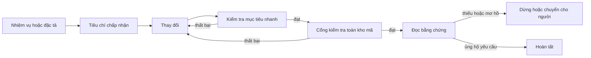
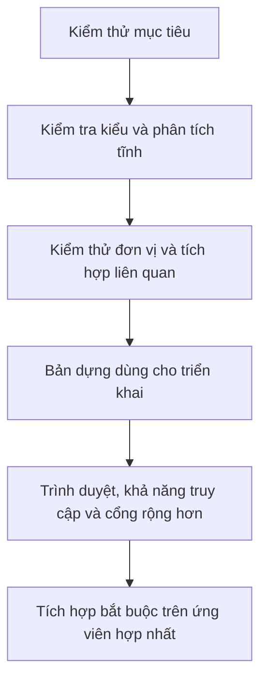
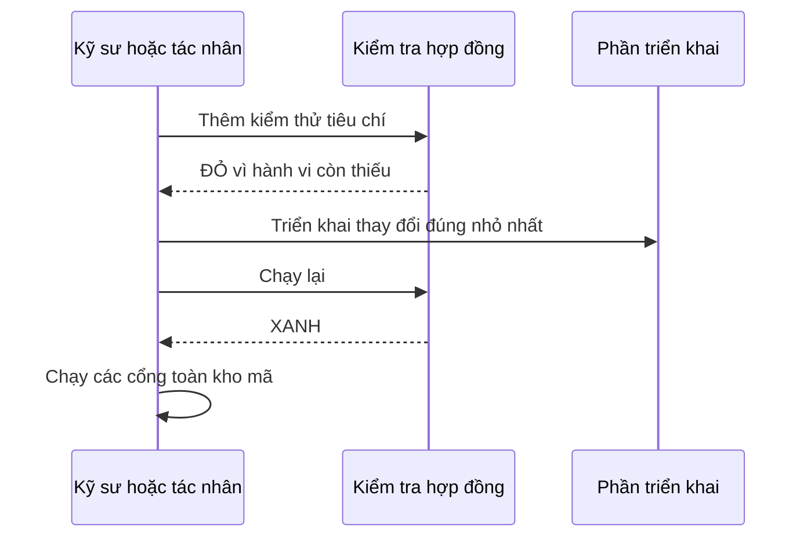

# Vòng lặp kiểm chứng & guardrail kiểm tra được bằng máy

## Tóm tắt

Một tác nhân viết mã chưa hoàn tất công việc chỉ vì đã tạo ra một phần thay đổi có vẻ hợp lý. Công việc chỉ hoàn tất khi thay đổi có **bằng chứng mới** cho thấy nó thỏa yêu cầu nhiệm vụ và các ràng buộc bắt buộc của kho mã.

Một vòng lặp kiểm chứng thực dụng gồm:

1. chuyển nhiệm vụ thành **tiêu chí chấp nhận** rõ ràng;
2. tạo thay đổi nhỏ nhất nhưng trọn vẹn;
3. chạy các kiểm tra mục tiêu nhanh nhất có khả năng bác bỏ thay đổi;
4. chạy các cổng kiểm tra rộng hơn mà kho mã yêu cầu trước khi tích hợp;
5. đọc bằng chứng, không chỉ nhìn mã thoát của lệnh;
6. sửa phần triển khai khi kiểm tra phát hiện lỗi thật;
7. dừng hoặc chuyển cho người xem xét khi không thể xác lập ý định một cách an toàn.

Một **guardrail kiểm tra được bằng máy** là ràng buộc mà công cụ có thể đánh giá đủ xác định để tạo phản hồi đáng tin cậy: lược đồ, kiểu dữ liệu, kiểm thử, luật kiểm tra tĩnh, bản dựng, kiểm tra khả năng truy cập, kiểm tra bảo mật, trạng thái tích hợp bắt buộc hoặc các bất biến hẹp của kho mã.

Không xóa hoặc nới lỏng một kiểm tra hợp lệ đang thất bại chỉ để làm thay đổi chuyển sang màu xanh. Nếu yêu cầu sai, hãy sửa yêu cầu một cách minh bạch với bằng chứng và xem xét phù hợp; nếu không, hãy sửa phần triển khai.

## Kiểm chứng là một vòng lặp, không phải nghi thức cuối cùng



Thuộc tính quan trọng là **phản hồi phải đến trước sự tự tin**. Mỗi vòng phải hoặc làm bằng chứng mạnh hơn, hoặc cho biết vì sao thay đổi hiện tại chưa đạt.

<TermBox term="Vòng lặp kiểm chứng">
**Vòng lặp kiểm chứng** là chu trình lặp gồm thay đổi phần mềm, chạy kiểm tra có khả năng bác bỏ kết quả mong muốn, đọc bằng chứng rồi chỉnh sửa cho đến khi tiêu chí chấp nhận được hỗ trợ đầy đủ.

**Vì sao quan trọng:** tác nhân có thể tạo thay đổi rất nhanh, nên lỗi chưa được kiểm chứng cũng có thể lan rất nhanh. Vòng phản hồi ngắn giúp tốc độ tạo mã luôn đi cùng bằng chứng kỹ thuật.
</TermBox>

## Bắt đầu bằng tiêu chí chấp nhận có thể thất bại

“Cải thiện độ tin cậy” mới chỉ là ý định, chưa phải điều kiện hoàn thành hữu ích.

Hãy chuyển nó thành kết quả quan sát được. Ví dụ:

```text
Nhiệm vụ: làm cho việc gửi lại yêu cầu thanh toán không tạo đơn hàng trùng.

Tiêu chí chấp nhận:
- nhiều yêu cầu dùng cùng khóa chống trùng chỉ tạo một đơn hàng;
- lần thử lại sau khi hết thời gian chờ trả về kết quả đã được ghi nhận trước đó;
- dữ liệu khác không được âm thầm tái sử dụng cùng khóa;
- hành vi thanh toán hiện có vẫn đạt kiểm thử;
- kiểm tra tĩnh, kiểu dữ liệu, kiểm thử, bản dựng và kiểm tra trình duyệt bắt buộc đều đạt.
```

Tiêu chí tốt trả lời ba câu hỏi:

- **Hành vi:** người dùng hoặc hệ thống phụ thuộc phải quan sát được gì?
- **Bất biến:** điều gì phải luôn đúng khi đầu vào, lỗi hoặc lần thử lại thay đổi?
- **Cổng tích hợp:** bằng chứng nào của kho mã phải đạt trước khi hợp nhất?

Nếu một tiêu chí không thể tự động kiểm tra, hãy nêu rõ bằng chứng con người cần xem thay vì giả vờ rằng tự động hóa có thể xác lập nó.

## Chọn guardrail hẹp nhất nhưng đáng tin cậy

Không phải mọi quy tắc kỹ thuật đều nên nằm trong lời nhắc. Nếu một ràng buộc có thể kiểm tra đáng tin cậy, hãy đặt guardrail gần nguồn sự thật nhất.

| Ràng buộc | Guardrail phù hợp hơn |
| --- | --- |
| cấu hình phải đúng lược đồ | xác thực lược đồ |
| giá trị phải thỏa giao diện kiểu | kiểm tra kiểu |
| hàm thuần phải giữ bất biến | kiểm thử đơn vị hoặc kiểm thử thuộc tính |
| hai dịch vụ phải đồng ý về dạng giao tiếp | kiểm thử hợp đồng hoặc tích hợp |
| tuyến trang phải hiển thị và dùng được bằng bàn phím | kiểm thử trình duyệt và khả năng truy cập |
| gói triển khai phải biên dịch | cổng bản dựng |
| mọi mã khái niệm phải tồn tại trong bản đồ chuẩn | kiểm thử bất biến của kho mã |
| nhánh chỉ được hợp nhất sau kiểm chứng bắt buộc | trạng thái kiểm tra bắt buộc hoặc bộ quy tắc nhánh |

<TermBox term="Guardrail kiểm tra được bằng máy">
**Guardrail kiểm tra được bằng máy** là một ràng buộc kỹ thuật hẹp có kết quả được công cụ xác định rõ với bằng chứng đạt hoặc không đạt.

**Vì sao quan trọng:** văn bản giải thích ý định, nhưng bất biến kiểm tra được bằng máy có thể từ chối thay đổi vi phạm ngay cả khi người viết hoặc tác nhân bỏ sót hướng dẫn.
</TermBox>

Đừng tự động hóa phán đoán chủ quan chỉ vì có thể tạo ra một con số. Gu kiến trúc, chất lượng văn phong, ý định sản phẩm và nhiều quyết định bảo mật mơ hồ vẫn cần người xem xét.

## Xếp kiểm tra từ rẻ đến đắt

Vòng lặp nhanh không có nghĩa là chạy mọi kiểm tra sau mỗi lần gõ phím. Hãy sắp xếp để lỗi rẻ và có tín hiệu mạnh xuất hiện sớm.



Chiến lược hữu ích:

- khi đang triển khai, chạy kiểm tra nhỏ nhất tác động trực tiếp đến hành vi vừa đổi;
- trước khi tuyên bố phần việc đạt, chạy bộ kiểm chứng cơ sở mà kho mã yêu cầu;
- trước khi hợp nhất, xác nhận các kiểm tra bắt buộc thuộc **commit mới nhất** hoặc đúng ứng viên tích hợp sẽ được hợp nhất;
- nếu kho mã chạy kiểm chứng sau khi đẩy lên nhánh chính, hãy xác nhận kết quả sau hợp nhất cũng đạt trước khi xếp chồng thay đổi phụ thuộc kế tiếp.

Trạng thái kiểm tra trên GitHub dùng để cho biết commit có thỏa các điều kiện của kho mã như bản dựng, kiểm thử, quét hoặc triển khai hay không. Khi nhánh được bảo vệ bằng kiểm tra bắt buộc, các kiểm tra liên quan phải đạt trước khi hợp nhất. Hướng dẫn xử lý sự cố của GitHub cũng nêu rằng kiểm tra bắt buộc phải thành công trên commit liên quan mới nhất; kết quả xanh của commit cũ là bằng chứng đã lỗi thời sau khi đầu nhánh thay đổi.

## Bằng chứng nhiều hơn việc “lệnh trả về 0”

Một lệnh có thể thành công nhưng chứng minh sai điều cần chứng minh.

Giả sử kiểm thử chỉ xác nhận:

```text
expect(response.status).toBe(200)
```

trong khi tiêu chí chấp nhận là “yêu cầu gửi trùng không được tạo đơn hàng thứ hai”. Kiểm thử vẫn có thể xanh dù bất biến thật chưa được kiểm tra.

Khi đọc bằng chứng, hãy hỏi:

- kiểm tra có đi qua đúng đường mã vừa thay đổi không?
- nó có xác nhận tiêu chí chấp nhận hay chỉ một chỉ dấu thay thế?
- ở pha đỏ, lỗi mong đợi có thật sự xuất hiện vì khả năng còn thiếu không?
- kết quả đạt có đến từ mã hiện tại không?
- một cổng rộng có bỏ qua công việc liên quan do điều kiện hoặc lọc đường dẫn không?
- lỗi có bị che bởi cơ chế thử lại, ảnh chụp kết quả, mô phỏng quá rộng hoặc cảnh báo bị bỏ qua không?

Một dấu xanh chỉ là bằng chứng cho đúng thứ mà kiểm tra phía dưới thực sự đánh giá.

## Dùng ĐỎ → XANH để chứng minh guardrail có tín hiệu

Khi thêm bất biến mới, trước tiên phải quan sát nó thất bại vì đúng nguyên nhân mong muốn.



Nếu chưa từng thấy pha đỏ, kiểm thử mới có thể vốn đã đạt vì không đi qua hành vi cần kiểm, xác nhận sai điều kiện hoặc vô tình kiểm tra hành vi đã tồn tại.

Pha đỏ phải thất bại vì khả năng còn thiếu, không phải vì lỗi cú pháp, dữ liệu thử hỏng, đường dẫn sai hay dependency không liên quan.

## Không được chơi mẹo với guardrail

Một kiểm tra thất bại tạo ra hai hướng hợp lệ:

1. **Phần triển khai vi phạm yêu cầu hợp lệ.** Sửa phần triển khai.
2. **Yêu cầu hoặc kiểm tra sai.** Xem xét lại một cách minh bạch với bằng chứng và mức review phù hợp.

Lối tắt không hợp lệ là làm tín hiệu biến mất mà không giải quyết một trong hai hướng trên.

Ví dụ chơi mẹo:

- xóa assertion đang thất bại;
- đổi trường bắt buộc thành tùy chọn chỉ vì nội dung mới chưa thỏa;
- loại file vừa đổi khỏi kiểm tra tĩnh hoặc kiểm tra kiểu;
- thêm ngoại lệ khả năng truy cập toàn cục thay vì sửa vi phạm;
- đánh dấu bỏ qua một kiểm thử quan trọng đang thất bại;
- nới mô phỏng đến mức không còn phản ánh ranh giới production;
- dùng kết quả xanh của commit cũ sau khi nhánh đã đổi.

Guardrail kiểm tra được bằng máy chỉ có giá trị khi quy trình xem thất bại là thông tin, không phải chướng ngại cần né.

## Tách cổng kho mã khỏi bằng chứng riêng của nhiệm vụ

Bộ kiểm chứng cơ sở của kho mã trả lời “thay đổi này có tương thích với các ràng buộc kỹ thuật chung không?”. Nó có thể chưa trả lời “tính năng này đã đúng yêu cầu cụ thể chưa?”.

Với kho mã thiên về nội dung, bộ cơ sở có thể gồm:

```text
kiểm tra tĩnh
→ kiểm tra kiểu
→ kiểm thử nội dung và đơn vị
→ bản dựng dùng cho triển khai
→ kiểm thử trình duyệt và khả năng truy cập
```

Một nhiệm vụ có thể cần bằng chứng bổ sung. Thay đổi cơ sở dữ liệu có thể cần kiểm thử hoàn tác di chuyển dữ liệu. Thay đổi quyền có thể cần trường hợp từ chối. Thay đổi cơ chế thử lại có thể cần kiểm thử gửi trùng. Thành phần tương tác nhạy với khả năng truy cập có thể cần kiểm chứng luồng bàn phím.

Hãy nghĩ theo hai tập:

```text
bằng chứng bắt buộc = bộ cơ sở của kho mã + bằng chứng riêng của nhiệm vụ
```

Chỉ đạt một tập là chưa đủ.

## Biết khi nào tự động hóa không thể xác lập ý định

Vòng lặp kiểm chứng cần có điều kiện dừng. Tác nhân nên **dừng hoặc chuyển cho người** thay vì tự tạo sự tự tin khi:

- yêu cầu xung đột hoặc vẫn mơ hồ ở điểm quan trọng;
- hành động phá hủy hoặc không thể hoàn tác chưa có cho phép rõ ràng;
- môi trường hiện có không tái hiện được hành vi cần kiểm;
- thiếu credential hoặc quyền cần thiết cho kiểm chứng an toàn;
- tự động hóa có thể chứng minh tính nhất quán nhưng không chứng minh được ý định sản phẩm, pháp lý, bảo mật hoặc kiến trúc;
- kiểm tra thất bại có vẻ sai nhưng thay guardrail sẽ mở rộng chính sách vượt ngoài phạm vi nhiệm vụ.

Chuyển cho người là một phần của hệ kiểm chứng an toàn, không phải thất bại của tự động hóa.

## Kịch bản production: thay đổi phân quyền với bằng chứng xanh đã cũ

Một tác nhân tái cấu trúc lớp phân quyền của dịch vụ. Nó thêm kiểm thử cho đường thành công và thấy tích hợp xanh. Sau đó nó thay bộ so khớp chính sách để hỗ trợ tài nguyên dạng ký tự đại diện nhưng không chạy lại toàn bộ bộ kiểm chứng. Hội thoại của pull request vẫn hiển thị một lần chạy thành công cũ và tác nhân báo công việc đã hoàn tất.

**Hậu quả:** commit đầu nhánh mới cho phép vai trò hỗ trợ khớp với tài nguyên ngoài tenant được giao. Hồi quy phân quyền bị hợp nhất vì bằng chứng được báo cáo thuộc commit trước, không phải commit mới nhất.

**Nguyên nhân cốt lõi:** quy trình coi “có một kiểm tra xanh” tương đương “ứng viên tích hợp hiện tại đã được kiểm chứng”. Tiêu chí chấp nhận không có trường hợp từ chối chéo tenant, và tác nhân không yêu cầu kiểm tra bắt buộc mới sau khi logic chính sách thay đổi.

**Cách khắc phục chuẩn:** viết tiêu chí chấp nhận dương và âm rõ ràng cho phân quyền; quan sát trường hợp âm thất bại trước khi sửa; triển khai thay đổi; chạy kiểm thử mục tiêu, kiểm tra kiểu và tĩnh, rồi bộ cơ sở của kho mã; xác nhận tích hợp bắt buộc trên commit mới nhất; và dừng hoặc chuyển cho người thay vì nới lỏng guardrail bảo mật đang thất bại. Nếu kho mã bảo vệ `main` bằng trạng thái kiểm tra bắt buộc, hãy cấu hình chúng để đầu nhánh lỗi hoặc có bằng chứng cũ không thể hợp nhất theo đường bình thường.

## Tự kiểm tra

Bạn thêm guardrail lược đồ yêu cầu mọi cấu hình triển khai phải ghi chủ sở hữu. Cấu hình dịch vụ mới chưa có chủ sở hữu nên tích hợp thất bại. Một đồng đội đề xuất đổi trường `owner` thành tùy chọn vì “mọi thứ khác đều xanh”.

Nên làm gì tiếp theo?

<details>
<summary>Xem giải thích chi tiết</summary>

Không nới lỏng guardrail chỉ để làm nhánh xanh. Trước hết hãy xác nhận yêu cầu sở hữu còn hợp lệ không. Nếu còn, sửa cấu hình dịch vụ và chạy lại các kiểm tra liên quan. Nếu yêu cầu thật sự sai, chỉ sửa lược đồ như một quyết định chính sách minh bạch, có bằng chứng về hệ quả phía sau và review phù hợp.

Cũng phải bảo đảm bằng chứng xanh cuối cùng thuộc commit mới nhất chứa phương án đã chọn. Một lần chạy thành công cũ không kiểm chứng cho thay đổi lược đồ hoặc cấu hình xảy ra sau đó.

</details>

## Checklist production

- [ ] **Tiêu chí:** Chuyển nhiệm vụ thành hành vi quan sát được, bất biến và tiêu chí chấp nhận rõ trước khi tuyên bố hoàn tất.
- [ ] **Tín hiệu đỏ:** Với hành vi hoặc guardrail mới, quan sát kiểm tra mục tiêu thất bại vì đúng khả năng còn thiếu.
- [ ] **Vòng nhanh:** Chạy kiểm tra rẻ nhưng có tín hiệu mạnh sớm trong lúc lặp.
- [ ] **Bằng chứng nhiệm vụ:** Thêm kiểm thử hoặc kiểm tra mục tiêu cho rủi ro riêng của thay đổi.
- [ ] **Bộ cơ sở kho mã:** Chạy các kiểm tra tĩnh, kiểu, kiểm thử, bản dựng, trình duyệt, khả năng truy cập, bảo mật hoặc cổng khác áp dụng cho thay đổi.
- [ ] **Độ mới:** Xác nhận bằng chứng bắt buộc thuộc commit mới nhất hoặc đúng ứng viên tích hợp, không phải lần chạy xanh đã cũ.
- [ ] **Không chơi mẹo:** Không xóa hoặc nới lỏng kiểm tra hợp lệ đang thất bại chỉ để lấy kết quả đạt.
- [ ] **Đọc bằng chứng:** Xác nhận kiểm tra đã đi qua hành vi cần chứng minh thay vì chỉ tin vào thành công của lệnh.
- [ ] **Chuyển giao:** Dừng hoặc chuyển cho người khi tự động hóa không thể xác lập ý định an toàn hoặc khi sửa guardrail sẽ vượt phạm vi.
- [ ] **Sau hợp nhất:** Nếu kho mã kiểm chứng lần đẩy lên nhánh được bảo vệ, xác nhận kết quả hợp nhất xanh trước khi xếp thay đổi phụ thuộc kế tiếp.

## Quy tắc cho tác nhân

Với mọi thay đổi đáng kể, hãy suy ra tiêu chí chấp nhận, tạo hoặc chọn kiểm tra có thể bác bỏ chúng, chạy kiểm chứng mục tiêu nhanh trước các cổng rộng hơn của kho mã, đọc bằng chứng và yêu cầu kết quả mới cho commit mới nhất. Không xóa hoặc nới lỏng guardrail hợp lệ chỉ để làm thay đổi đạt. Khi kiểm tra hiện có không thể xác lập ý định một cách an toàn, hãy dừng hoặc chuyển cho người review và nêu rõ bằng chứng còn thiếu.

## Tài liệu tham khảo

- GitHub Docs, **Trạng thái kiểm tra**: https://docs.github.com/en/pull-requests/reference/status-checks
- GitHub Docs, **Các quy tắc có thể dùng trong bộ quy tắc**: https://docs.github.com/en/repositories/configuring-branches-and-merges-in-your-repository/managing-rulesets/available-rules-for-rulesets
- GitHub Docs, **Xử lý sự cố kiểm tra trạng thái bắt buộc**: https://docs.github.com/en/pull-requests/how-tos/merge-and-close-pull-requests/troubleshooting-required-status-checks
