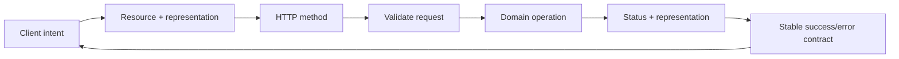
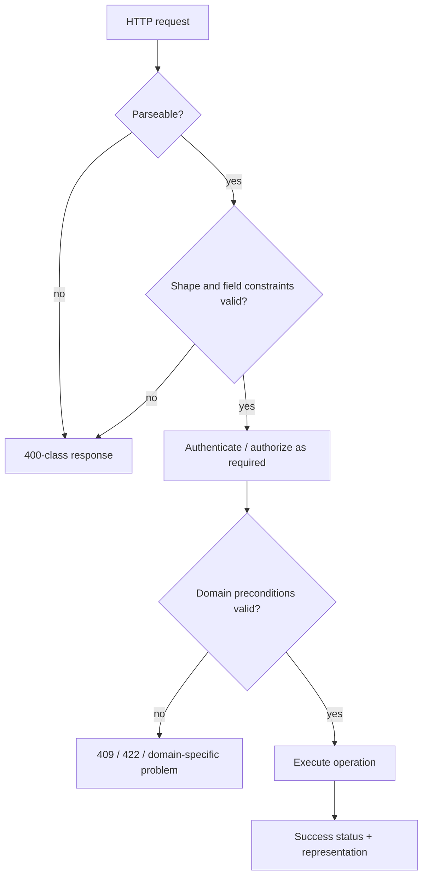
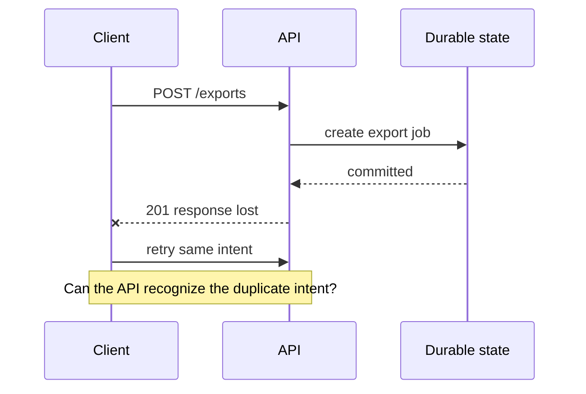

## An API is a contract, not a controller shape

An HTTP API exposes a contract that another program can depend on. That contract is larger than a route and a JSON body:

- the target **resource** and representation;
- the meaning of the HTTP method;
- accepted request fields and validation rules;
- status code semantics;
- success and error response shapes;
- pagination and ordering rules;
- compatibility guarantees;
- what a caller may safely retry.



If those semantics are accidental, clients end up depending on implementation details anyway. API design is the work of making the externally observable behavior intentional.

<TermBox term="API contract">
An **API contract** is the set of externally observable rules a client may rely on: identifiers, request and response fields, method semantics, status codes, error formats, ordering, pagination, and compatibility behavior.

**Why it matters:** server refactors are cheap only when they preserve the contract that clients actually observe.
</TermBox>

## 1. Start from resources and client intent

RFC 9110 describes HTTP as a uniform interface for interacting with resources through representations. That does not mean every API must be a textbook REST system. It does mean the target of each request and the meaning of the operation should be clear.

Prefer resource names that are stable domain concepts:

```text
/orders/{order_id}
/customers/{customer_id}/addresses
/exports/{export_id}
```

Be cautious with routes that merely mirror implementation functions:

```text
/doCreateOrder
/runCustomerAddressUpdate
/getExportStatusNow
```

An action-oriented endpoint can still be appropriate when the operation is a first-class domain command that does not fit ordinary resource mutation cleanly, for example:

```text
POST /orders/{order_id}/cancel
POST /accounts/{account_id}/rotate-key
```

The important question is not “does the URL contain a verb?” It is: **can a client predict the operation’s meaning, state transition, authorization boundary, and retry behavior?**

## 2. Give HTTP methods their real semantics

RFC 9110 defines standardized method semantics. Use those semantics instead of treating every method as a transport wrapper.

| Method | Typical API meaning | Important property |
| --- | --- | --- |
| `GET` | Retrieve a current representation | Safe and idempotent |
| `POST` | Ask the target resource to process submitted content | Not idempotent by method semantics |
| `PUT` | Replace the state/representation at a known target | Idempotent |
| `PATCH` | Apply a partial modification whose patch semantics the API must define | Do not assume retry safety automatically |
| `DELETE` | Remove the association/current state represented by the target | Idempotent by method semantics |

HTTP **idempotent** does not mean every repeated response is byte-for-byte identical. It means multiple identical requests have the same intended effect as one such request.

That distinction matters for retries. A repeated `DELETE` can return `204` first and `404` later while still satisfying idempotent method semantics. Logs, metrics, audit records, or timestamps can also differ.

<TermBox term="Idempotent method">
An **idempotent method** has the same intended server-side effect when the same request is applied multiple times as when it is applied once.

**Why it matters:** clients and intermediaries can reason more safely about retries when method semantics match the operation.
</TermBox>

### PUT versus PATCH

Use `PUT` when the client is sending the desired replacement state for a known target representation. Use `PATCH` when the API has a defined partial-update document or operation model.

Avoid ambiguous partial `PUT` behavior such as “missing field means leave unchanged today, but clear it tomorrow.” That destroys contract predictability.

## 3. Make status codes describe what happened

A status code is part of the response semantics, not decoration. RFC 9110 defines classes and individual meanings that clients use to decide what to do next.

Common choices include:

- `200 OK` — request succeeded and a representation/result is returned;
- `201 Created` — a new resource was created; identify it clearly, commonly with a `Location` header when appropriate;
- `202 Accepted` — work was accepted but is not complete yet;
- `204 No Content` — request succeeded and there is intentionally no response content;
- `400 Bad Request` — request is malformed or invalid at the protocol/application-input boundary;
- `401 Unauthorized` — authentication credentials are missing or not acceptable for the request;
- `403 Forbidden` — the server understood the request but refuses the action;
- `404 Not Found` — the target resource is unavailable to the request, sometimes also used deliberately to avoid resource disclosure;
- `409 Conflict` — the request conflicts with the current state of the target resource;
- `422 Unprocessable Content` — content syntax is understood but instructions cannot be processed.

Do not return `200` for every outcome and hide success/failure only inside a body such as `{ "ok": false }`. That forces every client, proxy, monitor, and SDK to reinvent protocol semantics.

Likewise, do not choose a status code only because a framework helper makes it convenient. Choose the code that communicates the observable result.

## 4. Validate at the boundary, then validate domain rules

Validation has at least two layers:

1. **Contract validation:** can this request be parsed, and does it satisfy the declared shape and basic constraints?
2. **Domain validation:** is this operation allowed by current business state?



Examples:

```text
Contract validation:
- required field missing
- invalid UUID syntax
- string exceeds declared length
- unsupported enum value

Domain validation:
- order is already shipped and cannot be cancelled
- username is already reserved
- account state forbids this transition
```

Do not let database constraint errors become your public validation vocabulary by accident. A unique-key exception is implementation evidence; the API still needs a stable client-facing meaning.

## 5. Design one stable error model

Clients should not need a different parser for every failure path.

RFC 9457 defines **Problem Details for HTTP APIs**, a machine-readable error representation built around members such as:

```json
{
  "type": "https://example.com/problems/order-state-conflict",
  "title": "Order cannot be cancelled",
  "status": 409,
  "detail": "The order has already shipped.",
  "instance": "/orders/ord_123/requests/req_456"
}
```

APIs may add extension members for stable application information such as field violations or a domain error code.

<TermBox term="Problem details">
**Problem details** are a structured HTTP error representation standardized by RFC 9457 so clients can inspect machine-readable failure information without every endpoint inventing a new error envelope.

**Why it matters:** a stable error model makes client behavior, observability, documentation, and evolution more consistent.
</TermBox>

Error responses should expose enough information for a client to act, but not raw stack traces, SQL text, secrets, internal hostnames, or implementation details that expand the attack surface.

### Separate human text from machine decisions

Do not make clients branch on an English `message` string.

Prefer a stable machine field such as `type` or a documented extension code, with human-readable `title`/`detail` free to improve over time.

## 6. Pagination is part of the contract

A collection endpoint without an explicit growth model eventually becomes a reliability problem.

Two common approaches are:

### Offset pagination

```text
GET /orders?limit=50&offset=100
```

Advantages:
- easy to understand;
- supports arbitrary page jumps.

Trade-offs:
- large offsets can become expensive depending on the datastore;
- concurrent inserts/deletes can shift results and cause duplicates or gaps.

### Cursor pagination

```text
GET /orders?limit=50&cursor=eyJ...
```

Advantages:
- can align with a stable indexed ordering;
- often behaves better for continuously changing datasets.

Trade-offs:
- clients cannot usually jump to arbitrary pages;
- the cursor becomes part of the compatibility surface.

Treat cursors as **opaque client tokens**. Do not require clients to decode a base64 payload and construct the next cursor themselves. The server should be free to change the internal cursor representation while preserving its documented behavior.

Always define ordering. “Return the next 50 rows” is incomplete unless the client knows what establishes before/after and how ties are handled.

## 7. Backward compatibility is a design constraint

Once clients are deployed independently, changing the API becomes a distributed rollout problem.

Changes that are commonly breaking include:

- removing or renaming response fields clients rely on;
- changing a field type or meaning;
- making an optional request field required;
- changing identifier semantics;
- changing pagination ordering or cursor interpretation;
- changing a success response into asynchronous behavior without changing its contract;
- changing authorization visibility in a way that invalidates documented client assumptions.

Additive changes are often safer, but not universally safe. Adding a new enum value can break a client that assumed the old set was exhaustive. Adding a huge nested field can affect bandwidth or parsing limits.

A compatibility review should ask:

```text
What can existing callers send?
What do existing callers expect to receive?
What assumptions might generated SDKs or strict decoders make?
Can old and new clients coexist during rollout?
Can we detect use of the old behavior before removing it?
```

### Version only when you need a real compatibility boundary

Versioning can be useful for a deliberate breaking contract, but `/v2` does not make migration free. You still need coexistence, documentation, telemetry, deprecation policy, and an exit plan for the old version.

Prefer evolving one contract compatibly when practical. Introduce a version boundary when the semantics genuinely cannot remain compatible.

## 8. Retry behavior belongs in the API design

A client can lose the response after the server commits the operation. From the client’s perspective, “did it happen?” is now ambiguous.



Method semantics help, but they are not the whole answer:

- retries of idempotent methods are easier to reason about;
- a non-idempotent `POST` may need an application-level idempotency key or natural deduplication identity when duplicate side effects are unacceptable;
- a retry policy still needs timeout, backoff, and retryable-error rules;
- an idempotency key must be scoped, persisted, and compared with the intended operation rather than treated as a magic header.

This lesson does **not** claim the canonical `idempotency` concept. The operating rule here is narrower: every API contract should make retry consequences explicit.

## 9. Keep authentication, authorization, rate limits, and caching visible but separate

Good API design composes with adjacent concerns without collapsing them together.

For each endpoint, document or make discoverable:

```text
authentication requirement
authorization/resource scope
rate-limit behavior when relevant
cacheability and validators when relevant
idempotency/retry behavior
```

But keep each concern’s semantics intact. `403` is not a rate-limit response. A cached representation is not an authorization decision. An idempotency key is not authentication.

## 10. Production scenario: a “small” response change breaks mobile clients

A mobile client consumes:

```json
{
  "id": "ord_123",
  "status": "shipped",
  "tracking_url": "https://carrier.example/track/123"
}
```

The server team refactors the API and ships:

```json
{
  "id": "ord_123",
  "status": { "code": "shipped", "label": "Shipped" },
  "tracking": { "url": "https://carrier.example/track/123" }
}
```

The new web client works because it deployed with the server. Older mobile versions use strict decoding and fail on the changed `status` type and missing `tracking_url`.

**Impact:** order-detail screens crash or render an error for users who have not upgraded the mobile app, even though the backend deployment itself is healthy.

**Root cause:** the team treated a server-side representation refactor as an internal implementation change. In reality, field names, field types, and response shape were part of a contract deployed independently into clients.

**Correct pattern:** preserve the old fields while introducing compatible additions, or create an explicit version/migration boundary for the breaking representation. Measure old-client usage, document deprecation, and remove old behavior only after the compatibility window is intentionally closed.

The engineering lesson is broader than “never change JSON.” The rule is: **know which behavior is externally observable, then evolve it with an explicit coexistence strategy.**

## 11. Review an endpoint as a contract

Before shipping a new endpoint or a breaking-looking change, walk the contract:

```text
1. What resource or domain intent is targeted?
2. Why is this HTTP method semantically correct?
3. What request shape is accepted, and where is validation performed?
4. What success statuses and representations can occur?
5. What stable error model can occur?
6. What are the authorization and visibility boundaries?
7. How does pagination/order work for collections?
8. What happens if the client retries after an ambiguous timeout?
9. Which changes must remain backward compatible?
10. How will we observe migration/deprecation before removal?
```

<details>
<summary>Self-check: design an asynchronous export endpoint</summary>

Suppose generating a CSV can take two minutes. Compare these contracts:

```text
A) POST /exports -> waits up to two minutes, then 200 with bytes
B) POST /exports -> 202 with an export/status resource the client can poll
```

A strong answer should discuss timeout budgets, ambiguous retries, job identity, authorization of the status resource, progress/error representation, and how the client discovers completion. If duplicate export jobs are costly, the contract also needs a duplicate-safety strategy rather than assuming the client will never retry.

</details>

## Operational checklist

- [ ] The endpoint names a stable resource or domain intent rather than mirroring controller functions accidentally.
- [ ] GET, POST, PUT, PATCH, and DELETE are used with documented semantics rather than interchangeably.
- [ ] Success and failure status codes describe the actual outcome.
- [ ] Request shape validation is separate from domain-state validation.
- [ ] Errors use one stable machine-readable model; clients do not branch on prose strings.
- [ ] Collection endpoints define limits, ordering, and pagination behavior.
- [ ] Cursors are opaque unless their structure is intentionally public contract.
- [ ] Backward compatibility is reviewed for field names, types, semantics, enums, and required inputs.
- [ ] Retry behavior is explicit, especially for side-effecting POST operations.
- [ ] Authentication, authorization, rate limits, caching, and idempotency stay visible as adjacent boundaries rather than being conflated.
- [ ] Deprecation/removal decisions have usage evidence and a coexistence plan.

## Agent rule

When changing an API, do not optimize only for server code cleanliness. Identify the observable contract first, list existing client assumptions, preserve compatible behavior by default, and escalate any intentional breaking change instead of hiding it inside a refactor.

## Primary sources

- [RFC 9110 — HTTP Semantics](https://www.rfc-editor.org/rfc/rfc9110.html)
- [RFC 9457 — Problem Details for HTTP APIs](https://www.rfc-editor.org/rfc/rfc9457.html)
