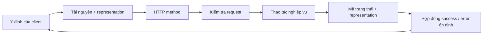
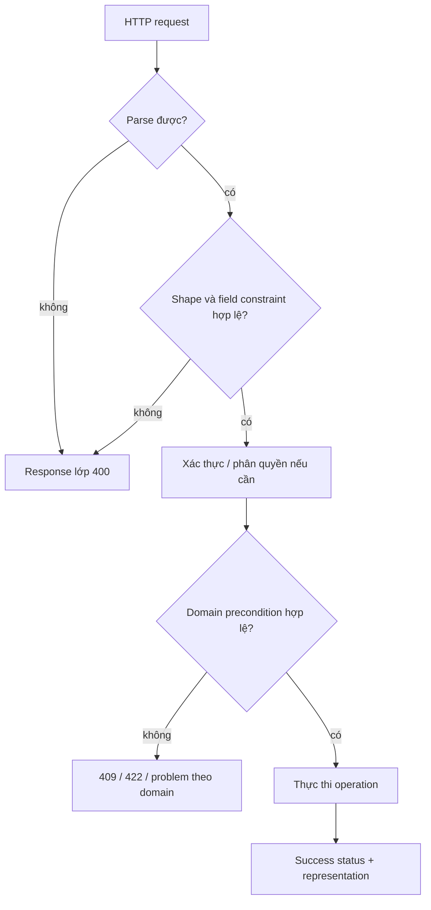
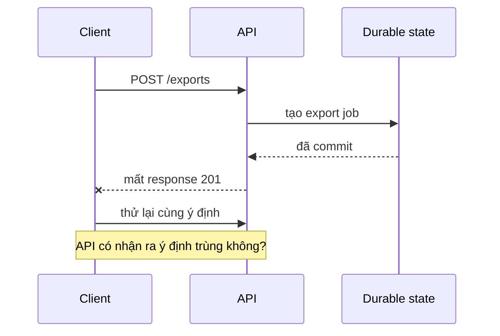

## API là một hợp đồng, không phải hình dạng của controller

Một HTTP API phơi bày một **hợp đồng** mà chương trình khác có thể dựa vào. Hợp đồng đó lớn hơn route và JSON body:

- **tài nguyên** đích và representation;
- ý nghĩa của HTTP method;
- trường request được chấp nhận và quy tắc kiểm tra dữ liệu;
- ngữ nghĩa mã trạng thái;
- hình dạng response thành công và response lỗi;
- quy tắc phân trang và sắp xếp;
- bảo đảm tương thích ngược;
- thao tác nào client có thể thử lại an toàn.



Nếu các ngữ nghĩa này chỉ hình thành tình cờ, client vẫn sẽ phụ thuộc vào chi tiết triển khai. Thiết kế API là biến hành vi quan sát được thành quyết định có chủ đích.

<TermBox term="Hợp đồng API">
**Hợp đồng API** là tập quy tắc quan sát được mà client được phép dựa vào: identifier, request/response field, method semantics, mã trạng thái, mô hình lỗi, ordering, pagination và hành vi tương thích.

**Tại sao quan trọng:** refactor phía server chỉ thực sự nội bộ khi nó giữ nguyên hợp đồng mà client đang quan sát.
</TermBox>

## 1. Bắt đầu từ tài nguyên và ý định của client

RFC 9110 mô tả HTTP như một giao diện thống nhất để tương tác với tài nguyên thông qua representation. Điều đó không có nghĩa mọi API phải là một hệ REST giáo khoa. Nó có nghĩa target của request và ý nghĩa của operation cần rõ ràng.

Ưu tiên tên tài nguyên là khái niệm nghiệp vụ ổn định:

```text
/orders/{order_id}
/customers/{customer_id}/addresses
/exports/{export_id}
```

Thận trọng với route chỉ phản chiếu tên hàm triển khai:

```text
/doCreateOrder
/runCustomerAddressUpdate
/getExportStatusNow
```

Endpoint mang tính hành động vẫn có thể hợp lý khi thao tác là một domain command độc lập, ví dụ:

```text
POST /orders/{order_id}/cancel
POST /accounts/{account_id}/rotate-key
```

Câu hỏi quan trọng không phải “URL có động từ không?” mà là: **client có dự đoán được ý nghĩa, state transition, ranh giới phân quyền và hậu quả khi thử lại hay không?**

## 2. Dùng HTTP method đúng ngữ nghĩa

RFC 9110 định nghĩa ngữ nghĩa cho các method chuẩn. Đừng coi method chỉ là vỏ vận chuyển cho cùng một kiểu handler.

| Method | Ý nghĩa API thường gặp | Thuộc tính quan trọng |
| --- | --- | --- |
| `GET` | Đọc representation hiện tại | Safe và idempotent |
| `POST` | Yêu cầu target xử lý content gửi lên | Không idempotent theo method semantics |
| `PUT` | Thay thế trạng thái/representation tại target đã biết | Idempotent |
| `PATCH` | Áp thay đổi một phần theo patch semantics mà API phải định nghĩa | Không tự động coi là retry-safe |
| `DELETE` | Loại bỏ association/trạng thái hiện tại của target | Idempotent theo method semantics |

HTTP **idempotent** không có nghĩa response lặp lại phải giống từng byte. Nó có nghĩa nhiều request giống nhau có **intended effect** tương đương một request.

Vì vậy một `DELETE` có thể trả `204` ở lần đầu và `404` ở lần sau mà vẫn giữ ngữ nghĩa idempotent. Log, metric, audit record hoặc timestamp cũng có thể khác.

<TermBox term="Method idempotent">
Một **method idempotent** có cùng intended server-side effect khi áp cùng request nhiều lần như khi áp một lần.

**Tại sao quan trọng:** client và intermediary dễ suy luận hành vi thử lại hơn khi method semantics khớp với operation.
</TermBox>

### PUT và PATCH

Dùng `PUT` khi client gửi trạng thái thay thế mong muốn cho một target đã biết. Dùng `PATCH` khi API có mô hình partial update rõ ràng.

Tránh kiểu `PUT` nhập nhằng như “field bị thiếu hôm nay nghĩa là giữ nguyên, ngày mai lại nghĩa là xóa”. Hợp đồng như vậy không thể dự đoán ổn định.

## 3. Mã trạng thái phải mô tả điều đã xảy ra

Mã trạng thái là một phần của response semantics. RFC 9110 định nghĩa các lớp và ý nghĩa để client quyết định bước tiếp theo.

Một số lựa chọn thường gặp:

- `200 OK` — request thành công và có representation/kết quả trả về;
- `201 Created` — tài nguyên mới đã được tạo; chỉ rõ tài nguyên đó, thường có thể dùng `Location`;
- `202 Accepted` — công việc đã được nhận nhưng chưa hoàn tất;
- `204 No Content` — request thành công và cố ý không có response content;
- `400 Bad Request` — request sai cú pháp hoặc không hợp lệ ở ranh giới input;
- `401 Unauthorized` — thiếu hoặc không chấp nhận được credential xác thực;
- `403 Forbidden` — server hiểu request nhưng từ chối hành động;
- `404 Not Found` — tài nguyên đích không khả dụng với request;
- `409 Conflict` — request xung đột với trạng thái hiện tại của tài nguyên;
- `422 Unprocessable Content` — hiểu được cú pháp content nhưng không thể xử lý instruction.

Đừng trả `200` cho mọi outcome rồi giấu lỗi bên trong `{ "ok": false }`. Cách đó buộc client, proxy, monitor và SDK phải tự phát minh protocol semantics.

Cũng đừng chọn status code chỉ vì framework helper thuận tiện. Hãy chọn mã mô tả kết quả quan sát được.

## 4. Kiểm tra dữ liệu ở boundary, rồi kiểm tra quy tắc nghiệp vụ

Validation có ít nhất hai lớp:

1. **Kiểm tra hợp đồng:** request có parse được không, có đúng shape và basic constraint đã công bố không?
2. **Kiểm tra nghiệp vụ:** operation này có hợp lệ với business state hiện tại không?



Ví dụ:

```text
Kiểm tra hợp đồng:
- thiếu field bắt buộc
- UUID sai cú pháp
- string vượt độ dài đã công bố
- enum value không hỗ trợ

Kiểm tra nghiệp vụ:
- order đã ship nên không thể cancel
- username đã được giữ
- trạng thái account không cho phép transition này
```

Đừng để database constraint error vô tình trở thành từ vựng lỗi công khai. Unique-key exception là bằng chứng triển khai; API vẫn cần ý nghĩa ổn định cho client.

## 5. Thiết kế một mô hình lỗi ổn định

Client không nên cần một parser khác nhau cho từng failure path.

RFC 9457 định nghĩa **Problem Details for HTTP APIs**, một representation lỗi máy đọc được với các member như:

```json
{
  "type": "https://example.com/problems/order-state-conflict",
  "title": "Order cannot be cancelled",
  "status": 409,
  "detail": "The order has already shipped.",
  "instance": "/orders/ord_123/requests/req_456"
}
```

API có thể thêm extension member cho thông tin ứng dụng ổn định như field violation hoặc domain error code.

<TermBox term="Chi tiết lỗi có cấu trúc">
**Problem details** là representation lỗi HTTP có cấu trúc theo RFC 9457, giúp client đọc failure bằng máy mà không cần mỗi endpoint tự tạo một error envelope khác nhau.

**Tại sao quan trọng:** mô hình lỗi ổn định làm client behavior, observability, documentation và evolution nhất quán hơn.
</TermBox>

Response lỗi cần đủ thông tin để client hành động, nhưng không nên lộ stack trace, SQL text, secret, internal hostname hay chi tiết triển khai nhạy cảm.

### Tách text cho người khỏi quyết định cho máy

Đừng để client branch theo chuỗi `message` tiếng Anh.

Ưu tiên machine field ổn định như `type` hoặc extension code đã document; `title` và `detail` có thể cải thiện câu chữ theo thời gian.

## 6. Phân trang là một phần của hợp đồng

Collection endpoint không có growth model rõ ràng cuối cùng sẽ thành vấn đề reliability.

### Phân trang theo offset

```text
GET /orders?limit=50&offset=100
```

Ưu điểm:
- dễ hiểu;
- có thể nhảy tới trang tùy ý.

Đánh đổi:
- offset lớn có thể đắt tùy datastore;
- insert/delete đồng thời có thể làm kết quả dịch chuyển, tạo duplicate hoặc gap.

### Phân trang theo cursor

```text
GET /orders?limit=50&cursor=eyJ...
```

Ưu điểm:
- có thể bám stable indexed ordering;
- thường phù hợp hơn với dataset thay đổi liên tục.

Đánh đổi:
- client thường không nhảy tới trang tùy ý;
- cursor trở thành một phần compatibility surface.

Hãy coi cursor là **opaque token** đối với client. Đừng bắt client decode payload base64 rồi tự dựng cursor kế tiếp. Server cần được phép đổi internal representation của cursor trong khi giữ behavior đã công bố.

Luôn định nghĩa ordering. “Trả 50 row tiếp theo” chưa đủ nếu client không biết tiêu chí before/after và tie-breaker.

## 7. Tương thích ngược là một design constraint

Khi client được deploy độc lập, thay đổi API trở thành distributed rollout problem.

Những thay đổi thường gây break gồm:

- xóa hoặc đổi tên response field mà client đang dùng;
- đổi kiểu hoặc ý nghĩa của field;
- biến request field tùy chọn thành bắt buộc;
- đổi semantics của identifier;
- đổi ordering hoặc cách hiểu cursor;
- đổi từ xử lý đồng bộ sang bất đồng bộ mà không đổi contract;
- đổi visibility/authorization theo cách phá assumption đã document.

Additive change thường an toàn hơn nhưng không tuyệt đối. Thêm enum value mới vẫn có thể làm client cũ lỗi nếu nó giả định tập enum là exhaustive. Thêm nested field rất lớn có thể ảnh hưởng bandwidth hoặc parser limit.

Khi review compatibility, hỏi:

```text
Caller cũ có thể gửi gì?
Caller cũ mong nhận gì?
Generated SDK hoặc strict decoder đang giả định điều gì?
Client cũ và mới có cùng tồn tại trong rollout được không?
Có đo được usage của behavior cũ trước khi xóa không?
```

### Chỉ version khi thật sự cần compatibility boundary

Versioning hữu ích khi có breaking contract có chủ đích, nhưng `/v2` không làm migration miễn phí. Vẫn cần coexistence, documentation, telemetry, deprecation policy và kế hoạch tắt version cũ.

Ưu tiên evolve một contract theo hướng tương thích khi khả thi. Tạo version boundary khi semantics thực sự không thể giữ tương thích ngược.

## 8. Hành vi thử lại thuộc về thiết kế API

Client có thể mất response sau khi server đã commit operation. Từ góc nhìn client, câu hỏi “đã xảy ra chưa?” trở nên nhập nhằng.



Method semantics giúp suy luận nhưng chưa đủ:

- thử lại method idempotent dễ reasoning hơn;
- `POST` có side effect có thể cần idempotency key ở application layer hoặc một natural deduplication identity nếu duplicate không chấp nhận được;
- retry policy vẫn cần timeout, backoff và quy tắc error nào được thử lại;
- idempotency key cần scope, persistence và so sánh với intended operation, không phải magic header.

Lesson này **không claim** canonical concept `idempotency`. Operating rule ở đây hẹp hơn: mọi API contract cần làm rõ hậu quả khi client thử lại.

## 9. Giữ xác thực, phân quyền, rate limit và caching ở đúng boundary

Thiết kế API tốt kết hợp với các concern lân cận nhưng không trộn semantics của chúng.

Với mỗi endpoint, cần document hoặc làm discoverable:

```text
yêu cầu xác thực
phạm vi phân quyền/tài nguyên
rate-limit behavior khi có
cacheability và validator khi có
idempotency / retry behavior
```

Nhưng mỗi concern vẫn có meaning riêng. `403` không phải rate-limit response. Cached representation không phải authorization decision. Idempotency key không phải authentication.

## 10. Tình huống production: một thay đổi response “nhỏ” làm client di động lỗi

Một mobile client đang dùng:

```json
{
  "id": "ord_123",
  "status": "shipped",
  "tracking_url": "https://carrier.example/track/123"
}
```

Đội server refactor API và deploy:

```json
{
  "id": "ord_123",
  "status": { "code": "shipped", "label": "Shipped" },
  "tracking": { "url": "https://carrier.example/track/123" }
}
```

Web client mới vẫn chạy vì deploy cùng server. Các bản mobile cũ dùng strict decoding và lỗi vì kiểu của `status` đã đổi, còn `tracking_url` biến mất.

**Hậu quả:** màn order detail crash hoặc render lỗi cho người dùng chưa nâng cấp app dù backend deployment nhìn chung healthy.

**Nguyên nhân cốt lõi:** đội ngũ xem refactor representation phía server là thay đổi nội bộ. Thực tế field name, field type và response shape đã là hợp đồng được deploy độc lập vào client.

**Cách khắc phục chuẩn:** giữ field cũ trong giai đoạn thêm field mới theo hướng tương thích, hoặc tạo version/migration boundary rõ ràng cho breaking representation. Đo usage của client cũ, document deprecation và chỉ xóa behavior cũ sau khi compatibility window được đóng có chủ đích.

Bài học không phải “không bao giờ đổi JSON”. Quy tắc là: **xác định hành vi nào quan sát được từ bên ngoài, rồi evolve nó bằng chiến lược coexistence rõ ràng.**

## 11. Review endpoint như một hợp đồng

Trước khi ship endpoint mới hoặc thay đổi có vẻ breaking, đi qua checklist reasoning:

```text
1. Target là tài nguyên hoặc domain intent nào?
2. Vì sao HTTP method này đúng về semantics?
3. Request shape nào được chấp nhận và validation ở đâu?
4. Có những success status/representation nào?
5. Có những error model ổn định nào?
6. Ranh giới authorization và visibility là gì?
7. Pagination/order hoạt động thế nào?
8. Điều gì xảy ra nếu client retry sau ambiguous timeout?
9. Thay đổi nào bắt buộc giữ backward compatibility?
10. Ta quan sát migration/deprecation thế nào trước khi remove behavior cũ?
```

<details>
<summary>Tự kiểm tra: thiết kế endpoint export bất đồng bộ</summary>

Giả sử tạo CSV mất hai phút. So sánh:

```text
A) POST /exports -> chờ tối đa hai phút, rồi 200 kèm bytes
B) POST /exports -> 202 kèm một export/status resource để client poll
```

Một câu trả lời tốt cần bàn về timeout budget, ambiguous retry, job identity, authorization của status resource, representation cho progress/error và cách client biết công việc đã hoàn tất. Nếu duplicate export job gây tốn kém, contract cũng cần chiến lược lặp lại an toàn thay vì giả định client sẽ không bao giờ thử lại.

</details>

## Checklist vận hành

- [ ] Endpoint biểu diễn tài nguyên hoặc domain intent ổn định thay vì phản chiếu controller function tình cờ.
- [ ] GET, POST, PUT, PATCH và DELETE được dùng với semantics đã document, không dùng thay thế lẫn nhau tùy tiện.
- [ ] Mã trạng thái success/failure mô tả outcome thực tế.
- [ ] Kiểm tra request shape được tách khỏi kiểm tra domain state.
- [ ] Error response dùng một mô hình máy đọc được ổn định; client không branch theo prose string.
- [ ] Collection endpoint định nghĩa limit, ordering và phân trang.
- [ ] Cursor là opaque token trừ khi cấu trúc của nó được cố ý công khai thành contract.
- [ ] Tương thích ngược được review cho field name, type, semantics, enum và required input.
- [ ] Hành vi thử lại rõ ràng, đặc biệt với POST có side effect.
- [ ] Authentication, authorization, rate limit, caching và idempotency giữ đúng boundary riêng.
- [ ] Quyết định deprecate/remove có usage evidence và coexistence plan.

## Quy tắc cho agent

Khi thay đổi API, đừng chỉ tối ưu cho code server sạch hơn. Trước hết hãy xác định observable contract, liệt kê assumption của client hiện hữu, mặc định giữ behavior tương thích và chuyển breaking change có chủ đích cho người quyết định thay vì giấu nó trong một refactor.

## Nguồn chính

- [RFC 9110 — HTTP Semantics](https://www.rfc-editor.org/rfc/rfc9110.html)
- [RFC 9457 — Problem Details for HTTP APIs](https://www.rfc-editor.org/rfc/rfc9457.html)
