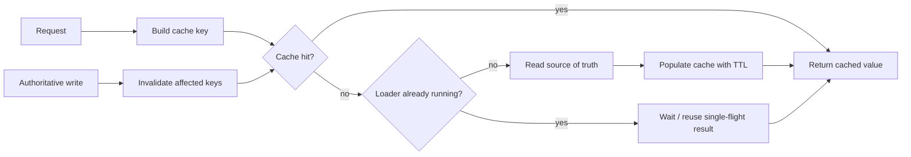
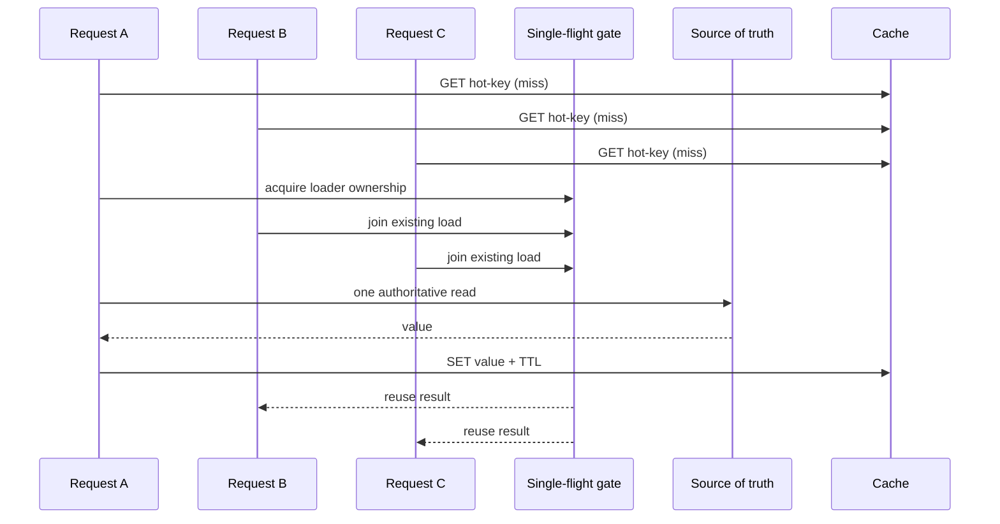

# Application Caching: Trade Freshness for Less Work Deliberately

## TL;DR

An application cache is **derived state**. The authoritative database, service, or durable record remains the **source of truth**; the cache exists to avoid repeating expensive reads or computation when serving a slightly older or reusable answer is acceptable.

A useful reasoning loop is:

1. identify the expensive work you want to avoid;
2. define the exact input dimensions that make two answers equivalent;
3. build a cache key from those dimensions;
4. state the allowed staleness budget before choosing a TTL;
5. decide how writes invalidate or supersede cached values;
6. protect hot misses from becoming a cache stampede;
7. decide whether misses and cache failures fall back safely;
8. measure hit rate, miss rate, cache latency, origin latency, evictions, and origin load.



The goal is not “maximize cache hits.” The goal is **reduce work without hiding unacceptable staleness, leaking data across key scopes, or moving overload from normal traffic into miss storms**.

<TermBox term="Cache-aside">
**Cache-aside** is a pattern where the application checks the cache first, loads from the authoritative source on a miss, and then stores the derived result for later reads.

**Why it matters:** the cache does not become the system of record. A cache loss should reduce performance, not erase business truth.
</TermBox>

## 1. Keep one authoritative source

Caching becomes dangerous when code starts treating cached state as equally authoritative to durable state.

For a typical cache-aside read:

```text
1. derive cache key from request identity
2. GET cache
3. if hit: return cached value
4. if miss: read authoritative source
5. SET cache with bounded TTL
6. return source value
```

For a write, prefer reasoning from the authoritative mutation first:

```text
1. validate and write source of truth
2. commit the authoritative change
3. invalidate or supersede affected cache entries
4. let later reads repopulate derived state
```

If the cache is unavailable, the service may be able to fall back to the source of truth. Whether that is safe depends on capacity. A cache outage that makes every request hit a database can overload the database, so fallback behavior needs a budget rather than a slogan.

<TermBox term="Source of truth">
A **source of truth** is the authoritative state whose successful write defines business reality. A cache may reproduce or transform that state, but losing the cache must not redefine the business fact.
</TermBox>

## 2. A cache key is a correctness boundary

Two requests may share one cached value only if every dimension that can change the answer is represented by the key or guaranteed irrelevant.

Suppose pricing depends on:

```text
tenant_id
product_id
currency
pricing_plan
locale
```

Then a key such as:

```text
price:{product_id}
```

is not merely an optimization bug. It can return one tenant's or currency's answer to another request.

A safer conceptual key is:

```text
price:v3:{tenant_id}:{product_id}:{currency}:{pricing_plan}:{locale}
```

The `v3` namespace is useful when the cached representation or key semantics change. Versioned namespaces can make broad migrations easier than trying to discover and delete every legacy key perfectly.

Do not place secrets directly in cache keys if keys can appear in logs, metrics, dashboards, or administrative tooling. Use stable non-secret identifiers or hashes where appropriate.

## 3. Choose TTL from a staleness budget, not habit

<TermBox term="TTL">
A cache entry's **time to live (TTL)** is the period after which the cache expires that entry and a later read must refresh or miss.

**Why it matters:** TTL bounds how long a value can survive without an explicit invalidation, but it does not make a cached value fresh at every moment.
</TermBox>

A TTL is a consistency decision with performance consequences:

- shorter TTL → fresher average reads, more misses, more origin load;
- longer TTL → higher hit rate, less origin work, longer stale windows;
- no TTL → potentially excellent hit rate and indefinite stale data unless invalidation is complete.

State a business freshness requirement first:

```text
Product description: stale up to 10 minutes is acceptable.
Inventory availability: stale confirmation is not acceptable.
Feature rollout percentage: stale for 30 seconds is acceptable.
Authorization decision: stale privilege may be security-sensitive.
```

Then choose whether that requirement can be met with TTL alone, explicit invalidation, versioned data, or no cache at that decision boundary.

## 4. Invalidation is part of the write path design

“Cache invalidation is hard” is true but incomplete. The actionable question is: **which authoritative changes make which cached answers invalid?**

Cache-aside commonly uses invalidate-on-write:

```text
update database
commit
DEL cache key
```

Deleting is often easier to reason about than trying to update the database and cache to exactly the same value as two independent writes. The next reader rebuilds from the source of truth.

But ordering still matters. Invalidating before the authoritative commit can create this race:

```text
writer: DEL cache
reader: cache miss -> reads old database value -> repopulates old cache
writer: commits new database value
```

Now the stale value can survive until TTL or another invalidation. Treat invalidation as a concurrency problem, not just a cache API call.

For complex derived views, invalidating every dependent key synchronously may be impractical. Alternatives include versioned keys, dependency tags, durable invalidation events, or accepting a documented bounded-staleness window. Each option moves complexity somewhere different.

## 5. Protect hot keys from cache stampedes

A cache normally reduces origin traffic. A synchronized hot-key expiry can reverse that benefit instantly:

```text
10,000 callers -> same expired key -> 10,000 database reads
```

This is a **cache stampede**.



A **single-flight** or per-key loader gate lets one caller refresh while overlapping callers wait briefly or reuse the same result. In distributed deployments, an in-process single-flight only collapses duplicates inside one replica; a hot key can still be loaded once per replica. Decide whether that reduction is sufficient before adding a distributed coordination mechanism.

Other techniques include TTL jitter so many keys do not expire simultaneously, refresh-ahead for predictable hot data, and stale-while-revalidate where serving a bounded stale value is acceptable. These are latency/freshness choices, not universal defaults.

## 6. Negative caching prevents repeated expensive misses

Repeatedly looking up a nonexistent identifier can still be expensive. **Negative caching** stores a short-lived sentinel such as “not found” so identical misses do not keep reaching the source.

Use a shorter TTL than normal positive entries when creation can make the object appear soon:

```text
positive product entry: 5 minutes
not-found sentinel: 15 seconds
```

Do not confuse “not found” with “temporarily failed to load.” Caching a timeout, permission error, or dependency outage as if the object did not exist can convert a transient failure into a misleading durable response.

Negative caching also needs abuse controls. Attackers or broken clients can generate unbounded random keys, consuming memory even when every lookup is a miss.

## 7. Process-local and shared caches solve different problems

An **in-process cache** is fast and simple, but each service replica owns a different copy. That means:

- warm state differs by replica;
- memory use is duplicated;
- invalidation must reach every relevant replica or rely on expiry;
- autoscaling creates cold caches;
- a per-process single-flight does not collapse misses across replicas.

A **shared cache** gives replicas a common derived-state layer and centralizes hit/miss behavior, but adds a network hop, another dependency, shared capacity limits, and its own failure modes.

Do not adopt a shared cache just because the service has multiple replicas. First ask whether local staleness and duplication are actually a problem. Conversely, do not assume local caches provide globally coherent invalidation when they cannot observe each other's memory.

## 8. Cache failure behavior must protect the source

Common failure modes include:

- cache timeout;
- partial cache outage;
- eviction surge;
- cold restart;
- mass TTL expiry;
- invalidation lag;
- serialization/schema mismatch;
- one hot key dominating bandwidth or CPU.

“On cache error, query the database” can be correct for a small fraction of traffic and catastrophic for 100% of traffic.

Use explicit timeouts on cache calls. Decide whether a request can fall back, serve bounded stale data, shed load, or fail fast. Protect the source of truth with concurrency limits, rate limits, and capacity-aware degradation where appropriate.

A cache must remain an optimization layer, but the architecture must acknowledge that the rest of the system may have been sized assuming the cache normally absorbs load.

## Production scenario: tenant-blind pricing cache

A B2B pricing API computes a price from `tenant_id`, `product_id`, `currency`, and contract tier. To reduce database and rules-engine load, an optimization caches results for five minutes under:

```text
price:{product_id}
```

Tenant A requests a discounted USD price first. Tenant B then requests the same product in EUR under a different contract. The service returns Tenant A's cached value because the key omitted dimensions that affect the answer.

**Impact:** customers receive incorrect prices; some see another tenant's negotiated commercial terms, creating financial and confidentiality exposure.

**Root cause:** the team treated cache-key design as a performance detail. The key did not encode the complete equivalence class for the cached answer, and tests exercised hit/miss behavior without varying tenant, currency, and contract dimensions.

**Correct pattern:** define the source of truth and answer identity first. Include every relevant non-secret dimension in the cache key or deliberately cache a lower-level tenant-independent computation. Add cross-dimension tests, invalidate affected namespaces after authoritative pricing changes, choose TTL from the tolerated staleness window, and monitor misses/origin load so a cache incident does not silently overload pricing dependencies.

The deeper lesson is that cache correctness is mostly about **identity and time**: which requests are allowed to reuse one answer, and for how long.

## What to measure

Hit rate is useful, but it is not enough. Observe at least:

- cache hit rate and miss rate by operation/key class;
- cache request latency and timeout/error rate;
- origin latency on cache misses;
- origin request volume attributable to misses;
- evictions and memory pressure where exposed;
- stampede/single-flight wait counts for hot keys;
- invalidation volume and lag where invalidation is asynchronous;
- stale-read incidents for business-sensitive paths.

A 99% hit rate can still be unhealthy if the remaining 1% arrives as a synchronized burst that exceeds database capacity.

## Common mistakes

### Caching before defining freshness

Choosing `TTL = 5m` because it is common is not a requirement. State the acceptable stale window first.

### Omitting identity dimensions from keys

If tenant, locale, currency, authorization scope, feature set, or representation version changes the answer, omitting it can produce wrong-data or data-leak bugs.

### Invalidating before the source commit

A concurrent reader can repopulate the old value between invalidation and commit. Reason about write/invalidation ordering explicitly.

### Retrying the source without stampede control

When a hot key expires, uncoordinated fallback requests can overload the source precisely when the cache is least helpful.

### Treating every error as cacheable “not found”

Negative caching should represent a real absence, not a dependency timeout or authorization failure.

### Assuming local cache is globally coherent

Replica-local memory cannot magically invalidate itself when another process writes authoritative state.

## Self-check

A profile service runs on 20 replicas. Each replica keeps an in-process cache with a 10-minute TTL. A user updates their display name through replica 3, which deletes only replica 3's local cache entry. The database commit succeeds. Requests then land on replicas 8 and 12 and continue showing the old name.

Is the cache “working,” and what design question was missed?

<details>
<summary>Show the reasoning</summary>

The cache is working according to its local mechanics, but the system's freshness requirement was not encoded in the invalidation design. Each process owns an independent cache, so deleting one replica's entry does not invalidate the others.

Possible fixes depend on the actual requirement: shorten the TTL if bounded staleness is acceptable; broadcast/deliver invalidation to relevant replicas; use versioned keys or a shared cache; or avoid caching that field if fresh reads are required. The right answer follows from the required stale window and failure tolerance, not from a preference for one cache product.

</details>

## Application cache review checklist

- [ ] **Source:** Is the authoritative source of truth explicit?
- [ ] **Benefit:** What expensive read or computation does the cache avoid?
- [ ] **Key:** Does the cache key include every dimension that changes the answer?
- [ ] **Secrets:** Are keys safe to expose in operational tooling?
- [ ] **Freshness:** What stale window is acceptable, and does TTL match it?
- [ ] **Invalidation:** Which authoritative writes invalidate which keys, and in what order?
- [ ] **Stampede:** What happens when a hot key expires under high concurrency?
- [ ] **Negative caching:** Are real absences distinguished from transient failures?
- [ ] **Scope:** Is the cache process-local or shared, and does the team understand that coordination boundary?
- [ ] **Failure:** Can cache failure overload the source of truth?
- [ ] **Evidence:** Can operators see hit/miss rates, cache latency, origin latency/load, evictions, and hot-key behavior?

## Agent rule

When proposing or reviewing an application cache, do not stop at “add Redis” or “add a TTL.” Extract the authoritative source, the full answer identity used to build the cache key, the allowed stale window, invalidation ordering, miss concurrency, and fallback capacity. Treat cached data as derived state and verify that cache failure degrades performance before it degrades correctness.

## Related concepts

- **Database Indexes & Query Plans** — fix avoidable source inefficiency before hiding every slow query behind a cache.
- **Backend Concurrency** — invalidation ordering and stampede protection are concurrency problems.
- **Background Jobs** — refresh-ahead or durable invalidation can be asynchronous work when the freshness contract allows it.
- **HTTP Caching / CDN Behavior** — browser, proxy, and edge caches have different keying and protocol semantics from application data caches.
- **Idempotency** — repeated writes and cache invalidation often coexist in retried request paths.

Continue through the [Backend Systems](/docs/learning-paths/backend-systems) path toward message queues, rate limiting, idempotency, and service resilience.

## Sources

Primary Redis references verified on **2026-09-10**:

- [Redis documentation — Cache-aside](https://redis.io/docs/latest/develop/use-cases/cache-aside/)
- [Redis documentation — Cache-aside with Node.js](https://redis.io/docs/latest/develop/use-cases/cache-aside/nodejs/)

These references are concrete examples, not a requirement to use Redis. The cache-aside reasoning model applies to in-process caches, shared key-value caches, memoized computations, and other derived-state layers with different operational characteristics.

This lesson is **evolving** with a 180-day review target because cache implementations, operational guidance, and provider capabilities change even though source-of-truth, identity, freshness, and invalidation reasoning remain durable.
