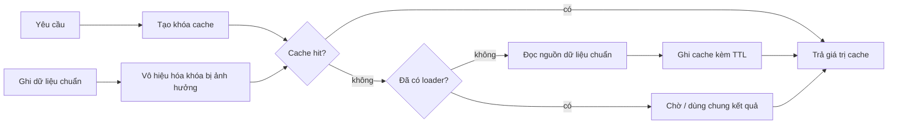
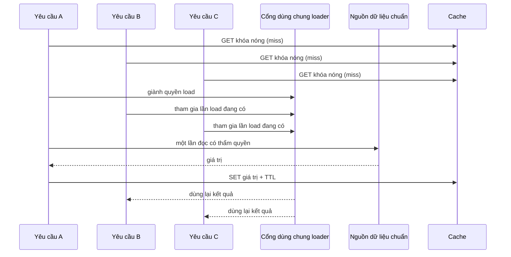

# Cache ứng dụng: chủ động đổi độ tươi mới lấy ít công việc hơn

## Tóm tắt

Cache ứng dụng là **trạng thái dẫn xuất**. Cơ sở dữ liệu, dịch vụ hoặc bản ghi bền vững có thẩm quyền vẫn là **nguồn dữ liệu chuẩn**; cache tồn tại để tránh lặp lại truy vấn hoặc phép tính tốn kém khi hệ thống chấp nhận tái sử dụng một kết quả trong một khoảng thời gian nhất định.

Một vòng lập luận hữu ích là:

1. xác định công việc tốn kém muốn tránh;
2. xác định chính xác các chiều đầu vào khiến hai câu trả lời được xem là tương đương;
3. tạo khóa cache từ các chiều đó;
4. nêu ngân sách độ cũ chấp nhận được trước khi chọn TTL;
5. quyết định thay đổi ở nguồn chuẩn sẽ vô hiệu hóa hoặc thay thế cache thế nào;
6. bảo vệ miss trên khóa nóng để không tạo dồn tải kiểu bầy đàn;
7. quyết định cách xử lý khi miss hoặc cache lỗi;
8. đo tỷ lệ hit, tỷ lệ miss, độ trễ cache, độ trễ nguồn, eviction và tải lên nguồn chuẩn.



Mục tiêu không phải “tăng tỷ lệ cache hit bằng mọi giá”. Mục tiêu là **giảm công việc mà không che giấu độ cũ không chấp nhận được, không rò dữ liệu qua sai phạm vi khóa và không biến tải bình thường thành bão miss**.

<TermBox term="Mẫu cache đứng bên">
**Cache đứng bên** là cách ứng dụng kiểm tra cache trước, đọc nguồn dữ liệu chuẩn khi miss, rồi lưu kết quả dẫn xuất để các lần đọc sau dùng lại.

**Vì sao quan trọng:** cache không trở thành hệ thống ghi nhận sự thật. Mất cache nên chủ yếu làm giảm hiệu năng, không được làm mất sự thật nghiệp vụ.
</TermBox>

## 1. Giữ một nguồn dữ liệu có thẩm quyền

Caching trở nên nguy hiểm khi mã nguồn bắt đầu coi trạng thái trong cache có thẩm quyền ngang với trạng thái bền vững.

Một luồng đọc kiểu cache đứng bên thường là:

```text
1. tạo khóa cache từ định danh yêu cầu
2. GET cache
3. nếu hit: trả giá trị cache
4. nếu miss: đọc nguồn dữ liệu chuẩn
5. SET cache với TTL có giới hạn
6. trả giá trị từ nguồn
```

Với thao tác ghi, hãy lập luận từ thay đổi có thẩm quyền trước:

```text
1. kiểm tra và ghi nguồn dữ liệu chuẩn
2. commit thay đổi có thẩm quyền
3. vô hiệu hóa hoặc thay thế các entry cache liên quan
4. lần đọc sau tái tạo trạng thái dẫn xuất
```

Nếu cache không dùng được, dịch vụ có thể quay về đọc nguồn chuẩn. Điều đó chỉ an toàn khi nguồn có đủ năng lực. Một sự cố cache khiến mọi yêu cầu cùng đổ vào cơ sở dữ liệu có thể làm cơ sở dữ liệu quá tải, vì vậy fallback phải có ngân sách tải rõ ràng.

<TermBox term="Nguồn dữ liệu chuẩn">
**Nguồn dữ liệu chuẩn** là trạng thái có thẩm quyền mà một lần ghi thành công sẽ xác định sự thật nghiệp vụ. Cache có thể sao chép hoặc biến đổi trạng thái đó, nhưng mất cache không được thay đổi sự thật nghiệp vụ.
</TermBox>

## 2. Khóa cache là một ranh giới đúng-sai

Hai yêu cầu chỉ được dùng chung một giá trị cache nếu mọi chiều có thể làm thay đổi câu trả lời đều nằm trong khóa hoặc được bảo đảm là không liên quan.

Giả sử giá bán phụ thuộc vào:

```text
tenant_id
product_id
currency
pricing_plan
locale
```

Khi đó khóa:

```text
price:{product_id}
```

không chỉ là lỗi tối ưu. Nó có thể trả câu trả lời của tenant hoặc đơn vị tiền tệ này cho tenant khác.

Một khóa hợp lý hơn về mặt khái niệm là:

```text
price:v3:{tenant_id}:{product_id}:{currency}:{pricing_plan}:{locale}
```

Namespace `v3` hữu ích khi biểu diễn cache hoặc ngữ nghĩa khóa thay đổi. Đổi phiên bản namespace thường dễ kiểm soát hơn việc cố tìm và xóa hoàn hảo mọi khóa cũ.

Không đưa bí mật trực tiếp vào khóa cache nếu khóa có thể xuất hiện trong log, metric, dashboard hoặc công cụ quản trị. Dùng định danh ổn định không bí mật hoặc giá trị băm khi phù hợp.

## 3. Chọn TTL từ ngân sách độ cũ, không từ thói quen

<TermBox term="TTL">
**Thời gian sống (TTL)** là khoảng thời gian sau đó entry cache hết hạn và một lần đọc tiếp theo phải làm mới hoặc trở thành miss.

**Vì sao quan trọng:** TTL giới hạn thời gian một giá trị có thể tồn tại mà không cần vô hiệu hóa tường minh, nhưng TTL không bảo đảm dữ liệu luôn mới ở mọi thời điểm.
</TermBox>

TTL là quyết định về tính nhất quán có hệ quả hiệu năng:

- TTL ngắn → trung bình dữ liệu mới hơn, nhiều miss hơn, tải nguồn cao hơn;
- TTL dài → tỷ lệ hit cao hơn, ít công việc ở nguồn hơn, cửa sổ dữ liệu cũ dài hơn;
- không TTL → có thể hit rất tốt nhưng dữ liệu cũ tồn tại vô hạn nếu vô hiệu hóa không đầy đủ.

Hãy nêu yêu cầu nghiệp vụ trước:

```text
Mô tả sản phẩm: cũ tối đa 10 phút vẫn chấp nhận được.
Tồn kho để xác nhận đơn: không chấp nhận xác nhận từ dữ liệu cũ.
Tỷ lệ rollout tính năng: cũ 30 giây chấp nhận được.
Quyết định phân quyền: quyền cũ có thể tạo rủi ro bảo mật.
```

Sau đó mới quyết định yêu cầu đó có thể đáp ứng bằng TTL, vô hiệu hóa tường minh, dữ liệu có phiên bản hay đơn giản là không cache ở ranh giới quyết định đó.

## 4. Vô hiệu hóa là một phần của thiết kế đường ghi

Câu “vô hiệu hóa cache rất khó” đúng nhưng chưa đủ hành động. Câu hỏi hữu ích là: **thay đổi có thẩm quyền nào làm câu trả lời cache nào không còn đúng?**

Cache đứng bên thường vô hiệu hóa sau khi ghi:

```text
cập nhật cơ sở dữ liệu
commit
DEL khóa cache
```

Xóa thường dễ lập luận hơn việc cố cập nhật cơ sở dữ liệu và cache thành đúng cùng một giá trị qua hai lần ghi độc lập. Lần đọc kế tiếp tái tạo từ nguồn chuẩn.

Nhưng thứ tự vẫn quan trọng. Nếu vô hiệu hóa trước commit, có thể xảy ra race:

```text
writer: DEL cache
reader: cache miss -> đọc giá trị cũ từ DB -> ghi lại cache cũ
writer: commit giá trị mới
```

Lúc này dữ liệu cũ có thể sống đến khi TTL hết hoặc có lần vô hiệu hóa khác. Hãy coi vô hiệu hóa là bài toán concurrency, không chỉ là một lệnh cache.

Với view dẫn xuất phức tạp, vô hiệu hóa đồng bộ mọi khóa phụ thuộc có thể không thực tế. Các lựa chọn khác gồm khóa có phiên bản, tag phụ thuộc, sự kiện vô hiệu hóa bền vững hoặc chấp nhận một cửa sổ độ cũ đã được ghi rõ. Mỗi lựa chọn chuyển độ phức tạp sang một chỗ khác.

## 5. Chống dồn tải khi khóa nóng hết hạn

Cache bình thường làm giảm tải nguồn. Nhưng nhiều caller cùng thấy một khóa nóng hết hạn có thể đảo ngược lợi ích đó ngay lập tức:

```text
10.000 caller -> cùng một khóa hết hạn -> 10.000 lần đọc DB
```

Đây là hiện tượng **dồn tải kiểu bầy đàn**.



Cơ chế **single-flight** hoặc cổng loader theo khóa cho phép một caller làm mới, còn caller trùng thời điểm chờ ngắn hoặc dùng chung kết quả. Trong hệ thống nhiều replica, single-flight trong tiến trình chỉ gộp request của một replica; khóa nóng vẫn có thể bị load một lần trên mỗi replica. Chỉ thêm cơ chế phối hợp phân tán khi mức giảm đó chưa đủ.

Các kỹ thuật khác gồm thêm jitter vào TTL để nhiều khóa không hết hạn cùng lúc, làm mới sớm cho dữ liệu nóng có thể dự đoán, hoặc phục vụ giá trị cũ trong lúc làm mới nếu nghiệp vụ chấp nhận. Đây là lựa chọn giữa độ trễ và độ tươi mới, không phải mặc định chung cho mọi hệ thống.

## 6. Cache kết quả không tồn tại giúp giảm miss tốn kém

Tra cứu lặp lại một định danh không tồn tại vẫn có thể tốn tài nguyên. **Cache âm** lưu một sentinel ngắn hạn mang nghĩa “không tồn tại” để các miss giống nhau không tiếp tục chạm nguồn.

Nếu đối tượng có thể sớm được tạo, TTL của sentinel nên ngắn hơn entry tồn tại:

```text
entry sản phẩm tồn tại: 5 phút
sentinel không tồn tại: 15 giây
```

Không được đánh đồng “không tồn tại” với “tạm thời không tải được”. Cache timeout, lỗi quyền hoặc sự cố dependency thành “không tồn tại” có thể biến lỗi tạm thời thành câu trả lời sai kéo dài.

Cache âm cũng cần kiểm soát abuse. Client lỗi hoặc kẻ tấn công có thể tạo vô số khóa ngẫu nhiên làm tiêu tốn bộ nhớ dù mọi truy vấn đều miss.

## 7. Cache trong tiến trình và cache dùng chung giải quyết bài toán khác nhau

**Cache trong tiến trình** nhanh và đơn giản, nhưng mỗi replica sở hữu bản sao riêng. Hệ quả là:

- trạng thái đã warm khác nhau giữa replica;
- bộ nhớ bị nhân bản;
- vô hiệu hóa phải đến được mọi replica liên quan hoặc phải chờ hết hạn;
- autoscaling tạo các cache lạnh;
- single-flight trong một process không gộp miss giữa nhiều replica.

**Cache dùng chung** cho các replica một lớp trạng thái dẫn xuất chung và tập trung hành vi hit/miss, nhưng đổi lại có thêm network hop, dependency mới, giới hạn năng lực dùng chung và failure mode riêng.

Không dùng cache dùng chung chỉ vì dịch vụ có nhiều replica. Trước tiên hãy hỏi độ cũ cục bộ và việc nhân bản có thật sự là vấn đề không. Ngược lại, không giả định cache cục bộ có thể vô hiệu hóa nhất quán toàn hệ thống khi các process không quan sát bộ nhớ của nhau.

## 8. Hành vi khi cache lỗi phải bảo vệ nguồn chuẩn

Các failure mode thường gặp:

- cache timeout;
- một phần cache không dùng được;
- eviction tăng đột biến;
- khởi động lại làm cache lạnh;
- nhiều TTL hết cùng lúc;
- vô hiệu hóa bị trễ;
- serializer/schema không tương thích;
- một khóa nóng chiếm phần lớn băng thông hoặc CPU.

“Cache lỗi thì đọc DB” có thể đúng khi chỉ một phần nhỏ request gặp lỗi và thảm họa khi 100% request cùng fallback.

Đặt timeout rõ ràng cho thao tác cache. Quyết định request có thể fallback, phục vụ dữ liệu cũ có giới hạn, shed load hay fail fast. Bảo vệ nguồn dữ liệu chuẩn bằng giới hạn concurrency, rate limit và giảm cấp theo năng lực khi phù hợp.

Cache vẫn phải là lớp tối ưu, nhưng kiến trúc phải thừa nhận phần còn lại của hệ thống có thể đã được sizing với giả định cache thường xuyên hấp thụ tải.

## Tình huống production: khóa giá bán không có tenant

Một API giá B2B tính giá từ `tenant_id`, `product_id`, `currency` và hạng hợp đồng. Để giảm tải cơ sở dữ liệu và bộ máy rule, nhóm cache kết quả trong năm phút với khóa:

```text
price:{product_id}
```

Tenant A yêu cầu trước và nhận giá USD đã chiết khấu. Sau đó Tenant B yêu cầu cùng sản phẩm bằng EUR với hợp đồng khác. Dịch vụ trả giá của Tenant A vì khóa bỏ sót các chiều làm thay đổi câu trả lời.

**Hậu quả:** khách hàng nhận giá sai; một số tenant nhìn thấy điều khoản thương mại đã thương lượng của tenant khác, gây rủi ro tài chính và bảo mật thông tin.

**Nguyên nhân cốt lõi:** nhóm coi thiết kế khóa cache là chi tiết hiệu năng. Khóa không biểu diễn đầy đủ lớp tương đương của câu trả lời, còn test chỉ kiểm tra hit/miss mà không thay đổi tenant, currency và hạng hợp đồng.

**Cách khắc phục chuẩn:** xác định nguồn dữ liệu chuẩn và định danh câu trả lời trước. Đưa mọi chiều không bí mật có liên quan vào khóa, hoặc cache một phép tính tầng thấp thật sự độc lập tenant. Thêm test thay đổi chéo các chiều, vô hiệu hóa namespace bị ảnh hưởng sau thay đổi giá có thẩm quyền, chọn TTL từ cửa sổ độ cũ cho phép và theo dõi miss/tải nguồn để sự cố cache không âm thầm làm quá tải hệ thống giá.

Bài học sâu hơn là correctness của cache chủ yếu nằm ở **định danh và thời gian**: request nào được phép dùng lại cùng một câu trả lời, và trong bao lâu.

## Cần đo gì

Tỷ lệ hit hữu ích nhưng chưa đủ. Tối thiểu hãy quan sát:

- tỷ lệ cache hit và tỷ lệ miss theo operation/nhóm khóa;
- độ trễ request tới cache và tỷ lệ timeout/lỗi;
- độ trễ nguồn khi cache miss;
- lưu lượng tới nguồn do miss tạo ra;
- eviction và áp lực bộ nhớ nếu hệ thống cung cấp;
- số lần chờ single-flight/dồn tải trên khóa nóng;
- lưu lượng và độ trễ vô hiệu hóa nếu vô hiệu hóa bất đồng bộ;
- sự cố đọc dữ liệu cũ trên các đường nghiệp vụ nhạy cảm.

Tỷ lệ hit 99% vẫn có thể không khỏe nếu 1% còn lại đến cùng lúc và vượt năng lực cơ sở dữ liệu.

## Sai lầm thường gặp

### Cache trước khi định nghĩa độ tươi mới

Chọn `TTL = 5m` chỉ vì phổ biến không phải là yêu cầu. Hãy nêu cửa sổ dữ liệu cũ chấp nhận được trước.

### Bỏ sót chiều định danh trong khóa

Nếu tenant, locale, currency, phạm vi quyền, feature set hoặc phiên bản biểu diễn làm thay đổi câu trả lời, bỏ nó khỏi khóa có thể gây dữ liệu sai hoặc rò dữ liệu.

### Vô hiệu hóa trước khi commit nguồn

Reader đồng thời có thể ghi lại giá trị cũ vào cache giữa lúc vô hiệu hóa và commit. Phải lập luận tường minh về thứ tự ghi/vô hiệu hóa.

### Fallback vào nguồn mà không chống dồn tải

Khi khóa nóng hết hạn, các request không phối hợp có thể làm quá tải nguồn đúng lúc cache ít hữu ích nhất.

### Cache mọi lỗi thành “không tồn tại”

Cache âm phải biểu diễn sự vắng mặt thật, không phải timeout dependency hoặc lỗi phân quyền.

### Giả định cache cục bộ nhất quán toàn hệ thống

Bộ nhớ cục bộ của một replica không thể tự biết khi process khác thay đổi trạng thái có thẩm quyền.

## Tự kiểm tra

Một dịch vụ hồ sơ chạy trên 20 replica. Mỗi replica giữ cache trong tiến trình với TTL 10 phút. Người dùng đổi tên hiển thị qua replica 3, và replica 3 chỉ xóa entry local của nó. Commit cơ sở dữ liệu thành công. Request sau đó vào replica 8 và 12 vẫn thấy tên cũ.

Cache có “hoạt động” không, và câu hỏi thiết kế nào đã bị bỏ sót?

<details>
<summary>Xem lập luận</summary>

Cache hoạt động đúng theo cơ chế cục bộ của nó, nhưng yêu cầu độ tươi mới của hệ thống chưa được mã hóa vào thiết kế vô hiệu hóa. Mỗi process sở hữu một cache độc lập, nên xóa entry ở replica 3 không vô hiệu hóa replica khác.

Cách sửa phụ thuộc yêu cầu thật: giảm TTL nếu chấp nhận độ cũ có giới hạn; phát sự kiện vô hiệu hóa đến các replica liên quan; dùng khóa có phiên bản hoặc cache dùng chung; hoặc không cache trường đó nếu cần đọc mới ngay. Câu trả lời phải đi từ cửa sổ độ cũ và khả năng chịu lỗi, không đi từ sở thích một sản phẩm cache cụ thể.

</details>

## Checklist review cache ứng dụng

- [ ] **Nguồn chuẩn:** Nguồn dữ liệu có thẩm quyền đã rõ chưa?
- [ ] **Lợi ích:** Cache đang tránh truy vấn hoặc phép tính tốn kém nào?
- [ ] **Khóa:** Khóa cache có mọi chiều làm thay đổi câu trả lời chưa?
- [ ] **Bí mật:** Khóa có an toàn nếu xuất hiện trong tooling vận hành không?
- [ ] **Độ tươi:** Cửa sổ dữ liệu cũ cho phép là bao nhiêu và TTL có phù hợp không?
- [ ] **Vô hiệu hóa:** Lần ghi có thẩm quyền nào vô hiệu hóa khóa nào, theo thứ tự nào?
- [ ] **Dồn tải:** Chuyện gì xảy ra khi khóa nóng hết hạn dưới concurrency cao?
- [ ] **Cache âm:** Sự vắng mặt thật có được phân biệt với lỗi tạm thời không?
- [ ] **Phạm vi:** Cache nằm trong process hay dùng chung, và nhóm có hiểu ranh giới phối hợp đó không?
- [ ] **Sự cố:** Cache lỗi có thể làm quá tải nguồn dữ liệu chuẩn không?
- [ ] **Bằng chứng:** Operator có thấy tỷ lệ hit/miss, độ trễ cache, độ trễ/tải nguồn, eviction và hành vi khóa nóng không?

## Quy tắc cho agent

Khi đề xuất hoặc review cache ứng dụng, không dừng ở “thêm Redis” hay “thêm TTL”. Hãy trích xuất nguồn có thẩm quyền, đầy đủ định danh câu trả lời dùng để tạo khóa cache, cửa sổ độ cũ cho phép, thứ tự vô hiệu hóa, concurrency khi miss và năng lực fallback. Coi dữ liệu cache là trạng thái dẫn xuất và kiểm chứng rằng cache lỗi làm giảm hiệu năng trước khi làm giảm correctness.

## Khái niệm liên quan

- **Database Indexes & Query Plans** — sửa truy vấn nguồn kém hiệu quả có thể tránh được trước khi che mọi query chậm bằng cache.
- **Backend Concurrency** — thứ tự vô hiệu hóa và chống dồn tải đều là bài toán concurrency.
- **Background Jobs** — làm mới sớm hoặc vô hiệu hóa bền vững có thể là công việc bất đồng bộ nếu hợp đồng độ tươi cho phép.
- **HTTP Caching / CDN Behavior** — cache trình duyệt, proxy và edge có ngữ nghĩa giao thức/khóa khác với cache dữ liệu ứng dụng.
- **Idempotency** — thao tác ghi lặp lại và vô hiệu hóa cache thường cùng xuất hiện trên request có retry.

Tiếp tục theo lộ trình [Backend Systems](/vi/docs/learning-paths/backend-systems) để đi tới message queue, rate limiting, idempotency và service resilience.

## Nguồn tham khảo

Các tài liệu Redis chính được kiểm tra ngày **2026-09-10**:

- [Redis documentation — Cache-aside](https://redis.io/docs/latest/develop/use-cases/cache-aside/)
- [Redis documentation — Cache-aside với Node.js](https://redis.io/docs/latest/develop/use-cases/cache-aside/nodejs/)

Các nguồn này là ví dụ cụ thể, không phải yêu cầu phải dùng Redis. Mô hình lập luận cache đứng bên áp dụng được cho cache trong tiến trình, cache key-value dùng chung, kết quả tính toán được ghi nhớ và các lớp trạng thái dẫn xuất khác với đặc tính vận hành khác nhau.

Bài này ở trạng thái **evolving** với chu kỳ review 180 ngày vì implementation cache, hướng dẫn vận hành và capability của provider thay đổi, dù lập luận về nguồn chuẩn, định danh, độ tươi và vô hiệu hóa vẫn bền vững.
