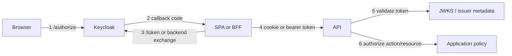
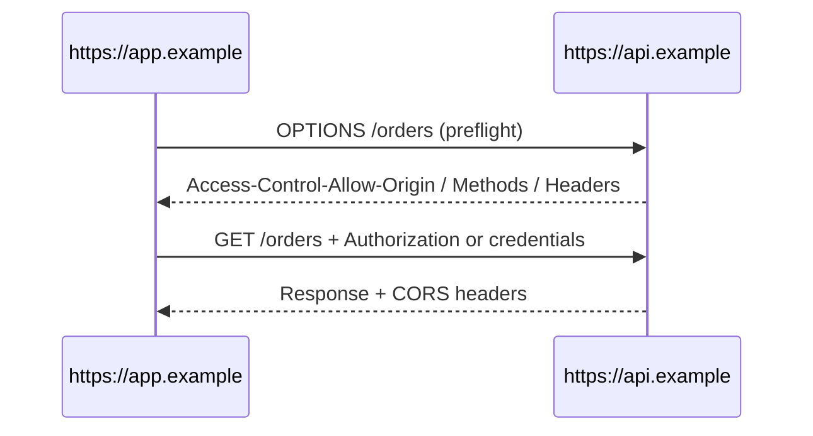
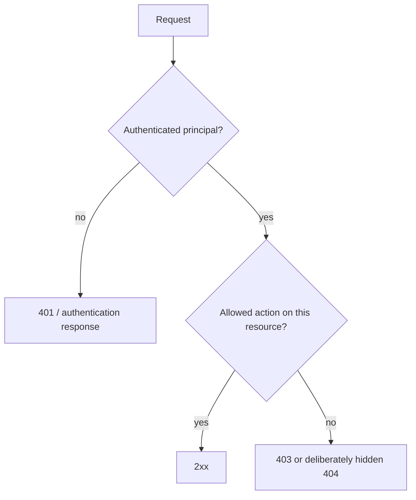

# Auth Debugging Field Guide: 401, 403, CORS, Redirects, Issuer, Audience & Claims

## TL;DR

Auth failures become confusing when every symptom is called "Keycloak issue." A browser login crosses multiple independent boundaries: redirect configuration, IdP session, code exchange, token issuance, browser transport, token validation, and application authorization.

> 💡 **Rule of thumb:** Before changing Keycloak, CORS, roles, or frontend code, identify **the first boundary that failed** and collect evidence there.

- **Redirect error:** usually client registration or callback transaction.
- **CORS error:** browser response-sharing policy, not proof that the API rejected authentication.
- **401:** credentials are missing, invalid, expired, or unacceptable for the protected resource.
- **403:** the server understood the request but refuses the action; valid credentials can still be insufficient.
- **Fatal pitfall:** editing roles, CORS, redirect URIs, token mappers, and proxy settings simultaneously until the symptom disappears.

## Start with a boundary map



Use this as the debugging order. Do not jump to step 6 when step 2 never completed.

<TermBox term="Authentication failure">
An **authentication failure** means the server cannot establish an acceptable authenticated principal for the request: the credential may be missing, malformed, expired, signed by an untrusted key, issued by the wrong issuer, or intended for another resource.

**Why it matters:** fixing roles does not help if the API rejects the token before it creates a principal.
</TermBox>

<TermBox term="Authorization failure">
An **authorization failure** means the system has enough identity/context to understand the request but policy denies the requested action or resource.

**Why it matters:** refreshing the token repeatedly does not solve an object-level permission rule that intentionally denies access.
</TermBox>

## 1. Redirect fails before login or callback

Typical symptoms:

- invalid_redirect_uri;
- redirect loop;
- callback lands on the wrong environment;
- login succeeds at Keycloak but the application rejects state;
- frontend returns to a route that does not finish login.

Check:

```text
request client_id
        ↓
registered Keycloak client
        ↓
exact redirect_uri / allowed pattern
        ↓
scheme + host + port + path
        ↓
callback transaction state
```

Keycloak recommends keeping Valid Redirect URIs as specific as possible. Environment drift is common: localhost callbacks, preview URLs, production domains, reverse-proxy rewrites, and trailing paths are different values unless registration explicitly allows them.

Do not "fix" a redirect mismatch by adding a broad wildcard without understanding where authorization responses may then be delivered.

## 2. Login succeeds but there is no usable application session

Separate these questions:

1. Did Keycloak authenticate the user?
2. Did the application receive and validate the callback?
3. Did the code exchange succeed?
4. Did the application establish its own session/token state?

A successful Keycloak login page only proves step 1.

In a BFF architecture, the token request can be server-to-server and therefore absent from browser DevTools. Inspect BFF logs and the resulting session cookie instead.

In a direct SPA, inspect the token exchange and adapter/library state.

## 3. CORS error is a browser boundary

<TermBox term="CORS">
**Cross-Origin Resource Sharing (CORS)** is an HTTP protocol layered on top of the browser same-origin policy that lets a server opt specific origins into reading cross-origin responses.

**Why it matters:** a CORS console error describes what the browser is allowed to expose to JavaScript. It is not the same question as whether Keycloak or the API authenticated the request.
</TermBox>

The Fetch Standard requires explicit CORS opt-in for cross-origin response sharing, and credentialed requests require explicit credential support.



Debug the **Network** panel, not only the console:

- Was there an OPTIONS preflight?
- What status did preflight return?
- Is Access-Control-Allow-Origin the actual frontend origin?
- If cookies/credentials are included, is Access-Control-Allow-Credentials intentionally enabled?
- Is the requested Authorization header or method allowed?
- Did the real request happen after the preflight?

A backend can return a meaningful 401 or 500, but if CORS headers are missing, browser JavaScript may only see a generic CORS failure.

## 4. 401 Unauthorized: inspect credential acceptance

RFC 9110 describes 401 for protected resources when credentials are missing, invalid, or partial/unacceptable, normally with a WWW-Authenticate challenge.

For Bearer access tokens, inspect:

```text
Authorization header present?
        ↓
Bearer syntax correct?
        ↓
token expired / not-yet-valid?
        ↓
signature key trusted?
        ↓
issuer exact?
        ↓
audience/resource intended for this API?
        ↓
token type/profile acceptable?
```

### Issuer mismatch

A token from one Keycloak realm is not interchangeable with a token from another realm, environment, proxy-facing issuer, or localhost development issuer merely because both are signed by "your Keycloak."

The API should validate the exact issuer contract it trusts.

### Key / kid mismatch

Keycloak publishes realm public keys through its OIDC certificate/JWKS endpoint. During signing-key rotation, validators need a key-refresh/cache strategy. A token carrying an unknown kid should cause a bounded key refresh rather than "disable signature verification."

### Audience mismatch

A valid signature proves who signed the token. It does not prove this API is the intended consumer.

If Orders API expects an access token intended for Orders, a token minted for a different audience should be rejected even when issuer, subject, and roles look familiar.

## 5. 403 Forbidden: move to application policy

RFC 9110 defines 403 as the server understanding the request but refusing to fulfill it; credentials can be valid yet insufficient.

Typical checks:

- required scope missing;
- required role absent;
- role exists but under a different namespace/client;
- tenant/resource ownership does not match;
- user can read but not mutate;
- permission changed after token issuance;
- endpoint policy and frontend assumption disagree.



Do not respond to every 403 by making the user log in again. If the principal is valid and policy denies the operation, a new authentication ceremony may change nothing.

## 6. "Role is in the token but API says forbidden"

Work backward from the policy the API actually checks.

```json
{
  "realm_access": {
    "roles": ["employee"]
  },
  "resource_access": {
    "orders-api": {
      "roles": ["refund"]
    }
  }
}
```

Questions:

1. Is the API checking realm roles or client roles?
2. Is it looking under the expected client ID?
3. Did a client scope/protocol mapper put the intended claim into the **access token**?
4. Is the API using ID Token claims by mistake?
5. Does the policy also require tenant/ownership/context beyond the role?
6. Is the token stale after a role assignment change?

Frontend UI and API policy should share vocabulary where useful, but only the API enforcement decides the operation.

## 7. "Works in Postman/curl, fails in browser"

This is a strong hint that the browser security model is involved.

Postman/curl do not enforce browser CORS. They also do not reproduce cookie SameSite behavior, browser redirect state, frontend origin, or JavaScript token lifecycle automatically.

Compare URL/Host, Origin, cookie presence and attributes, Authorization header, preflight, TLS/proxy path, redirect URI, token audience/issuer, and whether the browser is silently sending old state.

Do not conclude "backend is fine" solely because curl succeeds. Conclude only that **one non-browser request path succeeded**.

## 8. Cookie session failures: inspect attributes and scope

For BFF/session architectures, inspect the browser's cookie view.

Questions:

- Was Set-Cookie received?
- Did the browser store it?
- Is it Secure while you are accidentally on HTTP?
- Does SameSite policy allow the navigation/request pattern?
- Is Domain too broad or wrong?
- Is Path excluding the endpoint?
- Is the cookie expired?
- Does the request actually include the cookie?
- For cross-origin credentialed fetch, is credentials behavior intentional and is CORS configured accordingly?

HttpOnly cookies are intentionally absent from document.cookie; that is not evidence that the cookie is missing.

## 9. Refresh and expiry failures

Common symptoms:

- API begins returning 401 after N minutes;
- tab works until reload;
- refresh loops;
- simultaneous requests trigger multiple refreshes;
- refresh succeeds but old access token continues to be sent.

Trace timestamps and ownership:

```text
access token exp
     ↓
who notices expiry?
     ↓
who owns refresh token?
     ↓
one refresh or many concurrent refreshes?
     ↓
new access token stored in the authoritative place?
     ↓
subsequent API request uses the new token?
```

In direct SPA, inspect library/adapter refresh behavior and race handling. In BFF, inspect server session/token cache and refresh logs.

## 10. Logout appears broken

Ask which logout you expected:

- frontend state cleared?
- local application/BFF session invalidated?
- refresh token/session revoked according to your design?
- Keycloak SSO session ended?
- another SSO-connected application forced out?

If the user logs out of App A, then immediately visits App A and gets logged in again without credentials, the IdP session may still be active even though App A correctly cleared its own local session.

## Production micro-scenario: a 403 becomes a week of CORS changes

An Orders SPA receives 403 for POST /orders/42/refund. The console also shows a failed API response. The team widens CORS origins, adds wildcard redirect URIs, reissues client secrets, and changes Keycloak mappers. The request still fails.

The access token was valid the whole time. The API policy required client role orders-api:refund, while the token only contained a realm role named refund.

- **Impact:** A one-line authorization mismatch turns into risky identity/CORS configuration drift and several days of debugging.
- **Root cause:** The team did not separate transport/browser evidence, authentication, and authorization before modifying configuration.
- **Correct pattern:** Trace the request boundary-by-boundary, confirm token validation succeeds, inspect the exact policy input expected by the API, then change only the role/scope mapping or policy that is actually wrong.

## Check your mental model

> **Scenario:** Browser console says "blocked by CORS policy." DevTools Network shows the API returned 401, but the response lacks Access-Control-Allow-Origin. Is CORS necessarily the root authentication problem?

<details>
<summary>Show the reasoning</summary>

No.

CORS prevents browser JavaScript from reading a cross-origin response unless the server opts the origin in. The underlying API also returned 401, so there may be a separate credential problem. Fixing CORS can reveal the real authentication response; it does not automatically fix the credential.

</details>

## Incident/debug checklist

- [ ] **Reproduce:** Capture one failing request and timestamp.
- [ ] **Architecture:** Is this direct SPA, BFF, or token-mediating backend?
- [ ] **First failure:** Redirect, callback, token exchange, browser transport, token validation, or authorization?
- [ ] **Redirect:** Compare exact client_id and redirect_uri with Keycloak configuration.
- [ ] **Browser:** Inspect preflight, Origin, cookies, Authorization header, and real response status.
- [ ] **Token:** Identify ID token vs access token before reading claims.
- [ ] **Validation:** Check signature/JWKS, issuer, audience/resource, expiry/not-before, and token profile.
- [ ] **401:** Confirm why no acceptable principal was established.
- [ ] **403:** Confirm which scope/role/resource/context policy denied the action.
- [ ] **Roles:** Distinguish realm roles, client roles, scopes, claims, and business permissions.
- [ ] **Refresh:** Confirm one owner refreshes and subsequent requests use the refreshed token.
- [ ] **Session:** Inspect cookie attributes and local vs IdP session lifecycle.
- [ ] **Logout:** State explicitly which session(s) should end.
- [ ] **Change isolation:** Modify one boundary at a time and keep before/after evidence.

## Related Atlas lessons

- [Frontend Authentication Architecture](/docs/engineering-judgment/architecture-walkthroughs/frontend-authentication-architecture) compares direct SPA and BFF trust boundaries.
- [OAuth 2.0 & OpenID Connect](/docs/backend-engineering/oauth-and-oidc) explains Authorization Code + PKCE, tokens, discovery, and validation.
- [Keycloak in Practice](/docs/backend-engineering/keycloak-in-practice) maps realm/client/role/client-scope/mapper behavior.
- [Authentication & Authorization](/docs/backend-engineering/authentication-and-authorization) separates identity establishment from policy decisions.
- [Same-Origin Policy and CORS](/docs/web-platform/same-origin-and-cors) covers the browser cross-origin boundary.

## Sources

- [RFC 9110 — HTTP Semantics](https://www.rfc-editor.org/rfc/rfc9110.html)
- [RFC 10017 — OAuth 2.0 for Browser-Based Applications](https://www.rfc-editor.org/rfc/rfc10017.html)
- [Fetch Standard — CORS protocol](https://fetch.spec.whatwg.org/#http-cors-protocol)
- [Keycloak — Securing applications and services with OpenID Connect](https://www.keycloak.org/securing-apps/oidc-layers)
- [Keycloak JavaScript Adapter](https://www.keycloak.org/securing-apps/javascript-adapter)
- [OWASP Session Management Cheat Sheet](https://cheatsheetseries.owasp.org/cheatsheets/Session_Management_Cheat_Sheet.html)
- [OpenID Connect Discovery 1.0](https://openid.net/specs/openid-connect-discovery-1_0.html)
