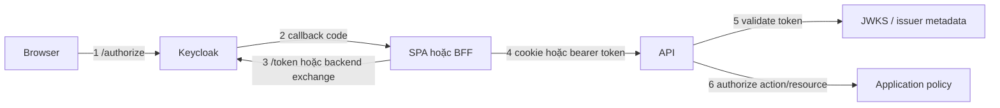
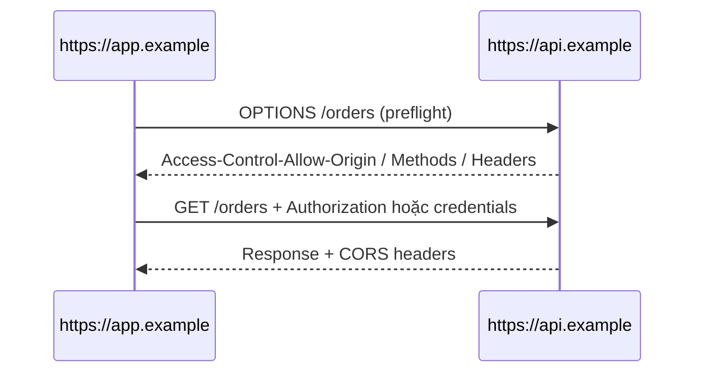
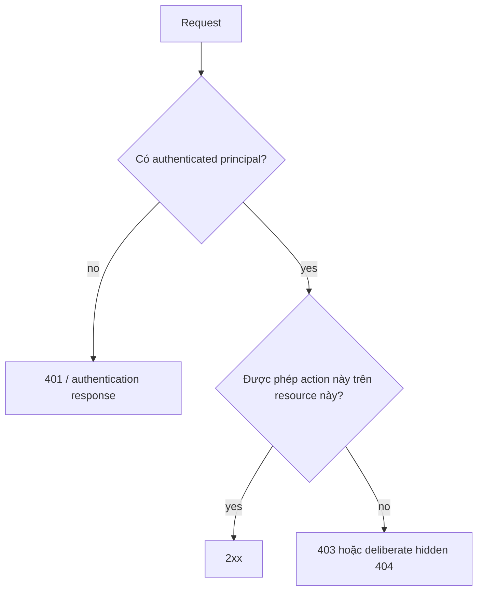

# Cẩm nang Debug Auth: 401, 403, CORS, Redirect, Issuer, Audience & Claim

## TL;DR

Auth failure trở nên rối khi mọi symptom đều bị gọi là "lỗi Keycloak". Một browser login đi qua nhiều boundary độc lập: redirect configuration, IdP session, code exchange, token issuance, browser transport, token validation và application authorization.

> 💡 **Quy tắc bỏ túi:** Trước khi sửa Keycloak, CORS, role hay frontend code, hãy tìm **boundary đầu tiên bị fail** và thu evidence tại đó.

- **Redirect error:** thường nằm ở client registration hoặc callback transaction.
- **CORS error:** là browser response-sharing policy, không chứng minh API reject authentication.
- **401:** credential thiếu, invalid, expired hoặc không được chấp nhận cho protected resource.
- **403:** server hiểu request nhưng từ chối action; valid credential vẫn có thể không đủ quyền.
- **Sai lầm chí mạng:** cùng lúc sửa role, CORS, redirect URI, token mapper và proxy cho tới khi symptom biến mất.

## Bắt đầu bằng boundary map



Hãy dùng thứ tự này để debug. Đừng nhảy tới bước 6 khi bước 2 còn chưa hoàn tất.

<TermBox term="Authentication failure">
**Authentication failure** nghĩa là server không tạo được authenticated principal được chấp nhận cho request: credential có thể thiếu, malformed, expired, được ký bằng key không trusted, đến từ issuer sai hoặc intended cho resource khác.

**Tại sao quan trọng:** sửa role không giúp gì nếu API reject token trước khi tạo principal.
</TermBox>

<TermBox term="Authorization failure">
**Authorization failure** nghĩa là hệ thống đã có đủ identity/context để hiểu request nhưng policy deny action hoặc resource được yêu cầu.

**Tại sao quan trọng:** refresh token lặp lại không giải quyết object-level permission rule đang chủ đích deny access.
</TermBox>

## 1. Redirect fail trước login hoặc callback

Symptom thường gặp:

- invalid_redirect_uri;
- redirect loop;
- callback rơi vào sai environment;
- login thành công ở Keycloak nhưng application reject state;
- frontend quay về route không hoàn tất login.

Kiểm:

```text
request client_id
        ↓
registered Keycloak client
        ↓
exact redirect_uri / allowed pattern
        ↓
scheme + host + port + path
        ↓
callback transaction state
```

Keycloak khuyến nghị giữ Valid Redirect URIs càng specific càng tốt. Environment drift rất phổ biến: localhost callback, preview URL, production domain, reverse-proxy rewrite và trailing path là các value khác nhau nếu registration không chủ đích cho phép.

Đừng "fix" redirect mismatch bằng broad wildcard khi chưa hiểu authorization response có thể bị đưa tới những location nào.

## 2. Login thành công nhưng application không có session dùng được

Tách bốn câu hỏi:

1. Keycloak đã authenticate user chưa?
2. Application đã nhận và validate callback chưa?
3. Code exchange đã thành công chưa?
4. Application đã tạo local session/token state chưa?

Login page thành công ở Keycloak chỉ chứng minh bước 1.

Với BFF architecture, token request có thể là server-to-server nên không xuất hiện trong browser DevTools. Hãy kiểm BFF logs và session cookie kết quả.

Với direct SPA, kiểm token exchange và adapter/library state.

## 3. CORS error là browser boundary

<TermBox term="CORS">
**Cross-Origin Resource Sharing (CORS)** là HTTP protocol nằm trên browser same-origin policy, cho phép server opt-in một số origin để đọc cross-origin response.

**Tại sao quan trọng:** CORS console error mô tả response nào browser được phép expose cho JavaScript. Nó không cùng câu hỏi với Keycloak hay API có authenticate request hay không.
</TermBox>

Fetch Standard yêu cầu explicit CORS opt-in để share cross-origin response và credentialed request cần explicit credential support.



Debug **Network** panel, không chỉ console:

- Có OPTIONS preflight không?
- Preflight trả status gì?
- Access-Control-Allow-Origin có đúng frontend origin không?
- Nếu gửi cookie/credentials, Access-Control-Allow-Credentials có được bật có chủ đích không?
- Authorization header hoặc method được request có được allow không?
- Real request có chạy sau preflight không?

Backend có thể trả 401 hoặc 500 rất có ý nghĩa, nhưng nếu thiếu CORS headers thì browser JavaScript có thể chỉ thấy generic CORS failure.

## 4. 401 Unauthorized: kiểm credential acceptance

RFC 9110 mô tả 401 cho protected resource khi credential thiếu, invalid hoặc không hoàn chỉnh/không được chấp nhận, thường đi cùng WWW-Authenticate challenge.

Với Bearer access token, kiểm:

```text
Có Authorization header?
        ↓
Bearer syntax đúng?
        ↓
token expired / not-yet-valid?
        ↓
signature key trusted?
        ↓
issuer exact?
        ↓
audience/resource intended cho API này?
        ↓
token type/profile được chấp nhận?
```

### Issuer mismatch

Token từ một Keycloak realm không tự động interchangeable với token từ realm khác, environment khác, proxy-facing issuer khác hay localhost issuer chỉ vì tất cả đều là "Keycloak của mình."

API nên validate exact issuer contract mà nó trust.

### Key / kid mismatch

Keycloak publish realm public key qua OIDC certificate/JWKS endpoint. Khi signing-key rotation, validator cần key-refresh/cache strategy. Token mang kid chưa biết nên dẫn tới bounded key refresh, không phải "tắt signature verification."

### Audience mismatch

Valid signature chứng minh ai ký token. Nó không chứng minh API này là intended consumer.

Nếu Orders API cần access token intended cho Orders, token minted cho audience khác nên bị reject dù issuer, subject và role trông quen thuộc.

## 5. 403 Forbidden: chuyển sang application policy

RFC 9110 định nghĩa 403 là server hiểu request nhưng từ chối fulfill; credential có thể valid nhưng không đủ.

Kiểm thường gặp:

- thiếu required scope;
- thiếu required role;
- role có nhưng nằm ở namespace/client khác;
- tenant/resource ownership không khớp;
- user được read nhưng không được mutate;
- permission đã đổi sau khi token issue;
- endpoint policy và frontend assumption không khớp.



Đừng xử lý mọi 403 bằng cách bắt user login lại. Nếu principal valid và policy deny operation, authentication ceremony mới có thể không thay đổi gì.

## 6. "Role có trong token nhưng API vẫn forbidden"

Trace ngược từ policy API thực sự kiểm.

```json
{
  "realm_access": {
    "roles": ["employee"]
  },
  "resource_access": {
    "orders-api": {
      "roles": ["refund"]
    }
  }
}
```

Hỏi:

1. API kiểm realm role hay client role?
2. Nó đọc role dưới client ID nào?
3. Client scope/protocol mapper có đưa intended claim vào **access token** không?
4. API có nhầm dùng ID Token claim không?
5. Policy còn yêu cầu tenant/ownership/context ngoài role không?
6. Token có stale sau khi role assignment đổi không?

Frontend UI và API policy nên chia sẻ vocabulary khi hữu ích, nhưng chỉ API enforcement mới quyết định operation.

## 7. "Postman/curl chạy, browser fail"

Đây là hint mạnh rằng browser security model tham gia.

Postman/curl không enforce browser CORS. Chúng cũng không tự reproduce cookie SameSite behavior, browser redirect state, frontend origin hay JavaScript token lifecycle.

So sánh URL/Host, Origin, cookie presence và attributes, Authorization header, preflight, TLS/proxy path, redirect URI, token audience/issuer và browser có đang silently gửi state cũ không.

Đừng kết luận "backend ổn" chỉ vì curl thành công. Chỉ nên kết luận **một non-browser request path đã thành công**.

## 8. Cookie session fail: kiểm attribute và scope

Với BFF/session architecture, mở browser cookie view.

Hỏi:

- Có nhận Set-Cookie không?
- Browser có store không?
- Cookie có Secure nhưng bạn vô tình chạy HTTP không?
- SameSite policy có cho phép navigation/request pattern hiện tại không?
- Domain quá rộng hay sai?
- Path có exclude endpoint không?
- Cookie expired chưa?
- Request có thực sự gửi cookie không?
- Với cross-origin credentialed fetch, credentials behavior và CORS có được cấu hình chủ đích không?

HttpOnly cookie cố ý không xuất hiện trong document.cookie; đó không phải evidence rằng cookie bị mất.

## 9. Refresh và expiry fail

Symptom thường gặp:

- API bắt đầu 401 sau N phút;
- tab chạy cho tới khi reload;
- refresh loop;
- nhiều request đồng thời gây nhiều refresh;
- refresh thành công nhưng old access token vẫn được gửi.

Trace timestamp và ownership:

```text
access token exp
     ↓
ai nhận biết expiry?
     ↓
ai sở hữu refresh token?
     ↓
một refresh hay nhiều concurrent refresh?
     ↓
new access token có được ghi vào authoritative place?
     ↓
API request sau có dùng token mới?
```

Với direct SPA, kiểm library/adapter refresh behavior và race handling. Với BFF, kiểm server session/token cache và refresh logs.

## 10. Logout trông như bị hỏng

Hỏi chính xác logout nào bạn mong đợi:

- frontend state cleared?
- local application/BFF session invalidated?
- refresh token/session revoked theo design?
- Keycloak SSO session ended?
- app SSO khác có bị force logout?

Nếu user logout App A rồi vào lại App A và được login ngay không cần credential, IdP session có thể vẫn active dù App A đã clear local session đúng.

## Production micro-scenario: một 403 biến thành cả tuần sửa CORS

Orders SPA nhận 403 cho POST /orders/42/refund. Console cũng hiện failed API response. Team mở rộng CORS origin, thêm wildcard redirect URI, reissue client secret và sửa Keycloak mapper. Request vẫn fail.

Access token thực ra valid từ đầu. API policy yêu cầu client role orders-api:refund, trong khi token chỉ có realm role tên refund.

- **Hậu quả:** Một authorization mismatch một dòng biến thành risky identity/CORS configuration drift và nhiều ngày debug.
- **Nguyên nhân cốt lõi:** Team không tách transport/browser evidence, authentication và authorization trước khi sửa cấu hình.
- **Cách khắc phục chuẩn:** Trace request theo từng boundary, xác nhận token validation thành công, inspect policy input chính xác mà API cần rồi chỉ đổi role/scope mapping hoặc policy đang sai.

## Kiểm tra mental model

> **Tình huống:** Browser console báo "blocked by CORS policy". DevTools Network cho thấy API trả 401, nhưng response thiếu Access-Control-Allow-Origin. CORS có nhất thiết là root authentication problem không?

<details>
<summary>Xem giải thích chi tiết</summary>

Không.

CORS ngăn browser JavaScript đọc cross-origin response nếu server không opt origin đó vào. API bên dưới cũng trả 401, vậy có thể có credential problem riêng. Fix CORS có thể giúp bạn nhìn thấy authentication response thật; nó không tự động sửa credential.

</details>

## Checklist incident/debug

- [ ] **Reproduce:** Capture một failing request và timestamp.
- [ ] **Architecture:** Đây là direct SPA, BFF hay token-mediating backend?
- [ ] **First failure:** Redirect, callback, token exchange, browser transport, token validation hay authorization?
- [ ] **Redirect:** So exact client_id và redirect_uri với Keycloak config.
- [ ] **Browser:** Inspect preflight, Origin, cookie, Authorization header và real response status.
- [ ] **Token:** Xác định ID token hay access token trước khi đọc claim.
- [ ] **Validation:** Kiểm signature/JWKS, issuer, audience/resource, expiry/not-before và token profile.
- [ ] **401:** Xác định vì sao không tạo được acceptable principal.
- [ ] **403:** Xác định scope/role/resource/context policy nào deny action.
- [ ] **Roles:** Tách realm role, client role, scope, claim và business permission.
- [ ] **Refresh:** Xác nhận một owner refresh và request sau dùng refreshed token.
- [ ] **Session:** Inspect cookie attributes và local vs IdP session lifecycle.
- [ ] **Logout:** Nói rõ session nào phải kết thúc.
- [ ] **Change isolation:** Chỉ sửa một boundary mỗi lần và giữ before/after evidence.

## Các bài Atlas liên quan

- [Kiến trúc Xác thực Frontend](/vi/docs/engineering-judgment/architecture-walkthroughs/frontend-authentication-architecture) so sánh trust boundary của direct SPA và BFF.
- [OAuth 2.0 & OpenID Connect](/vi/docs/backend-engineering/oauth-and-oidc) giải thích Authorization Code + PKCE, token, discovery và validation.
- [Keycloak Thực chiến](/vi/docs/backend-engineering/keycloak-in-practice) ánh xạ realm/client/role/client-scope/mapper.
- [Xác thực & Phân quyền](/vi/docs/backend-engineering/authentication-and-authorization) tách identity establishment khỏi policy decision.
- [Same-Origin Policy và CORS](/vi/docs/web-platform/same-origin-and-cors) giải thích browser cross-origin boundary.

## Nguồn tham khảo

- [RFC 9110 — HTTP Semantics](https://www.rfc-editor.org/rfc/rfc9110.html)
- [RFC 10017 — OAuth 2.0 for Browser-Based Applications](https://www.rfc-editor.org/rfc/rfc10017.html)
- [Fetch Standard — CORS protocol](https://fetch.spec.whatwg.org/#http-cors-protocol)
- [Keycloak — Securing applications and services with OpenID Connect](https://www.keycloak.org/securing-apps/oidc-layers)
- [Keycloak JavaScript Adapter](https://www.keycloak.org/securing-apps/javascript-adapter)
- [OWASP Session Management Cheat Sheet](https://cheatsheetseries.owasp.org/cheatsheets/Session_Management_Cheat_Sheet.html)
- [OpenID Connect Discovery 1.0](https://openid.net/specs/openid-connect-discovery-1_0.html)
