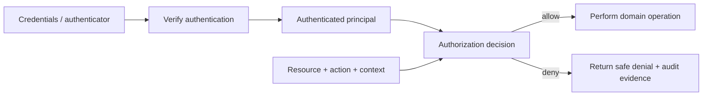
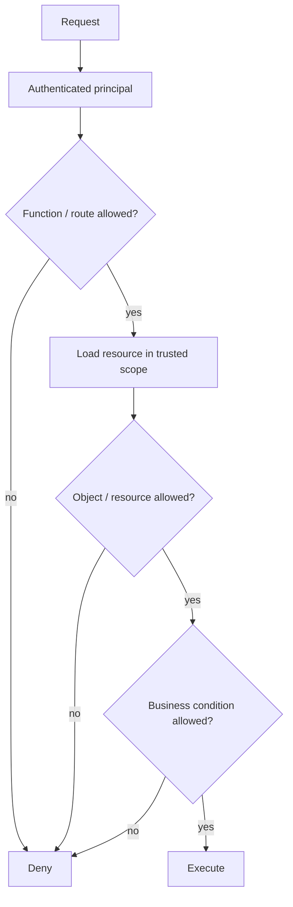
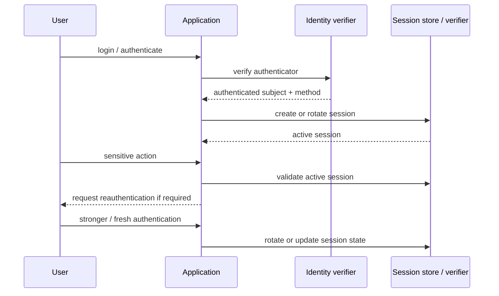

## TL;DR & Production Incident Hook

A fast-growing fintech startup celebrates a flawless security audit for its multi-factor login flow. Two weeks later, a security researcher reports a critical vulnerability: after logging into an ordinary personal account, they simply intercepted a request to `GET /api/v1/users/1042/profile`, modified the `userId` in the URL to `1043`, and instantly exposed the full legal name, home address, bank account details, and transaction history of an arbitrary stranger.

This catastrophic failure is the classic Insecure Direct Object Reference (IDOR), classified as the number one API vulnerability by OWASP under Broken Object Level Authorization (BOLA). The application performed robust **Authentication**: it verified the user's password, validated the one-time code, issued a tamper-proof signed token, and confirmed that the user held the `user` role via Role-Based Access Control (RBAC). However, the endpoint completely omitted **Authorization**: verifying whether *that specific authenticated user* held legitimate ownership or permission to access *that specific record* via Attribute-Based Access Control (ABAC). Authentication validated the key to the front door; authorization failed to lock the individual private rooms.

Identity verification and permission evaluation are two fundamentally separate gates in backend architecture. A valid credential, session cookie, or cryptographic token grants zero implicit rights to access, mutate, or delete an arbitrary domain entity. Modern backend systems require explicit, resource-level, deny-by-default access policies evaluated on every protected operation.



> 💡 **Rule of thumb:** Authentication verifies who the caller is; authorization decides what that authenticated principal may do right now—never conflate a valid token or generic role with permission to access a specific resource ID.

### TL;DR 2.0
- **Two distinct security gates:** Authentication establishes claimant identity into a trusted, server-verified principal; authorization evaluates whether that principal may execute a specific action on a specific resource in the current context (`subject + action + resource + context`).
- **Deny by default at the resource level:** Generic route checks and role-based entitlements (RBAC) are insufficient on their own. Authorization must enforce object-level ownership checks (ABAC/relationship rules) and default to denial whenever an explicit grant is absent.
- **Active session lifecycle management:** Login is only the start of the authentication lifecycle. Rotate session tokens after privilege boundaries change, enforce inactivity deadlines, demand phishing-resistant reauthentication for high-risk actions, and implement rapid server-side revocation.
- **Service & machine identity parity:** Background workers, message consumers, and microservices must authenticate as distinct service principals with minimal, scoped privileges rather than reusing broad user tokens or bypassing checks via internal network assumptions.
- **Fatal pitfall:** Confusing successful authentication with resource authorization (IDOR / BOLA)—allowing an authenticated user to access another tenant's or user's sensitive data simply by tampering with an object identifier in a route or query parameter.

<TermBox term="Principal">
A **principal** is the runtime security identity used for decisions after authentication. It typically contains a stable subject identifier plus selected attributes such as tenant, roles, authentication method, or assurance information.

**Why it matters:** application code should authorize an explicit principal, not infer identity from client-controlled request fields.
</TermBox>

## 1. Authentication establishes control, not unlimited trust

Authentication verifies evidence presented by a claimant. Depending on the system, that evidence may be a password, passkey, hardware key, one-time code, client certificate, or a federated assertion that has itself been validated.

Keep three concepts distinct:

1. **Identity proofing** asks how strongly an account was linked to a real-world identity when that matters.
2. **Authentication** asks whether the claimant now controls an authenticator bound to that account or subject.
3. **Authorization** asks what the authenticated principal may do now.

NIST SP 800-63-4 separates these concerns through identity, authentication, and federation assurance. NIST SP 800-63B-4 defines Authentication Assurance Levels (AALs). AAL2 requires two distinct authentication factors and requires applications at that level to offer a phishing-resistant option; AAL3 requires phishing-resistant authentication.

Do not translate that into “always force the strongest factor everywhere.” Select authentication strength according to impact and threat model, then step up when a sensitive action needs stronger evidence.

<TermBox term="Phishing-resistant authentication">
A **phishing-resistant** authentication method uses a protocol that prevents an attacker-controlled verifier from replaying or forwarding the authentication secret to impersonate the user at the legitimate verifier.

**Why it matters:** stronger authentication reduces the chance that authorization decisions are made for an attacker operating a stolen account session.
</TermBox>

## 2. Build an authenticated principal deliberately

After credential verification, construct a minimal principal from server-trusted identity data. Typical fields are:

```text
subject_id
principal_type = user | service
organization_or_tenant_id
roles / groups / entitlements
session_id or token identifier
authentication_time
authentication_method / assurance
```

Do not copy arbitrary client claims into the principal. Signed tokens still require verification of signature, issuer, audience, lifetime, and application-specific claim expectations before their claims become trusted input.

Keep mutable permissions out of long-lived credentials when rapid revocation matters. A cryptographically valid token can still represent authority that the application no longer wishes to grant.

## 3. Make authorization an explicit decision

A useful operating model is:

```text
subject + action + resource + context -> allow | deny
```

For example:

```text
subject  = user:123 in tenant:acme
action   = invoice.read
resource = invoice:inv_42 owned by tenant:acme
context  = normal customer session, region=VN
```

Authorization should be **deny by default**. If no policy clearly grants the requested action, reject it.



The OWASP Authorization Cheat Sheet recommends deny-by-default behavior and validating permissions on every request. Central middleware or policy infrastructure can make enforcement consistent, but the policy still needs the resource and action information required for a real decision.

## 4. Route checks are not enough: authorize the object

A route such as `GET /invoices/:id` can be restricted to authenticated customers and still be vulnerable.

If the handler loads `invoice_id = 42` and returns it merely because the caller is logged in, the system has authentication but no object-level authorization.

OWASP calls this class **Broken Object Level Authorization (BOLA)**. The fix is not “use unpredictable UUIDs.” Random identifiers can reduce guessing, but every access still needs authorization.

Prefer data access patterns that carry trusted ownership scope into the query when possible:

```text
BAD:
  invoice = invoices.findById(request.params.id)
  return invoice

BETTER:
  invoice = invoices.findByTenantAndId(principal.tenantId, request.params.id)
  authorize(principal, "invoice.read", invoice)
  return invoice
```

Scoping the lookup and then making an explicit policy decision provides defense in depth. It also avoids accidentally loading data from another tenant before checking ownership.

## 5. Roles are inputs to policy, not the whole policy

Role-based access control is useful for coarse permissions such as “support agent may access support tools.” It is usually insufficient for rules such as:

- users may edit their own profile but not another user’s;
- project members may read a repository only while membership is active;
- approvers may approve payments below their configured limit but never their own request;
- a service may write only to one tenant or queue.

These decisions depend on attributes or relationships between the principal, resource, and context. Keep the rule close enough to the domain that it can see those facts, while keeping enforcement consistent enough that one forgotten endpoint cannot bypass it.

## 6. Session lifecycle is part of authentication

Successful login starts or upgrades an authenticated session; it does not end the authentication problem.



Operate sessions with explicit lifecycle rules:

- use secure, unpredictable session identifiers or validated tokens;
- rotate session identifiers after authentication and privilege changes to prevent session fixation;
- define inactivity and overall lifetimes appropriate to risk;
- require **reauthentication** for sensitive operations or high-risk events such as account recovery, credential changes, or suspicious activity;
- support **revocation** after logout, credential compromise, permission changes, or administrative action when the threat model requires immediate loss of authority;
- do not treat token expiration as the same thing as revocation.

OWASP Authentication and Session Management guidance specifically recommends reauthentication for sensitive/risky events and session renewal after privilege changes.

## 7. Step-up authentication and authorization work together

A policy can require stronger authentication for one action without forcing it for every page.

Example:

```text
read own orders       -> authenticated session is enough
change password       -> fresh reauthentication required
add payout account    -> phishing-resistant MFA preferred/required by policy
approve large payout  -> stronger authentication + independent authorization rule
```

Authentication strength is an input to the authorization decision; it is not a substitute for authorization. A freshly authenticated administrator can still be forbidden from approving their own payment.

## 8. Treat service identities as principals too

Background workers, scheduled jobs, CI systems, and services are principals even when no human is present.

Use a distinct **service identity** or machine identity with narrowly scoped authority. Prefer short-lived workload credentials or platform identity mechanisms over copied long-lived user tokens or shared API keys.

A service principal should still be evaluated as:

```text
subject + action + resource + context
```

Examples of useful restrictions include audience, environment, namespace, tenant, operation, and credential lifetime.

Do not let “internal traffic” become an authorization bypass. Network location is context, not proof that every caller should have every permission.

## 9. Denials need safe behavior and useful evidence

Authorization failures should not leak more information than necessary. Depending on the API contract, returning `404` instead of `403` can be appropriate when revealing resource existence is itself sensitive.

Record enough **audit** evidence to reconstruct important decisions without logging secrets:

```text
request_id / trace_id
principal subject or safe principal identifier
principal type
authentication method / freshness when relevant
action
resource type + safe identifier
tenant / scope
decision = allow | deny
policy or rule identifier
reason category
```

Track denial rates and unusual authorization patterns, but avoid logging bearer tokens, passwords, session secrets, or sensitive payloads.

Audit logs are evidence, not enforcement. A perfectly logged unauthorized action is still unauthorized.

## Production failure: authenticated user crossed tenant boundaries

> **Scenario:** A SaaS invoice endpoint required a valid customer session. The handler accepted `/invoices/:id`, loaded the invoice by its global ID, and returned it. No policy compared the authenticated principal’s tenant with the invoice tenant.

**Impact:** A customer changed the invoice ID and read invoice metadata belonging to another tenant. Because every request had a valid session, ordinary authentication dashboards showed healthy success rates.

**Root cause:** The service equated “authenticated customer” with “authorized for this invoice.” Route-level authentication existed, but resource-level authorization was missing. Identifier unpredictability had also been treated as a security boundary.

**Correct pattern:** Authenticate the caller, build a trusted principal, load the object inside the principal’s tenant scope when possible, then enforce an explicit `subject + action + resource + context` policy. Deny by default, test cross-tenant object access, and emit safe audit evidence for denial decisions.

## Operate the boundary as a checklist

- [ ] **Authentication:** Is the accepted authenticator strength appropriate to the action’s risk?
- [ ] **Principal:** Are identity and authorization attributes built only from validated, server-trusted data?
- [ ] **Deny by default:** Does unmatched policy deny rather than silently permit?
- [ ] **Every request:** Is authorization enforced on every protected request path, not only the UI or one controller family?
- [ ] **Resource-level authorization:** Does access check the real object/tenant/relationship rather than only a route role?
- [ ] **Sensitive fields:** Are readable and writable properties limited by policy rather than generic object serialization/binding?
- [ ] **Sessions:** Are session identifiers rotated after authentication and privilege changes?
- [ ] **Reauthentication:** Do sensitive actions and risk events demand sufficiently fresh/strong authentication?
- [ ] **Revocation:** Can compromised or withdrawn authority stop before natural token expiry when necessary?
- [ ] **Service identities:** Do machines use distinct, short-lived, least-authority principals instead of borrowed user identity?
- [ ] **Audit:** Can operators reconstruct important allow/deny decisions without storing secrets?
- [ ] **Tests:** Are cross-user, cross-tenant, privilege-escalation, and missing-policy cases machine-checked?

## Check your mental model

> A user has a valid AAL2-style session and requests `DELETE /projects/alpha`. The route is restricted to authenticated users with the `member` role. Is that enough to authorize the delete?

<details>
<summary>Show the reasoning</summary>

No. Strong authentication establishes confidence in who controls the session; the `member` role provides only a coarse entitlement. The service still needs a resource-level decision for the delete action.

A robust check needs the authenticated subject, `project.delete`, the actual `project:alpha` resource, and relevant context such as organization membership, ownership, project state, separation-of-duties rules, and authentication freshness if deletion is considered sensitive.

If no explicit rule grants that combination, deny it. If deletion requires fresher authentication, reauthenticate first and then re-run authorization; do not treat reauthentication as an automatic grant.
</details>

## Agent rule

When changing an authenticated backend path, never stop at “the token is valid.” Identify how the principal was established, what authentication strength/freshness the action requires, the exact `subject + action + resource + context` authorization decision, the default-deny behavior, session/revocation implications, machine-identity rules, negative tests, and the audit evidence that proves enforcement in production.

## Sources

- [NIST SP 800-63-4 — Digital Identity Guidelines](https://pages.nist.gov/800-63-4/sp800-63.html)
- [NIST SP 800-63B-4 — Authentication and Authenticator Management](https://pages.nist.gov/800-63-4/sp800-63b.html)
- [OWASP Authorization Cheat Sheet](https://cheatsheetseries.owasp.org/cheatsheets/Authorization_Cheat_Sheet.html)
- [OWASP Authentication Cheat Sheet](https://cheatsheetseries.owasp.org/cheatsheets/Authentication_Cheat_Sheet.html)
- [OWASP Session Management Cheat Sheet](https://cheatsheetseries.owasp.org/cheatsheets/Session_Management_Cheat_Sheet.html)
- [OWASP API1:2023 — Broken Object Level Authorization](https://owasp.org/API-Security/editions/2023/en/0xa1-broken-object-level-authorization/)
