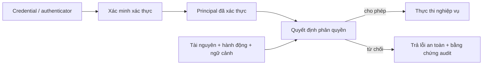
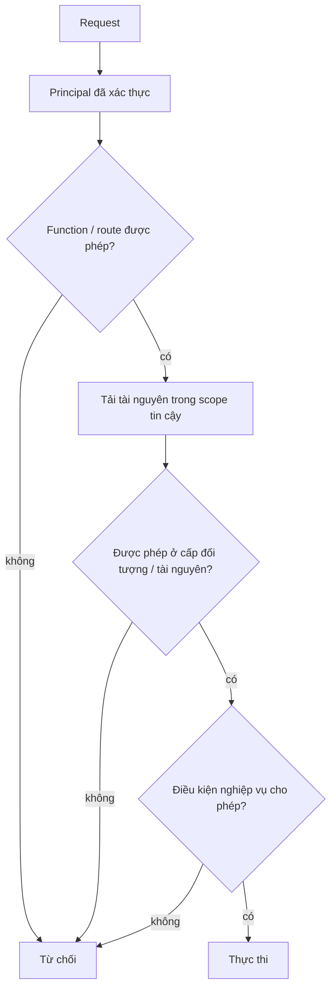
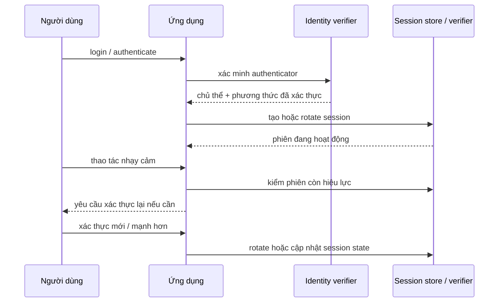

## Danh tính và quyền hạn là hai câu hỏi khác nhau

Xác thực và phân quyền nằm cạnh nhau trong vòng đời request nhưng giải quyết hai vấn đề khác nhau:

- **Xác thực:** chủ thể nào vừa chứng minh quyền kiểm soát một authenticator hay credential được hệ thống chấp nhận?
- **Phân quyền:** principal vừa được xác thực có được phép thực hiện hành động này trên tài nguyên này trong ngữ cảnh hiện tại hay không?



Một phiên hoặc token hợp lệ **không** đồng nghĩa với quyền truy cập mọi route, object, field hay thao tác nghiệp vụ.

<TermBox term="Principal">
**Principal** là danh tính bảo mật mà ứng dụng dùng khi ra quyết định sau bước xác thực. Nó thường gồm một định danh chủ thể ổn định cùng một số thuộc tính được chọn như tenant, role, phương thức xác thực hoặc mức assurance.

**Tại sao quan trọng:** code nghiệp vụ phải phân quyền trên một principal rõ ràng thay vì suy đoán danh tính từ trường request do client kiểm soát.
</TermBox>

## 1. Xác thực chứng minh quyền kiểm soát, không tạo ra quyền vô hạn

Xác thực kiểm tra bằng chứng do claimant cung cấp. Tùy hệ thống, bằng chứng có thể là mật khẩu, passkey, hardware key, mã dùng một lần, client certificate hoặc một federated assertion đã được xác minh đúng cách.

Cần tách ba khái niệm:

1. **Identity proofing** hỏi tài khoản đã được gắn với danh tính ngoài đời thật mạnh đến mức nào khi điều đó cần thiết.
2. **Xác thực** hỏi claimant hiện có kiểm soát authenticator gắn với tài khoản/chủ thể đó hay không.
3. **Phân quyền** hỏi principal đã xác thực được phép làm gì ở thời điểm này.

NIST SP 800-63-4 tách các mối quan tâm này qua assurance cho identity, authentication và federation. NIST SP 800-63B-4 định nghĩa Authentication Assurance Levels (AAL). AAL2 yêu cầu hai yếu tố xác thực khác nhau và ứng dụng ở mức này phải cung cấp lựa chọn chống phishing; AAL3 yêu cầu xác thực kháng phishing.

Điều đó không có nghĩa là luôn ép phương thức mạnh nhất cho mọi trang. Hãy chọn mức xác thực theo impact và threat model, rồi step-up khi thao tác nhạy cảm cần bằng chứng mạnh hơn.

<TermBox term="Xác thực kháng phishing">
Một phương thức **xác thực kháng phishing** dùng giao thức khiến verifier do kẻ tấn công kiểm soát không thể replay hoặc chuyển tiếp bí mật xác thực để giả mạo người dùng tại verifier hợp lệ.

**Tại sao quan trọng:** xác thực mạnh hơn làm giảm khả năng hệ thống đưa ra quyết định phân quyền cho kẻ tấn công đang điều khiển một phiên bị đánh cắp.
</TermBox>

## 2. Xây dựng principal một cách có chủ đích

Sau khi xác minh credential, hãy dựng principal tối thiểu từ dữ liệu danh tính mà server tin cậy. Các trường thường gặp:

```text
subject_id
principal_type = user | service
organization_or_tenant_id
roles / groups / entitlements
session_id hoặc token identifier
authentication_time
authentication_method / assurance
```

Không sao chép tùy tiện claim từ client vào principal. Token đã ký vẫn cần kiểm tra signature, issuer, audience, lifetime và kỳ vọng claim riêng của ứng dụng trước khi claim trở thành input đáng tin cậy.

Nếu cần thu hồi quyền nhanh, tránh nhét permission dễ thay đổi vào credential sống quá lâu. Một token còn hợp lệ về mật mã vẫn có thể biểu diễn authority mà ứng dụng không còn muốn cấp.

## 3. Biến phân quyền thành một quyết định rõ ràng

Một mental model hữu ích là:

```text
chủ thể + hành động + tài nguyên + ngữ cảnh -> cho phép | từ chối
```

Tương đương:

```text
subject + action + resource + context -> allow | deny
```

Ví dụ:

```text
chủ thể   = user:123 trong tenant:acme
hành động = invoice.read
tài nguyên = invoice:inv_42 thuộc tenant:acme
ngữ cảnh  = phiên khách hàng bình thường, region=VN
```

Phân quyền phải **mặc định từ chối**. Nếu không có policy nào cấp quyền rõ ràng cho thao tác, hãy reject.



OWASP Authorization Cheat Sheet khuyến nghị deny-by-default và kiểm permission trên mọi request. Middleware hoặc policy infrastructure tập trung có thể giúp enforcement nhất quán, nhưng policy vẫn phải nhận đủ thông tin tài nguyên và hành động để đưa ra quyết định thật.

## 4. Kiểm tra route chưa đủ: phải phân quyền trên object

Một route như `GET /invoices/:id` có thể chỉ cho khách hàng đã đăng nhập truy cập mà vẫn dễ bị khai thác.

Nếu handler tải `invoice_id = 42` rồi trả về chỉ vì caller đã đăng nhập, hệ thống có xác thực nhưng thiếu phân quyền cấp đối tượng.

OWASP gọi lớp lỗi này là **Broken Object Level Authorization (BOLA)**. Cách sửa không phải chỉ đổi ID sang UUID khó đoán. ID ngẫu nhiên giảm khả năng đoán nhưng mọi access vẫn phải được authorize.

Khi có thể, hãy đưa ownership scope đáng tin cậy vào ngay truy vấn dữ liệu:

```text
TỆ:
  invoice = invoices.findById(request.params.id)
  return invoice

TỐT HƠN:
  invoice = invoices.findByTenantAndId(principal.tenantId, request.params.id)
  authorize(principal, "invoice.read", invoice)
  return invoice
```

Scoping lookup rồi áp policy rõ ràng tạo defense in depth và giảm khả năng vô tình tải dữ liệu tenant khác trước khi kiểm quyền.

## 5. Role chỉ là input của policy, không phải toàn bộ policy

RBAC hữu ích cho quyền thô như “support agent được vào support tools”, nhưng thường không đủ cho các rule như:

- người dùng chỉ được sửa hồ sơ của chính mình;
- thành viên project chỉ được đọc repository khi membership còn hiệu lực;
- approver chỉ duyệt payment dưới giới hạn cấu hình và không được duyệt yêu cầu của chính mình;
- một service chỉ được ghi vào đúng tenant hoặc queue đã chỉ định.

Những quyết định này phụ thuộc thuộc tính hoặc quan hệ giữa principal, tài nguyên và ngữ cảnh. Rule phải đủ gần domain để thấy các fact đó, đồng thời enforcement phải đủ nhất quán để một endpoint bị quên không tạo lỗ hổng.

## 6. Vòng đời phiên là một phần của xác thực

Đăng nhập thành công chỉ bắt đầu hoặc nâng cấp phiên đã xác thực; nó không kết thúc bài toán xác thực.



Vận hành session với rule vòng đời rõ ràng:

- dùng session ID khó đoán hoặc token đã được xác minh đúng;
- rotate session ID sau xác thực và sau thay đổi privilege để ngăn session fixation;
- định nghĩa inactivity timeout và overall lifetime theo risk;
- yêu cầu **xác thực lại** cho thao tác nhạy cảm hoặc sự kiện rủi ro như account recovery, đổi credential hoặc hành vi đáng ngờ;
- hỗ trợ **thu hồi** sau logout, lộ credential, đổi permission hoặc hành động quản trị khi threat model cần mất authority ngay;
- không coi token expiration là cùng một thứ với revocation.

OWASP Authentication và Session Management guidance khuyến nghị reauthentication cho sự kiện rủi ro/thao tác nhạy cảm và renewal session sau thay đổi privilege.

## 7. Step-up authentication và phân quyền phối hợp với nhau

Policy có thể yêu cầu xác thực mạnh hơn cho một hành động mà không bắt mọi trang dùng mức đó.

Ví dụ:

```text
đọc đơn hàng của mình  -> phiên đã xác thực là đủ
đổi mật khẩu           -> yêu cầu xác thực lại mới
thêm payout account    -> policy ưu tiên/yêu cầu MFA kháng phishing
duyệt payout lớn       -> xác thực mạnh hơn + rule phân quyền độc lập
```

Độ mạnh xác thực là input cho quyết định phân quyền, không thay thế phân quyền. Một admin vừa xác thực lại vẫn có thể bị cấm duyệt payment của chính mình.

## 8. Service identity cũng là principal

Background worker, scheduled job, CI và service đều là principal dù không có con người trực tiếp thao tác.

Hãy dùng **danh tính dịch vụ** hoặc danh tính máy riêng với authority hẹp. Ưu tiên workload credential ngắn hạn hoặc platform identity thay vì copy user token sống lâu hay dùng chung API key.

Service principal vẫn cần được đánh giá theo:

```text
chủ thể + hành động + tài nguyên + ngữ cảnh
```

Các restriction hữu ích gồm audience, environment, namespace, tenant, operation và credential lifetime.

Đừng biến “internal traffic” thành bypass phân quyền. Vị trí mạng chỉ là context, không chứng minh mọi caller nội bộ đều nên có mọi quyền.

## 9. Từ chối phải an toàn và để lại bằng chứng hữu ích

Authorization failure không nên làm lộ nhiều thông tin hơn cần thiết. Tùy API contract, trả `404` thay vì `403` có thể phù hợp nếu việc tiết lộ resource tồn tại đã là thông tin nhạy cảm.

Ghi đủ bằng chứng **audit / nhật ký** để tái dựng quyết định quan trọng mà không log secret:

```text
request_id / trace_id
principal subject hoặc định danh an toàn
principal type
phương thức / độ mới của xác thực khi cần
action
resource type + định danh an toàn
tenant / scope
decision = allow | deny
policy hoặc rule identifier
reason category
```

Theo dõi denial rate và pattern phân quyền bất thường, nhưng không log bearer token, mật khẩu, session secret hoặc payload nhạy cảm.

Audit log là bằng chứng, không phải enforcement. Một hành động trái phép được log hoàn hảo vẫn là hành động trái phép.

## Sự cố production: người dùng đã xác thực vượt ranh giới tenant

> **Tình huống:** Một endpoint hóa đơn SaaS yêu cầu phiên khách hàng hợp lệ. Handler nhận `/invoices/:id`, tải invoice bằng global ID rồi trả về. Không có policy nào so tenant của principal đã xác thực với tenant của invoice.

**Hậu quả:** Một khách hàng đổi invoice ID và đọc metadata hóa đơn của tenant khác. Vì mọi request đều có session hợp lệ, dashboard xác thực thông thường vẫn cho thấy tỷ lệ thành công bình thường.

**Nguyên nhân cốt lõi:** Service đồng nhất “khách hàng đã xác thực” với “được phép truy cập invoice này”. Authentication ở route-level có tồn tại nhưng resource-level authorization bị thiếu. Độ khó đoán của identifier cũng bị hiểu nhầm là security boundary.

**Cách khắc phục chuẩn:** Xác thực caller, dựng principal đáng tin cậy, tải object trong tenant scope của principal khi có thể, sau đó áp policy `chủ thể + hành động + tài nguyên + ngữ cảnh` rõ ràng. Mặc định từ chối, test truy cập object xuyên tenant và phát audit evidence an toàn cho các quyết định deny.

## Checklist vận hành ranh giới truy cập

- [ ] **Xác thực:** Độ mạnh authenticator có phù hợp với risk của hành động không?
- [ ] **Principal:** Identity và authorization attributes có chỉ đến từ dữ liệu server đã xác minh không?
- [ ] **Mặc định từ chối:** Policy không match có deny thay vì ngầm permit không?
- [ ] **Mọi request:** Authorization có được enforce ở mọi protected path, không chỉ UI hoặc một nhóm controller không?
- [ ] **Phân quyền cấp tài nguyên:** Quyền có dựa trên object/tenant/relationship thật thay vì chỉ route role không?
- [ ] **Field nhạy cảm:** Các property đọc/ghi có bị giới hạn bởi policy thay vì generic serialization/binding không?
- [ ] **Phiên:** Session ID có rotate sau authentication và privilege change không?
- [ ] **Xác thực lại:** Sensitive action và risk event có yêu cầu authentication đủ mới/đủ mạnh không?
- [ ] **Thu hồi:** Authority bị lộ hoặc bị rút có thể dừng trước lúc token tự hết hạn khi cần không?
- [ ] **Danh tính dịch vụ:** Máy có dùng principal riêng, ngắn hạn, ít quyền thay vì mượn danh tính người dùng không?
- [ ] **Audit:** Operator có tái dựng allow/deny decision mà không lưu secret không?
- [ ] **Test:** Cross-user, cross-tenant, privilege escalation và missing-policy cases có được machine-check không?

## Kiểm tra mental model

> Một người dùng có phiên hợp lệ với mức mạnh tương đương AAL2 và gọi `DELETE /projects/alpha`. Route chỉ cho user đã đăng nhập có role `member`. Như vậy đã đủ để authorize xóa project chưa?

<details>
<summary>Xem lập luận</summary>

Chưa. Xác thực mạnh chỉ tạo confidence về ai đang kiểm soát session; role `member` chỉ là coarse entitlement. Service vẫn cần một quyết định resource-level cho hành động xóa.

Một check tốt cần chủ thể đã xác thực, `project.delete`, resource `project:alpha` thật và ngữ cảnh liên quan như organization membership, ownership, trạng thái project, separation-of-duties và authentication freshness nếu xóa là thao tác nhạy cảm.

Nếu không có rule rõ ràng cấp quyền cho tổ hợp đó, hãy deny. Nếu thao tác cần authentication mới hơn, hãy xác thực lại rồi chạy authorization lần nữa; reauthentication không phải automatic grant.
</details>

## Agent rule

Khi thay đổi backend path đã xác thực, đừng dừng ở “token hợp lệ”. Hãy chỉ ra principal được thiết lập thế nào, action cần authentication strength/freshness gì, quyết định `chủ thể + hành động + tài nguyên + ngữ cảnh` cụ thể, default-deny behavior, session/revocation implications, rule cho machine identity, negative tests và audit evidence chứng minh enforcement ở production.

## Nguồn

- [NIST SP 800-63-4 — Digital Identity Guidelines](https://pages.nist.gov/800-63-4/sp800-63.html)
- [NIST SP 800-63B-4 — Authentication and Authenticator Management](https://pages.nist.gov/800-63-4/sp800-63b.html)
- [OWASP Authorization Cheat Sheet](https://cheatsheetseries.owasp.org/cheatsheets/Authorization_Cheat_Sheet.html)
- [OWASP Authentication Cheat Sheet](https://cheatsheetseries.owasp.org/cheatsheets/Authentication_Cheat_Sheet.html)
- [OWASP Session Management Cheat Sheet](https://cheatsheetseries.owasp.org/cheatsheets/Session_Management_Cheat_Sheet.html)
- [OWASP API1:2023 — Broken Object Level Authorization](https://owasp.org/API-Security/editions/2023/en/0xa1-broken-object-level-authorization/)
