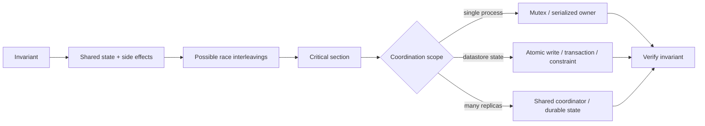
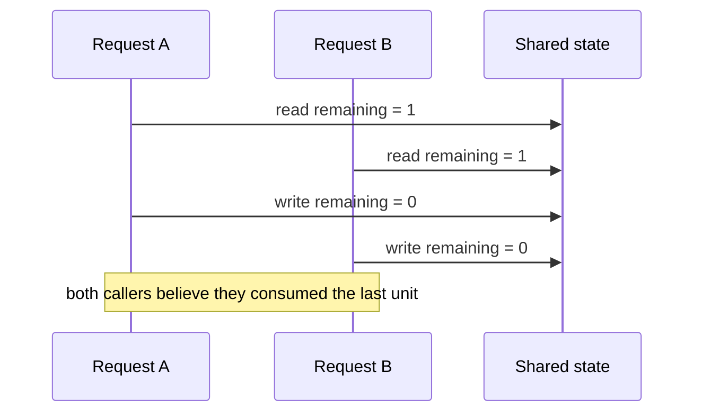
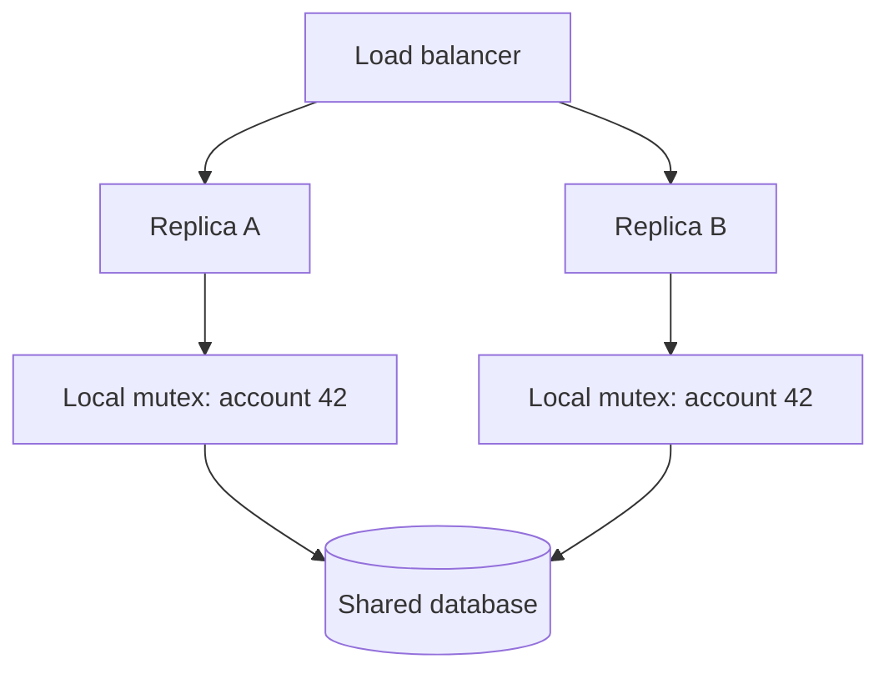
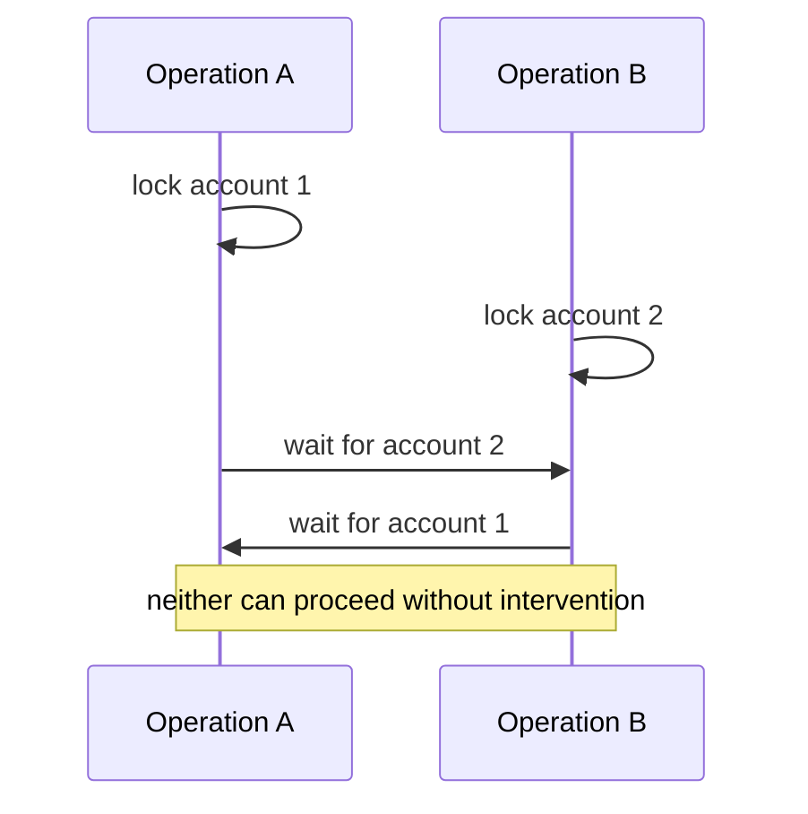

# Backend Concurrency: Preserve Invariants When Requests Overlap

## TL;DR

Backend concurrency begins the moment two units of work can overlap while touching state that matters to the same invariant. They do not need to execute on different CPU cores. Two async tasks, two threads, two processes, or two service replicas can all create concurrency bugs if correctness depends on timing.

A durable reasoning loop is:

1. state the **invariant** that must survive every successful operation;
2. identify the state and side effects that determine it;
3. find the smallest **critical section** where conflicting work must not interleave freely;
4. determine the real coordination scope: one task, one process, one database, or many service instances;
5. choose the narrowest primitive that makes the invariant atomic enough;
6. define conflict, retry, timeout, and failure behavior explicitly;
7. measure contention instead of weakening correctness to gain throughput.



The goal is not “use locks.” The goal is **make invalid interleavings impossible or detect and reject them before they commit**.

<TermBox term="Concurrency">
**Concurrency** means multiple units of work can make progress during overlapping periods of time. Their operations may be interleaved even if only one CPU core executes instructions at any instant.

**Why it matters:** backend requests commonly overlap because servers handle many connections, async continuations, workers, and replicas at once. Correctness must not depend on one lucky ordering.
</TermBox>

## 1. Start from the invariant

Concurrency bugs are easier to reason about when you stop asking “can these two lines run at the same time?” and instead ask:

> What must still be true after every allowed overlap?

Examples of invariants:

- inventory never becomes negative;
- a username is unique within one tenant;
- at most one active payout exists for a settlement batch;
- an account balance cannot cross a configured floor;
- one scheduled job owns a lease at a time;
- an order cannot move from `cancelled` back to `paid`.

The invariant determines the protection boundary. A mutex around an in-memory map cannot enforce a uniqueness rule whose true state lives in a shared database. A database row lock cannot protect an external payment that already succeeded elsewhere.

<TermBox term="Invariant">
An **invariant** is a property that must remain true across all valid state transitions, including transitions attempted concurrently.

**Why it matters:** the invariant tells you what coordination must protect. Without it, teams often lock too much, too little, or the wrong state entirely.
</TermBox>

## 2. A race condition is an interleaving problem

Consider a naive quota check:

```text
read remaining = 1
if remaining > 0:
  write remaining = remaining - 1
```

Two requests can interleave like this:



The final number may look harmless, but the business effect is wrong: two operations were accepted from one unit of capacity.

A **race condition** exists when correctness depends on which concurrent operation wins a timing race. The dangerous pattern is often not a low-level torn memory write. It is a multi-step decision such as **read → check → act**.

A related failure is the **lost update**:

```text
A reads version 7
B reads version 7
A writes change X as version 8
B writes change Y as version 8
```

If B overwrites A without detecting the conflict, A's successful update is lost.

<TermBox term="Race condition">
A **race condition** occurs when an outcome depends on an uncontrolled ordering of concurrent operations and at least one possible ordering violates the intended behavior.

**Why it matters:** tests that run one request at a time can pass while production fails only under overlap.
</TermBox>

## 3. Atomicity closes the read-check-write gap

An operation is **atomic** with respect to an observer when it behaves as one indivisible state transition: conflicting work cannot observe or commit a forbidden intermediate interleaving.

Instead of:

```text
read remaining
check remaining > 0
write remaining - 1
```

prefer an atomic conditional state transition when the datastore supports it:

```sql
UPDATE inventory
SET remaining = remaining - 1
WHERE sku = $1
  AND remaining > 0
RETURNING remaining;
```

Now the datastore decides whether the transition is valid at the same boundary where it applies the write.

Atomicity is always relative to a boundary. A language-level atomic increment can protect one memory location but not automatically protect:

- two related fields that must change together;
- multiple rows that form one business invariant;
- state split across a database and a remote API;
- multiple service replicas each holding their own memory.

<TermBox term="Critical section">
A **critical section** is the smallest region of work whose conflicting executions must be coordinated so an invariant cannot be broken by interleaving.

**Why it matters:** making it too small leaves races; making it too large creates unnecessary contention and latency.
</TermBox>

## 4. First choice: remove unnecessary shared mutable state

The cheapest lock is often the one you do not need.

Before coordinating, ask whether ownership can be simplified:

- make request-local data immutable;
- partition work so one owner handles one key at a time;
- use append-only events instead of in-place mutation where appropriate;
- compute pure values outside the critical section;
- move durable uniqueness or bounds into datastore constraints;
- avoid global in-memory registries for state that belongs to users, tenants, or jobs.

For example, if each worker owns exactly one partition, operations on different partitions do not need a global mutex. If uniqueness is a database rule, a unique constraint can be a stronger and simpler concurrency primitive than “check first, insert later.”

Do not treat “lock-free” as automatically better. A design that removes shared state is valuable because it reduces coordination **and** makes the correctness model clearer.

## 5. Optimistic concurrency: detect conflict, then retry or reject

**Optimistic concurrency** assumes conflicts are possible but not common enough to justify blocking every operation up front. The writer proves that the state it based its decision on is still current.

A typical version check looks like:

```sql
UPDATE documents
SET body = $1,
    version = version + 1
WHERE id = $2
  AND version = $3;
```

If zero rows are updated, another writer changed the document first. The application can then:

- re-read and retry when the operation is safely recomputable;
- surface a conflict so a human can reconcile edits;
- merge only if the domain has a correct merge rule.

The same idea appears as compare-and-swap, conditional writes, version columns, or HTTP preconditions such as `If-Match`.

Optimistic concurrency is a good fit when:

- conflicts are relatively rare;
- holding locks across user think-time would be expensive;
- recomputation or conflict handling is well defined;
- the write target can expose a trustworthy version/precondition.

It is a poor fit when hot contention makes many writers repeatedly fail and retry. At that point, retries become contention amplification rather than useful concurrency.

## 6. Pessimistic concurrency: block conflicting work deliberately

**Pessimistic concurrency** acquires a lock or exclusive ownership before performing the protected decision. This is useful when conflicts are expected, the protected resource is concrete, and blocking is cheaper than repeated failed attempts.

Examples include:

- a process mutex protecting one in-memory structure;
- a database row lock while a transaction updates related state;
- a single-threaded owner/actor processing operations for one key;
- a lease when exclusive ownership must span processes.

The key questions are:

1. What exactly does the lock name or own?
2. Who can contend for it?
3. How long may it be held?
4. What happens if the holder crashes?
5. Can waiters time out or cancel?
6. Does the lock protect the real source of truth?

A lock is not correctness by itself. It works only when **every conflicting path participates in the same coordination protocol**.

<TermBox term="Contention">
**Contention** is competition among concurrent operations for the same limited resource or coordination primitive.

**Why it matters:** contention turns a correctness mechanism into latency, queueing, timeout, and throughput pressure. It should be measured, not guessed.
</TermBox>

## 7. Process-local locks stop at the process boundary

This is one of the most common backend mistakes:

```text
request arrives
acquire process-local mutex for account 42
check durable account state
write durable account state
release mutex
```

That mutex can coordinate threads or async tasks **inside one server process**. It does not coordinate another replica with a different memory space.



Both `MA` and `MB` can be acquired at the same time because they are different locks.

Use a process-local lock only when the protected invariant is genuinely process-local, or as an optimization layered on top of a shared correctness mechanism.

For cross-replica correctness, prefer primitives owned by the shared state system when possible:

- atomic conditional writes;
- unique/check constraints;
- transactions and appropriate isolation;
- datastore-provided compare-and-swap/version checks;
- a durable queue or single owner per partition.

Reach for a distributed lock only when exclusive ownership itself is the domain requirement and simpler state-native primitives do not express it well. Distributed locks introduce lease duration, fencing, clock/failure, and stale-owner concerns that deserve their own deeper treatment.

## 8. Transactions are one concurrency tool, not a magic shield

Database transactions are appropriate when the invariant is owned by database state and several reads/writes must form one logical decision.

But `BEGIN`/`COMMIT` alone does not prove safety. You still need to reason about:

- which snapshots concurrent transactions can observe;
- whether two transactions can both validate and then commit conflicting decisions;
- whether row/predicate locks are required;
- whether Serializable isolation may abort an unsafe interleaving;
- whether the application retries the **whole transaction** when required.

PostgreSQL documentation explicitly treats serialization failures as expected outcomes at stronger isolation levels, and recommends retrying the complete transaction logic rather than only one failed statement. PostgreSQL also documents that explicit locks can deadlock and recommends consistent lock acquisition order as a primary defense.

That is why this lesson focuses on selecting the coordination scope, while **Database Transactions & Isolation** goes deeper on datastore-specific transaction semantics.

## 9. Deadlock: correct locks can still stop progress

A deadlock occurs when concurrent operations form a wait cycle.



Common defenses:

- acquire multiple resources in one deterministic order;
- keep critical sections short;
- avoid remote calls while holding locks;
- use lock/transaction timeouts;
- detect and retry deadlock victims when the underlying system reports them;
- reduce the number of resources one operation must hold simultaneously.

Do not “fix” deadlocks by removing locks without restoring the invariant another way. That trades an availability failure for silent data corruption.

## 10. Contention is a queue, whether you drew one or not

If 500 requests require one exclusive critical section, only one can hold it at a time. The other 499 are effectively queued somewhere: in the application, runtime, connection pool, database, or lock manager.

That means concurrency design is also capacity design.

Useful signals include:

- lock wait time;
- transaction duration;
- conflict/retry rate;
- queue depth;
- timeout/cancellation rate;
- hot-key distribution;
- work completed per critical-section acquisition.

When contention is high, possible improvements include:

- shrink the critical section;
- partition ownership by key;
- batch compatible operations;
- move pure computation before lock acquisition;
- replace pessimistic locking with a correct atomic conditional operation;
- serialize hot-key work deliberately rather than allowing unbounded retry storms.

The wrong optimization is to weaken the invariant because “the race is unlikely.”

## Production scenario: duplicate exports across six replicas

A reporting API allows only one active export per `(tenant_id, report_id)`. To prevent duplicate expensive jobs, each application process keeps an in-memory mutex keyed by that pair.

During a traffic spike, two identical requests arrive nearly together. The load balancer sends them to different replicas.

Each replica:

1. acquires its own process-local mutex;
2. queries and sees no active export yet;
3. creates an export row and schedules background work;
4. returns `202 Accepted`.

Both requests succeed because the two mutexes never coordinate with each other.

**Impact:** duplicate exports consume database and worker capacity, users receive multiple completion notifications, and cleanup logic races over which artifact is canonical.

**Root cause:** the invariant “at most one active export per tenant/report” was durable and cross-replica, but the coordination primitive was process-local. The application protected the wrong scope. The read-then-create sequence also had no shared atomic uniqueness boundary.

**Correct pattern:** make the invariant enforceable where the shared state lives—for example, with a datastore uniqueness/conditional-create rule covering active exports, or another atomic ownership record. Treat a process-local mutex only as an optional contention optimization. If duplicate client delivery is also possible, give the request/job a durable idempotency identity. Schedule background work from committed durable state so a retry cannot create an untracked second job.

The lesson is broader than exports: **coordination must live at least as widely as the invariant it protects**.

## Common mistakes

### “JavaScript/async code is single-threaded, so races cannot happen”

An `await` creates an interleaving point. Another request can mutate shared or durable state before the first continuation resumes. Concurrency does not require simultaneous CPU execution.

### “We put a mutex around it”

Ask where the mutex lives. A per-process lock does not coordinate other replicas, worker processes, cron jobs, or administrative tools unless they share the same protocol.

### “A transaction means the workflow is safe”

Atomic commit and isolation are different properties. Extract the invariant and prove that the selected transaction/isolation/constraint strategy rejects unsafe overlaps.

### “Optimistic retries always scale better”

At high contention, repeated conflicts can create retry storms. Measure conflict rate and choose a serialization strategy appropriate to the hot path.

### “We can hold the lock while calling another service”

Remote I/O makes lock duration depend on another failure domain. Prefer committing local ownership/state quickly, then coordinate remote effects with durable workflow patterns.

### “Deadlock means locking was the wrong idea”

Deadlock means the wait graph can cycle. Fix ordering, scope, timeout, or ownership design while preserving correctness.

## Self-check

A service has four replicas. Each replica keeps an in-memory `Set` of usernames currently being registered. A request checks the set, checks the database for availability, then inserts the new user. Two requests for the same username can land on different replicas.

What is the strongest correction?

<details>
<summary>Show the reasoning</summary>

The in-memory set protects only one process and therefore cannot enforce cross-replica uniqueness. The durable invariant belongs in the shared datastore.

Use a datastore uniqueness constraint or equivalent atomic conditional insert as the correctness boundary. The process-local set may remain as an optimization to reduce duplicate work within one replica, but correctness must not depend on it. If insertion conflicts, return or translate the conflict according to the API contract instead of trying to “check harder” before the insert.

</details>

## Concurrency review checklist

- [ ] **Invariant:** Can I state exactly what must remain true after every successful overlapping operation?
- [ ] **State owner:** Which system owns the state that determines that invariant?
- [ ] **Race:** Can two requests both pass a read/check step before either conflicting write is visible?
- [ ] **Atomicity:** Can the rule be expressed as one atomic conditional write or datastore constraint?
- [ ] **Critical section:** Is the protected region the smallest region that actually determines correctness?
- [ ] **Scope:** Does the coordination primitive span every process, replica, worker, and tool that can violate the invariant?
- [ ] **Optimistic path:** If using versions/compare-and-swap, is conflict detection trustworthy and is retry/reconciliation bounded?
- [ ] **Pessimistic path:** If blocking, are lock ownership, ordering, timeout, cancellation, and crash behavior explicit?
- [ ] **Transactions:** If a database transaction is involved, does its isolation/locking strategy protect the actual invariant?
- [ ] **Deadlocks:** Can multiple resource acquisitions form a wait cycle, and is acquisition order deterministic?
- [ ] **Contention:** Can production telemetry show wait time, hot keys, conflict rate, retries, and critical-section duration?
- [ ] **External effects:** Are remote side effects kept outside assumptions that local atomicity can roll them back?

## Agent rule

When reviewing concurrent backend code, do not approve a mutex, transaction, retry loop, or distributed lock by name alone. First extract the invariant and the complete set of actors that can violate it. Then verify that the coordination primitive covers that scope, that unsafe interleavings are impossible or rejected, and that conflict, timeout, crash, retry, contention, and deadlock behavior are explicit.

## Related concepts

- **Database Transactions & Isolation** — protects database-owned invariants across multiple statements and defines serialization/locking behavior.
- **Idempotency** — repeated delivery should not accidentally repeat a durable effect.
- **Distributed Locks** — coordinates exclusive ownership across processes but adds lease and stale-owner failure modes.
- **Background Jobs** — worker concurrency needs explicit ownership, retry, and deduplication rules.
- **Message Queues** — can deliberately serialize or partition work instead of allowing uncontrolled overlap.

Continue through the [Backend Systems](/docs/learning-paths/backend-systems) path toward background jobs, caching, queues, partial failure, and resilience.

## Sources

Primary references verified on **2026-09-10**:

- [Go Memory Model](https://go.dev/ref/mem) — a concrete language memory model illustrating why concurrent access to shared mutable state requires synchronization.
- [PostgreSQL documentation — Transaction Isolation](https://www.postgresql.org/docs/current/transaction-iso.html)
- [PostgreSQL documentation — Explicit Locking](https://www.postgresql.org/docs/current/explicit-locking.html)
- [PostgreSQL documentation — Serialization Failure Handling](https://www.postgresql.org/docs/current/mvcc-serialization-failure-handling.html)

This lesson is **evolving** with a 180-day review target. The invariant-first reasoning model is durable, while runtime primitives, datastore behavior, and operational guidance continue to evolve.
