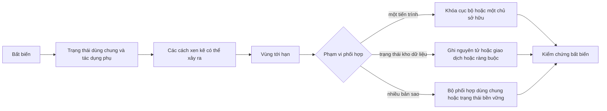
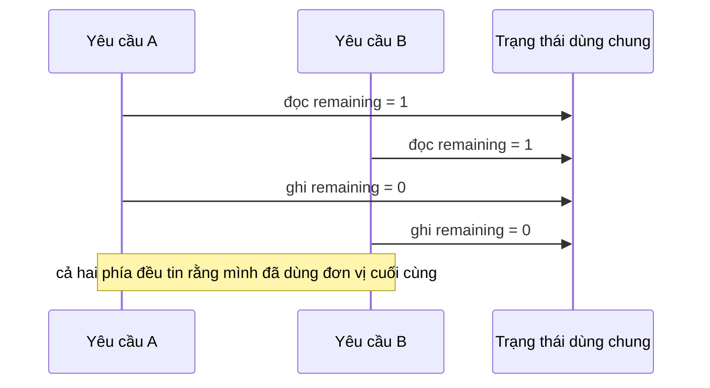
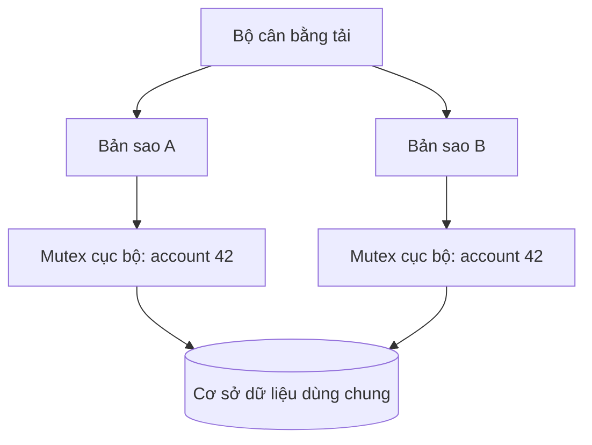
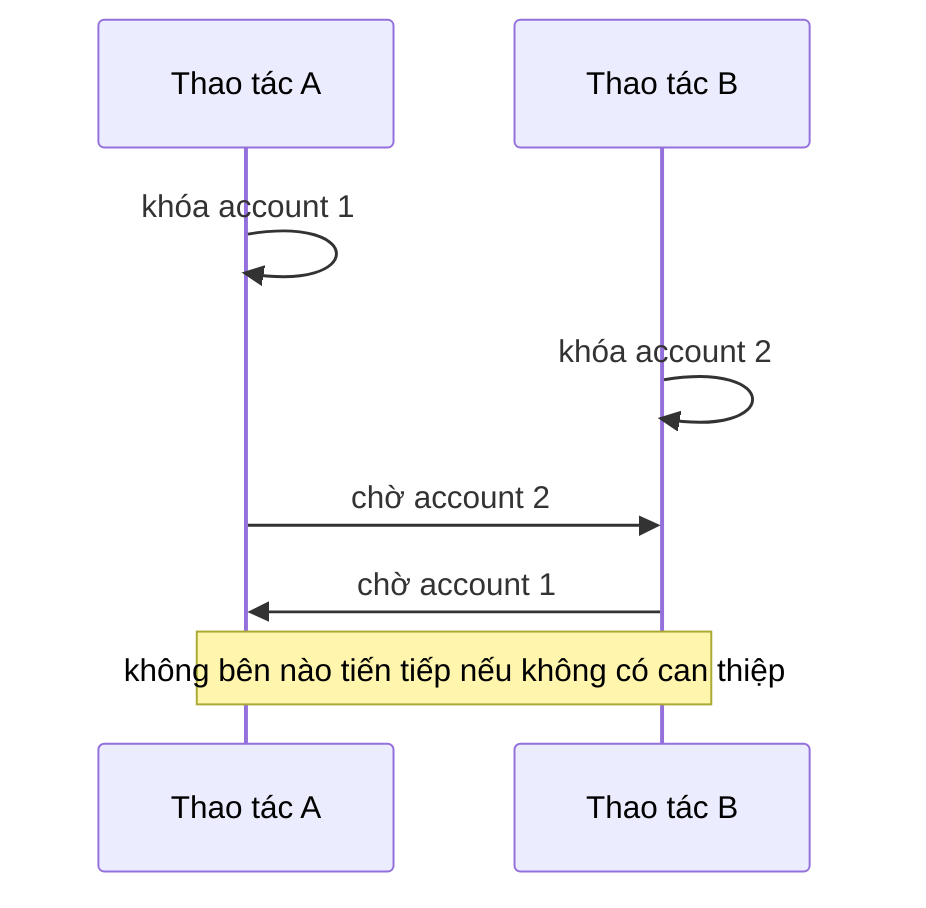

# Đồng thời phía máy chủ: Giữ bất biến khi các yêu cầu chồng lấn

## Tóm tắt

Bài toán đồng thời phía máy chủ xuất hiện ngay khi hai đơn vị công việc có thể chồng lấn trong lúc cùng tác động đến trạng thái quyết định một bất biến. Chúng không cần chạy trên hai lõi CPU khác nhau. Hai tác vụ bất đồng bộ, hai luồng, hai tiến trình hoặc hai bản sao dịch vụ đều có thể tạo lỗi đồng thời nếu tính đúng đắn phụ thuộc vào thời điểm thực thi.

Một vòng lập luận bền vững là:

1. nêu **bất biến** phải còn đúng sau mọi thao tác thành công;
2. xác định trạng thái và tác dụng phụ quyết định bất biến đó;
3. tìm **vùng tới hạn** nhỏ nhất nơi các công việc xung đột không được xen kẽ tùy ý;
4. xác định phạm vi phối hợp thật sự: một tác vụ, một tiến trình, một cơ sở dữ liệu hay nhiều bản sao dịch vụ;
5. chọn cơ chế hẹp nhất nhưng đủ làm chuyển trạng thái có tính nguyên tử cần thiết;
6. định nghĩa rõ cách xử lý xung đột, thử lại, hết thời gian và lỗi;
7. đo tranh chấp tài nguyên thay vì nới lỏng tính đúng đắn để lấy thông lượng.



Mục tiêu không phải là “dùng khóa”. Mục tiêu là **làm cho cách xen kẽ không hợp lệ trở thành bất khả thi, hoặc phát hiện và từ chối nó trước khi được ghi nhận**.

<TermBox term="Đồng thời">
**Đồng thời** nghĩa là nhiều đơn vị công việc có thể tiến triển trong các khoảng thời gian chồng lấn. Các thao tác của chúng có thể xen kẽ ngay cả khi tại một thời điểm chỉ có một lõi CPU thực thi lệnh.

**Vì sao quan trọng:** máy chủ thường xử lý nhiều kết nối, phần tiếp tục sau `await`, tiến trình nền và nhiều bản sao cùng lúc. Tính đúng đắn không được dựa vào một thứ tự may mắn.
</TermBox>

## 1. Bắt đầu từ bất biến

Lỗi đồng thời dễ phân tích hơn khi ta ngừng hỏi “hai dòng này có chạy cùng lúc không?” và thay bằng câu hỏi:

> Điều gì phải vẫn đúng sau mọi cách chồng lấn được phép?

Ví dụ về bất biến:

- tồn kho không bao giờ âm;
- tên người dùng là duy nhất trong một tenant;
- mỗi lô quyết toán chỉ có tối đa một khoản chi trả đang hoạt động;
- số dư tài khoản không được thấp hơn ngưỡng cấu hình;
- tại một thời điểm chỉ một công việc lịch biểu sở hữu lease;
- đơn hàng đã `cancelled` không thể quay lại `paid`.

Bất biến quyết định ranh giới bảo vệ. Một mutex quanh `Map` trong bộ nhớ không thể thực thi quy tắc duy nhất nếu nguồn sự thật nằm trong cơ sở dữ liệu dùng chung. Một khóa hàng trong cơ sở dữ liệu cũng không thể hoàn tác khoản thanh toán đã thành công ở hệ thống bên ngoài.

<TermBox term="Bất biến">
**Bất biến** là thuộc tính phải còn đúng qua mọi chuyển trạng thái hợp lệ, kể cả các chuyển trạng thái được thử đồng thời.

**Vì sao quan trọng:** bất biến cho biết chính xác điều gì cần phối hợp. Không có nó, đội phát triển thường khóa quá nhiều, quá ít hoặc khóa nhầm trạng thái.
</TermBox>

## 2. Điều kiện tranh đua là vấn đề về cách xen kẽ

Xét một kiểm tra quota ngây thơ:

```text
đọc remaining = 1
nếu remaining > 0:
  ghi remaining = remaining - 1
```

Hai yêu cầu có thể xen kẽ như sau:



Con số cuối có vẻ không bất thường, nhưng hiệu ứng nghiệp vụ đã sai: hai thao tác cùng được chấp nhận từ một đơn vị dung lượng.

**Điều kiện tranh đua** xảy ra khi tính đúng đắn phụ thuộc vào bên nào thắng cuộc đua thời gian. Mẫu nguy hiểm thường không phải một phép ghi bộ nhớ bị xé nhỏ ở mức thấp. Nó thường là quyết định nhiều bước kiểu **đọc → kiểm tra → hành động**.

Một lỗi liên quan là **mất cập nhật**:

```text
A đọc phiên bản 7
B đọc phiên bản 7
A ghi thay đổi X thành phiên bản 8
B ghi thay đổi Y thành phiên bản 8
```

Nếu B ghi đè A mà không phát hiện xung đột, cập nhật thành công của A đã bị mất.

<TermBox term="Điều kiện tranh đua">
**Điều kiện tranh đua** là tình huống kết quả phụ thuộc vào thứ tự không được kiểm soát của các thao tác đồng thời và ít nhất một thứ tự có thể xảy ra vi phạm hành vi mong muốn.

**Vì sao quan trọng:** test chỉ chạy từng yêu cầu một có thể luôn pass trong khi production chỉ lỗi khi có chồng lấn.
</TermBox>

## 3. Tính nguyên tử đóng khoảng hở đọc-kiểm tra-ghi

Một thao tác có tính **nguyên tử** đối với một phía quan sát khi nó hành xử như một chuyển trạng thái không thể chia nhỏ: công việc xung đột không thể quan sát hoặc ghi nhận một cách xen kẽ bị cấm ở giữa.

Thay vì:

```text
đọc remaining
kiểm tra remaining > 0
ghi remaining - 1
```

hãy ưu tiên chuyển trạng thái có điều kiện và nguyên tử khi kho dữ liệu hỗ trợ:

```sql
UPDATE inventory
SET remaining = remaining - 1
WHERE sku = $1
  AND remaining > 0
RETURNING remaining;
```

Lúc này kho dữ liệu quyết định chuyển trạng thái có hợp lệ hay không ngay tại ranh giới nó thực hiện phép ghi.

Tính nguyên tử luôn gắn với một ranh giới. Một phép tăng nguyên tử ở mức ngôn ngữ có thể bảo vệ một ô nhớ nhưng không tự động bảo vệ:

- hai trường liên quan phải đổi cùng nhau;
- nhiều hàng cùng tạo thành một bất biến nghiệp vụ;
- trạng thái chia giữa cơ sở dữ liệu và API từ xa;
- nhiều bản sao dịch vụ, mỗi bản sao có bộ nhớ riêng.

<TermBox term="Vùng tới hạn">
**Vùng tới hạn** là vùng công việc nhỏ nhất mà các lần thực thi xung đột phải được phối hợp để việc xen kẽ không thể phá bất biến.

**Vì sao quan trọng:** vùng quá nhỏ để lọt race; vùng quá lớn tạo tranh chấp tài nguyên và độ trễ không cần thiết.
</TermBox>

## 4. Lựa chọn đầu tiên: loại bỏ trạng thái thay đổi dùng chung không cần thiết

Khóa rẻ nhất thường là khóa không cần tồn tại.

Trước khi phối hợp, hãy hỏi liệu có thể đơn giản hóa quyền sở hữu hay không:

- giữ dữ liệu riêng của từng yêu cầu ở dạng bất biến;
- phân vùng công việc để một chủ sở hữu xử lý một key tại một thời điểm;
- dùng nhật ký thêm mới thay vì sửa tại chỗ khi mô hình phù hợp;
- tính toán thuần túy bên ngoài vùng tới hạn;
- đưa quy tắc duy nhất hoặc giới hạn vào ràng buộc của kho dữ liệu;
- tránh registry toàn cục trong bộ nhớ cho trạng thái thật sự thuộc về người dùng, tenant hoặc job.

Ví dụ, nếu mỗi worker sở hữu đúng một partition, thao tác trên hai partition khác nhau không cần mutex toàn cục. Nếu tính duy nhất là quy tắc của cơ sở dữ liệu, unique constraint là cơ chế đồng thời mạnh và đơn giản hơn kiểu “kiểm tra trước, chèn sau”.

Đừng coi “không khóa” là mặc định tốt hơn. Thiết kế loại bỏ trạng thái dùng chung có giá trị vì nó vừa giảm phối hợp vừa làm mô hình đúng đắn rõ hơn.

## 5. Đồng thời lạc quan: phát hiện xung đột rồi thử lại hoặc từ chối

**Đồng thời lạc quan** giả định xung đột có thể xảy ra nhưng chưa thường xuyên đến mức đáng phải chặn mọi thao tác từ đầu. Phía ghi phải chứng minh trạng thái dùng làm cơ sở quyết định vẫn còn mới.

Một kiểm tra phiên bản điển hình:

```sql
UPDATE documents
SET body = $1,
    version = version + 1
WHERE id = $2
  AND version = $3;
```

Nếu không hàng nào được cập nhật, một phía ghi khác đã thay đổi tài liệu trước. Ứng dụng có thể:

- đọc lại và thử lại nếu thao tác có thể tính lại an toàn;
- trả xung đột để người dùng hòa giải thay đổi;
- chỉ merge nếu miền nghiệp vụ có quy tắc merge đúng đắn.

Cùng ý tưởng này xuất hiện dưới các dạng compare-and-swap, conditional write, cột phiên bản hoặc điều kiện HTTP như `If-Match`.

Đồng thời lạc quan phù hợp khi:

- xung đột tương đối hiếm;
- giữ khóa trong thời gian người dùng suy nghĩ sẽ tốn kém;
- việc tính lại hoặc xử lý xung đột được định nghĩa rõ;
- mục tiêu ghi có phiên bản hoặc điều kiện đáng tin cậy.

Nó không phù hợp khi tranh chấp nóng làm nhiều phía ghi liên tục thất bại và thử lại. Khi đó retry làm khuếch đại tranh chấp thay vì tăng tính đồng thời hữu ích.

## 6. Đồng thời bi quan: chủ động chặn công việc xung đột

**Đồng thời bi quan** lấy khóa hoặc quyền sở hữu độc quyền trước khi thực hiện quyết định được bảo vệ. Cách này hữu ích khi xung đột được dự đoán là thường xuyên, tài nguyên bảo vệ cụ thể và chặn đợi rẻ hơn nhiều lần thất bại rồi thử lại.

Ví dụ:

- mutex trong một tiến trình bảo vệ cấu trúc bộ nhớ;
- khóa hàng cơ sở dữ liệu trong lúc giao dịch cập nhật trạng thái liên quan;
- một chủ sở hữu đơn luồng xử lý thao tác cho một key;
- lease khi quyền sở hữu độc quyền phải kéo dài qua nhiều tiến trình.

Các câu hỏi cần trả lời:

1. Khóa này thực sự đại diện hoặc sở hữu cái gì?
2. Những ai có thể tranh chấp nó?
3. Được giữ trong bao lâu?
4. Nếu chủ sở hữu crash thì điều gì xảy ra?
5. Bên chờ có thể timeout hoặc hủy không?
6. Khóa có bảo vệ đúng nguồn sự thật không?

Tên “lock” không tự tạo ra correctness. Nó chỉ hoạt động khi **mọi đường thực thi có thể xung đột cùng tham gia một giao thức phối hợp**.

<TermBox term="Tranh chấp tài nguyên">
**Tranh chấp tài nguyên** là việc nhiều thao tác đồng thời cạnh tranh cùng một tài nguyên giới hạn hoặc cơ chế phối hợp.

**Vì sao quan trọng:** tranh chấp biến công cụ bảo vệ correctness thành độ trễ, hàng đợi, timeout và áp lực thông lượng. Phải đo nó thay vì đoán.
</TermBox>

## 7. Khóa nội bộ tiến trình dừng ở ranh giới tiến trình

Đây là lỗi phía máy chủ rất phổ biến:

```text
yêu cầu tới
lấy mutex nội bộ tiến trình cho account 42
kiểm tra trạng thái tài khoản bền vững
ghi trạng thái tài khoản bền vững
nhả mutex
```

Mutex đó có thể phối hợp các luồng hoặc tác vụ bất đồng bộ **trong một tiến trình máy chủ**. Nó không phối hợp bản sao khác có không gian bộ nhớ khác.



Cả `MA` và `MB` có thể được lấy cùng lúc vì chúng là hai khóa khác nhau.

Chỉ dùng khóa nội bộ tiến trình khi bất biến được bảo vệ thật sự cũng chỉ thuộc một tiến trình, hoặc dùng nó như tối ưu hóa đặt bên trên một cơ chế correctness dùng chung.

Đối với correctness qua nhiều bản sao, hãy ưu tiên primitive do hệ thống sở hữu trạng thái dùng chung cung cấp khi có thể:

- phép ghi có điều kiện nguyên tử;
- unique/check constraint;
- giao dịch và mức cô lập phù hợp;
- compare-and-swap hoặc kiểm tra phiên bản do kho dữ liệu cung cấp;
- hàng đợi bền vững hoặc một chủ sở hữu cho mỗi partition.

Chỉ dùng khóa phân tán khi quyền sở hữu độc quyền bản thân nó là yêu cầu của miền nghiệp vụ và primitive gắn với trạng thái đơn giản hơn không biểu diễn tốt. Khóa phân tán kéo theo thời hạn lease, fencing, clock/failure và chủ sở hữu cũ — các vấn đề cần một bài sâu riêng.

## 8. Giao dịch là một công cụ đồng thời, không phải lá chắn thần kỳ

Giao dịch cơ sở dữ liệu phù hợp khi bất biến thuộc trạng thái cơ sở dữ liệu và nhiều lần đọc/ghi phải tạo thành một quyết định logic.

Nhưng chỉ có `BEGIN`/`COMMIT` không chứng minh an toàn. Vẫn phải phân tích:

- snapshot nào các giao dịch đồng thời có thể nhìn thấy;
- liệu hai giao dịch có thể cùng validate rồi cùng commit quyết định xung đột không;
- có cần khóa hàng hoặc predicate không;
- mức `Serializable` có thể abort cách xen kẽ không an toàn không;
- ứng dụng có thử lại **toàn bộ giao dịch** khi cần không.

Tài liệu PostgreSQL coi serialization failure là kết quả dự kiến ở các mức cô lập mạnh hơn và yêu cầu thử lại toàn bộ logic giao dịch thay vì chỉ một câu lệnh thất bại. Tài liệu này cũng nêu rõ khóa tường minh có thể tạo bế tắc và khuyến nghị lấy nhiều khóa theo một thứ tự nhất quán.

Vì vậy bài này tập trung vào việc chọn phạm vi phối hợp, còn **Database Transactions & Isolation** đi sâu vào semantics của giao dịch trong kho dữ liệu.

## 9. Bế tắc: khóa đúng vẫn có thể làm hệ thống ngừng tiến triển

**Bế tắc** xảy ra khi các thao tác đồng thời tạo thành chu trình chờ nhau.



Các biện pháp thường dùng:

- lấy nhiều tài nguyên theo một thứ tự xác định;
- giữ vùng tới hạn ngắn;
- tránh gọi mạng từ xa trong khi đang giữ khóa;
- dùng timeout cho khóa hoặc giao dịch;
- khi hệ thống nền phát hiện bế tắc, xử lý và thử lại nạn nhân theo chính sách giới hạn;
- giảm số tài nguyên một thao tác phải giữ cùng lúc.

Đừng “sửa” bế tắc bằng cách bỏ khóa mà không khôi phục bất biến theo cách khác. Cách đó đổi lỗi khả dụng dễ thấy thành hỏng dữ liệu âm thầm.

## 10. Tranh chấp chính là một hàng đợi, dù sơ đồ của bạn có vẽ nó hay không

Nếu 500 yêu cầu đều cần cùng một vùng tới hạn độc quyền, chỉ một yêu cầu giữ được nó tại một thời điểm. 499 yêu cầu còn lại thực chất đang xếp hàng ở đâu đó: trong ứng dụng, runtime, connection pool, cơ sở dữ liệu hoặc lock manager.

Vì vậy thiết kế đồng thời cũng là thiết kế năng lực.

Các tín hiệu hữu ích:

- thời gian chờ khóa;
- thời lượng giao dịch;
- tỷ lệ xung đột và retry;
- độ sâu hàng đợi;
- tỷ lệ timeout/hủy;
- phân bố hot key;
- lượng công việc hoàn thành trên mỗi lần lấy vùng tới hạn.

Khi tranh chấp cao, có thể:

- thu nhỏ vùng tới hạn;
- phân vùng quyền sở hữu theo key;
- gom nhóm các thao tác tương thích;
- đưa tính toán thuần túy ra trước lúc lấy khóa;
- thay khóa bi quan bằng phép ghi có điều kiện nguyên tử nếu vẫn đúng;
- chủ động tuần tự hóa công việc của hot key thay vì để retry không giới hạn tạo bão.

Tối ưu sai là nới lỏng bất biến với lý do “race hiếm khi xảy ra”.

## Tình huống production: xuất báo cáo trùng trên sáu bản sao

Một API báo cáo chỉ cho phép một bản xuất đang hoạt động trên mỗi `(tenant_id, report_id)`. Để tránh tạo nhiều job tốn tài nguyên, mỗi tiến trình ứng dụng giữ một mutex trong bộ nhớ theo cặp khóa này.

Trong lúc lưu lượng tăng, hai yêu cầu giống nhau đến gần như cùng lúc. Bộ cân bằng tải đưa chúng tới hai bản sao khác nhau.

Mỗi bản sao:

1. lấy mutex nội bộ của chính nó;
2. truy vấn và đều thấy chưa có bản xuất đang hoạt động;
3. tạo hàng export và lên lịch công việc nền;
4. trả `202 Accepted`.

Cả hai đều thành công vì hai mutex chưa bao giờ phối hợp với nhau.

**Hậu quả:** hai bản xuất cùng tiêu tốn tài nguyên cơ sở dữ liệu và worker, người dùng nhận nhiều thông báo hoàn tất, còn logic dọn dẹp tranh chấp xem artifact nào là bản chính.

**Nguyên nhân cốt lõi:** bất biến “tối đa một bản xuất đang hoạt động cho mỗi tenant/report” là bền vững và xuyên nhiều bản sao, nhưng primitive phối hợp chỉ nằm trong một tiến trình. Ứng dụng bảo vệ sai phạm vi. Chuỗi đọc-rồi-tạo cũng không có ranh giới duy nhất nguyên tử dùng chung.

**Cách khắc phục chuẩn:** thực thi bất biến tại nơi trạng thái dùng chung được sở hữu, chẳng hạn bằng ràng buộc duy nhất hoặc conditional create trong kho dữ liệu cho export đang hoạt động, hoặc một bản ghi quyền sở hữu có tính nguyên tử tương đương. Chỉ xem mutex cục bộ là tối ưu hóa tranh chấp tùy chọn. Nếu client có thể gửi lặp, cấp định danh idempotency bền vững cho yêu cầu/job. Lên lịch công việc nền từ trạng thái bền vững đã commit để retry không tạo một job thứ hai không được theo dõi.

Bài học tổng quát là: **phạm vi phối hợp phải ít nhất rộng bằng phạm vi của bất biến mà nó bảo vệ**.

## Các lỗi thường gặp

### “JavaScript hoặc code async là đơn luồng nên không có race”

Một `await` tạo điểm xen kẽ. Yêu cầu khác có thể thay đổi trạng thái dùng chung hoặc trạng thái bền vững trước khi phần tiếp tục của yêu cầu đầu chạy lại. Đồng thời không đòi hỏi CPU thực thi thật sự cùng một khoảnh khắc.

### “Chúng tôi đã đặt mutex quanh nó”

Hãy hỏi mutex sống ở đâu. Khóa trong một tiến trình không phối hợp bản sao khác, worker process, cron job hoặc công cụ quản trị nếu chúng không dùng cùng một giao thức.

### “Có giao dịch nên workflow an toàn”

Commit nguyên tử và isolation là hai thuộc tính khác nhau. Hãy trích bất biến rồi chứng minh chiến lược transaction/isolation/constraint đã chọn từ chối mọi cách chồng lấn không an toàn.

### “Retry lạc quan luôn mở rộng tốt hơn”

Ở mức tranh chấp cao, xung đột lặp lại có thể tạo bão retry. Hãy đo tỷ lệ xung đột và chọn cách tuần tự hóa phù hợp cho đường nóng.

### “Có thể giữ khóa trong lúc gọi dịch vụ khác”

I/O từ xa khiến thời gian giữ khóa phụ thuộc một miền lỗi khác. Ưu tiên commit quyền sở hữu/trạng thái cục bộ nhanh rồi phối hợp hiệu ứng từ xa bằng workflow bền vững.

### “Có deadlock nghĩa là khóa là ý tưởng sai”

Bế tắc nghĩa là đồ thị chờ có thể tạo chu trình. Sửa thứ tự, phạm vi, timeout hoặc mô hình quyền sở hữu nhưng vẫn phải giữ correctness.

## Tự kiểm tra

Một dịch vụ có bốn bản sao. Mỗi bản sao giữ một `Set` trong bộ nhớ chứa tên người dùng đang được đăng ký. Yêu cầu kiểm tra `Set`, kiểm tra cơ sở dữ liệu xem tên còn trống, rồi mới chèn người dùng. Hai yêu cầu cùng một tên có thể rơi vào hai bản sao khác nhau.

Cách sửa mạnh nhất là gì?

<details>
<summary>Xem lập luận</summary>

`Set` trong bộ nhớ chỉ bảo vệ một tiến trình nên không thể thực thi tính duy nhất xuyên nhiều bản sao. Bất biến bền vững phải nằm ở kho dữ liệu dùng chung.

Dùng unique constraint hoặc phép chèn có điều kiện nguyên tử tương đương làm ranh giới correctness. `Set` cục bộ có thể giữ lại như tối ưu hóa để giảm công việc trùng trong một bản sao, nhưng correctness không được phụ thuộc vào nó. Nếu chèn xung đột, hãy chuyển xung đột thành phản hồi đúng theo hợp đồng API thay vì cố “kiểm tra kỹ hơn” trước khi chèn.

</details>

## Checklist rà soát đồng thời

- [ ] **Bất biến:** Tôi có nêu chính xác điều phải còn đúng sau mọi thao tác chồng lấn thành công không?
- [ ] **Chủ sở hữu trạng thái:** Hệ thống nào sở hữu trạng thái quyết định bất biến đó?
- [ ] **Race:** Hai yêu cầu có thể cùng vượt qua bước đọc/kiểm tra trước khi phép ghi xung đột của bên kia trở nên nhìn thấy không?
- [ ] **Tính nguyên tử:** Có thể biểu diễn quy tắc bằng một conditional write nguyên tử hoặc constraint của kho dữ liệu không?
- [ ] **Vùng tới hạn:** Vùng bảo vệ có phải nhỏ nhất nhưng vẫn thật sự quyết định correctness không?
- [ ] **Phạm vi:** Primitive phối hợp có bao phủ mọi tiến trình, bản sao, worker và công cụ có thể phá bất biến không?
- [ ] **Nhánh lạc quan:** Nếu dùng version/compare-and-swap, phát hiện xung đột có đáng tin và retry/hòa giải có giới hạn không?
- [ ] **Nhánh bi quan:** Nếu chặn đợi, quyền sở hữu khóa, thứ tự, timeout, hủy và hành vi khi crash đã rõ chưa?
- [ ] **Giao dịch:** Nếu có transaction cơ sở dữ liệu, isolation/locking đã chọn có bảo vệ đúng bất biến không?
- [ ] **Bế tắc:** Việc lấy nhiều tài nguyên có thể tạo chu trình chờ không, và thứ tự lấy có xác định không?
- [ ] **Tranh chấp:** Telemetry production có cho thấy thời gian chờ, hot key, tỷ lệ conflict, retry và thời lượng vùng tới hạn không?
- [ ] **Tác dụng phụ bên ngoài:** Hiệu ứng từ xa có được tách khỏi giả định rằng tính nguyên tử cục bộ có thể hoàn tác chúng không?

## Quy tắc cho agent

Khi rà soát code phía máy chủ có đồng thời, không được duyệt mutex, transaction, retry loop hoặc distributed lock chỉ dựa vào tên primitive. Trước hết phải trích bất biến và toàn bộ tập tác nhân có thể phá bất biến. Sau đó xác minh primitive phối hợp bao phủ đúng phạm vi, cách xen kẽ không an toàn bị ngăn hoặc từ chối, và hành vi khi xung đột, timeout, crash, retry, tranh chấp tài nguyên và bế tắc đều được nêu rõ.

## Khái niệm liên quan

- **Database Transactions & Isolation** — bảo vệ bất biến thuộc cơ sở dữ liệu qua nhiều câu lệnh và định nghĩa hành vi serialization/locking.
- **Idempotency** — gửi lặp không được vô tình lặp hiệu ứng bền vững.
- **Distributed Locks** — phối hợp quyền sở hữu độc quyền qua nhiều tiến trình nhưng thêm failure mode về lease và chủ sở hữu cũ.
- **Background Jobs** — worker chạy đồng thời cần quy tắc rõ về ownership, retry và chống trùng.
- **Message Queues** — có thể chủ động tuần tự hóa hoặc phân vùng công việc thay vì cho chồng lấn không kiểm soát.

Tiếp tục theo lộ trình [Backend Systems](/vi/docs/learning-paths/backend-systems) để học background jobs, caching, queue, partial failure và resilience.

## Nguồn

Các nguồn chính được kiểm tra ngày **2026-09-10**:

- [Go Memory Model](https://go.dev/ref/mem) — mô hình bộ nhớ của một ngôn ngữ cụ thể, minh họa vì sao truy cập đồng thời vào trạng thái thay đổi dùng chung cần cơ chế đồng bộ.
- [PostgreSQL documentation — Transaction Isolation](https://www.postgresql.org/docs/current/transaction-iso.html)
- [PostgreSQL documentation — Explicit Locking](https://www.postgresql.org/docs/current/explicit-locking.html)
- [PostgreSQL documentation — Serialization Failure Handling](https://www.postgresql.org/docs/current/mvcc-serialization-failure-handling.html)

Bài này ở trạng thái **evolving** với chu kỳ rà soát mục tiêu 180 ngày. Mô hình lập luận bắt đầu từ bất biến là bền vững, còn primitive runtime, hành vi kho dữ liệu và hướng dẫn vận hành vẫn tiếp tục thay đổi.
