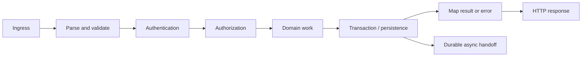
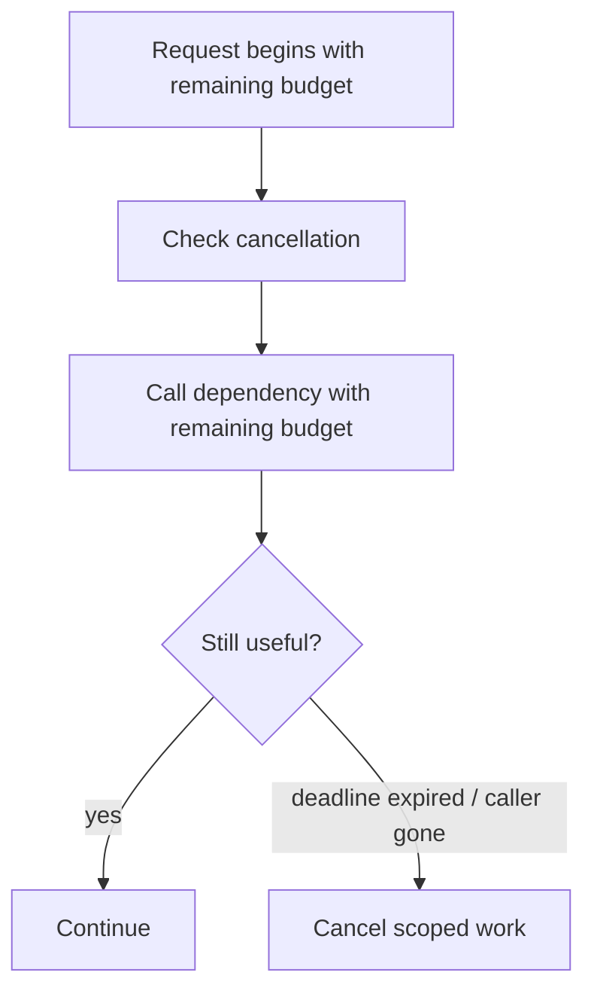
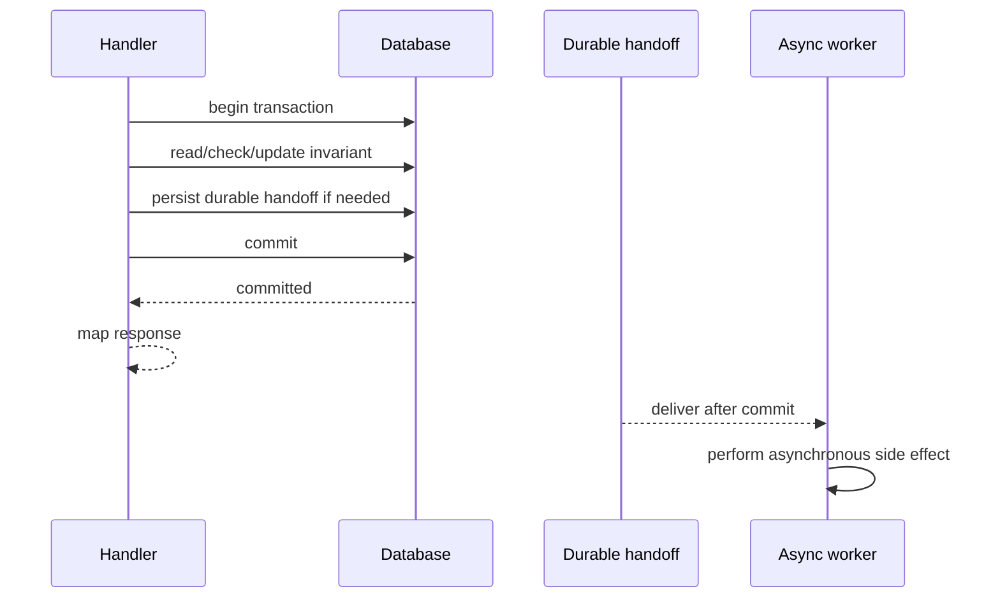

## The request is a bounded unit of work

A backend request is not just controller code. It is a bounded unit of work that crosses trust, correctness, and failure boundaries before a response leaves the service.



The framework hooks vary, but the operating questions do not: what input is trusted, which identity is established, what invariant changes, what must finish before the response, what can continue after commit, what should stop when the deadline expires, and what evidence can reconstruct the request later?

<TermBox term="Request context">
A **request context** is the small set of scoped information carried through one request: cancellation/deadline state, authenticated principal, request or correlation identifiers, trace context, and carefully selected metadata.

**Why it matters:** dependencies can share the same cancellation and observability boundary without using global state as an implicit transport.
</TermBox>

## 1. Ingress establishes transport facts, not business truth

At ingress, normalize only the facts needed to process safely: method, route, headers, body limits, proxy information according to the trust model, and inbound trace/request identifiers when valid.

Do not treat headers, route parameters, or JSON fields as trusted merely because a router parsed them. Parsing asks “can I represent this input?” Validation asks “is this structurally acceptable?” Authorization asks a different question: “may this principal perform this action on this resource?”

Set explicit body-size and parsing limits. Reject malformed input before expensive downstream work. Keep application assumptions visible even when a gateway also enforces limits so deployment changes cannot silently remove the protection.

## 2. Validate shape before domain work

Boundary validation should convert transport input into a form the domain layer can reason about. Typical checks include required fields, enum support, length/range limits, syntax, mutually exclusive options, and safe identifier normalization.

Keep **structural validation** separate from **business invariants**. “Quantity must be a positive integer” belongs near the boundary. “This account may not exceed its credit limit after the purchase” belongs with domain/persistence logic where concurrent state can be handled correctly.

## 3. Authentication and authorization are different gates

**Authentication** establishes who or what the caller is. **Authorization** decides whether that principal may perform the requested action on the target resource.

```text
parse credentials -> authenticate principal -> load relevant resource/context -> authorize action
```

Do not authorize only by a broad route role when the real rule is resource-specific. Conversely, avoid loading large domain graphs before rejecting unauthenticated callers when the resource is not needed for authentication.

Authentication failures and authorization denials should map to deliberate external semantics without leaking sensitive resource or identity details.

## 4. Give the request a deadline and propagate cancellation

A timeout in one dependency client is not a request-wide deadline. A request can spend time queueing, acquiring database connections, calling networks, retrying, serializing, and executing middleware before its final dependency call starts.

<TermBox term="Deadline and cancellation">
A **deadline** is the latest useful completion time for the request. **Cancellation** is the signal that scoped work should stop because the caller, server, or deadline no longer needs the result.

**Why it matters:** without propagation, downstream work can keep consuming scarce resources after its result is useless.
</TermBox>



Operational rules:

- derive dependency timeouts from remaining request budget instead of giving every layer a fresh full timeout;
- stop launching optional work when useful budget is nearly gone;
- propagate cancellation to database/network operations where supported;
- do not assume cancellation rolls back an external system that may already have committed;
- record deadline/cancellation distinctly from ordinary server failures.

Cancellation is resource control, not distributed rollback.

## 5. Keep domain work independent from HTTP mechanics

Translate validated input and principal context into an application/domain operation:

```text
HTTP request
  -> request DTO / command
  -> domain/application operation
  -> domain result or typed failure
  -> HTTP response mapping
```

Core rules should not need raw headers or status-code decisions. This keeps transport changes from rewriting invariants and allows the same operation to be invoked from a job, CLI, or another transport when appropriate.

Avoid a “service layer” that only renames controller methods without owning invariants or transaction boundaries; indirection alone is not a boundary.

## 6. Make the transaction boundary match the invariant

Open a database transaction only around state that must change atomically. Do not begin it at request ingress by default. Cheap validation and identity checks usually happen before the transaction; commit as soon as the required durable state is complete.



Do not hold a transaction open while waiting on slow remote calls unless the invariant truly requires it and the lock/capacity cost is understood. A database transaction cannot atomically roll back email, a payment provider, webhook delivery, or another independent service.

If a side effect must eventually happen only after durable state commits, persist a durable handoff in the same transaction when possible, then perform the effect asynchronously after commit.

## 7. Separate response semantics from internal failures

<TermBox term="Error mapping">
**Error mapping** converts known internal outcomes into stable transport semantics: HTTP status, headers, and a machine-readable response body.

**Why it matters:** callers should react to documented categories rather than framework exception names or stack traces.
</TermBox>

| Internal outcome | Typical HTTP direction | Notes |
| --- | --- | --- |
| malformed request | 400 | request cannot be parsed or validated |
| unauthenticated | 401 | authentication required or invalid |
| authenticated but forbidden | 403 | identity known, action denied |
| target absent | 404 | policy may intentionally avoid revealing existence |
| invariant conflict | 409 | useful for state/version conflicts |
| accepted async work | 202 | processing is not complete |
| unexpected dependency/server failure | 5xx | preserve internal evidence; return safe detail |

RFC 9110 defines HTTP status semantics. RFC 9457 defines a standard problem-details format for machine-readable API errors. Neither replaces domain-specific problem types and safe disclosure rules.

Do not convert every exception to `500` or every domain rejection to `400`. Preserve distinctions between caller-correctable input, authorization decisions, conflicts, accepted asynchronous work, and genuine server failures.

## 8. Decide what must finish before returning

There are three useful buckets:

1. **Must complete before response:** work required for the response to be truthful, such as committing the state the response claims exists.
2. **May continue asynchronously with durable ownership:** email, indexing, media processing, webhooks, or fan-out that must survive request-process death.
3. **Best-effort request-local work:** only effects whose loss is explicitly acceptable.

Avoid “fire and forget” promises created by launching an in-process task and returning `200`. The process can restart, scale down, or terminate after the response. If the effect matters, transfer ownership durably.

HTTP `202 Accepted` is intentionally noncommittal: processing was accepted, not completed. Provide a status resource or equivalent contract when callers need to observe asynchronous completion.

## 9. Carry evidence through the lifecycle

Useful correlation fields include:

```text
request_id
trace_id / traceparent-derived trace identity
authenticated principal or safe principal class
route / operation name
result category
latency
selected dependency timings
```

A generated `request_id` can help support correlation, but it is not automatically the same as a distributed trace ID. W3C Trace Context standardizes `traceparent` and `tracestate` propagation so tracing systems can connect spans across service boundaries.

Do not put secrets, bearer tokens, whole request bodies, or unnecessary personal data into logs merely because the data is request-scoped.

Operators should be able to distinguish validation/auth rejection, domain conflict, deadline/cancellation, dependency failure, transaction failure, synchronous success, and accepted asynchronous handoff.

## Production failure: success was returned before durable state existed

> **Scenario:** A handler validated an order, started a database write, launched an in-process background task to publish a confirmation event, and returned `200 OK` before awaiting database commit. Under load, the commit failed while the background task still published the event.

**Impact:** Customers received confirmation for orders that did not exist durably. Downstream consumers observed events for missing state while API logs recorded successful responses.

**Root cause:** The lifecycle had no explicit truthful-response boundary. Durable state, asynchronous side effects, and HTTP response mapping were allowed to race independently.

**Correct pattern:** Define the invariant first. Commit the state required for a truthful success response before returning success. If a side effect must follow the commit, persist its durable handoff inside the transaction when possible and process it asynchronously after commit. Map commit failures to an appropriate failure instead of success.

## Operate the lifecycle as a checklist

- [ ] **Ingress:** Are body/header limits and proxy trust assumptions explicit?
- [ ] **Validation:** Are structural checks separate from concurrency-sensitive business invariants?
- [ ] **Identity:** Is authentication complete before principal-dependent work?
- [ ] **Authorization:** Is access checked against the real resource/action rather than only a broad role?
- [ ] **Deadline:** Is there one request-wide budget rather than a fresh full timeout at each layer?
- [ ] **Cancellation:** Can downstream work stop when the result is no longer useful?
- [ ] **Domain boundary:** Can core rules run without raw HTTP objects or status-code decisions?
- [ ] **Transaction:** Does the transaction cover exactly the atomic invariant and end promptly?
- [ ] **After commit:** Are important side effects durably owned before they run asynchronously?
- [ ] **Error mapping:** Are known failures mapped to stable client-visible semantics?
- [ ] **Response truth:** Has everything needed to make the response truthful completed before success is returned?
- [ ] **Evidence:** Can `request_id`/trace correlation reconstruct rejection, dependency time, transaction outcome, and async handoff?

## Check your mental model

> A request has 900 ms remaining. It needs a database write and then a confirmation email. The commit can take 300–700 ms; the email provider can take 2 seconds. What belongs inside the request path?

<details>
<summary>Show the reasoning</summary>

The database work required to make the response truthful belongs inside the bounded request path, with the remaining deadline propagated to connection acquisition, queries, and commit.

The email should not extend the transaction or receive a fresh two-second timeout after the request budget is exhausted. If delivery matters, persist a durable email/job handoff with the committed state, commit, return the synchronous result, then let an asynchronous worker send it using its own retry/deadline policy.

If the database cannot commit within the remaining budget, return the appropriate failure/timeout outcome; do not return success and hope the commit finishes later.
</details>

## Agent rule

When changing a backend request path, do not reason only about the happy-path handler body. Identify the request-wide deadline/cancellation boundary, authentication and authorization gates, atomic transaction boundary, the point where a success response becomes truthful, ownership of work after commit, explicit error mapping, and correlation evidence that proves each boundary in production.

## Sources

- [RFC 9110 — HTTP Semantics](https://www.rfc-editor.org/rfc/rfc9110.html)
- [RFC 9457 — Problem Details for HTTP APIs](https://www.rfc-editor.org/rfc/rfc9457.html)
- [W3C — Trace Context](https://www.w3.org/TR/trace-context/)
