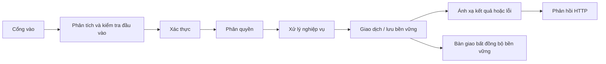
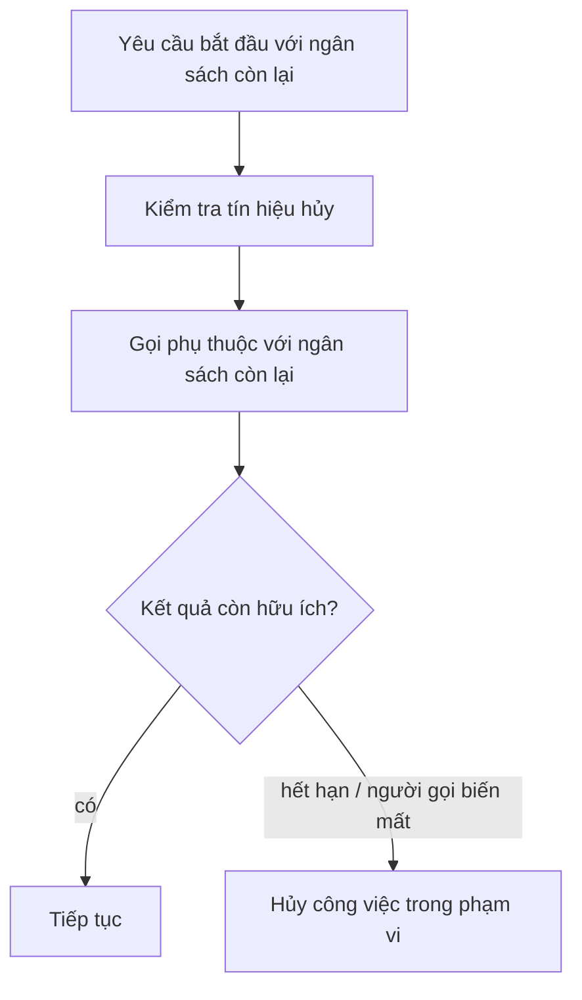
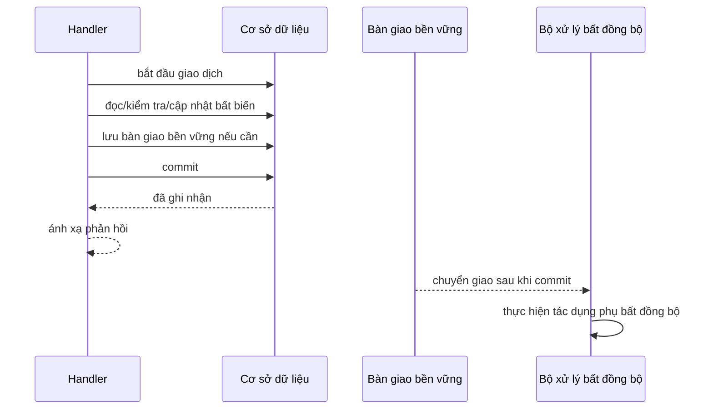

## Yêu cầu là một đơn vị công việc có giới hạn

Một yêu cầu phía máy chủ không chỉ là “mã trong bộ điều khiển”. Nó là một đơn vị công việc có giới hạn, đi qua nhiều ranh giới tin cậy, tính đúng và lỗi trước khi phản hồi rời khỏi dịch vụ.

Một mô hình vận hành hữu ích là:



Hook của từng framework có thể khác nhau, nhưng các câu hỏi cốt lõi không đổi:

- Đầu vào nào đã thực sự đáng tin?
- Danh tính nào đã được thiết lập?
- Bất biến nghiệp vụ nào đang thay đổi?
- Công việc nào phải xong trước phản hồi?
- Công việc nào có thể chạy an toàn sau khi ghi nhận bền vững?
- Điều gì phải dừng khi người gọi biến mất hoặc hạn chót hết?
- Bằng chứng nào giúp người vận hành dựng lại một yêu cầu sau này?

<TermBox term="Ngữ cảnh yêu cầu">
**Ngữ cảnh yêu cầu** là tập nhỏ thông tin chỉ sống trong một yêu cầu: trạng thái hủy/hạn chót, principal đã xác thực, định danh yêu cầu hoặc tương quan, ngữ cảnh dấu vết và một lượng siêu dữ liệu được chọn lọc.

**Vì sao quan trọng:** các phụ thuộc cần chia sẻ cùng ranh giới hủy và quan sát mà không biến trạng thái toàn cục thành kênh truyền ngầm.
</TermBox>

## 1. Cổng vào chỉ thiết lập sự thật về truyền tải, chưa phải sự thật nghiệp vụ

Ở cổng vào, chỉ chuẩn hóa các dữ kiện cần để xử lý an toàn: phương thức, tuyến, header, giới hạn body, thông tin proxy/địa chỉ theo mô hình tin cậy và định danh trace/yêu cầu đến nếu hợp lệ.

Không xem header, tham số tuyến hay trường JSON là đáng tin chỉ vì bộ định tuyến đã phân tích được chúng. Phân tích trả lời “có biểu diễn được đầu vào này không?”. Kiểm tra đầu vào trả lời “hình dạng này có chấp nhận được không?”. Phân quyền trả lời câu hỏi khác: “principal này có được thực hiện hành động đó trên tài nguyên này không?”.

Đặt giới hạn rõ cho kích thước body và quá trình phân tích. Từ chối đầu vào sai trước khi chạy công việc phía sau đắt tiền. Nếu reverse proxy hay API gateway đã có giới hạn, vẫn phải làm giả định/giới hạn ở mức ứng dụng trở nên nhìn thấy được để một thay đổi triển khai không âm thầm xóa lớp bảo vệ.

## 2. Kiểm tra hình dạng trước khi chạy nghiệp vụ

Kiểm tra đầu vào nên chuyển dữ liệu truyền tải thành dạng mà tầng nghiệp vụ có thể suy luận. Ví dụ:

- trường bắt buộc và giá trị enum được hỗ trợ;
- giới hạn độ dài/phạm vi;
- định dạng cú pháp;
- các lựa chọn loại trừ lẫn nhau;
- định danh tài nguyên có thể chuẩn hóa an toàn.

Tách **kiểm tra cấu trúc** khỏi **bất biến nghiệp vụ**. “Số lượng phải là số nguyên dương” thuộc ranh giới đầu vào. “Tài khoản không được vượt hạn mức tín dụng sau giao dịch này” thuộc logic nghiệp vụ/lưu trữ, nơi trạng thái đồng thời được xử lý đúng.

Sự tách biệt này tránh biến handler thành một đống điều kiện có giả định cạnh tranh khó nhìn thấy.

## 3. Xác thực và phân quyền là hai cổng khác nhau

**Xác thực** thiết lập người hoặc hệ thống đang gọi là ai. **Phân quyền** quyết định principal đó có được thực hiện hành động trên tài nguyên mục tiêu hay không.

Một vòng đời thường gặp:

```text
phân tích thông tin xác thực -> xác thực principal -> tải tài nguyên/ngữ cảnh cần thiết -> phân quyền hành động
```

Không chỉ phân quyền bằng vai trò ở mức tuyến khi quy tắc thật phụ thuộc tài nguyên. “Người dùng có vai trò biên tập” không đồng nghĩa “được sửa dự án này”. Ngược lại, đừng tải cả đồ thị nghiệp vụ lớn trước khi từ chối người gọi chưa xác thực nếu tài nguyên đó không cần cho bước xác thực.

Lỗi xác thực và từ chối phân quyền cần ánh xạ ra ngữ nghĩa bên ngoài có chủ đích mà không làm rò rỉ chi tiết nhạy cảm về người dùng hay tài nguyên.

## 4. Cho yêu cầu một hạn chót và lan truyền tín hiệu hủy

Một timeout ở một thư viện máy khách không đồng nghĩa với hạn chót toàn yêu cầu. Một yêu cầu có thể mất thời gian ở hàng chờ, lấy kết nối cơ sở dữ liệu, gọi mạng, thử lại, tuần tự hóa và middleware trước khi tới lời gọi phụ thuộc cuối.

<TermBox term="Hạn chót và hủy bỏ">
**Hạn chót** là thời điểm muộn nhất mà kết quả còn hữu ích. **Hủy bỏ** là tín hiệu cho công việc trong phạm vi dừng lại vì người gọi, máy chủ hoặc hạn chót không còn cần kết quả.

**Vì sao quan trọng:** nếu không lan truyền tín hiệu, công việc phía sau có thể tiếp tục chiếm tài nguyên dù phản hồi không còn giá trị.
</TermBox>



Quy tắc vận hành:

- suy ra timeout phụ thuộc từ ngân sách còn lại thay vì cấp cho mỗi tầng một timeout đầy đủ mới;
- không khởi chạy công việc tùy chọn khi ngân sách hữu ích còn quá ít;
- lan truyền hủy tới thao tác cơ sở dữ liệu/mạng khi runtime hỗ trợ;
- không giả định hủy sẽ hoàn tác một hệ thống bên ngoài có thể đã ghi nhận công việc;
- ghi nhận riêng kết quả hết hạn/hủy khỏi lỗi máy chủ thông thường.

Hủy bỏ là kiểm soát tài nguyên, không phải rollback phân tán.

## 5. Giữ xử lý nghiệp vụ độc lập với cơ chế HTTP

Handler nên chuyển đầu vào đã kiểm tra cùng ngữ cảnh principal thành một thao tác ứng dụng/nghiệp vụ. Logic nghiệp vụ không nên cần đọc header thô hoặc chọn mã trạng thái HTTP để thực thi bất biến.

Một ranh giới thực dụng:

```text
yêu cầu HTTP
  -> DTO / lệnh yêu cầu
  -> thao tác ứng dụng/nghiệp vụ
  -> kết quả nghiệp vụ hoặc lỗi có kiểu
  -> ánh xạ phản hồi HTTP
```

Nhờ đó thay đổi giao thức không buộc viết lại quy tắc lõi, và cùng thao tác có thể được gọi từ công việc nền, CLI hoặc transport khác khi phù hợp.

Tránh cực đoan ngược lại: một “tầng dịch vụ” chỉ đổi tên phương thức controller mà không sở hữu bất biến hay ranh giới giao dịch chỉ thêm tầng trung gian chứ không thêm rõ ràng.

## 6. Đặt ranh giới giao dịch theo bất biến

Chỉ mở giao dịch cơ sở dữ liệu quanh phần trạng thái phải thay đổi nguyên tử. Không mặc định mở giao dịch từ lúc yêu cầu vừa vào.

Một ranh giới giao dịch tốt thường bắt đầu sau các bước kiểm tra đầu vào/xác thực rẻ tiền và kết thúc ngay khi trạng thái bắt buộc đã được commit bền vững.



Không giữ giao dịch mở trong khi chờ lời gọi HTTP từ xa chậm trừ khi bất biến thực sự cần sự phối hợp đó và bạn hiểu chi phí khóa/năng lực. Giao dịch cơ sở dữ liệu không thể hoàn tác nguyên tử email, nhà cung cấp thanh toán, webhook hay một dịch vụ độc lập khác.

Nếu tác dụng phụ phải chắc chắn diễn ra chỉ sau khi trạng thái bền vững được ghi nhận, hãy lưu một bàn giao bền vững trong cùng giao dịch khi có thể (ví dụ bản ghi outbox/công việc), rồi chạy tác dụng phụ bất đồng bộ sau khi commit.

## 7. Tách ngữ nghĩa phản hồi khỏi lỗi nội bộ

Exception nội bộ là chi tiết triển khai. Phản hồi bên ngoài là một phần hợp đồng API.

<TermBox term="Ánh xạ lỗi">
**Ánh xạ lỗi** chuyển các kết quả nội bộ đã biết thành ngữ nghĩa truyền tải ổn định: mã HTTP, header và body máy đọc được.

**Vì sao quan trọng:** bên gọi nên phản ứng theo nhóm lỗi đã tài liệu hóa thay vì phân tích stack trace hay tên exception của framework.
</TermBox>

Ví dụ:

| Kết quả nội bộ | Hướng HTTP thường dùng | Ghi chú |
| --- | --- | --- |
| yêu cầu sai hình dạng | 400 | không phân tích/kiểm tra được |
| chưa xác thực | 401 | cần hoặc sai thông tin xác thực |
| đã xác thực nhưng bị cấm | 403 | principal đã biết nhưng hành động bị từ chối |
| không có tài nguyên | 404 | cân nhắc không làm lộ sự tồn tại theo chính sách |
| xung đột bất biến | 409 | hữu ích cho xung đột trạng thái/phiên bản |
| đã nhận công việc bất đồng bộ | 202 | xử lý chưa hoàn tất |
| lỗi phụ thuộc/máy chủ bất ngờ | 5xx | ghi bằng chứng nội bộ, trả chi tiết an toàn |

RFC 9110 định nghĩa ngữ nghĩa mã trạng thái HTTP; RFC 9457 định nghĩa định dạng problem details chuẩn cho lỗi API máy đọc được. Hai đặc tả này không thay thế việc thiết kế loại lỗi nghiệp vụ và mức chi tiết an toàn của riêng API.

Không biến mọi exception thành `500`. Không biến mọi từ chối nghiệp vụ thành `400`. Giữ khác biệt giữa đầu vào người gọi có thể sửa, quyết định phân quyền, xung đột trạng thái, công việc bất đồng bộ đã được chấp nhận và lỗi máy chủ thật sự.

## 8. Quyết định việc gì phải xong trước khi trả phản hồi

Có ba nhóm hữu ích:

1. **Phải hoàn tất trước phản hồi:** công việc cần để phản hồi nói đúng sự thật, ví dụ commit trạng thái mà phản hồi tuyên bố đã tồn tại.
2. **Có thể tiếp tục bất đồng bộ với quyền sở hữu bền vững:** email, lập chỉ mục, xử lý tệp, webhook hoặc fan-out có thể sống sót nếu tiến trình xử lý yêu cầu chết.
3. **Công việc cục bộ best-effort:** chỉ cho tác dụng phụ mà việc mất là chấp nhận được một cách rõ ràng, thường là telemetry đã được hạ tầng đệm.

Tránh hứa “fire and forget” bằng cách khởi chạy một tác vụ trong tiến trình rồi trả `200`. Tiến trình có thể khởi động lại, co giãn xuống hoặc bị dừng ngay sau phản hồi. Nếu tác dụng phụ quan trọng, phải bàn giao quyền sở hữu một cách bền vững.

HTTP `202 Accepted` cố ý không cam kết hoàn tất: nó chỉ nói yêu cầu đã được chấp nhận để xử lý. Nếu máy khách cần theo dõi hoàn tất bất đồng bộ, hãy cung cấp tài nguyên trạng thái hoặc hợp đồng tương đương.

## 9. Mang bằng chứng xuyên suốt vòng đời

Một yêu cầu phía máy chủ cần đủ bằng chứng để trả lời cả “điều gì đã xảy ra?” và “thời gian đi đâu?”.

Các trường tương quan hữu ích:

```text
request_id
trace_id / định danh trace dẫn xuất từ traceparent
principal đã xác thực hoặc nhóm principal an toàn để ghi log
tên tuyến / thao tác
nhóm kết quả
độ trễ
thời gian phụ thuộc được chọn lọc
```

Có thể sinh `request_id` phục vụ hỗ trợ và tương quan, nhưng đừng nhầm nó với trace ID phân tán. W3C Trace Context chuẩn hóa việc lan truyền `traceparent`/`tracestate` để hệ thống tracing nối các span yêu cầu qua ranh giới dịch vụ.

Không đưa secret, bearer token, toàn bộ body yêu cầu hay dữ liệu cá nhân không cần thiết vào log chỉ vì chúng “thuộc request”.

Tối thiểu, người vận hành cần phân biệt được:

- từ chối do kiểm tra đầu vào/xác thực;
- xung đột nghiệp vụ;
- hết hạn/hủy;
- lỗi phụ thuộc;
- lỗi giao dịch;
- hoàn tất đồng bộ thành công;
- bàn giao bất đồng bộ đã được chấp nhận.

## Sự cố thực tế: phản hồi báo thành công trước khi trạng thái bền vững tồn tại

> **Tình huống:** Một handler kiểm tra đơn hàng, bắt đầu ghi cơ sở dữ liệu, khởi chạy tác vụ nền trong tiến trình để phát sự kiện xác nhận, rồi trả `200 OK` trước khi chờ commit cơ sở dữ liệu. Khi tải cao, commit thất bại nhưng tác vụ nền vẫn phát sự kiện.

**Hậu quả:** Khách hàng nhận xác nhận cho đơn hàng chưa tồn tại bền vững. Hệ thống phía sau thấy sự kiện cho trạng thái không có thật, trong khi log API lại cho thấy phản hồi thành công.

**Nguyên nhân cốt lõi:** Vòng đời không có ranh giới rõ để phản hồi thành công trở thành sự thật. Trạng thái bền vững, tác dụng phụ bất đồng bộ và ánh xạ phản hồi HTTP được phép chạy đua độc lập.

**Cách khắc phục chuẩn:** Xác định bất biến trước. Commit trạng thái cần thiết để phản hồi thành công là đúng trước khi trả thành công. Nếu tác dụng phụ phải theo sau commit, lưu bàn giao bền vững của nó trong giao dịch khi có thể và xử lý bất đồng bộ sau khi commit. Ánh xạ lỗi commit thành lỗi máy chủ/phụ thuộc thay vì trả thành công.

## Danh sách kiểm tra vận hành vòng đời

- [ ] **Cổng vào:** Giới hạn body/header và giả định tin cậy proxy có rõ ràng không?
- [ ] **Kiểm tra đầu vào:** Kiểm tra cấu trúc có tách khỏi bất biến nghiệp vụ nhạy cảm với cạnh tranh không?
- [ ] **Danh tính:** Xác thực có hoàn tất trước công việc phụ thuộc principal không?
- [ ] **Phân quyền:** Quyền có được kiểm tra trên đúng tài nguyên/hành động thay vì chỉ vai trò rộng không?
- [ ] **Hạn chót:** Có ngân sách toàn yêu cầu thay vì timeout đầy đủ mới ở mỗi tầng không?
- [ ] **Hủy:** Công việc phía sau có dừng được khi kết quả không còn hữu ích không?
- [ ] **Ranh giới nghiệp vụ:** Quy tắc lõi có chạy được mà không cần đối tượng HTTP thô hay quyết định mã trạng thái không?
- [ ] **Giao dịch:** Giao dịch cơ sở dữ liệu có bao đúng bất biến nguyên tử và kết thúc sớm không?
- [ ] **Sau khi commit:** Tác dụng phụ bên ngoài quan trọng có quyền sở hữu bền vững trước khi chạy bất đồng bộ không?
- [ ] **Ánh xạ lỗi:** Lỗi đã biết có được ánh xạ thành ngữ nghĩa ổn định cho máy khách không?
- [ ] **Tính đúng của phản hồi:** Mọi thứ cần thiết để phản hồi là đúng đã hoàn tất trước khi trả thành công chưa?
- [ ] **Bằng chứng:** `request_id`/trace có giúp dựng lại từ chối, thời gian phụ thuộc, kết quả giao dịch và bàn giao bất đồng bộ không?

## Kiểm tra mô hình tư duy

> Một yêu cầu còn 900 ms. Nó cần ghi cơ sở dữ liệu rồi gửi email xác nhận. Commit có thể mất 300–700 ms, còn nhà cung cấp email có thể mất 2 giây. Phần nào thuộc đường xử lý yêu cầu?

<details>
<summary>Xem giải thích</summary>

Công việc cơ sở dữ liệu cần để phản hồi nói đúng sự thật thuộc đường xử lý yêu cầu có giới hạn, với ngân sách còn lại được lan truyền tới lấy kết nối/truy vấn/commit.

Email không nên kéo dài giao dịch cơ sở dữ liệu hay nhận một timeout hai giây hoàn toàn mới sau khi ngân sách yêu cầu đã hết. Nếu email phải được gửi, hãy lưu bàn giao công việc/email bền vững cùng trạng thái commit khi phù hợp, commit, trả kết quả đồng bộ, rồi để bộ xử lý bất đồng bộ gửi email với chính sách thử lại/hạn chót riêng.

Nếu cơ sở dữ liệu không thể commit trong ngân sách còn lại, trả kết quả lỗi/hết hạn phù hợp; không trả thành công rồi hy vọng commit sẽ xong sau đó.
</details>

## Quy tắc cho agent

Khi thay đổi một đường xử lý yêu cầu phía máy chủ, đừng chỉ suy luận về thân handler ở happy path. Hãy xác định ranh giới hạn chót/hủy toàn yêu cầu, các cổng xác thực và phân quyền, ranh giới giao dịch nguyên tử, thời điểm phản hồi thành công trở thành đúng sự thật, quyền sở hữu công việc sau commit, ánh xạ lỗi rõ ràng và bằng chứng tương quan chứng minh từng ranh giới trong production.

## Nguồn tham khảo

- [RFC 9110 — HTTP Semantics](https://www.rfc-editor.org/rfc/rfc9110.html)
- [RFC 9457 — Problem Details for HTTP APIs](https://www.rfc-editor.org/rfc/rfc9457.html)
- [W3C — Trace Context](https://www.w3.org/TR/trace-context/)
