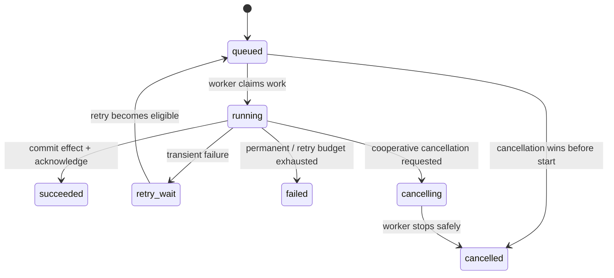
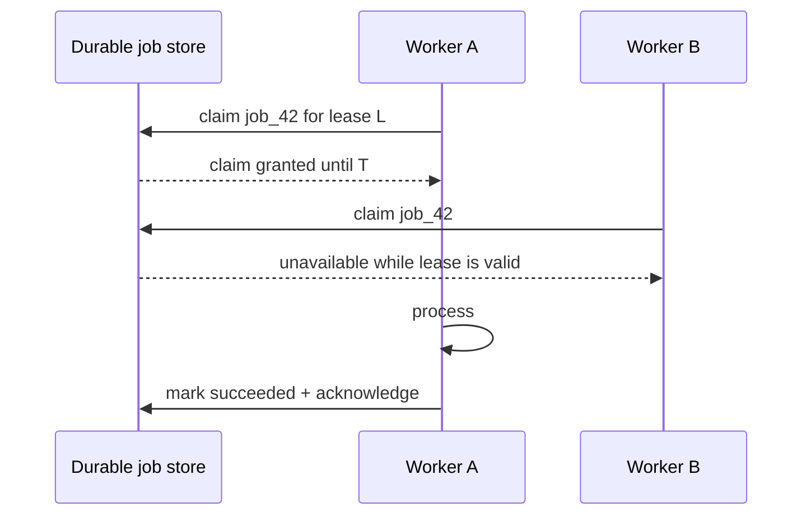

# Background Jobs: Make Work Durable Beyond the Request

## TL;DR

A background job moves work out of the request path, but that does not make the work reliable by itself. Reliability comes from a **durable lifecycle** and a worker protocol that answers four questions:

1. What durable record says the work exists?
2. Which worker currently has the right to process it, and for how long?
3. When is the work acknowledged as complete?
4. What happens after a timeout, worker crash, transient failure, permanent failure, retry, cancellation, or duplicate delivery?

A useful mental model is:



Do not model a job as “call this function later.” Model it as **durable state plus a repeatable processing protocol**.

<TermBox term="Background job">
A **background job** is durable work that can outlive the request or process that created it and is executed asynchronously by one or more workers.

**Why it matters:** expensive, slow, bursty, or failure-prone work should not force an HTTP request to remain open, but moving work to workers introduces delivery, ownership, retry, and observability responsibilities.
</TermBox>

## 1. Persist intent before returning success

Consider an API that starts an invoice export:

```text
POST /exports
  start async task in process memory
  return 202 Accepted
```

If the process crashes after returning `202` but before the task reaches durable storage, the user has an accepted request with no work left to execute.

A stronger shape is:

```text
request
  -> validate + authorize
  -> create durable job/business record
  -> commit
  -> make work available to workers
  -> return stable job identity
```

The exact transport can be a database-backed job table, a managed task service, or a message broker. The invariant is the same: **once the system tells the caller that work was accepted, durable state must exist from which the work can be recovered or reconciled**.

For workflows that must update business state and publish work atomically, a transactional outbox or equivalent pattern may be needed. This lesson does not replace that deeper cross-system delivery topic; it establishes why volatile “fire-and-forget” work is not enough.

<TermBox term="Durable job state">
**Durable job state** is persisted information that survives process restarts and records enough of a job's identity, lifecycle, and execution policy to resume or reconcile the work.

**Why it matters:** workers are disposable. The job's existence and correctness cannot live only in one worker's memory.
</TermBox>

## 2. Give every logical job a stable identity

A useful job record usually separates **logical identity** from **execution attempt**:

```text
job_id: job_01K...
job_type: generate_invoice_pdf
subject_id: invoice_1842
state: queued
attempt_count: 0
max_attempts: 5
next_attempt_at: now
created_at: ...
```

The logical job is “generate the PDF for invoice 1842.” An attempt is one worker's try at that job.

This distinction matters because one logical job may have several attempts after timeouts or worker crashes. If every attempt creates a brand-new business effect, retries become duplication.

Useful durable fields depend on the system, but often include:

- stable job identifier;
- job type and schema/version;
- subject or idempotency identity;
- lifecycle state;
- attempt count and retry budget;
- next eligible time;
- claim/lease owner and expiry when the mechanism exposes them;
- cancellation request;
- bounded progress metadata;
- terminal result or failure category;
- timestamps for queue age and execution duration.

Avoid putting arbitrary large payloads or secrets in a job record just because it is convenient. Prefer stable references to durable source data, and authorize the worker to fetch only what it needs.

## 3. Claiming work is an ownership protocol

Multiple workers can poll the same backlog. They need a rule for who may act on one job at a time.

A generic claim/lease model looks like:



Different systems expose this differently. A database-backed worker may atomically transition `queued -> running` or use row locking. A queue may hide a delivered message for a visibility timeout. A task framework may reserve a task and acknowledge it before or after execution.

The portable questions are:

- Is claiming atomic?
- Is ownership permanent or lease-based?
- Can a long-running worker renew ownership?
- What happens if the lease expires while the original worker is still running?
- What durable check prevents two stale/current owners from committing conflicting effects?

A lease reduces simultaneous work; it does not automatically make the business effect exactly once.

<TermBox term="Lease">
A **lease** is time-bounded ownership. A worker may act as the current owner until the lease expires or is released, after which another worker may claim the work.

**Why it matters:** a crashed worker cannot release an ordinary in-memory lock. Expiring ownership lets the system recover, but also creates a stale-owner problem if the old worker resumes late.
</TermBox>

## 4. Acknowledge only at the boundary your reliability model intends

**Acknowledgement** tells the job transport that a delivery no longer needs to be offered for processing.

The timing changes failure behavior:

```text
ack before work
  -> fewer duplicate executions after worker loss
  -> greater risk of losing unfinished work

ack after work
  -> unfinished work can be redelivered after worker loss
  -> duplicate execution becomes possible
```

Celery's current task documentation makes this trade-off explicit: task messages are acknowledged according to task configuration, and late acknowledgement can cause a task to execute more than once if a worker fails. Amazon SQS similarly keeps a received message in the queue but temporarily invisible; if it is not deleted before the visibility timeout expires, it can become visible and be received again.

Those are concrete implementations of a general rule: **reliable recovery usually implies that a job may be delivered or executed more than once**.

Do not infer exactly-once business effects from “the queue has deduplication” or “the worker hides the message.” Delivery behavior and effect semantics are different layers.

## 5. Design for at-least-once/redelivery at the effect boundary

Suppose a worker performs:

```text
1. charge customer
2. mark job succeeded
3. acknowledge delivery
```

If it crashes after step 1 but before steps 2–3, the job may be redelivered. Re-running the charge blindly can bill twice.

The safe question is not “how do we prevent the worker from ever running twice?” It is:

> If this logical job runs again after an ambiguous failure, how does it reach the same correct durable outcome without repeating an irreversible effect?

Patterns include:

- send a stable idempotency key to a remote API that supports it;
- use a unique constraint or conditional transition so one logical effect can commit once;
- record an operation identity before publishing downstream work;
- make output paths deterministic/versioned and publish one durable pointer;
- reconcile ambiguous outcomes by querying the source of truth before repeating the effect.

<TermBox term="Idempotent job effect">
An **idempotent job effect** reaches the same intended durable outcome when the same logical job is safely retried or redelivered.

**Why it matters:** at-least-once delivery moves duplicate handling into the worker and its downstream effects. A retry-safe function body is more important than a retry button.
</TermBox>

## 6. Retry transient failure; classify permanent failure

Retries are for failures that may succeed later, such as:

- a temporary network error;
- a dependency returning overload/temporary-unavailable signals;
- a short-lived database conflict;
- a lease lost before an effect committed;
- a provider rate limit with a meaningful retry window.

Retries are usually wrong for deterministic failures such as:

- malformed input that will not change;
- a permanently missing required resource;
- unsupported file format;
- failed authorization that should not become valid by waiting;
- a business rule rejection;
- code that crashes identically on every attempt.

A bounded retry policy needs explicit limits:

```text
attempt 1 -> fail transiently
wait with backoff + jitter
attempt 2 -> fail transiently
wait longer
attempt 3 -> succeed
```

Google Cloud Tasks exposes controls such as maximum attempts, retry duration, and backoff intervals. The exact knobs vary by system, but the principle is portable: **retry budgets must terminate**.

Unbounded immediate retries create a hot loop that can amplify an outage and starve healthy work.

## 7. Poison jobs need a terminal path

A **poison job** is work that repeatedly fails in a way ordinary retries cannot repair. Leaving it in the normal retry cycle forever creates backlog churn, noisy alerts, and wasted capacity.

After the retry budget is exhausted, transition to a durable terminal state or dead-letter path with enough context to diagnose and safely replay the work later.

Useful failure metadata may include:

```text
failure_class: unsupported_payload_version
last_error_code: PAYLOAD_SCHEMA_OLD
attempt_count: 5
first_failed_at: ...
last_failed_at: ...
subject_id: invoice_1842
```

Avoid storing unbounded stack traces, credentials, or sensitive payloads. Keep operational evidence useful but appropriately scoped.

A dead-letter queue is one implementation. A `failed` table/state plus an operator replay command may be simpler. The architectural requirement is **visible terminal ownership**, not a specific broker feature.

<TermBox term="Poison job">
A **poison job** repeatedly fails because the work itself or its deterministic environment is not recoverable through ordinary retry.

**Why it matters:** retries that never converge consume worker capacity and can hide a product or data-quality defect behind infrastructure noise.
</TermBox>

## 8. Cancellation is a state transition, not process killing

Cancellation can arrive while a job is queued or running.

For queued work, the system may transition directly to `cancelled` if execution has not begun. Running work is harder: the worker may already have produced partial effects.

Prefer **cooperative cancellation**:

```text
worker starts attempt
  -> periodically checks durable cancellation signal at safe boundaries
  -> stops before next irreversible effect
  -> cleans up temporary resources
  -> records cancelled terminal state
```

Hard-killing a worker process is an operational last resort, not a general cancellation protocol. Current Celery worker documentation explicitly warns that terminating a task can terminate the process executing it and should not be used programmatically as normal task cancellation.

Define cancellation semantics per job type:

- Is cancellation best effort or guaranteed before a named commit point?
- Which effects can already have happened?
- Is compensation required?
- Can the caller distinguish `cancel_requested`, `cancelled`, and `already_succeeded`?

## 9. Progress is durable evidence, not a chatty counter

Long jobs often need progress reporting, but `47%` is meaningful only when the job has a measurable denominator.

Prefer progress tied to durable milestones:

```text
state: running
phase: rendering_pages
completed_units: 47
total_units: 120
updated_at: ...
```

Update progress at a bounded frequency. Writing one database row per processed byte or item can make progress reporting more expensive than the work itself.

If exact percentage is impossible, expose phases such as `queued`, `fetching`, `processing`, `publishing`, `succeeded` rather than inventing precision.

The client-facing API should read durable job state. It should not need a direct connection to whichever worker happens to own the current attempt.

## 10. Worker crashes are normal design inputs

Ask what happens if a worker crash occurs at every boundary:

```text
before claim
immediately after claim
mid-computation
just after a remote effect
just after local commit
just before acknowledgement
```

For each boundary, the result should be one of:

- safe redelivery/retry;
- durable success already visible;
- reconciliation of an ambiguous external effect;
- terminal failure requiring operator action.

If the answer is “the worker remembers what happened in RAM,” the recovery model is incomplete.

A robust worker should also have explicit execution limits. Network calls need timeouts; long jobs may need heartbeats or lease renewal; memory/CPU-heavy work may need resource limits. A wedged worker that holds ownership forever is a reliability failure even when it has not crashed.

## 11. Backlog is part of user-visible latency

Moving work off the request path changes the latency model:

```text
job completion latency
  = queue wait
  + execution time
  + retry/backoff delay
  + downstream wait
```

That makes **queue age** or oldest-job age especially valuable. A queue with 10,000 tiny jobs may be healthy; 100 jobs that have waited six hours may not be.

Track signals such as:

- enqueue rate and completion rate;
- backlog depth;
- queue age / oldest eligible job age;
- claim-to-start delay;
- execution duration by job type;
- success, retry, and terminal-failure rates;
- attempts per completed job;
- lease expiry/redelivery rate;
- cancellation latency;
- worker utilization and saturation.

Scale workers from downstream capacity, not just backlog panic. Adding workers can overload the database or remote dependency the jobs call.

## 12. Separate job semantics from queue topology

A background-job system needs a way to persist and deliver work, but that does not mean every lesson about messaging belongs here.

This lesson owns these questions:

- What does one logical job mean?
- What is its durable lifecycle?
- How is an attempt claimed and completed?
- How are duplicates, retries, cancellation, progress, and poison work handled?

The **Message Queues** lesson owns broader transport questions such as competing consumers, partitioning, ordering, broker retention, fan-out, and queue-specific capacity behavior.

Keeping the boundary clear prevents a common design mistake: choosing a broker first and only later discovering that nobody defined the job's durable correctness semantics.

## Production scenario: thumbnail worker sends duplicate notifications

A media service creates one durable `GENERATE_THUMBNAILS` job per upload. The worker does this:

```text
1. render thumbnails
2. send "media ready" email
3. mark job succeeded
4. acknowledge delivery
```

During a deployment, a worker crash happens after step 2 but before steps 3–4. The delivery becomes eligible again and another worker reruns the job. Thumbnails are overwritten harmlessly, but the user receives a second email. The same failure repeats for several jobs, and support sees duplicate notifications without obvious failed jobs.

**Impact:** users receive duplicate notifications, downstream email spend increases, and operators cannot distinguish retry recovery from fresh work.

**Root cause:** the job transport was designed for redelivery, but the email side effect had no stable idempotency identity. The system treated “one delivery” as equivalent to “one business effect,” and acknowledgement happened after an irreversible effect without a duplicate-safe boundary.

**Correct pattern:** give the logical notification a durable identity such as `(job_id, notification_type)` and make send/publish conditional on that identity, or use a downstream provider idempotency mechanism when available. Keep rendering outputs deterministic or versioned, record success durably before acknowledging according to the chosen delivery model, and reconcile ambiguous external outcomes instead of blindly repeating them. Monitor redelivery and attempts per completed job so worker-loss behavior is visible.

The deeper rule is: **a background job is reliable only when retrying the whole protocol is safe at every crash boundary that the delivery system can expose**.

## Common mistakes

### “We returned `202`, so the job exists”

An HTTP response is not durable work. Persist the accepted intent before claiming success to the caller, or use a workflow that can reconcile a publish gap.

### “The queue prevents duplicates”

Some transports offer deduplication features, but worker loss, visibility expiry, acknowledgement timing, producer retries, or downstream ambiguity can still create repeated execution/effects. Design logical effects to tolerate redelivery.

### “Retry every exception”

Classify failure. Permanent errors should terminate visibly instead of consuming the retry budget forever.

### “More workers always drain backlog faster”

Workers consume downstream resources. Scale within database, API, CPU, memory, and connection budgets.

### “Cancellation means kill the worker”

Process termination can leave partial effects and may affect unrelated work depending on the runtime. Prefer cooperative cancellation at explicit safe boundaries.

### “Progress belongs in worker memory”

Workers restart and ownership moves. Persist bounded progress if users or operators need it.

## Self-check

A job charges a partner API and then updates its local state to `succeeded`. The partner call times out, so the worker cannot tell whether the charge happened. The job is configured for three automatic retries.

Should the worker immediately retry the charge?

<details>
<summary>Show the reasoning</summary>

Not until the ambiguous external effect is resolved. A timeout says the worker did not receive a response; it does not prove the partner did nothing.

Use a stable operation/idempotency key if the partner supports one, or query/reconcile the partner's source of truth using the logical operation identity before issuing another irreversible charge. Automatic retry is safe only when the effect boundary is idempotent or the ambiguous outcome can be reconciled.

</details>

## Background-job review checklist

- [ ] **Durability:** Does accepted work have durable state before the request reports success?
- [ ] **Identity:** Is there one stable logical job identity separate from execution attempts?
- [ ] **Lifecycle:** Are queued, running/retrying, succeeded, failed, and cancelled states explicit enough for recovery?
- [ ] **Claim:** Is worker ownership acquired atomically, and is lease/visibility expiry behavior understood?
- [ ] **Acknowledgement:** Is the ack boundary chosen deliberately relative to the durable effect?
- [ ] **Redelivery:** Can the same logical job execute again after worker loss without corrupting business state?
- [ ] **Idempotency:** Do irreversible or remote effects have stable duplicate protection or reconciliation?
- [ ] **Retry:** Are transient and permanent failures classified, with bounded attempts and backoff?
- [ ] **Poison work:** Does exhausted work reach a visible terminal/dead-letter path rather than loop forever?
- [ ] **Cancellation:** Are safe cancellation boundaries and already-committed effects defined?
- [ ] **Progress:** Is progress durable, meaningful, and updated at a bounded rate?
- [ ] **Crash recovery:** Is every worker crash boundary recoverable without relying on process memory?
- [ ] **Operations:** Can we observe queue age, backlog, attempt counts, redelivery, failures, duration, and worker saturation?
- [ ] **Capacity:** Is worker concurrency bounded by downstream capacity rather than only queue depth?

## Agent rule

When reviewing background-job code, do not approve “enqueue and retry” as a reliability design. Trace one logical job from durable creation through claim, effect, acknowledgement, worker crash, redelivery, retry exhaustion, cancellation, and terminal state. Verify that every irreversible effect has an idempotency or reconciliation story and that operational evidence can distinguish waiting, running, retrying, failed, and stuck work.

## Related concepts

- **Backend Concurrency** — worker pools introduce overlapping execution and ownership races.
- **Message Queues** — transports work to competing consumers and define delivery/ordering behavior.
- **Idempotency** — makes repeated attempts converge on one logical effect.
- **Retries & Backoff** — controls when transient failure should be tried again without amplifying outages.
- **Delivery Semantics** — separates message delivery guarantees from business-effect guarantees.
- **Logs, Metrics & Traces** — provides evidence for queue age, attempts, latency, failures, and saturation.

Continue through the [Backend Systems](/docs/learning-paths/backend-systems) path toward caching, message queues, rate limiting, idempotency, and service resilience.

## Sources

Primary references verified on **2026-09-10**:

- [Celery documentation — Tasks](https://docs.celeryq.dev/en/stable/userguide/tasks.html)
- [Celery documentation — Workers Guide](https://docs.celeryq.dev/en/main/userguide/workers.html)
- [Amazon SQS documentation — Visibility timeout](https://docs.aws.amazon.com/AWSSimpleQueueService/latest/SQSDeveloperGuide/sqs-visibility-timeout.html)
- [Google Cloud Tasks documentation — Configure retries](https://docs.cloud.google.com/tasks/docs/configure-retry-task)

This lesson is **evolving** with a 180-day review target because worker runtimes, task frameworks, and managed queue behavior change, even though the durable lifecycle and crash-boundary reasoning model is stable.
