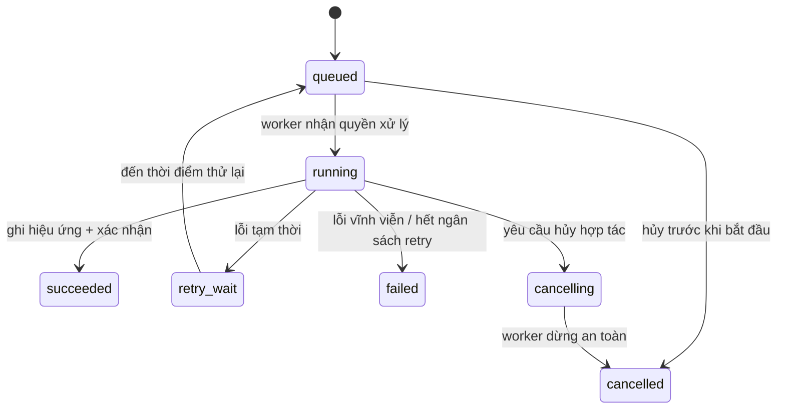
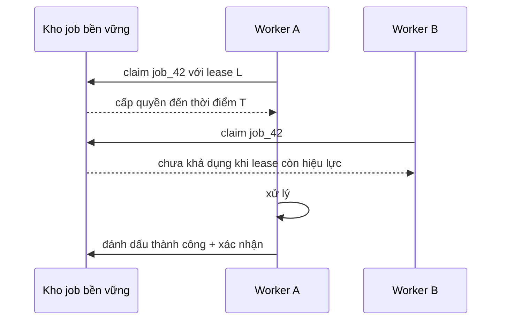

# Công việc nền: Làm cho công việc bền vững sau vòng đời yêu cầu

## Tóm tắt

Đưa việc xử lý thành **công việc nền** giúp tách nó khỏi đường đi của yêu cầu, nhưng bản thân việc “chạy ở worker” chưa tạo ra độ tin cậy. Độ tin cậy đến từ **vòng đời bền vững** và một giao thức worker trả lời được bốn câu hỏi:

1. Bản ghi bền vững nào chứng minh công việc tồn tại?
2. Worker nào hiện có quyền xử lý, và quyền đó kéo dài bao lâu?
3. Khi nào delivery được xác nhận là đã hoàn tất?
4. Điều gì xảy ra khi timeout, worker crash, lỗi tạm thời, lỗi vĩnh viễn, retry, hủy hoặc giao lặp?

Một máy trạng thái hữu ích là:



Đừng mô hình một job chỉ là “gọi hàm này sau”. Hãy mô hình nó thành **trạng thái bền vững cộng với giao thức xử lý có thể lặp lại an toàn**.

<TermBox term="Công việc nền">
**Công việc nền** là công việc bền vững có thể sống lâu hơn yêu cầu hoặc tiến trình đã tạo ra nó và được thực thi bất đồng bộ bởi một hay nhiều worker.

**Vì sao quan trọng:** công việc chậm, tốn tài nguyên, có tính burst hoặc dễ gặp lỗi không nên buộc HTTP request phải mở lâu, nhưng tách sang worker tạo thêm trách nhiệm về delivery, quyền sở hữu, retry và khả năng quan sát.
</TermBox>

## 1. Ghi nhận ý định bền vững trước khi báo đã nhận việc

Xét API tạo bản xuất hóa đơn:

```text
POST /exports
  khởi chạy tác vụ async trong bộ nhớ tiến trình
  trả 202 Accepted
```

Nếu tiến trình chết sau khi trả `202` nhưng trước khi tác vụ được lưu bền vững, người dùng đã nhận thông báo chấp nhận trong khi không còn công việc nào để thực thi.

Một cấu trúc mạnh hơn là:

```text
yêu cầu
  -> kiểm tra dữ liệu + phân quyền
  -> tạo bản ghi job/nghiệp vụ bền vững
  -> commit
  -> làm cho công việc khả dụng với worker
  -> trả định danh job ổn định
```

Transport cụ thể có thể là bảng job trong cơ sở dữ liệu, dịch vụ task được quản lý hoặc message broker. Bất biến vẫn giống nhau: **sau khi hệ thống nói công việc đã được chấp nhận, phải có trạng thái bền vững để khôi phục hoặc đối soát công việc đó**.

Nếu workflow phải vừa cập nhật trạng thái nghiệp vụ vừa phát công việc sang hệ thống khác một cách nhất quán, transactional outbox hoặc mô hình tương đương có thể cần thiết. Bài này không thay thế chủ đề delivery xuyên hệ thống; nó chỉ làm rõ vì sao “fire-and-forget” trong bộ nhớ là không đủ.

<TermBox term="Trạng thái job bền vững">
**Trạng thái job bền vững** là thông tin đã được lưu và sống qua việc restart tiến trình, chứa đủ định danh, vòng đời và chính sách thực thi để hệ thống tiếp tục hoặc đối soát công việc.

**Vì sao quan trọng:** worker là tài nguyên có thể thay thế. Sự tồn tại và correctness của job không được sống chỉ trong RAM của một worker.
</TermBox>

## 2. Tách định danh job logic khỏi từng lần thực thi

Một bản ghi job thường nên phân biệt **định danh logic** với **attempt**:

```text
job_id: job_01K...
job_type: generate_invoice_pdf
subject_id: invoice_1842
state: queued
attempt_count: 0
max_attempts: 5
next_attempt_at: now
created_at: ...
```

Job logic là “tạo PDF cho hóa đơn 1842”. Một attempt là một lần một worker thử xử lý job đó.

Phân biệt này quan trọng vì một job logic có thể có nhiều attempt sau timeout hoặc worker crash. Nếu mỗi attempt tạo một hiệu ứng nghiệp vụ mới, retry sẽ trở thành nhân bản hiệu ứng.

Tùy hệ thống, trạng thái bền vững thường cần một số trường như:

- định danh job ổn định;
- loại job và phiên bản schema;
- subject hoặc định danh idempotency;
- trạng thái vòng đời;
- số attempt và ngân sách retry;
- thời điểm được phép thử tiếp;
- chủ sở hữu claim/lease và thời điểm hết hạn nếu cơ chế có khái niệm đó;
- yêu cầu hủy;
- metadata tiến độ có giới hạn;
- kết quả cuối hoặc nhóm lỗi;
- timestamp để đo queue age và thời lượng thực thi.

Không nên nhét payload lớn hoặc bí mật vào job record chỉ vì tiện. Ưu tiên tham chiếu ổn định tới dữ liệu nguồn bền vững và chỉ cấp cho worker quyền đọc những gì nó cần.

## 3. Nhận job là một giao thức quyền sở hữu

Nhiều worker có thể cùng đọc một backlog. Hệ thống cần quy tắc xác định ai có quyền xử lý một job tại một thời điểm.

Mô hình claim/lease tổng quát:



Các hệ thống biểu diễn điều này khác nhau. Worker dùng cơ sở dữ liệu có thể chuyển `queued -> running` bằng thao tác nguyên tử hoặc khóa hàng. Queue có thể ẩn message trong một visibility timeout. Task framework có thể reserve rồi xác nhận trước hoặc sau thực thi.

Các câu hỏi bền vững hơn tên công cụ là:

- Claim có nguyên tử không?
- Quyền sở hữu là vĩnh viễn hay có lease?
- Job dài có gia hạn quyền xử lý được không?
- Nếu lease hết hạn nhưng worker cũ vẫn còn chạy thì sao?
- Kiểm tra bền vững nào ngăn chủ cũ và chủ mới cùng commit hiệu ứng xung đột?

Lease giảm khả năng xử lý đồng thời, nhưng không tự tạo hiệu ứng “exactly once”.

<TermBox term="Lease">
**Lease** là quyền sở hữu có giới hạn thời gian. Worker được hành động như chủ sở hữu hiện tại cho tới khi lease hết hạn hoặc được nhả, sau đó worker khác có thể nhận việc.

**Vì sao quan trọng:** worker chết không thể nhả một khóa trong bộ nhớ. Quyền sở hữu hết hạn giúp hệ thống hồi phục, nhưng đồng thời tạo bài toán chủ sở hữu cũ nếu worker cũ sống lại quá muộn.
</TermBox>

## 4. Chọn ranh giới xác nhận theo mô hình độ tin cậy

**Xác nhận** (`ack`) nói với transport rằng delivery hiện tại không còn cần được đưa ra để xử lý nữa.

Thời điểm xác nhận làm thay đổi failure mode:

```text
xác nhận trước khi làm việc
  -> ít lần chạy lặp hơn khi worker mất
  -> tăng nguy cơ mất phần việc chưa hoàn tất

xác nhận sau khi làm việc
  -> phần việc chưa xong có thể được giao lại
  -> có thể thực thi trùng
```

Tài liệu Celery hiện tại mô tả rõ trade-off này: cấu hình xác nhận muộn có thể khiến task được thực thi nhiều hơn một lần nếu worker mất giữa chừng. Amazon SQS cũng giữ message trong queue nhưng tạm ẩn nó; nếu message chưa được xóa trước khi visibility timeout hết hạn, nó có thể xuất hiện lại và được nhận lần nữa.

Đây là các ví dụ cụ thể của nguyên tắc tổng quát: **khả năng hồi phục đáng tin cậy thường đồng nghĩa một job có thể được giao lại hoặc chạy lại**.

Không được suy ra hiệu ứng nghiệp vụ exactly-once chỉ từ câu “queue có dedup” hoặc “message đang bị ẩn”. Delivery semantics và effect semantics là hai lớp khác nhau.

## 5. Thiết kế hiệu ứng để chịu được at-least-once và giao lại

Giả sử worker làm:

```text
1. trừ tiền khách hàng
2. đánh dấu job succeeded
3. xác nhận delivery
```

Nếu worker crash sau bước 1 nhưng trước bước 2–3, job có thể được giao lại. Chạy phép trừ tiền lần nữa một cách mù quáng có thể thu tiền hai lần.

Câu hỏi đúng không phải “làm sao chắc chắn worker không bao giờ chạy hai lần?” mà là:

> Nếu cùng job logic chạy lại sau một lỗi mơ hồ, làm sao nó hội tụ về cùng kết quả bền vững đúng mà không lặp hiệu ứng không thể đảo ngược?

Các pattern thường dùng:

- gửi idempotency key ổn định tới API từ xa nếu API hỗ trợ;
- dùng unique constraint hoặc chuyển trạng thái có điều kiện để một hiệu ứng logic chỉ commit một lần;
- ghi định danh thao tác trước khi phát công việc downstream;
- dùng output path xác định/phiên bản hóa và chỉ công bố một con trỏ bền vững;
- đối soát kết quả mơ hồ bằng nguồn sự thật trước khi lặp hiệu ứng.

<TermBox term="Hiệu ứng job lặp lại an toàn">
Một **hiệu ứng job lặp lại an toàn** hội tụ về cùng kết quả bền vững mong muốn khi cùng job logic được retry hoặc giao lại.

**Vì sao quan trọng:** at-least-once chuyển trách nhiệm xử lý trùng vào worker và các hệ thống downstream. Hàm xử lý retry-safe quan trọng hơn một nút “retry”.
</TermBox>

## 6. Retry lỗi tạm thời, kết thúc lỗi vĩnh viễn

Retry phù hợp với lỗi có khả năng thành công sau đó, ví dụ:

- lỗi mạng ngắn hạn;
- dependency đang quá tải hoặc tạm không khả dụng;
- xung đột cơ sở dữ liệu ngắn hạn;
- mất lease trước khi hiệu ứng commit;
- rate limit có cửa sổ retry hợp lý.

Retry thường sai với lỗi tất định như:

- input hỏng và sẽ không thay đổi;
- tài nguyên bắt buộc đã bị xóa vĩnh viễn;
- định dạng không được hỗ trợ;
- lỗi phân quyền không thể tự đúng lên chỉ vì chờ;
- business rule từ chối;
- code crash giống nhau ở mọi attempt.

Một chính sách retry có giới hạn phải có điểm dừng:

```text
attempt 1 -> lỗi tạm thời
chờ với backoff/giãn cách + jitter
attempt 2 -> lỗi tạm thời
chờ lâu hơn
attempt 3 -> thành công
```

Google Cloud Tasks cung cấp các giới hạn như số attempt tối đa, thời lượng retry và khoảng backoff. Tên knob thay đổi giữa các hệ thống, nhưng nguyên tắc không đổi: **ngân sách retry phải kết thúc**.

Retry tức thì vô hạn có thể tạo vòng lặp nóng, khuếch đại outage và làm job khỏe không có tài nguyên để chạy.

## 7. Công việc không thể xử lý cần đường kết thúc nhìn thấy được

Một **poison job** là công việc liên tục lỗi theo cách retry thông thường không thể sửa. Để nó quay vòng mãi trong backlog làm lãng phí worker, gây nhiễu cảnh báo và che khuất lỗi dữ liệu hoặc sản phẩm.

Khi hết ngân sách retry, hãy chuyển job sang trạng thái cuối bền vững hoặc dead-letter path với đủ ngữ cảnh để chẩn đoán và replay có kiểm soát sau này.

Ví dụ metadata lỗi:

```text
failure_class: unsupported_payload_version
last_error_code: PAYLOAD_SCHEMA_OLD
attempt_count: 5
first_failed_at: ...
last_failed_at: ...
subject_id: invoice_1842
```

Không lưu vô hạn stack trace, credential hoặc payload nhạy cảm. Evidence vận hành cần hữu ích nhưng vẫn có giới hạn thích hợp.

Dead-letter queue chỉ là một cách triển khai. Một trạng thái `failed` cộng lệnh replay cho operator có thể đơn giản hơn. Yêu cầu kiến trúc là **trạng thái cuối có chủ sở hữu và nhìn thấy được**, không phải một tính năng broker cụ thể.

<TermBox term="Công việc không thể xử lý">
**Công việc không thể xử lý** là job lặp lại cùng lỗi vì bản thân dữ liệu/công việc hoặc môi trường tất định không thể hồi phục bằng retry thông thường.

**Vì sao quan trọng:** retry không hội tụ tiêu tốn capacity và biến lỗi sản phẩm thành nhiễu hạ tầng.
</TermBox>

## 8. Hủy là chuyển trạng thái, không phải giết tiến trình

Yêu cầu hủy có thể đến khi job còn queued hoặc đã running.

Nếu chưa chạy, hệ thống có thể chuyển thẳng sang `cancelled` khi quyền bắt đầu xử lý chưa được lấy. Nếu đang chạy, bài toán khó hơn vì worker có thể đã tạo một phần hiệu ứng.

Ưu tiên **hủy hợp tác**:

```text
worker bắt đầu attempt
  -> kiểm tra tín hiệu hủy bền vững tại các ranh giới an toàn
  -> dừng trước hiệu ứng không thể đảo ngược kế tiếp
  -> dọn tài nguyên tạm
  -> ghi trạng thái cancelled
```

Giết cứng worker là biện pháp vận hành cuối cùng, không phải giao thức hủy thông thường. Tài liệu worker của Celery cũng cảnh báo việc terminate task có thể thực chất terminate tiến trình đang chạy task và không nên dùng như API hủy chương trình thông thường.

Mỗi loại job cần định nghĩa:

- Hủy là best-effort hay được đảm bảo trước một commit point cụ thể?
- Hiệu ứng nào có thể đã xảy ra?
- Có cần compensation không?
- Client có phân biệt được `cancel_requested`, `cancelled` và `already_succeeded` không?

## 9. Tiến độ phải là evidence bền vững, không phải bộ đếm nói nhiều

Job dài thường cần tiến độ, nhưng `47%` chỉ có ý nghĩa khi có mẫu số thực sự đo được.

Ưu tiên milestone bền vững:

```text
state: running
phase: rendering_pages
completed_units: 47
total_units: 120
updated_at: ...
```

Cập nhật tiến độ với tần suất giới hạn. Ghi một database row cho mỗi byte hoặc mỗi item có thể khiến việc báo tiến độ đắt hơn cả công việc chính.

Nếu không thể có phần trăm chính xác, hãy công bố các phase như `queued`, `fetching`, `processing`, `publishing`, `succeeded` thay vì giả tạo độ chính xác.

API phía client nên đọc trạng thái job bền vững, không cần kết nối trực tiếp tới worker đang giữ attempt hiện tại.

## 10. Worker crash là input bình thường của thiết kế

Hãy hỏi điều gì xảy ra nếu worker crash tại từng ranh giới:

```text
trước claim
ngay sau claim
giữa tính toán
ngay sau hiệu ứng từ xa
ngay sau local commit
ngay trước xác nhận
```

Mỗi ranh giới phải dẫn tới một trong các kết quả có chủ đích:

- giao lại/retry an toàn;
- thành công bền vững đã nhìn thấy được;
- đối soát hiệu ứng bên ngoài đang mơ hồ;
- lỗi cuối cần operator can thiệp.

Nếu câu trả lời là “worker nhớ trong RAM”, mô hình hồi phục chưa hoàn chỉnh.

Worker cũng cần giới hạn thực thi. Network call cần timeout; job dài có thể cần heartbeat hoặc gia hạn lease; việc nặng CPU/bộ nhớ có thể cần resource limit. Một worker bị treo và giữ quyền xử lý vô hạn vẫn là lỗi reliability dù tiến trình chưa chết.

## 11. Backlog là một phần của độ trễ người dùng

Tách công việc ra khỏi request làm thay đổi mô hình latency:

```text
độ trễ hoàn tất job
  = thời gian chờ trong queue
  + thời gian thực thi
  + thời gian retry/backoff
  + thời gian chờ downstream
```

Vì vậy **queue age** hoặc tuổi của job cũ nhất rất hữu ích. Queue có 10.000 job nhỏ vẫn có thể khỏe; 100 job đã chờ sáu giờ có thể là sự cố.

Các tín hiệu nên quan sát:

- tốc độ enqueue và tốc độ hoàn tất;
- độ sâu backlog/tồn đọng;
- queue age hoặc tuổi job đủ điều kiện cũ nhất;
- độ trễ từ claim tới start;
- thời lượng xử lý theo loại job;
- tỷ lệ thành công, retry và lỗi cuối;
- số attempt trên mỗi job hoàn tất;
- tỷ lệ lease hết hạn hoặc delivery được giao lại;
- độ trễ hủy;
- worker utilization và saturation.

Scale worker theo capacity downstream chứ không chỉ theo backlog. Thêm worker có thể làm quá tải database hoặc API mà job đang gọi.

## 12. Tách semantics của job khỏi topology của queue

Hệ thống background job cần cơ chế lưu và giao việc, nhưng không phải mọi vấn đề messaging đều thuộc lesson này.

Bài này chịu trách nhiệm cho các câu hỏi:

- Một job logic nghĩa là gì?
- Vòng đời bền vững của nó ra sao?
- Một attempt được claim và kết thúc thế nào?
- Giao trùng, retry, hủy, tiến độ và poison work được xử lý ra sao?

Bài **Message Queues** sẽ chịu trách nhiệm các vấn đề transport rộng hơn như competing consumers, partitioning, ordering, retention, fan-out và capacity đặc thù broker.

Giữ ranh giới này giúp tránh lỗi thiết kế phổ biến: chọn broker trước rồi mới phát hiện không ai định nghĩa correctness semantics cho job.

## Tình huống production: worker tạo thumbnail gửi thông báo trùng

Một dịch vụ media tạo đúng một job `GENERATE_THUMBNAILS` bền vững cho mỗi upload. Worker làm:

```text
1. render thumbnail
2. gửi email "media ready"
3. đánh dấu job succeeded
4. xác nhận delivery
```

Trong lúc deploy, một worker crash sau bước 2 nhưng trước bước 3–4. Delivery trở nên khả dụng lại và worker khác chạy lại job. Thumbnail bị ghi đè nhưng vẫn đúng, còn người dùng nhận email lần thứ hai. Cùng failure mode lặp lại cho nhiều job và đội hỗ trợ thấy thông báo trùng mà không thấy job failed rõ ràng.

**Hậu quả:** người dùng nhận thông báo trùng, chi phí gửi email tăng và operator không phân biệt được recovery do retry với công việc mới.

**Nguyên nhân cốt lõi:** transport được thiết kế để có thể giao lại, nhưng hiệu ứng email không có định danh idempotency ổn định. Hệ thống coi “một delivery” tương đương “một hiệu ứng nghiệp vụ”, trong khi ack xảy ra sau hiệu ứng không thể đảo ngược và không có ranh giới chống trùng.

**Cách khắc phục chuẩn:** cấp định danh bền vững cho thông báo logic, ví dụ `(job_id, notification_type)`, rồi chỉ cho phép send/publish một lần theo định danh đó, hoặc dùng idempotency của provider khi có. Giữ output render ở dạng xác định hoặc phiên bản hóa, ghi success bền vững trước khi ack theo delivery model đã chọn và đối soát kết quả từ xa mơ hồ thay vì lặp mù quáng. Theo dõi redelivery và số attempt trên mỗi job hoàn tất để worker-loss behavior trở nên nhìn thấy được.

Quy tắc sâu hơn là: **background job chỉ đáng tin khi chạy lại toàn bộ giao thức vẫn an toàn tại mọi crash boundary mà delivery system có thể phơi ra**.

## Các lỗi thường gặp

### “Đã trả `202` thì job tồn tại”

HTTP response không phải trạng thái công việc bền vững. Hãy lưu ý định được chấp nhận trước khi báo thành công hoặc dùng workflow có thể đối soát khoảng hở publish.

### “Queue ngăn duplicate”

Một số transport có dedup, nhưng worker loss, visibility timeout hết hạn, thời điểm ack, producer retry hoặc kết quả downstream mơ hồ vẫn có thể tạo thực thi/hiệu ứng lặp. Thiết kế hiệu ứng logic để chịu được giao lại.

### “Retry mọi exception”

Phân loại lỗi. Lỗi vĩnh viễn phải kết thúc nhìn thấy được thay vì quay vô hạn.

### “Thêm worker luôn làm backlog giảm nhanh hơn”

Worker tiêu thụ tài nguyên downstream. Scale trong giới hạn database, API, CPU, memory và connection pool.

### “Hủy nghĩa là kill worker”

Terminate tiến trình có thể để lại hiệu ứng dở dang và tùy runtime còn ảnh hưởng công việc khác. Ưu tiên hủy hợp tác tại ranh giới an toàn rõ ràng.

### “Tiến độ nằm trong bộ nhớ worker là đủ”

Worker có thể restart và quyền xử lý có thể chuyển. Nếu người dùng/operator cần progress, hãy lưu nó bền vững với tần suất giới hạn.

## Tự kiểm tra

Một job gọi API đối tác để trừ tiền rồi cập nhật trạng thái local thành `succeeded`. Lời gọi đối tác bị timeout, nên worker không biết phía đối tác đã trừ tiền hay chưa. Job được cấu hình tự retry ba lần.

Worker có nên lập tức gọi lại phép trừ tiền không?

<details>
<summary>Xem lập luận</summary>

Chưa, nếu kết quả hiệu ứng bên ngoài vẫn mơ hồ. Timeout chỉ nói worker không nhận được response; nó không chứng minh đối tác chưa làm gì.

Dùng operation/idempotency key ổn định nếu đối tác hỗ trợ, hoặc query/đối soát nguồn sự thật của đối tác theo định danh thao tác logic trước khi phát lại hiệu ứng không thể đảo ngược. Retry tự động chỉ an toàn khi effect boundary có tính idempotent hoặc có cách giải quyết kết quả mơ hồ.

</details>

## Checklist rà soát công việc nền

- [ ] **Độ bền vững:** Công việc đã được chấp nhận có trạng thái bền vững trước khi request báo thành công không?
- [ ] **Định danh:** Có một định danh job logic ổn định tách khỏi từng attempt không?
- [ ] **Vòng đời:** Các trạng thái queued, running/retrying, succeeded, failed và cancelled có đủ rõ để hồi phục không?
- [ ] **Claim:** Quyền xử lý có được lấy nguyên tử, và semantics khi lease/visibility hết hạn có được hiểu không?
- [ ] **Xác nhận:** Ranh giới ack có được chọn có chủ đích so với thời điểm hiệu ứng bền vững commit không?
- [ ] **Giao lại:** Cùng job logic có thể chạy lại sau worker loss mà không làm hỏng trạng thái nghiệp vụ không?
- [ ] **Idempotency:** Hiệu ứng từ xa hoặc không thể đảo ngược có chống trùng ổn định hoặc cơ chế đối soát không?
- [ ] **Retry:** Lỗi tạm thời/vĩnh viễn có được phân loại, với số attempt và backoff có giới hạn không?
- [ ] **Poison work:** Job hết retry có đi tới trạng thái cuối/dead-letter nhìn thấy được thay vì quay mãi không?
- [ ] **Hủy:** Ranh giới hủy an toàn và hiệu ứng đã commit có được định nghĩa không?
- [ ] **Tiến độ:** Progress có bền vững, có ý nghĩa và được cập nhật với tần suất giới hạn không?
- [ ] **Worker crash:** Mọi crash boundary có hồi phục được mà không dựa vào RAM của worker không?
- [ ] **Vận hành:** Có quan sát được queue age, backlog, attempt, redelivery, failure, duration và worker saturation không?
- [ ] **Capacity:** Concurrency của worker có bị giới hạn theo downstream capacity thay vì chỉ theo queue depth không?

## Quy tắc cho agent

Khi rà soát background-job code, không được duyệt một thiết kế chỉ vì nó “enqueue rồi retry”. Hãy trace một job logic từ lúc tạo bền vững qua claim, effect, ack, worker crash, giao lại, hết retry, hủy và trạng thái cuối. Xác minh mọi hiệu ứng không thể đảo ngược có câu chuyện idempotency hoặc reconciliation, và evidence vận hành phân biệt được waiting, running, retrying, failed và stuck work.

## Khái niệm liên quan

- **Backend Concurrency** — worker pool tạo thực thi chồng lấn và race về quyền xử lý.
- **Message Queues** — vận chuyển công việc tới competing consumers và định nghĩa delivery/ordering behavior.
- **Idempotency** — giúp nhiều attempt hội tụ về một hiệu ứng logic.
- **Retries & Backoff** — quyết định khi nào lỗi tạm thời nên thử lại mà không khuếch đại outage.
- **Delivery Semantics** — tách bảo đảm delivery khỏi bảo đảm hiệu ứng nghiệp vụ.
- **Logs, Metrics & Traces** — cung cấp evidence về queue age, attempt, latency, failure và saturation.

Tiếp tục theo lộ trình [Backend Systems](/vi/docs/learning-paths/backend-systems) để học caching, message queue, rate limiting, idempotency và service resilience.

## Nguồn

Các nguồn chính được kiểm tra ngày **2026-09-10**:

- [Celery documentation — Tasks](https://docs.celeryq.dev/en/stable/userguide/tasks.html)
- [Celery documentation — Workers Guide](https://docs.celeryq.dev/en/main/userguide/workers.html)
- [Amazon SQS documentation — Visibility timeout](https://docs.aws.amazon.com/AWSSimpleQueueService/latest/SQSDeveloperGuide/sqs-visibility-timeout.html)
- [Google Cloud Tasks documentation — Configure retries](https://docs.cloud.google.com/tasks/docs/configure-retry-task)

Bài này ở trạng thái **evolving** với chu kỳ rà soát mục tiêu 180 ngày vì runtime worker, task framework và hành vi managed queue tiếp tục thay đổi, dù mô hình vòng đời bền vững và lập luận theo crash boundary vẫn ổn định.
