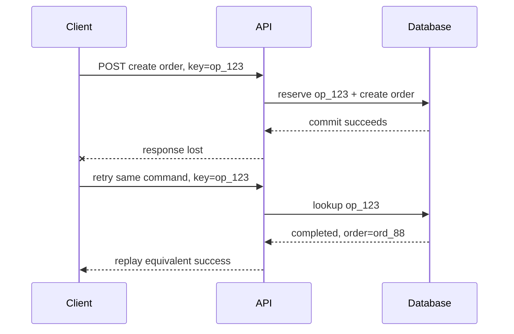
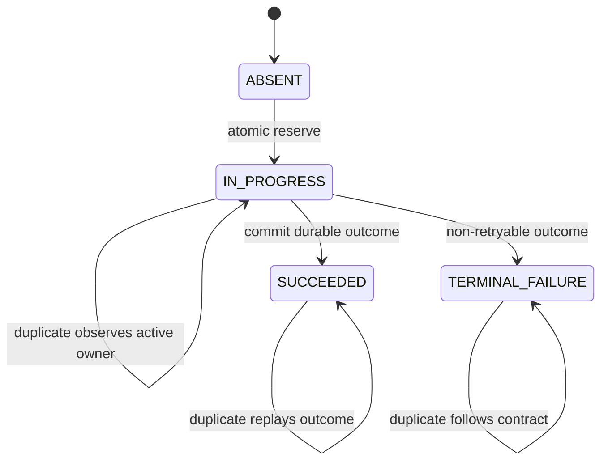
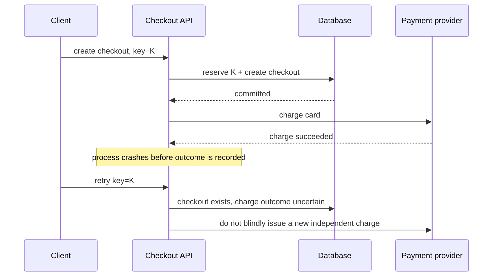

# Idempotency: Make Retries Safe Across Ambiguous Outcomes

## TL;DR

Idempotency means that repeating the **same logical operation** does not apply the intended business effect more than once.

The operational problem appears when a caller cannot tell whether the first attempt succeeded:

```text
client sends command
  -> server commits effect
  -> connection dies before response arrives
  -> client sees timeout
  -> client must decide whether to retry
```

Without an idempotency boundary, availability and correctness fight each other. Retry and you may duplicate the effect. Do not retry and you may leave the user with an operation that succeeded but appears failed.

A practical model is:

```text
logical-operation identity
  + payload fingerprint
  + atomic reservation
  + durable outcome
  + explicit retention window
  + duplicate-safe downstream effects
```



<TermBox term="Idempotency">
**Idempotency** means multiple applications of the same intended operation have the same intended server effect as one application.

**Why it matters:** distributed systems routinely produce ambiguous outcomes. Idempotency lets a caller retry uncertainty without turning transport failure into duplicate business state.
</TermBox>

## 1. HTTP method idempotency is useful, but it is not the whole application story

RFC 9110 defines an HTTP method as idempotent when multiple identical requests have the same **intended effect** as one request. Safe methods, `PUT`, and `DELETE` are defined as idempotent by their method semantics.

That does not mean every implementation is automatically correct. A `PUT` handler that charges a card every time it runs has introduced a non-idempotent side effect behind an idempotent method contract.

Conversely, a `POST` command can be designed so that retries of one logical operation are duplicate-safe even though `POST` itself is not generally idempotent by HTTP semantics.

The important distinction is:

```text
HTTP method property        -> what repeated requests are defined to mean
application idempotency     -> how one logical business operation is recognized and protected
```

Do not claim that adding a header changes the standardized semantics of `POST`. Your application is adding a stronger retry contract for a particular endpoint.

## 2. One logical operation needs one stable identity

<TermBox term="Idempotency key">
An **idempotency key** is an application-level identifier for one logical operation. All retries of that same operation reuse the same key.

**Why it matters:** if a retry generates a new key, the server sees a new operation and cannot distinguish retry from intentional repetition.
</TermBox>

For example:

```http
POST /orders
Idempotency-Key: 3e8a3c8f-...

{
  "cart_id": "cart_42",
  "shipping_address_id": "addr_7"
}
```

The exact header name is an API contract choice. An IETF HTTPAPI draft proposed an `Idempotency-Key` field, but that Internet-Draft expired on 18 April 2026 and is not a finalized RFC. Treat the pattern as application protocol design, not as a currently standardized HTTP field.

A client should generate the key **once when the logical command is created**, then persist or retain it for all retries caused by timeout, connection reset, process restart, or retry scheduling.

Bad:

```text
attempt 1 -> key A
network timeout
attempt 2 -> key B   # server sees a different operation
```

Good:

```text
logical checkout -> key A
attempt 1 -> key A
network timeout
attempt 2 -> key A
```

## 3. Scope the key so unrelated callers cannot collide

The raw key is rarely the complete lookup identity.

Useful scope can include:

```text
tenant_id + operation_type + idempotency_key
account_id + endpoint + idempotency_key
principal_id + command_name + idempotency_key
```

Why scope matters:

- two tenants may legitimately generate the same random value;
- one key reused across unrelated endpoints should not alias two different commands;
- a malicious caller should not be able to guess another tenant's key and replay its stored response;
- retention and uniqueness rules may differ by operation class.

A typical durable record might look like:

```text
scope_key       tenant_17:create_order
idempotency_key 3e8a3c8f-...
fingerprint     sha256(canonical request semantics)
state           IN_PROGRESS | SUCCEEDED | TERMINAL_FAILURE
resource_id     ord_88
status_code     201
response_ref    ...
created_at      ...
expires_at      ...
```

The exact schema is yours. The invariant is that one scoped key names one logical command during the supported retry horizon.

## 4. Bind the key to request semantics with a fingerprint

A key alone is dangerous if the caller accidentally reuses it for a different payload.

Example:

```text
key = K, amount = 100 USD
later: key = K, amount = 900 USD
```

Silently replaying the first result is misleading. Executing the second payload defeats deduplication.

Store a **request fingerprint** derived from the semantics that define the operation. On duplicate lookup:

```text
same key + same fingerprint      -> retry/replay path
same key + different fingerprint -> conflict / client error
```

<TermBox term="Request fingerprint">
A **request fingerprint** is a stable digest or canonical representation of the request fields that define one logical operation.

**Why it matters:** it detects accidental or malicious reuse of one idempotency key for different commands.
</TermBox>

Canonicalization matters. Hashing raw JSON bytes can treat equivalent objects with different field order as different requests. Decide which normalized fields participate, including relevant path parameters and authenticated scope.

Do not include volatile transport fields such as request IDs or timestamps unless they are truly part of business semantics.

## 5. Reservation must be atomic under concurrent duplicates

This implementation is broken:

```text
if not exists(key):
    execute_business_effect()
    insert(key)
```

Two concurrent retries can both observe “not exists” and both execute.

The key must be **reserved atomically before duplicate contenders cross the protected effect boundary**.

Common primitives include:

- database unique constraint plus `INSERT`/upsert;
- compare-and-set;
- atomic key creation in a shared store;
- a transaction that inserts the operation record and changes authoritative state together.



A duplicate that arrives while the first attempt is `IN_PROGRESS` needs an explicit contract. Depending on the endpoint, it can:

- wait briefly for completion;
- return an “operation in progress” response;
- return a resource/operation URL that the client can poll;
- reject concurrent execution while allowing later replay.

Do not start a second business effect merely because the first response is not available yet.

## 6. Put the idempotency record in the same transaction as authoritative state when possible

Suppose order creation writes both:

```text
idempotency_operations
orders
```

If both rows live in one relational database, a strong pattern is:

```text
BEGIN
  reserve scoped idempotency key
  validate fingerprint
  create authoritative order state
  store durable operation outcome/resource reference
COMMIT
```

Now a crash cannot commit the order while losing the idempotency record, or commit the idempotency success record while rolling back the order.

This is why “write the dedupe cache after the handler succeeds” is weaker than it looks. A process crash between the business commit and the dedupe write reopens the duplicate window.

When the idempotency store and authoritative database are separate systems, state the partial-failure contract explicitly. You no longer have a free atomic boundary.

## 7. External side effects need their own protection boundary

A database transaction cannot make an email provider, payment gateway, webhook receiver, and message broker part of the same atomic commit.

Consider:



The outer idempotency key does not magically make the provider call exactly once.

Safe patterns include:

- propagate a stable downstream idempotency key when the provider supports it;
- model payment as a durable operation with its own identity and reconciliation state;
- use a transactional outbox for durable handoff to asynchronous effects;
- enforce a natural uniqueness invariant at the downstream boundary;
- reconcile ambiguous provider outcomes before issuing a new command.

**Exactly-once is always scoped to a boundary.** “Our endpoint is idempotent” must name which business effects are protected.

## 8. Replay the logical outcome, not necessarily the original bytes forever

After a completed duplicate arrives, the server usually should not execute the effect again. It can return:

- the stored status and body;
- the original resource identifier and a reconstructed current representation;
- a stable operation result reference;
- another response explicitly documented as equivalent replay semantics.

The correct choice depends on API contract.

Stripe's public API documentation is one concrete implementation example: for its API v1 idempotent requests, Stripe documents storing the first result's status code and body after execution begins, comparing parameters on reused keys, and returning the stored result on subsequent requests. That is a useful example, not a universal requirement for every API.

Be especially deliberate with failures. Validation failures that never cross the effect boundary may be safely retried after correction; failures after an effect starts may need a durable terminal or ambiguous state. Do not cache every `500` by reflex, and do not re-execute every `500` by reflex. Define the contract from the operation boundary.

## 9. Retention duration is part of the guarantee

Idempotency records cannot necessarily live forever.

Choose retention from:

- maximum client retry/backoff horizon;
- queue redelivery horizon;
- offline/mobile retry behavior;
- business dispute or duplicate-risk window;
- storage cost and privacy requirements;
- whether a natural business key provides a longer-lived uniqueness invariant.

If a key is deleted after 24 hours, a retry after 25 hours may be treated as a new operation unless another invariant stops duplication.

Therefore document the guarantee honestly:

```text
same scoped key within supported retention window -> duplicate-safe replay
same key after retention expiry                    -> may execute as new operation
```

TTL is not just storage housekeeping. It defines when duplicate protection stops.

## 10. Idempotency and uniqueness solve different layers of the problem

Sometimes the business domain already has a natural unique identity:

```text
one invoice per subscription + billing_period
one fulfillment per order_line
one refund per merchant_refund_id
```

A database unique constraint on that invariant is stronger than relying only on an arbitrary retry key.

Use both when useful:

- idempotency key protects transport retries and gives a caller-facing replay contract;
- domain uniqueness protects the business invariant even if the caller loses or changes the retry key.

Do not let the idempotency table become the only thing preventing impossible business state.

## 11. Production scenario: check-then-charge

Consider a checkout endpoint:

```text
if idempotency_key not found:
    charge_card()
    save_order()
    save_idempotency_result()
```

Two requests with the same key arrive concurrently because the mobile client retried after a slow connection. Both processes check before either has inserted the key.

**Impact:** the customer can be charged twice even though both requests carried the same idempotency key. Support sees one logical checkout with multiple provider charges.

**Root cause:** the implementation treated idempotency as a lookup convention rather than a concurrency invariant. `check -> effect -> insert` was not atomic, and the external charge had no stable downstream operation identity.

**Correct pattern:** atomically reserve the scoped key before execution, bind it to a request fingerprint, persist authoritative operation state transactionally, and give the payment command its own stable idempotent/reconciliation boundary. Concurrent duplicates observe the same operation instead of starting another charge.

## 12. Operate the idempotency layer with evidence

Useful signals include:

- new operation count;
- duplicate replay count;
- same-key/different-fingerprint conflicts;
- concurrent `IN_PROGRESS` collisions;
- age of oldest in-progress operation;
- reservation/store latency and error rate;
- outcome distribution by operation type;
- records expiring while retries are still arriving;
- downstream duplicate or reconciliation events;
- fail-open/fail-closed decisions if the idempotency store is unavailable.

For high-stakes writes, silently failing open when the idempotency store is unavailable may be worse than returning a retryable error. For low-risk operations, availability may justify a different policy. Make the decision explicit per operation class.

## Self-check

A client sends `POST /payments` with idempotency key `K`. The server charges the provider successfully but times out before recording the idempotency result. The client retries with the same key.

Is the endpoint safe merely because the key was reused?

<details>
<summary>Show the reasoning</summary>

No. Reusing the key is necessary but not sufficient. The server's durable operation state still says the payment outcome is unknown, while the provider may already have charged the customer. The retry path must reconcile or reuse a stable downstream payment identity before issuing another charge. The idempotency guarantee ends at the boundaries it actually coordinates.

</details>

## Review checklist

- [ ] **Logical operation:** What exact user/business intent does one idempotency key represent?
- [ ] **Key lifecycle:** Is the key created once and reused for every retry of that operation?
- [ ] **Scope:** Is lookup scoped by tenant/principal and operation so unrelated commands cannot collide?
- [ ] **Fingerprint:** Does the server reject the same key with different request semantics?
- [ ] **Atomic reservation:** Can concurrent duplicates race past a check before the key is reserved?
- [ ] **In progress:** What does a duplicate receive while the first attempt is still active?
- [ ] **Transaction:** Can authoritative state and the idempotency outcome commit together?
- [ ] **External effects:** Does each non-transactional downstream effect have its own duplicate-safe or reconciliation boundary?
- [ ] **Replay:** Is the repeated response behavior documented and stable enough for clients?
- [ ] **Retention:** Is the supported retry horizon explicit, and what happens after expiry?
- [ ] **Domain invariant:** Is there a natural uniqueness constraint that should protect the business state independently?
- [ ] **Failure policy:** What happens if the idempotency store itself is unavailable?
- [ ] **Evidence:** Can operators distinguish first executions, replays, conflicts, stuck operations, and downstream ambiguity?

## Agent rule

When making an operation idempotent, never stop at “accept an idempotency key.” Define one logical operation, stable key scope, request fingerprint, atomic reservation, in-progress behavior, durable outcome, retention horizon, and every external effect boundary. Retries must reuse the same operation identity.

## References

- RFC 9110 — HTTP Semantics, section 9.2.2: Idempotent Methods.
- IETF HTTPAPI — `draft-ietf-httpapi-idempotency-key-header-07`. The draft expired on 18 April 2026 and is not a finalized RFC.
- Stripe API Reference — Idempotent requests, used as a concrete implementation example rather than a universal protocol requirement.
