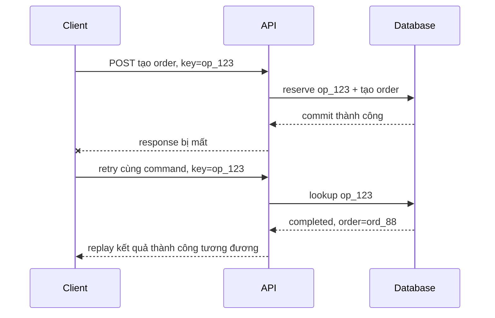
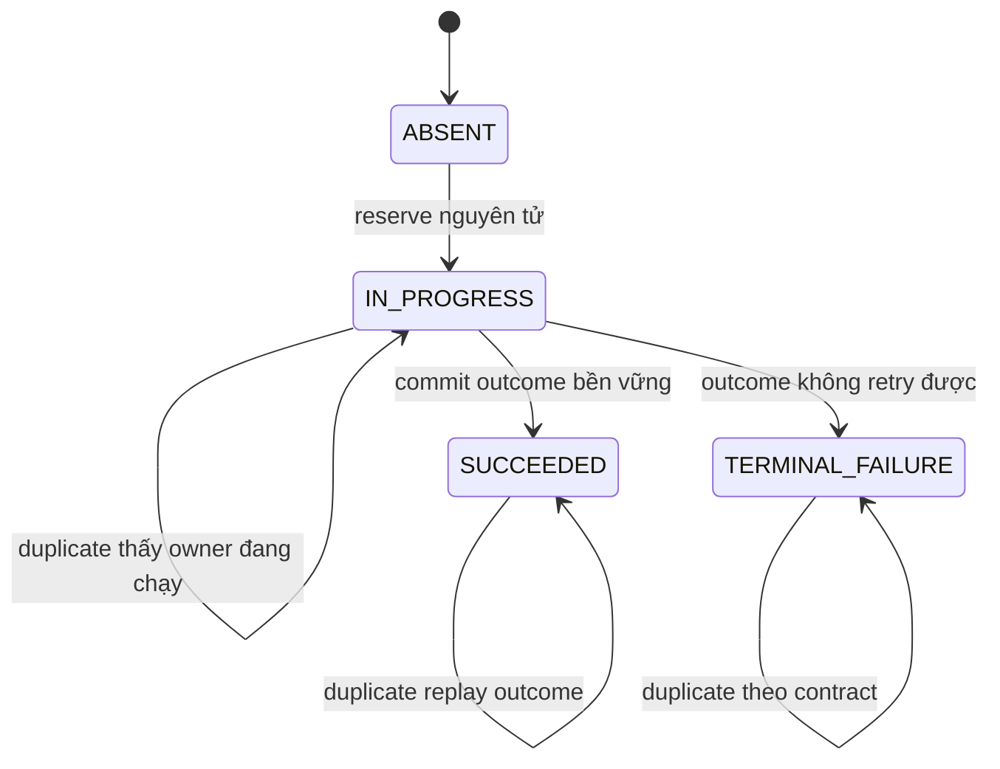
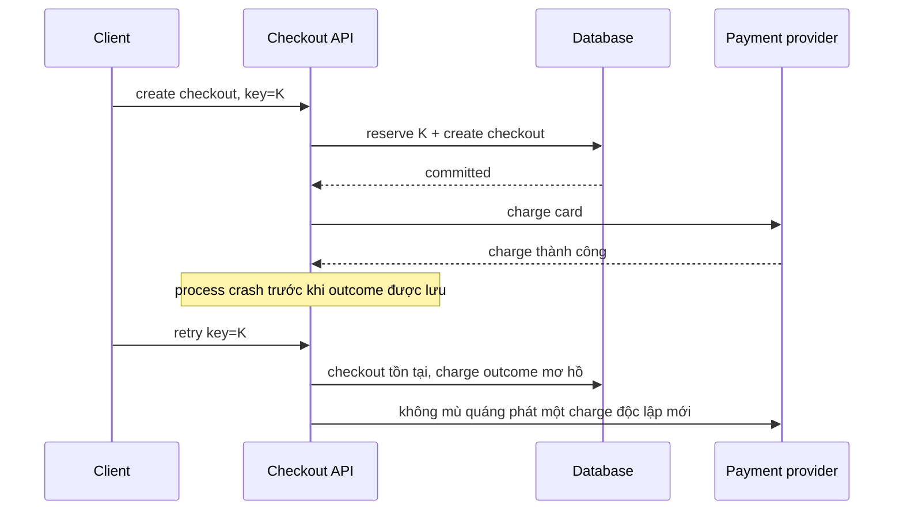

# Idempotency: Biến retry thành thao tác an toàn khi kết quả mơ hồ

## Tóm tắt nhanh

Idempotency nghĩa là lặp lại **cùng một thao tác logic** không làm hiệu ứng nghiệp vụ dự kiến được áp dụng nhiều hơn một lần.

Vấn đề vận hành xuất hiện khi caller không biết attempt đầu đã thành công hay chưa:

```text
client gửi command
  -> server commit hiệu ứng
  -> kết nối chết trước khi response tới client
  -> client chỉ thấy timeout
  -> client phải quyết định có retry hay không
```

Nếu không có ranh giới idempotency, availability và correctness xung đột trực tiếp. Retry thì có thể tạo hiệu ứng trùng. Không retry thì có thể để người dùng nhìn thấy operation như thất bại dù server đã thực hiện xong.

Một mô hình hữu ích:

```text
định danh thao tác logic
  + fingerprint của request
  + reservation nguyên tử
  + outcome bền vững
  + cửa sổ retention rõ ràng
  + downstream effect chịu được duplicate
```



<TermBox term="Idempotency">
**Idempotency** nghĩa là thực hiện nhiều lần cùng một operation dự kiến có cùng hiệu ứng server mong muốn như thực hiện một lần.

**Vì sao quan trọng:** distributed system thường tạo ra outcome mơ hồ. Idempotency cho phép caller retry sự không chắc chắn mà không biến lỗi transport thành trạng thái nghiệp vụ trùng lặp.
</TermBox>

## 1. Idempotency của HTTP method hữu ích nhưng chưa đủ cho application

RFC 9110 định nghĩa một HTTP method là idempotent khi nhiều request giống hệt nhau có cùng **hiệu ứng dự kiến** như một request. Safe methods, `PUT` và `DELETE` được định nghĩa là idempotent theo semantics của method.

Điều đó không có nghĩa mọi implementation tự động đúng. Một handler `PUT` vẫn charge thẻ mỗi lần chạy đã thêm side effect không idempotent phía sau một method contract idempotent.

Ngược lại, một command `POST` có thể được thiết kế để retry của cùng một thao tác logic không tạo duplicate, dù `POST` nói chung không idempotent theo HTTP semantics.

Điểm cần tách rõ:

```text
thuộc tính của HTTP method -> repeated request được định nghĩa có ý nghĩa gì
application idempotency    -> một thao tác nghiệp vụ logic được nhận diện và bảo vệ ra sao
```

Đừng tuyên bố rằng thêm một header làm thay đổi semantics chuẩn của `POST`. Application của bạn đang bổ sung một retry contract mạnh hơn cho endpoint cụ thể.

## 2. Một thao tác logic cần một định danh ổn định

<TermBox term="Idempotency key">
**Idempotency key** là định danh cấp application cho một thao tác logic. Mọi retry của cùng operation phải dùng lại cùng key.

**Vì sao quan trọng:** nếu mỗi retry sinh key mới, server sẽ nhìn thấy operation mới và không thể phân biệt retry với một yêu cầu chủ đích khác.
</TermBox>

Ví dụ:

```http
POST /orders
Idempotency-Key: 3e8a3c8f-...

{
  "cart_id": "cart_42",
  "shipping_address_id": "addr_7"
}
```

Tên header cụ thể là lựa chọn trong API contract. Một Internet-Draft của nhóm IETF HTTPAPI từng đề xuất field `Idempotency-Key`, nhưng bản nháp đó đã **hết hạn ngày 18/04/2026** và chưa trở thành RFC hoàn tất. Hãy xem pattern này là application protocol design, không phải một HTTP field hiện đã được chuẩn hóa.

Client nên tạo key **một lần khi logical command được tạo**, sau đó giữ nguyên key cho mọi retry do timeout, connection reset, process restart hoặc retry scheduler.

Sai:

```text
attempt 1 -> key A
network timeout
attempt 2 -> key B   # server nhìn thấy operation khác
```

Đúng:

```text
logical checkout -> key A
attempt 1 -> key A
network timeout
attempt 2 -> key A
```

## 3. Scope key để các caller không liên quan không va chạm

Raw key hiếm khi là toàn bộ lookup identity.

Scope hữu ích có thể là:

```text
tenant_id + operation_type + idempotency_key
account_id + endpoint + idempotency_key
principal_id + command_name + idempotency_key
```

Vì sao scope quan trọng:

- hai tenant có thể vô tình sinh cùng random value;
- một key dùng lại trên endpoint khác không nên alias hai command khác nhau;
- caller độc hại không nên đoán key của tenant khác rồi replay stored response;
- retention và uniqueness rule có thể khác nhau theo operation class.

Một record bền vững có thể trông như:

```text
scope_key       tenant_17:create_order
idempotency_key 3e8a3c8f-...
fingerprint     sha256(canonical request semantics)
state           IN_PROGRESS | SUCCEEDED | TERMINAL_FAILURE
resource_id     ord_88
status_code     201
response_ref    ...
created_at      ...
expires_at      ...
```

Schema cụ thể tùy hệ thống. Invariant là một scoped key chỉ tên một logical command trong cửa sổ retry được hỗ trợ.

## 4. Bind key với semantics của request bằng fingerprint

Key một mình nguy hiểm nếu caller vô tình dùng lại nó cho payload khác.

Ví dụ:

```text
key = K, amount = 100 USD
sau đó: key = K, amount = 900 USD
```

Replay im lặng kết quả đầu tiên sẽ gây hiểu nhầm. Thực thi payload thứ hai thì phá deduplication.

Hãy lưu **request fingerprint** được tạo từ semantics định nghĩa operation. Khi gặp duplicate:

```text
cùng key + cùng fingerprint -> đường retry/replay
cùng key + payload khác     -> conflict / client error
```

<TermBox term="Request fingerprint">
**Request fingerprint** là digest ổn định hoặc biểu diễn canonical của những field định nghĩa một thao tác logic.

**Vì sao quan trọng:** nó phát hiện việc cùng key bị dùng cho request khác nhau, dù do lỗi client hay cố ý.
</TermBox>

Canonicalization rất quan trọng. Hash raw JSON bytes có thể coi hai object tương đương nhưng khác thứ tự field là hai request khác nhau. Hãy quyết định những field đã normalize nào tham gia fingerprint, gồm path parameter và authenticated scope có ý nghĩa.

Không đưa transport field biến động như request ID hay timestamp vào fingerprint trừ khi chúng thật sự thuộc business semantics.

## 5. Reservation phải nguyên tử trước concurrent duplicate

Implementation sau bị lỗi:

```text
if not exists(key):
    execute_business_effect()
    insert(key)
```

Hai retry đồng thời có thể cùng quan sát “không tồn tại” rồi cùng thực thi.

Key phải được **reserve nguyên tử trước khi các contender duplicate vượt qua ranh giới effect được bảo vệ**.

Primitive thường dùng:

- unique constraint trong database cùng `INSERT`/upsert;
- compare-and-set;
- tạo key nguyên tử trong shared store;
- transaction vừa insert operation record vừa thay đổi authoritative state.



Duplicate đến khi attempt đầu vẫn `IN_PROGRESS` cần contract rõ. Tùy endpoint, nó có thể:

- đợi ngắn để attempt đầu hoàn tất;
- trả trạng thái “operation đang xử lý”;
- trả resource/operation URL để client poll;
- chặn concurrent execution nhưng cho phép replay sau đó.

Không khởi động business effect thứ hai chỉ vì response của attempt đầu chưa sẵn sàng.

## 6. Khi có thể, đặt idempotency record cùng transaction với authoritative state

Giả sử create order ghi cả:

```text
idempotency_operations
orders
```

Nếu hai bảng cùng nằm trong một relational database, pattern mạnh là:

```text
BEGIN
  reserve scoped idempotency key
  kiểm fingerprint
  tạo authoritative order state
  lưu outcome/resource reference bền vững
COMMIT
```

Như vậy crash không thể commit order nhưng làm mất idempotency record, hoặc commit success record nhưng rollback order.

Đây là lý do “sau khi handler thành công thì ghi dedupe cache” yếu hơn vẻ ngoài. Process crash giữa business commit và dedupe write sẽ mở lại duplicate window.

Khi idempotency store và authoritative database là hai hệ thống khác nhau, phải mô tả partial-failure contract rõ. Không còn atomic boundary miễn phí.

## 7. External side effect cần ranh giới bảo vệ riêng

Database transaction không thể biến email provider, payment gateway, webhook receiver và message broker thành một atomic commit duy nhất.

Xét flow:



Outer idempotency key không tự biến provider call thành “đúng một lần”.

Pattern an toàn có thể gồm:

- truyền stable downstream idempotency key nếu provider hỗ trợ;
- mô hình payment như một durable operation có identity và reconciliation state riêng;
- dùng transactional outbox để handoff side effect bất đồng bộ một cách bền vững;
- enforce natural uniqueness invariant tại downstream boundary;
- reconcile outcome mơ hồ từ provider trước khi phát command mới.

**Exactly-once luôn có scope theo một boundary.** Khi nói “endpoint idempotent”, phải chỉ rõ business effect nào thực sự được bảo vệ.

## 8. Replay outcome logic, không nhất thiết lưu nguyên bytes mãi mãi

Khi duplicate của operation đã hoàn tất đến, server thường không thực thi effect lần nữa. Nó có thể trả:

- status/body đã lưu;
- resource ID gốc cùng representation hiện tại được dựng lại;
- operation result reference ổn định;
- response khác nhưng được tài liệu hóa là equivalent replay semantics.

Lựa chọn đúng phụ thuộc API contract.

Stripe là một ví dụ implementation công khai: với idempotent request trong API v1, Stripe mô tả việc lưu status code và body của kết quả đầu tiên sau khi execution bắt đầu, so sánh parameter khi key được dùng lại, rồi trả stored result cho request sau. Đây là ví dụ cụ thể, không phải yêu cầu phổ quát cho mọi API.

Cần đặc biệt rõ với failure. Validation failure chưa vượt effect boundary có thể được sửa rồi retry; failure xảy ra sau khi effect bắt đầu có thể cần durable terminal state hoặc ambiguous state. Đừng cache mọi `500` theo phản xạ, và cũng đừng re-execute mọi `500` theo phản xạ. Contract phải xuất phát từ operation boundary.

## 9. Retention là một phần của guarantee

Idempotency record không nhất thiết sống mãi.

Chọn thời gian lưu dựa trên:

- client retry/backoff horizon tối đa;
- queue redelivery horizon;
- retry offline/mobile;
- duplicate-risk hoặc dispute window của business;
- storage cost và privacy requirement;
- việc domain có natural business key tạo uniqueness dài hạn hơn hay không.

Nếu key bị xóa sau 24 giờ, retry ở giờ thứ 25 có thể bị xem là operation mới nếu không còn invariant nào khác ngăn duplicate.

Vì vậy hãy mô tả guarantee trung thực:

```text
cùng scoped key trong retention window -> duplicate-safe replay
cùng key sau khi retention hết hạn      -> có thể chạy như operation mới
```

TTL không chỉ là housekeeping cho storage. Nó xác định lúc duplicate protection chấm dứt.

## 10. Idempotency và uniqueness bảo vệ hai lớp khác nhau

Đôi khi domain đã có natural unique identity:

```text
một invoice cho mỗi subscription + billing_period
một fulfillment cho mỗi order_line
một refund cho mỗi merchant_refund_id
```

Unique constraint trên invariant này mạnh hơn việc chỉ dựa vào arbitrary retry key.

Có thể dùng cả hai:

- idempotency key bảo vệ transport retry và tạo replay contract hướng caller;
- domain uniqueness bảo vệ business invariant kể cả khi caller mất hoặc đổi retry key.

Đừng để idempotency table trở thành lớp duy nhất ngăn business state bất khả thi.

## 11. Kịch bản production: check rồi mới charge

Xét checkout endpoint:

```text
if idempotency_key not found:
    charge_card()
    save_order()
    save_idempotency_result()
```

Hai request dùng cùng key đến gần như đồng thời vì mobile client retry khi mạng chậm. Cả hai process cùng check trước khi bất kỳ process nào insert key.

**Hậu quả:** khách hàng có thể bị charge hai lần dù cả hai request mang cùng một idempotency key. Support nhìn thấy một logical checkout nhưng nhiều provider charge.

**Nguyên nhân cốt lõi:** implementation xem idempotency như convention lookup thay vì concurrency invariant. `check -> effect -> insert` không nguyên tử, còn external charge không có stable downstream operation identity.

**Cách khắc phục chuẩn:** reserve scoped key một cách nguyên tử trước execution, bind key với request fingerprint, persist authoritative operation state trong transaction, và cho payment command một idempotent/reconciliation boundary riêng. Concurrent duplicate cùng quan sát một operation thay vì bắt đầu charge mới.

## 12. Vận hành lớp idempotency bằng bằng chứng

Signal hữu ích gồm:

- số operation mới;
- số duplicate replay;
- conflict cùng key nhưng khác fingerprint;
- collision đồng thời ở trạng thái `IN_PROGRESS`;
- tuổi của operation đang xử lý lâu nhất;
- latency/error của reservation store;
- phân bố outcome theo operation type;
- record hết retention trong khi retry vẫn đến;
- downstream duplicate hoặc reconciliation event;
- fail-open/fail-closed decision khi idempotency store không khả dụng.

Với write có rủi ro cao, fail-open âm thầm khi idempotency store lỗi có thể tệ hơn việc trả retryable error. Với operation ít rủi ro, availability có thể dẫn đến policy khác. Hãy explicit theo từng operation class.

## Tự kiểm tra

Client gửi `POST /payments` với idempotency key `K`. Server charge provider thành công nhưng timeout trước khi ghi idempotency result. Client retry cùng key.

Endpoint đã an toàn chỉ vì key được dùng lại chưa?

<details>
<summary>Xem giải thích chi tiết</summary>

Chưa. Dùng lại key là cần thiết nhưng không đủ. Durable operation state phía server vẫn nói payment outcome chưa biết, trong khi provider có thể đã charge. Retry path phải reconcile hoặc dùng lại stable downstream payment identity trước khi phát charge khác. Idempotency guarantee chỉ kéo dài tới những boundary mà hệ thống thực sự coordination được.

</details>

## Checklist review

- [ ] **Thao tác logic:** Một idempotency key đại diện chính xác cho intent nghiệp vụ nào?
- [ ] **Vòng đời key:** Key có được tạo một lần và dùng lại cho mọi retry của operation đó không?
- [ ] **Scope:** Lookup có scope theo tenant/principal và operation để command không liên quan không va chạm không?
- [ ] **Fingerprint:** Server có từ chối cùng key nhưng semantics request khác không?
- [ ] **Reservation nguyên tử:** Concurrent duplicate có thể cùng race qua check trước khi key được reserve không?
- [ ] **Đang xử lý:** Duplicate nhận gì khi attempt đầu vẫn active?
- [ ] **Transaction:** Authoritative state và idempotency outcome có commit cùng nhau được không?
- [ ] **External effect:** Mỗi downstream effect ngoài transaction có duplicate-safe hoặc reconciliation boundary riêng không?
- [ ] **Replay:** Hành vi response khi lặp lại có được tài liệu hóa ổn định cho client không?
- [ ] **Retention:** Cửa sổ retry được hỗ trợ có rõ không, và điều gì xảy ra sau khi hết hạn?
- [ ] **Domain invariant:** Có natural uniqueness constraint nào nên bảo vệ business state độc lập không?
- [ ] **Failure policy:** Điều gì xảy ra khi chính idempotency store không khả dụng?
- [ ] **Bằng chứng:** Operator có phân biệt first execution, replay, conflict, stuck operation và downstream ambiguity không?

## Quy tắc cho agent

Khi làm một operation idempotent, không dừng ở “nhận idempotency key”. Hãy định nghĩa một thao tác logic, stable key scope, request fingerprint, atomic reservation, hành vi khi đang `IN_PROGRESS`, durable outcome, retention horizon và mọi external effect boundary. Retry phải dùng lại cùng operation identity.

## Tài liệu tham khảo

- RFC 9110 — HTTP Semantics, mục 9.2.2: Idempotent Methods.
- IETF HTTPAPI — `draft-ietf-httpapi-idempotency-key-header-07`. Bản nháp đã hết hạn ngày 18/04/2026 và chưa phải RFC hoàn tất.
- Stripe API Reference — Idempotent requests, dùng như ví dụ implementation cụ thể chứ không phải protocol requirement phổ quát.
