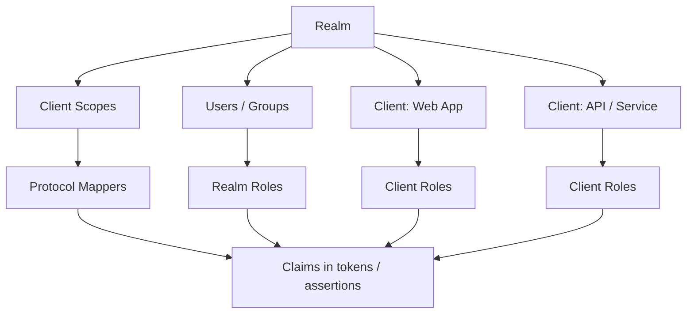
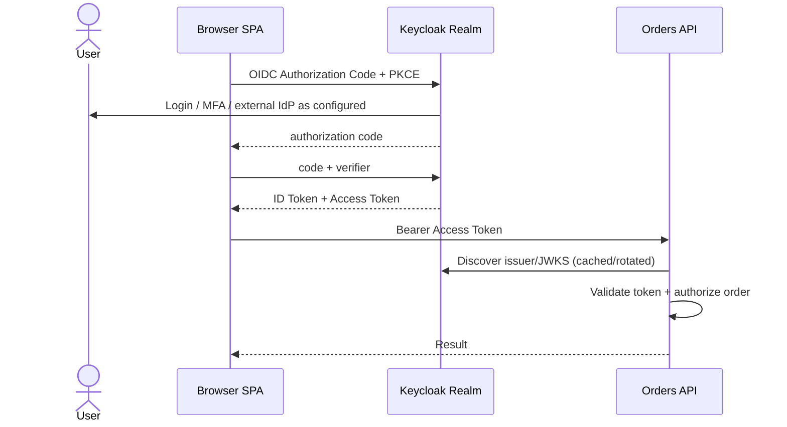
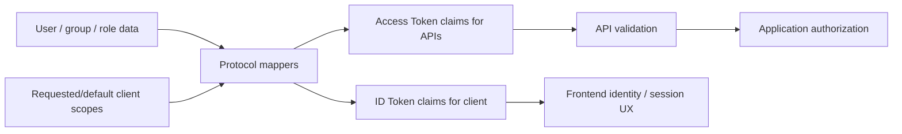

# Keycloak in Practice: Realms, Clients, Roles, Scopes, and Browser Login

## TL;DR

Keycloak becomes much easier when you stop treating its Admin Console as a vocabulary list and instead map each object to protocol responsibilities.

A **realm** is a security domain. A **client** represents an application/service interacting with Keycloak. **Client scopes** and **protocol mappers** control what claims/roles appear in tokens and assertions. Realm/client roles are authorization inputs, not automatic permission checks in your business API.

For a browser-only JavaScript application, Keycloak documents the client as public because browser code cannot keep client credentials confidential. The Keycloak JavaScript adapter uses OIDC, defaults to Authorization Code flow, and current documentation uses PKCE S256 by default.

> 💡 **Rule of thumb:** Configure Keycloak from the outside in: **realm trust boundary → client type and redirect origins → login flow → token contents → API validation → application authorization**.

- **Realm is not a frontend environment variable namespace.** It is a security/administrative boundary.
- **Client ID is not a secret.**
- **Realm role, client role, scope, and claim are different concepts.**
- **Protocol mappers shape token/assertion data; they do not enforce your API's object-level permission rules.**
- **Fatal pitfall:** Putting a client secret into a SPA bundle or accepting any Keycloak-signed JWT at every API without checking issuer/audience/token purpose.



<TermBox term="Realm">
A **realm** is a Keycloak security domain that groups users, credentials, roles, clients, sessions, policies, and identity-provider configuration. Realms isolate administrative and identity state from one another.
</TermBox>

## 1. Translate Keycloak vocabulary into protocol vocabulary

| Keycloak term | Practical mental model |
| --- | --- |
| Realm | Security/identity domain and issuer boundary |
| Client | Application or service registered with Keycloak |
| Client ID | Public identifier for that client registration |
| Client authentication | Whether the client authenticates itself to the token endpoint |
| Realm role | Role namespace available across the realm |
| Client role | Role namespace owned by one client |
| Client scope | Reusable bundle of scope/role mapping and token-mapper configuration |
| Protocol mapper | Rule that maps user/session/role data into OIDC claims or SAML assertions |
| Identity provider | External IdP Keycloak can broker to |
| User federation | External user directory/store integration such as LDAP |
| Service account | Client acting on its own behalf |

The Admin Console becomes much less mysterious once each configuration is tied back to a protocol boundary.

<TermBox term="Client Scope">
A **client scope** is reusable Keycloak configuration that can contribute protocol mappers and role-scope mappings to clients. It helps control which claims and roles are requested or emitted for a client.
</TermBox>

## 2. Model a frontend + API as separate responsibilities

Suppose you have:

- React SPA: `https://app.example.com`;
- Orders API: `https://api.example.com`;
- Keycloak issuer: `https://id.example.com/realms/acme`.

The frontend is an OIDC client. The API is a resource server that validates access tokens and applies authorization.

Do not make the frontend responsible for deciding whether Alice may edit another tenant's order.



## 3. Public and confidential clients answer a storage question

For browser-only JavaScript, Keycloak's documentation says the client must be a public client because there is no secure way to store client credentials in client-side code.

In current Admin Console terms, that means client authentication is disabled for the browser client.

A server-side BFF can instead act as a confidential client because it has a server execution environment in which client credentials or stronger client-authentication methods can be protected.

Do not choose “confidential” merely because the application is important.

The question is:

> Can this client instance actually protect its authentication credential from users and attackers who control the client environment?

## 4. Configure redirect URIs and origins narrowly

For a SPA, the most common dangerous convenience is an overly broad redirect/origin configuration.

Prefer exact or tightly bounded application origins and callbacks. Wildcards expand where authorization responses may be delivered and can turn unrelated application routing or hosting mistakes into token/code leakage paths.

Keycloak's JavaScript adapter documentation explicitly recommends keeping `Valid Redirect URIs` and `Web Origins` as specific as possible.

## 5. Understand Keycloak JS without treating it as magic

The `keycloak-js` adapter implements OIDC browser behavior for Keycloak.

Current behavior/documentation includes:

- OIDC under the hood;
- Authorization Code flow by default;
- PKCE `S256` enabled by default;
- `login-required` and `check-sso` startup modes;
- access token attached as a Bearer token when calling APIs;
- token refresh through `updateToken()`;
- access and refresh tokens kept in memory rather than persisted by the adapter.

A typical conceptual setup looks like:

```ts
const keycloak = new Keycloak({
  url: 'https://id.example.com',
  realm: 'acme',
  clientId: 'web-app',
});

await keycloak.init({
  onLoad: 'check-sso',
  pkceMethod: 'S256',
});
```

Do not copy a client secret into this configuration.

## 6. Realm roles and client roles are namespaced authority inputs

A realm role such as `employee` may be broadly reusable.

A client role such as `orders-api:refund` belongs to one client's role namespace.

Which model is appropriate depends on ownership and reuse:

- use realm roles for genuinely realm-wide identity/entitlement categories;
- use client roles when authority belongs to a specific application/service namespace;
- keep roles coarse enough to manage, then apply resource/context checks in the API.

A role claim saying `orders-admin` still does not answer “may this administrator modify tenant X?” without application policy.

## 7. Client scopes and protocol mappers shape token contents

<TermBox term="Protocol Mapper">
A **protocol mapper** tells Keycloak how user attributes, roles, session data, or fixed values become OIDC token claims or SAML assertion data for a client/client scope.
</TermBox>

Examples:

- map internal user attribute `department=finance` to a token claim;
- include a role namespace in access tokens;
- rename a claim expected by a legacy application;
- expose only the claims required by a specific client scope.

Avoid turning tokens into copies of the entire user directory. More claims increase coupling, privacy exposure, and stale authorization assumptions.



## 8. Do not confuse scope, role, and mapper

A practical debugging question is “where did this token field come from?”

Work backward:

1. which token is this: ID or access token?
2. which client requested it?
3. which client scopes were applied?
4. which protocol mapper added the claim?
5. which user/group/role data fed that mapper?
6. which audience/resource server is expected to consume it?

This is more reliable than clicking random Admin Console tabs until the claim appears.

## 9. Identity brokering connects Keycloak to another IdP

Keycloak can act as the identity broker between your applications and an external IdP.

Example:

```text
App -> Keycloak -> Corporate Entra ID
                 <- OIDC/SAML response
    <- Keycloak session/tokens
```

Your applications continue trusting Keycloak as their issuer while Keycloak delegates primary authentication to the corporate IdP according to broker configuration.

This is different from LDAP user federation, where Keycloak connects to a user store/directory.

## 10. APIs validate tokens; Keycloak does not replace application authorization

A typical API validation contract includes:

- exact expected realm issuer;
- trusted signing algorithms/keys from JWKS;
- expiration/not-before constraints;
- intended audience/resource expectations;
- token type/profile required by the API;
- required scopes/roles/claims.

Then the API performs its own authorization for the requested action and resource.

Do not call Keycloak on every request merely to ask “is this JWT real?” when local signature/claim validation is the intended architecture; do not skip revocation/session requirements when your threat model needs stronger immediacy either.

## 11. Choose browser architecture deliberately

A direct SPA using `keycloak-js` is a browser-based OAuth/OIDC client and therefore exposes access tokens to JavaScript memory.

A BFF architecture can keep OAuth tokens on the server side and give the browser a protected cookie session instead. RFC 10017 describes BFF as the most secure of its three main browser patterns, at the cost of an additional backend component and cookie/CSRF responsibilities.

Keycloak works with either shape. The choice is an application architecture decision, not a checkbox in Keycloak.

## Production micro-scenario: the “admin” token crosses every boundary

A team creates one realm role named `admin`, leaves broad role scope enabled for multiple clients, and configures several APIs to accept any JWT signed by the realm. A frontend receives a token intended for one client and successfully calls an unrelated administrative API because that API checks only signature and the presence of `admin`.

- **Impact:** Authority intended for one application becomes reusable across unrelated APIs.
- **Root cause:** Realm-wide role naming, broad token contents, and incomplete audience/resource validation collapsed separate authorization boundaries.
- **Correct pattern:** Namespace authority deliberately, restrict role scope/client scopes, validate the token's intended API audience/profile, and enforce application/resource authorization independently of Keycloak role issuance.

## Check your mental model

> **Scenario:** You add `department=finance` through a protocol mapper and can see it in the ID Token shown by the frontend. Does that mean the Orders API should trust the ID Token and allow finance-only endpoints?

<details>
<summary>Show the reasoning</summary>

No.

The mapper only controls emitted identity data. The Orders API should receive the token type intended for the resource server, validate its issuer/audience/profile, and then apply its own finance authorization policy. A claim appearing in an ID Token does not convert that token into an API access token.

</details>

## Keycloak integration checklist

- [ ] **Realm:** Is the realm an intentional security/administrative boundary?
- [ ] **Client type:** Is browser code public and server-side code confidential only when it can protect credentials?
- [ ] **Redirects:** Are Valid Redirect URIs and Web Origins specific?
- [ ] **Flow:** Is Authorization Code + PKCE used for the browser flow?
- [ ] **Tokens:** Are ID and access tokens used for their intended consumers?
- [ ] **Scopes:** Are default/optional client scopes deliberate?
- [ ] **Roles:** Are realm roles versus client roles chosen by ownership/reuse?
- [ ] **Mappers:** Can every custom token claim be traced to a real consumer requirement?
- [ ] **Audience:** Does each API reject tokens not intended for it?
- [ ] **Authorization:** Does the API enforce resource/context rules after token validation?
- [ ] **Storage:** Are browser tokens kept out of persistent storage unless a deliberate threat-model decision says otherwise?
- [ ] **Federation:** Is identity brokering distinguished from LDAP/user federation?
- [ ] **Logout:** Are local app, Keycloak SSO, and other client sessions treated as separate state?
- [ ] **Operations:** Are signing-key rotation, session lifetime, audit events, and incident revocation requirements understood?

## Boundaries with related Atlas lessons

- [OAuth 2.0 & OpenID Connect](/docs/backend-engineering/oauth-and-oidc) explains the protocol mechanics behind the Keycloak configuration.
- [Single Sign-On & Identity Federation](/docs/backend-engineering/sso-and-identity-federation) explains reusable login state, brokering, SAML, CAS, and logout boundaries.
- [Authentication & Authorization](/docs/backend-engineering/authentication-and-authorization) owns the application principal and permission model.

## Sources

- [Keycloak — Server Administration Guide](https://www.keycloak.org/docs/latest/server_admin/)
- [Keycloak — JavaScript Adapter](https://www.keycloak.org/securing-apps/javascript-adapter)
- [Keycloak — Securing applications and services with OpenID Connect](https://www.keycloak.org/securing-apps/oidc-layers)
- [RFC 10017 — OAuth 2.0 for Browser-Based Applications](https://www.rfc-editor.org/rfc/rfc10017.html)
- [RFC 9700 — Best Current Practice for OAuth 2.0 Security](https://www.rfc-editor.org/rfc/rfc9700.html)
