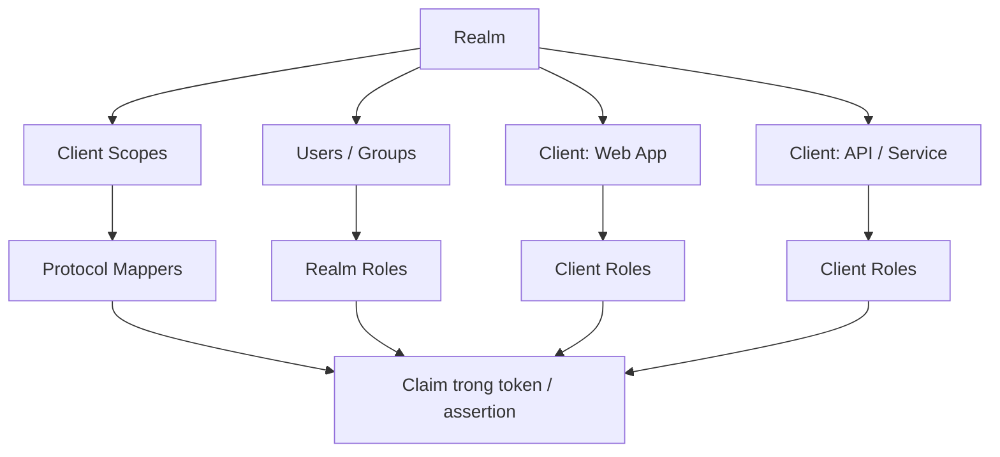
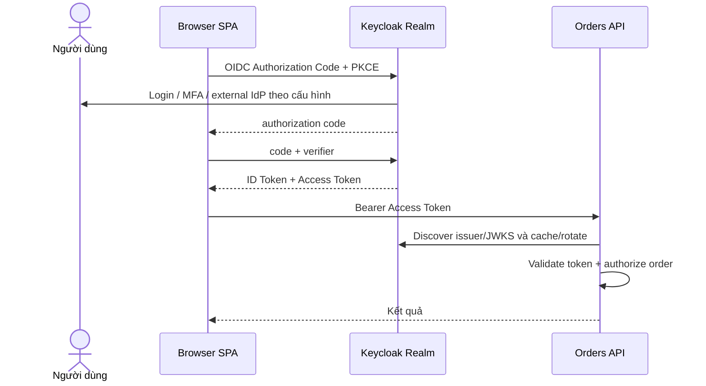
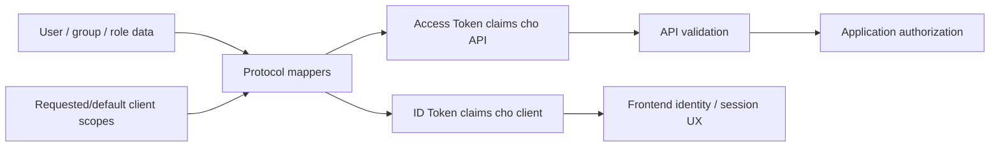

# Keycloak Thực chiến: Realm, Client, Role, Scope và Đăng nhập Trình duyệt

## Tóm tắt nhanh

Keycloak dễ hiểu hơn rất nhiều khi bạn không xem Admin Console như một danh sách vocabulary mà ánh xạ từng object về responsibility của protocol.

**Realm** là security domain. **Client** đại diện application/service tương tác với Keycloak. **Client scope** và **protocol mapper** kiểm soát claim/role nào xuất hiện trong token và assertion. Realm/client role là input cho authorization, không tự động thay thế permission check trong business API.

Với JavaScript application chạy hoàn toàn trong browser, tài liệu Keycloak xem client là public vì browser code không thể giữ client credential bí mật. Keycloak JavaScript adapter dùng OIDC, mặc định Authorization Code flow và tài liệu hiện hành bật PKCE S256 mặc định.

> 💡 **Quy tắc bỏ túi:** Cấu hình Keycloak từ ngoài vào trong: **realm trust boundary → client type và redirect origin → login flow → token content → API validation → application authorization**.

- **Realm không phải namespace cho environment variable của frontend.** Nó là security/administrative boundary.
- **Client ID không phải secret.**
- **Realm role, client role, scope và claim là các khái niệm khác nhau.**
- **Protocol mapper định hình dữ liệu trong token/assertion; nó không enforce object-level permission của API.**
- **Sai lầm chí mạng:** Nhét client secret vào SPA bundle hoặc cho mọi API accept bất kỳ JWT nào có chữ ký Keycloak mà không kiểm issuer/audience/token purpose.



<TermBox term="Realm">
**Realm** là security domain của Keycloak, gom user, credential, role, client, session, policy và identity-provider configuration. Các realm cô lập administrative và identity state với nhau.
</TermBox>

## 1. Dịch vocabulary Keycloak sang mental model của protocol

| Thuật ngữ Keycloak | Mô hình tư duy thực tế |
| --- | --- |
| Realm | Security/identity domain và issuer boundary |
| Client | Application hoặc service đăng ký với Keycloak |
| Client ID | Public identifier của client registration |
| Client authentication | Client có tự authenticate tại token endpoint hay không |
| Realm role | Role namespace dùng rộng trong realm |
| Client role | Role namespace thuộc riêng một client |
| Client scope | Bundle tái sử dụng cho scope/role mapping và token mapper |
| Protocol mapper | Rule map user/session/role data sang OIDC claim hoặc SAML assertion |
| Identity provider | External IdP mà Keycloak có thể broker |
| User federation | Tích hợp external user directory/store như LDAP |
| Service account | Client hành động thay mặt chính nó |

Admin Console trở nên dễ đọc hơn khi mỗi configuration được gắn lại với protocol boundary.

<TermBox term="Client Scope">
**Client scope** là configuration tái sử dụng trong Keycloak có thể đóng góp protocol mapper và role-scope mapping cho client. Nó giúp kiểm soát claim/role nào được request hoặc phát hành cho client.
</TermBox>

## 2. Xem frontend + API là hai responsibility riêng

Giả sử bạn có:

- React SPA: `https://app.example.com`;
- Orders API: `https://api.example.com`;
- Keycloak issuer: `https://id.example.com/realms/acme`.

Frontend là OIDC client. API là resource server validate access token và áp authorization.

Đừng để frontend quyết định Alice có được sửa order của tenant khác hay không.



## 3. Public và confidential client trả lời câu hỏi về khả năng giữ credential

Với browser-only JavaScript, tài liệu Keycloak nói client phải là public vì không có cách an toàn để giữ client credential trong client-side code.

Trong Admin Console hiện tại, điều đó tương ứng với việc tắt client authentication cho browser client.

Server-side BFF có thể là confidential client vì nó có môi trường server để bảo vệ client credential hoặc client-authentication method mạnh hơn.

Đừng chọn “confidential” chỉ vì application quan trọng.

Câu hỏi đúng là:

> Client instance này có thật sự bảo vệ được authentication credential khỏi user và attacker kiểm soát client environment không?

## 4. Cấu hình redirect URI và origin đủ hẹp

Với SPA, convenience nguy hiểm phổ biến nhất là redirect/origin configuration quá rộng.

Ưu tiên exact hoặc tightly bounded application origin/callback. Wildcard mở rộng nơi authorization response có thể được gửi tới và có thể biến routing/hosting mistake thành đường leak code/token.

Tài liệu Keycloak JavaScript adapter khuyến nghị giữ `Valid Redirect URIs` và `Web Origins` cụ thể nhất có thể.

## 5. Hiểu Keycloak JS mà không xem nó là phép màu

`keycloak-js` adapter triển khai OIDC browser behavior cho Keycloak.

Behavior/documentation hiện hành gồm:

- chạy trên OIDC;
- mặc định Authorization Code flow;
- PKCE `S256` bật mặc định;
- startup mode `login-required` và `check-sso`;
- gửi access token dạng Bearer khi gọi API;
- refresh token qua `updateToken()`;
- adapter giữ access/refresh token trong memory thay vì persistent storage.

Một conceptual setup:

```ts
const keycloak = new Keycloak({
  url: 'https://id.example.com',
  realm: 'acme',
  clientId: 'web-app',
});

await keycloak.init({
  onLoad: 'check-sso',
  pkceMethod: 'S256',
});
```

Không copy client secret vào cấu hình này.

## 6. Realm role và client role là authority input có namespace

Realm role như `employee` có thể tái sử dụng rộng.

Client role như `orders-api:refund` thuộc role namespace của một client.

Chọn model theo ownership và reuse:

- dùng realm role cho identity/entitlement category thật sự dùng toàn realm;
- dùng client role khi authority thuộc application/service namespace cụ thể;
- giữ role đủ coarse để quản lý, rồi áp resource/context check trong API.

Role claim `orders-admin` vẫn không trả lời “admin này có được sửa tenant X không?” nếu thiếu application policy.

## 7. Client scope và protocol mapper định hình token content

<TermBox term="Protocol Mapper">
**Protocol mapper** chỉ cho Keycloak cách map user attribute, role, session data hoặc fixed value thành OIDC token claim hay SAML assertion data cho client/client scope.
</TermBox>

Ví dụ:

- map internal user attribute `department=finance` sang token claim;
- include role namespace trong access token;
- rename claim cho legacy application;
- chỉ expose claim mà một client scope cụ thể cần.

Tránh biến token thành bản sao toàn bộ user directory. Nhiều claim làm tăng coupling, privacy exposure và stale authorization assumption.



## 8. Đừng lẫn scope, role và mapper

Một câu hỏi debug thực dụng là “field này trong token đến từ đâu?”

Lần ngược:

1. token này là ID hay access token?
2. client nào request nó?
3. client scope nào được áp?
4. protocol mapper nào thêm claim?
5. user/group/role data nào cấp input cho mapper?
6. audience/resource server nào sẽ consume nó?

Cách này đáng tin hơn việc click ngẫu nhiên trong Admin Console tới khi claim xuất hiện.

## 9. Identity brokering nối Keycloak với IdP khác

Keycloak có thể làm identity broker giữa application của bạn và external IdP.

Ví dụ:

```text
App -> Keycloak -> Corporate Entra ID
                 <- OIDC/SAML response
    <- Keycloak session/tokens
```

Application tiếp tục trust Keycloak làm issuer trong khi Keycloak delegate primary authentication sang corporate IdP theo broker configuration.

Điều này khác LDAP user federation, nơi Keycloak nối tới user store/directory.

## 10. API validate token; Keycloak không thay thế application authorization

Một API validation contract điển hình gồm:

- exact expected realm issuer;
- trusted signing algorithm/key từ JWKS;
- expiration/not-before constraint;
- expected audience/resource;
- token type/profile mà API yêu cầu;
- required scope/role/claim.

Sau đó API tự thực hiện authorization cho action và resource.

Đừng gọi Keycloak mỗi request chỉ để hỏi “JWT này có thật không?” nếu kiến trúc intended là local signature/claim validation; nhưng cũng đừng bỏ qua revocation/session requirement khi threat model cần immediacy mạnh hơn.

## 11. Chọn browser architecture có chủ đích

Direct SPA dùng `keycloak-js` là browser-based OAuth/OIDC client nên access token hiện diện trong JavaScript memory.

BFF architecture có thể giữ OAuth token ở server side và chỉ đưa browser protected cookie session. RFC 10017 mô tả BFF là pattern bảo mật cao nhất trong ba browser architecture chính, đổi lại phải thêm backend component và chịu cookie/CSRF responsibility.

Keycloak làm việc với cả hai dạng. Đây là application architecture decision, không phải một checkbox trong Keycloak.

## Kịch bản production: token “admin” đi xuyên mọi boundary

Một team tạo realm role chung tên `admin`, để broad role scope cho nhiều client rồi cấu hình nhiều API accept bất kỳ JWT nào được realm ký. Frontend nhận token intended cho một client nhưng gọi được administrative API không liên quan vì API chỉ kiểm signature và có role `admin`.

- **Hậu quả:** Authority dành cho một application trở thành quyền tái sử dụng trên nhiều API không liên quan.
- **Nguyên nhân cốt lõi:** Realm-wide role naming, broad token content và incomplete audience/resource validation làm sụp các authorization boundary riêng.
- **Cách khắc phục chuẩn:** Namespace authority có chủ đích, giới hạn role scope/client scope, validate audience/profile API kỳ vọng và enforce application/resource authorization độc lập với role issuance của Keycloak.

## Tự kiểm tra mô hình tư duy

> **Kịch bản:** Bạn thêm `department=finance` bằng protocol mapper và thấy nó trong ID Token phía frontend. Điều đó có nghĩa Orders API nên trust ID Token rồi mở finance-only endpoint không?

<details>
<summary>Xem giải thích chi tiết</summary>

Không.

Mapper chỉ kiểm soát identity data được phát hành. Orders API phải nhận token type dành cho resource server, validate issuer/audience/profile rồi áp finance authorization policy của riêng nó. Một claim xuất hiện trong ID Token không biến token đó thành API access token.

</details>

## Checklist tích hợp Keycloak

- [ ] **Realm:** Realm có phải security/administrative boundary được chọn có chủ đích không?
- [ ] **Client type:** Browser code có là public và server-side code chỉ confidential khi thật sự bảo vệ được credential không?
- [ ] **Redirects:** Valid Redirect URIs và Web Origins có cụ thể không?
- [ ] **Flow:** Browser flow có dùng Authorization Code + PKCE không?
- [ ] **Tokens:** ID và access token có được dùng đúng consumer không?
- [ ] **Scopes:** Default/optional client scope có được chọn có chủ đích không?
- [ ] **Roles:** Realm role và client role có được chọn theo ownership/reuse không?
- [ ] **Mappers:** Mọi custom token claim có trace được tới consumer requirement thật không?
- [ ] **Audience:** API có reject token không dành cho nó không?
- [ ] **Authorization:** API có enforce resource/context rule sau token validation không?
- [ ] **Storage:** Browser token có tránh persistent storage trừ khi threat-model decision chủ đích không?
- [ ] **Federation:** Identity brokering có được tách khỏi LDAP/user federation không?
- [ ] **Logout:** Local app, Keycloak SSO và session client khác có được xem là state riêng không?
- [ ] **Operations:** Signing-key rotation, session lifetime, audit event và incident revocation requirement có được hiểu không?

## Ranh giới với các bài Atlas liên quan

- [OAuth 2.0 & OpenID Connect](/vi/docs/backend-engineering/oauth-and-oidc) giải thích protocol mechanics đứng sau cấu hình Keycloak.
- [Đăng nhập Một lần & Liên kết Danh tính](/vi/docs/backend-engineering/sso-and-identity-federation) giải thích reusable login state, brokering, SAML, CAS và logout boundary.
- [Authentication & Authorization](/vi/docs/backend-engineering/authentication-and-authorization) sở hữu application principal và permission model.

## Nguồn tham khảo

- [Keycloak — Server Administration Guide](https://www.keycloak.org/docs/latest/server_admin/)
- [Keycloak — JavaScript Adapter](https://www.keycloak.org/securing-apps/javascript-adapter)
- [Keycloak — Securing applications and services with OpenID Connect](https://www.keycloak.org/securing-apps/oidc-layers)
- [RFC 10017 — OAuth 2.0 for Browser-Based Applications](https://www.rfc-editor.org/rfc/rfc10017.html)
- [RFC 9700 — Best Current Practice for OAuth 2.0 Security](https://www.rfc-editor.org/rfc/rfc9700.html)
