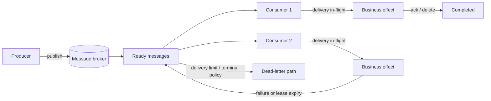

# Message Queues: Make Delivery and Completion Explicit

## TL;DR

A message queue separates the time a **producer** submits work from the time a **consumer** performs it. The broker owns a delivery lifecycle between those two endpoints, but it does not make the business side effect exactly once.

A useful mental model is:

```text
producer -> broker accepts message -> ready -> in-flight -> consumer effect
                                                    |            |
                                                    |            +-> ack/delete
                                                    +--------------> redelivery on failure/timeout
```

Reason about both sides of the broker boundary:

1. What proves the producer's publish was accepted durably enough?
2. What happens if the producer loses the connection before it receives that proof?
3. How does a consumer claim or receive work?
4. When does the message become in-flight, and for how long?
5. What exact event acknowledges completion?
6. Under which failures can the delivery reappear?
7. Can the business effect tolerate that duplicate delivery?
8. How much unacknowledged work may one consumer hold?
9. What ordering scope is actually required?
10. When does repeatedly failing work stop circulating and become visible to operators?



The central rule is: **transport completion and business completion are different facts**.

<TermBox term="Message broker">
A **message broker** accepts messages from producers, stores or routes them according to its durability and topology rules, and delivers them to consumers.

**Why it matters:** the broker provides a coordination boundary between producer and consumer, but its confirmation only describes what happened inside that broker boundary. It does not prove that a downstream business effect succeeded.
</TermBox>

## 1. Separate queue mechanics from job semantics

A background job describes application-level work: identity, lifecycle, retries, cancellation, progress, and terminal state. A message queue describes **transport ownership and delivery state**.

One job might be carried by a queue message:

```text
job_id: export_9281
job_type: GENERATE_EXPORT
attempt_hint: 3
payload_ref: db://exports/export_9281
```

The durable application record can say the logical export is `PROCESSING` while the broker says one delivery is currently in-flight. Those are related but not interchangeable.

Do not make the message body the only durable business record if operators need to inspect state after acknowledgement. Likewise, do not assume a database job table automatically provides broker-style routing, flow control, or publisher confirmation.

## 2. Producer success needs its own confirmation

A dangerous producer flow is:

```text
send(message)
return success to caller
```

What does `send` success mean? Depending on the client and broker, it may mean bytes entered a local socket buffer, the broker accepted the message, or a durable broker path confirmed it.

<TermBox term="Publisher confirmation">
A **publisher confirmation** is evidence from the messaging system that a publication reached the broker boundary defined by that system's contract.

**Why it matters:** without a confirmation strategy, a producer can report success before the message is safely accepted, or retry an ambiguous publication and create duplicates.
</TermBox>

RabbitMQ distinguishes **publisher confirms** from consumer acknowledgements. Publisher confirms cover the producer-to-broker side; consumer acknowledgements cover broker-to-consumer processing. They solve different distributed-system failure windows.

Consider this sequence:

```text
1. producer publishes message M
2. broker accepts M
3. network connection breaks
4. producer never receives confirmation
```

The producer cannot infer from the broken connection whether M was accepted. Retrying may be the safest availability choice, but then the system must tolerate two logically equivalent messages.

This is one reason stable message IDs, job IDs, idempotency keys, or downstream deduplication boundaries matter. “The producer only sent once in code” is not a delivery guarantee.

## 3. Competing consumers share one work pool

<TermBox term="Competing consumers">
**Competing consumers** are several consumers attached to the same logical work queue so the broker can distribute different deliveries across them.

**Why it matters:** horizontal scaling increases processing capacity for one work pool, but each consumer does not receive every message. Independent business subscribers need independent subscriptions/queues or retained-stream semantics.
</TermBox>

With three workers:

```text
queue: [A B C D E F]
worker-1 <- A, D
worker-2 <- B, E
worker-3 <- C, F
```

The exact distribution is broker-specific, but the ownership model is the important part. If email, fraud, and analytics all need every `OrderPlaced` fact, three consumers competing on one queue are not a fan-out design. The [Queue vs Event Stream](/docs/engineering-judgment/decision-guides/queue-vs-event-stream) guide covers that architecture decision in depth.

## 4. Acknowledgement defines transport completion

<TermBox term="Consumer acknowledgement">
A **consumer acknowledgement (ack)** tells the broker that this delivery may be considered successfully handled according to the broker's delivery contract.

**Why it matters:** acknowledging too early can lose work after a consumer crash; acknowledging after the business effect creates a duplicate window if the effect succeeds but the ack is lost.
</TermBox>

The usual safe direction is:

```text
receive -> validate -> perform duplicate-safe effect -> record completion -> ack
```

But there is no ordering that magically makes an external side effect and a broker acknowledgement one atomic transaction.

If a worker sends an email and crashes before ack, the broker can redeliver the message. If the handler blindly sends again, the customer receives two emails. If the effect must happen once logically, enforce that invariant at the effect boundary with an idempotency key, uniqueness record, state transition, or another appropriate deduplication mechanism.

Automatic acknowledgement before processing can improve throughput but weakens recoverability: the broker may forget the delivery while application code is still running. Use it only when message loss is explicitly acceptable or the application has another recovery source.

## 5. In-flight state is a lease, not proof of exclusivity forever

Different queue systems express in-flight ownership differently.

Amazon SQS uses a **visibility timeout**: after a consumer receives a message, the message remains in the queue but is temporarily hidden. If the consumer does not delete it before the timeout expires, the message becomes visible for another receive. SQS standard queues are still at-least-once; visibility does not guarantee a duplicate can never occur.

RabbitMQ push consumers use acknowledgements plus a configurable **prefetch** window that limits how many unacknowledged deliveries can be outstanding.

These are different APIs around the same reasoning question:

> How much work can a consumer own without proving completion, and how does that ownership expire or flow back to the broker?

If processing normally takes two minutes but the visibility timeout is 30 seconds, a second worker may receive the message while the first is still processing it. If a consumer prefetches hundreds of expensive messages, one worker can hoard work and memory while other consumers sit idle.

```mermaid
sequenceDiagram
  participant Q as Queue
  participant W1 as Worker 1
  participant W2 as Worker 2

  Q->>W1: deliver M; M becomes in-flight
  W1->>W1: processing takes 120s
  Note over Q,W1: visibility/lease expires at 30s
  Q->>W2: redeliver M
  W2->>W2: performs same logical effect
  W1-->>Q: late ack/delete attempt
  W2-->>Q: ack/delete
```

Size visibility/lease duration from measured processing behavior, and extend/renew it deliberately for long-running work when the broker supports that. Bound prefetch or in-flight count so one consumer cannot accumulate more work than it can process safely.

## 6. Redelivery is normal failure recovery

A queue should make failure recoverable rather than silently losing work. Common reasons for redelivery include:

- consumer crash;
- connection/channel loss;
- acknowledgement never arriving;
- visibility timeout or lease expiry;
- explicit negative acknowledgement/requeue;
- transient processing failure routed into a retry mechanism.

This means handlers should assume **at-least-once delivery unless the actual broker contract and full effect boundary prove something stronger**.

Exactly-once claims are always scoped. A broker may deduplicate a send or transaction internally without atomically including an HTTP call, email send, payment, or mutation in another datastore. Design the external effect separately.

A useful message envelope includes stable identity and traceability:

```text
message_id
logical_job_id or event_id
message_type
schema_version
created_at
correlation_id / trace_id
payload or durable payload reference
```

Do not generate a new logical idempotency identity on every redelivery attempt.

## 7. Ordering is a scope, not a global checkbox

“FIFO” is incomplete until you name the ordering domain and completion semantics.

Even if a broker delivers A before B, two workers can finish B before A. Retries can also make an older message complete after a newer one.

Ask:

- Must all messages be globally ordered?
- Is order only required per account, order, document, or aggregate key?
- Is **delivery order** enough, or must **effect completion order** also hold?
- What happens when one message in an ordered group repeatedly fails?

Strong ordering usually constrains parallelism. If all work must pass through one serial consumer, throughput and fault isolation change. Prefer the narrowest ordering key that preserves the actual invariant.

When a later state supersedes an earlier state, version checks can sometimes protect correctness better than serializing the entire system:

```text
apply update only if incoming_version > stored_version
```

The correct mechanism depends on the business model, not on a “FIFO” label.

## 8. Dead-letter paths stop poison work from consuming the fleet

<TermBox term="Dead-letter path">
A **dead-letter path** moves or records messages that should no longer circulate through the normal delivery loop after a terminal condition, rejection policy, expiration, or delivery limit.

**Why it matters:** one poison message should become inspectable evidence, not retry forever and consume worker capacity.
</TermBox>

Dead-lettering is not a garbage bin. Operators need enough context to decide whether to:

- repair data and replay;
- fix code and replay;
- discard an invalid message deliberately;
- compensate for a partially completed effect;
- escalate a producer/schema bug.

Keep original message identity, failure classification, relevant attempt metadata, and correlation identifiers. Avoid copying secrets or oversized debugging dumps into dead-letter metadata.

Retries should distinguish transient from terminal failures. A malformed schema, revoked business object, or deterministic validation failure should not receive the same retry policy as a temporary network timeout.

## 9. Backpressure lives in queue depth, age, and in-flight work

A queue can absorb bursts, but backlog is deferred load, not free capacity.

Track at least:

- **queue depth / backlog** — how many ready messages wait;
- **age of the oldest message** — how long the worst waiting work has been delayed;
- in-flight or unacknowledged count;
- publish rate versus completion rate;
- retry/redelivery rate;
- dead-letter rate;
- worker concurrency and saturation;
- per-message processing latency.

Queue depth alone can mislead. A backlog of 10,000 ten-millisecond jobs may be healthier than 500 ten-minute jobs. The age of the oldest message often maps more directly to a user-facing delay objective.

Backpressure must change behavior. Possible controls include:

- bound consumer concurrency and prefetch/in-flight count;
- slow or reject non-critical producers;
- prioritize important work carefully;
- scale workers within downstream capacity;
- pause expensive optional jobs;
- expose delayed-processing state to users;
- protect databases and third-party APIs from a queue-draining surge.

A growing backlog dashboard without an admission or capacity response is observability, not backpressure control.

## 10. A queue does not solve producer/database dual writes

This flow has a classic partial-failure window:

```text
1. commit order to database
2. publish OrderReadyForFulfillment
```

If the process crashes after step 1 and before step 2, the order exists but no queue message is published. Reversing the order creates the opposite problem: a consumer may receive work for a database write that never commits.

Do not assume publisher confirms solve this **database-to-broker atomicity** problem. Patterns such as a transactional outbox record the business mutation and an intent-to-publish in one local transaction, then publish asynchronously with duplicate-safe handling.

That is a separate concept from queue delivery itself, but it is an important boundary: broker durability starts only after the publication reaches the broker.

## Production scenario: visibility timeout shorter than fulfillment

An order-fulfillment queue uses a 30-second visibility timeout. Most warehouse reservation calls finish in under 10 seconds, so the default looked safe during testing. A downstream inventory service becomes slow and some reservations now take 70–90 seconds.

Worker A receives `FulfillOrder:ord_742` and begins reserving stock. At 30 seconds the message becomes visible again. Worker B receives the same message while Worker A is still active. Both reach a non-idempotent shipping-label endpoint and create separate labels before one finally deletes the queue message.

**Impact:** duplicate labels and duplicate warehouse work are created for the same order; some orders are packed twice and require manual reconciliation.

**Root cause:** the team treated the visibility timeout as a performance setting rather than an ownership lease. Processing time exceeded the lease, and the downstream fulfillment effect had no stable idempotency boundary for redelivery.

**Correct pattern:** size and monitor visibility from real processing latency, renew/extend ownership for legitimately long attempts, bound in-flight work, and make fulfillment effects idempotent by stable order/job identity. Acknowledge/delete only after the durable completion state is recorded. Alert on redelivery, oldest-message age, and long-running attempts so an overloaded dependency is visible before duplicate work becomes the symptom.

The deeper lesson is that queues recover from uncertainty by **making work available again**. Correct consumers must turn that recovery behavior into safe repetition.

## Self-check

A producer publishes a billing job. The broker accepts it, but the network fails before the producer receives publisher confirmation. The producer retries with a new random message ID. Later, both copies reach two consumers. Each consumer successfully charges the same invoice and then acknowledges its delivery.

Which queue mechanism failed?

<details>
<summary>Show the reasoning</summary>

The broker may have behaved correctly. The first publish was ambiguous from the producer's perspective, so retrying was reasonable. Delivery and acknowledgement also worked as designed.

The missing invariant was **logical duplicate identity at the business-effect boundary**. The retry should preserve a stable invoice/job/idempotency identity, and the charging boundary should reject or reuse a previously completed logical charge. Publisher confirms reduce ambiguity but cannot atomically include an external payment effect.

</details>

## Message queue review checklist

- [ ] **Purpose:** Is this a work queue for competing consumers rather than an accidental fan-out/event-history substitute?
- [ ] **Publish proof:** What exactly confirms the producer's publication, and what happens when that confirmation is ambiguous?
- [ ] **Identity:** Does redelivery preserve a stable logical message/job/effect identity?
- [ ] **In-flight:** How much unacknowledged work may each consumer hold?
- [ ] **Lease:** Does visibility/ack ownership match real processing duration, including long-tail latency?
- [ ] **Ack:** Is acknowledgement after the durable effect/completion record rather than before meaningful work?
- [ ] **Duplicates:** Can the business effect safely tolerate redelivery?
- [ ] **Ordering:** Is required order scoped per the smallest business key, and is completion order considered separately from delivery order?
- [ ] **Retries:** Are transient failures separated from terminal/poison work?
- [ ] **Dead letters:** Can operators inspect, repair, replay, or deliberately discard terminal messages?
- [ ] **Backpressure:** Do queue depth, oldest-message age, in-flight work, and downstream capacity drive control actions?
- [ ] **Dual writes:** If a database mutation must cause a message, is the database-to-broker failure window handled explicitly?

## Agent rule

When reviewing queue-backed work, draw both failure boundaries: **producer → broker** and **broker → consumer/effect**. Never infer business completion from publication success or transport acknowledgement alone. Preserve stable logical identity across retries, make duplicate effects safe, bound in-flight work, state ordering scope, and connect backlog evidence to an actual pressure-control response.

## Related concepts

- **Background Jobs** — application-level logical work lifecycle, retries, cancellation, and progress can be transported by a queue but are not the same as broker delivery state.
- **Queue vs Event Stream** — use it when deciding between completion-oriented work ownership and retained independent subscriber history.
- **Idempotency** — protects business effects across ambiguous publish and redelivery windows.
- **Retries & Backoff** — retry policy must be bounded and classified by transient versus terminal failure.
- **Transactional Outbox** — addresses the database-write plus broker-publish atomicity gap.
- **Logs, Metrics & Traces** — correlation IDs and queue delay/processing spans connect async work back to the originating request.

Continue through the [Backend Systems](/docs/learning-paths/backend-systems) path toward rate limiting, idempotency, service resilience, and deeper delivery semantics.

## Sources

Primary references verified on **2026-09-10**:

- [RabbitMQ — Consumer Acknowledgements and Publisher Confirms](https://www.rabbitmq.com/docs/confirms)
- [RabbitMQ — Dead Letter Exchanges](https://www.rabbitmq.com/docs/dlx)
- [Amazon SQS — Visibility Timeout](https://docs.aws.amazon.com/AWSSimpleQueueService/latest/SQSDeveloperGuide/sqs-visibility-timeout.html)
- [Amazon SQS — Processing messages in a timely manner](https://docs.aws.amazon.com/AWSSimpleQueueService/latest/SQSDeveloperGuide/best-practices-processing-messages-timely-manner.html)

The references show concrete broker APIs; the reasoning model is intentionally vendor-neutral. A different queue may use leases, reservations, pulls, pushes, receipts, or acknowledgements with different details, so verify the actual product contract before relying on a specific guarantee.

This lesson is **evolving** with a 180-day review target because broker capabilities and operational guidance change even though publish ambiguity, acknowledgement boundaries, redelivery, duplicate safety, ordering scope, and backpressure reasoning remain durable.
