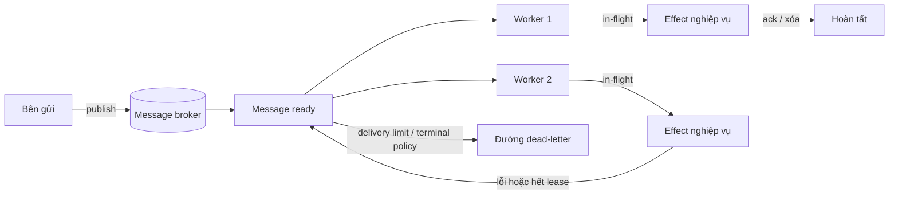

# Message Queue: làm rõ giao nhận và hoàn tất

## Tóm tắt

Message queue tách thời điểm **bên gửi** đưa công việc vào hệ thống khỏi thời điểm **worker/bên xử lý** thực hiện nó. Broker sở hữu một vòng đời giao nhận giữa hai đầu đó, nhưng broker không tự biến effect nghiệp vụ thành exactly-once.

Một mental model hữu ích là:

```text
bên gửi -> broker nhận message -> ready -> in-flight -> worker tạo effect
                                             |               |
                                             |               +-> ack/xóa
                                             +------------------> giao lại khi lỗi/hết lease
```

Hãy lập luận cả hai phía của ranh giới broker:

1. Bằng chứng nào cho thấy publish của bên gửi đã được broker nhận đủ bền vững?
2. Nếu kết nối mất trước khi bên gửi nhận bằng chứng đó thì sao?
3. Worker nhận hoặc claim message như thế nào?
4. Khi nào message trở thành in-flight và quyền sở hữu đó kéo dài bao lâu?
5. Sự kiện nào chính xác được coi là xác nhận hoàn tất?
6. Failure nào khiến message được giao lại?
7. Effect nghiệp vụ có chịu được lần giao trùng đó không?
8. Một worker được giữ bao nhiêu message chưa xác nhận?
9. Phạm vi thứ tự thật sự cần bảo toàn là gì?
10. Khi nào công việc lỗi lặp lại phải dừng vòng quay bình thường và trở nên nhìn thấy được với operator?



Quy tắc trung tâm là: **hoàn tất ở tầng transport và hoàn tất nghiệp vụ là hai sự thật khác nhau**.

<TermBox term="Message broker">
**Message broker** nhận message từ bên gửi, lưu hoặc route chúng theo quy tắc durability/topology của nó, rồi giao cho worker/bên tiêu thụ.

**Vì sao quan trọng:** broker tạo ranh giới phối hợp giữa producer và consumer, nhưng xác nhận của broker chỉ nói về điều đã xảy ra trong ranh giới broker. Nó không chứng minh effect nghiệp vụ phía sau đã thành công.
</TermBox>

## 1. Tách cơ chế queue khỏi ngữ nghĩa job

Background job mô tả công việc ở tầng ứng dụng: identity, lifecycle, retry, cancellation, progress và terminal state. Message queue mô tả **quyền sở hữu transport và trạng thái giao nhận**.

Một job có thể được chở bởi một queue message:

```text
job_id: export_9281
job_type: GENERATE_EXPORT
attempt_hint: 3
payload_ref: db://exports/export_9281
```

Bản ghi ứng dụng bền vững có thể nói logical export đang `PROCESSING`, trong khi broker chỉ nói một delivery cụ thể đang in-flight. Hai trạng thái liên quan nhưng không thể thay thế nhau.

Không dùng message body làm bản ghi nghiệp vụ bền vững duy nhất nếu operator cần xem trạng thái sau khi ack. Ngược lại, một job table trong database cũng không tự có routing, flow control hay publisher confirmation giống broker.

## 2. Thành công phía bên gửi cần xác nhận riêng

Một flow nguy hiểm là:

```text
send(message)
trả success cho caller
```

`send` thành công nghĩa là gì? Tùy client và broker, nó có thể chỉ nghĩa byte đã vào socket buffer cục bộ, broker đã nhận message, hoặc một đường ghi bền vững trong broker đã xác nhận.

<TermBox term="Publisher confirmation">
**Publisher confirmation** là bằng chứng từ hệ thống messaging rằng publication đã tới ranh giới broker được hợp đồng của hệ thống đó định nghĩa.

**Vì sao quan trọng:** thiếu cơ chế xác nhận gửi/publish, producer có thể báo thành công trước khi message được nhận an toàn, hoặc retry một publication mơ hồ và tạo duplicate.
</TermBox>

RabbitMQ tách **publisher confirms** khỏi consumer acknowledgements. Publisher confirms bảo vệ phía producer → broker; consumer acknowledgements bảo vệ phía broker → consumer. Chúng xử lý hai failure window khác nhau.

Xét chuỗi sau:

```text
1. producer publish message M
2. broker nhận M
3. kết nối mạng mất
4. producer không nhận được confirmation
```

Producer không thể suy ra từ kết nối hỏng rằng M đã được nhận hay chưa. Retry có thể là lựa chọn tốt cho availability, nhưng hệ thống phải chịu được hai message tương đương về logic.

Đó là lý do message ID, job ID, idempotency key hoặc ranh giới deduplication ổn định rất quan trọng. “Code chỉ gọi send một lần” không phải delivery guarantee.

## 3. Worker cạnh tranh chia sẻ một work pool

<TermBox term="Competing consumers">
**Worker cạnh tranh (competing consumers)** là nhiều consumer cùng gắn vào một logical queue để broker phân phối các delivery khác nhau giữa họ.

**Vì sao quan trọng:** scale ngang tăng năng lực xử lý cho một work pool, nhưng mỗi consumer không nhận mọi message. Các capability nghiệp vụ độc lập cần subscription/queue độc lập hoặc semantics của retained stream.
</TermBox>

Ví dụ ba worker:

```text
queue: [A B C D E F]
worker-1 <- A, D
worker-2 <- B, E
worker-3 <- C, F
```

Cách chia cụ thể phụ thuộc broker; ownership model mới là điểm quan trọng. Nếu email, fraud và analytics đều phải thấy mọi `OrderPlaced`, ba consumer cạnh tranh trên một queue không phải fan-out. Guide [Queue vs Event Stream](/vi/docs/engineering-judgment/decision-guides/queue-vs-event-stream) xử lý sâu quyết định kiến trúc đó.

## 4. Ack định nghĩa hoàn tất ở tầng transport

<TermBox term="Consumer acknowledgement">
**Consumer acknowledgement (ack)** là xác nhận xử lý gửi về broker rằng delivery này có thể được coi là hoàn tất theo delivery contract của broker.

**Vì sao quan trọng:** ack quá sớm có thể làm mất work khi worker crash; ack sau effect lại tạo duplicate window nếu effect thành công nhưng ack bị mất.
</TermBox>

Hướng an toàn thường là:

```text
nhận -> validate -> tạo effect lặp an toàn -> ghi completion bền vững -> ack
```

Nhưng không có thứ tự nào tự động biến external side effect và broker acknowledgement thành một transaction nguyên tử.

Nếu worker gửi email rồi crash trước ack, broker có thể giao lại message. Nếu handler gửi mù lần nữa, khách nhận hai email. Nếu effect phải xảy ra đúng một lần về logic, hãy bảo vệ invariant tại effect boundary bằng idempotency key, unique record, state transition hoặc cơ chế dedup phù hợp.

Automatic acknowledgement trước khi xử lý có thể tăng throughput nhưng làm recovery yếu hơn: broker có thể quên delivery trong lúc application code vẫn chạy. Chỉ dùng khi mất message được chấp nhận tường minh hoặc ứng dụng có nguồn recovery khác.

## 5. In-flight là một lease, không phải độc quyền vĩnh viễn

Các queue system biểu diễn ownership đang xử lý khác nhau.

Amazon SQS dùng **visibility timeout**: sau khi consumer nhận message, message vẫn nằm trong queue nhưng tạm bị ẩn. Nếu consumer không xóa trước khi timeout hết, message lại visible cho một lần receive khác. Standard queue của SQS vẫn là at-least-once; visibility không bảo đảm duplicate không bao giờ xảy ra.

RabbitMQ với push consumer dùng acknowledgements cùng **prefetch**, tức cửa sổ giới hạn số delivery chưa xác nhận có thể đang outstanding.

Đây là các API khác nhau quanh cùng một câu hỏi:

> Một worker được sở hữu bao nhiêu work chưa chứng minh hoàn tất, và ownership đó hết hạn hoặc quay về broker bằng cách nào?

Nếu xử lý thường mất hai phút nhưng thời gian ẩn/visibility timeout chỉ 30 giây, worker thứ hai có thể nhận cùng message trong lúc worker đầu vẫn chạy. Nếu một consumer prefetch hàng trăm message nặng, một worker có thể ôm work và RAM trong khi worker khác rảnh.

```mermaid
sequenceDiagram
  participant Q as Queue
  participant W1 as Worker 1
  participant W2 as Worker 2

  Q->>W1: giao M; M trở thành in-flight
  W1->>W1: xử lý mất 120s
  Note over Q,W1: visibility/lease hết ở 30s
  Q->>W2: giao lại M
  W2->>W2: chạy cùng logical effect
  W1-->>Q: ack/xóa muộn
  W2-->>Q: ack/xóa
```

Chọn thời lượng visibility/lease từ latency xử lý đã đo; gia hạn ownership có chủ đích cho work dài khi broker hỗ trợ. Giới hạn prefetch hoặc số in-flight để một worker không tích lũy nhiều work hơn mức có thể xử lý an toàn.

## 6. Giao lại là cơ chế recovery bình thường

Queue nên làm failure có thể phục hồi thay vì âm thầm mất work. Các nguyên nhân giao lại thường gồm:

- worker crash;
- mất connection/channel;
- acknowledgement không tới broker;
- visibility timeout hoặc lease hết;
- negative acknowledgement/requeue tường minh;
- lỗi tạm thời được route qua retry mechanism.

Vì vậy handler nên giả định **at-least-once delivery trừ khi hợp đồng broker thật và toàn bộ effect boundary chứng minh được mức mạnh hơn**.

Claim exactly-once luôn có scope. Broker có thể deduplicate send hoặc transaction bên trong nó nhưng không tự atomically bao gồm HTTP call, email, payment hoặc mutation ở datastore khác. Effect bên ngoài phải được thiết kế riêng.

Một message envelope hữu ích có identity ổn định:

```text
message_id
logical_job_id hoặc event_id
message_type
schema_version
created_at
correlation_id / trace_id
payload hoặc durable payload reference
```

Không tạo logical idempotency identity mới cho mỗi lần giao lại.

## 7. Thứ tự là một phạm vi, không phải checkbox toàn cục

“FIFO” chưa đủ nếu chưa nói ordering scope và semantics của completion.

Ngay cả khi broker giao A trước B, hai worker có thể hoàn tất B trước A. Retry cũng có thể khiến message cũ hoàn tất sau message mới.

Hãy hỏi:

- Có thật cần global ordering không?
- Hay chỉ cần thứ tự theo account, order, document hoặc aggregate key?
- Chỉ **delivery order** quan trọng, hay cả **effect completion order**?
- Nếu một message trong ordered group lỗi lặp lại thì các message sau phải làm gì?

Ordering mạnh thường làm giảm parallelism. Nếu toàn bộ work phải qua một consumer tuần tự, throughput và fault isolation thay đổi. Hãy dùng ordering key hẹp nhất vẫn bảo toàn invariant thật.

Khi state mới supersede state cũ, version check đôi khi bảo vệ correctness tốt hơn serialize toàn hệ thống:

```text
chỉ apply nếu incoming_version > stored_version
```

Cơ chế đúng đi từ business model chứ không đi từ nhãn “FIFO”.

## 8. Dead-letter path ngăn poison work chiếm worker fleet

<TermBox term="Dead-letter path">
**Dead-letter path** chuyển hoặc ghi lại message không nên tiếp tục chạy trong delivery loop bình thường sau terminal condition, rejection policy, expiration hoặc delivery limit.

**Vì sao quan trọng:** một poison message phải trở thành bằng chứng có thể điều tra, không retry vô hạn và tiêu tốn worker capacity.
</TermBox>

Dead-letter không phải thùng rác. Operator cần đủ context để quyết định:

- sửa data rồi replay;
- sửa code rồi replay;
- loại bỏ message invalid có chủ đích;
- compensate effect đã chạy một phần;
- escalate bug phía producer/schema.

Giữ original message identity, failure classification, attempt metadata cần thiết và correlation identifiers. Không nhét secret hoặc debug dump quá lớn vào dead-letter metadata.

Retry phải phân biệt transient failure với terminal failure. Schema hỏng, business object đã bị thu hồi hoặc validation deterministic không nên nhận cùng retry policy như network timeout tạm thời.

## 9. Backpressure nằm ở backlog, tuổi message và in-flight work

Queue hấp thụ burst, nhưng backlog là tải bị trì hoãn chứ không phải capacity miễn phí.

Theo dõi tối thiểu:

- **queue depth / backlog** — có bao nhiêu message ready đang chờ;
- **tuổi của message lâu nhất** — work tệ nhất đã bị trì hoãn bao lâu;
- số in-flight/chưa ack;
- publish rate so với completion rate;
- retry/redelivery rate;
- dead-letter rate;
- worker concurrency và saturation;
- processing latency theo message.

Độ sâu hàng đợi một mình có thể đánh lừa. 10.000 job 10ms có thể khỏe hơn 500 job 10 phút. Tuổi message lâu nhất thường ánh xạ trực tiếp hơn tới objective về thời gian chờ của người dùng.

Backpressure/áp lực ngược phải thay đổi hành vi. Có thể:

- giới hạn worker concurrency và prefetch/in-flight;
- làm chậm hoặc từ chối producer không critical;
- ưu tiên work quan trọng một cách có kiểm soát;
- scale worker trong giới hạn downstream capacity;
- tạm dừng job tùy chọn tốn kém;
- hiển thị trạng thái xử lý chậm cho người dùng;
- bảo vệ database và third-party API khỏi một đợt drain queue quá mạnh.

Dashboard chỉ cho thấy backlog tăng mà không nối tới admission/capacity action mới là observability, chưa phải kiểm soát áp lực.

## 10. Queue không tự giải quyết dual write giữa database và broker

Flow sau có partial-failure window kinh điển:

```text
1. commit order vào database
2. publish OrderReadyForFulfillment
```

Nếu process crash sau bước 1 nhưng trước bước 2, order tồn tại mà queue message không có. Đảo thứ tự lại tạo vấn đề ngược: consumer có thể nhận work cho một database write cuối cùng không commit.

Không giả định publisher confirms giải quyết **database-to-broker atomicity**. Pattern như transactional outbox ghi business mutation và intent-to-publish trong cùng local transaction, rồi publish bất đồng bộ với duplicate-safe handling.

Đây là concept riêng với queue delivery, nhưng ranh giới rất quan trọng: broker durability chỉ bắt đầu sau khi publication thực sự tới broker.

## Tình huống production: visibility timeout ngắn hơn fulfillment

Một order-fulfillment queue dùng visibility timeout 30 giây. Hầu hết warehouse reservation call hoàn tất dưới 10 giây nên default trông an toàn trong test. Một dependency inventory trở nên chậm và một số reservation mất 70–90 giây.

Worker A nhận `FulfillOrder:ord_742` và bắt đầu giữ stock. Tới giây 30, message visible trở lại. Worker B nhận cùng message trong khi Worker A vẫn hoạt động. Cả hai cùng gọi endpoint tạo shipping label không lũy đẳng và tạo hai label riêng trước khi một worker cuối cùng xóa message.

**Hậu quả:** cùng một order có duplicate label và duplicate warehouse work; một số order bị pack hai lần và cần reconciliation thủ công.

**Nguyên nhân cốt lõi:** nhóm coi visibility timeout như tuning hiệu năng thay vì ownership lease. Processing latency vượt lease và effect fulfillment không có idempotency boundary ổn định cho lần giao lại.

**Cách khắc phục chuẩn:** chọn và giám sát visibility từ processing latency thật, gia hạn ownership cho attempt dài hợp lệ, giới hạn in-flight work và làm effect fulfillment lũy đẳng theo order/job identity ổn định. Chỉ ack/xóa sau khi completion state bền vững đã được ghi. Alert theo redelivery, tuổi message lâu nhất và attempt chạy dài để dependency quá tải lộ ra trước khi duplicate work trở thành triệu chứng.

Bài học sâu hơn là queue phục hồi khỏi uncertainty bằng cách **đưa work ra lại để xử lý**. Consumer đúng phải biến recovery behavior đó thành sự lặp lại an toàn.

## Tự kiểm tra

Một producer publish billing job. Broker đã nhận, nhưng mạng lỗi trước khi producer nhận publisher confirmation. Producer retry với một random message ID mới. Sau đó cả hai bản sao tới hai worker. Mỗi worker charge cùng invoice thành công rồi ack delivery.

Cơ chế queue nào đã hỏng?

<details>
<summary>Xem lập luận</summary>

Broker có thể đã hoạt động hoàn toàn đúng. Publication đầu tiên mơ hồ từ góc nhìn producer nên retry là hợp lý. Delivery và acknowledgement cũng chạy đúng hợp đồng.

Invariant bị thiếu là **logical duplicate identity tại business-effect boundary**. Retry phải giữ invoice/job/idempotency identity ổn định, và ranh giới charge phải reject hoặc reuse logical charge đã hoàn tất. Publisher confirmation giảm ambiguity nhưng không thể atomically bao gồm payment effect bên ngoài.

</details>

## Checklist review message queue

- [ ] **Mục đích:** Đây có phải work queue cho competing consumers, không phải fan-out/event-history vô tình không?
- [ ] **Publish proof:** Chính xác điều gì xác nhận publication của bên gửi, và chuyện gì xảy ra khi xác nhận gửi trở nên mơ hồ?
- [ ] **Identity:** Lần giao lại có giữ logical message/job/effect identity ổn định không?
- [ ] **In-flight:** Mỗi worker được giữ bao nhiêu work chưa ack?
- [ ] **Lease:** Visibility/ack ownership có khớp processing duration thật, kể cả long-tail latency không?
- [ ] **Ack:** Xác nhận hoàn tất có xảy ra sau durable effect/completion record thay vì trước meaningful work không?
- [ ] **Duplicate:** Business effect có chịu được redelivery một cách lũy đẳng không?
- [ ] **Thứ tự:** Ordering có được scope theo business key hẹp nhất, và completion order có được xét riêng với delivery order không?
- [ ] **Retry:** Transient failure có được tách khỏi terminal/poison work không?
- [ ] **Dead letter:** Operator có thể inspect, repair, replay hoặc discard terminal message có chủ đích không?
- [ ] **Backpressure:** Queue depth, tuổi message lâu nhất, in-flight work và downstream capacity có kích hoạt control action không?
- [ ] **Dual write:** Nếu database mutation phải gây ra message, failure window database → broker đã được xử lý tường minh chưa?

## Quy tắc cho agent

Khi review work chạy qua queue, hãy vẽ cả hai failure boundary: **producer → broker** và **broker → consumer/effect**. Không suy ra business completion từ publish success hoặc transport acknowledgement. Giữ logical identity ổn định qua retry, làm duplicate effect an toàn, giới hạn in-flight work, nêu rõ ordering scope và nối backlog evidence với một pressure-control response thật.

## Khái niệm liên quan

- **Background Jobs** — lifecycle, retry, cancellation và progress của logical work ở tầng ứng dụng có thể được chở qua queue nhưng không đồng nhất với broker delivery state.
- **Queue vs Event Stream** — dùng khi quyết định giữa work ownership hướng completion và lịch sử retained cho các subscriber độc lập.
- **Idempotency** — bảo vệ business effect qua publish ambiguity và redelivery window.
- **Retries & Backoff** — retry policy phải bounded và phân loại transient/terminal failure.
- **Transactional Outbox** — xử lý atomicity gap giữa database write và broker publish.
- **Logs, Metrics & Traces** — correlation ID cùng span queue-delay/processing nối async work về request nguồn.

Tiếp tục theo [Backend Systems](/vi/docs/learning-paths/backend-systems) tới rate limiting, idempotency, service resilience và delivery semantics sâu hơn.

## Nguồn tham khảo

Các nguồn chính được kiểm tra ngày **2026-09-10**:

- [RabbitMQ — Consumer Acknowledgements and Publisher Confirms](https://www.rabbitmq.com/docs/confirms)
- [RabbitMQ — Dead Letter Exchanges](https://www.rabbitmq.com/docs/dlx)
- [Amazon SQS — Visibility Timeout](https://docs.aws.amazon.com/AWSSimpleQueueService/latest/SQSDeveloperGuide/sqs-visibility-timeout.html)
- [Amazon SQS — Processing messages in a timely manner](https://docs.aws.amazon.com/AWSSimpleQueueService/latest/SQSDeveloperGuide/best-practices-processing-messages-timely-manner.html)

Các nguồn trên minh họa API cụ thể của broker; mental model vẫn vendor-neutral. Queue khác có thể dùng lease, reservation, pull, push, receipt hoặc acknowledgement với chi tiết khác, vì vậy phải kiểm tra hợp đồng thật của sản phẩm trước khi dựa vào một guarantee cụ thể.

Bài này ở trạng thái **evolving** với chu kỳ review 180 ngày vì capability broker và guidance vận hành thay đổi, dù lập luận về publish ambiguity, acknowledgement boundary, redelivery, duplicate safety, ordering scope và backpressure vẫn bền vững.
