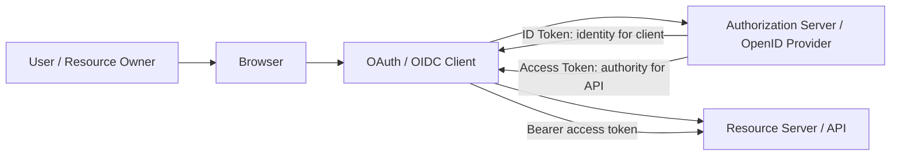
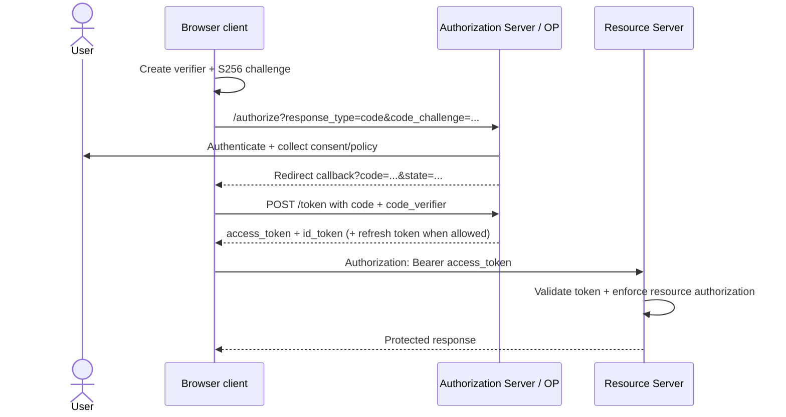
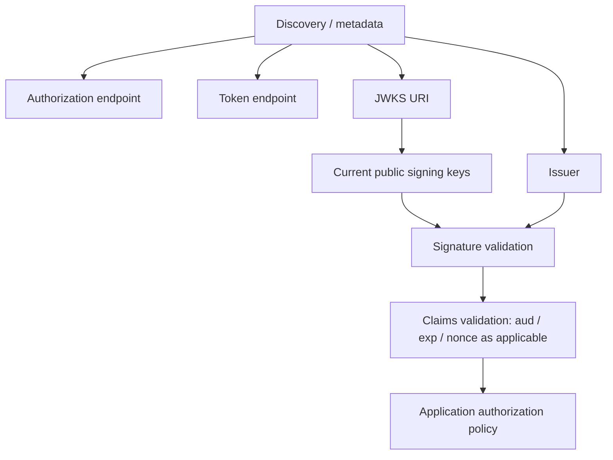

# OAuth 2.0 & OpenID Connect: Trace the Browser Login Flow

## TL;DR

OAuth 2.0 is an **authorization framework**: it lets a client obtain limited authority to call a protected resource. OpenID Connect (OIDC) adds an **identity layer** so a client can learn who authenticated. They are related, but they do not answer the same question.

For browser-based applications, current IETF guidance recommends the **Authorization Code grant with PKCE**. The browser redirects to the authorization server, receives a short-lived authorization code, and exchanges that code using a transaction-specific verifier. A frontend bundle is a **public client**: it cannot keep a client secret confidential.

> 💡 **Rule of thumb:** Trace four things separately: **who authenticated, which client requested access, which resource server the access token is for, and which permissions the token represents**.

- **OAuth is not login by itself.** It delegates access; OIDC adds standardized authentication and the ID Token.
- **ID Token ≠ Access Token.** The ID Token is for the client; the access token is for the resource server.
- **PKCE binds the authorization code to the initiating client instance.**
- **Decode ≠ validate.** Reading JWT JSON proves nothing about its signature, issuer, audience, expiry, or intended use.
- **Fatal pitfall:** Treating “I have a valid token” as “I am authorized for this object.” Business authorization still belongs at the API/resource boundary.

<TermBox term="OAuth Client">
An **OAuth client** is the application requesting delegated access. A browser-only SPA is normally a public client because any credential shipped to the browser can be extracted by the user or attacker controlling that browser.
</TermBox>

## 1. Separate authentication from delegated authorization

Suppose a React application needs to call `api.example.com` on behalf of Alice.

There are two distinct questions:

1. **Authentication:** did an identity provider authenticate Alice?
2. **Authorization delegation:** what authority may this client exercise against the API?

OAuth 2.0 standardizes the second problem. OIDC uses OAuth 2.0 flows and adds identity semantics such as the `openid` scope and an ID Token.

That is why “Sign in with …” often uses OIDC, while a machine asking for an API token may use OAuth without an end-user login.

## 2. Learn the actors before memorizing endpoints

| Role | Mental model |
| --- | --- |
| Resource Owner | Usually the user whose delegated authority is involved |
| Client | The app asking for access |
| Authorization Server | Issues OAuth tokens after authorization |
| OpenID Provider (OP) | Authorization Server speaking OIDC identity semantics |
| Resource Server | API that accepts access tokens |
| Relying Party (RP) | OIDC client relying on the OP's identity assertion |

A single product such as Keycloak can act as the Authorization Server and OpenID Provider. Your API is still a separate Resource Server even when the same team operates both.

## 3. Trace Authorization Code + PKCE end to end

<TermBox term="PKCE">
**Proof Key for Code Exchange (PKCE)** binds an authorization request and its later code exchange with a high-entropy verifier. The client sends a derived `code_challenge` first and proves possession of the original `code_verifier` at the token endpoint.
</TermBox>

The authorization code is intentionally not the access token. It is an intermediate credential with narrow purpose and lifetime.

RFC 9700 requires public clients to use PKCE and recommends it for confidential clients as well. RFC 10017 applies this specifically to modern browser applications.

### Why the frontend does not have a real client secret

If a secret appears in JavaScript sent to arbitrary browsers, it is no longer secret. Minification, environment variables at build time, or hiding it in a bundle do not create confidentiality.

A browser-based client can still have a stable `client_id`. A client identifier is a name, not a password.

## 4. Know which token is for whom

<TermBox term="ID Token">
An **ID Token** is an OIDC security token containing claims about the authenticated subject and authentication event. It is issued for the OIDC client/Relying Party, not as a generic API credential.
</TermBox>

### Access Token

Purpose: authorize a call to a Resource Server.

Think:

> “The API may accept this delegated authority for this audience and scope.”

The access token format is not universally required to be JWT. Treat it as opaque unless your deployment contract explicitly says the resource server validates a JWT access token.

### ID Token

Purpose: let the OIDC client establish an authenticated user identity/session.

Important claims commonly include:

- `iss` — who issued it;
- `sub` — subject identifier within that issuer;
- `aud` — intended client audience;
- `exp` — expiration;
- `iat` — issued-at time;
- `nonce` — transaction binding when used.

Do not send the ID Token to an API merely because it looks like a JWT.

### Refresh Token

Purpose: obtain new access tokens without repeating the full interactive authorization flow.

Refresh tokens carry more durable authority than access tokens and deserve stronger handling. In browser architectures, whether the browser should directly hold one depends on the architecture and authorization server policy.

## 5. Scope, claim, role, and permission are different dimensions

These words often appear next to each other but are not interchangeable.

- **Scope** describes requested/granted access in OAuth terms.
- **Claim** is a piece of data inside a token or UserInfo response.
- **Role** is an application or identity-system grouping used as an input to policy.
- **Permission** is the final authorization decision for an action/resource.

A token may contain a role claim, but the API still decides whether that principal can update `invoice/42`.

## 6. Discovery tells clients where protocol endpoints live

OIDC deployments commonly expose provider metadata from a well-known discovery location. OAuth Authorization Server Metadata similarly publishes fields such as:

- `issuer`;
- `authorization_endpoint`;
- `token_endpoint`;
- `jwks_uri`;
- supported scopes and response/grant capabilities.

Do not hard-code a signing key copied from an admin console when the platform supports JWKS rotation.

## 7. JWT validation is more than Base64 decoding

A resource server validating a JWT access token typically needs to validate the deployment's contract, including:

- signature with an allowed algorithm and trusted key;
- issuer;
- audience/resource indication where applicable;
- expiration and other time constraints;
- token type/profile expectations;
- scopes/claims required for the operation.

The client validating an ID Token follows OIDC-specific validation rules, including issuer and audience checks and transaction binding such as `nonce` when used.

The browser should not invent its own “decode and trust” security model.

## 8. `state`, `nonce`, and PKCE solve different problems

It is tempting to remember all three as “random strings.”

- **PKCE** binds the authorization code to the client instance that initiated the request.
- **`nonce`** binds an OIDC authentication response/ID Token to the initiating transaction.
- **`state`** is commonly used to bind redirect state and protect request/response correlation; deployments must follow their protocol/library guidance rather than cargo-culting one value for every purpose.

Use a mature OAuth/OIDC library instead of hand-assembling security-critical redirect validation.

## 9. Browser architecture changes token exposure

RFC 10017 describes three main browser architectures:

1. **Backend for Frontend (BFF):** the server-side BFF is the OAuth client, keeps tokens away from browser JavaScript, and uses a protected cookie session.
2. **Token-mediating backend:** backend handles OAuth but returns access tokens to the browser for direct API calls.
3. **Browser-based OAuth client:** the browser app handles OAuth directly.

The document presents them in decreasing order of security. A BFF reduces token exposure to injected browser JavaScript, but it also adds a server component, cookie/CSRF responsibilities, and request proxying.

Choose architecture deliberately; do not assume “SPA” automatically means “tokens must live in localStorage.”

## Production micro-scenario: the ID Token reaches the API

A frontend team implements OIDC login and receives both an ID Token and an access token. Because both are JWT-looking strings, an interceptor sends the ID Token in `Authorization: Bearer ...` to the Orders API. The API only checks that the signature comes from the trusted issuer and accepts it.

- **Impact:** A token minted for the frontend client is accepted as an API credential, collapsing the intended audience boundary.
- **Root cause:** The system treated all signed JWTs from the issuer as interchangeable and skipped token-purpose/audience validation.
- **Correct pattern:** Send access tokens to resource servers, validate the API's expected issuer/audience/profile, keep ID Tokens at the OIDC client, and enforce object-level authorization after token validation.

## Check your mental model

> **Scenario:** You paste an access token into jwt.io or a local decoder. The payload shows `sub=alice`, `role=admin`, and an expiry tomorrow. Have you proven Alice is an administrator allowed to delete customer 123?

Show the reasoning

No.

Decoding only reveals untrusted bytes until the token is validated. Even after cryptographic and protocol validation, the role claim is only an input to authorization. The API must still decide whether the validated principal may perform that action on that resource under current policy.

## Frontend-to-API checklist

- [ ] **Protocol:** Is this OAuth, OIDC, or both?
- [ ] **Client type:** Is the browser client correctly treated as public?
- [ ] **Flow:** Does a browser app use Authorization Code + PKCE rather than relying on the legacy Implicit pattern?
- [ ] **Redirects:** Are redirect URIs registered exactly/sufficiently narrowly?
- [ ] **Tokens:** Is the ID Token kept conceptually separate from the access token?
- [ ] **Storage:** Is token exposure to browser JavaScript minimized for the chosen architecture?
- [ ] **Discovery:** Are issuer/endpoints/JWKS obtained from trusted metadata where appropriate?
- [ ] **Validation:** Are signature, issuer, audience, expiry, token purpose, and required claims validated?
- [ ] **Authorization:** Does the API enforce permission on the concrete resource after authentication?
- [ ] **Refresh:** Is refresh-token handling aligned with the browser architecture and threat model?
- [ ] **Logout:** Is local application logout distinguished from identity-provider/session logout?

## Boundaries with related Atlas lessons

- [Authentication & Authorization](/docs/backend-engineering/authentication-and-authorization) owns the broader identity-versus-permission boundary.
- [Single Sign-On & Identity Federation](/docs/backend-engineering/sso-and-identity-federation) explains how multiple applications reuse an authentication context and how OIDC compares with SAML and CAS.
- [Keycloak in Practice](/docs/backend-engineering/keycloak-in-practice) maps these protocol concepts to realms, clients, roles, scopes, and mappers.

## Sources

- [RFC 10017 — OAuth 2.0 for Browser-Based Applications](https://www.rfc-editor.org/rfc/rfc10017.html)
- [RFC 9700 — Best Current Practice for OAuth 2.0 Security](https://www.rfc-editor.org/rfc/rfc9700.html)
- [RFC 7636 — Proof Key for Code Exchange by OAuth Public Clients](https://www.rfc-editor.org/rfc/rfc7636.html)
- [RFC 8414 — OAuth 2.0 Authorization Server Metadata](https://www.rfc-editor.org/rfc/rfc8414.html)
- [OpenID Connect Core 1.0](https://openid.net/specs/openid-connect-core-1_0-18.html)
