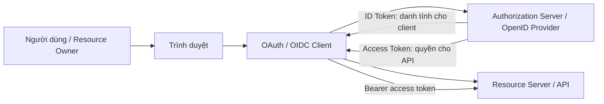
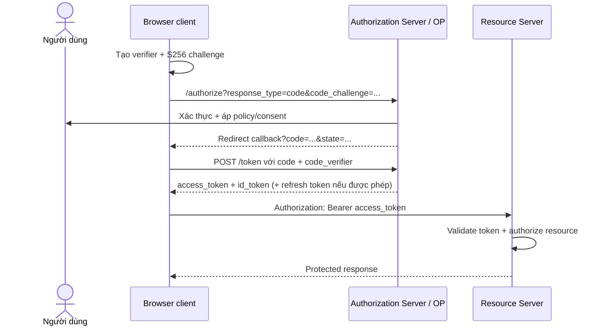
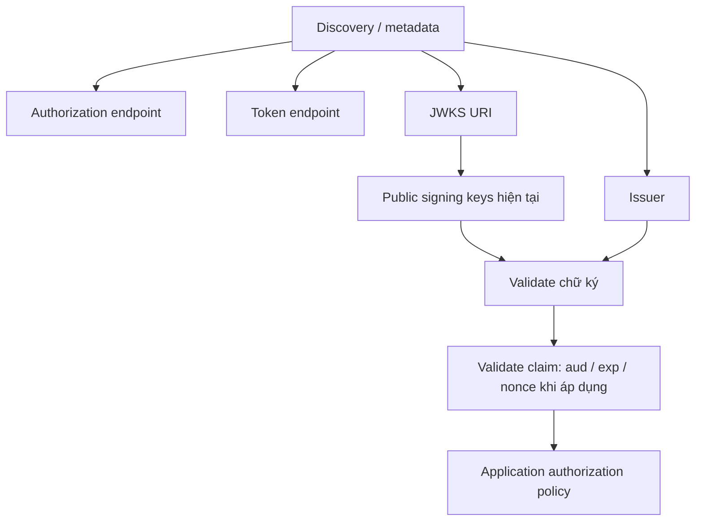

# OAuth 2.0 & OpenID Connect: Lần theo Luồng Đăng nhập Trình duyệt

## Tóm tắt nhanh

OAuth 2.0 là một **framework phân quyền**: nó cho phép một client nhận quyền hạn có giới hạn để gọi tài nguyên được bảo vệ. OpenID Connect (OIDC) bổ sung **lớp danh tính** để client biết ai vừa được xác thực. Hai chuẩn liên quan chặt chẽ nhưng không trả lời cùng một câu hỏi.

Với ứng dụng chạy trên trình duyệt, hướng dẫn IETF hiện hành khuyến nghị **Authorization Code kết hợp PKCE**. Trình duyệt chuyển hướng tới authorization server, nhận một authorization code ngắn hạn rồi đổi code đó bằng verifier riêng cho transaction. Frontend bundle là **public client**: nó không thể giữ client secret một cách bí mật.

> 💡 **Quy tắc bỏ túi:** Luôn tách bốn câu hỏi: **ai đã được xác thực, client nào xin quyền, access token dành cho resource server nào, và token đó đại diện cho quyền hạn gì**.

- **OAuth tự thân không phải giao thức đăng nhập.** Nó ủy quyền truy cập; OIDC bổ sung ngữ nghĩa xác thực và ID Token.
- **ID Token ≠ Access Token.** ID Token dành cho client; access token dành cho resource server.
- **PKCE ràng buộc authorization code với client instance khởi tạo luồng.**
- **Decode ≠ validate.** Đọc được JSON của JWT không chứng minh chữ ký, issuer, audience, expiry hay mục đích sử dụng.
- **Sai lầm chí mạng:** Xem “có token hợp lệ” là “được phép truy cập object này”. Business authorization vẫn phải được thực thi tại API/resource boundary.

<TermBox term="OAuth Client">
**OAuth client** là ứng dụng xin quyền truy cập được ủy quyền. SPA chạy hoàn toàn trong trình duyệt thường là public client vì credential gửi xuống browser có thể bị người dùng hoặc attacker kiểm soát browser trích xuất.
</TermBox>

## 1. Tách xác thực khỏi ủy quyền truy cập

Giả sử một ứng dụng React cần gọi `api.example.com` thay mặt Alice.

Có hai câu hỏi độc lập:

1. **Authentication:** identity provider đã xác thực Alice chưa?
2. **Authorization delegation:** client này được phép thực thi quyền hạn nào đối với API?

OAuth 2.0 chuẩn hóa vấn đề thứ hai. OIDC dùng các flow của OAuth 2.0 rồi thêm ngữ nghĩa danh tính như scope `openid` và ID Token.

Vì vậy “Sign in with …” thường dùng OIDC, còn một workload chỉ cần API token có thể dùng OAuth mà không có đăng nhập người dùng.

## 2. Học các actor trước khi học endpoint

| Vai trò | Mô hình tư duy |
| --- | --- |
| Resource Owner | Thường là người dùng có quyền hạn được ủy quyền |
| Client | Ứng dụng xin quyền truy cập |
| Authorization Server | Cấp OAuth token sau khi đánh giá authorization |
| OpenID Provider (OP) | Authorization Server nói ngữ nghĩa OIDC |
| Resource Server | API nhận access token |
| Relying Party (RP) | OIDC client tin vào identity assertion từ OP |

Một sản phẩm như Keycloak có thể đồng thời là Authorization Server và OpenID Provider. API của bạn vẫn là Resource Server riêng biệt dù cùng một đội vận hành cả hai.

## 3. Lần theo Authorization Code + PKCE từ đầu đến cuối

<TermBox term="PKCE">
**Proof Key for Code Exchange (PKCE)** ràng buộc authorization request với bước đổi code sau đó bằng một verifier có entropy cao. Client gửi `code_challenge` được dẫn xuất trước, rồi chứng minh mình giữ `code_verifier` gốc tại token endpoint.
</TermBox>

Authorization code cố ý không phải access token. Nó là credential trung gian có mục đích và thời hạn hẹp.

RFC 9700 yêu cầu public client dùng PKCE và khuyến nghị confidential client cũng dùng. RFC 10017 áp dụng hướng dẫn này trực tiếp cho ứng dụng trình duyệt hiện đại.

### Vì sao frontend không có client secret thật sự

Nếu secret xuất hiện trong JavaScript gửi xuống browser, nó không còn bí mật. Minify, build-time environment variable hay giấu trong bundle không tạo confidentiality.

Browser client vẫn có thể có `client_id` ổn định. Client identifier là tên định danh, không phải password.

## 4. Biết mỗi token dành cho ai

<TermBox term="ID Token">
**ID Token** là security token của OIDC chứa claim về authenticated subject và authentication event. Nó được cấp cho OIDC client/Relying Party, không phải generic API credential.
</TermBox>

### Access Token

Mục đích: authorize request tới Resource Server.

Hãy nghĩ:

> “API có thể chấp nhận quyền được ủy quyền này cho audience và scope phù hợp.”

Access token không bắt buộc lúc nào cũng là JWT. Hãy xem nó là opaque trừ khi deployment contract của bạn quy định resource server validate JWT access token.

### ID Token

Mục đích: giúp OIDC client thiết lập authenticated identity/session.

Các claim thường quan trọng:

- `iss` — issuer;
- `sub` — subject identifier trong issuer đó;
- `aud` — client audience;
- `exp` — thời điểm hết hạn;
- `iat` — thời điểm phát hành;
- `nonce` — transaction binding khi được dùng.

Đừng gửi ID Token sang API chỉ vì nó trông giống JWT.

### Refresh Token

Mục đích: lấy access token mới mà không cần lặp lại toàn bộ interactive authorization flow.

Refresh token mang quyền hạn bền hơn access token nên cần xử lý nghiêm ngặt hơn. Với browser architecture, việc browser có nên giữ refresh token trực tiếp hay không phụ thuộc kiến trúc và policy của authorization server.

## 5. Scope, claim, role và permission không phải một thứ

Các từ này thường xuất hiện cạnh nhau nhưng không thể thay thế cho nhau.

- **Scope** mô tả quyền truy cập được request/grant theo ngữ nghĩa OAuth.
- **Claim** là một mẩu dữ liệu trong token hoặc UserInfo response.
- **Role** là grouping trong application/identity system dùng làm input cho policy.
- **Permission** là quyết định authorization cuối cùng đối với action/resource.

Token có thể chứa role claim, nhưng API vẫn phải quyết định principal đó có được update `invoice/42` hay không.

## 6. Discovery cho client biết endpoint của protocol nằm ở đâu

OIDC deployment thường publish provider metadata qua well-known discovery location. OAuth Authorization Server Metadata cũng publish các field như:

- `issuer`;
- `authorization_endpoint`;
- `token_endpoint`;
- `jwks_uri`;
- supported scopes và response/grant capabilities.

Đừng hard-code signing key copy từ admin console khi platform hỗ trợ JWKS rotation.

## 7. Validate JWT nhiều hơn Base64 decode

Resource server validate JWT access token thường phải kiểm tra deployment contract, gồm:

- chữ ký với algorithm và trusted key được phép;
- issuer;
- audience/resource indication khi áp dụng;
- expiry và các time constraint;
- token type/profile mà API kỳ vọng;
- scope/claim cần cho operation.

Client validate ID Token phải theo OIDC-specific validation, gồm issuer, audience và transaction binding như `nonce` khi dùng.

Browser không nên tự phát minh mô hình bảo mật “decode rồi tin”.

## 8. `state`, `nonce` và PKCE giải quyết vấn đề khác nhau

Ba giá trị này dễ bị nhớ chung là “random string”, nhưng vai trò khác nhau.

- **PKCE** ràng buộc authorization code với client instance khởi tạo request.
- **`nonce`** ràng buộc OIDC authentication response/ID Token với transaction khởi tạo.
- **`state`** thường dùng để bind redirect state và request/response correlation; hãy theo đúng protocol/library guidance thay vì dùng một giá trị cho mọi mục đích.

Ưu tiên thư viện OAuth/OIDC trưởng thành thay vì tự ghép validation logic cho redirect bảo mật.

## 9. Kiến trúc trình duyệt quyết định mức token exposure

RFC 10017 mô tả ba kiến trúc chính:

1. **Backend for Frontend (BFF):** BFF phía server là OAuth client, giữ token khỏi JavaScript và dùng protected cookie session.
2. **Token-mediating backend:** backend xử lý OAuth nhưng trả access token cho browser để gọi API trực tiếp.
3. **Browser-based OAuth client:** browser app trực tiếp xử lý OAuth.

Tài liệu trình bày chúng theo thứ tự mức bảo mật giảm dần. BFF giảm token exposure với injected browser JavaScript, nhưng thêm server component, cookie/CSRF responsibility và request proxying.

Hãy chọn architecture có chủ đích; đừng mặc định “SPA” đồng nghĩa “token phải nằm trong localStorage”.

## Kịch bản production: ID Token bị gửi sang API

Đội frontend triển khai OIDC login và nhận cả ID Token lẫn access token. Vì cả hai đều trông như JWT, interceptor gửi ID Token trong `Authorization: Bearer ...` tới Orders API. API chỉ kiểm tra chữ ký đến từ trusted issuer rồi chấp nhận.

- **Hậu quả:** Token được mint cho frontend client bị dùng như API credential, làm sụp ranh giới audience.
- **Nguyên nhân cốt lõi:** Hệ thống xem mọi JWT có chữ ký của issuer là tương đương và bỏ qua token purpose/audience validation.
- **Cách khắc phục chuẩn:** Gửi access token tới resource server, validate issuer/audience/profile mà API kỳ vọng, giữ ID Token ở OIDC client và enforce object-level authorization sau token validation.

## Tự kiểm tra mô hình tư duy

> **Kịch bản:** Bạn paste access token vào jwt.io hoặc local decoder. Payload có `sub=alice`, `role=admin` và expiry ngày mai. Điều đó đã chứng minh Alice là administrator được phép xóa customer 123 chưa?

Xem giải thích chi tiết

Chưa.

Decode chỉ hiển thị byte chưa đáng tin cho tới khi token được validate. Kể cả sau khi cryptographic và protocol validation thành công, role claim vẫn chỉ là input cho authorization. API phải tiếp tục quyết định validated principal đó có được thực hiện action trên resource cụ thể theo policy hiện tại hay không.

## Checklist từ frontend tới API

- [ ] **Protocol:** Đây là OAuth, OIDC hay cả hai?
- [ ] **Client type:** Browser client có được xem đúng là public client không?
- [ ] **Flow:** Browser app có dùng Authorization Code + PKCE thay vì dựa vào legacy Implicit pattern không?
- [ ] **Redirects:** Redirect URI có được đăng ký chính xác/đủ hẹp không?
- [ ] **Tokens:** ID Token có được tách khái niệm khỏi access token không?
- [ ] **Storage:** Token exposure với browser JavaScript có được giảm theo architecture đã chọn không?
- [ ] **Discovery:** Issuer/endpoint/JWKS có lấy từ trusted metadata khi phù hợp không?
- [ ] **Validation:** Có validate signature, issuer, audience, expiry, token purpose và required claim không?
- [ ] **Authorization:** API có enforce permission trên resource cụ thể sau authentication không?
- [ ] **Refresh:** Refresh-token handling có khớp browser architecture và threat model không?
- [ ] **Logout:** Local application logout có được tách khỏi identity-provider/session logout không?

## Ranh giới với các bài Atlas liên quan

- [Authentication & Authorization](/vi/docs/backend-engineering/authentication-and-authorization) sở hữu ranh giới tổng quát giữa identity và permission.
- [Single Sign-On & Identity Federation](/vi/docs/backend-engineering/sso-and-identity-federation) giải thích cách nhiều application tái sử dụng authentication context và so sánh OIDC với SAML/CAS.
- [Keycloak Thực chiến](/vi/docs/backend-engineering/keycloak-in-practice) ánh xạ các khái niệm protocol sang realm, client, role, scope và mapper.

## Nguồn tham khảo

- [RFC 10017 — OAuth 2.0 for Browser-Based Applications](https://www.rfc-editor.org/rfc/rfc10017.html)
- [RFC 9700 — Best Current Practice for OAuth 2.0 Security](https://www.rfc-editor.org/rfc/rfc9700.html)
- [RFC 7636 — Proof Key for Code Exchange by OAuth Public Clients](https://www.rfc-editor.org/rfc/rfc7636.html)
- [RFC 8414 — OAuth 2.0 Authorization Server Metadata](https://www.rfc-editor.org/rfc/rfc8414.html)
- [OpenID Connect Core 1.0](https://openid.net/specs/openid-connect-core-1_0-18.html)
