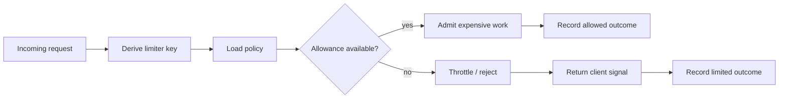
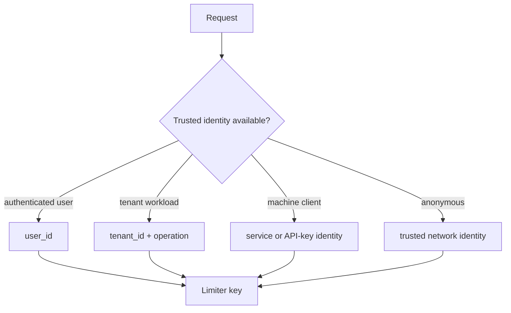

# Rate Limiting: Control Admission, Bursts, and Fairness

## TL;DR

Rate limiting is an **admission policy**: before expensive work starts, the system decides whether this request may consume a constrained resource now.

A useful mental model is:

```text
request
  -> identify the limiter key
  -> choose the applicable policy
  -> consume allowance atomically
  -> admit OR reject/defer
  -> emit evidence for clients and operators
```

The difficult part is rarely counting requests. The difficult part is choosing **what is scarce, who owns the allowance, how bursts behave, where state lives across replicas, and what clients should do after rejection**.



<TermBox term="Rate limit">
A **rate limit** bounds how quickly a subject may consume a protected capability over time.

**Why it matters:** the limit is meaningful only when the subject, resource, time model, and burst behavior are explicit. “100 requests per minute” is incomplete without saying per whom, for which operation, and how short bursts are treated.
</TermBox>

## 1. Start with the protected resource, not the counter

A rate limiter should protect a concrete bottleneck or fairness boundary:

- CPU-heavy report generation;
- a database write path;
- a paid third-party API;
- login attempts;
- tenant-level ingestion capacity;
- outbound email or webhook capacity.

Do not begin with “we need Redis and a counter.” Begin with:

1. **What resource becomes unsafe under excess demand?**
2. **Which caller or tenant should own an allowance?**
3. **What sustained rate can the system support?**
4. **What temporary burst is acceptable?**
5. **Should excess work be rejected, queued, slowed, or degraded?**

If the real bottleneck is “only 20 database writes may run concurrently,” a concurrency limiter may be a better primary control than requests-per-second. If the business rule is “10,000 exports per month,” that is closer to a quota than a burst-sensitive rate limit.

## 2. The limiter key defines fairness

The **rate-limit key** is the identity used to spend allowance. Common choices include:

```text
anonymous endpoint -> client IP or trusted edge identity
user endpoint      -> user_id
multi-tenant API   -> organization_id or tenant_id
machine API        -> API key / service identity
expensive resource -> tenant_id + operation + resource class
```

A bad key creates bad fairness.

- Per-IP limits can punish many legitimate users behind one NAT or proxy.
- Per-user limits can let one organization multiply capacity by creating many users.
- Per-instance limits can accidentally multiply the global allowance by the number of replicas.
- A key derived from an untrusted request header lets callers choose their own bucket.

Derive authenticated keys only after the identity boundary is trustworthy. For anonymous traffic, normalize trusted proxy information rather than blindly accepting arbitrary forwarding headers.



## 3. Rate limit, quota, concurrency, and backpressure are different controls

These controls solve related but different problems:

| Control | Main question | Example |
| --- | --- | --- |
| Rate limit | How quickly may this subject arrive? | 20 writes/second per tenant |
| Quota | How much may this subject consume over a longer budget period? | 100k API calls/month |
| Concurrency limit | How many operations may run at once? | 8 exports per tenant |
| Backpressure | How does the system slow producers when downstream capacity is saturated? | stop pulling more queue messages |

A production system may need more than one. A token bucket may allow short bursts while a concurrency semaphore protects the database from too many simultaneously active requests.

## 4. Choose an algorithm from the behavior you want

### Fixed window

A fixed-window counter is easy to explain:

```text
12:00:00-12:00:59 -> at most 100 requests
12:01:00-12:01:59 -> counter resets
```

Its boundary is coarse. A client can consume most of one window near the end and most of the next immediately afterward, creating a burst larger than the intuitive “100 per minute.”

### Sliding window

A sliding-window strategy estimates or counts activity over a moving interval. It smooths hard boundaries, but exact sliding logs cost more memory and coordination than a simple fixed counter. Approximate sliding counters trade precision for lower overhead.

### Token bucket

<TermBox term="Token bucket">
A **token bucket** refills allowance at a configured rate up to a maximum bucket size. Each admitted operation consumes one or more tokens.

**Why it matters:** refill rate controls sustained throughput while bucket size controls tolerated burst. Those are two separate policy decisions.
</TermBox>

Suppose a bucket refills at 10 tokens/second and holds at most 50 tokens. An idle client can accumulate enough budget for a short burst of 50 requests, then settles toward roughly 10 requests/second while demand continues.

```mermaid
sequenceDiagram
  participant C as Client
  participant L as Token bucket
  participant S as Service

  Note over L: bucket has 3 tokens
  C->>L: request A
  L-->>C: consume token; allowed
  C->>L: request B
  L-->>C: consume token; allowed
  C->>L: request C
  L-->>C: consume token; allowed
  C->>L: request D
  L-->>C: no token; limited
  Note over L: time passes; tokens refill
  C->>L: request E
  L-->>C: token available; allowed
  C->>S: admitted work
```

Do not choose an algorithm because it is fashionable. Choose it because its boundary and burst behavior match the protected resource.

## 5. Cost-aware limits are often more honest than one-request-one-token

Not all requests cost the same.

```text
GET /profile                 cost = 1
POST /reports/preview        cost = 5
POST /reports/full-export    cost = 25
```

A weighted token policy can better reflect scarce CPU, database work, or third-party spend. But cost classes must remain understandable and stable enough for clients and operators to reason about them.

Hierarchical policies are also useful:

```text
global safety ceiling
  -> tenant allowance
      -> user or API-key allowance
          -> expensive-operation allowance
```

The global ceiling protects the service. Tenant limits provide fairness. User or key limits reduce abuse inside a tenant. These layers should not contradict each other silently.

## 6. Distributed replicas change the math

A process-local limiter is safe only when the policy is intentionally process-local.

If ten replicas each enforce “100 requests/second per tenant” independently, the tenant may be admitted at roughly ten times the intended aggregate rate. Adding autoscaling can therefore increase the effective limit exactly when load rises.

For a global or tenant-wide policy, enforcement needs an appropriate coordination model:

- shared atomic state;
- deterministic partitioning so one authority owns a key;
- a dedicated rate-limit service;
- an edge/gateway limiter with a documented consistency model;
- local fast limits combined with a broader shared ceiling.

Distributed enforcement also introduces clock skew, storage latency, partial failure, and contention around hot keys. “Put the counter in Redis” is not the end of the design; the update must still be atomic enough for the chosen algorithm and failure model.

## 7. Rejection is part of the API contract

RFC 6585 defines **429 Too Many Requests** for requests rejected because the user has sent too many requests in a time period. It also allows a `Retry-After` header to tell the client how long to wait.

<TermBox term="Retry-After">
`Retry-After` is an HTTP response field that communicates a minimum delay before a follow-up request. RFC 9110 permits either an HTTP date or a delay in seconds.

**Why it matters:** a client that receives a limit response needs a recovery signal. Blind immediate retries turn admission control into a retry storm.
</TermBox>

A simple response might be:

```http
HTTP/1.1 429 Too Many Requests
Retry-After: 20
Content-Type: application/problem+json
```

Return enough information for a well-behaved client to decide whether to wait, reduce concurrency, or stop the operation.

The IETF HTTPAPI working group also has an active `RateLimit` / `RateLimit-Policy` Internet-Draft. As of 23 May 2026 it is still a **work in progress**, not a finalized RFC. If your API adopts those fields, version and document the contract accordingly rather than presenting draft syntax as timeless standard behavior.

## 8. Decide fail-open vs fail-closed deliberately

The limiter itself can fail.

If shared limiter storage times out, the application needs an explicit policy:

- **fail-open:** admit traffic and risk overload or abuse;
- **fail-closed:** reject traffic and risk unnecessary outage;
- **degrade:** fall back to a conservative local limiter or protect only the most expensive operations.

Security-sensitive endpoints such as login or password-reset attempts may prefer stricter behavior than a low-risk read endpoint. A production design should not hide this choice inside a catch block.

## 9. Production scenario: a local limiter on every replica

Consider a multi-tenant reporting API. Product policy says one tenant should sustain at most 50 expensive exports per second with a small burst. Each application replica stores its own token bucket in memory.

Autoscaling grows the fleet from two replicas to twelve during a traffic spike. Requests are spread across replicas, so the same tenant now spends from twelve independent buckets.

**Impact:** export traffic overwhelms the database and worker pool even though every individual process reports that its local rate limiter is working. Other tenants see high latency and timeouts.

**Root cause:** the intended invariant was tenant-wide, but limiter state was process-local. Horizontal scaling multiplied the effective admission budget.

**Correct pattern:** make the scope explicit. Enforce the tenant-wide ceiling at a shared or deterministically partitioned authority, optionally keep a small local safety limiter for fast protection, and monitor aggregate admitted rate by tenant rather than only per-process counters.

## 10. Observe decisions, not just 429 counts

Useful evidence includes:

- allowed request count and limited request count;
- limiter key class, without exposing secrets or raw credentials;
- policy identifier and configured capacity;
- remaining/burst budget when safe to record;
- wait time or retry delay;
- hot tenants or operations;
- limiter backend latency and error rate;
- fail-open/fail-closed/degraded decisions;
- downstream saturation before and after admission control.

A limiter can be “working” while protecting the wrong resource. Correlate limit decisions with database saturation, queue backlog, worker concurrency, third-party quotas, and user-visible latency.

## 11. Review the whole admission path

Use this reasoning order:

```text
scarce resource
  -> fairness owner
  -> limiter key
  -> sustained rate
  -> burst budget
  -> algorithm
  -> distributed state scope
  -> failure behavior
  -> client signal
  -> observability
```

Skipping directly to “which library?” usually hides the important policy decisions.

## Self-check

A service has eight replicas. Each replica has an in-memory fixed-window limiter of 100 requests/minute keyed by `tenant_id`. Product policy intends a tenant-wide limit of 100 requests/minute.

What is wrong with the design?

<details>
<summary>Show the reasoning</summary>

The key is correct, but the **state scope is wrong**. Each replica owns a separate counter, so one tenant can consume allowance independently on multiple replicas. The fleet can admit far more than the intended aggregate 100 requests/minute, and autoscaling changes the effective policy. The limiter needs a shared or otherwise coordinated authority for a tenant-wide invariant, or the product policy must explicitly be per-replica.

</details>

## Review checklist

- [ ] **Resource:** What scarce dependency or fairness boundary is this limiter protecting?
- [ ] **Key:** Is the limiter key derived from a trusted identity and scoped to the intended owner?
- [ ] **Rate:** Is the sustained admission rate tied to measured capacity or an explicit product policy?
- [ ] **Burst:** Is burst capacity deliberate rather than an accidental algorithm side effect?
- [ ] **Algorithm:** Does fixed window, sliding window, token bucket, or another policy match the desired behavior?
- [ ] **Cost:** Do expensive requests need weighted tokens or separate limits?
- [ ] **Scope:** Does limiter state cover the same replica/tenant/global boundary as the intended invariant?
- [ ] **Concurrency:** Is a concurrency ceiling also needed to protect long-running work?
- [ ] **Failure:** Is fail-open, fail-closed, or degraded behavior explicit when limiter state is unavailable?
- [ ] **Client contract:** Are 429 and retry guidance coherent with the API contract?
- [ ] **Draft fields:** If `RateLimit` headers are used, is their work-in-progress status understood and documented?
- [ ] **Evidence:** Can operators see allowed, limited, degraded, and hot-key behavior without leaking secrets?

## Agent rule

When adding rate limiting, do not start from a counter implementation. First state the protected resource, fairness owner, limiter key, sustained rate, burst budget, distributed state scope, and failure behavior. Then choose the algorithm and client signal that implement those decisions.

## References

- RFC 6585 — Additional HTTP Status Codes, section 4: 429 Too Many Requests.
- RFC 9110 — HTTP Semantics, section 10.2.3: Retry-After.
- IETF HTTPAPI — `draft-ietf-httpapi-ratelimit-headers-11`, 23 May 2026. This is an active Internet-Draft and must be treated as work in progress.
