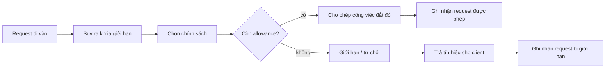
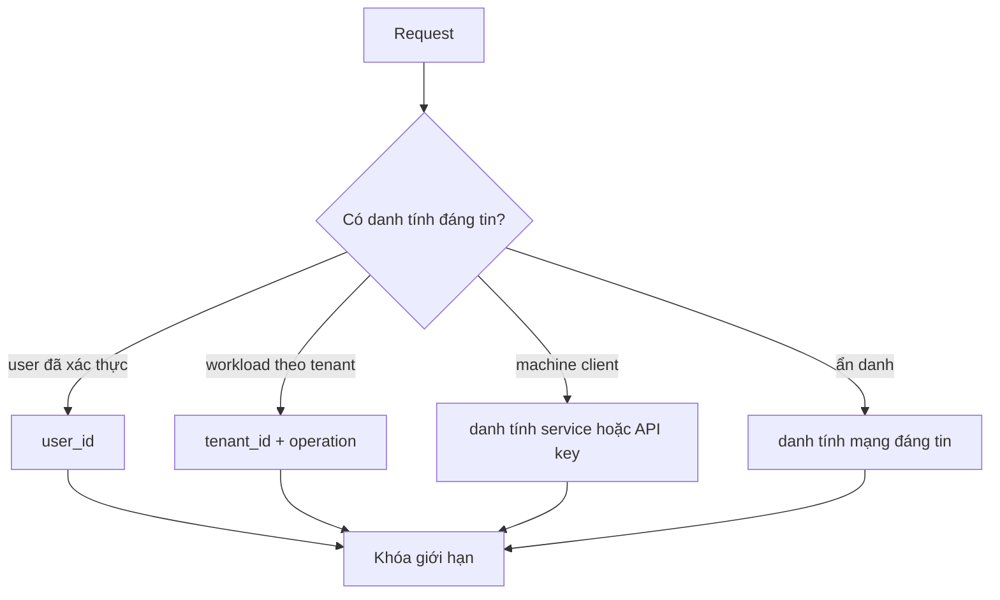

# Giới hạn tốc độ: Kiểm soát tiếp nhận, đột biến và công bằng

## Tóm tắt nhanh

Rate limiting là một **chính sách tiếp nhận**: trước khi công việc đắt đỏ bắt đầu, hệ thống quyết định request này có được phép tiêu thụ tài nguyên hữu hạn ngay lúc này hay không.

Một mô hình tư duy hữu ích:

```text
request
  -> xác định khóa rate limit
  -> chọn chính sách áp dụng
  -> tiêu allowance một cách đủ nguyên tử
  -> cho phép HOẶC từ chối/trì hoãn
  -> phát bằng chứng cho client và vận hành
```

Phần khó hiếm khi là đếm request. Phần khó là xác định **tài nguyên nào đang khan hiếm, ai sở hữu allowance, burst được phép đến đâu, trạng thái nằm ở đâu khi có nhiều replica, và client phải làm gì sau khi bị giới hạn**.



<TermBox term="Rate limit">
**Rate limit** giới hạn tốc độ một chủ thể được phép tiêu thụ một capability được bảo vệ theo thời gian.

**Vì sao quan trọng:** con số chỉ có ý nghĩa khi chủ thể, tài nguyên, mô hình thời gian và hành vi burst đều rõ ràng. “100 request mỗi phút” vẫn chưa đủ nếu chưa nói tính theo ai, cho thao tác nào, và burst ngắn được xử lý ra sao.
</TermBox>

## 1. Bắt đầu từ tài nguyên cần bảo vệ, không phải bộ đếm

Limiter nên bảo vệ một bottleneck hoặc ranh giới công bằng cụ thể:

- sinh báo cáo tốn CPU;
- đường ghi database;
- API bên thứ ba có tính phí;
- số lần thử đăng nhập;
- năng lực ingest theo tenant;
- năng lực gửi email hoặc webhook.

Đừng bắt đầu bằng “cần Redis và một counter”. Hãy bắt đầu bằng:

1. **Tài nguyên nào trở nên không an toàn khi nhu cầu tăng quá mức?**
2. **Caller hoặc tenant nào phải sở hữu allowance?**
3. **Tốc độ duy trì nào hệ thống thực sự chịu được?**
4. **Burst tạm thời nào vẫn chấp nhận được?**
5. **Phần vượt giới hạn nên bị từ chối, xếp hàng, làm chậm hay giảm chất lượng?**

Nếu bottleneck thật sự là “chỉ được có 20 database write chạy đồng thời”, concurrency limiter có thể là control chính phù hợp hơn requests-per-second. Nếu luật sản phẩm là “10.000 export mỗi tháng”, đó gần với quota hơn là một rate limit nhạy với burst.

## 2. Khóa giới hạn quyết định sự công bằng

**Khóa rate limit** là danh tính dùng để tiêu allowance. Các lựa chọn thường gặp:

```text
endpoint ẩn danh    -> IP hoặc danh tính mạng đã được edge tin cậy
endpoint người dùng -> user_id
API multi-tenant    -> organization_id hoặc tenant_id
API máy-máy         -> API key / danh tính service
thao tác đắt đỏ     -> tenant_id + operation + resource class
```

Khóa sai tạo ra công bằng sai.

- Limit theo IP có thể phạt nhiều người dùng hợp lệ cùng đi qua NAT hoặc proxy.
- Limit theo user có thể cho một tổ chức nhân capacity bằng cách tạo thêm nhiều user.
- Limit theo instance có thể vô tình nhân allowance toàn cục theo số replica.
- Khóa lấy từ một request header không đáng tin cho phép caller tự chọn bucket của mình.

Chỉ suy ra khóa đã xác thực sau khi ranh giới danh tính đủ đáng tin. Với traffic ẩn danh, hãy chuẩn hóa thông tin proxy đáng tin thay vì tin mù quáng mọi forwarding header do client gửi lên.



## 3. Rate limit, quota, concurrency và backpressure là các control khác nhau

Chúng liên quan nhưng trả lời các câu hỏi khác nhau:

| Control | Câu hỏi chính | Ví dụ |
| --- | --- | --- |
| Rate limit | Chủ thể này được đi vào nhanh đến mức nào? | 20 write/giây mỗi tenant |
| Quota | Chủ thể này được tiêu bao nhiêu trong một kỳ ngân sách dài hơn? | 100k API call/tháng |
| Concurrency limit | Có bao nhiêu operation được chạy cùng lúc? | 8 export mỗi tenant |
| Backpressure | Khi downstream bão hòa, producer phải chậm lại như thế nào? | tạm ngừng kéo thêm message từ queue |

Một hệ thống production có thể cần nhiều hơn một control. Token bucket có thể cho phép burst ngắn trong khi semaphore concurrency bảo vệ database khỏi quá nhiều request đang chạy đồng thời.

## 4. Chọn thuật toán dựa trên hành vi mong muốn

### Cửa sổ cố định

Fixed window counter dễ hiểu:

```text
12:00:00-12:00:59 -> tối đa 100 request
12:01:00-12:01:59 -> counter reset
```

Nhưng biên cửa sổ khá thô. Client có thể dùng gần hết allowance ở cuối một cửa sổ rồi tiếp tục dùng allowance mới ngay đầu cửa sổ kế tiếp, tạo burst lớn hơn trực giác “100 request mỗi phút”.

### Cửa sổ trượt

Sliding window ước lượng hoặc đếm hoạt động trên một khoảng thời gian luôn dịch chuyển. Nó làm mượt biên cứng, nhưng sliding log chính xác tốn memory và coordination hơn counter đơn giản. Sliding counter gần đúng đổi một phần độ chính xác để giảm overhead.

### Token bucket

<TermBox term="Token bucket">
**Token bucket** nạp lại allowance theo một tốc độ cấu hình cho tới kích thước bucket tối đa. Mỗi operation được phép sẽ tiêu một hoặc nhiều token.

**Vì sao quan trọng:** tốc độ refill quyết định throughput duy trì; kích thước bucket quyết định burst được phép. Đây là hai quyết định chính sách khác nhau.
</TermBox>

Ví dụ bucket nạp 10 token/giây và chứa tối đa 50 token. Một client nhàn rỗi có thể tích đủ ngân sách cho burst ngắn 50 request, sau đó khi tiếp tục có nhu cầu thì tốc độ sẽ tiến gần khoảng 10 request/giây.

```mermaid
sequenceDiagram
  participant C as Client
  participant L as Token bucket
  participant S as Service

  Note over L: bucket có 3 token
  C->>L: request A
  L-->>C: tiêu token; được phép
  C->>L: request B
  L-->>C: tiêu token; được phép
  C->>L: request C
  L-->>C: tiêu token; được phép
  C->>L: request D
  L-->>C: hết token; bị giới hạn
  Note over L: thời gian trôi; token được refill
  C->>L: request E
  L-->>C: có token; được phép
  C->>S: công việc được tiếp nhận
```

Đừng chọn thuật toán vì nó phổ biến. Hãy chọn vì biên và hành vi burst của nó phù hợp với tài nguyên cần bảo vệ.

## 5. Giới hạn theo chi phí thường trung thực hơn “một request = một token”

Không phải request nào cũng tốn như nhau.

```text
GET /profile                 cost = 1
POST /reports/preview        cost = 5
POST /reports/full-export    cost = 25
```

Một policy dùng token có trọng số có thể phản ánh tốt hơn CPU, database work hoặc chi phí bên thứ ba đang khan hiếm. Nhưng các lớp chi phí phải đủ dễ hiểu và ổn định để client lẫn người vận hành lý giải được.

Policy phân tầng cũng hữu ích:

```text
trần an toàn toàn cục
  -> allowance theo tenant
      -> allowance theo user hoặc API key
          -> allowance cho operation đắt đỏ
```

Trần toàn cục bảo vệ service. Limit theo tenant tạo công bằng. Limit theo user hoặc key giảm abuse bên trong một tenant. Các tầng này không nên âm thầm mâu thuẫn nhau.

## 6. Nhiều replica làm thay đổi phép tính

Limiter trong memory của một process chỉ đúng khi policy thực sự là process-local.

Nếu mười replica độc lập cùng thực thi “100 request/giây mỗi tenant”, một tenant có thể được nhận với tốc độ tổng cộng xấp xỉ mười lần mức dự kiến. Autoscaling vì thế có thể vô tình tăng limit hiệu dụng đúng lúc tải đang cao.

Với policy toàn cục hoặc toàn tenant, enforcement cần mô hình coordination phù hợp:

- trạng thái dùng chung với update đủ nguyên tử;
- partition quyết định để một authority sở hữu một key;
- service chuyên trách rate limiting;
- limiter ở edge/gateway có consistency model được mô tả rõ;
- limit cục bộ nhanh kết hợp với một shared ceiling rộng hơn.

Distributed enforcement còn kéo theo clock skew, storage latency, partial failure và contention ở hot key. “Đưa counter vào Redis” chưa kết thúc thiết kế; update vẫn phải đủ nguyên tử cho thuật toán và failure model đã chọn.

## 7. Bị từ chối là một phần của hợp đồng API

RFC 6585 định nghĩa **429 Too Many Requests** cho request bị từ chối vì user đã gửi quá nhiều request trong một khoảng thời gian. RFC này cũng cho phép dùng `Retry-After` để nói client nên đợi bao lâu.

<TermBox term="Retry-After">
`Retry-After` là response field của HTTP dùng để truyền một khoảng chờ tối thiểu trước request tiếp theo. RFC 9110 cho phép giá trị là HTTP date hoặc số giây trì hoãn.

**Vì sao quan trọng:** khi bị rate limit, client cần tín hiệu phục hồi. Retry ngay lập tức và mù quáng sẽ biến admission control thành retry storm.
</TermBox>

Ví dụ response đơn giản:

```http
HTTP/1.1 429 Too Many Requests
Retry-After: 20
Content-Type: application/problem+json
```

Hãy trả đủ thông tin để client cư xử tốt có thể chọn đợi, giảm concurrency hoặc dừng operation.

Nhóm HTTPAPI của IETF hiện cũng có Internet-Draft đang hoạt động cho `RateLimit` / `RateLimit-Policy`. Tính đến 23/05/2026, đây vẫn là **bản nháp đang hoàn thiện**, chưa phải RFC đã hoàn tất. Nếu API sử dụng các field này, hãy version và tài liệu hóa contract thay vì mô tả cú pháp draft như một tiêu chuẩn bất biến.

## 8. Chọn fail-open hay fail-closed có chủ đích

Bản thân limiter cũng có thể lỗi.

Nếu storage dùng chung cho limiter timeout, ứng dụng cần policy rõ ràng:

- **fail-open / mở khi lỗi:** cho traffic đi qua và chấp nhận rủi ro overload hoặc abuse;
- **fail-closed / đóng khi lỗi:** từ chối traffic và chấp nhận rủi ro outage không cần thiết;
- **degrade / suy giảm:** fallback sang limiter local bảo thủ hoặc chỉ bảo vệ những operation đắt nhất.

Endpoint nhạy cảm như login hoặc password reset có thể cần hành vi chặt hơn một endpoint đọc ít rủi ro. Thiết kế production không nên giấu lựa chọn này trong một catch block.

## 9. Kịch bản production: mỗi replica có một limiter local

Xét một API báo cáo multi-tenant. Policy sản phẩm nói một tenant chỉ nên duy trì tối đa 50 export đắt đỏ mỗi giây với một burst nhỏ. Mỗi replica ứng dụng giữ token bucket riêng trong memory.

Khi traffic tăng, autoscaling mở rộng fleet từ hai replica lên mười hai. Request được phân phối qua nhiều replica nên cùng một tenant có thể tiêu từ mười hai bucket độc lập.

**Hậu quả:** traffic export làm database và worker pool quá tải dù từng process riêng lẻ đều báo limiter local đang hoạt động đúng. Các tenant khác gặp latency cao và timeout.

**Nguyên nhân cốt lõi:** invariant mong muốn là toàn tenant, nhưng trạng thái limiter lại process-local. Horizontal scaling đã nhân ngân sách tiếp nhận hiệu dụng.

**Cách khắc phục chuẩn:** làm rõ scope. Thực thi tenant-wide ceiling tại một authority dùng chung hoặc được partition quyết định; có thể giữ thêm một local safety limiter nhỏ để bảo vệ nhanh; đồng thời theo dõi aggregate admitted rate theo tenant chứ không chỉ counter mỗi process.

## 10. Quan sát quyết định, không chỉ đếm 429

Bằng chứng hữu ích gồm:

- số request được phép và số request bị giới hạn;
- lớp limiter key mà không lộ secret hoặc credential thô;
- policy identifier và capacity đã cấu hình;
- remaining/burst budget khi an toàn để ghi;
- thời gian chờ hoặc retry delay;
- tenant hoặc operation nóng;
- latency và error rate của limiter backend;
- quyết định fail-open, fail-closed hoặc degraded;
- mức bão hòa downstream trước và sau admission control.

Một limiter có thể “hoạt động” nhưng bảo vệ sai tài nguyên. Hãy liên hệ quyết định giới hạn với saturation database, queue backlog, worker concurrency, quota bên thứ ba và latency mà user nhìn thấy.

## 11. Review toàn bộ đường tiếp nhận

Thứ tự suy luận nên là:

```text
tài nguyên khan hiếm
  -> chủ thể cần công bằng
  -> khóa giới hạn
  -> tốc độ duy trì
  -> ngân sách burst
  -> thuật toán
  -> scope trạng thái phân tán
  -> hành vi khi limiter lỗi
  -> tín hiệu cho client
  -> observability
```

Nhảy thẳng tới “dùng library nào?” thường che mất những quyết định chính sách quan trọng nhất.

## Tự kiểm tra

Một service có tám replica. Mỗi replica có fixed-window limiter trong memory, giới hạn 100 request/phút theo `tenant_id`. Policy sản phẩm lại muốn giới hạn toàn tenant là 100 request/phút.

Thiết kế sai ở đâu?

<details>
<summary>Xem giải thích chi tiết</summary>

Khóa là đúng nhưng **scope của trạng thái sai**. Mỗi replica có counter riêng nên một tenant có thể tiêu allowance độc lập trên nhiều replica. Cả fleet có thể nhận nhiều hơn đáng kể so với 100 request/phút dự kiến, và autoscaling làm policy hiệu dụng thay đổi. Với invariant toàn tenant, limiter cần authority dùng chung hoặc cơ chế coordination tương đương; nếu không thì policy phải được mô tả rõ là per-replica.

</details>

## Checklist review

- [ ] **Tài nguyên:** Limiter đang bảo vệ dependency khan hiếm hoặc ranh giới công bằng nào?
- [ ] **Khóa:** Khóa rate limit có được suy ra từ danh tính đáng tin và đúng owner không?
- [ ] **Tốc độ:** Sustained rate có gắn với capacity đã đo hoặc product policy rõ ràng không?
- [ ] **Burst:** Burst capacity có chủ đích hay chỉ là tác dụng phụ của thuật toán?
- [ ] **Thuật toán:** Fixed window, sliding window, token bucket hay policy khác có đúng hành vi mong muốn không?
- [ ] **Chi phí:** Request đắt đỏ có cần weighted token hoặc limit riêng không?
- [ ] **Scope:** Trạng thái limiter có cùng ranh giới replica/tenant/global với invariant mong muốn không?
- [ ] **Đồng thời:** Có cần thêm concurrency ceiling để bảo vệ công việc chạy lâu không?
- [ ] **Failure:** Fail-open, fail-closed hay degraded behavior có rõ khi limiter state không truy cập được không?
- [ ] **Client contract:** 429 và retry guidance có nhất quán với API contract không?
- [ ] **Draft field:** Nếu dùng `RateLimit` headers, team có hiểu đây vẫn là work-in-progress không?
- [ ] **Bằng chứng:** Operator có thấy được request được phép, bị giới hạn, degraded và hot key mà không lộ secret không?

## Quy tắc cho agent

Khi thêm rate limiting, không bắt đầu từ implementation của counter. Trước hết phải nêu rõ tài nguyên cần bảo vệ, chủ thể công bằng, khóa limiter, sustained rate, burst budget, scope trạng thái phân tán và hành vi khi limiter lỗi. Sau đó mới chọn thuật toán và tín hiệu client để hiện thực các quyết định đó.

## Tài liệu tham khảo

- RFC 6585 — Additional HTTP Status Codes, mục 4: 429 Too Many Requests.
- RFC 9110 — HTTP Semantics, mục 10.2.3: Retry-After.
- IETF HTTPAPI — `draft-ietf-httpapi-ratelimit-headers-11`, ngày 23/05/2026. Đây là Internet-Draft đang hoạt động và phải được xem là work in progress.
