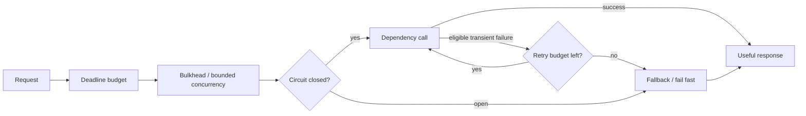
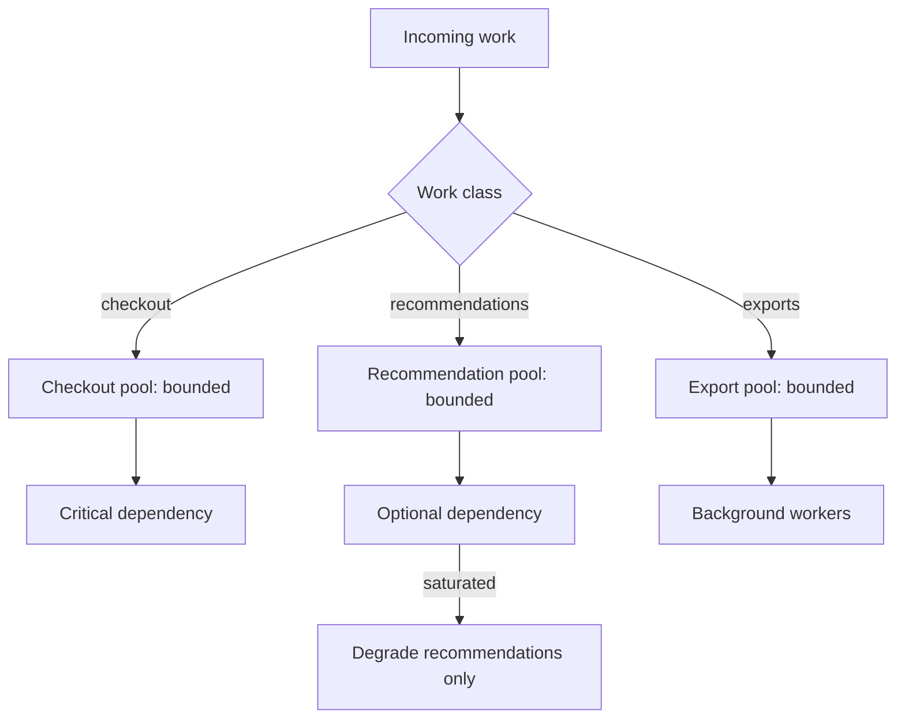
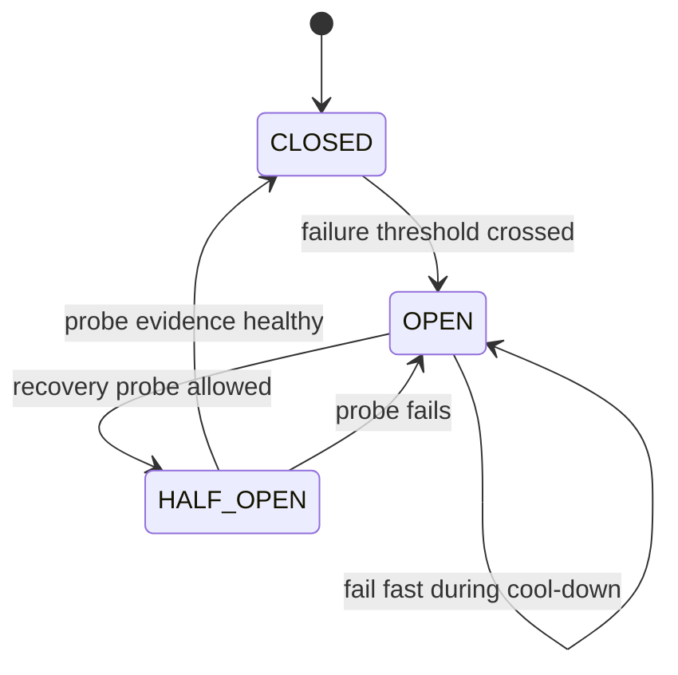

# Service Resilience: Contain Failure Before It Cascades

## TL;DR

A resilient service does not make dependencies stop failing. It prevents one slow, broken, or overloaded dependency from consuming all of the caller's time and resources and turning a local fault into a system-wide outage.

Use this operating sequence:

```text
classify dependency
  -> allocate end-to-end deadline budget
  -> bound concurrency and resource ownership
  -> retry only eligible operations inside a retry budget
  -> stop futile calls with a circuit breaker
  -> shed excess load before saturation
  -> degrade only where correctness permits
  -> observe recovery and remove protection deliberately
```



<TermBox term="Service resilience">
**Service resilience** is the ability to preserve useful, bounded behavior when dependencies are slow, unavailable, overloaded, or partially failing.

**Why it matters:** the dangerous failure is often not the original dependency error. It is the amplification that follows: waiting threads, exhausted connection pools, synchronized retries, queue growth, and cascading timeouts.
</TermBox>

## 1. Start by classifying dependency criticality

Not every downstream dependency deserves the same behavior.

For one request path, classify each call as one of:

- **required for correctness:** without it, the operation cannot truthfully succeed;
- **required but deferrable:** the work must happen, but it can be durably handed off;
- **optional enhancement:** useful when healthy, but the core response remains correct without it;
- **best-effort telemetry:** failure should not block business completion.

Example for a product page:

```text
product database       -> required
inventory reservation  -> required for checkout, not for browse
recommendations        -> optional enhancement
analytics event        -> best effort or durable async handoff
```

This classification controls fallback. Serving cached recommendations may be safe. Inventing cached payment approval is not.

A fallback is a **correctness decision before it is an availability decision**.

## 2. Budget the whole request, not each hop independently

A request with a 2-second user-visible deadline cannot safely give three sequential dependencies two seconds each.

Think in one end-to-end budget:

```text
caller deadline = 2000 ms
  routing + parsing             100 ms
  dependency A                  500 ms
  dependency B                  600 ms
  local work                    300 ms
  response + safety margin      500 ms
```

The exact numbers come from measured latency and product expectations. The rule is that child calls consume the parent's remaining budget.

If only 180 ms remain, starting a dependency call whose healthy p99 is 400 ms is usually dishonest. Fail, degrade, or choose another path before consuming resources for work that cannot finish in time.

<TermBox term="Deadline budget">
A **deadline budget** is the remaining time an operation is allowed to spend before its result is no longer useful to its caller.

**Why it matters:** independent per-hop timeouts can add up beyond the caller's deadline and keep expensive work alive after the request can no longer succeed.
</TermBox>

Propagate cancellation when the runtime and protocol support it. A timeout at the outer HTTP layer does not automatically stop database queries, RPCs, or queued work unless cancellation crosses those boundaries.

## 3. Bound resource ownership with bulkheads

A bulkhead isolates capacity so one dependency or workload cannot consume every worker, connection, thread, socket, or concurrency permit.

Microsoft's current reliability guidance describes the Bulkhead pattern as intentional segmentation that limits a malfunction's blast radius. The concrete primitive can be simpler than the name suggests:

```text
payment dependency pool        max 20 concurrent calls
recommendation dependency pool max 10 concurrent calls
admin exports                  max 4 concurrent jobs
```

If recommendations become slow, their ten permits fill. The service can reject or degrade recommendation calls while preserving payment capacity.

Without isolation:

```text
shared pool = 100
slow optional dependency consumes 100
required dependency waits behind it
whole service appears down
```



The size of each pool should be tied to measured service capacity, downstream limits, and the amount of queuing latency you are willing to tolerate.

## 4. Concurrency limits and rate limits protect different dimensions

Rate limiting bounds **arrival rate**. Bounded concurrency limits how much expensive work is **active at once**.

A dependency may tolerate 500 requests/second when each request finishes in 10 ms, but collapse at the same arrival rate when latency rises to two seconds because in-flight work accumulates.

This is why overload protection often needs both:

```text
admission rate ceiling
+ active concurrency ceiling
+ bounded queue
```

An unbounded queue is not resilience. It converts rejection into latency and memory growth.

When the concurrency pool is full, choose explicitly whether new work should:

- fail fast;
- wait in a small bounded queue;
- be shed by priority;
- move to a durable asynchronous workflow.

## 5. Retry only where it can help, and budget retries globally

The [Timeouts, Retries, and Backoff](/docs/distributed-systems/timeouts-retries-and-backoff) lesson covers retry mechanics in depth. At the service-resilience layer, the important question is **amplification**.

If five service layers each retry three times, one user operation can create far more downstream attempts than the developer who added one retry loop expected.

Use these rules:

1. retry only transient failures with a reasonable chance of recovery;
2. retry only operations that are safe to repeat at their actual effect boundary;
3. prefer one retry owner rather than retries at every layer;
4. use backoff and jitter;
5. bound attempts by the remaining deadline;
6. enforce an aggregate **retry budget** so thousands of concurrent requests cannot each amplify a struggling dependency.

Microsoft's current transient-fault guidance explicitly recommends a retry budget in addition to per-request limits because many individually small retry loops can collectively overload a dependency.

```text
normal downstream traffic  = 1000 calls/min
allowed retry budget       = 100 retry calls/min
budget exhausted           -> fail/degrade instead of adding more retry load
```

A retry budget is a capacity policy, not a guarantee that every request gets another attempt.

## 6. Circuit breakers stop repeated futile calls

<TermBox term="Circuit breaker">
A **circuit breaker** observes recent dependency outcomes and temporarily stops normal calls when failure evidence crosses a configured threshold.

**Why it matters:** failing fast preserves caller time and local resources while giving a damaged dependency room to recover.
</TermBox>

A useful conceptual state machine:



- **CLOSED:** calls flow normally and evidence is collected.
- **OPEN:** normal calls fail fast or use a permitted fallback.
- **HALF_OPEN:** a limited number of probes test recovery.

Do not choose thresholds from folklore. Tune them from dependency traffic volume, latency, error modes, and recovery behavior. A breaker on a low-volume path needs different evidence from one receiving thousands of calls per second.

Also avoid a synchronized recovery stampede. If every replica opens and half-opens at exactly the same moment, probes themselves can overload the recovering dependency. Limit and jitter recovery probes where appropriate.

## 7. A circuit breaker is not a retry mechanism

These patterns solve different problems:

| Pattern | Protects against | Main action |
| --- | --- | --- |
| Timeout/deadline | work taking too long | stop waiting |
| Retry + backoff | transient failure | try again carefully |
| Retry budget | aggregate amplification | cap extra attempts |
| Circuit breaker | persistent dependency failure | stop calling temporarily |
| Bulkhead | resource contagion | isolate capacity |
| Rate/concurrency limit | overload | reject or defer excess work |
| Fallback/degradation | optional dependency loss | preserve a smaller correct service |

Combining them blindly can make behavior worse. For example, a long timeout outside a breaker still ties up callers; a breaker with aggressive retries can continue generating unnecessary load before it opens.

Design one coherent call policy per dependency class.

## 8. Shed load before the service is fully saturated

Overload is a failure mode even when no dependency is technically “down.”

Useful saturation signals include:

- worker/thread/event-loop utilization;
- connection-pool occupancy;
- in-flight request count;
- queue depth and queue age;
- memory pressure;
- dependency latency rising with concurrency;
- rejected or timed-out work.

When evidence says the system cannot finish all admitted work within useful deadlines, **load shedding** preserves useful work by rejecting lower-priority or excess requests early.

Possible policies:

```text
preserve authenticated writes before anonymous expensive reads
preserve checkout before recommendation refresh
reject new report exports before starving interactive traffic
```

Load shedding should happen as close as practical to the admission boundary. Rejecting after consuming the scarce database connection defeats much of the protection.

## 9. Graceful degradation must remain truthful

A degraded response deliberately offers less functionality while preserving correctness.

Safe examples can include:

- omit recommendations;
- serve a bounded-age cached catalog snapshot;
- return partial search facets;
- disable nonessential personalization;
- accept durable async work and expose pending status.

Unsafe examples include:

- treating stale authorization data as permission to mutate sensitive resources;
- showing stale inventory as a confirmed reservation;
- reporting a payment as successful when the provider outcome is unknown;
- silently dropping a required audit event that the business contract requires durably.

For cached fallback, define a **staleness budget**:

```text
catalog description: stale up to 15 min may be acceptable
inventory reservation: stale confirmation is not acceptable
feature configuration: depends on risk class
```

The cache lesson explains freshness mechanics; resilience decides whether stale data is an acceptable degraded truth for this operation.

## 10. Health checks should describe ability to serve, not hide incidents

Readiness and dependency checks are useful when they answer operational questions precisely.

Do not make a service fail readiness merely because one optional dependency is unavailable. That can remove healthy instances and worsen an incident.

Similarly, do not report “healthy” only because the process is alive while all required dependency capacity is exhausted.

Separate concepts such as:

```text
process alive
instance ready for critical traffic
optional dependency degraded
critical dependency unavailable
service shedding load
```

The exact health endpoint design is platform-specific. The principle is to expose state that helps routing and operators make correct decisions without turning a partial failure into fleet-wide churn.

## 11. Production scenario: optional recommendations take down checkout

An e-commerce backend uses one shared outbound HTTP pool for payment, inventory, and recommendations. Recommendations slow from 80 ms to 8 seconds after a downstream incident. Every product and checkout request still calls recommendations synchronously. Each layer retries twice with a fixed short delay.

The shared pool fills with slow recommendation calls. Payment and inventory calls wait for connections. Their callers time out and retry too. Autoscaling adds application replicas, which creates even more downstream connections and retries.

**Impact:** an optional recommendation outage becomes a checkout outage. Latency, timeout rate, connection-pool occupancy, and retry traffic all rise together; the struggling downstream receives more traffic exactly when it has less capacity.

**Root cause:** the request path had no dependency criticality model, no isolated concurrency pool, no aggregate retry budget, and no circuit breaker/fallback policy. Independent retries amplified a local slowdown into cascading failure.

**Correct pattern:** classify recommendations as optional, give them a short slice of the request deadline, isolate them behind bounded concurrency, retry only within a small aggregate budget, open a circuit on sustained failure evidence, and omit or serve bounded-age cached recommendations while preserving payment/inventory capacity. Shed excess optional work before shared resources saturate.

## 12. Operate resilience through evidence

Track resilience controls as first-class behavior, not hidden library internals.

Useful evidence per dependency includes:

- request and dependency latency distributions;
- dependency error and timeout rate;
- active concurrency and pool saturation;
- bounded queue depth and age;
- retry attempts and retry-budget consumption;
- circuit-breaker state transitions and time open;
- fallback/degraded response count;
- load-shed/rejected request count by priority;
- cache age used for degraded responses;
- cancellation propagation failures;
- recovery probes and successful close events.

Correlate these with user-visible SLIs. A breaker opening is not automatically bad: it may be the mechanism preserving checkout success while an optional dependency fails.

## 13. Use a dependency policy sheet

For every important outbound dependency, record a small operating contract:

```text
Dependency: recommendations
Criticality: optional
Caller deadline share: <= 150 ms
Concurrency: max 20 / instance, bounded queue 0
Retry owner: recommendation client
Retries: 1 eligible retry, inside global retry budget
Circuit breaker: yes; threshold based on rolling failure/latency evidence
Fallback: omit block or cached value <= 10 min old
Failure of limiter/breaker store: local fail-safe policy
Signals: latency, errors, saturation, breaker state, degraded count
Runbook: dependency incident link
```

The values are examples, not defaults. What matters is that the behavior is deliberate, reviewable, and testable under failure.

## Self-check

A request has 600 ms remaining. An optional dependency usually takes 300 ms at p99 but is currently timing out at 2 seconds. The client policy allows three retries, each with a 1-second timeout. What should the service do?

<details>
<summary>Show the reasoning</summary>

It should not blindly execute the configured retry policy. The parent deadline makes those attempts unable to complete usefully, and current failure evidence suggests amplification. Because the dependency is optional, a resilience policy should fail fast or use an approved fallback/degraded response, while preserving local capacity. A circuit breaker or retry budget may already make that decision before a network call is attempted.

</details>

## Review checklist

- [ ] **Criticality:** Is each dependency required, deferrable, optional, or best effort for this operation?
- [ ] **Deadline:** Does each child call consume the caller's remaining time budget?
- [ ] **Cancellation:** Does abandoned work stop across boundaries where possible?
- [ ] **Concurrency:** Is active work bounded before a slow dependency exhausts local resources?
- [ ] **Bulkhead:** Can one dependency or workload saturate capacity needed by another critical path?
- [ ] **Queue:** Is waiting bounded, or can latency/memory grow without limit?
- [ ] **Retry ownership:** Is one layer clearly responsible for retries?
- [ ] **Retry budget:** Can aggregate retries exceed a safe fraction of normal dependency traffic?
- [ ] **Idempotency:** Are repeated attempts safe at the actual side-effect boundary?
- [ ] **Circuit breaker:** Are open/half-open/closed behavior and recovery probes explicit?
- [ ] **Overload:** What gets shed first when the service cannot finish all admitted work?
- [ ] **Fallback:** Is degraded data/functionality still truthful for the operation?
- [ ] **Staleness:** Is any cached fallback bounded by a documented freshness budget?
- [ ] **Health:** Do readiness signals distinguish critical inability from optional degradation?
- [ ] **Evidence:** Can operators see dependency latency, saturation, retries, breaker state, shedding, degradation, and recovery?

## Agent rule

When adding resilience to a dependency call, do not stack timeout, retry, circuit breaker, and fallback defaults independently. First classify dependency criticality and end-to-end deadline, then define bounded concurrency, retry ownership/budget, breaker recovery, overload behavior, and the exact correctness boundary of any fallback. Make every protective decision observable.

## References

- Microsoft Azure Well-Architected Framework — reliability design patterns, including Bulkhead and Circuit Breaker.
- Microsoft Azure Architecture Center — transient fault handling and aggregate retry budgets.
- Amazon Builders' Library — Timeouts, retries, and backoff with jitter.
