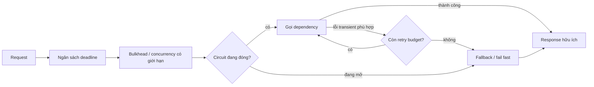
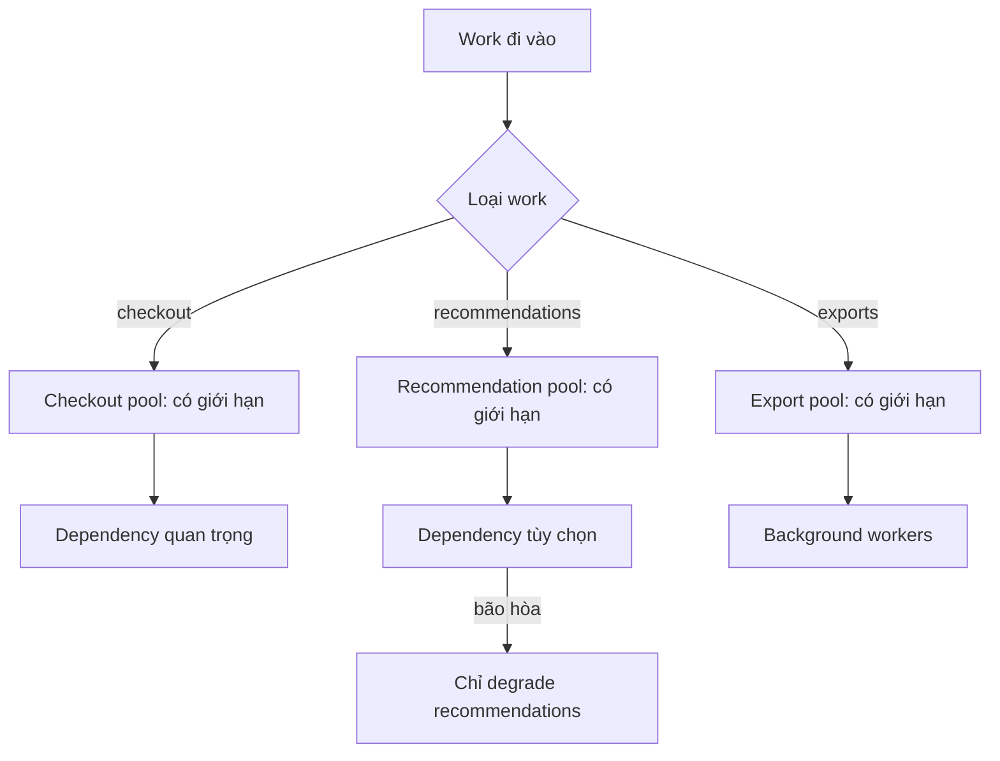
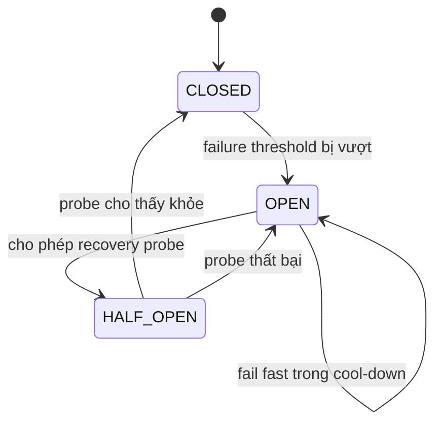

# Khả năng chống chịu của service: Cô lập lỗi trước khi nó lan truyền

## Tóm tắt nhanh

Một service có resilience không làm dependency ngừng lỗi. Nó ngăn một dependency chậm, hỏng hoặc quá tải tiêu hết thời gian và tài nguyên của caller rồi biến lỗi cục bộ thành outage toàn hệ thống.

Dùng trình tự vận hành này:

```text
phân loại dependency
  -> chia end-to-end deadline budget
  -> giới hạn concurrency và quyền sở hữu tài nguyên
  -> chỉ retry lỗi phù hợp trong retry budget
  -> dừng call vô ích bằng circuit breaker
  -> giảm tải trước khi saturation
  -> chỉ degrade khi correctness cho phép
  -> quan sát recovery và gỡ bảo vệ có chủ đích
```



<TermBox term="Service resilience">
**Service resilience** là khả năng giữ hành vi hữu ích và có giới hạn khi dependency chậm, không khả dụng, quá tải hoặc chỉ lỗi một phần.

**Vì sao quan trọng:** failure nguy hiểm thường không phải lỗi dependency ban đầu mà là phần khuếch đại theo sau: thread chờ, connection pool cạn, retry đồng bộ, queue tăng và timeout lan truyền dây chuyền.
</TermBox>

## 1. Bắt đầu bằng việc phân loại mức quan trọng của dependency

Không phải downstream dependency nào cũng cần cùng một policy.

Với mỗi request path, hãy phân loại call thành:

- **bắt buộc cho correctness:** thiếu nó thì operation không thể báo thành công một cách trung thực;
- **bắt buộc nhưng có thể trì hoãn:** công việc phải xảy ra nhưng có thể handoff bền vững;
- **tùy chọn để cải thiện trải nghiệm:** hữu ích khi khỏe nhưng core response vẫn đúng nếu thiếu;
- **telemetry best effort:** failure không nên chặn business completion.

Ví dụ với product page:

```text
product database       -> bắt buộc
inventory reservation  -> bắt buộc cho checkout, không bắt buộc cho browse
recommendations        -> tùy chọn
analytics event        -> best effort hoặc durable async handoff
```

Phân loại này quyết định fallback. Dùng recommendation cache cũ trong giới hạn có thể chấp nhận. Tự bịa payment approval từ cache thì không.

Fallback trước hết là **quyết định correctness**, sau đó mới là quyết định availability.

## 2. Chia ngân sách cho toàn request, không đặt timeout độc lập cho từng hop

Một request có deadline user-visible 2 giây không thể an toàn nếu ba dependency nối tiếp nhau mỗi cái đều được chờ 2 giây.

Hãy tư duy theo một end-to-end budget:

```text
caller deadline = 2000 ms
  routing + parsing             100 ms
  dependency A                  500 ms
  dependency B                  600 ms
  local work                    300 ms
  response + safety margin      500 ms
```

Con số thực tế phải dựa trên latency đo được và kỳ vọng sản phẩm. Quy tắc là child call tiêu phần ngân sách còn lại của parent.

Nếu chỉ còn 180 ms mà healthy p99 của dependency là 400 ms, bắt đầu call thường không trung thực. Hãy fail, degrade hoặc chọn path khác trước khi giữ tài nguyên cho công việc không còn khả năng hoàn tất đúng hạn.

<TermBox term="Deadline budget">
**Deadline budget** là thời gian còn lại mà operation được phép dùng trước khi kết quả không còn hữu ích cho caller.

**Vì sao quan trọng:** per-hop timeout độc lập có thể cộng lại vượt caller deadline và giữ công việc đắt đỏ sống tiếp sau khi request không còn cơ hội thành công.
</TermBox>

Hãy propagate cancellation khi runtime và protocol hỗ trợ. Timeout ở outer HTTP layer không tự động dừng database query, RPC hay queued work nếu cancellation không được truyền qua boundary đó.

## 3. Giới hạn quyền sở hữu tài nguyên bằng bulkhead

Bulkhead cô lập capacity để một dependency hoặc workload không thể tiêu hết worker, connection, thread, socket hay concurrency permit.

Guidance reliability hiện tại của Microsoft mô tả Bulkhead như việc phân đoạn có chủ đích để giới hạn blast radius của malfunction. Primitive cụ thể có thể đơn giản:

```text
payment dependency pool        tối đa 20 call đồng thời
recommendation dependency pool tối đa 10 call đồng thời
admin exports                  tối đa 4 job đồng thời
```

Nếu recommendations chậm, mười permit của nó sẽ đầy. Service có thể reject hoặc degrade recommendation call trong khi vẫn giữ capacity cho payment.

Nếu không cô lập:

```text
shared pool = 100
optional dependency chậm chiếm 100
required dependency phải chờ phía sau
cả service trông như đã down
```



Kích thước pool phải gắn với capacity đo được, downstream limit và lượng queuing latency bạn chấp nhận.

## 4. Concurrency limit và rate limit bảo vệ hai chiều khác nhau

Rate limiting giới hạn **tốc độ request đi vào**. Bounded concurrency giới hạn lượng công việc đắt đỏ **đang active cùng lúc**.

Một dependency có thể chịu 500 request/giây khi mỗi request mất 10 ms nhưng sụp ở cùng arrival rate khi latency tăng lên 2 giây vì số in-flight work tích tụ.

Vì vậy overload protection thường cần cả:

```text
trần tốc độ tiếp nhận
+ trần công việc active đồng thời
+ queue có giới hạn
```

Queue không giới hạn không phải resilience. Nó chỉ đổi rejection thành latency và memory growth.

Khi concurrency pool đầy, phải chọn rõ work mới sẽ:

- fail fast;
- chờ trong queue nhỏ có giới hạn;
- bị shed theo priority;
- chuyển sang durable asynchronous workflow.

## 5. Chỉ retry khi có khả năng giúp, và giới hạn tổng retry

Bài [Timeouts, Retries, and Backoff](/vi/docs/distributed-systems/timeouts-retries-and-backoff) đi sâu vào retry mechanics. Ở lớp service resilience, câu hỏi chính là **amplification**.

Nếu năm service layer đều retry ba lần, một user operation có thể tạo nhiều downstream attempt hơn rất nhiều so với trực giác của người chỉ thêm một retry loop.

Dùng các quy tắc:

1. chỉ retry transient failure có cơ hội phục hồi hợp lý;
2. chỉ retry operation an toàn khi lặp lại tại effect boundary thật;
3. ưu tiên một retry owner thay vì mọi layer cùng retry;
4. dùng backoff và jitter;
5. giới hạn attempt bằng deadline còn lại;
6. áp dụng **retry budget** tổng để hàng nghìn request đồng thời không cùng khuếch đại một dependency đang yếu.

Guidance transient-fault hiện tại của Microsoft khuyến nghị retry budget bên cạnh per-request limit vì nhiều retry loop nhỏ riêng lẻ vẫn có thể cộng lại thành overload lớn.

```text
normal downstream traffic  = 1000 call/phút
allowed retry budget       = 100 retry call/phút
hết budget                  -> fail/degrade thay vì thêm retry load
```

Retry budget là capacity policy, không phải guarantee rằng request nào cũng được thêm một attempt.

## 6. Circuit breaker ngừng các call liên tục vô ích

<TermBox term="Circuit breaker">
**Circuit breaker** quan sát outcome gần đây của dependency rồi tạm dừng normal call khi failure evidence vượt threshold đã định.

**Vì sao quan trọng:** fail fast giữ lại thời gian caller và local resource, đồng thời cho dependency đang hỏng khoảng trống để phục hồi.
</TermBox>

State machine khái niệm:



- **CLOSED / đóng:** call đi bình thường và evidence được thu thập.
- **OPEN / mở:** normal call fail fast hoặc dùng fallback được phép.
- **HALF_OPEN / nửa mở:** chỉ một số probe giới hạn được dùng để kiểm recovery.

Đừng chọn threshold theo folklore. Tune từ traffic volume, latency, error mode và recovery behavior của dependency. Low-volume path cần evidence khác với path có hàng nghìn call mỗi giây.

Cũng tránh recovery stampede đồng bộ. Nếu mọi replica cùng mở rồi half-open đúng một thời điểm, chính probe có thể làm dependency đang phục hồi quá tải. Giới hạn và thêm jitter cho probe khi phù hợp.

## 7. Circuit breaker không phải retry mechanism

Các pattern giải quyết vấn đề khác nhau:

| Pattern | Bảo vệ khỏi | Hành động chính |
| --- | --- | --- |
| Timeout/deadline | work chạy quá lâu | ngừng chờ |
| Retry + backoff | transient failure | thử lại có kiểm soát |
| Retry budget | amplification tổng | chặn attempt dư |
| Circuit breaker | dependency lỗi kéo dài | tạm ngừng gọi |
| Bulkhead | lây nhiễm tài nguyên | cô lập capacity |
| Rate/concurrency limit | overload | reject hoặc defer excess work |
| Fallback/degradation | mất dependency tùy chọn | giữ một service nhỏ hơn nhưng đúng |

Ghép chúng mù quáng có thể làm tình hình tệ hơn. Timeout dài bên ngoài breaker vẫn giữ caller; breaker đi cùng retry quá aggressive vẫn tạo load vô ích trước khi circuit mở.

Mỗi dependency class cần một call policy nhất quán.

## 8. Giảm tải trước khi service bão hòa hoàn toàn

Overload là failure mode kể cả khi không dependency nào thật sự “down”.

Signal saturation hữu ích gồm:

- worker/thread/event-loop utilization;
- connection-pool occupancy;
- số request in-flight;
- queue depth và queue age;
- memory pressure;
- latency dependency tăng cùng concurrency;
- số work bị reject hoặc timeout.

Khi evidence cho thấy hệ thống không thể hoàn tất tất cả work đã nhận trong deadline hữu ích, **load shedding / giảm tải** giữ lại work quan trọng bằng cách reject sớm request thấp ưu tiên hoặc vượt capacity.

Ví dụ policy:

```text
ưu tiên authenticated write hơn anonymous expensive read
ưu tiên checkout hơn recommendation refresh
reject report export mới trước khi interactive traffic bị starvation
```

Nên shed gần admission boundary nhất có thể. Chỉ reject sau khi đã chiếm scarce database connection thì mất phần lớn tác dụng bảo vệ.

## 9. Graceful degradation phải tiếp tục trung thực

Degraded response chủ động cung cấp ít chức năng hơn nhưng vẫn giữ correctness.

Ví dụ có thể an toàn:

- bỏ recommendation;
- dùng catalog snapshot cache cũ trong một giới hạn tuổi rõ ràng;
- trả search facets không đầy đủ;
- tắt personalization không thiết yếu;
- nhận durable async work rồi trả trạng thái pending.

Ví dụ không an toàn:

- dùng authorization data cũ để cho phép mutate resource nhạy cảm;
- hiển thị stale inventory như đã reservation thành công;
- báo payment thành công khi provider outcome chưa rõ;
- âm thầm bỏ required audit event mà contract bắt buộc phải durable.

Với cached fallback, định nghĩa **staleness budget**:

```text
catalog description: cũ tối đa 15 phút có thể chấp nhận
inventory reservation: stale confirmation không chấp nhận
feature configuration: phụ thuộc risk class
```

Bài caching dạy freshness mechanics; resilience quyết định stale data có còn là sự thật chấp nhận được cho operation đang xét hay không.

## 10. Health check phải mô tả khả năng phục vụ, không che incident

Readiness và dependency check hữu ích khi chúng trả lời operational question chính xác.

Đừng làm service fail readiness chỉ vì một optional dependency unavailable. Việc đó có thể loại các instance vẫn khỏe khỏi traffic và làm incident tệ hơn.

Ngược lại, đừng báo “healthy” chỉ vì process còn sống khi mọi capacity cần cho critical dependency đã cạn.

Hãy tách các trạng thái:

```text
process còn sống
instance sẵn sàng cho critical traffic
optional dependency degraded
critical dependency unavailable
service đang shed load
```

Thiết kế health endpoint cụ thể phụ thuộc platform. Nguyên tắc là expose trạng thái đủ để routing và operator quyết định đúng mà không biến partial failure thành fleet-wide churn.

## 11. Kịch bản production: recommendations tùy chọn làm checkout sập

Một backend thương mại điện tử dùng chung outbound HTTP pool cho payment, inventory và recommendations. Sau incident downstream, recommendations chậm từ 80 ms lên 8 giây. Mọi product và checkout request vẫn gọi recommendation đồng bộ. Mỗi layer retry hai lần với delay cố định ngắn.

Shared pool đầy bởi recommendation call chậm. Payment và inventory call phải chờ connection. Caller của chúng timeout rồi retry. Autoscaling thêm app replica, tạo thêm downstream connection và retry load.

**Hậu quả:** outage ở recommendation tùy chọn biến thành checkout outage. Latency, timeout rate, connection-pool occupancy và retry traffic cùng tăng; dependency đang yếu lại nhận thêm traffic đúng lúc capacity giảm.

**Nguyên nhân cốt lõi:** request path không có dependency criticality model, không có concurrency pool cô lập, không có retry budget tổng và không có circuit breaker/fallback policy. Retry độc lập đã khuếch đại slowdown cục bộ thành cascading failure lan truyền dây chuyền.

**Cách khắc phục chuẩn:** phân loại recommendations là tùy chọn, chỉ cấp một phần ngắn của request deadline, cô lập bằng bounded concurrency, chỉ retry trong retry budget nhỏ, mở circuit khi failure evidence kéo dài, rồi bỏ recommendation hoặc phục vụ cache trong staleness budget trong khi giữ capacity cho payment/inventory. Shed optional work trước khi shared resource bão hòa.

## 12. Vận hành resilience bằng bằng chứng

Hãy theo dõi resilience control như hành vi first-class, không phải chi tiết library bị giấu đi.

Signal hữu ích cho mỗi dependency:

- phân bố request và dependency latency;
- dependency error và timeout rate;
- active concurrency và pool saturation;
- bounded queue depth và age;
- retry attempt và mức tiêu retry budget;
- transition trạng thái circuit breaker và thời gian circuit mở;
- số fallback/degraded response;
- số request bị load shed/reject theo priority;
- tuổi cache dùng cho degraded response;
- lỗi cancellation propagation;
- recovery probe và sự kiện đóng circuit thành công.

Hãy correlate với user-visible SLI. Circuit breaker mở không tự động là điều xấu; nó có thể chính là cơ chế giữ checkout success trong khi optional dependency lỗi.

## 13. Dùng dependency policy sheet

Với mỗi outbound dependency quan trọng, ghi một operating contract nhỏ:

```text
Dependency: recommendations
Criticality: tùy chọn
Caller deadline share: <= 150 ms
Concurrency: max 20 / instance, bounded queue 0
Retry owner: recommendation client
Retries: 1 retry phù hợp, nằm trong global retry budget
Circuit breaker: có; threshold dựa trên rolling failure/latency evidence
Fallback: bỏ block hoặc cached value <= 10 phút tuổi
Failure của limiter/breaker store: local fail-safe policy
Signals: latency, lỗi, saturation, breaker state, degraded count
Runbook: link incident dependency
```

Các giá trị chỉ là ví dụ, không phải default. Điều quan trọng là behavior có chủ đích, review được và test được dưới failure.

## Tự kiểm tra

Một request còn 600 ms. Optional dependency thường mất 300 ms ở p99 nhưng hiện đang timeout ở 2 giây. Client policy cho phép ba retry, mỗi retry có timeout 1 giây. Service nên làm gì?

<details>
<summary>Xem giải thích chi tiết</summary>

Không nên mù quáng chạy retry policy đã cấu hình. Parent deadline khiến các attempt đó không thể hoàn tất hữu ích, còn failure evidence hiện tại cho thấy retry sẽ khuếch đại tải. Vì dependency là tùy chọn, resilience policy nên fail fast hoặc dùng fallback/degraded response đã được duyệt, đồng thời giữ local capacity. Circuit breaker hoặc retry budget có thể đưa ra quyết định đó trước khi network call được thực hiện.

</details>

## Checklist review

- [ ] **Mức quan trọng:** Mỗi dependency là bắt buộc, có thể defer, tùy chọn hay best effort cho operation này?
- [ ] **Deadline:** Mỗi child call có tiêu ngân sách thời gian còn lại của caller không?
- [ ] **Cancellation:** Work bị bỏ có được dừng qua boundary khi có thể không?
- [ ] **Concurrency:** Active work có bị giới hạn trước khi dependency chậm làm cạn local resource không?
- [ ] **Bulkhead:** Một dependency/workload có thể bão hòa capacity cần cho critical path khác không?
- [ ] **Queue:** Waiting có bounded hay latency/memory có thể tăng vô hạn?
- [ ] **Retry ownership:** Có một layer chịu trách nhiệm retry rõ ràng không?
- [ ] **Retry budget:** Aggregate retry có thể vượt tỷ lệ an toàn của normal dependency traffic không?
- [ ] **Idempotency:** Attempt lặp lại có an toàn tại actual side-effect boundary không?
- [ ] **Circuit breaker:** Hành vi closed/open/half-open và recovery probe có explicit không?
- [ ] **Overload:** Khi không thể hoàn thành mọi work đã nhận, loại nào bị giảm tải trước?
- [ ] **Fallback:** Data/chức năng degraded có còn trung thực cho operation không?
- [ ] **Staleness:** Cached fallback có freshness budget được tài liệu hóa không?
- [ ] **Health:** Readiness signal có phân biệt critical inability với optional degradation không?
- [ ] **Bằng chứng:** Operator có thấy dependency latency, saturation, retry, breaker state, shedding, degradation và recovery không?

## Quy tắc cho agent

Khi thêm resilience cho dependency call, không chồng timeout, retry, circuit breaker và fallback default một cách độc lập. Trước hết phân loại dependency criticality và end-to-end deadline, sau đó định nghĩa bounded concurrency, retry ownership/budget, breaker recovery, overload behavior và correctness boundary chính xác của fallback. Mọi protective decision phải observable.

## Tài liệu tham khảo

- Microsoft Azure Well-Architected Framework — reliability design patterns, gồm Bulkhead và Circuit Breaker.
- Microsoft Azure Architecture Center — transient fault handling và aggregate retry budget.
- Amazon Builders' Library — Timeouts, retries, and backoff with jitter.
