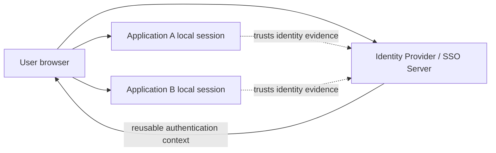
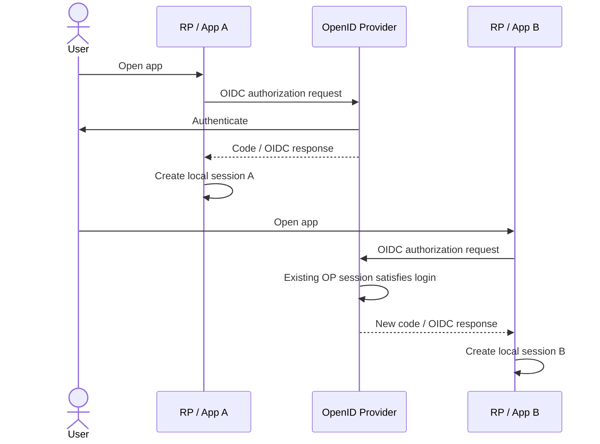
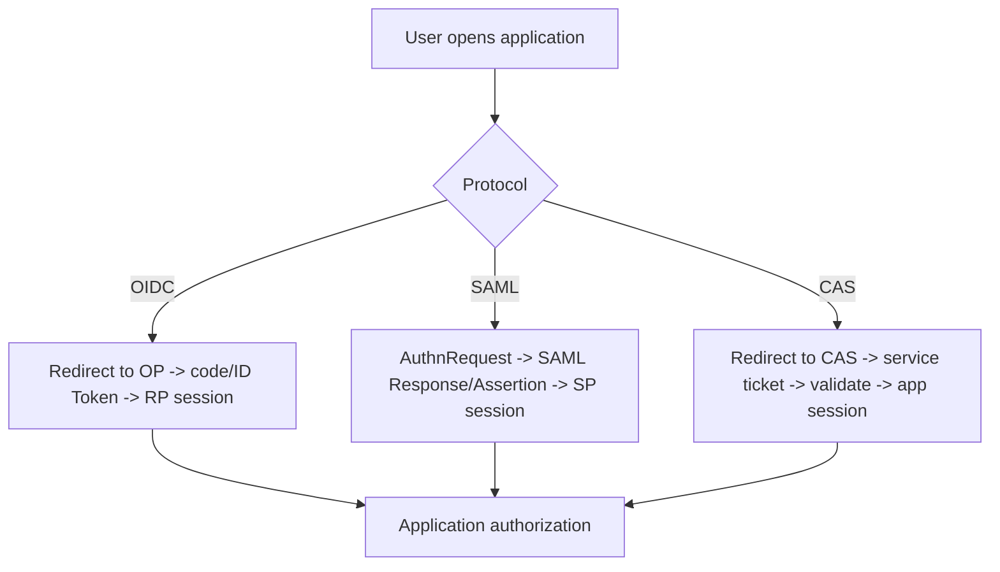
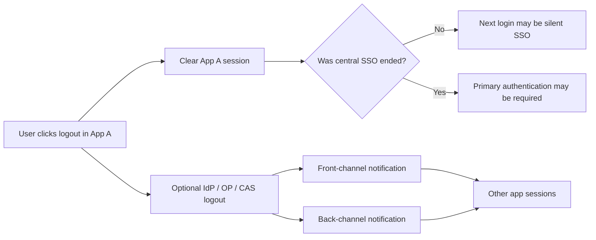

# Single Sign-On & Identity Federation: Sessions, Trust, OIDC, SAML, and CAS

## TL;DR

Single Sign-On (SSO) does not mean every application shares one cookie. It means multiple applications can rely on a reusable authentication context at an identity system, so the user does not need to present primary credentials to each application independently.

Identity federation extends that idea across a trust boundary: one system accepts identity statements produced by another system under an explicit protocol and trust configuration.

> 💡 **Rule of thumb:** When debugging SSO, draw **three separate states**: the user's session at the Identity Provider, the local session at each application, and the protocol artifact used to establish or refresh trust between them.

- **SSO is about authentication reuse, not shared application authorization.**
- **Each application normally keeps its own local session.**
- **OIDC, SAML, and CAS move authentication evidence differently.**
- **Logout is distributed state invalidation, not the reverse of one login redirect.**
- **Fatal pitfall:** Assuming “logged out of app A” means the identity-provider session and app B's session are also gone.

<TermBox term="Single Sign-On">
**Single Sign-On (SSO)** is a user experience and trust pattern in which one authentication context can be reused to establish sessions at multiple participating applications without repeatedly asking for primary credentials.
</TermBox>

## 1. SSO is not one giant session

Imagine two applications:

- `billing.example.com`;
- `support.example.com`.

Both trust the same corporate identity provider.

The browser may hold:

- an IdP/SSO session associated with the identity provider;
- a Billing application session;
- a Support application session.

Those sessions can have different lifetimes, cookie settings, risk policies, and logout behavior.

When the user opens Support for the first time, Support may redirect to the IdP. The IdP sees its existing SSO session, does not ask for credentials again, produces fresh protocol evidence for Support, and sends the browser back. Support then creates its own local session.

That is SSO without sharing Billing's application cookie.

<TermBox term="Identity Federation">
**Identity federation** is a trust arrangement where one security domain accepts identity information produced by another domain according to an agreed protocol, identifiers, keys/certificates, endpoints, and policy.
</TermBox>

## 2. Identity Provider and application roles vary by protocol

<TermBox term="Identity Provider">
An **Identity Provider (IdP)** authenticates subjects and produces identity evidence for relying applications. OIDC calls the identity side an OpenID Provider (OP); SAML commonly uses IdP and Service Provider (SP); CAS uses a central CAS Server and CAS clients/services.
</TermBox>

Protocol vocabulary matters because similar-looking words are not always interchangeable.

| Protocol | Identity side | Application side | Typical evidence |
| --- | --- | --- | --- |
| OIDC | OpenID Provider (OP) | Relying Party (RP) | ID Token plus OAuth artifacts |
| SAML 2.0 | Identity Provider (IdP) | Service Provider (SP) | Signed SAML Response / Assertion |
| CAS | CAS Server | CAS Client / Service | Service Ticket validated with CAS |

## 3. OIDC SSO reuses the OP session

OIDC is built on OAuth 2.0. An RP starts an authorization/authentication request. If the OP already has an acceptable user session, it may satisfy the request without asking the user for primary credentials again.

The RP still validates the OIDC response and normally creates its own application session.

The important point is that App B does not “borrow” App A's session. It establishes its own trust result using the IdP's reusable authentication context.

## 4. SAML Web Browser SSO moves signed assertions

SAML 2.0 is XML-based and commonly used for enterprise federation.

In the Web Browser SSO profile:

1. an SP sends an authentication request or the user starts from the IdP;
2. the IdP authenticates the subject or reuses an IdP security context;
3. the IdP creates a SAML Response containing an assertion;
4. the browser carries the response to the SP's Assertion Consumer Service, commonly through HTTP POST;
5. the SP validates the response/signature and creates a local session;
6. authorization remains an SP/application decision.

Do not reduce SAML to “old OIDC.” The message formats, bindings, metadata, certificate practices, and deployment ecosystems differ.

## 5. CAS uses tickets and central validation

CAS is a web SSO protocol centered on a CAS Server.

A simplified service flow is:

1. the application redirects the browser to CAS `/login?service=...`;
2. CAS authenticates the user or reuses its SSO session;
3. CAS redirects back with a short-lived `ticket`;
4. the application validates the service ticket against CAS;
5. the application creates its own local session.

The CAS server's Ticket Granting Cookie represents the central SSO session. Service Tickets are credentials for a specific service and should be treated according to CAS validation semantics rather than as reusable bearer tokens.

## 6. Federation is a trust configuration, not just a redirect

A redirect only moves the browser. Trust comes from configuration and validation.

Depending on protocol, participating systems need to agree on things such as:

- issuer/entity identifiers;
- registered redirect/consumer/service URLs;
- signing keys or certificates;
- metadata endpoints/documents;
- client/SP/service identifiers;
- allowed algorithms;
- attribute/claim mapping;
- authentication requirements;
- clock/lifetime constraints.

If the receiving application accepts identity evidence from the wrong issuer or for the wrong audience/service, the federation boundary has failed even if the cryptography is valid.

## 7. Identity brokering and user federation are different

These two ideas are often confused in products such as Keycloak.

**Identity brokering:** your identity system delegates authentication to another external IdP (for example, corporate Entra ID via OIDC/SAML) and then issues its own local session/tokens to applications.

**User federation:** your identity system reads or validates users against an external user directory/store such as LDAP or Active Directory.

One connects **identity protocols between IdPs**; the other connects **user/credential stores**.

## 8. SSO does not centralize business authorization

The IdP may supply groups, roles, authentication methods, or attributes. Those are identity/security context inputs.

The application or API still owns questions such as:

- can this employee approve invoice 42?
- can this support agent view tenant A?
- can this user change a production configuration?

A successful SSO login is not a business authorization decision.

## 9. Logout has multiple scopes

“Logout” can mean several different operations:

- destroy one application's local session;
- revoke or expire tokens;
- terminate the IdP/OP/CAS SSO session;
- notify other participating applications to clear their sessions;
- wait for short-lived sessions/tokens to expire.

OIDC defines RP-Initiated Logout plus front-channel and back-channel logout mechanisms. SAML defines Single Logout profiles. CAS can support Single Logout notifications.

These mechanisms have different reliability and deployment characteristics.

## Production micro-scenario: “logout keeps logging me back in”

An employee clicks Logout in a frontend application. The app deletes only its local cookie and redirects to the home page. The next protected route starts OIDC login again. The OpenID Provider still has an active SSO session, so it immediately redirects back with a new authorization response and the app creates a new local session.

- **Impact:** Users believe logout is broken because the application appears to sign them straight back in.
- **Root cause:** The team conflated application-session logout with identity-provider SSO logout.
- **Correct pattern:** Define the intended logout scope explicitly, clear the local session, use the protocol/provider's supported RP/central logout mechanism when global sign-out is required, and design for partial logout propagation.

## Check your mental model

> **Scenario:** App A and App B use the same IdP. You delete App A's cookie. Must App B immediately become logged out?

Show the reasoning

No.

App B has its own local session. Deleting App A's cookie does not delete App B's cookie, and it may not terminate the central IdP session either. Global logout requires an explicit protocol and deployment strategy; even then, front-channel/back-channel notification and application behavior must be implemented correctly.

## SSO & federation review checklist

- [ ] **Sessions:** Have you drawn IdP/SSO session and each application session separately?
- [ ] **Protocol roles:** Are OP/RP, IdP/SP, or CAS Server/client roles named correctly?
- [ ] **Trust:** Are issuer/entity IDs, keys/certificates, endpoints, and audiences/services validated?
- [ ] **URLs:** Are redirect, Assertion Consumer Service, or CAS service URLs narrowly registered?
- [ ] **Mapping:** Are claims/attributes mapped intentionally rather than blindly copied?
- [ ] **Authorization:** Does the application still make resource-level permission decisions?
- [ ] **Lifetime:** Are application and IdP session lifetimes deliberately different or aligned?
- [ ] **Step-up:** Can sensitive actions require stronger/recent authentication when necessary?
- [ ] **Logout scope:** Is local logout distinguished from central/global logout?
- [ ] **Failure:** What happens if logout notification cannot reach one application?
- [ ] **Brokering:** Is external-IdP brokering distinguished from LDAP/user federation?
- [ ] **Observability:** Can support teams identify which session/protocol step failed?

## Boundaries with related Atlas lessons

- [OAuth 2.0 & OpenID Connect](/docs/backend-engineering/oauth-and-oidc) explains the OIDC/OAuth browser flow and token boundaries.
- [Authentication & Authorization](/docs/backend-engineering/authentication-and-authorization) owns the broader principal and permission model.
- [Keycloak in Practice](/docs/backend-engineering/keycloak-in-practice) maps federation and SSO concepts to a concrete identity platform.

## Sources

- [OpenID Connect Core 1.0](https://openid.net/specs/openid-connect-core-1_0-18.html)
- [OpenID Connect Logout Specifications](https://openid.net/wg/connect/specifications/)
- [OASIS — SAML 2.0 Technical Overview](https://docs.oasis-open.org/security/saml/Post2.0/sstc-saml-tech-overview-2.0.html)
- [Apereo CAS — CAS Protocol 3.0 Specification](https://apereo.github.io/cas/development/protocol/CAS-Protocol-Specification.html)
