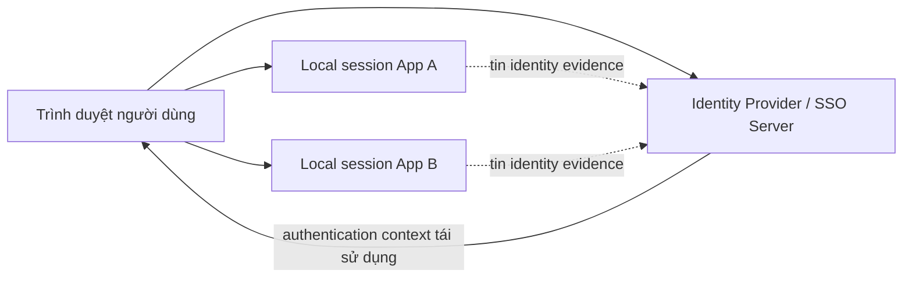
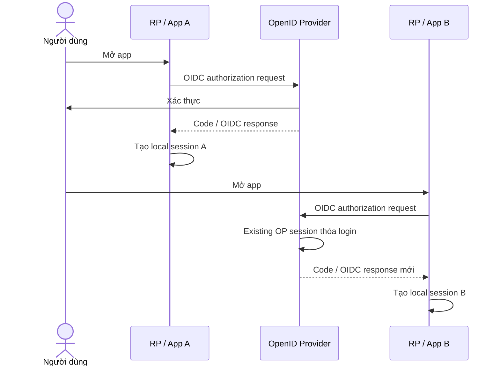
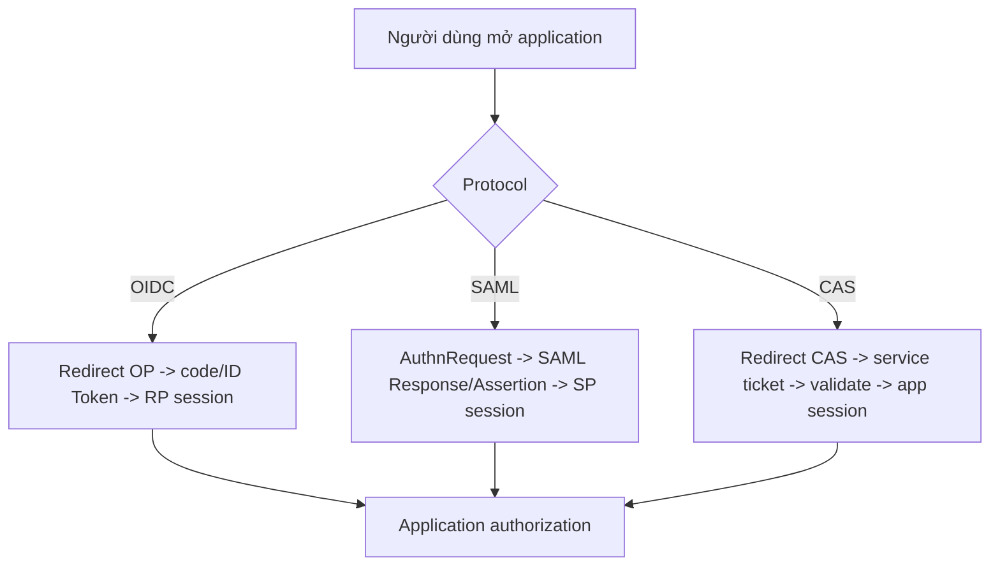
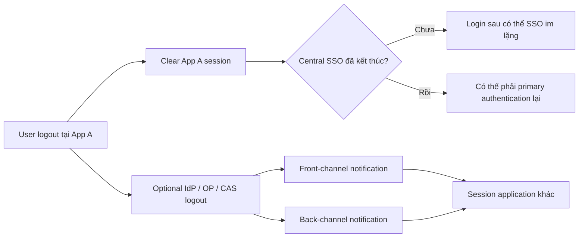

# Đăng nhập Một lần & Liên kết Danh tính: Session, Trust, OIDC, SAML và CAS

## Tóm tắt nhanh

Single Sign-On (SSO) không có nghĩa mọi application chia sẻ một cookie. Nó có nghĩa nhiều application có thể tin vào authentication context có thể tái sử dụng tại identity system, nhờ đó người dùng không cần nhập primary credential riêng cho từng application.

Identity federation mở rộng ý tưởng đó qua trust boundary: một hệ thống chấp nhận identity statement do hệ thống khác phát hành theo protocol và trust configuration rõ ràng.

> 💡 **Quy tắc bỏ túi:** Khi debug SSO, hãy vẽ **ba state riêng**: session của người dùng tại Identity Provider, local session của từng application, và protocol artifact dùng để thiết lập hoặc làm mới trust giữa chúng.

- **SSO tái sử dụng authentication, không chia sẻ business authorization.**
- **Mỗi application thông thường vẫn giữ local session riêng.**
- **OIDC, SAML và CAS truyền authentication evidence theo cách khác nhau.**
- **Logout là bài toán distributed state invalidation, không đơn giản là “đảo ngược login redirect”.**
- **Sai lầm chí mạng:** Giả định “logout App A” đồng nghĩa IdP session và App B session cũng biến mất.

<TermBox term="Single Sign-On">
**Single Sign-On (SSO)** là trải nghiệm và trust pattern cho phép một authentication context được tái sử dụng để thiết lập session ở nhiều application tham gia mà không liên tục hỏi lại primary credential.
</TermBox>

## 1. SSO không phải một session khổng lồ

Giả sử có hai application:

- `billing.example.com`;
- `support.example.com`.

Cả hai cùng tin corporate identity provider.

Browser có thể đồng thời giữ:

- IdP/SSO session gắn với identity provider;
- Billing application session;
- Support application session.

Các session có thể có lifetime, cookie setting, risk policy và logout behavior khác nhau.

Khi người dùng mở Support lần đầu, Support redirect tới IdP. IdP thấy SSO session hiện hữu, không hỏi lại credential, tạo protocol evidence mới cho Support rồi redirect browser về. Support sau đó tạo local session riêng.

Đó là SSO mà không chia sẻ application cookie của Billing.

<TermBox term="Identity Federation">
**Identity federation** là trust arrangement trong đó một security domain chấp nhận identity information do domain khác phát hành theo protocol, identifier, key/certificate, endpoint và policy đã thống nhất.
</TermBox>

## 2. Vai trò Identity Provider và application thay đổi theo protocol

<TermBox term="Identity Provider">
**Identity Provider (IdP)** xác thực subject và phát hành identity evidence cho relying application. OIDC gọi phía identity là OpenID Provider (OP); SAML thường dùng IdP và Service Provider (SP); CAS dùng central CAS Server cùng CAS client/service.
</TermBox>

Dùng đúng vocabulary của protocol giúp tránh nhầm mental model.

| Protocol | Phía identity | Phía application | Evidence điển hình |
| --- | --- | --- | --- |
| OIDC | OpenID Provider (OP) | Relying Party (RP) | ID Token cùng OAuth artifact |
| SAML 2.0 | Identity Provider (IdP) | Service Provider (SP) | Signed SAML Response / Assertion |
| CAS | CAS Server | CAS Client / Service | Service Ticket được validate với CAS |

## 3. OIDC SSO tái sử dụng OP session

OIDC xây trên OAuth 2.0. RP khởi tạo authorization/authentication request. Nếu OP đã có user session đáp ứng policy, OP có thể hoàn thành request mà không yêu cầu user nhập primary credential lần nữa.

RP vẫn phải validate OIDC response và thông thường tạo application session riêng.

Điểm quan trọng: App B không “mượn” session của App A. Nó thiết lập trust result riêng bằng authentication context có thể tái sử dụng ở IdP.

## 4. SAML Web Browser SSO truyền signed assertion

SAML 2.0 dựa trên XML và rất phổ biến trong enterprise federation.

Trong Web Browser SSO profile:

1. SP gửi authentication request hoặc user bắt đầu từ IdP;
2. IdP xác thực subject hoặc tái sử dụng IdP security context;
3. IdP tạo SAML Response chứa assertion;
4. browser chuyển response tới Assertion Consumer Service của SP, thường bằng HTTP POST;
5. SP validate response/signature rồi tạo local session;
6. authorization vẫn là quyết định của SP/application.

Đừng đơn giản hóa SAML thành “OIDC cũ”. Message format, binding, metadata, certificate practice và deployment ecosystem khác nhau.

## 5. CAS dùng ticket và central validation

CAS là web SSO protocol xoay quanh CAS Server.

Một service flow đơn giản:

1. application redirect browser tới CAS `/login?service=...`;
2. CAS xác thực user hoặc tái sử dụng SSO session;
3. CAS redirect về với `ticket` ngắn hạn;
4. application validate service ticket với CAS;
5. application tạo local session riêng.

Ticket Granting Cookie ở CAS server đại diện central SSO session. Service Ticket là credential cho một service cụ thể và phải theo semantics validate của CAS, không phải reusable bearer token chung.

## 6. Federation là trust configuration, không chỉ là redirect

Redirect chỉ di chuyển browser. Trust đến từ configuration và validation.

Tùy protocol, các hệ thống cần thống nhất các yếu tố như:

- issuer/entity identifier;
- registered redirect/consumer/service URL;
- signing key hoặc certificate;
- metadata endpoint/document;
- client/SP/service identifier;
- allowed algorithm;
- attribute/claim mapping;
- authentication requirement;
- clock/lifetime constraint.

Nếu receiving application chấp nhận identity evidence từ sai issuer hoặc cho sai audience/service thì federation boundary đã hỏng dù cryptography hợp lệ.

## 7. Identity brokering khác user federation

Hai ý tưởng này thường bị lẫn trong sản phẩm như Keycloak.

**Identity brokering:** identity system của bạn delegate authentication sang external IdP khác, ví dụ corporate Entra ID qua OIDC/SAML, sau đó phát local session/token của mình cho application.

**User federation:** identity system đọc hoặc validate user qua external user directory/store như LDAP hoặc Active Directory.

Một bên nối **identity protocol giữa các IdP**; bên kia nối **user/credential store**.

## 8. SSO không gom business authorization về một chỗ

IdP có thể cung cấp group, role, authentication method hoặc attribute. Đây là input về identity/security context.

Application hoặc API vẫn sở hữu câu hỏi:

- employee này có được approve invoice 42 không?
- support agent này có được xem tenant A không?
- user này có được thay production configuration không?

SSO login thành công không phải business authorization decision.

## 9. Logout có nhiều phạm vi

“Logout” có thể nghĩa là:

- hủy local session của một application;
- revoke hoặc expire token;
- terminate IdP/OP/CAS SSO session;
- notify application khác để clear session;
- chờ short-lived session/token hết hạn.

OIDC định nghĩa RP-Initiated Logout cùng front-channel/back-channel logout. SAML định nghĩa Single Logout profile. CAS có thể hỗ trợ Single Logout notification.

Các cơ chế này có reliability và deployment characteristic khác nhau.

## Kịch bản production: “logout xong lại tự đăng nhập”

Nhân viên bấm Logout trong frontend application. App chỉ xóa local cookie rồi redirect về home. Protected route tiếp theo khởi động OIDC login lại. OpenID Provider vẫn còn active SSO session nên ngay lập tức redirect trở lại với authorization response mới và app tạo local session mới.

- **Hậu quả:** User nghĩ logout bị hỏng vì application có vẻ đăng nhập lại ngay.
- **Nguyên nhân cốt lõi:** Team đánh đồng application-session logout với identity-provider SSO logout.
- **Cách khắc phục chuẩn:** Định nghĩa rõ logout scope, clear local session, dùng RP/central logout mechanism mà protocol/provider hỗ trợ khi cần global sign-out và thiết kế cho trường hợp logout propagation chỉ thành công một phần.

## Tự kiểm tra mô hình tư duy

> **Kịch bản:** App A và App B dùng cùng IdP. Bạn xóa cookie của App A. App B có bắt buộc logout ngay không?

Xem giải thích chi tiết

Không.

App B giữ local session riêng. Xóa cookie App A không xóa cookie App B và cũng có thể không terminate central IdP session. Global logout cần protocol và deployment strategy rõ ràng; ngay cả khi có, front-channel/back-channel notification và behavior từng application vẫn phải được triển khai đúng.

## Checklist SSO & federation

- [ ] **Sessions:** Bạn đã vẽ riêng IdP/SSO session và session từng application chưa?
- [ ] **Protocol roles:** OP/RP, IdP/SP hoặc CAS Server/client có được gọi đúng không?
- [ ] **Trust:** Issuer/entity ID, key/certificate, endpoint và audience/service có được validate không?
- [ ] **URLs:** Redirect, Assertion Consumer Service hoặc CAS service URL có được đăng ký đủ hẹp không?
- [ ] **Mapping:** Claim/attribute có được map có chủ đích thay vì copy mù quáng không?
- [ ] **Authorization:** Application vẫn tự quyết định resource-level permission chứ?
- [ ] **Lifetime:** Application session và IdP session lifetime có được chọn có chủ đích không?
- [ ] **Step-up:** Sensitive action có thể yêu cầu stronger/recent authentication khi cần không?
- [ ] **Logout scope:** Local logout có được tách khỏi central/global logout không?
- [ ] **Failure:** Điều gì xảy ra nếu logout notification không tới được một application?
- [ ] **Brokering:** External-IdP brokering có được tách khỏi LDAP/user federation không?
- [ ] **Observability:** Support team có xác định được session/protocol step nào lỗi không?

## Ranh giới với các bài Atlas liên quan

- [OAuth 2.0 & OpenID Connect](/vi/docs/backend-engineering/oauth-and-oidc) giải thích browser flow và token boundary của OIDC/OAuth.
- [Authentication & Authorization](/vi/docs/backend-engineering/authentication-and-authorization) sở hữu principal và permission model tổng quát.
- [Keycloak Thực chiến](/vi/docs/backend-engineering/keycloak-in-practice) ánh xạ federation và SSO sang một identity platform cụ thể.

## Nguồn tham khảo

- [OpenID Connect Core 1.0](https://openid.net/specs/openid-connect-core-1_0-18.html)
- [OpenID Connect Logout Specifications](https://openid.net/wg/connect/specifications/)
- [OASIS — SAML 2.0 Technical Overview](https://docs.oasis-open.org/security/saml/Post2.0/sstc-saml-tech-overview-2.0.html)
- [Apereo CAS — CAS Protocol 3.0 Specification](https://apereo.github.io/cas/development/protocol/CAS-Protocol-Specification.html)
