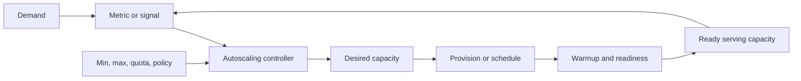
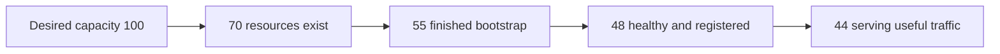
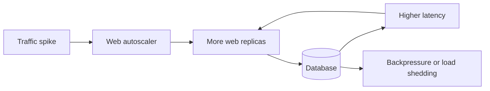

# Autoscaling: Reason About Signals, Feedback Loops, and Capacity Delays

## TL;DR

During Slack's January 4, 2021 outage, network degradation made web-tier threads spend more time waiting for backends. CPU utilization fell, and that lower CPU signal initially caused automated **downscaling even though serving capacity was becoming less adequate**. Soon afterward, worker-thread utilization drove a very large scale-up, but Slack's provisioning service hit its own resource bottlenecks and an AWS quota; many requested instances were not ready to serve, and the web tier remained under-capacity. Slack attempted to add about 1,200 servers between 7:01am and 7:15am PST.

> 💡 **Rule of thumb:** Treat autoscaling as a delayed feedback loop: **demand → signal → scaling decision → requested capacity → provisioning/warmup → ready serving capacity → new signal**. Tune the loop around the system's real bottleneck and delays, not around a metric that merely looks convenient.

- **Autoscaling is control theory in production:** A useful scaler needs a signal, target or threshold, min/max bounds, evaluation period, rate limits, and delayed feedback from newly added or removed capacity.
- **Metric choice determines what the scaler believes:** CPU, requests per target, concurrency, backlog per worker, and queue age answer different questions. A metric that falls when the system is blocked can command the exact opposite of what capacity needs.
- **Desired capacity is not serving capacity:** Launching ten VMs or requesting fifty Pods does not mean they are healthy, registered behind the load balancer, finished warming caches, or able to reach dependencies.
- **Scale-out and scale-in should be asymmetric:** Availability usually needs fast, bounded scale-out and slower, stabilized scale-in with tolerance or hysteresis so transient dips do not create flapping.
- **Fatal pitfall:** Scaling one tier aggressively while ignoring the next bottleneck. More web servers, workers, or Pods can multiply database connections, queue fetches, API calls, and retries until the downstream system collapses faster.

<TermBox term="Feedback Loop">
A **feedback loop** observes the system, computes an action, waits for that action to change the system, then observes again. Autoscaling is stable only when the signal, action size, delay, and evaluation window are compatible with one another.
</TermBox>

## Autoscaling is a delayed control loop

A scaler usually performs this cycle:

1. observe a metric or signal;
2. compare it with a target or threshold;
3. calculate desired capacity;
4. clamp that result to minimum and maximum limits;
5. request scale-out or scale-in;
6. wait for capacity to provision and warm up;
7. observe the changed system again.

Every stage can fail or lag.

The metric can be delayed or misleading. The capacity API can reject a request. New instances can fail bootstrap. Pods can remain Pending. Targets can exist but fail readiness. A downstream dependency can become the next bottleneck before the newly scaled tier helps.

This is why autoscaling is not a magic capacity switch.

## Separate desired capacity from serving capacity

Teams often collapse several different numbers into one:

- **requested capacity:** what the platform is trying to maintain now;
- **desired capacity:** what the controller wants after this evaluation;
- **actual capacity:** instances, Pods, or workers that physically exist;
- **ready serving capacity:** capacity that is healthy, Ready, registered, and able to do useful work.

If desired capacity rises from 50 to 100 but ready capacity stays at 52, the scaling decision happened but the system did not gain the capacity users need.

Track these stages separately.

## Minimum and maximum bounds are correctness controls

A minimum protects against cold starts, baseline traffic, transient metric outages, and the inability to scale from zero fast enough.

A maximum protects against runaway cost, broken metrics, downstream overload, quota exhaustion, and feedback loops.

But maximum capacity is also an availability ceiling.

Slack's outage showed a subtle version of this: many broken or not-yet-serving instances still consumed autoscaling-group capacity and contributed to hitting configured size limits.

Choose min and max from measured startup delay, demand, downstream safety, cost, and provider quota—not from round numbers.

## Choose metrics that move with demand per capacity unit

For target tracking, a useful metric is often **proportional to demand per unit of capacity**.

<TermBox term="Capacity-Proportional Metric">
A **capacity-proportional metric** changes predictably as capacity changes while demand stays constant. Per-instance throughput, average utilization, concurrency per worker, and backlog per worker are common examples.
</TermBox>

Suppose 100 instances handle 10,000 requests per second. That is 100 requests per second per instance.

If the target is 80 requests per second per instance, adding capacity should lower the signal and removing capacity should raise it.

That relationship makes a feedback loop easier to reason about.

## CPU utilization is useful only when CPU represents the bottleneck

CPU is common because nearly every platform exposes it.

It works well when work is CPU-bound enough that:

- more demand raises CPU;
- more capacity lowers CPU per instance;
- waiting on dependencies does not dominate.

It becomes misleading when threads spend most of their time waiting on network, storage, locks, or databases.

Slack's 2021 incident is the canonical warning: degraded networking caused threads to wait longer, CPU fell, and the CPU signal initially triggered scale-in while the web tier was becoming less able to serve traffic.

Low CPU does not necessarily mean spare capacity.

## Throughput and concurrency often model web pressure better

Useful signals can include:

- requests per instance;
- requests per load-balancer target;
- operations per worker;
- in-flight requests;
- active connections;
- worker-thread utilization;
- concurrent executions.

Normalize them when possible:

- request rate per target;
- concurrency per ready instance;
- busy workers divided by total worker slots.

AWS target tracking supports signals such as average CPU and Application Load Balancer request count per target.

The question is not whether CPU or request rate is universally better. The question is which signal tracks the first real saturation point in your architecture.

## Queue workers should reason about backlog, arrival rate, and service rate

For asynchronous workers, CPU can be a weak signal.

Queue evidence is more direct:

- queue length or backlog;
- backlog per worker;
- arrival rate;
- processing or service rate;
- queue age or oldest-message age.

A simple relationship is:

~~~text
desired workers ≈ backlog / target backlog per worker
~~~

But backlog alone is incomplete.

Ten thousand 50-millisecond jobs and ten thousand 5-minute jobs represent radically different capacity needs.

If incoming work arrives at 500 jobs per second and one worker safely processes 10 jobs per second, more than 50 workers are required merely to stop backlog growth.

## Queue age connects scaling to an SLO

Raw queue length does not tell you how long a user has waited.

**Queue age** or **oldest-message age** answers that question directly.

For a pipeline with a 60-second processing SLO:

- backlog per worker helps capacity math;
- oldest-message age reveals whether users are approaching the SLO boundary.

Use both when possible.

## Target tracking behaves like a thermostat

A target-tracking controller tries to keep a signal near an operating target.

Conceptually:

~~~text
desired capacity ≈ current capacity × current metric / target metric
~~~

Exact formulas and safety adjustments differ by platform.

AWS explicitly describes target tracking as thermostat-like behavior.

Kubernetes HPA similarly computes desired replicas from a ratio between current and target metrics, then applies tolerance and behavior rules.

The benefit is expressing a steady operating target.

The danger is that a bad metric produces confidently wrong decisions.

## Stabilization prevents the controller from fighting itself

<TermBox term="Flapping">
**Flapping** is repeated scale-out and scale-in caused by a controller reacting too quickly to metric noise or to the effect of its own previous action.
</TermBox>

Several mechanisms damp the loop:

### Tolerance or hysteresis

Ignore small deviations around the target.

Kubernetes HPA supports tolerance so minor variations do not continuously change replica counts.

### Stabilization window

Keep recent recommendations in mind before scaling down.

Kubernetes HPA uses downscale stabilization, and Google Compute Engine autoscaling has a configurable scale-in stabilization period.

### Cooldown

Delay a rule from firing again after a scale action.

Azure Monitor Autoscale evaluates cooldown on individual rules. AWS has cooldown semantics as well, although AWS recommends target tracking or step scaling over older simple-scaling patterns.

The names differ, but the goal is the same: give the previous action enough time to affect reality.

## Scale out faster than you scale in

Availability-oriented systems often need asymmetric behavior:

~~~text
scale out faster
scale in slower and more conservatively
~~~

Scale-out costs money but preserves optional capacity.

Scale-in removes margin and can terminate sessions, jobs, or warm caches and can instantly raise utilization on survivors.

AWS target tracking is intentionally availability-biased: scale-out can happen when any applicable target-tracking policy needs it, while scale-in requires relevant policies to agree.

Conservative scale-in is control-loop damping, not waste.

## Warmup and initialization delay must match reality

A VM or Pod can exist before it can serve useful traffic.

Warmup can include:

- boot;
- image pull;
- package or configuration bootstrap;
- runtime initialization;
- cache warming;
- model loading;
- secret retrieval;
- dependency connections;
- service registration;
- readiness checks.

AWS target tracking uses instance warmup semantics.

Google Compute Engine calls this the **initialization period** and recommends measuring the real time from instance start until the application is ready.

If warmup is configured too short, a scaler can count unusable capacity and stop scaling too early.

Measure startup under realistic load.

## Provisioning can become the bottleneck

Correct scaling intent can still fail during execution.

Provisioning depends on:

- provider quota or account limit;
- regional capacity;
- subnet IP space;
- image registry throughput;
- bootstrap systems;
- configuration and secret services;
- DNS;
- service discovery;
- load-balancer registration;
- node scheduling.

Slack's scale-up hit both a Linux open-files bottleneck in its provisioning service and an AWS quota while trying to add a large number of hosts under degraded networking.

Monitor failed launch and provisioning events as first-class autoscaling evidence.

## Load balancer readiness is part of scaling latency

Capacity is useful only when traffic can reach it safely.

After an instance or Pod exists, it may still need to:

- pass health checks;
- pass readiness;
- register behind a load balancer;
- warm caches;
- join service discovery;
- become eligible for routing.

Use [Load Balancing](/docs/cloud-infrastructure/load-balancing) to reason about health, readiness, warming, draining, and registration delays.

Autoscaling latency should be measured to **ready serving capacity**, not to resource creation.

## Scale-in is a termination problem

Before removing capacity, ask:

- Is it serving requests?
- Does it own long-running jobs?
- Does it hold sticky sessions?
- Is there local-only state?
- Can it drain queue work?
- Will the load balancer stop new traffic first?
- Is there enough termination grace?
- Which instance should be removed?

A worker running a 45-minute non-checkpointed job cannot be treated like an idle stateless HTTP replica.

## Reactive scaling cannot outrun startup physics

Suppose traffic doubles in 30 seconds but a new instance needs 8 minutes to become Ready.

Reactive scaling cannot prevent the first 8 minutes of overload.

Options include:

- more minimum capacity;
- more headroom at the target;
- faster startup;
- pre-warmed pools;
- scheduled scaling;
- predictive scaling;
- durable queues;
- graceful degradation or load shedding.

This is a timing constraint, not a tuning bug.

## Scheduled and predictive scaling solve different timing problems

**Reactive scaling** responds after a signal changes.

**Scheduled scaling** raises capacity before known events such as office hours, batch windows, ticket sales, or predictable holiday transitions.

Slack's postmortem says the team planned preemptive Transit Gateway upscaling before the next post-holiday traffic jump.

**Predictive scaling** uses historical patterns or forecasts to provision ahead of expected demand.

Google Compute Engine predictive autoscaling uses initialization time so capacity can arrive before the predicted load.

Predictions do not replace reactive correction. One-off viral traffic and incident-generated load can violate the forecast.

## Scale-to-zero is an extreme minimum-capacity choice

Scale-to-zero reduces idle cost but creates explicit trade-offs:

- no warm capacity;
- cold start or startup latency for the first work;
- the signal must exist even with zero replicas;
- the control plane must be able to create the first capacity;
- sudden bursts may queue before capacity arrives.

Queue workers and serverless workloads often tolerate this better than latency-sensitive synchronous services.

Use [Serverless Compute](/docs/cloud-infrastructure/serverless-compute) for provider-managed scale-to-zero semantics.

## Scaling one tier can overload the next tier

Capacity is a chain.

Imagine:

~~~text
20 web instances × 20 DB connections = 400 possible DB connections
~~~

Scale the web tier to 100 instances and the same configuration permits 2,000 database connections.

If the database safely handles 600, web autoscaling amplified the bottleneck.

Protect downstream systems with:

- bounded connection pools;
- concurrency limits;
- queues;
- backpressure;
- load shedding;
- rate limits;
- circuit breakers;
- independent downstream scaling where safe.

More frontend capacity is not free capacity for every dependency.

## Queue scaling can amplify the same bottleneck

Suppose each worker opens 10 database connections and processes five jobs concurrently.

Scaling from 20 to 200 workers creates up to:

- 2,000 database connections;
- 1,000 concurrent jobs.

If the database is the bottleneck, backlog-driven scale-out can worsen latency and retries.

Set worker maximum capacity from **downstream safe concurrency**, not only compute budget.

Backpressure matters: a growing backlog means arrival rate exceeds effective service rate somewhere. It does not mean workers can increase without bound.

## Kubernetes contains multiple autoscaling loops

### HorizontalPodAutoscaler

The **HorizontalPodAutoscaler (HPA)** changes desired replica count using resource, custom, or external metrics.

With multiple metrics, Kubernetes calculates desired replicas for each and selects the largest recommendation.

HPA can request more Pods than the cluster can schedule.

### Node or cluster autoscaling

A **Cluster Autoscaler**-style or node-pool autoscaler adds node capacity when Pods are unschedulable.

A common chain is:

~~~text
traffic rises
→ HPA requests more Pods
→ Pods remain Pending
→ node autoscaler adds Nodes
→ Nodes boot
→ Pods schedule and start
→ readiness passes
→ Service receives more endpoints
~~~

Each stage adds delay.

### Vertical Pod Autoscaler

**Vertical Pod Autoscaler (VPA)** or vertical scaling changes resource sizing rather than primarily replica count.

Horizontal and vertical loops solve different dimensions and can interact if both depend on utilization.

Use [Kubernetes Fundamentals](/docs/cloud-infrastructure/kubernetes-fundamentals) for requests, limits, Pending Pods, scheduling, and readiness.

## One autoscaler can destabilize another

Nested loops are common:

- HPA scales Pods;
- node autoscaler scales Nodes;
- database autoscaler scales compute;
- queue autoscaler scales workers;
- managed network services scale internally.

A possible unstable sequence is:

1. HPA creates more Pods.
2. Pods stay Pending.
3. Node autoscaler requests Nodes.
4. HPA asks for even more Pods before Nodes arrive.
5. Capacity arrives in a large burst.
6. Utilization drops sharply.
7. Fast scale-in removes too much.
8. The next demand pulse repeats the cycle.

Observe the full timeline, not each controller independently.

## Provider-specific behavior differs

| Platform | Common model | Important semantics |
| --- | --- | --- |
| **AWS EC2 Auto Scaling** | target tracking, step, scheduled and predictive options | instance warmup, availability-biased target tracking, min/max bounds, failed launch activities |
| **Google Cloud Compute Engine autoscaler** | CPU, load-balancing, custom metrics, schedules, predictive CPU scaling | initialization period, scale-in stabilization period, min/max instances |
| **Azure Monitor Autoscale** | metric rules and profiles | rule-specific cooldown, min/max/default capacity, flapping prevention |
| **Kubernetes HPA** | resource, custom, or external metrics | tolerance, scale-up/down behavior, downscale stabilization, readiness and missing-metric handling |

The shared mental model transfers, but exact timing is **provider-specific / platform-specific**.

Do not copy a generic "five-minute cooldown" across controllers without reading that platform's semantics.

## Observability must include scaling decisions

Track three classes of evidence.

### Demand and saturation

- request rate;
- CPU or memory when relevant;
- concurrency;
- backlog;
- queue age;
- latency and errors;
- downstream saturation.

### Capacity

- min and max;
- desired capacity;
- actual capacity;
- warming capacity;
- Ready or healthy capacity;
- registered load-balancer targets;
- Pending Pods.

### Control actions

- scale recommendation;
- scale-out and scale-in events;
- triggering metric;
- stabilization or cooldown state;
- launch failure;
- quota failure;
- termination and draining.

Without action history, a graph tells you what changed, not why the controller changed it.

## Production micro-scenario: queue autoscaling overwhelms the database

An order queue normally has 20 workers. Each worker processes five jobs concurrently and holds a 10-connection database pool. A partner import adds 500,000 jobs, so backlog per worker crosses the autoscaling target. The scaler requests 200 workers. They become Ready successfully, but together they can create up to 2,000 database connections and 1,000 concurrent transactions. Database latency spikes, worker throughput falls, jobs time out and retry, and backlog grows faster.

- **Impact:** Queue age and customer processing latency rise even though worker count grows 10×; database saturation and retries make recovery slower.
- **Root cause:** The team scaled on queue backlog without modeling the downstream bottleneck. Worker max capacity came from compute budget instead of safe database concurrency.
- **Correct pattern:** Derive worker max and concurrency from downstream capacity, bound connection pools, use backlog together with oldest-message age and processing rate, apply backpressure or load shedding, scale the database independently only when safe, and observe newly Ready capacity before another large scaling step.

## Check your mental model

> **Scenario:** Traffic doubles. HPA moves desired replicas from 20 to 60 within seconds, but error rate remains high for six minutes. An engineer concludes autoscaling worked and the application simply needs more than 60 replicas.

Show the reasoning

Desired replicas prove only that the HPA decision happened.

Follow the capacity chain:

1. How many Pods were actually created?
2. How many are Pending because the cluster lacks Nodes?
3. Did node autoscaling add capacity?
4. How long did Nodes take to launch?
5. How long did image pull and application startup take?
6. How many Pods became Ready?
7. Did the Service or load balancer register them?
8. Did a database or API become the next bottleneck?

If desired is 60 but Ready is 24, raising HPA max may only create more Pending Pods.

If Ready is 60 but the database is saturated, adding Pods can worsen the incident.

The user-facing unit is **ready useful serving capacity**, not requested replica count.

## Autoscaling reasoning checklist

- [ ] **Demand:** What real workload arrives—requests, bytes, jobs, or concurrent sessions?
- [ ] **Signal:** Does the metric track demand per capacity unit and change predictably when capacity changes?
- [ ] **Target:** Is the target derived from measured saturation and headroom rather than an arbitrary percentage?
- [ ] **Bounds:** Are minimum and maximum capacity justified by startup delay, cost, quota, and downstream safety?
- [ ] **Warmup:** How long from scale request until capacity is actually Ready and useful?
- [ ] **Stabilization:** Are tolerance, cooldown, stabilization, and scaling velocity tuned to avoid flapping?
- [ ] **Asymmetry:** Can scale-out react quickly while scale-in remains conservative and drain-safe?
- [ ] **Provisioning:** Are quota, network, image, bootstrap, secret, registry, and failed launch paths observable?
- [ ] **Serving capacity:** Do dashboards distinguish desired, actual, healthy, Ready, and traffic-serving capacity?
- [ ] **Queue semantics:** Are backlog, arrival rate, service rate, and oldest-message age considered together?
- [ ] **Downstream:** Which database, API, cache, or queue limit tightens when this tier scales out?
- [ ] **Backpressure:** What happens when downstream capacity cannot increase?
- [ ] **Scale-in:** Can active requests, sessions, or jobs drain before termination?
- [ ] **Known peaks:** Should scheduled or predictive capacity arrive before demand?
- [ ] **Kubernetes loops:** Are HPA and node-autoscaling delays understood separately?
- [ ] **Evidence:** Can operators see each scaling decision, failure, and resulting Ready capacity?

## Boundary with Load Balancing, Kubernetes, and Infrastructure as Code

Use [Load Balancing](/docs/cloud-infrastructure/load-balancing) for health, readiness, registration, warming, draining, and traffic admission.

Use [Kubernetes Fundamentals](/docs/cloud-infrastructure/kubernetes-fundamentals) for Pod scheduling, requests and limits, readiness, Services, and Pending Pods.

Use [Infrastructure as Code](/docs/cloud-infrastructure/infrastructure-as-code) to declare min/max bounds, scaling policies, node groups, metrics, IAM, and other durable configuration.

Autoscaling itself is the runtime reasoning problem:

**Given delayed observations of demand and capacity, how should the system change capacity without oscillating, arriving too late, or overwhelming the next bottleneck?**

## Sources

- [Slack Engineering — Slack's Outage on January 4th 2021](https://slack.engineering/slacks-outage-on-january-4th-2021/)
- [AWS — Target tracking scaling policies for Amazon EC2 Auto Scaling](https://docs.aws.amazon.com/autoscaling/ec2/userguide/as-scaling-target-tracking.html)
- [AWS — Scaling cooldowns for Amazon EC2 Auto Scaling](https://docs.aws.amazon.com/autoscaling/ec2/userguide/ec2-auto-scaling-scaling-cooldowns.html)
- [AWS — Auto Scaling event reference](https://docs.aws.amazon.com/autoscaling/ec2/userguide/ec2-auto-scaling-event-reference.html)
- [Google Cloud — Autoscaling groups of instances](https://cloud.google.com/compute/docs/autoscaler)
- [Google Cloud — Manage autoscalers](https://cloud.google.com/compute/docs/autoscaler/managing-autoscalers)
- [Azure Monitor — Understand autoscale settings](https://learn.microsoft.com/en-us/azure/azure-monitor/autoscale/autoscale-understanding-settings)
- [Azure Monitor — Get started with autoscale](https://learn.microsoft.com/en-us/azure/azure-monitor/autoscale/autoscale-get-started)
- [Kubernetes — Horizontal Pod Autoscaling](https://kubernetes.io/docs/concepts/workloads/autoscaling/horizontal-pod-autoscale/)
- [Kubernetes — HorizontalPodAutoscaler v2 API](https://kubernetes.io/docs/reference/kubernetes-api/autoscaling/horizontal-pod-autoscaler-v2/)

## Related lessons

- [Load Balancing](/docs/cloud-infrastructure/load-balancing)
- [Kubernetes Fundamentals](/docs/cloud-infrastructure/kubernetes-fundamentals)
- [Infrastructure as Code](/docs/cloud-infrastructure/infrastructure-as-code)
- [Service Resilience](/docs/backend-engineering/service-resilience)
