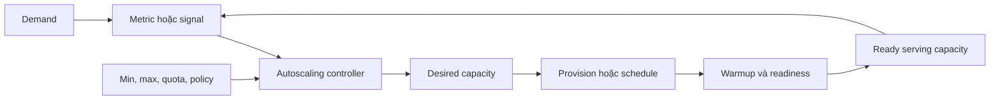
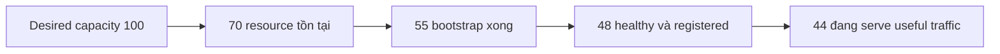
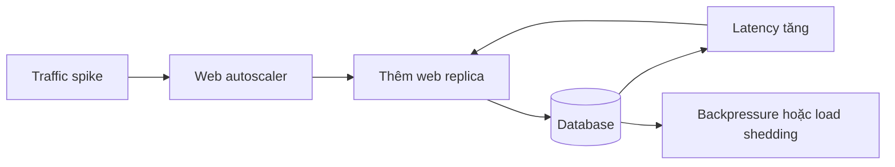

# Autoscaling: Suy luận Tín hiệu, Feedback Loop và Độ trễ Capacity

## TL;DR

Trong outage Slack ngày 04 tháng 01 năm 2021, network degradation làm thread ở web tier dành nhiều thời gian chờ backend hơn. CPU utilization giảm, và tín hiệu CPU thấp đó ban đầu khiến automation **scale down dù serving capacity đang ngày càng thiếu**. Ngay sau đó worker-thread utilization kéo scale-up rất lớn, nhưng provisioning service của Slack chạm resource bottleneck và AWS quota; nhiều instance đã được yêu cầu nhưng chưa Ready để serve nên web tier vẫn under-capacity. Slack đã cố add khoảng 1.200 server từ 7:01 đến 7:15 sáng PST.

> 💡 **Quy tắc bỏ túi:** Xem autoscaling như delayed feedback loop: **demand → signal → scaling decision → requested capacity → provisioning/warmup → ready serving capacity → signal mới**. Tune vòng này quanh bottleneck và delay thật, không quanh metric chỉ vì metric đó tiện lấy.

- **Autoscaling là control theory trong production:** Scaler hữu ích cần signal, target/threshold, min/max bound, evaluation period, rate limit và delayed feedback từ capacity vừa add/remove.
- **Metric choice quyết định scaler tin điều gì:** CPU, request per target, concurrency, backlog per worker và queue age trả lời câu khác nhau. Metric giảm khi system bị block có thể command đúng điều ngược với nhu cầu capacity.
- **Desired capacity không phải serving capacity:** Launch 10 VM hoặc request 50 Pod không có nghĩa chúng healthy, registered sau load balancer, warm cache xong hay reach dependency được.
- **Scale-out và scale-in nên bất đối xứng:** Availability thường cần scale-out nhanh nhưng bounded, scale-in chậm/stabilized hơn với tolerance/hysteresis để transient dip không gây flapping.
- **Cạm bẫy chết người:** Scale một tier rất mạnh nhưng bỏ qua bottleneck kế tiếp. Thêm web server, worker hoặc Pod có thể nhân database connection, queue fetch, API call và retry cho tới khi downstream collapse nhanh hơn.

<TermBox term="Feedback Loop">
**Feedback loop / vòng phản hồi** quan sát system, tính action, chờ action làm system đổi rồi quan sát lại. Autoscaling chỉ stable khi signal, action size, delay và evaluation window tương thích nhau.
</TermBox>

## Autoscaling là delayed control loop

Scaler thường đi qua chu kỳ:

1. observe metric hoặc signal;
2. so với target hoặc threshold;
3. tính desired capacity;
4. clamp vào minimum và maximum;
5. request scale-out hoặc scale-in;
6. chờ capacity provision và warmup;
7. observe system mới.

Mỗi stage có failure mode và delay.

Metric có thể misleading. Capacity API có thể reject. Instance có thể bootstrap fail. Pod có thể nằm Pending. Target tồn tại nhưng chưa Ready. Dependency kế tiếp có thể thành bottleneck trước khi capacity mới giúp được.

Vì vậy autoscaling không phải capacity switch thần kỳ.

## Tách desired capacity khỏi serving capacity

Team thường gộp nhiều số thành một:

- **requested capacity:** platform hiện cố maintain bao nhiêu resource;
- **desired capacity / capacity mong muốn:** controller muốn bao nhiêu sau evaluation;
- **actual capacity / capacity thực tế:** bao nhiêu instance/Pod/worker đã tồn tại;
- **ready serving capacity / capacity phục vụ:** bao nhiêu resource healthy, Ready, registered và làm useful work được.

Nếu desired tăng 50 → 100 nhưng Ready chỉ 52, scaling decision đã xảy ra nhưng user chưa nhận thêm useful capacity.

Theo dõi các stage riêng.

## Minimum và maximum là correctness control

Minimum bảo vệ trước cold start, baseline traffic, metric outage và trường hợp scale từ zero quá chậm.

Maximum bảo vệ trước runaway cost, broken metric, downstream overload, quota exhaustion và feedback loop.

Nhưng maximum cũng là availability ceiling.

Incident Slack cho thấy nuance: nhiều broken/not-yet-serving instance vẫn chiếm autoscaling-group capacity và góp phần chạm size limit cấu hình.

Chọn min/max từ startup delay, demand, downstream safety, cost và quota; đừng chọn số tròn tùy ý.

## Chọn metric đổi theo demand trên mỗi capacity unit

Với target tracking, metric hữu ích thường **tỉ lệ với demand trên mỗi capacity unit**.

<TermBox term="Capacity-Proportional Metric">
**Capacity-proportional metric** đổi predictably khi capacity đổi còn demand giữ nguyên. Per-instance throughput, average utilization, concurrency per worker và backlog per worker là ví dụ.
</TermBox>

Giả sử 100 instance handle 10.000 request/second, tức 100 request/second/instance.

Nếu target là 80, add capacity nên làm signal giảm và remove capacity làm signal tăng.

Quan hệ này làm feedback loop dễ reasoning hơn.

## CPU chỉ hữu ích khi CPU đại diện bottleneck

CPU tốt khi workload đủ CPU-bound:

- demand tăng thì CPU tăng;
- add capacity làm CPU mỗi instance giảm;
- waiting dependency không dominate.

CPU misleading khi thread chờ network, storage, lock hoặc database.

Incident Slack 2021 là cảnh báo rõ: network degrade làm waiting tăng, CPU giảm và CPU signal ban đầu trigger scale-in đúng lúc web tier thiếu serving capacity hơn.

CPU thấp không đồng nghĩa spare capacity.

## Throughput và concurrency thường phản ánh web pressure tốt hơn

Signal hữu ích có thể là:

- request per instance;
- request per load-balancer target;
- operation per worker;
- in-flight request;
- active connection;
- worker-thread utilization;
- concurrent execution.

Normalize khi có thể:

- request rate per target;
- concurrency per ready instance;
- busy worker / total worker slots.

AWS target tracking hỗ trợ signal như average CPU và Application Load Balancer request count per target.

Không có metric universal winner. Chọn metric track saturation point đầu tiên của architecture.

## Queue worker nên reasoning backlog, arrival rate và service rate

Với async worker, CPU thường yếu.

Queue cho evidence trực tiếp:

- queue length / độ dài hàng đợi;
- backlog per worker;
- arrival rate;
- processing/service rate;
- queue age hoặc oldest-message age.

Relationship đơn giản:

~~~text
desired workers ≈ backlog / target backlog per worker
~~~

Nhưng backlog một mình chưa đủ.

10.000 job mất 50ms/job rất khác 10.000 job mất 5 phút/job.

Nếu work vào 500 job/second và worker xử lý 10 job/second, cần hơn 50 worker chỉ để backlog ngừng tăng.

## Queue age nối scaling với SLO

Raw queue length không cho biết user chờ bao lâu.

**Queue age / oldest-message age / thời gian chờ** trả lời trực tiếp.

Với pipeline SLO 60 giây:

- backlog per worker giúp capacity math;
- oldest-message age cho biết user đang gần breach SLO chưa.

Nên dùng cả hai.

## Target tracking giống thermostat

Target tracking cố giữ signal gần operating target.

Conceptually:

~~~text
desired capacity ≈ current capacity × current metric / target metric
~~~

Exact formula khác theo platform.

AWS mô tả target tracking giống thermostat.

Kubernetes HPA cũng tính desired replicas từ ratio current/target rồi áp tolerance và behavior rule.

Bad metric vẫn có thể tạo wrong decision rất nhất quán.

## Stabilization ngăn controller tự đánh nhau

<TermBox term="Flapping">
**Flapping / dao động** là scale-out và scale-in lặp lại do controller phản ứng quá nhanh với metric noise hoặc với chính action trước đó.
</TermBox>

### Tolerance / hysteresis / vùng chết

Ignore deviation nhỏ quanh target.

Kubernetes HPA dùng tolerance để variation nhỏ không liên tục đổi replica.

### Stabilization window

Nhớ recent recommendation trước scale-down.

Kubernetes HPA có downscale stabilization; Google Compute Engine autoscaler có configurable scale-in stabilization period.

### Cooldown

Delay một rule fire lại sau scaling event.

Azure Monitor Autoscale evaluate cooldown riêng theo rule. AWS cũng có cooldown semantics, dù target tracking/step scaling thường được khuyến nghị hơn old simple-scaling pattern.

Tên khác nhau nhưng purpose giống nhau: để previous action có thời gian ảnh hưởng reality.

## Scale-out nhanh hơn scale-in

Availability-oriented system thường cần:

~~~text
scale out nhanh hơn
scale in chậm và thận trọng hơn
~~~

Scale-out tăng cost nhưng giữ optional capacity.

Scale-in loại margin, có thể terminate session/job, mất warm cache và đẩy utilization trên survivor lên cao.

AWS target tracking ưu tiên availability: scale-out có thể xảy ra khi một relevant policy cần, còn scale-in cần relevant policy đồng ý.

Conservative scale-in là damping cho loop.

## Warmup và initialization delay phải khớp reality

Resource mới tồn tại trước khi useful.

Warmup có thể gồm:

- boot;
- image pull;
- package/config bootstrap;
- runtime initialization;
- cache/model warming;
- secret retrieval;
- dependency connection;
- service registration;
- readiness.

AWS target tracking có instance warmup semantics.

Google Compute Engine gọi đây là **initialization period** và khuyến nghị đo thời gian thật từ VM start tới app Ready.

Warmup quá ngắn làm scaler count unusable capacity và stop scale sớm.

## Provisioning có thể là bottleneck

Correct scaling intent vẫn có thể fail lúc execute.

Provisioning phụ thuộc:

- provider quota / hạn ngạch;
- account/project limit / giới hạn;
- regional capacity;
- subnet IP;
- image registry;
- bootstrap/config system;
- secret service;
- DNS;
- service discovery;
- load-balancer registration;
- node scheduling.

Scale-up của Slack hit Linux open-files bottleneck trong provisioning service và AWS quota.

Theo dõi **failed launch / launch failure / provision fail** như autoscaling evidence hạng nhất.

## Load balancer readiness là một phần scaling latency

Capacity chỉ hữu ích khi traffic reach được an toàn.

Resource mới còn có thể phải:

- pass health check;
- pass readiness;
- register sau load balancer;
- warm cache;
- join service discovery.

Dùng [Load Balancing](/vi/docs/cloud-infrastructure/load-balancing) để reasoning health/readiness/warming/draining/registration.

Đo autoscaling latency tới **ready serving capacity**, không chỉ resource creation.

## Scale-in là termination problem

Trước remove capacity, hỏi:

- có đang serve request?
- có long-running job?
- có sticky session?
- có local-only state?
- drain queue work được không?
- load balancer stop new traffic trước chưa?
- grace period đủ không?
- resource nào nên remove?

Worker đang chạy job 45 phút không checkpoint không thể bị treat như idle stateless HTTP replica.

## Reactive scaling không thắng được startup physics

Traffic double trong 30 giây nhưng instance mới cần 8 phút mới Ready thì reactive scaling không thể ngăn 8 phút overload đầu.

Option:

- minimum cao hơn;
- target có headroom hơn;
- startup nhanh hơn;
- pre-warmed pool;
- scheduled scaling;
- predictive scaling;
- durable queue;
- graceful degradation/load shedding.

Đây là timing constraint, không phải tuning bug.

## Scheduled và predictive scaling giải timing problem khác nhau

**Reactive scaling / phản ứng** chỉ respond sau signal đổi.

**Scheduled scaling / scaling theo lịch** tăng capacity trước event đã biết: office hours, batch window, ticket sale, end-of-month, holiday transition.

Postmortem Slack nói team dự định request preemptive Transit Gateway upscaling trước traffic jump sau holiday lần tới.

**Predictive scaling / dự đoán** dùng historical pattern/forecast để provision trước demand dự kiến.

Google Compute Engine predictive autoscaling dùng initialization time để quyết định tạo VM sớm bao lâu.

Prediction không thay reactive correction.

## Scale-to-zero là extreme minimum-capacity choice

Scale-to-zero / về 0 giảm idle cost nhưng tạo trade-off:

- không có warm capacity;
- cold start / startup latency / độ trễ khởi động cho work đầu;
- signal phải tồn tại khi zero replica;
- control plane phải create first capacity được;
- burst có thể queue trước khi capacity tới.

Queue worker và serverless thường chịu trade-off này tốt hơn synchronous latency-sensitive service.

Dùng [Serverless Compute](/vi/docs/cloud-infrastructure/serverless-compute) cho managed scale-to-zero semantics.

## Scale frontend có thể overload database

Capacity là chain.

~~~text
20 web instance × 20 DB connection = 400 possible DB connections
~~~

Scale lên 100 web instance cho 2.000 possible connection.

Nếu DB chỉ handle 600 an toàn, frontend autoscaling đã amplify bottleneck.

Protect downstream bằng bounded connection pool, concurrency limit, queue, backpressure, load shedding, rate limit và circuit breaker.

## Queue worker có thể amplify cùng bottleneck

Nếu mỗi worker mở 10 DB connection và process 5 job concurrent, scale 20 → 200 worker cho:

- 2.000 possible DB connection;
- 1.000 concurrent job.

Nếu database là bottleneck, backlog-driven scale-out làm latency/retry xấu hơn.

Set worker max từ **downstream safe concurrency**, không chỉ compute budget.

Backlog tăng nghĩa arrival rate lớn hơn effective service rate ở đâu đó, không nghĩa add worker vô hạn.

## Kubernetes có nhiều autoscaling loop

### HorizontalPodAutoscaler

**HorizontalPodAutoscaler (HPA)** đổi desired replica theo resource/custom/external metric.

Với nhiều metric, Kubernetes tính desired replicas cho từng metric rồi chọn recommendation lớn nhất.

HPA có thể request nhiều Pod hơn cluster schedule được.

### Node hoặc infrastructure autoscaling

**Cluster Autoscaler / node autoscaling / node pool autoscaling** add Node khi Pod không schedule được.

Chain thường là:

~~~text
traffic tăng
→ HPA request thêm Pod
→ Pod Pending
→ node autoscaler add Node
→ Node boot
→ Pod schedule/start
→ readiness pass
→ Service có thêm endpoint
~~~

Mỗi stage thêm delay.

### Vertical Pod Autoscaler

**Vertical Pod Autoscaler (VPA) / vertical scaling** đổi resource sizing thay vì chủ yếu đổi replica count.

Horizontal/vertical loop giải capacity dimension khác nhau và có thể interact nếu cùng dựa utilization.

Dùng [Kubernetes Fundamentals](/vi/docs/cloud-infrastructure/kubernetes-fundamentals) cho Pending Pod, scheduling, request/limit và readiness.

## Một autoscaler có thể destabilize autoscaler khác

Nested loop phổ biến:

- HPA scale Pod;
- node autoscaler scale Node;
- database autoscaler scale compute;
- queue autoscaler scale worker;
- managed network scale nội bộ.

Sequence unstable có thể là:

1. HPA create thêm Pod.
2. Pod Pending.
3. Node scaler request Node.
4. HPA ask thêm Pod trước khi Node tới.
5. Capacity tới thành burst.
6. Utilization rơi mạnh.
7. Fast scale-in remove quá nhiều.
8. Demand pulse sau lặp lại.

Observe toàn timeline, không controller riêng lẻ.

## Behavior khác nhau theo provider/platform

| Platform | Common model | Important semantics |
| --- | --- | --- |
| **AWS EC2 Auto Scaling / target tracking** | target tracking, step, scheduled/predictive | instance warmup, availability bias, min/max, failed launch activity |
| **Google Cloud Compute Engine autoscaler** | CPU/load-balancing/custom metric, schedule, predictive CPU scaling | initialization period, scale-in stabilization, min/max instance |
| **Azure Monitor Autoscale** | metric rule và profile | rule-specific cooldown, min/max/default capacity, flapping prevention |
| **Kubernetes HPA** | resource/custom/external metric | tolerance, scale-up/down behavior, downscale stabilization, readiness/missing metric |

Shared mental model transfer được, nhưng exact timing **provider-specific / platform-specific / khác nhau theo nhà cung cấp**.

Đừng copy recipe "cooldown 5 phút" giữa controller mà không đọc semantics của platform đó.

## Observability phải gồm scaling decision

### Demand và saturation

- request rate;
- CPU/memory khi relevant;
- concurrency;
- backlog;
- queue age;
- latency/error;
- downstream saturation.

### Capacity

- min/max;
- desired capacity;
- actual capacity;
- warming capacity;
- Ready/healthy capacity;
- registered load-balancer target;
- Pending Pod.

### Control action

- scaling recommendation;
- scale-out/scale-in event;
- triggering metric;
- cooldown/stabilization state;
- launch failure;
- quota failure;
- termination/draining.

Không có action history, graph chỉ nói cái gì đổi, không nói controller đổi vì sao.

## Micro-scenario production: queue autoscaling overwhelm database

Order queue bình thường có 20 worker. Mỗi worker process 5 job concurrent và giữ DB pool 10 connection. Partner import add 500.000 job nên backlog per worker vượt target. Scaler request 200 worker. Tất cả Ready, nhưng tổng cộng có thể tạo 2.000 database connection và 1.000 concurrent transaction. Database latency spike, worker throughput giảm, job timeout/retry và backlog tăng nhanh hơn.

- **Hậu quả:** Queue age và customer processing latency tăng dù worker count tăng 10×; database saturation và retry làm recovery chậm hơn.
- **Nguyên nhân cốt lõi:** Team scale theo queue backlog nhưng không model downstream bottleneck. Worker max dựa compute budget thay vì safe database concurrency.
- **Cách khắc phục chuẩn:** Derive worker max/concurrency từ downstream capacity, bound connection pool, dùng backlog cùng oldest-message age và processing rate, áp backpressure/load shedding, chỉ scale database độc lập khi safe và observe capacity mới Ready trước large scaling step tiếp theo.

## Kiểm tra mental model

> **Tình huống:** Traffic double. HPA chuyển desired replicas từ 20 lên 60 trong vài giây nhưng error rate vẫn cao 6 phút. Engineer kết luận autoscaling đã work và app chỉ cần hơn 60 replica.

Show the reasoning

Desired replicas chỉ chứng minh HPA decision đã xảy ra.

Follow capacity chain:

1. Bao nhiêu Pod thực sự create?
2. Bao nhiêu Pod Pending vì thiếu Node?
3. Node autoscaling có add capacity?
4. Node launch mất bao lâu?
5. Image pull/application startup mất bao lâu?
6. Bao nhiêu Pod thành Ready?
7. Service/load balancer register chưa?
8. Database/API có thành bottleneck kế tiếp không?

Nếu desired = 60 nhưng Ready = 24, tăng HPA max chỉ có thể tạo thêm Pending Pod.

Nếu Ready = 60 nhưng database saturate, thêm Pod có thể làm incident xấu hơn.

Unit user cần là **ready useful serving capacity**, không phải requested replica count.

## Checklist suy luận Autoscaling

- [ ] **Demand:** Workload thật là request, byte, job hay concurrent session?
- [ ] **Signal:** Metric có track demand per capacity unit và đổi predictably khi capacity đổi không?
- [ ] **Target:** Target dựa measured saturation/headroom hay arbitrary percentage?
- [ ] **Bounds:** Min/max có justify bằng startup delay, cost, quota và downstream safety?
- [ ] **Warmup:** Từ scale request tới capacity Ready/useful mất bao lâu?
- [ ] **Stabilization:** Tolerance, cooldown, stabilization và scaling velocity có tránh flapping?
- [ ] **Asymmetry:** Scale-out nhanh nhưng scale-in conservative/drain-safe được không?
- [ ] **Provisioning:** Quota, network, image, bootstrap, secret, registry và failed launch có observable?
- [ ] **Serving capacity:** Dashboard có tách desired, actual, healthy, Ready và traffic-serving capacity?
- [ ] **Queue semantics:** Backlog, arrival rate, service rate và oldest-message age có xét cùng nhau?
- [ ] **Downstream:** DB/API/cache/queue limit nào chặt hơn khi tier này scale out?
- [ ] **Backpressure:** Khi downstream không tăng được thì response an toàn là gì?
- [ ] **Scale-in:** Active request/session/job có drain trước termination?
- [ ] **Known peaks:** Scheduled/predictive capacity có nên tới trước demand?
- [ ] **Kubernetes loops:** Delay HPA và node autoscaling có hiểu riêng?
- [ ] **Evidence:** Operator có thấy scaling decision, failure và resulting Ready capacity?

## Ranh giới với Load Balancing, Kubernetes và Infrastructure as Code

Dùng [Load Balancing](/vi/docs/cloud-infrastructure/load-balancing) cho health, readiness, registration, warming, draining và traffic admission.

Dùng [Kubernetes Fundamentals](/vi/docs/cloud-infrastructure/kubernetes-fundamentals) cho Pod scheduling, request/limit, readiness, Service và Pending Pod.

Dùng [Infrastructure as Code](/vi/docs/cloud-infrastructure/infrastructure-as-code) để declare min/max, scaling policy, node group, metric, IAM và durable config.

Autoscaling tự nó là runtime reasoning problem:

**Với observation demand/capacity bị delay, system nên đổi capacity thế nào mà không oscillate, không tới quá muộn và không overwhelm bottleneck kế tiếp?**

## Nguồn

- [Slack Engineering — Slack's Outage on January 4th 2021](https://slack.engineering/slacks-outage-on-january-4th-2021/)
- [AWS — Target tracking scaling policies for Amazon EC2 Auto Scaling](https://docs.aws.amazon.com/autoscaling/ec2/userguide/as-scaling-target-tracking.html)
- [AWS — Scaling cooldowns for Amazon EC2 Auto Scaling](https://docs.aws.amazon.com/autoscaling/ec2/userguide/ec2-auto-scaling-scaling-cooldowns.html)
- [AWS — Auto Scaling event reference](https://docs.aws.amazon.com/autoscaling/ec2/userguide/ec2-auto-scaling-event-reference.html)
- [Google Cloud — Autoscaling groups of instances](https://cloud.google.com/compute/docs/autoscaler)
- [Google Cloud — Manage autoscalers](https://cloud.google.com/compute/docs/autoscaler/managing-autoscalers)
- [Azure Monitor — Understand autoscale settings](https://learn.microsoft.com/en-us/azure/azure-monitor/autoscale/autoscale-understanding-settings)
- [Azure Monitor — Get started with autoscale](https://learn.microsoft.com/en-us/azure/azure-monitor/autoscale/autoscale-get-started)
- [Kubernetes — Horizontal Pod Autoscaling](https://kubernetes.io/docs/concepts/workloads/autoscaling/horizontal-pod-autoscale/)
- [Kubernetes — HorizontalPodAutoscaler v2 API](https://kubernetes.io/docs/reference/kubernetes-api/autoscaling/horizontal-pod-autoscaler-v2/)

## Bài liên quan

- [Load Balancing](/vi/docs/cloud-infrastructure/load-balancing)
- [Kubernetes Fundamentals](/vi/docs/cloud-infrastructure/kubernetes-fundamentals)
- [Infrastructure as Code](/vi/docs/cloud-infrastructure/infrastructure-as-code)
- [Service Resilience](/vi/docs/backend-engineering/service-resilience)
