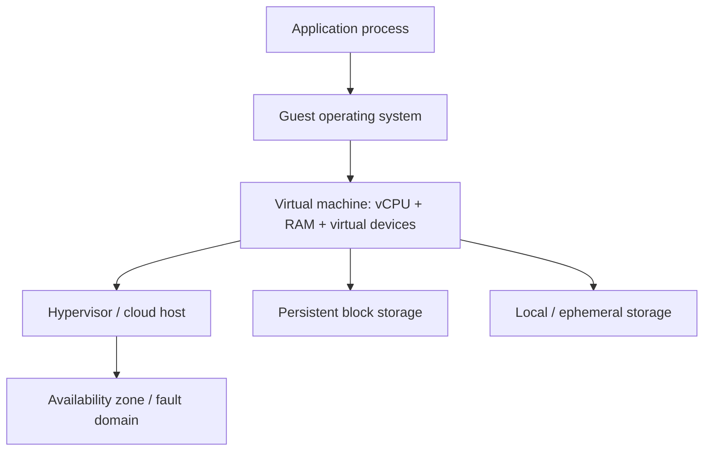
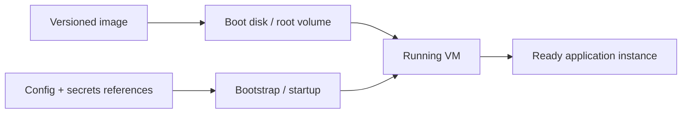
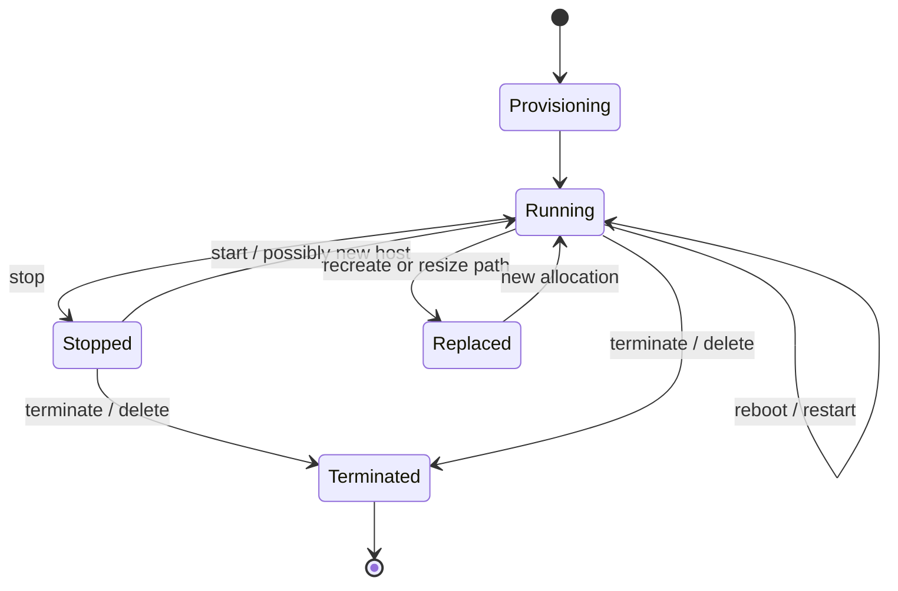
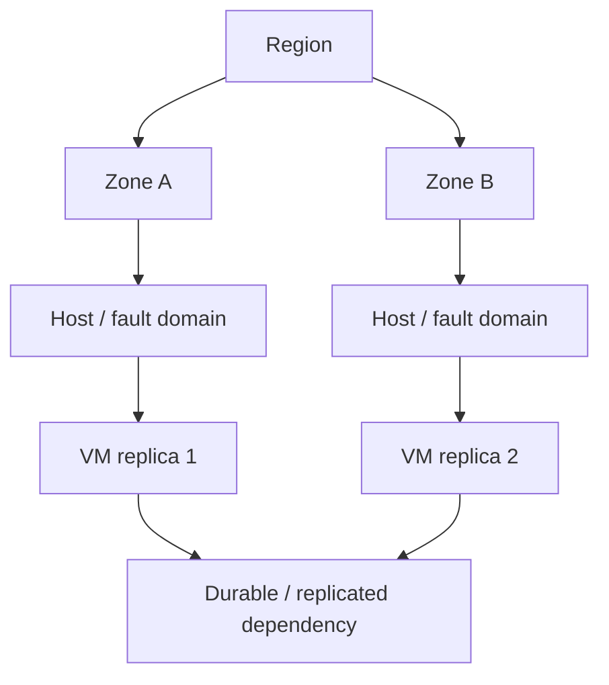

# Cloud Compute: Reason About VM Shape, Lifecycle, and Failure Boundaries

## TL;DR

During an AWS service event in June 2012, a power loss took approximately 7% of the EC2 instances in the affected US-East Availability Zone offline while instances in other Availability Zones continued operating. The lesson was not that virtual machines were unreliable; it was that **one VM in one fault domain is still one failure boundary**. Cloud compute gives you programmable capacity, not an immortal server.

> 💡 **Rule of thumb:** Treat a VM as a **replaceable allocation of CPU, memory, network, and attached storage inside a failure domain**. Keep durable state outside the lifetime of the machine unless loss is explicitly acceptable.

- **Shape is a resource contract:** An instance type, machine type, or VM size selects vCPU, memory/RAM, architecture, accelerator options, and platform-dependent I/O limits; it does not make the underlying host disappear.
- **Lifecycle actions have different semantics:** Reboot/restart, stop then start, resize, and terminate/delete can preserve different pieces of identity and storage. Know what survives each transition before using it as a recovery technique.
- **Image is not durable state:** A machine image plus deterministic bootstrap should make a replacement VM reproducible. Runtime business state belongs on persistent services or explicitly durable disks, not only in the guest filesystem.
- **Availability comes from placement and redundancy:** A single instance, even a large one, is still exposed to host and zone failures. Separate compute replicas and their dependencies across the fault domains required by the application.
- **Fatal pitfall:** Treating instance-local storage, one hostname, or one long-lived VM as permanent infrastructure. Resize, host retirement, Spot interruption, or replacement can expose that assumption at exactly the wrong time.

<TermBox term="Virtual Machine">
A **virtual machine (VM)** is an isolated guest operating-system environment presented with virtual CPUs, memory, network interfaces, and devices by a hypervisor or equivalent cloud virtualization layer. The cloud API lets you request this capacity without choosing the exact physical server in ordinary deployments.
</TermBox>

## A VM is capacity scheduled onto a host

The durable mental model is not “a server in somebody else's data center.” It is **a request for compute resources that the provider places on physical infrastructure**.

AWS calls the shape an **EC2 instance type**, Google Cloud calls it a **Compute Engine machine type**, and Azure exposes **Virtual Machine sizes**. The names differ, but the reasoning questions are similar:

- How many **vCPUs** does the workload need, and what CPU architecture or accelerator does it require?
- How much **memory/RAM** is required at steady state and at peak?
- Are network and storage throughput coupled to the selected size or family?
- Does the workload need local NVMe/SSD, GPUs, confidential-compute features, or dedicated hardware?
- Can the workload tolerate a different shape if the preferred capacity is unavailable?

A vCPU is a scheduling abstraction, not a promise that every provider, family, and generation maps it to physical cores in exactly the same way. Benchmark the workload that matters instead of comparing only the number printed in a size name.

## Image, boot disk, and bootstrap answer different questions

A repeatable VM normally has three layers of configuration:

1. **Image:** the starting operating system and baked software baseline. AWS uses AMIs, Compute Engine uses images, and Azure supports platform/custom images.
2. **Boot disk / root volume / OS disk:** the writable block device from which this particular VM boots.
3. **Bootstrap:** startup scripts, cloud-init, user data, configuration management, or another mechanism that applies environment-specific settings when the machine starts.

The image should be reproducible and versioned. Bootstrap should be deterministic enough that creating a replacement is routine, not an incident. Secrets should be fetched from an identity-aware secret system rather than permanently baked into an image.

An image is **not** a backup of all live application state. If users upload data, a queue has unprocessed work, or a database writes records after the image was built, recreating the image does not recreate that state.

## Lifecycle verbs are not synonyms

<TermBox term="Compute Lifecycle">
A **compute lifecycle** is the set of state transitions a VM can undergo—provision, boot, reboot, stop, start, resize/recreate, and terminate/delete—plus the provider-specific rules for which identity, memory, disks, addresses, and placement survive each transition.
</TermBox>

The exact mechanics differ by provider, but keep these conceptual boundaries explicit:

| Action | Mental model | What to question |
| --- | --- | --- |
| **Reboot / restart** | Restart the guest on the existing logical VM | Does local disk survive? Does the same host remain? |
| **Stop → start** | Release running compute, then allocate it again later | Can placement or public addressing change? What storage survives? |
| **Resize / vertical scale** | Change the requested machine shape | Is stop/restart required? Is the target shape available in this zone? |
| **Terminate / delete** | Destroy the VM resource | Which attached disks or addresses are deleted, detached, or retained? |

For example, AWS documents that an EBS-backed EC2 instance can be stopped and started, and that a start commonly places it on a new underlying host. AWS instance-store data is lost on stop, hibernate, or terminate. Google Cloud documents durable Persistent Disk/Hyperdisk separately from Local SSD, whose persistence characteristics are different. Azure likewise distinguishes managed disks from local temporary disks. These are concrete examples of one rule: **compute lifetime and storage lifetime are separate contracts**.

Do not memorize the diagram as a universal API. AWS EC2, Google Compute Engine, and Azure Virtual Machines have different supported transitions and details. Use it to ask what **identity, placement, and storage** cross each boundary on the provider you actually operate.

## Local speed and durable storage are different promises

<TermBox term="Ephemeral Storage">
**Ephemeral or local storage** is tied more closely to a VM or physical host than durable network-attached storage. It can provide high throughput and low latency, but applications must assume the data can disappear on lifecycle events or hardware replacement defined by the provider.
</TermBox>

Local storage is useful for data that can be regenerated:

- caches;
- temporary compilation/build artifacts;
- shuffle/scratch space;
- replicated data whose authoritative copy exists elsewhere;
- checkpoint-free work that can restart from the beginning.

Persistent storage is appropriate when the data must outlive replacement of the compute instance. Even then, ask about the storage resource's own zone, replication, snapshot, and recovery model. A persistent block disk is not automatically a multi-zone database and does not remove the need for application-level backup or replication.

A practical ownership rule is:

> If losing this VM right now would destroy the only copy of an important fact, the system has accidentally made compute identity part of its durability model.

## Placement defines the blast radius

A VM runs somewhere: on a host, in a fault domain or availability zone, inside a region. Providers deliberately hide many physical details, but they expose placement boundaries so architectures can avoid one correlated failure taking every replica down.

Two VMs are not meaningfully redundant if both depend on the same single-zone database, shared appliance, or other single failure point. Compute placement is only one layer of end-to-end availability.

Google Cloud can live-migrate many VM types during planned host maintenance, while other VM types or configurations must terminate/restart. Azure exposes availability zones and other placement constructs. AWS exposes Availability Zones and host/instance lifecycle behavior. These provider features reduce some classes of interruption; they do not turn one VM into a highly available application.

## Interruption-priced capacity changes the contract

AWS Spot Instances, Google Cloud Spot VMs, and Azure Spot Virtual Machines trade lower price for **provider-initiated interruption or eviction risk**. Exact signals, actions, pricing, and restart behavior differ, so treat “Spot” as a category, not one universal protocol.

Good candidates are workloads that can:

- checkpoint progress outside the VM;
- retry from a stable work identifier;
- lose one worker without losing the job's authoritative state;
- tolerate delayed replacement when capacity is scarce;
- diversify across acceptable shapes or zones where the platform supports it.

A production singleton that owns unique in-memory state is usually a poor fit. The important design question is not “How cheap is Spot?” but **“What happens if this VM disappears while it is doing useful work?”**

## Right-size from measurements, not labels

Vertical scaling changes the capacity of one VM: more or fewer vCPUs, memory, or a different accelerator/storage profile. It can be the simplest answer for a workload whose bottleneck is genuinely per-process capacity.

But resizing has boundaries:

- the target size may require a restart or replacement;
- a preferred shape can be unavailable in a particular zone even when account quota exists;
- larger VMs increase the amount of capacity lost when one instance fails;
- software may not benefit linearly from more cores or RAM;
- storage/network ceilings may be the bottleneck rather than CPU.

Use CPU saturation, memory pressure/OOM events, run-queue behavior, application latency, network throughput, disk latency/IOPS, and cost per useful unit of work as evidence. Dynamic horizontal policies belong in the later [Autoscaling](/docs/cloud-infrastructure/autoscaling) lesson; here the key idea is that **shape is a capacity decision, not an availability strategy**.

## Production scenario: a safe resize deletes the only checkpoint

A media-processing worker runs on one large VM. To reduce cost, the team stops it and changes to a smaller machine shape. The worker's boot disk is durable, so the change looks safe. After startup, half-completed jobs restart from zero and several hours of progress are gone.

**Impact:** The queue backlog spikes, partner delivery deadlines are missed, and the smaller VM spends most of its time recomputing work that had already completed.

**Root cause:** Progress checkpoints were written to fast instance-local NVMe storage because it benchmarked well. The team treated the VM as durable identity and assumed stop/start or resize would preserve every attached filesystem. The local disk's lifetime was actually tied to the old compute allocation.

**Correct pattern:** Store authoritative job state and checkpoints on a persistent service with an explicit durability contract. Use local SSD only for disposable scratch/cache data. Version the image, make bootstrap repeatable, verify replacement from scratch, and test stop/start, host loss, and Spot-style interruption as normal lifecycle events rather than disaster-only cases.

Show the reasoning: a VM has a persistent boot disk. Is the VM itself now durable?

No. The disk and the compute allocation are separate resources with separate failure and lifecycle semantics. A persistent boot disk may survive a stop or VM replacement, but the physical host, memory contents, local ephemeral disks, temporary public addresses, and other runtime state can change. If the application requires one particular VM identity to survive forever, recovery is coupled to an assumption the cloud does not promise.

## A reasoning checklist for VM designs

- [ ] **Classify the workload:** CPU-bound, memory-bound, I/O-bound, accelerator-bound, latency-sensitive, or mixed.
- [ ] **Choose the shape from evidence:** Size vCPU, RAM, network, storage, and accelerators from measured demand and headroom.
- [ ] **Separate image from state:** Keep images/versioned bootstrap reproducible; keep authoritative runtime state in durable systems.
- [ ] **Write the lifecycle table:** Record what survives reboot, stop/start, resize/recreate, host replacement, and terminate/delete.
- [ ] **Define the failure domain:** Know the host, zone, and regional dependencies that can fail together.
- [ ] **Design replacement:** A new VM should be able to join service without reconstructing history from the old VM's local disk.
- [ ] **Treat Spot as interruptible:** Use it only where interruption, checkpointing, and delayed capacity are acceptable.
- [ ] **Plan allocation failure:** Quota, requested shape, and actual capacity are different constraints; have an acceptable fallback or explicit failure mode.

## Common mistakes

**“The VM has a name and IP, so it is a permanent server.”** Names are control-plane identities. Hosts can be replaced, addresses can change, and the application should know which identities are intentionally stable.

**“The boot disk survived, so every disk survives.”** Local/temporary storage and persistent block storage have different lifecycle contracts.

**“A bigger VM is more available.”** It has more capacity, but a single instance is still one instance. Capacity and redundancy solve different problems.

**“Spot is just cheaper on-demand.”** The interruption contract is part of the product. The workload must be designed around it.

**“Quota means capacity is guaranteed.”** Quota permits allocation up to a limit; actual shape/zone capacity can still constrain provisioning.

## Agent rules

- [ ] **Model lifetime explicitly:** Never change VM lifecycle behavior without documenting what happens to memory, local disk, persistent disks, addressing, and attached identity.
- [ ] **Prefer replaceability:** Automate image + bootstrap so replacement is safer than manual repair of a snowflake instance.
- [ ] **Keep durable facts off local disk:** Treat ephemeral storage as disposable unless loss is explicitly part of the product contract.
- [ ] **Respect fault domains:** Do not claim high availability from multiple VMs until dependent state and routing also survive the intended zone/host failure.
- [ ] **Scope provider claims:** Verify AWS EC2, Google Compute Engine, and Azure Virtual Machines behavior separately instead of transferring one provider's lifecycle rules to another.

## Review questions

- [ ] Can you explain why a VM is a compute allocation rather than a promise about one physical host?
- [ ] Can you distinguish an image, boot/root disk, bootstrap configuration, and authoritative runtime state?
- [ ] Can you predict which assumptions are risky across reboot, stop/start, resize, replacement, and termination?
- [ ] Can you explain why local ephemeral storage is appropriate for scratch data but dangerous for the only copy of a business fact?
- [ ] Can you decide whether a workload is safe for Spot/preemptible capacity and describe its checkpoint/recovery path?
- [ ] Can you separate vertical right-sizing from availability and later horizontal autoscaling decisions?

## Primary sources

- [AWS — Summary of the June 2012 service event in the US East Region](https://aws.amazon.com/message/67457/)
- [AWS EC2 — Instance types](https://docs.aws.amazon.com/AWSEC2/latest/UserGuide/instance-types.html)
- [AWS EC2 — Instance lifecycle](https://docs.aws.amazon.com/AWSEC2/latest/UserGuide/ec2-instance-lifecycle.html)
- [AWS EC2 — Instance store data persistence](https://docs.aws.amazon.com/AWSEC2/latest/UserGuide/instance-store-lifetime.html)
- [AWS EC2 — Spot Instances](https://docs.aws.amazon.com/AWSEC2/latest/UserGuide/using-spot-instances.html)
- [Google Cloud Compute Engine — Overview](https://cloud.google.com/compute/docs/overview)
- [Google Cloud Compute Engine — Live migration](https://cloud.google.com/compute/docs/instances/live-migration-process)
- [Google Cloud Compute Engine — Spot VMs](https://cloud.google.com/compute/docs/instances/spot)
- [Azure Virtual Machines — Availability options](https://learn.microsoft.com/azure/virtual-machines/availability)
- [Azure Virtual Machines — VM sizes](https://learn.microsoft.com/azure/virtual-machines/sizes/overview)
- [Azure Virtual Machines — VM sizes with no local temporary disk](https://learn.microsoft.com/azure/virtual-machines/azure-vms-no-temp-disk)
- [Azure Virtual Machines — Spot VMs](https://learn.microsoft.com/azure/virtual-machines/spot-vms)

## Related lessons

- [Cloud Networking](/docs/cloud-infrastructure/cloud-networking)
- [Virtual Memory](/docs/computing-foundations/virtual-memory)
- [Containers vs Serverless](/docs/engineering-judgment/decision-guides/containers-vs-serverless)
- [Service Resilience](/docs/backend-engineering/service-resilience)
- [Capacity Planning](/docs/delivery-operations/capacity-planning)
