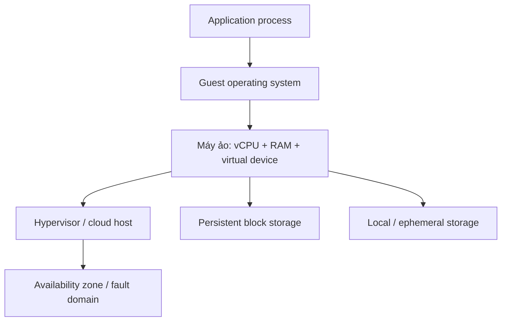
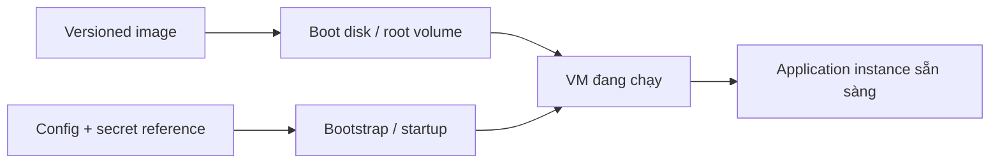
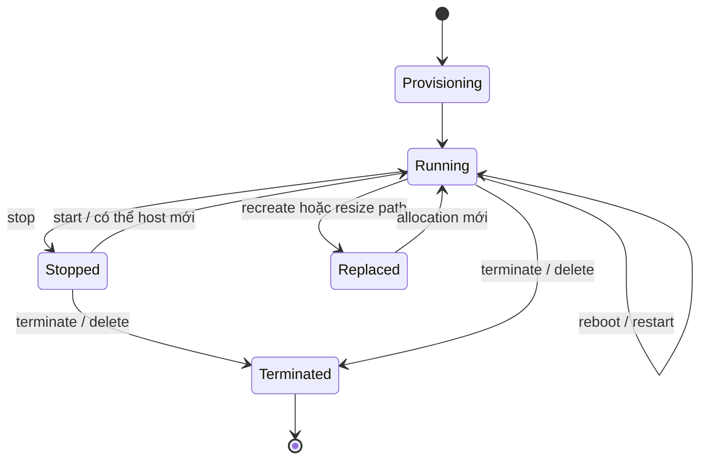
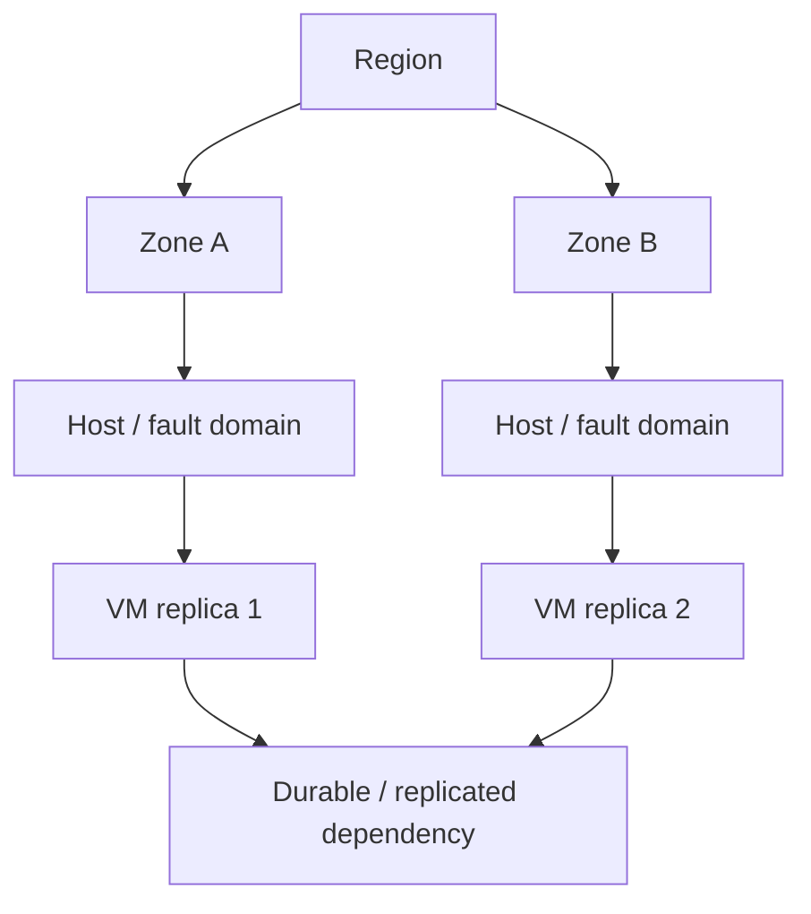

# Cloud Compute: Suy luận về Cấu hình VM, Vòng đời và Ranh giới Lỗi

## TL;DR

Trong một sự cố dịch vụ AWS vào tháng 6/2012, mất điện khiến khoảng 7% instance EC2 trong Availability Zone bị ảnh hưởng tại US-East ngừng hoạt động, trong khi các instance ở Availability Zone khác vẫn tiếp tục chạy. Bài học không phải máy ảo “không đáng tin”; bài học là **một VM trong một fault domain vẫn chỉ là một failure boundary**. Cloud compute cho bạn capacity có thể lập trình, không phải một server bất tử.

> 💡 **Quy tắc bỏ túi:** Hãy xem VM là **một allocation có thể thay thế của CPU, bộ nhớ, network và storage gắn kèm bên trong một fault domain**. Giữ durable state ngoài vòng đời máy trừ khi mất dữ liệu là điều được chấp nhận rõ ràng.

- **Shape là resource contract:** Instance type, machine type hay VM size chọn vCPU, memory/RAM, kiến trúc CPU, accelerator và các giới hạn I/O phụ thuộc platform; nó không làm host vật lý biến mất.
- **Lifecycle action có semantics khác nhau:** Reboot/khởi động lại, dừng rồi khởi động, resize và terminate/xóa có thể giữ lại những phần identity và storage khác nhau. Phải biết điều gì sống sót qua từng transition trước khi dùng nó làm recovery technique.
- **Image không phải durable state:** Machine image cộng với bootstrap tất định nên đủ để tạo lại một VM thay thế. Runtime business state phải nằm trên persistent service hoặc durable disk được định nghĩa rõ, không chỉ trong guest filesystem.
- **Availability đến từ placement và redundancy:** Một instance duy nhất, dù rất lớn, vẫn chịu lỗi host và zone. Replica compute cùng dependency cần được tách qua các fault domain đúng với yêu cầu của ứng dụng.
- **Sai lầm chí mạng:** Xem instance-local storage, một hostname hay một VM sống lâu như hạ tầng vĩnh viễn. Resize, host retirement, Spot interruption hoặc replacement sẽ phơi bày giả định đó vào đúng thời điểm tệ nhất.

<TermBox term="Máy ảo (Virtual Machine)">
**Máy ảo (VM)** là môi trường guest operating system được cô lập, nhận virtual CPU, bộ nhớ, network interface và device từ hypervisor hoặc lớp ảo hóa tương đương của cloud. Cloud API cho phép yêu cầu capacity này mà thông thường không cần chọn chính xác máy chủ vật lý.
</TermBox>

## VM là capacity được schedule lên một host

Mental model bền vững không phải “server đặt trong data center của người khác”. Nó là **một yêu cầu compute resource mà nhà cung cấp cloud đặt lên physical infrastructure**.

AWS gọi shape là **EC2 instance type**, Google Cloud gọi là **Compute Engine machine type**, còn Azure dùng **Virtual Machine size**. Tên khác nhau nhưng câu hỏi suy luận gần giống nhau:

- Workload cần bao nhiêu **vCPU**, kiến trúc CPU hay accelerator nào?
- Cần bao nhiêu **memory/RAM** ở steady state và peak?
- Network/storage throughput có bị ràng buộc bởi size hoặc family đã chọn không?
- Workload có cần local NVMe/SSD, GPU, confidential-compute feature hay dedicated hardware không?
- Workload có chấp nhận shape khác nếu capacity mong muốn không có sẵn không?

vCPU là scheduling abstraction, không phải lời hứa rằng mọi provider, family và generation ánh xạ nó sang physical core theo cách giống hệt nhau. Hãy benchmark workload thật thay vì chỉ so con số trong tên size.

## Image, boot disk và bootstrap trả lời ba câu hỏi khác nhau

Một VM có thể tái tạo thường có ba lớp cấu hình:

1. **Image:** operating system ban đầu và software baseline được bake sẵn. AWS dùng AMI, Compute Engine dùng image, Azure hỗ trợ platform/custom image.
2. **Boot disk / root volume / OS disk:** block device có thể ghi mà instance cụ thể này boot từ đó.
3. **Bootstrap:** startup script, cloud-init, user data, configuration management hoặc cơ chế khác áp dụng cấu hình theo environment lúc máy khởi động.

Image nên có version và có thể dựng lại. Bootstrap phải đủ tất định để tạo replacement trở thành thao tác bình thường thay vì sự cố. Secret nên được lấy từ hệ thống quản lý secret có identity thay vì bake vĩnh viễn vào image.

Image **không** phải backup của toàn bộ live application state. Nếu user upload dữ liệu, queue còn work chưa xử lý hoặc database ghi record sau lúc build image, recreate image không recreate những state đó.

## Các động từ lifecycle không đồng nghĩa

<TermBox term="Compute Lifecycle">
**Compute lifecycle** là tập state transition mà VM có thể trải qua—provision, boot, reboot, stop, start, resize/recreate và terminate/delete—cùng rule phụ thuộc provider quy định identity, memory, disk, address và placement nào sống sót qua từng transition.
</TermBox>

Cơ chế chính xác khác nhau giữa các nhà cung cấp, nhưng hãy giữ các ranh giới khái niệm sau thật rõ:

| Action | Mental model | Cần hỏi gì |
| --- | --- | --- |
| **Reboot / khởi động lại** | Restart guest trên cùng logical VM | Local disk còn không? VM có giữ cùng host không? |
| **Dừng → khởi động** | Nhả running compute rồi allocate lại sau | Placement hoặc public address có đổi không? Storage nào còn? |
| **Resize / vertical scale** | Đổi machine shape được yêu cầu | Có cần stop/restart không? Target shape có capacity trong zone này không? |
| **Terminate / xóa** | Hủy VM resource | Attached disk/address nào bị xóa, detach hay giữ lại? |

Ví dụ, AWS ghi rõ EC2 instance có EBS root volume có thể dừng và khởi động lại, và lần start sau thường có thể đặt instance lên underlying host mới. Dữ liệu AWS instance store mất khi stop, hibernate hoặc terminate. Google Cloud phân biệt durable Persistent Disk/Hyperdisk với Local SSD có persistence semantics khác. Azure cũng tách managed disk khỏi local temporary disk. Đây là các ví dụ cụ thể của một quy tắc: **lifetime của compute và lifetime của storage là hai contract khác nhau**.

Đừng học thuộc diagram này như một universal API. AWS EC2, Google Compute Engine và Azure Virtual Machines có supported transition và chi tiết khác nhau. Hãy dùng nó để hỏi **identity, placement và storage** nào đi qua được từng boundary trên provider bạn thực sự vận hành.

## Local speed và durable storage là hai lời hứa khác nhau

<TermBox term="Ephemeral Storage">
**Ephemeral/local storage** gắn chặt với VM hoặc physical host hơn network-attached durable storage. Nó có thể có throughput cao và latency thấp, nhưng ứng dụng phải giả định dữ liệu có thể mất khi lifecycle event hoặc hardware replacement xảy ra theo contract của nhà cung cấp.
</TermBox>

Local storage phù hợp với dữ liệu có thể tái tạo:

- cache;
- temporary build/compile artifact;
- shuffle/scratch space;
- dữ liệu replicated mà authoritative copy ở nơi khác;
- work không có checkpoint và có thể chạy lại từ đầu.

Persistent storage phù hợp khi dữ liệu phải sống lâu hơn compute instance. Nhưng vẫn phải hỏi storage resource có zone, replication, snapshot và recovery model nào. Một persistent block disk không tự động trở thành multi-zone database và không loại bỏ nhu cầu backup hoặc application-level replication.

Một ownership rule thực dụng:

> Nếu mất VM ngay lúc này sẽ phá hủy bản sao duy nhất của một sự thật quan trọng, hệ thống đã vô tình đưa compute identity vào durability model.

## Placement định nghĩa blast radius

VM phải chạy ở đâu đó: trên host, trong fault domain hoặc availability zone, bên trong region. Provider cố ý ẩn nhiều chi tiết vật lý nhưng expose các placement boundary để kiến trúc tránh một correlated failure hạ toàn bộ replica.

Hai VM không thật sự redundant nếu cả hai vẫn phụ thuộc vào một single-zone database, shared appliance hoặc single point of failure khác. Compute placement chỉ là một lớp của end-to-end availability.

Google Cloud có thể live-migrate nhiều loại VM khi planned host maintenance, trong khi một số VM/config khác phải terminate/restart. Azure expose availability zone và các placement construct khác. AWS expose Availability Zone cùng host/instance lifecycle behavior. Các feature này giảm một số loại interruption; chúng không biến một VM thành highly available application.

## Interruptible capacity thay đổi contract

AWS Spot Instances, Google Cloud Spot VMs và Azure Spot Virtual Machines đổi giá thấp hơn lấy **rủi ro provider chủ động interrupt hoặc evict**. Signal, action, pricing và restart behavior chính xác khác nhau, vì vậy hãy xem “Spot” như một category chứ không phải universal protocol.

Candidate tốt là workload có thể:

- checkpoint progress ra ngoài VM;
- retry từ stable work identifier;
- mất một worker mà không mất authoritative state của job;
- chịu được replacement bị trễ khi capacity khan hiếm;
- linh hoạt qua nhiều shape hoặc zone chấp nhận được khi platform hỗ trợ.

Một production singleton giữ unique in-memory state thường không phù hợp. Câu hỏi quan trọng không phải “Spot rẻ bao nhiêu?” mà là **“Điều gì xảy ra nếu VM này biến mất trong lúc đang làm work hữu ích?”**

## Right-size bằng measurement, không bằng label

Vertical scaling thay đổi capacity của một VM: thêm/bớt vCPU, memory hoặc đổi accelerator/storage profile. Đây có thể là đáp án đơn giản nhất khi bottleneck thực sự là per-process capacity.

Nhưng resize có boundary:

- target size có thể yêu cầu restart hoặc replacement;
- preferred shape có thể không có capacity trong một zone dù account vẫn còn quota;
- VM càng lớn thì lượng capacity mất khi một instance fail càng lớn;
- software có thể không hưởng lợi tuyến tính từ nhiều core/RAM hơn;
- storage/network ceiling có thể là bottleneck chứ không phải CPU.

Dùng CPU saturation, memory pressure/OOM, run-queue behavior, application latency, network throughput, disk latency/IOPS và cost trên mỗi đơn vị work hữu ích làm bằng chứng. Dynamic horizontal policy thuộc bài [Autoscaling](/vi/docs/cloud-infrastructure/autoscaling) phía sau; ý chính ở đây là **shape là quyết định capacity, không phải availability strategy**.

## Tình huống production: một lần resize “an toàn” xóa checkpoint duy nhất

Một media-processing worker chạy trên một VM lớn. Để giảm cost, team dừng VM và đổi sang machine shape nhỏ hơn. Boot disk là durable nên thay đổi trông có vẻ an toàn. Sau khi start lại, các job đang làm dở chạy lại từ đầu và vài giờ progress biến mất.

**Hậu quả:** Queue backlog tăng mạnh, deadline giao hàng cho partner bị trễ và VM nhỏ hơn dành phần lớn thời gian recompute work đã từng hoàn thành.

**Nguyên nhân cốt lõi:** Progress checkpoint được ghi lên instance-local NVMe nhanh vì benchmark tốt. Team xem VM là durable identity và giả định stop/start hoặc resize sẽ giữ mọi filesystem gắn vào máy. Lifetime của local disk thực tế lại gắn với compute allocation cũ.

**Cách khắc phục chuẩn:** Lưu authoritative job state và checkpoint trên persistent service có durability contract rõ ràng. Chỉ dùng local SSD cho scratch/cache có thể bỏ. Version image, làm bootstrap lặp lại được, kiểm chứng replacement từ đầu và test stop/start, host loss cùng Spot-style interruption như lifecycle event bình thường thay vì chỉ là disaster case.

Xem giải thích chi tiết: VM có persistent boot disk. Vậy bản thân VM đã durable chưa?

Chưa. Disk và compute allocation là hai resource có failure/lifecycle semantics riêng. Persistent boot disk có thể sống qua stop hoặc VM replacement, nhưng physical host, memory content, local ephemeral disk, temporary public address và runtime state khác vẫn có thể đổi. Nếu application cần đúng một VM identity tồn tại mãi, recovery đang phụ thuộc vào một lời hứa cloud không đưa ra.

## Checklist suy luận cho thiết kế VM

- [ ] **Phân loại workload:** CPU-bound, memory-bound, I/O-bound, accelerator-bound, latency-sensitive hay mixed.
- [ ] **Chọn shape từ evidence:** Size vCPU, RAM, network, storage và accelerator dựa trên measured demand cùng headroom.
- [ ] **Tách image khỏi state:** Giữ image/bootstrap có version và tái tạo được; authoritative runtime state phải nằm trong durable system.
- [ ] **Viết lifecycle table:** Ghi rõ điều gì sống qua reboot, dừng/khởi động, resize/recreate, host replacement và terminate/xóa.
- [ ] **Xác định failure domain:** Biết host, zone và regional dependency nào có thể fail cùng nhau.
- [ ] **Thiết kế replacement:** VM mới phải có thể join service mà không cần phục hồi lịch sử từ local disk của VM cũ.
- [ ] **Xem Spot là interruptible:** Chỉ dùng khi interruption, checkpointing và delayed capacity được chấp nhận.
- [ ] **Chuẩn bị cho allocation failure:** Quota, requested shape và actual capacity là các constraint khác nhau; phải có fallback chấp nhận được hoặc failure mode rõ.

## Sai lầm phổ biến

**“VM có tên và IP nên nó là server vĩnh viễn.”** Name là control-plane identity. Host có thể bị thay, address có thể đổi và application phải biết identity nào thật sự cần ổn định.

**“Boot disk còn thì mọi disk đều còn.”** Local/temporary storage và persistent block storage có lifecycle contract khác nhau.

**“VM lớn hơn thì available hơn.”** Nó có nhiều capacity hơn, nhưng một instance vẫn chỉ là một instance. Capacity và redundancy giải hai bài toán khác nhau.

**“Spot chỉ là on-demand rẻ hơn.”** Interruption contract là một phần của sản phẩm. Workload phải được thiết kế theo contract đó.

**“Có quota nghĩa là capacity được đảm bảo.”** Quota cho phép allocation đến một giới hạn; actual capacity của shape/zone vẫn có thể chặn provisioning.

## Agent rules

- [ ] **Mô hình hóa lifetime:** Không đổi VM lifecycle behavior nếu chưa ghi rõ tác động lên memory, local disk, persistent disk, addressing và attached identity.
- [ ] **Ưu tiên replaceability:** Tự động hóa image + bootstrap để replacement an toàn hơn sửa thủ công một snowflake instance.
- [ ] **Không để durable fact trên local disk:** Xem ephemeral storage là disposable trừ khi mất dữ liệu là product contract tường minh.
- [ ] **Tôn trọng fault domain:** Không claim high availability chỉ vì có nhiều VM nếu dependent state và routing chưa sống qua host/zone failure mục tiêu.
- [ ] **Scope claim theo provider:** Kiểm chứng AWS EC2, Google Compute Engine và Azure Virtual Machines riêng thay vì bê lifecycle rule của provider này sang provider khác.

## Câu hỏi ôn tập

- [ ] Bạn có giải thích được vì sao VM là compute allocation thay vì lời hứa về một physical host cụ thể không?
- [ ] Bạn có phân biệt được image, boot/root disk, bootstrap configuration và authoritative runtime state không?
- [ ] Bạn có dự đoán được giả định nào nguy hiểm qua reboot, dừng/khởi động, resize, replacement và termination không?
- [ ] Bạn có giải thích được vì sao local ephemeral storage hợp với scratch data nhưng nguy hiểm cho bản sao duy nhất của business fact không?
- [ ] Bạn có quyết định được workload có an toàn với Spot/preemptible capacity và mô tả checkpoint/recovery path của nó không?
- [ ] Bạn có tách vertical right-sizing khỏi availability và quyết định horizontal autoscaling phía sau không?

## Nguồn chính

- [AWS — Summary of the June 2012 service event in the US East Region](https://aws.amazon.com/message/67457/)
- [AWS EC2 — Instance types](https://docs.aws.amazon.com/AWSEC2/latest/UserGuide/instance-types.html)
- [AWS EC2 — Instance lifecycle](https://docs.aws.amazon.com/AWSEC2/latest/UserGuide/ec2-instance-lifecycle.html)
- [AWS EC2 — Instance store data persistence](https://docs.aws.amazon.com/AWSEC2/latest/UserGuide/instance-store-lifetime.html)
- [AWS EC2 — Spot Instances](https://docs.aws.amazon.com/AWSEC2/latest/UserGuide/using-spot-instances.html)
- [Google Cloud Compute Engine — Overview](https://cloud.google.com/compute/docs/overview)
- [Google Cloud Compute Engine — Live migration](https://cloud.google.com/compute/docs/instances/live-migration-process)
- [Google Cloud Compute Engine — Spot VMs](https://cloud.google.com/compute/docs/instances/spot)
- [Azure Virtual Machines — Availability options](https://learn.microsoft.com/azure/virtual-machines/availability)
- [Azure Virtual Machines — VM sizes](https://learn.microsoft.com/azure/virtual-machines/sizes/overview)
- [Azure Virtual Machines — VM sizes with no local temporary disk](https://learn.microsoft.com/azure/virtual-machines/azure-vms-no-temp-disk)
- [Azure Virtual Machines — Spot VMs](https://learn.microsoft.com/azure/virtual-machines/spot-vms)

## Bài liên quan

- [Cloud Networking](/vi/docs/cloud-infrastructure/cloud-networking)
- [Virtual Memory](/vi/docs/computing-foundations/virtual-memory)
- [Containers vs Serverless](/vi/docs/engineering-judgment/decision-guides/containers-vs-serverless)
- [Service Resilience](/vi/docs/backend-engineering/service-resilience)
- [Capacity Planning](/vi/docs/delivery-operations/capacity-planning)
