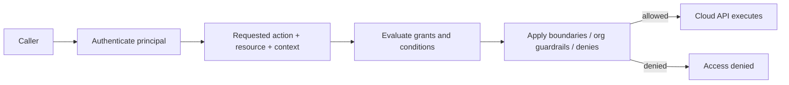
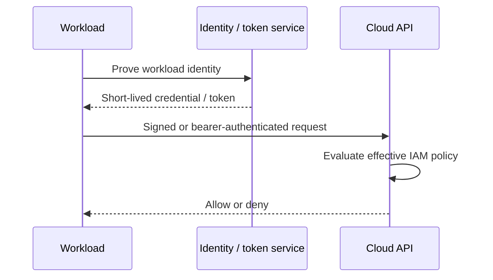
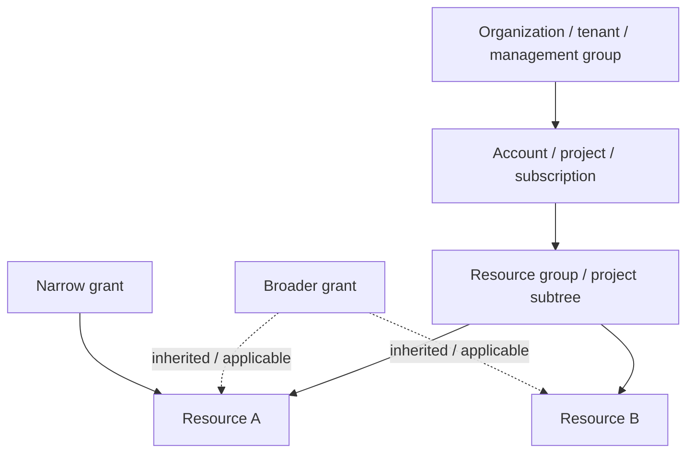
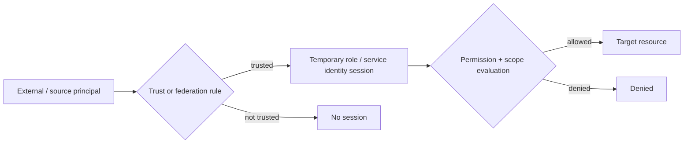

# Cloud IAM: Operate Identities, Policies, Roles, and Trust

## TL;DR

In March 2019, an attacker exploited a misconfigured web application firewall in Capital One's cloud environment. According to the U.S. Department of Justice complaint, commands reaching the server obtained security credentials for a WAF role; those credentials were then used to list cloud-storage buckets and copy data from buckets for which that role had the required permissions. Capital One discovered the incident in July 2019. The operational lesson is broader than one firewall bug: **a compromised workload becomes as dangerous as the authority attached to its cloud identity**.

> 💡 **Rule of thumb:** Evaluate every cloud action as **principal × action × resource × context**, constrained by trust and guardrail layers. Reduce both halves of the risk: make credentials short-lived and difficult to steal, and make the permissions behind those credentials no broader than the workload actually needs.

- **Identity is not the same thing as a credential:** A human, workload, role, service account, or managed identity is the principal; passwords, keys, certificates, and temporary tokens are ways that principal proves or acquires identity.
- **Authentication and authorization are separate:** Authentication answers who the caller is; authorization decides whether that principal may perform this action on this resource under the current context.
- **Workloads should prefer short-lived identity:** Roles, managed identities, attached service accounts, and federation remove many long-lived access keys from hosts and CI systems while still requiring strict permission scope.
- **Effective access comes from multiple policy layers:** Direct grants, resource policies, inherited roles, conditions, boundaries, organization policies, session restrictions, and explicit denies combine differently across AWS, Google Cloud, and Azure.
- **Fatal pitfall:** Granting broad role-passing, impersonation, or IAM-administration rights. A principal that cannot directly read production data may still escalate by attaching, passing, assuming, or granting a more privileged identity.



<TermBox term="Principal">
A **principal** is the security identity making or authorizing a request: for example a human user, workload identity, IAM role session, Google service account, federated subject, Azure service principal, or managed identity. A credential is evidence used to act as a principal; it is not the principal itself.
</TermBox>

## Cloud IAM is the authorization plane for infrastructure

Application authorization usually protects business capabilities such as "refund this order" or "view this customer."

Cloud IAM protects infrastructure and managed-service capabilities such as:

- read this object or secret;
- start or terminate this VM;
- publish to this queue;
- decrypt with this key;
- create a database snapshot;
- change a network route;
- modify another identity's permissions.

The dedicated [Authentication & Authorization](/docs/backend-engineering/authentication-and-authorization) lesson covers end-user login, application sessions, RBAC, ABAC, and business authorization in more depth.

This lesson focuses on **cloud control/data-plane identities and policy evaluation**.

## Authentication proves a caller; authorization evaluates authority

A successful login, token exchange, role assumption, or managed-identity token request does not prove the caller may perform the next API action.

Think in two steps:

1. **Authentication:** Which principal does the provider accept for this request?
2. **Authorization:** Which effective policies apply to that principal, action, resource, and request context?

The same principal can be allowed to read one bucket and denied access to another. A workload may authenticate successfully but receive `403`, `AccessDenied`, or an equivalent authorization failure.

Do not debug authorization by repeatedly rotating credentials if the real problem is policy scope.

## Separate human identities from workload identities

Humans and software have different lifecycle requirements.

### Human access

Prefer:

- centralized workforce identity / SSO;
- MFA for privileged access;
- group- or role-based assignment instead of direct per-user grants;
- short-lived sessions;
- just-in-time elevation for administrative work;
- separate everyday and break-glass paths.

Avoid creating permanent cloud-local administrator users merely because they are convenient.

### Workload access

A workload needs a non-human identity whose authority matches one application or component.

Examples:

- an **AWS IAM role** attached to EC2, Lambda, ECS, EKS, or assumed through STS;
- a **Google Cloud service account**, federated workload principal, or managed workload identity;
- an **Azure managed identity** or service principal.

Do not share one "backend-prod" identity across unrelated services. Shared identities make least privilege, attribution, and revocation harder.

## Prefer temporary credentials over long-lived keys

AWS recommends roles for EC2 workloads so applications receive automatically rotated **temporary credentials** instead of embedded long-lived access keys. Google Cloud recommends avoiding service account keys when a safer alternative such as attached service accounts or Workload Identity Federation is available. Azure managed identities similarly let supported workloads obtain tokens without storing application secrets.



Short-lived credentials reduce the useful lifetime of a leaked credential, but they do **not** make over-permissioning safe. If a role session has administrator-equivalent permissions for one hour, stealing that session can still be catastrophic during that hour.

**Long-lived credentials** are operational liabilities because they must be distributed, stored, rotated, inventoried, and revoked correctly across every place that copied them.

<TermBox term="Role / Workload Session">
A **role or workload session** is temporary authority obtained after a trusted principal proves it may act as a role, service account, managed identity, or federated subject. The session inherits or is bounded by permissions defined for that identity and may also carry session-specific restrictions.
</TermBox>

## Trace permissions with four fields: principal, action, resource, context

A cloud authorization decision becomes easier to debug when every rule answers:

| Field | Question | Example |
| --- | --- | --- |
| **Principal** | Who is acting? | deployment role, service account, managed identity |
| **Action** | What operation? | read object, start VM, decrypt key |
| **Resource** | Which target? | one bucket prefix, one key, one project resource |
| **Context** | Under what conditions? | source network, tag, time, MFA, workload claim |

Least privilege means narrowing all four where the platform supports it.

A policy that says "read objects" but targets every bucket in every environment is not least privilege.

A policy that targets one bucket but also grants `iam:PassRole` or identity-admin rights may contain a privilege-escalation path that is much larger than the data permission suggests.

## Default deny is only the starting point

Most cloud IAM systems begin from "no permission unless granted," but real effective access is formed from multiple layers.

### AWS IAM

AWS evaluates several policy types. Identity-based and resource-based policies can grant access; permissions boundaries, session policies, AWS Organizations controls such as SCPs, and explicit denies can restrict it. An applicable explicit deny wins over an allow.

For assumed roles, two separate questions exist:

- **Who may assume this role?** — the role trust policy and the caller's relevant permissions;
- **What may the resulting role session do?** — the role permission policies plus applicable boundaries, session policies, organization controls, and resource policies.

### Google Cloud IAM

Google Cloud allow policies are attached to resources and inherited through the resource hierarchy. Effective access can therefore come from the resource, project, folder, or organization.

Google Cloud deny policies override allow policies. Principal Access Boundary policies can further restrict which resources a principal is eligible to access.

### Azure RBAC

Azure role assignments combine:

- a **principal**;
- a **role definition**;
- a **scope** such as management group, subscription, resource group, or resource.

Permissions assigned at broader scopes are inherited by narrower scopes. Azure-managed deny assignments can block actions even when a role assignment grants them.

The products have similar goals but **different evaluation rules**. Never copy a mental model from one provider and assume it is exact on another.

## Scope is where least privilege usually succeeds or fails

"Read storage" is not a complete permission.

Ask:

- every storage account or one account?
- every bucket or one bucket?
- every object or one prefix?
- every project or one project?
- production and staging, or production only?
- all encryption keys, or the one key used by this service?



Broad scopes are convenient because fewer assignments are needed. They also enlarge blast radius and make unused permission harder to identify.

Start at the smallest stable scope that matches the application's ownership boundary, then widen only with evidence.

## Conditions and attributes make scope dynamic

Static role names are not always enough.

Cloud IAM systems can condition access on request context such as:

- resource tags or labels;
- source network or endpoint;
- organization/project/account identifiers;
- token audience;
- workload or repository claims;
- MFA state;
- requested service;
- time-bound attributes.

Conditions are powerful but must remain inspectable. A compact role plus ten opaque conditions can be harder to operate than two clear roles.

Treat attributes used for authorization as security-sensitive input. If an attacker can control a federated claim, tag, or identity mapping used in a condition, the condition may become an escalation path.

## Trust policies are authorization too

Cross-account, cross-project, cross-tenant, and federated access add a second policy surface: **who is trusted to become or impersonate another identity?**



A role can have narrow resource permissions but an over-broad trust policy that lets too many callers assume it.

Conversely, a caller can have permission to request a role session while the target role does not trust that caller, so assumption fails.

For external OIDC federation such as CI systems, validate issuer, audience, tenant/organization, repository, branch/environment, and stable subject claims. Do not trust an entire multi-tenant issuer when only one organization should deploy your production account.

## Role passing and impersonation are privilege-escalation surfaces

IAM permissions that change **who a workload can become** deserve the same scrutiny as administrator permissions.

High-risk examples include:

- AWS `iam:PassRole`, `sts:AssumeRole`, role/policy modification, or attaching policies;
- Google service-account impersonation and permissions to modify IAM bindings;
- Azure role-assignment creation, managed-identity assignment, credential changes, and privileged role administration.

Consider a deployment principal that cannot read a production bucket directly but can launch a compute job and pass an administrator role to it. The deployment principal has an indirect path to administrator authority.

When the platform supports it:

- scope which exact roles or identities may be passed/impersonated;
- constrain which service may receive the role;
- separate deployment permission from IAM administration;
- require review for changes to trust and role-assignment edges.

## Workload metadata endpoints are credential-delivery boundaries

Cloud workloads often obtain credentials from a local metadata or identity endpoint.

That endpoint is intentionally reachable by the workload because the application needs credentials. This also means an SSRF, arbitrary-command bug, container breakout, or compromised process may try to reach the same endpoint.

Operate the boundary deliberately:

- use provider protections such as hardened metadata modes where available;
- prevent untrusted request parameters from becoming arbitrary outbound requests;
- isolate workloads that should not share one host identity;
- keep the attached role/service identity narrowly scoped;
- monitor unusual credential use from unexpected source networks, regions, services, or APIs.

The Capital One incident is a useful reminder: perimeter controls and IAM cannot be operated independently.

## Permission boundaries and organization guardrails limit delegated administration

<TermBox term="Permission Guardrail">
A **permission guardrail** is a policy layer that limits the maximum authority another policy or administrator can grant. Examples include AWS permissions boundaries and Organizations SCPs, Google Cloud deny policies and Principal Access Boundary policies, and Azure deny assignments or higher-scope governance controls. A guardrail is not necessarily a grant by itself.
</TermBox>

Guardrails are useful when teams need autonomy inside a bounded area.

Examples:

- application teams can create roles but only below a permissions boundary;
- child accounts/projects cannot disable mandatory logging or leave approved regions;
- workload principals can access only resources inside a defined organizational subtree;
- deployment stacks can protect resources from deletion.

A frequent mistake is assuming "the boundary allows it" means the principal has the permission. Many guardrails define a ceiling; a separate allow/grant is still required.

## Revocation has more than one clock

There are at least three revocation timelines:

1. **Stop minting new credentials:** remove trust, disable a key, remove a role assignment, or block federation.
2. **Stop existing sessions:** revoke sessions when the platform supports it, change policies that apply during evaluation, or wait for token/session expiry depending on provider semantics.
3. **Converge the change:** IAM systems are distributed; policy changes can have propagation delay.

Google Cloud, for example, documents that deny-policy changes generally propagate within minutes but can sometimes take longer. Other providers also document eventual propagation behaviors for parts of IAM.

Therefore incident response needs a provider-specific runbook. "I deleted the policy" is not sufficient evidence that every previously issued session has stopped working everywhere.

Test revocation behavior before the emergency.

## Audit the identity graph, not only API errors

Cloud IAM is a graph:

```text
human/group/workload
  -> can assume / impersonate
  -> role/service identity
  -> has permission
  -> resource
  -> may grant another role
```

Audit must answer both **who acted** and **how they got the authority**.

Useful provider logs include:

- AWS CloudTrail;
- Google Cloud Audit Logs;
- Azure Activity Log and service/resource logs.

Track:

- principal and session identity;
- role assumption / token exchange;
- policy, trust, and role-assignment changes;
- denied privileged actions;
- creation or use of long-lived keys;
- unusual source location or service;
- access to highly sensitive resources;
- dormant identities and unused permissions.

AWS IAM Access Analyzer and last-accessed data, Google IAM policy analysis/recommender tooling, and Azure access reviews / role-assignment inventory can support continuous least-privilege work, but they do not replace ownership review.

## Operate least privilege as a loop

Least privilege is not a one-time policy-writing exercise.

Use a cycle:

1. start with a narrow permission hypothesis;
2. deploy to a controlled environment;
3. observe allowed and denied actions;
4. add only required permissions;
5. monitor real usage;
6. remove unused permissions;
7. review trust relationships and role-passing rights;
8. repeat after feature and architecture changes.

Do not auto-delete a permission solely because it was unused in a short observation window. Rare disaster-recovery and incident-response permissions may be intentionally dormant.

## Keep a break-glass path without making it the normal path

Production IAM needs a way to recover from lockout or identity-provider failure.

A **break-glass / emergency access** path should be:

- small in membership;
- strongly authenticated;
- separately monitored;
- rarely used;
- tested on a schedule;
- protected from the same failure mode as normal access where practical;
- followed by review and credential/session cleanup after use.

If everyone uses break-glass because normal access is inconvenient, it is no longer emergency access.

## Production micro-scenario: CI cannot read prod, but can pass the admin role

A CI deployment role can create serverless functions and has `iam:PassRole` on every role in the account. It cannot directly read production customer data. An attacker compromises the CI token, creates a function using an existing administrator-capable execution role, invokes it, and reads the data through that function.

- **Impact:** The attacker reaches production resources that the CI role's direct policy appeared not to allow, bypassing the team's review of its "read permissions."
- **Root cause:** The team audited only direct resource permissions. It did not model `PassRole` as an edge in the privilege graph that let CI delegate a much more powerful identity to compute.
- **Correct pattern:** Restrict role passing to exact deployment roles and intended services, keep execution roles least-privileged, separate IAM administration from deployment, alert on unexpected role-to-service combinations, and test for transitive privilege escalation.

## Check your mental model

> **Scenario:** A developer in Account A has permission to call `sts:AssumeRole` on a role in Account B. The target role's permission policy allows reading a sensitive bucket in Account B. The developer concludes role assumption must succeed because both sides "have allow policies."

<details>
<summary>Show the reasoning</summary>

The target role must also **trust** the source principal (or an allowed principal/account) in its role trust policy. Permission to request role assumption on the caller side does not force the target role to trust the caller.

After assumption succeeds, the resulting role session is still constrained by the role's effective permission layers and any relevant organization, boundary, session, resource, or explicit-deny controls.

For cross-cloud systems, apply the same two-question model: **who may become this identity, and what may that identity do after the session exists?**

</details>

## Cloud IAM operations checklist

- [ ] **Principal:** Is this a human, group, workload, service account, role session, service principal, or managed identity?
- [ ] **Authentication:** How does the principal prove identity, and can long-lived credentials be replaced by SSO, managed identity, or federation?
- [ ] **Action:** Which exact API actions are required?
- [ ] **Resource scope:** Are permissions constrained to the smallest stable account/project/subscription/resource boundary?
- [ ] **Conditions:** Are tags, attributes, source constraints, audiences, or MFA conditions authoritative and understandable?
- [ ] **Trust:** Who can assume, impersonate, federate into, or assign this identity?
- [ ] **Transitive privilege:** Can this principal pass a role, create a role assignment, modify IAM, or launch compute as a more privileged identity?
- [ ] **Guardrails:** Which permission boundary, SCP/organization policy, deny policy, PAB, or deny assignment limits delegated administration?
- [ ] **Credential delivery:** Can SSRF or a compromised process reach workload credentials, and is the attached identity narrow enough if that happens?
- [ ] **Revocation:** How do you stop new credentials, invalidate or outlive active sessions, and account for propagation delay?
- [ ] **Audit:** Can logs reconstruct both the API action and the role-assumption/impersonation chain that authorized it?
- [ ] **Unused access:** Is there a recurring process to remove dormant identities, keys, and permissions without deleting intentional emergency access?
- [ ] **Break-glass:** Is emergency access independent, monitored, tested, and rarely used?

## Boundary with application Authentication & Authorization

Cloud IAM controls **provider resources and workload authority**.

Use [Authentication & Authorization](/docs/backend-engineering/authentication-and-authorization) for application end-user login, sessions, JWT/token validation, application RBAC/ABAC, and business permission checks.

A customer authenticated to your application should not automatically become a cloud principal with infrastructure permissions.

## Sources

- [U.S. Department of Justice — Capital One complaint (2019)](https://www.justice.gov/usao-wdwa/press-release/file/1188626/dl?inline=)
- [U.S. Department of Justice — Capital One incident press release](https://www.justice.gov/usao-wdwa/pr/seattle-tech-worker-arrested-data-theft-involving-large-financial-services-company)
- [AWS IAM — Policy evaluation logic](https://docs.aws.amazon.com/IAM/latest/UserGuide/reference_policies_evaluation-logic.html)
- [AWS IAM — Temporary credentials with AWS resources](https://docs.aws.amazon.com/IAM/latest/UserGuide/id_credentials_temp_use-resources.html)
- [AWS IAM — Cross-account policy evaluation](https://docs.aws.amazon.com/IAM/latest/UserGuide/reference_policies_evaluation-logic-cross-account.html)
- [AWS IAM — Access Analyzer concepts](https://docs.aws.amazon.com/IAM/latest/UserGuide/access-analyzer-concepts.html)
- [Google Cloud IAM — Overview](https://cloud.google.com/iam/docs/overview)
- [Google Cloud IAM — Workload identities](https://cloud.google.com/iam/docs/workload-identities)
- [Google Cloud IAM — Deny access](https://cloud.google.com/iam/docs/deny-access)
- [Google Cloud IAM — Workload Identity Federation best practices](https://cloud.google.com/iam/docs/best-practices-for-using-workload-identity-federation)
- [Azure RBAC — Role assignments](https://learn.microsoft.com/en-us/azure/role-based-access-control/role-assignments)
- [Azure RBAC — Deny assignments](https://learn.microsoft.com/en-us/azure/role-based-access-control/deny-assignments)
- [Azure — Managed identity best practices](https://learn.microsoft.com/en-us/entra/identity/managed-identities-azure-resources/managed-identity-best-practice-recommendations)

## Related lessons

- [Authentication & Authorization](/docs/backend-engineering/authentication-and-authorization)
- [Threat Modeling & Least Privilege](/docs/security/threat-modeling-and-least-privilege)
- [Cloud Networking](/docs/cloud-infrastructure/cloud-networking)
- [Cloud Storage Models](/docs/cloud-infrastructure/cloud-storage-models)
