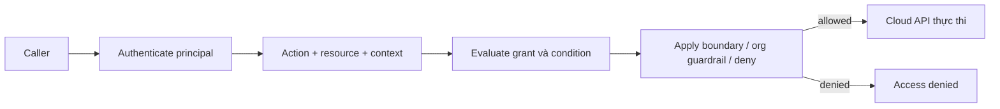
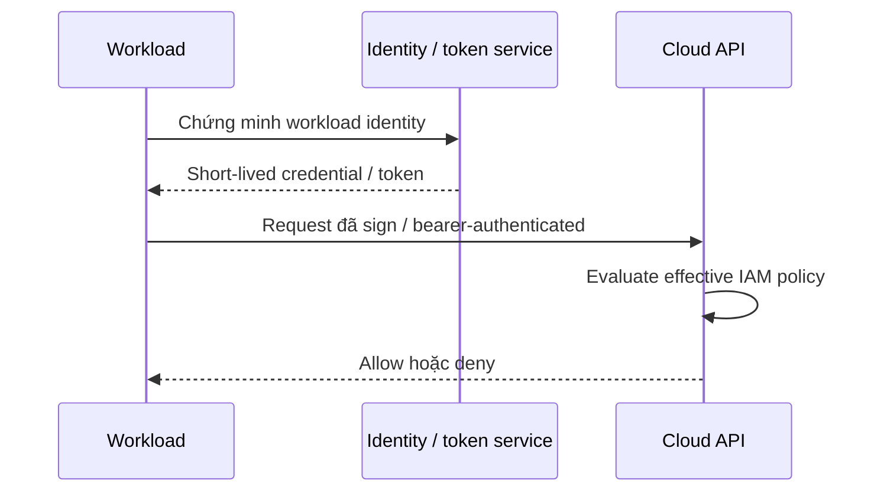
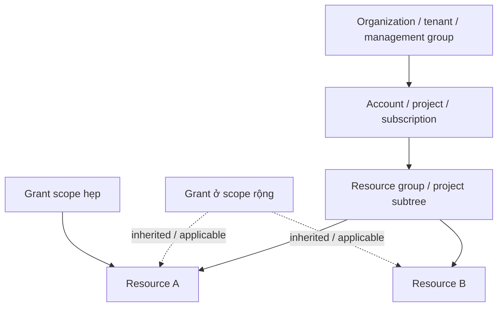
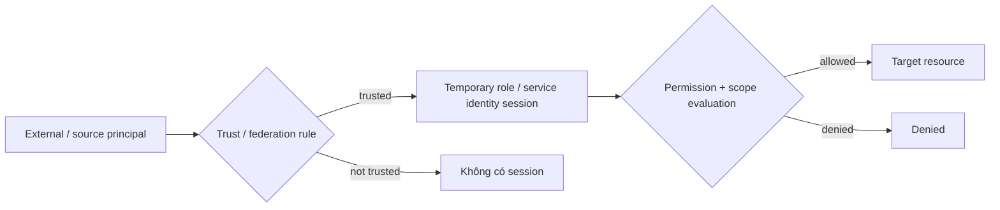

# Cloud IAM: Vận hành Identity, Policy, Role và Trust

## TL;DR

Tháng 03 năm 2019, một attacker khai thác web application firewall bị cấu hình sai trong cloud environment của Capital One. Theo hồ sơ của Bộ Tư pháp Hoa Kỳ, các command đi tới server đã lấy security credentials của một WAF role; credentials đó sau đó được dùng để list cloud-storage bucket và copy data từ các bucket mà role có đủ quyền. Capital One phát hiện incident vào tháng 07 năm 2019. Bài học vận hành rộng hơn một firewall bug: **một workload bị compromise nguy hiểm đến mức nào phụ thuộc rất lớn vào authority gắn với cloud identity của nó**.

> 💡 **Quy tắc bỏ túi:** Đánh giá mọi cloud action theo **principal × action × resource × context**, rồi áp trust và guardrail layer. Giảm cả hai nửa của rủi ro: credential phải ngắn hạn và khó bị lấy, còn permission phía sau credential phải không rộng hơn nhu cầu thật của workload.

- **Identity không đồng nghĩa credential:** Human, workload, role, service account hoặc managed identity là principal; password, key, certificate và temporary token chỉ là cách principal chứng minh hoặc nhận identity.
- **Authentication và authorization tách biệt:** Authentication trả lời caller là ai; authorization quyết định principal đó có được thực hiện action này trên resource này trong context hiện tại hay không.
- **Workload nên ưu tiên identity ngắn hạn:** Role, managed identity, attached service account và federation loại bỏ nhiều long-lived access key khỏi host/CI, nhưng permission scope vẫn phải chặt.
- **Effective access đến từ nhiều policy layer:** Direct grant, resource policy, inherited role, condition, boundary, organization policy, session restriction và explicit deny kết hợp **khác nhau** giữa AWS, Google Cloud và Azure.
- **Cạm bẫy chết người:** Cấp quyền pass role, impersonation hoặc IAM administration quá rộng. Principal không trực tiếp đọc được production data vẫn có thể escalate bằng cách attach, pass, assume hoặc grant một identity mạnh hơn.



<TermBox term="Principal">
**Principal / chủ thể** là security identity đang thực hiện hoặc authorize request: ví dụ human user, workload identity, IAM role session, Google service account, federated subject, Azure service principal hoặc managed identity. Credential là bằng chứng dùng để hành động dưới principal; credential không phải bản thân principal.
</TermBox>

## Cloud IAM là authorization plane của infrastructure

Application authorization thường bảo vệ business capability như "refund order này" hoặc "xem customer này."

Cloud IAM bảo vệ infrastructure và managed-service capability như:

- đọc object hoặc secret;
- start/terminate VM;
- publish message vào queue;
- decrypt bằng key;
- tạo database snapshot;
- đổi network route;
- sửa permission của identity khác.

Bài [Authentication & Authorization](/vi/docs/backend-engineering/authentication-and-authorization) chuyên sâu về end-user login, application session, RBAC, ABAC và business authorization.

Bài này tập trung vào **cloud control/data-plane identity và policy evaluation**.

## Authentication chứng minh caller; authorization đánh giá authority

Login, token exchange, role assumption hoặc managed-identity token request thành công không chứng minh caller được phép thực hiện API action tiếp theo.

Hãy tách hai bước:

1. **Authentication / xác thực:** Provider chấp nhận principal nào cho request này?
2. **Authorization / phân quyền:** Effective policy nào áp lên principal, action, resource và request context?

Cùng một principal có thể được phép đọc bucket A nhưng bị deny bucket B. Workload có thể authenticate thành công nhưng vẫn nhận `403`, `AccessDenied` hoặc authorization failure tương đương.

Đừng debug authorization bằng cách rotate credential liên tục nếu vấn đề thật là policy scope.

## Tách human identity khỏi workload identity

Human và software có lifecycle khác nhau.

### Human access

Ưu tiên:

- workforce identity / SSO tập trung;
- MFA cho privileged access;
- group/role assignment thay vì direct grant theo từng user;
- session ngắn hạn;
- just-in-time elevation cho admin work;
- normal access tách khỏi break-glass path.

Tránh tạo permanent cloud-local administrator user chỉ vì tiện.

### Workload access

Workload cần non-human identity có authority khớp một application/component.

Ví dụ:

- **AWS IAM role** attach vào EC2, Lambda, ECS, EKS hoặc assume qua STS;
- **Google Cloud service account**, federated workload principal hoặc managed workload identity;
- **Azure managed identity** hoặc service principal.

Đừng share một identity kiểu "backend-prod" cho nhiều service không liên quan. Shared identity làm least privilege, attribution và revocation khó hơn.

## Ưu tiên temporary credential thay vì long-lived key

AWS khuyến nghị role cho EC2 workload để application nhận **temporary credential / thông tin xác thực tạm thời** tự động thay vì nhúng long-lived access key. Google Cloud khuyến nghị tránh service account key khi có giải pháp an toàn hơn như attached service account hoặc Workload Identity Federation. Azure managed identity cũng giúp workload được hỗ trợ lấy token mà không phải lưu application secret.



Credential ngắn hạn giảm useful lifetime của credential bị leak, nhưng **không** biến over-permissioning thành an toàn. Nếu role session có quyền gần administrator trong một giờ, session bị đánh cắp vẫn rất nguy hiểm trong một giờ đó.

Long-lived credential là operational liability vì phải distribute, store, rotate, inventory và revoke đúng ở mọi nơi đã copy nó.

<TermBox term="Role / Workload Session">
**Role/workload session** là authority tạm thời có được sau khi trusted principal chứng minh nó được phép hành động như role, service account, managed identity hoặc federated subject. Session kế thừa hoặc bị giới hạn bởi permission của identity đó và có thể có session-specific restriction.
</TermBox>

## Trace permission bằng bốn trường: principal, action, resource, context

Cloud authorization decision dễ debug hơn khi mỗi rule trả lời:

| Trường | Câu hỏi | Ví dụ |
| --- | --- | --- |
| **Principal** | Ai đang hành động? | deployment role, service account, managed identity |
| **Action** | Operation nào? | read object, start VM, decrypt key |
| **Resource** | Target nào? | một bucket prefix, một key, một project resource |
| **Context** | Trong điều kiện nào? | source network, tag, time, MFA, workload claim |

Least privilege nghĩa là thu hẹp cả bốn trường khi platform hỗ trợ.

Policy nói "read object" nhưng áp lên mọi bucket ở mọi environment không phải least privilege.

Policy chỉ target một bucket nhưng đồng thời grant `iam:PassRole` hoặc identity-admin right có thể tạo privilege-escalation path lớn hơn nhiều so với data permission nhìn thấy.

## Default deny chỉ là điểm bắt đầu

Hầu hết cloud IAM bắt đầu từ "không có quyền nếu chưa grant", nhưng effective access thực tế được hình thành từ nhiều layer.

### AWS IAM

AWS evaluate nhiều policy type. Identity-based và resource-based policy có thể grant access; permissions boundary, session policy, AWS Organizations control như SCP và explicit deny có thể restrict. Applicable explicit deny thắng allow.

Với assumed role, có hai câu hỏi tách biệt:

- **Ai được assume role này?** — role trust policy và permission liên quan ở caller;
- **Role session sau đó được làm gì?** — role permission policy cộng boundary, session policy, organization control, resource policy và deny phù hợp.

### Google Cloud IAM

Google Cloud allow policy attach vào resource và inherited qua resource hierarchy. Effective access vì vậy có thể đến từ resource, project, folder hoặc organization.

Google Cloud deny policy override allow policy. Principal Access Boundary policy có thể giới hạn tiếp resource nào principal đủ điều kiện access.

### Azure RBAC

Azure role assignment kết hợp:

- **principal**;
- **role definition**;
- **scope** như management group, subscription, resource group hoặc resource.

Permission assign ở scope rộng được inherited xuống scope hẹp. Azure-managed deny assignment có thể block action dù role assignment grant nó.

Mục tiêu giống nhau nhưng evaluation rule giữa provider **khác nhau**. Không copy mental model của provider này rồi coi là chính xác cho provider khác.

## Scope là nơi least privilege thường thành công hoặc thất bại

"Read storage" chưa phải permission hoàn chỉnh.

Hãy hỏi:

- mọi storage account hay một account?
- mọi bucket hay một bucket?
- mọi object hay một prefix?
- mọi project hay một project?
- production và staging hay chỉ production?
- mọi encryption key hay đúng key của service này?



Scope rộng tiện vì cần ít assignment hơn. Nó cũng tăng blast radius và làm unused permission khó phát hiện hơn.

Bắt đầu ở smallest stable scope khớp application ownership boundary, chỉ mở rộng khi có evidence.

## Condition và attribute làm scope động

Static role name đôi khi chưa đủ.

Cloud IAM có thể condition access dựa trên request context như:

- resource tag/label;
- source network hoặc endpoint;
- organization/project/account identifier;
- token audience;
- workload/repository claim;
- MFA state;
- requested service;
- time-bound attribute.

Condition mạnh nhưng phải inspect được. Một role ngắn gọn cộng mười condition khó hiểu có thể khó vận hành hơn hai role rõ ràng.

Attribute dùng cho authorization là security-sensitive input. Nếu attacker kiểm soát federated claim, tag hoặc identity mapping được dùng trong condition, condition đó có thể trở thành escalation path.

## Trust policy cũng là authorization

Cross-account, cross-project, cross-tenant và federated access thêm một policy surface thứ hai: **ai được tin cậy để trở thành hoặc impersonate identity khác?**



Role có thể có resource permission hẹp nhưng trust policy quá rộng cho quá nhiều caller assume.

Ngược lại, caller có permission request role session nhưng target role không trust caller đó thì assumption vẫn fail.

Với external OIDC federation như CI, validate issuer, audience, tenant/organization, repository, branch/environment và stable subject claim. Đừng trust toàn bộ multi-tenant issuer khi chỉ một organization được deploy production account.

## Role passing và impersonation là privilege-escalation surface

IAM permission làm thay đổi **workload có thể trở thành ai** phải được review nghiêm như administrator permission.

Ví dụ high-risk:

- AWS `iam:PassRole`, `sts:AssumeRole`, role/policy modification hoặc attach policy;
- Google service-account impersonation và permission sửa IAM binding;
- Azure role-assignment creation, managed-identity assignment, credential change và privileged role administration.

Hãy xét deployment principal không đọc production bucket trực tiếp nhưng có thể launch compute job rồi pass administrator role vào job. Principal đó có indirect path tới administrator authority.

Khi platform hỗ trợ:

- scope chính xác role/identity nào được pass hoặc impersonate;
- constrain service nào được nhận role;
- tách deployment permission khỏi IAM administration;
- review thay đổi trust edge và role-assignment edge.

## Workload metadata endpoint là credential-delivery boundary

Cloud workload thường lấy credential từ local metadata/identity endpoint.

Endpoint này cố ý reachable từ workload vì application cần credential. Điều đó cũng nghĩa SSRF, arbitrary-command bug, container breakout hoặc compromised process có thể tìm cách chạm cùng endpoint.

Vận hành boundary có chủ đích:

- dùng provider protection như hardened metadata mode khi có;
- không để untrusted request parameter trở thành arbitrary outbound request;
- isolate workload không nên share cùng host identity;
- giữ attached role/service identity thật hẹp;
- monitor credential use bất thường từ source network, region, service hoặc API lạ.

Incident Capital One nhắc rằng perimeter control và IAM không thể vận hành tách biệt.

## Permission boundary và organization guardrail giới hạn delegated administration

<TermBox term="Permission Guardrail">
**Permission guardrail / ranh giới quyền** là policy layer giới hạn maximum authority mà policy hoặc administrator khác có thể grant. Ví dụ gồm AWS permissions boundary và Organizations SCP, Google Cloud deny policy và Principal Access Boundary policy, cùng Azure deny assignment hoặc higher-scope governance control. Guardrail không nhất thiết tự grant permission.
</TermBox>

Guardrail hữu ích khi team cần autonomy trong một vùng được giới hạn.

Ví dụ:

- application team được create role nhưng chỉ dưới permissions boundary;
- child account/project không được disable mandatory logging hoặc rời approved region;
- workload principal chỉ access resource trong organizational subtree xác định;
- deployment stack bảo vệ resource khỏi deletion.

Lỗi phổ biến là nghĩ "boundary allow action này" nghĩa principal đã có permission. Nhiều guardrail chỉ định nghĩa ceiling; vẫn cần allow/grant riêng.

## Revocation có nhiều đồng hồ

Có ít nhất ba timeline revocation:

1. **Ngừng mint credential mới:** remove trust, disable key, remove role assignment hoặc block federation.
2. **Dừng session đang tồn tại:** revoke session khi provider hỗ trợ, đổi policy được evaluate theo request, hoặc chờ token/session expire tùy semantics của provider.
3. **Chờ thay đổi hội tụ:** IAM là distributed system; policy change có **propagation delay / độ trễ lan truyền**.

Google Cloud, ví dụ, document deny-policy change thường propagate trong vài phút nhưng có trường hợp lâu hơn. Provider khác cũng có eventual-propagation behavior ở một số phần IAM.

Vì vậy incident response cần provider-specific runbook. "Tôi đã delete policy" chưa phải bằng chứng mọi session đã phát hành đều mất tác dụng ngay ở mọi nơi.

Hãy test revocation behavior trước emergency.

## Audit identity graph, không chỉ API error

Cloud IAM là một graph:

```text
human/group/workload
  -> can assume / impersonate
  -> role/service identity
  -> has permission
  -> resource
  -> may grant another role
```

Audit phải trả lời cả **ai đã hành động** và **họ lấy authority bằng đường nào**.

Provider log hữu ích:

- AWS CloudTrail;
- Google Cloud Audit Logs;
- Azure Activity Log và service/resource log.

Theo dõi:

- principal và session identity;
- role assumption / token exchange;
- policy, trust và role-assignment change;
- denied privileged action;
- create/use long-lived key;
- source location/service bất thường;
- access sensitive resource;
- dormant identity và unused permission.

AWS IAM Access Analyzer/last-accessed data, Google IAM policy analysis/recommender tooling và Azure access review/role-assignment inventory hỗ trợ continuous least-privilege work, nhưng không thay ownership review.

## Vận hành least privilege như một loop

Least privilege không phải policy-writing task làm một lần.

Dùng cycle:

1. bắt đầu với permission hypothesis hẹp;
2. deploy vào controlled environment;
3. quan sát allowed/denied action;
4. chỉ thêm permission thật sự cần;
5. monitor usage thực;
6. remove unused permission;
7. review trust relationship và role-passing right;
8. lặp lại sau feature/architecture change.

Đừng auto-delete permission chỉ vì nó unused trong một observation window ngắn. Disaster-recovery và incident-response permission có thể cố ý dormant.

## Giữ break-glass path nhưng không biến nó thành normal path

Production IAM cần đường recovery khi lockout hoặc identity-provider failure.

**Break-glass / emergency access / truy cập khẩn cấp** nên:

- rất ít member;
- strong authentication;
- monitor riêng;
- hiếm khi dùng;
- test định kỳ;
- tách khỏi cùng failure mode với normal access khi thực tế cho phép;
- có review và credential/session cleanup sau khi dùng.

Nếu mọi người dùng break-glass vì normal access bất tiện, nó không còn là emergency access.

## Micro-scenario production: CI không đọc được prod nhưng có thể pass admin role

Một CI deployment role được create serverless function và có `iam:PassRole` trên mọi role trong account. Nó không trực tiếp đọc production customer data. Attacker compromise CI token, tạo function dùng execution role có quyền administrator, invoke function đó và đọc data thông qua function.

- **Hậu quả:** Attacker tới được production resource mà direct policy của CI nhìn như không cho phép, vượt qua review "read permissions" của team.
- **Nguyên nhân cốt lõi:** Team chỉ audit direct resource permission. Họ không model `PassRole` như một edge trong privilege graph cho phép CI delegate một identity mạnh hơn rất nhiều vào compute.
- **Cách khắc phục chuẩn:** Restrict role passing vào đúng deployment role và intended service, giữ execution role least-privileged, tách IAM administration khỏi deployment, alert role-to-service combination bất thường và test transitive privilege escalation.

## Kiểm tra mental model

> **Tình huống:** Developer ở Account A có permission gọi `sts:AssumeRole` tới một role ở Account B. Permission policy của target role cho phép đọc sensitive bucket ở Account B. Developer kết luận role assumption chắc chắn thành công vì "cả hai phía đều có allow policy."

<details>
<summary>Show the reasoning</summary>

Target role còn phải **trust / tin cậy** source principal (hoặc principal/account hợp lệ) trong role trust policy. Permission được request role assumption ở caller side không ép target role phải trust caller.

Sau khi assumption thành công, role session vẫn bị giới hạn bởi effective permission layer của role và organization, boundary, session, resource hay explicit-deny control liên quan.

Với cross-cloud system, dùng cùng mental model hai câu hỏi: **ai được trở thành identity này, và identity đó được làm gì sau khi session tồn tại?**

</details>

## Checklist vận hành Cloud IAM

- [ ] **Principal:** Đây là human, group, workload, service account, role session, service principal hay managed identity?
- [ ] **Authentication:** Principal chứng minh identity thế nào, và long-lived credential có thể thay bằng SSO, managed identity hoặc federation không?
- [ ] **Action:** Chính xác API action nào cần thiết?
- [ ] **Resource scope:** Permission có bị giới hạn vào account/project/subscription/resource boundary nhỏ nhất và ổn định không?
- [ ] **Conditions:** Tag, attribute, source constraint, audience hoặc MFA condition có authoritative và dễ hiểu không?
- [ ] **Trust:** Ai được assume, impersonate, federate vào hoặc assign identity này?
- [ ] **Transitive privilege:** Principal có thể pass role, tạo role assignment, sửa IAM hoặc launch compute dưới identity mạnh hơn không?
- [ ] **Guardrails:** Permission boundary, SCP/organization policy, deny policy, PAB hay deny assignment nào giới hạn delegated administration?
- [ ] **Credential delivery:** SSRF hoặc compromised process có thể chạm workload credential không, và attached identity có đủ hẹp nếu điều đó xảy ra không?
- [ ] **Revocation:** Làm sao dừng credential mới, invalidate/outlive active session và tính propagation delay?
- [ ] **Audit:** Log có reconstruct được cả API action lẫn role-assumption/impersonation chain đã authorize nó không?
- [ ] **Unused access:** Có recurring process remove dormant identity, key và permission mà không xóa nhầm intentional emergency access không?
- [ ] **Break-glass:** Emergency access có independent, monitored, tested và hiếm dùng không?

## Ranh giới với Authentication & Authorization phía application

Cloud IAM kiểm soát **provider resource và workload authority**.

Dùng [Authentication & Authorization](/vi/docs/backend-engineering/authentication-and-authorization) cho application end-user login, session, JWT/token validation, application RBAC/ABAC và business permission check.

Customer authenticate vào application không nên tự động trở thành cloud principal có infrastructure permission.

## Nguồn

- [U.S. Department of Justice — Capital One complaint (2019)](https://www.justice.gov/usao-wdwa/press-release/file/1188626/dl?inline=)
- [U.S. Department of Justice — Capital One incident press release](https://www.justice.gov/usao-wdwa/pr/seattle-tech-worker-arrested-data-theft-involving-large-financial-services-company)
- [AWS IAM — Policy evaluation logic](https://docs.aws.amazon.com/IAM/latest/UserGuide/reference_policies_evaluation-logic.html)
- [AWS IAM — Temporary credentials with AWS resources](https://docs.aws.amazon.com/IAM/latest/UserGuide/id_credentials_temp_use-resources.html)
- [AWS IAM — Cross-account policy evaluation](https://docs.aws.amazon.com/IAM/latest/UserGuide/reference_policies_evaluation-logic-cross-account.html)
- [AWS IAM — Access Analyzer concepts](https://docs.aws.amazon.com/IAM/latest/UserGuide/access-analyzer-concepts.html)
- [Google Cloud IAM — Overview](https://cloud.google.com/iam/docs/overview)
- [Google Cloud IAM — Workload identities](https://cloud.google.com/iam/docs/workload-identities)
- [Google Cloud IAM — Deny access](https://cloud.google.com/iam/docs/deny-access)
- [Google Cloud IAM — Workload Identity Federation best practices](https://cloud.google.com/iam/docs/best-practices-for-using-workload-identity-federation)
- [Azure RBAC — Role assignments](https://learn.microsoft.com/en-us/azure/role-based-access-control/role-assignments)
- [Azure RBAC — Deny assignments](https://learn.microsoft.com/en-us/azure/role-based-access-control/deny-assignments)
- [Azure — Managed identity best practices](https://learn.microsoft.com/en-us/entra/identity/managed-identities-azure-resources/managed-identity-best-practice-recommendations)

## Bài liên quan

- [Authentication & Authorization](/vi/docs/backend-engineering/authentication-and-authorization)
- [Threat Modeling & Least Privilege](/vi/docs/security/threat-modeling-and-least-privilege)
- [Cloud Networking](/vi/docs/cloud-infrastructure/cloud-networking)
- [Cloud Storage Models](/vi/docs/cloud-infrastructure/cloud-storage-models)
