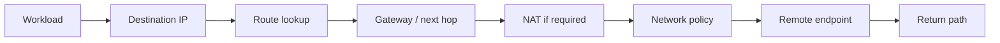
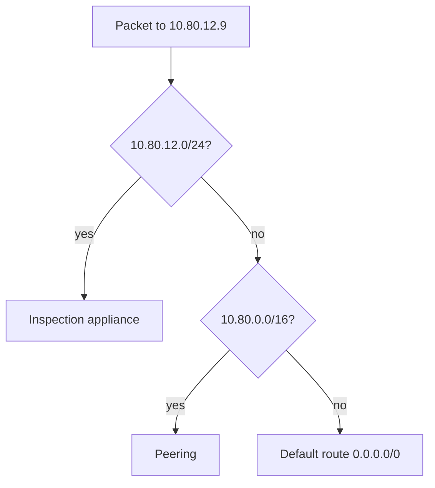
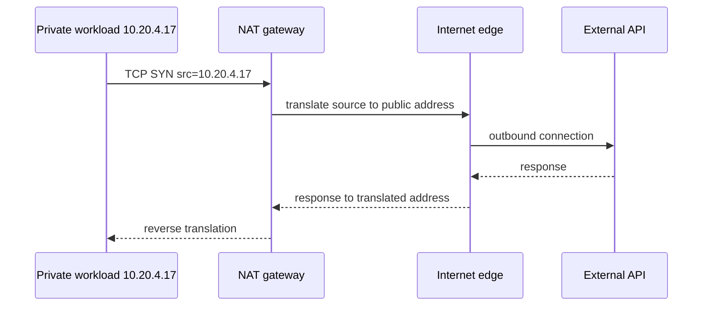

# Cloud Networking: Trace Reachability Through Routes, NAT, and Policy

## TL;DR

At 02:00 AM after a cloud migration, an application pod in a private Kubernetes cluster fails with `Connection timed out` trying to reach an external payment gateway. The developer insists: "DNS resolves cleanly and the database is reachable, so the network must be fine!" In reality, the pod's private subnet lacked a default route `0.0.0.0/0` pointing to a NAT Gateway, silently dropping outbound egress packets into a routing black hole while DNS lookups succeeded only because cluster DNS ran locally.

> 💡 **Rule of thumb:** **DNS resolution does not equal network reachability, and reachability does not equal application authorization.** Network reachability requires an unbroken bidirectional packet path: valid CIDR addressing, matching route table next hops (longest prefix match), network address translation (NAT), and stateful firewall/security group permission.

- **Packet path determinism:** Trace connectivity as a continuous sequence: source IP → routing table next hop → gateway/NAT translation → egress/ingress firewall policy → target host → return path.
- **Subnet topology & NAT:** Private subnets cannot route directly to the Internet; outbound egress requires an explicit route table entry mapping `0.0.0.0/0` to a NAT Gateway or proxy.
- **Stateful vs. stateless filtering:** Cloud security groups are stateful (inbound allows corresponding outbound); Network ACLs (NACLs) are stateless and require explicit ephemeral return port ranges (`1024-65535`).
- **Private endpoints & peering:** Services connected via VPC Peering or PrivateLink bypass public internet routing and NAT data transfer bottlenecks.
- **Fatal pitfall:** Diagnosing connectivity from DNS lookups alone—DNS only returns an IP candidate; if routing tables lack an egress next hop or security groups drop outbound SYN packets, connections time out silently with zero application-layer error feedback.

<TermBox term="CIDR Prefix">
A **CIDR prefix** describes an IP address range as an address plus prefix length, such as `10.20.0.0/16`. A longer prefix is more specific: `/24` describes a smaller range than `/16`.
</TermBox>

## Start with address space and subnets

A cloud virtual network normally owns one or more IP ranges. Subnets divide those ranges into smaller allocation and routing domains for workloads with similar connectivity needs.

RFC 1918 reserves private IPv4 ranges including `10.0.0.0/8`, `172.16.0.0/12`, and `192.168.0.0/16`. Cloud environments frequently use these ranges internally, but private addressing alone does not create isolation. Routing and network policy determine what can actually communicate.

CIDR planning has operational consequences:

- avoid overlapping ranges when networks may later connect through peering, VPN, or transit;
- leave space for growth rather than packing every subnet tightly;
- group workloads by connectivity and lifecycle needs, not only by team name;
- document which prefixes are routable to on-premises, other virtual networks, and service endpoints.

If `10.20.4.17` lives in `10.20.4.0/24`, that fact tells you where the address belongs. It does **not** yet tell you whether the workload can reach `10.80.12.9` or the public internet.

## A route maps a destination to a next hop

A route maps a **destination prefix** to a **target or next hop**. Depending on the provider, that target might be a local virtual-network path, internet gateway, NAT gateway, peering link, VPN, transit hub, appliance, or service endpoint.

<TermBox term="Next Hop">
A **next hop** is the next routing target selected for a packet. It is not necessarily the final destination; it may be a gateway, router, tunnel, or provider-managed virtual path.
</TermBox>

When multiple routes match, routing normally prefers the **longest prefix**, also described as the most specific route. For example:

| Destination | Target |
| --- | --- |
| `10.80.0.0/16` | peering connection |
| `10.80.12.0/24` | inspection appliance |
| `0.0.0.0/0` | NAT gateway |

Traffic to `10.80.12.9` should follow the `/24` route rather than the `/16` or default route because `/24` is more specific.

Do not troubleshoot only the configured route table name. Providers can combine system routes, propagated routes, custom routes, and policy-based behavior. Inspect the **effective route** seen by the workload or network interface whenever the platform exposes it.

## “Public” and “private” are reachability properties

The labels **public subnet** and **private subnet** are useful only when you state what they mean in that environment.

In AWS terminology, a subnet with a route to an internet gateway is considered public, while a subnet without that route is private. Other providers model internet access differently, so treat the durable concept as **internet reachability**, not the label itself.

For inbound internet reachability, several conditions may all matter:

- the workload or frontend has an address that can be reached from the internet;
- the subnet or virtual network has the required route/gateway path;
- ingress policy permits the source/protocol/port;
- the service is actually listening;
- the return path is valid.

A public IP by itself is not proof of inbound reachability.

## NAT changes addresses, not application trust

Private IPv4 addresses are not globally routable on the public internet. A common outbound pattern sends traffic from a private subnet to a NAT device or managed NAT gateway, which translates the source address before forwarding the packet toward an internet gateway or equivalent provider edge.

<TermBox term="NAT">
**Network Address Translation (NAT)** rewrites address information as traffic crosses a boundary. In common cloud IPv4 egress designs, many private workloads can initiate outbound connections through a smaller set of public addresses.
</TermBox>

This pattern usually allows **outbound/egress** connections initiated by private workloads without creating a general path for unsolicited **inbound/ingress** connections from the internet.

NAT is not a firewall and it is not IAM. It solves an addressing/translation problem. Use explicit network policy for traffic filtering and application authorization for who may perform an operation.

## Network policy is a separate gate

Cloud platforms expose constructs such as firewalls, security groups, network security groups, ACLs, or firewall policies. Their exact statefulness, attachment points, priorities, and default rules differ by provider.

Operate them with the same questions:

- **direction:** ingress or egress?
- **source:** which prefix, identity-derived target, or network object?
- **destination:** which workload or prefix?
- **protocol and port:** TCP 443, UDP 53, ICMP, or something else?
- **priority/evaluation:** which rule wins?
- **return traffic:** is it implicitly stateful or separately filtered?

Keep **network reachability** separate from **IAM/application authorization**. A packet can reach port 443 and still receive HTTP `403`. Conversely, perfect IAM permissions do not help if the TCP connection never reaches the service.

## DNS answers “where,” not “can I get there?”

DNS can resolve `api.internal.example` to an IP while the connection still times out because of a missing route, blocked egress rule, broken return path, or unavailable listener.

Private DNS also frequently works with a **private endpoint** or service endpoint. The name may resolve to a private address so traffic stays on provider-controlled networking rather than using a public service address. This can reduce public exposure, but you still need routing, endpoint policy, firewall policy, and service authorization to line up.

When debugging, record both the hostname and the resolved address. A stale or unexpected DNS answer can send a perfectly valid route lookup toward the wrong network.

## Connect networks deliberately

As systems grow, reachability may cross virtual-network boundaries:

- **peering** connects selected virtual networks directly or through provider-defined peering behavior;
- **VPN** carries traffic through encrypted tunnels between cloud and another network;
- **transit** or hub-and-spoke designs centralize routing among many connected networks;
- **private endpoints** expose one service privately without necessarily granting broad network adjacency.

Do not assume these mechanisms are interchangeable. Check transitivity, route propagation, overlapping CIDRs, firewall scope, DNS behavior, and failure domains before choosing one.

## Production scenario: DNS works, HTTPS still times out

A background worker runs in a private subnet. It calls `https://api.partner.example` to submit completed jobs. After a network change, DNS still resolves the hostname, but every HTTPS request times out and the job backlog grows.

**Impact:** Completed jobs cannot reach the partner API, queue age climbs, and retry traffic increases without making progress.

**Root cause:** A route-table change removed the worker subnet's default egress route to the NAT gateway. Engineers initially focused on DNS because name resolution was visible, but DNS success did not prove reachability to the resolved public address.

**Correct pattern:** Trace the packet path from the worker: resolve the destination, inspect the effective route for `0.0.0.0/0`, verify the NAT/gateway path, confirm egress policy, validate the return path, then test TCP/TLS and application behavior. Alert on route/NAT drift and outbound failure rather than relying on retries to mask connectivity loss.

Mental-model check: the hostname resolves, but TCP 443 times out. What should you inspect next?

Do not keep changing DNS simply because it was the first visible layer. Capture the resolved destination IP, inspect the source workload's effective route to that IP, identify the selected next hop, verify NAT or gateway health if translation is required, check egress and destination ingress policy, and confirm the return path. Only after network reachability is established should you move up to TLS and application authorization.

## A practical reachability runbook

Use the same order every time so debugging is evidence-driven rather than provider-console archaeology:

- [ ] **Identify endpoints:** Record source interface/IP, destination hostname/IP, protocol, and port.
- [ ] **Verify DNS intentionally:** Confirm the answer is expected for this network and environment.
- [ ] **Inspect effective routing:** Find the matching destination prefix and selected target/next hop.
- [ ] **Check translation/gateways:** Verify NAT, internet gateway, private endpoint, VPN, peering, or transit dependencies on the path.
- [ ] **Evaluate policy both ways:** Inspect ingress/egress filters and whether return traffic is stateful or separately controlled.
- [ ] **Check the return path:** Asymmetric or missing return routing can look like an outbound timeout.
- [ ] **Move up the stack:** Once TCP works, inspect TLS, HTTP, IAM, and application authorization separately.
- [ ] **Use flow evidence:** Prefer flow logs, effective-route views, reachability analyzers, and connection telemetry over assumptions.

## Common mistakes

**“It has a public IP, so it is public.”** Address assignment is only one condition. Routing, gateway attachment, policy, and return paths still matter.

**“The security group allows 443, so it should work.”** An allow rule cannot manufacture a missing route or NAT path.

**“Private subnet means no internet.”** A private workload can still have controlled outbound internet access through NAT or provider-specific egress mechanisms.

**“NAT makes it secure.”** NAT changes addressing. Security policy and authorization are separate controls.

**“DNS works, therefore networking works.”** DNS proves name resolution for that query. It does not prove the resolved address is reachable.

## Agent rules

- [ ] **Trace before editing:** Describe the expected packet path before changing routes or firewall rules.
- [ ] **Prefer least reachability:** Open only the source, destination, protocol, and direction required by the workload.
- [ ] **Avoid accidental adjacency:** Prefer a private endpoint when one service needs access and broad network peering is unnecessary.
- [ ] **Treat defaults as provider-specific:** Verify system routes, stateful filtering, and gateway behavior instead of assuming AWS/GCP/Azure semantics are identical.
- [ ] **Preserve observability:** Network changes should keep flow logs, route inspection, and failure telemetry usable during incidents.

## Review questions

- [ ] Can you explain why a CIDR prefix and a subnet do not by themselves define reachability?
- [ ] Can you select the most specific route when several prefixes match the same destination?
- [ ] Can you separate public addressing, routing, NAT, and filtering policy in a packet path?
- [ ] Can you explain why DNS success, TCP reachability, TLS success, and application authorization are four different checks?
- [ ] Can you choose between peering, VPN/transit, and a private endpoint based on the reachability boundary you actually need?

## Primary sources

- [RFC 4632 — Classless Inter-domain Routing (CIDR)](https://www.rfc-editor.org/rfc/rfc4632)
- [RFC 1918 — Address Allocation for Private Internets](https://www.rfc-editor.org/rfc/rfc1918)
- [AWS VPC — Route tables](https://docs.aws.amazon.com/vpc/latest/userguide/VPC_Route_Tables.html)
- [AWS VPC — Internet gateways](https://docs.aws.amazon.com/vpc/latest/userguide/VPC_Internet_Gateway.html)
- [AWS VPC — NAT devices](https://docs.aws.amazon.com/vpc/latest/userguide/vpc-nat.html)
- [Google Cloud VPC — Routes](https://cloud.google.com/vpc/docs/routes)
- [Azure Virtual Network — Traffic routing](https://learn.microsoft.com/azure/virtual-network/virtual-networks-udr-overview)
- [Azure Virtual Network — Network security groups](https://learn.microsoft.com/azure/virtual-network/network-security-groups-overview)
- [Azure Private Link — Private endpoint overview](https://learn.microsoft.com/azure/private-link/private-endpoint-overview)

## Related lessons

- [DNS Resolution & TLS](/docs/web-platform/dns-resolution-and-tls)
- [Backend Request Lifecycle](/docs/backend-engineering/backend-request-lifecycle)
- [Service Resilience](/docs/backend-engineering/service-resilience)
- [Threat Modeling & Least Privilege](/docs/security/threat-modeling-and-least-privilege)
