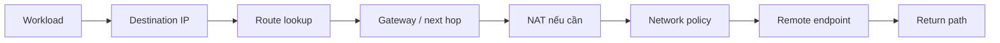
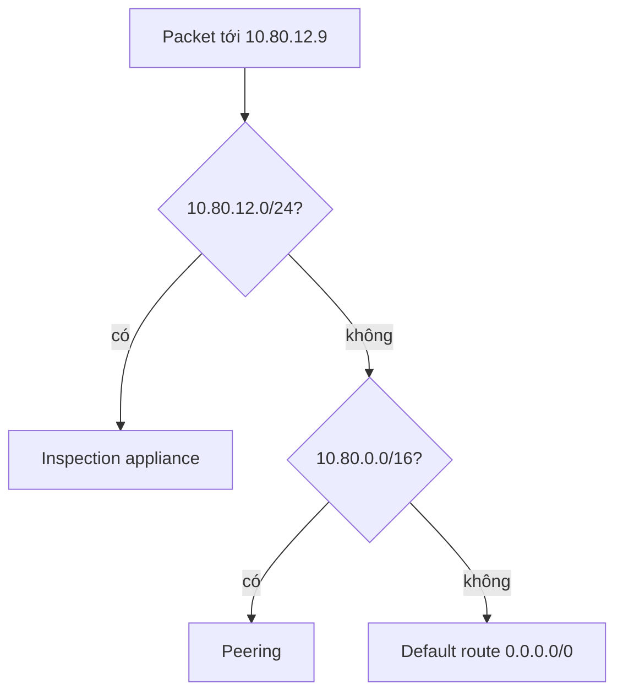
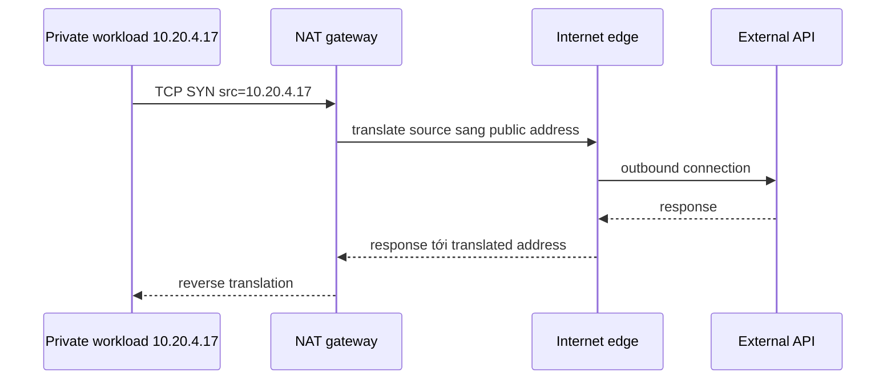

# Cloud Networking: Lần theo khả năng kết nối qua Route, NAT và Policy

## TL;DR

Vào 02:00 sáng sau đợt di chuyển hạ tầng, một pod ứng dụng trong cụm Kubernetes nội bộ liên tục ném lỗi `Connection timed out` khi gọi ra cổng thanh toán bên ngoài. Kỹ sư phụ trách khẳng định: "DNS vẫn phân giải ra IP bình thường và pod vẫn kết nối được cơ sở dữ liệu nội bộ, mạng chắc chắn không có vấn đề!" Thực tế là subnet riêng của pod thiếu một route mặc định `0.0.0.0/0` trỏ ra NAT Gateway, khiến toàn bộ gói tin đi ra ngoài bị rơi vào hố đen định tuyến, trong khi DNS phân giải thành công chỉ vì cụm CoreDNS chạy cục bộ bên trong mạng ảo.

> 💡 **Quy tắc bỏ túi:** **DNS phân giải thành công không đồng nghĩa với khả năng kết nối mạng, và thông mạng không đồng nghĩa với ứng dụng cho phép truy cập.** Kết nối mạng đòi hỏi một đường đi gói tin hai chiều liền mạch: định địa chỉ CIDR hợp lệ, next hop khớp trên bảng định tuyến (longest prefix match), cổng dịch địa chỉ (NAT), và quy tắc tường lửa/security group cho phép ở cả hai chiều.

- **Tính tất định của đường đi gói tin:** Lần theo luồng kết nối như một chuỗi quyết định liên tục: IP nguồn → next hop trên bảng định tuyến → cổng dịch địa chỉ NAT → chính sách tường lửa egress/ingress → máy chủ đích → đường phản hồi đối xứng.
- **Cấu trúc Subnet & NAT:** Subnet riêng không thể đi thẳng ra Internet công cộng; luồng egress bắt buộc phải có route trỏ `0.0.0.0/0` đến một NAT Gateway hoặc cụm proxy trung gian.
- **Lọc lưu lượng stateful và stateless:** Security group có trạng thái (stateful: cho phép vào sẽ tự động mở chiều ra); Network ACL (NACL) là phi trạng thái (stateless), đòi hỏi phải mở thủ công dải port phản hồi ngẫu nhiên (`1024-65535`).
- **Endpoint riêng & Peering:** Các dịch vụ kết nối qua VPC Peering hoặc PrivateLink giúp luồng dữ liệu nội bộ đi tắt qua backbone của nhà cung cấp đám mây, tránh chi phí NAT đắt đỏ và rủi ro internet công cộng.
- **Cạm bẫy chết người:** Đánh giá độ thông suốt mạng chỉ dựa trên kết quả phân giải DNS—DNS chỉ trả về địa chỉ IP; nếu bảng định tuyến thiếu next hop hoặc security group chặn gói tin SYN gửi đi, kết nối sẽ bị timeout trong im lặng mà không có bất kỳ thông báo lỗi cấp ứng dụng nào.

<TermBox term="CIDR Prefix">
**CIDR prefix** mô tả một dải địa chỉ IP bằng địa chỉ cộng với prefix length, ví dụ `10.20.0.0/16`. Prefix dài hơn cụ thể hơn: `/24` mô tả dải nhỏ hơn `/16`.
</TermBox>

## Bắt đầu từ address space và subnet

Một cloud virtual network thường sở hữu một hoặc nhiều dải IP. Subnet chia các dải đó thành những vùng cấp phát và routing nhỏ hơn cho các workload có nhu cầu kết nối tương tự.

RFC 1918 dành riêng các dải IPv4 private gồm `10.0.0.0/8`, `172.16.0.0/12` và `192.168.0.0/16`. Cloud environment thường dùng các dải này nội bộ, nhưng private addressing tự nó không tạo isolation. Routing và network policy mới quyết định workload nào thực sự giao tiếp được với workload nào.

CIDR planning có hệ quả vận hành rõ ràng:

- tránh dải chồng lấn nếu các mạng có thể sẽ nối qua peering, VPN hoặc transit;
- chừa không gian tăng trưởng thay vì nhồi mọi subnet quá sát;
- nhóm workload theo nhu cầu connectivity và lifecycle, không chỉ theo team;
- tài liệu hóa prefix nào routable tới on-premises, virtual network khác và service endpoint.

Nếu `10.20.4.17` nằm trong `10.20.4.0/24`, thông tin đó cho biết địa chỉ thuộc dải nào. Nó **chưa** cho biết workload có tới được `10.80.12.9` hay public internet hay không.

## Route ánh xạ destination sang next hop

Một route ánh xạ **đích (destination prefix)** sang **target hoặc next hop**. Tùy provider, target đó có thể là local virtual-network path, internet gateway, NAT gateway, peering link, VPN, transit hub, appliance hoặc service endpoint.

<TermBox term="Next Hop">
**Next hop** là routing target kế tiếp được chọn cho gói tin. Nó không nhất thiết là destination cuối cùng; đó có thể là gateway, router, tunnel hoặc một virtual path do provider quản lý.
</TermBox>

Khi nhiều route cùng match, routing thường ưu tiên **tiền tố dài nhất**, hay route cụ thể nhất. Ví dụ:

| Destination | Target |
| --- | --- |
| `10.80.0.0/16` | peering connection |
| `10.80.12.0/24` | inspection appliance |
| `0.0.0.0/0` | NAT gateway |

Traffic tới `10.80.12.9` nên đi theo route `/24` thay vì `/16` hoặc default route vì `/24` cụ thể hơn.

Đừng chỉ nhìn tên route table đã cấu hình. Provider có thể kết hợp system route, propagated route, custom route và policy-based behavior. Hãy inspect **effective route** mà workload hoặc network interface thực sự nhìn thấy khi platform hỗ trợ.

## “Public” và “private” là thuộc tính reachability

Các nhãn **public subnet** và **private subnet** chỉ hữu ích khi bạn nói rõ chúng có nghĩa gì trong environment cụ thể.

Trong thuật ngữ AWS, subnet có route tới internet gateway được xem là public, còn subnet không có route đó được xem là private. Provider khác mô hình hóa internet access khác nhau, nên durable concept cần giữ là **internet reachability**, không phải tên nhãn.

Để có inbound internet reachability, nhiều điều kiện có thể cùng phải đúng:

- workload hoặc frontend có địa chỉ có thể được route từ internet;
- subnet hay virtual network có route/gateway path cần thiết;
- ingress policy cho phép source/protocol/port;
- service thực sự đang listen;
- return path hợp lệ.

Có public IP tự nó không chứng minh inbound reachability.

## NAT đổi địa chỉ, không quyết định application trust

Private IPv4 address không globally routable trên public internet. Một pattern outbound phổ biến gửi traffic từ private subnet tới NAT device hoặc managed NAT gateway, nơi source address được translate trước khi packet đi tiếp tới internet gateway hoặc provider edge tương đương.

<TermBox term="NAT">
**Network Address Translation (NAT)** rewrite thông tin địa chỉ khi traffic đi qua một boundary. Trong thiết kế IPv4 egress phổ biến trên cloud, nhiều private workload có thể khởi tạo outbound connection thông qua một tập public address nhỏ hơn.
</TermBox>

Pattern này thường cho phép connection **outbound/egress** do private workload khởi tạo mà không mở một đường **inbound/ingress** tổng quát cho unsolicited connection từ internet.

NAT không phải firewall và cũng không phải IAM. Nó giải quyết bài toán addressing/translation. Hãy dùng network policy tường minh để filter traffic và application authorization để quyết định ai được thực hiện operation.

## Network policy là một gate riêng

Cloud platform cung cấp các construct như firewall, security group, network security group, ACL hoặc firewall policy. Stateful behavior, attachment point, priority và default rule cụ thể khác nhau giữa provider.

Hãy vận hành chúng bằng cùng một bộ câu hỏi:

- **direction:** ingress hay egress?
- **source:** prefix, identity-derived target hay network object nào?
- **destination:** workload hoặc prefix nào?
- **protocol và port:** TCP 443, UDP 53, ICMP hay thứ khác?
- **priority/evaluation:** rule nào thắng?
- **return traffic:** được xử lý statefully hay cần policy riêng?

Tách **network reachability** khỏi **IAM/application authorization**. Packet có thể tới port 443 nhưng vẫn nhận HTTP `403`. Ngược lại, IAM permission hoàn hảo cũng không giúp gì nếu TCP connection chưa bao giờ tới được service.

## DNS trả lời “ở đâu”, không trả lời “có tới được không?”

DNS có thể resolve `api.internal.example` thành IP trong khi connection vẫn timeout vì thiếu route, egress rule bị block, return path hỏng hoặc service chưa listen.

Private DNS cũng thường phối hợp với **private endpoint** hoặc service endpoint. Tên có thể resolve thành private address để traffic ở trên provider-controlled networking thay vì dùng public service address. Điều này giúp giảm public exposure, nhưng routing, endpoint policy, firewall policy và service authorization vẫn phải khớp nhau.

Khi debug, hãy ghi lại cả hostname lẫn resolved address. DNS answer stale hoặc bất ngờ có thể khiến một route lookup hoàn toàn hợp lệ đi tới sai network.

## Kết nối các network có chủ đích

Khi hệ thống lớn lên, reachability có thể đi qua ranh giới virtual network:

- **peering** kết nối các virtual network được chọn trực tiếp hoặc theo peering behavior do provider định nghĩa;
- **VPN** mang traffic qua encrypted tunnel giữa cloud và network khác;
- **transit** hoặc hub-and-spoke tập trung routing giữa nhiều connected network;
- **private endpoint** cho phép một service được truy cập riêng mà không nhất thiết mở broad network adjacency.

Đừng giả định các cơ chế này thay thế lẫn nhau. Hãy kiểm tra transitivity, route propagation, CIDR overlap, firewall scope, DNS behavior và failure domain trước khi chọn.

## Production scenario: DNS hoạt động, HTTPS vẫn timeout

Một background worker chạy trong private subnet. Nó gọi `https://api.partner.example` để gửi job đã hoàn tất. Sau một thay đổi network, DNS vẫn resolve hostname nhưng mọi HTTPS request đều timeout và backlog job tăng lên.

**Hậu quả:** Job hoàn tất không thể tới partner API, queue age tăng và retry traffic nhiều hơn nhưng không tạo tiến triển.

**Nguyên nhân cốt lõi:** Một thay đổi route table đã xóa default egress route từ worker subnet tới NAT gateway. Team ban đầu tập trung vào DNS vì name resolution vẫn quan sát được, nhưng DNS thành công không chứng minh reachability tới public address đã resolve.

**Cách khắc phục chuẩn:** Lần theo đường đi của gói tin từ worker: resolve destination, inspect effective route cho `0.0.0.0/0`, xác minh NAT/gateway path, kiểm tra egress policy, xác nhận return path, rồi mới test TCP/TLS và application behavior. Alert trên route/NAT drift và outbound failure thay vì dùng retry để che connectivity loss.

Mental-model check: hostname resolve được nhưng TCP 443 timeout. Nên kiểm tra gì tiếp?

Đừng tiếp tục sửa DNS chỉ vì đó là layer dễ nhìn thấy đầu tiên. Ghi lại destination IP đã resolve, inspect effective route của source workload tới IP đó, xác định next hop được chọn, kiểm tra NAT hoặc gateway nếu cần translation, kiểm tra egress và destination ingress policy, rồi xác nhận return path. Chỉ sau khi network reachability được chứng minh mới chuyển lên TLS và application authorization.

## Runbook reachability thực tế

Dùng cùng một thứ tự mỗi lần để debugging dựa trên evidence thay vì đi lang thang trong provider console:

- [ ] **Xác định endpoint:** Ghi source interface/IP, destination hostname/IP, protocol và port.
- [ ] **Kiểm tra DNS có chủ đích:** Xác nhận answer đúng với network và environment này.
- [ ] **Inspect effective routing:** Tìm destination prefix match và target/next hop được chọn.
- [ ] **Kiểm tra translation/gateway:** Xác minh NAT, internet gateway, private endpoint, VPN, peering hoặc transit dependency trên path.
- [ ] **Đánh giá policy hai chiều:** Inspect ingress/egress filter và cách return traffic được xử lý.
- [ ] **Kiểm tra return path:** Routing quay về bất đối xứng hoặc bị thiếu có thể nhìn giống outbound timeout.
- [ ] **Đi lên stack:** Khi TCP hoạt động, tách riêng TLS, HTTP, IAM và application authorization.
- [ ] **Dùng flow evidence:** Ưu tiên flow log, effective-route view, reachability analyzer và connection telemetry thay vì phỏng đoán.

## Sai lầm phổ biến

**“Có public IP nên nó public.”** Address assignment chỉ là một điều kiện. Routing, gateway attachment, policy và return path vẫn quan trọng.

**“Security group cho phép 443 nên phải chạy.”** Allow rule không thể tạo ra route hoặc NAT path đang thiếu.

**“Private subnet nghĩa là không có internet.”** Private workload vẫn có thể có controlled outbound internet access qua NAT hoặc provider-specific egress mechanism.

**“NAT làm nó an toàn.”** NAT đổi addressing. Security policy và authorization là các control riêng.

**“DNS chạy nên networking chạy.”** DNS chỉ chứng minh name resolution cho query đó. Nó không chứng minh resolved address reachable.

## Agent rules

- [ ] **Trace trước khi sửa:** Mô tả expected packet path trước khi thay route hoặc firewall rule.
- [ ] **Ưu tiên least reachability:** Chỉ mở source, destination, protocol và direction mà workload thực sự cần.
- [ ] **Tránh adjacency ngoài ý muốn:** Ưu tiên private endpoint khi chỉ một service cần được truy cập và broad network peering là không cần thiết.
- [ ] **Xem default là provider-specific:** Xác minh system route, stateful filtering và gateway behavior thay vì giả định AWS/GCP/Azure giống nhau.
- [ ] **Giữ observability:** Network change phải giữ flow log, route inspection và failure telemetry dùng được trong incident.

## Review questions

- [ ] Bạn có giải thích được vì sao CIDR prefix và subnet tự chúng chưa định nghĩa reachability không?
- [ ] Bạn có chọn được route cụ thể nhất khi nhiều prefix cùng match destination không?
- [ ] Bạn có tách public addressing, routing, NAT và filtering policy trong một packet path không?
- [ ] Bạn có giải thích được vì sao DNS success, TCP reachability, TLS success và application authorization là bốn check khác nhau không?
- [ ] Bạn có chọn được giữa peering, VPN/transit và private endpoint dựa trên reachability boundary thực sự cần không?

## Nguồn chính

- [RFC 4632 — Classless Inter-domain Routing (CIDR)](https://www.rfc-editor.org/rfc/rfc4632)
- [RFC 1918 — Address Allocation for Private Internets](https://www.rfc-editor.org/rfc/rfc1918)
- [AWS VPC — Route tables](https://docs.aws.amazon.com/vpc/latest/userguide/VPC_Route_Tables.html)
- [AWS VPC — Internet gateways](https://docs.aws.amazon.com/vpc/latest/userguide/VPC_Internet_Gateway.html)
- [AWS VPC — NAT devices](https://docs.aws.amazon.com/vpc/latest/userguide/vpc-nat.html)
- [Google Cloud VPC — Routes](https://cloud.google.com/vpc/docs/routes)
- [Azure Virtual Network — Traffic routing](https://learn.microsoft.com/azure/virtual-network/virtual-networks-udr-overview)
- [Azure Virtual Network — Network security groups](https://learn.microsoft.com/azure/virtual-network/network-security-groups-overview)
- [Azure Private Link — Private endpoint overview](https://learn.microsoft.com/azure/private-link/private-endpoint-overview)

## Bài liên quan

- [Phân giải DNS & TLS](/vi/docs/web-platform/dns-resolution-and-tls)
- [Vòng đời Request phía Backend](/vi/docs/backend-engineering/backend-request-lifecycle)
- [Service Resilience](/vi/docs/backend-engineering/service-resilience)
- [Threat Modeling & Đặc quyền Tối thiểu](/vi/docs/security/threat-modeling-and-least-privilege)
