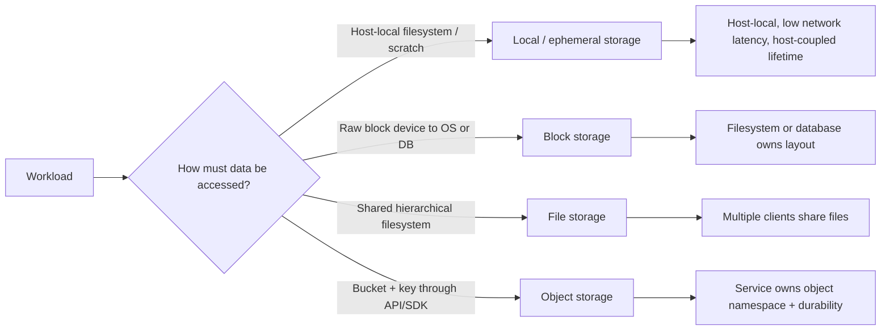
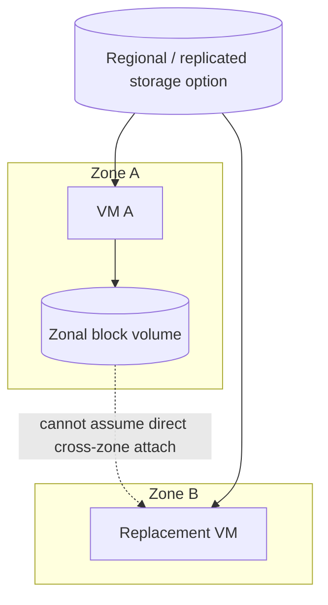
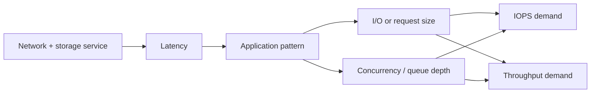
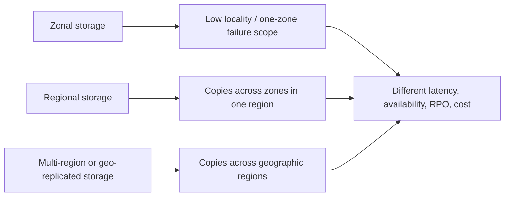

# Cloud Storage Models: Reason About Block, File, Object, and Local State

## TL;DR

On April 21, 2011, a network change in one AWS Availability Zone disrupted Amazon EBS replication traffic. When connectivity returned, many block-storage nodes tried to rebuild replicas at once, exhausting spare capacity and producing a **re-mirroring storm**. About 13% of the EBS volumes in the affected zone became "stuck" at the peak, and pressure from the degraded zonal cluster also caused regional EBS control-plane API latency and failures. The lesson is not that block storage is unreliable; it is that **a storage product's access model, replication topology, control plane, and failure domain are part of the application architecture**.

> 💡 **Rule of thumb:** Choose storage by **the contract the workload needs**, not by the word "persistent." First decide how data is addressed and shared, then reason about latency/IOPS/throughput, failure scope, durability versus availability, recovery objectives, and total cost.

- **Local, block, file, and object storage expose different interfaces:** A local disk belongs to one host, block storage exposes sectors/blocks to an OS, file storage exposes shared filesystem semantics, and object storage exposes named objects through an API.
- **Persistence does not define failure scope:** A disk can outlive a VM and still be zonal; a file service can be regional; an object class can span multiple zones or deliberately stay in one zone.
- **Performance has multiple dimensions:** IOPS, throughput, latency, I/O or request size, queue depth, metadata rate, and client concurrency interact differently for databases, shared filesystems, and object workloads.
- **Replication, snapshots, and backups solve different problems:** Replication helps survive infrastructure failure, snapshots capture point-in-time state, and backups provide a recovery policy with retention and restore testing. None is automatically a substitute for the others.
- **Fatal pitfall:** Calling a storage system "highly durable" and assuming that means the application can always read/write it, restore deleted data, survive a zone/region failure, or meet its RPO. Durability, availability, recoverability, and locality are separate contracts.



<TermBox term="Storage Model">
A **storage model** is the combination of how data is addressed, which operations are exposed, who may access it concurrently, how it is attached or reached, and what failure/performance contract surrounds it. "Persistent storage" is too broad to choose a design safely.
</TermBox>

## Start with the access contract, not the product name

The most important question is not "Which storage service is cheapest?" It is:

> **What interface does the application believe storage provides?**

That interface determines what the application can assume about naming, locking, atomicity, sharing, and locality.

### Local / ephemeral storage

Local storage such as instance-store NVMe or local SSD is physically or logically tied closely to one compute host.

Typical properties:

- very low latency and high throughput;
- no network hop in the normal I/O path;
- useful for scratch space, caches, shuffle files, temporary build output, and replicated systems that already own durability;
- data lifetime is coupled to the host or instance lifecycle according to the provider contract.

If a container writes to a host-local disk and the workload is rescheduled elsewhere, the bytes do not magically follow it. Treat local storage as **ephemeral** unless the platform explicitly provides another durability mechanism.

### Block storage

**Block storage** exposes a block device to a VM or host. The operating system may partition and format it, mount a filesystem, or give it directly to a database or volume manager.

```text
managed block volume -> attach to compute -> partition/format -> filesystem or database -> files/pages/records
```

Block storage is a strong fit when software expects a disk-like device and benefits from predictable low-latency random I/O.

AWS EBS volumes, Google Persistent Disk/Hyperdisk, and Azure Managed Disks are examples, but their attachment modes, zonal/regional options, performance provisioning, and multi-writer capabilities are **provider- and product-specific**.

<TermBox term="Failure Domain">
A **failure domain** is the infrastructure scope that can fail together: a device, host, rack, zone, region, account/control plane, or another shared dependency. Replication inside one domain can improve component durability without making the workload independent of that domain.
</TermBox>

## A persistent block volume can still be zonal

Persistence means the data can outlive one compute instance. It does **not** mean the same volume is attachable from anywhere.

For example, a standard Amazon EBS volume is created in an Availability Zone and is attached to EC2 instances in that same zone. Google offers both zonal and regional persistent disks; regional options synchronously replicate across two zones. Azure Managed Disks support redundancy choices such as locally redundant or zone-redundant variants depending on disk type and region.

That makes failover a placement problem:



If the application claims multi-zone availability, storage placement must participate in that claim. Options include:

- a regional/multi-zone block product;
- database-level synchronous replication to another zone;
- application-level replication;
- failover from snapshot/backup with a longer RTO;
- redesigning durable state into another storage model.

The right choice depends on write latency, consistency, cost, and recovery objectives.

## File storage is a shared filesystem service

**File storage** exposes familiar hierarchical files and directories through protocols such as NFS or SMB. Multiple compute clients can often mount the same share concurrently.

Examples include Amazon EFS, Google Filestore, and Azure Files.

This is valuable for workloads that expect:

- directory traversal;
- filesystem permissions and identities;
- shared files visible to many hosts;
- file locking or protocol-specific coordination;
- lift-and-shift applications that assume NAS-like storage.

But a managed network filesystem is not "a bigger local disk." Every metadata lookup, open, stat, small write, and lock crosses a distributed service boundary.

A workload that performs millions of tiny metadata operations can behave very differently from one that streams large sequential files, even when total data volume is identical.

## Object storage is API-addressed, not a POSIX disk

**Object storage** exposes objects in a bucket/container namespace through HTTP/REST APIs, SDKs, signed requests, or compatible protocols. The service, not your VM's filesystem, owns the object namespace and redundancy.

Examples include Amazon S3, Google Cloud Storage, and Azure Blob Storage.

Object storage is often a strong fit for:

- uploads and media;
- backups and archives;
- logs and analytics data;
- immutable or append-by-new-object artifacts;
- data shared across many independent compute clients.

Do not assume ordinary POSIX behaviors such as in-place random writes, directory rename semantics, file locks, or memory mapping simply because a FUSE layer can present objects as paths.

For object-specific semantics such as identity, multipart upload, versioning, checksums, consistency, metadata ownership, and lifecycle policy, use the dedicated [Object Storage](/docs/data-systems/object-storage) lesson for the deeper treatment.

## Sharing semantics are part of correctness

Ask who may access the same data at the same time.

### Local

Usually one host owns the local device. Sharing requires another layer such as a network service or application replication.

### Block

A block volume commonly has one primary writer attachment. Some products offer **multi-attach** or shared-disk modes, but shared block access is not equivalent to a shared filesystem. The operating system/filesystem must be cluster-aware if multiple writers can modify the same blocks.

Mounting the same ordinary filesystem read-write from two machines without the correct coordination can corrupt data.

### File

The service is designed for multiple filesystem clients, but semantics still depend on protocol, locking, caching, identity, and client behavior.

### Object

Many clients can address the same bucket and objects concurrently through the API. Conflict semantics are API-specific: overwrites, conditional requests, versioning, and consistency must be reasoned about at the object layer.

## Performance is a vector, not one number

<TermBox term="IOPS, Throughput, and Latency">
**IOPS** measures operations per second, **throughput** measures bytes transferred per unit time, and **latency** measures how long an operation takes. They interact with I/O size, request size, queue depth, concurrency, caching, and service limits; maximizing one does not automatically maximize the others.
</TermBox>



Think in workload shapes:

| Workload | Dominant concerns |
| --- | --- |
| OLTP database on block storage | low latency, small random I/O, sustained IOPS, write durability |
| Large sequential scans | throughput, large I/O size, queue depth |
| Shared source tree / CMS on file storage | metadata latency, file locks, many small operations |
| Media/object pipeline | request concurrency, object size, API throughput, retrieval cost |
| Build cache / scratch data | local latency, replaceability, rebuild cost |

AWS EBS explicitly separates SSD options for small/random transactional I/O from HDD options optimized around throughput. Amazon EFS exposes throughput modes and notes per-operation latency in a distributed filesystem. Similar product-specific performance controls exist across Google Cloud and Azure.

Measure the access pattern before choosing the tier.

## Durability and availability answer different questions

**Durability:** "If infrastructure fails, how likely is the data to remain intact?"

**Availability:** "Can the application successfully read or write the data now?"

A service can be highly durable while temporarily unavailable. During the 2011 EBS incident, many affected volumes retained replicas yet were "stuck" because the system could not safely choose/restore a writable replica until replication and control-plane state recovered.

Likewise, a storage class can protect bytes across zones while an application's network, credentials, mount process, DNS, control plane, or dependency path prevents access.

Do not turn a durability percentage into an application availability SLO.

## Zonal, regional, and multi-region are topology choices



The topology changes failure behavior:

- **zonal** storage keeps the data path close to compute but couples availability to one zone;
- **regional** storage can survive a zonal failure by synchronously or otherwise replicating across zones, depending on the product;
- **multi-region / geo-replicated** storage expands disaster tolerance but may introduce asynchronous replication, failover procedures, higher write latency, higher cost, or a non-zero recovery point.

Provider terminology is not interchangeable.

Amazon S3 Standard redundantly stores objects across at least three Availability Zones in a Region, while S3 also offers single-zone classes for workloads that intentionally choose a smaller failure domain. Google Cloud exposes regional, dual-region, and multi-region object placement plus zonal/regional block and file options. Azure exposes LRS, ZRS, GRS/GZRS and other redundancy choices across storage services, with different failover and read-access behavior.

Always verify the exact selected product/tier.

## Replication, snapshot, and backup are not synonyms

### Replication

**Replication** keeps additional copies or replicas to improve availability/durability and sometimes read scale.

But replication often copies mistakes too:

- accidental delete;
- corrupted application write;
- ransomware-encrypted data;
- buggy migration;
- logically invalid record.

Replication is not automatically a historical recovery mechanism.

### Snapshot

A **snapshot / point-in-time copy** captures storage state at a moment or logical point.

Snapshots are useful for:

- fast volume reconstruction;
- cloning environments;
- rollback before risky maintenance;
- incremental protection when the product supports it.

But a snapshot can still share provider, account, region, credentials, or administrative blast radius with the source.

### Backup

A **backup** is part of a recovery policy: what is copied, how often, how long it is retained, who can delete it, where it is isolated, and how restore is tested.

A serious backup design states:

- **RPO (Recovery Point Objective):** how much recent data loss is acceptable;
- **RTO (Recovery Time Objective):** how long recovery may take;
- retention;
- immutability or deletion protection;
- region/account isolation when required;
- restore verification.

A nightly snapshot with no restore test is a copy, not evidence that recovery works.

## Storage consistency lives at different layers

With local and block storage, the block device does not by itself give application-level transaction semantics. Filesystem journaling, database WAL, fsync behavior, write ordering, caches, and application protocol still matter.

With file storage, protocol/client caching and locking behavior become part of consistency.

With object storage, consistency is defined by the object service API. Amazon S3 currently documents strong consistency for object PUT/DELETE/GET and listing behavior, but that should not be generalized to every object store, gateway, cache, or replication topology.

Use the contract of the exact service and layer where the application observes state.

## Cost follows access pattern and recovery topology

Storage cost is not only "GB per month."

Model:

- provisioned capacity;
- provisioned IOPS or throughput;
- request/operation charges;
- snapshot and backup capacity;
- cross-zone or cross-region transfer;
- internet **egress**;
- retrieval fees for infrequent/archive tiers;
- minimum storage duration;
- archive restore time;
- duplicated data for replication;
- idle warm capacity for recovery.

A cold archive tier can be cheap per GB and still be wrong if restore takes hours while the application's RTO is 20 minutes.

Similarly, a shared file service can cost more than object storage but save a costly application rewrite when true filesystem semantics are required.

## Provider examples: map the concept, then read the exact contract

| Storage need | AWS examples | Google Cloud examples | Azure examples |
| --- | --- | --- | --- |
| Local / ephemeral | EC2 Instance Store | Local SSD | VM temporary/local NVMe storage where offered |
| Block | **EBS** | **Persistent Disk / Hyperdisk** | **Managed Disks** |
| Shared file | **EFS** | **Filestore** | **Azure Files** |
| Object | **S3** | **Cloud Storage** | **Blob Storage** |

The table maps concepts, not equivalence. These products **differ** in attachment rules, protocols, replication topology, performance knobs, consistency behavior, quotas, durability targets, failover, and pricing.

For example:

- EBS is a block service whose normal volume placement is zonal; EBS snapshots provide a separate recovery path.
- Google regional Persistent Disk and Hyperdisk Balanced High Availability can replicate block data synchronously across two zones.
- Azure Files exposes managed SMB/NFS file shares; Azure Storage redundancy choices include zonal and geo-replicated options for supported service/account types.
- Object offerings have their own storage classes and geographic placement choices.

Read the current provider documentation before turning a generic architecture into deployment configuration.

## Production micro-scenario: "persistent disk" blocks a zone failover

A stateful service runs on VM A in Zone A with a zonal managed block volume. The team adds VM B in Zone B and a load balancer, then documents the service as "multi-zone." During a Zone A outage, traffic moves to VM B, but the application cannot attach or mount the Zone A volume.

- **Impact:** Compute failover succeeds, but the service still cannot start because its only authoritative data volume remains tied to the failed zone.
- **Root cause:** The team treated "persistent" as "regionally available." It designed redundant compute without giving storage the same failure-domain objective.
- **Correct pattern:** Choose a regional/multi-zone block option or replicate state at the database/application layer, define RPO/RTO, keep an independent backup path, and test failover plus restore—not only VM replacement.

## Check your mental model

> **Scenario:** A team stores user files in object storage, mounts the bucket through a FUSE adapter on two application VMs, and concludes it can now treat the bucket exactly like an NFS filesystem with POSIX locking and atomic directory renames.

<details>
<summary>Show the reasoning</summary>

The mount changes the interface presented to the process; it does not necessarily change the underlying object service semantics.

A FUSE adapter may emulate paths, metadata, rename, or caching through multiple object API calls. Locking, atomicity, consistency, file-descriptor behavior, performance, and failure handling can therefore differ from a true shared filesystem.

If the application requires filesystem semantics, validate the adapter contract explicitly or use managed file storage. If it really needs object semantics, use the object API directly and design around object identity and conditional operations.

</details>

## Cloud storage reasoning checklist

- [ ] **Access model:** Does the workload need host-local bytes, a block device, a shared filesystem, or an object API?
- [ ] **Sharing:** Is there one writer, many readers, many filesystem clients, or many independent API clients?
- [ ] **Attachment:** Which zones/regions can attach or mount the storage, and what happens during compute replacement?
- [ ] **Performance:** What are the measured latency, IOPS, throughput, I/O/request size, metadata rate, and concurrency requirements?
- [ ] **Durability:** Which device/zone/region failures can the storage survive without losing data?
- [ ] **Availability:** During those failures, can the application still read and write, or is failover/manual recovery required?
- [ ] **Consistency:** Which layer defines ordering, locking, atomicity, and read-after-write behavior?
- [ ] **Recovery:** Are replication, snapshots, and backups assigned distinct jobs with explicit RPO/RTO?
- [ ] **Restore test:** Has the team restored data into a clean environment and measured the real RTO?
- [ ] **Tiering:** Do storage class, archive latency, retrieval fees, and minimum duration match the access pattern?
- [ ] **Cost:** Are IOPS/throughput, requests, snapshots, replication, cross-zone traffic, retrieval, and egress included?
- [ ] **Failure drill:** Can the system survive instance loss, zone loss, storage API degradation, accidental deletion, and a bad write?

## Boundary with Object Storage

This lesson compares **cloud storage models and their failure/performance contracts**.

For a deeper treatment of object identity, strong read-after-write consistency, direct/multipart upload, checksums, versioning, lifecycle policy, metadata ownership, and cross-system reconciliation, use [Object Storage](/docs/data-systems/object-storage).

## Sources

- [AWS — Summary of the Amazon EC2 and Amazon RDS Service Disruption in the US East Region (April 2011)](https://aws.amazon.com/message/65648/)
- [AWS — Amazon EBS volumes](https://docs.aws.amazon.com/ebs/latest/userguide/ebs-volumes.html)
- [AWS — Amazon EBS volume types](https://docs.aws.amazon.com/ebs/latest/userguide/ebs-volume-types.html)
- [AWS — Amazon EFS performance specifications](https://docs.aws.amazon.com/efs/latest/ug/performance.html)
- [AWS — Data protection in Amazon S3](https://docs.aws.amazon.com/AmazonS3/latest/userguide/DataDurability.html)
- [Google Cloud — Storage solutions](https://cloud.google.com/docs/storage)
- [Google Cloud — Regional Persistent Disk](https://cloud.google.com/compute/docs/disks/regional-persistent-disk)
- [Google Cloud — Filestore service tiers](https://cloud.google.com/filestore/docs/service-tiers)
- [Azure — Azure Files](https://learn.microsoft.com/en-us/azure/storage/files/storage-files-introduction)
- [Azure — Storage redundancy](https://learn.microsoft.com/en-us/azure/storage/common/storage-redundancy)
- [Azure — Blob Storage](https://learn.microsoft.com/en-us/azure/storage/blobs/storage-blob-faq)

## Related lessons

- [Cloud Compute](/docs/cloud-infrastructure/cloud-compute)
- [Containers](/docs/cloud-infrastructure/containers)
- [Object Storage](/docs/data-systems/object-storage)
- [Database Replication](/docs/data-systems/database-replication)
