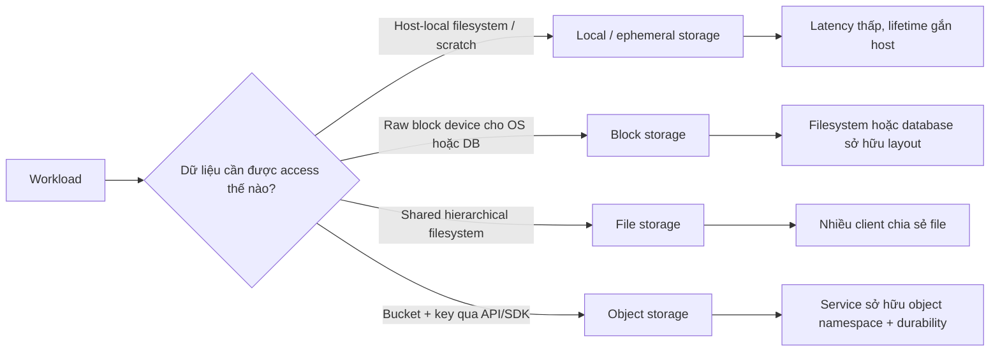
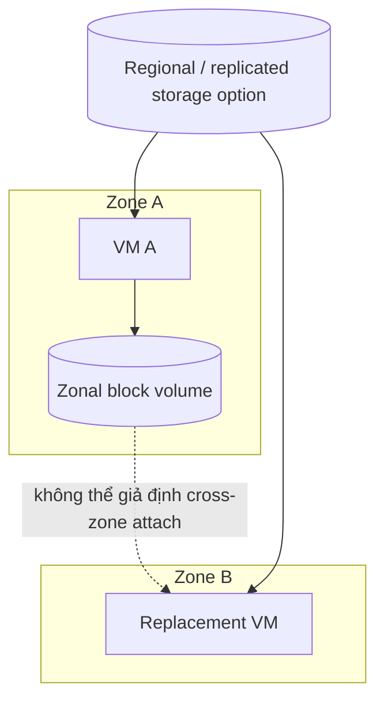
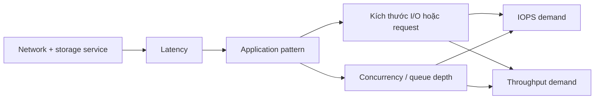
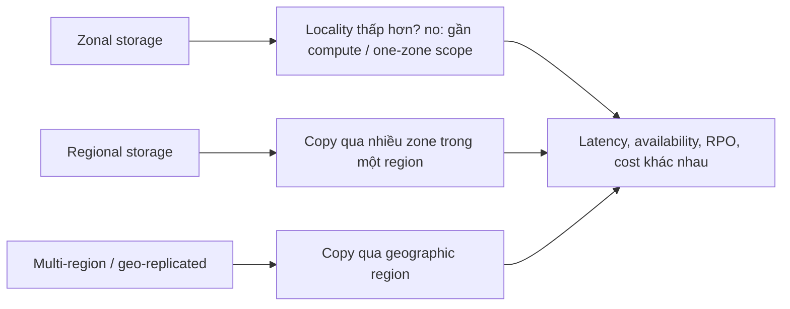

# Cloud Storage Models: Suy luận về Block, File, Object và Local State

## TL;DR

Ngày 21 tháng 04 năm 2011, một thay đổi network trong một AWS Availability Zone làm gián đoạn replication traffic của Amazon EBS. Khi connectivity trở lại, nhiều block-storage node cố rebuild replica cùng lúc, làm cạn spare capacity và tạo **re-mirroring storm**. Ở đỉnh sự cố, khoảng 13% EBS volume trong zone bị ảnh hưởng rơi vào trạng thái "stuck", và áp lực từ zonal cluster suy giảm còn gây latency/error cho EBS control-plane API ở cấp Region. Bài học không phải "block storage không đáng tin"; bài học là **access model, replication topology, control plane và failure domain của storage product đều là một phần của application architecture**.

> 💡 **Quy tắc bỏ túi:** Chọn storage theo **contract workload cần**, không theo chữ "persistent". Trước hết xác định dữ liệu được address và share thế nào, sau đó reasoning về latency/IOPS/throughput, failure scope, durability so với availability, recovery objective và tổng chi phí.

- **Local, block, file và object storage expose interface khác nhau:** Local disk thuộc một host, block storage expose sector/block cho OS, file storage expose shared filesystem semantics, còn object storage expose named object qua API.
- **Persistence không định nghĩa failure scope:** Disk có thể sống lâu hơn VM nhưng vẫn zonal; file service có thể regional; object class có thể trải nhiều zone hoặc cố ý chỉ ở một zone.
- **Performance có nhiều dimension:** IOPS, throughput, latency, kích thước I/O/request, queue depth, metadata rate và client concurrency tương tác khác nhau với database, shared filesystem và object workload.
- **Replication, snapshot và backup giải quyết vấn đề khác nhau:** Replication giúp chịu infrastructure failure, snapshot giữ point-in-time state, còn backup định nghĩa recovery policy kèm retention và restore testing. Không cái nào tự động thay thế cái còn lại.
- **Cạm bẫy chết người:** Gọi một storage system là "highly durable" rồi suy ra application luôn đọc/ghi được, luôn restore được dữ liệu xóa nhầm, sống sót zone/region failure hoặc đạt RPO. Durability, availability, recoverability và locality là các contract tách biệt.



<TermBox term="Storage Model">
**Storage model** là tổ hợp giữa cách dữ liệu được address, operation nào được expose, ai có thể truy cập đồng thời, storage được attach/reach bằng cách nào và failure/performance contract bao quanh nó. "Persistent storage" quá rộng để dùng làm tiêu chí thiết kế an toàn.
</TermBox>

## Bắt đầu bằng access contract, không phải tên sản phẩm

Câu hỏi quan trọng nhất không phải "Storage service nào rẻ nhất?" mà là:

> **Application tin rằng storage cung cấp interface gì?**

Interface đó quyết định application có thể giả định gì về naming, locking, atomicity, sharing và locality.

### Local / ephemeral storage

Local storage như instance-store NVMe hoặc local SSD được gắn vật lý hoặc logic rất gần một compute host.

Đặc tính thường gặp:

- latency rất thấp và throughput cao;
- không có network hop trên normal I/O path;
- hợp với scratch space, cache, shuffle file, temporary build output và replicated system đã tự sở hữu durability;
- lifetime dữ liệu gắn với host hoặc instance lifecycle theo provider contract.

Nếu container ghi vào host-local disk rồi workload được reschedule sang host khác, bytes không tự đi theo. Xem local storage là **ephemeral / tạm thời** trừ khi platform cung cấp durability mechanism khác một cách tường minh.

### Block storage

**Block storage / lưu trữ khối** expose block device cho VM hoặc host. OS có thể partition và format nó, mount filesystem, hoặc đưa trực tiếp cho database/volume manager.

```text
managed block volume -> attach compute -> partition/format -> filesystem hoặc database -> file/page/record
```

Block storage phù hợp khi software cần disk-like device và hưởng lợi từ low-latency random I/O tương đối dự đoán được.

AWS EBS, Google Persistent Disk/Hyperdisk và Azure Managed Disks là ví dụ, nhưng attachment mode, zonal/regional option, performance provisioning và multi-writer capability đều **provider/product-specific**.

<TermBox term="Failure Domain">
**Failure domain** là phạm vi infrastructure có thể fail cùng nhau: device, host, rack, zone, region, account/control plane hoặc shared dependency khác. Replication bên trong một domain có thể tăng component durability mà không làm workload độc lập khỏi domain đó.
</TermBox>

## Persistent block volume vẫn có thể chỉ là zonal

Persistence nghĩa là data sống lâu hơn một compute instance. Nó **không** có nghĩa cùng volume attach được từ bất kỳ đâu.

Ví dụ, Amazon EBS volume bình thường được tạo trong một Availability Zone và attach vào EC2 instance trong cùng zone. Google có cả zonal lẫn regional persistent disk; regional option đồng bộ replicate qua hai zone. Azure Managed Disks có redundancy option như locally redundant hoặc zone-redundant tùy disk type và region.

Điều này biến failover thành placement problem:



Nếu application claim multi-zone availability, storage placement phải tham gia claim đó. Các lựa chọn gồm:

- regional/multi-zone block product;
- database-level synchronous replication sang zone khác;
- application-level replication;
- failover từ snapshot/backup với RTO dài hơn;
- redesign durable state sang storage model khác.

Lựa chọn đúng phụ thuộc write latency, consistency, cost và recovery objective.

## File storage là shared filesystem service

**File storage / lưu trữ tệp** expose file/directory hierarchy quen thuộc qua protocol như NFS hoặc SMB. Nhiều compute client thường có thể mount cùng một share đồng thời.

Ví dụ gồm Amazon EFS, Google Filestore và Azure Files.

Nó hữu ích cho workload cần:

- directory traversal;
- filesystem permission và identity;
- shared file visible từ nhiều host;
- file locking hoặc protocol-specific coordination;
- lift-and-shift application giả định NAS-like storage.

Nhưng managed network filesystem không phải "local disk lớn hơn". Mỗi metadata lookup, open, stat, small write và lock đều đi qua distributed service boundary.

Workload có hàng triệu metadata operation nhỏ có thể hành xử rất khác workload stream file lớn tuần tự, dù tổng data volume bằng nhau.

## Object storage được address bằng API, không phải POSIX disk

**Object storage / lưu trữ đối tượng** expose object trong bucket/container namespace qua HTTP/REST API, SDK, signed request hoặc protocol tương thích. Service, không phải filesystem của VM, sở hữu object namespace và redundancy.

Ví dụ gồm Amazon S3, Google Cloud Storage và Azure Blob Storage.

Object storage thường hợp với:

- upload và media;
- backup/archive;
- log và analytics data;
- immutable hoặc append-by-new-object artifact;
- data được share qua nhiều independent compute client.

Không được giả định POSIX behavior như in-place random write, atomic directory rename, file lock hoặc memory mapping chỉ vì một FUSE layer có thể trình bày object thành path.

Với object-specific semantics như identity, multipart upload, versioning, checksum, consistency, metadata ownership và lifecycle policy, dùng bài [Object Storage](/vi/docs/data-systems/object-storage) để đọc **chuyên sâu** hơn.

## Sharing semantics là một phần correctness

Hỏi ai có thể access cùng data trong cùng thời điểm.

### Local

Thường một host sở hữu local device. Muốn share phải có lớp khác như network service hoặc application replication.

### Block

Block volume thường có một primary writer attachment. Một số product có **multi-attach** hoặc shared-disk mode, nhưng shared block access không đồng nghĩa shared filesystem. OS/filesystem phải cluster-aware nếu nhiều writer có thể sửa cùng block.

Mount cùng ordinary filesystem read-write từ hai máy mà thiếu coordination đúng có thể corrupt data.

### File

Service được thiết kế cho nhiều filesystem client, nhưng semantics vẫn phụ thuộc protocol, locking, caching, identity và client behavior.

### Object

Nhiều client có thể address cùng bucket/object đồng thời qua API. Conflict semantics là API-specific: overwrite, conditional request, versioning và consistency phải được reasoning ở object layer.

## Performance là một vector, không phải một con số

<TermBox term="IOPS, Throughput và Latency">
**IOPS** đo operation mỗi giây, **throughput / băng thông** đo bytes chuyển mỗi đơn vị thời gian, còn **latency / độ trễ** đo thời gian của một operation. Chúng tương tác với kích thước I/O, kích thước request, queue depth, concurrency, caching và service limit; tối đa một dimension không tự động tối đa các dimension khác.
</TermBox>



Hãy reasoning theo workload shape:

| Workload | Concern chi phối |
| --- | --- |
| OLTP database trên block storage | low latency, small random I/O, sustained IOPS, write durability |
| Large sequential scan | throughput, I/O size lớn, queue depth |
| Shared source tree / CMS trên file storage | metadata latency, file lock, nhiều operation nhỏ |
| Media/object pipeline | request concurrency, object size, API throughput, retrieval cost |
| Build cache / scratch data | local latency, replaceability, rebuild cost |

AWS EBS tách SSD option cho transactional small/random I/O khỏi HDD option tối ưu throughput. Amazon EFS expose throughput mode và ghi rõ per-operation latency của distributed filesystem. Provider khác cũng có performance control riêng.

Đo access pattern trước khi chọn tier.

## Durability và availability trả lời hai câu hỏi khác nhau

**Durability / độ bền dữ liệu:** "Nếu infrastructure fail, data có còn nguyên không?"

**Availability / khả dụng:** "Application có đọc/ghi data được ngay lúc này không?"

Service có thể rất durable nhưng tạm unavailable. Trong incident EBS 2011, nhiều affected volume vẫn còn replica nhưng bị "stuck" vì hệ thống chưa thể chọn/khôi phục writable replica an toàn cho tới khi replication và control-plane state hồi phục.

Tương tự, storage class có thể giữ byte qua nhiều zone nhưng network, credential, mount process, DNS, control plane hoặc dependency path của application vẫn có thể chặn access.

Đừng biến durability percentage thành application availability SLO.

## Zonal, regional và multi-region là topology choice



Topology thay đổi failure behavior:

- **zonal** storage giữ data path gần compute nhưng availability gắn một zone;
- **regional** storage có thể chịu zone failure bằng synchronous hoặc cơ chế replication khác tùy product;
- **multi-region / geo-replicated** mở rộng disaster tolerance nhưng có thể kéo theo asynchronous replication, failover procedure, write latency cao hơn, cost cao hơn hoặc recovery point khác zero.

Terminology của provider không interchangeable.

Amazon S3 Standard lưu object dư thừa qua ít nhất ba Availability Zone trong một Region, trong khi S3 cũng có single-zone class cho workload cố ý chọn failure domain nhỏ hơn. Google Cloud expose regional, dual-region và multi-region object placement cùng zonal/regional block/file option. Azure expose LRS, ZRS, GRS/GZRS và redundancy choice khác trên nhiều storage service, với failover/read-access behavior khác nhau.

Luôn verify đúng product/tier đã chọn.

## Replication, snapshot và backup không phải từ đồng nghĩa

### Replication

**Replication / sao chép** giữ thêm copy/replica để tăng availability/durability và đôi khi read scale.

Nhưng replication thường copy cả lỗi logic:

- xóa nhầm;
- application ghi corrupt data;
- ransomware mã hóa data;
- migration lỗi;
- record sai invariant.

Replication không tự động là historical recovery mechanism.

### Snapshot

**Snapshot / ảnh chụp / point-in-time copy** capture storage state tại một thời điểm hoặc logical point.

Snapshot hữu ích cho:

- reconstruct volume nhanh;
- clone environment;
- rollback trước risky maintenance;
- incremental protection nếu product hỗ trợ.

Nhưng snapshot vẫn có thể share provider, account, region, credential hoặc administrative blast radius với source.

### Backup

**Backup / sao lưu** là một phần của recovery policy: copy gì, bao lâu một lần, giữ bao lâu, ai có quyền xóa, isolate ở đâu, và restore được test thế nào.

Backup nghiêm túc phải nêu:

- **RPO (Recovery Point Objective / điểm khôi phục):** cho phép mất bao nhiêu data gần nhất;
- **RTO (Recovery Time Objective):** cho phép recovery kéo dài bao lâu;
- retention;
- immutability/deletion protection;
- region/account isolation khi cần;
- restore verification.

Nightly snapshot không restore test chỉ là một copy, chưa phải bằng chứng recovery hoạt động.

## Storage consistency sống ở các layer khác nhau

Với local và block storage, block device tự nó không cung cấp application transaction semantics. Filesystem journaling, database WAL, fsync behavior, write ordering, cache và application protocol vẫn quan trọng.

Với file storage, protocol/client caching và locking behavior trở thành một phần consistency.

Với object storage, consistency được định nghĩa bởi object-service API. Amazon S3 hiện document strong consistency cho object PUT/DELETE/GET và listing behavior, nhưng không nên generalize điều đó sang mọi object store, gateway, cache hoặc replication topology.

Dùng contract của đúng service và đúng layer nơi application observe state.

## Chi phí đi theo access pattern và recovery topology

Storage cost không chỉ là "GB mỗi tháng".

Cần model:

- provisioned capacity;
- provisioned IOPS/throughput;
- request/operation charge;
- snapshot/backup capacity;
- cross-zone/cross-region transfer;
- internet **egress**;
- retrieval fee của infrequent/archive tier;
- minimum storage duration;
- archive restore time;
- data duplicate cho replication;
- idle warm capacity cho recovery.

Cold archive tier có thể rẻ theo GB nhưng vẫn sai nếu restore mất hàng giờ trong khi RTO của application là 20 phút.

Tương tự, shared file service có thể đắt hơn object storage nhưng tránh được application rewrite rất tốn kém khi filesystem semantics thật sự là requirement.

## Ví dụ provider: map concept trước, rồi đọc exact contract

| Nhu cầu storage | AWS | Google Cloud | Azure |
| --- | --- | --- | --- |
| Local / ephemeral | EC2 Instance Store | Local SSD | VM temporary/local NVMe storage nếu product cung cấp |
| Block | **EBS** | **Persistent Disk / Hyperdisk** | **Managed Disks** |
| Shared file | **EFS** | **Filestore** | **Azure Files** |
| Object | **S3** | **Cloud Storage** | **Blob Storage** |

Bảng này map concept, không nói chúng tương đương. Các product **khác nhau** về attachment rule, protocol, replication topology, performance knob, consistency behavior, quota, durability target, failover và pricing.

Ví dụ:

- EBS là block service với normal volume placement ở một zone; EBS snapshot tạo recovery path riêng.
- Google regional Persistent Disk và Hyperdisk Balanced High Availability có thể synchronously replicate block data qua hai zone.
- Azure Files expose managed SMB/NFS file share; Azure Storage redundancy choice gồm zonal và geo-replicated option cho service/account type được hỗ trợ.
- Object offering có storage class và geographic placement riêng.

Phải đọc current provider documentation trước khi biến generic architecture thành deployment configuration.

## Micro-scenario production: "persistent disk" chặn zone failover

Stateful service chạy trên VM A ở Zone A với zonal managed block volume. Đội thêm VM B ở Zone B và load balancer rồi document service là "multi-zone." Khi Zone A outage, traffic chuyển sang VM B nhưng application không attach/mount được volume của Zone A.

- **Hậu quả:** Compute failover thành công nhưng service vẫn không start vì authoritative data volume duy nhất còn gắn với zone lỗi.
- **Nguyên nhân cốt lõi:** Đội đánh đồng "persistent" với "regionally available." Compute được làm redundant nhưng storage không nhận cùng failure-domain objective.
- **Cách khắc phục chuẩn:** Chọn regional/multi-zone block option hoặc replicate state ở database/application layer, định nghĩa RPO/RTO, giữ independent backup path và test cả failover lẫn restore—not only VM replacement.

## Kiểm tra mental model

> **Tình huống:** Một đội lưu user file trên object storage, mount bucket bằng FUSE adapter lên hai application VM rồi kết luận có thể đối xử bucket giống hệt NFS filesystem với POSIX locking và atomic directory rename.

<details>
<summary>Xem giải thích chi tiết</summary>

Mount chỉ thay đổi interface trình bày cho process; nó không nhất thiết thay đổi semantics của underlying object service.

FUSE adapter có thể emulate path, metadata, rename hoặc caching bằng nhiều object API call. Locking, atomicity, consistency, file-descriptor behavior, performance và failure handling vì thế có thể khác true shared filesystem.

Nếu application cần filesystem semantics, validate adapter contract tường minh hoặc dùng managed file storage. Nếu thật sự cần object semantics, dùng object API trực tiếp và design quanh object identity cùng conditional operation.

</details>

## Checklist suy luận cloud storage

- [ ] **Access model:** Workload cần host-local byte, block device, shared filesystem hay object API?
- [ ] **Sharing:** Có một writer, nhiều reader, nhiều filesystem client hay nhiều independent API client?
- [ ] **Attachment:** Zone/region nào có thể attach/mount storage, và điều gì xảy ra khi compute bị replace?
- [ ] **Performance:** Requirement đo được về latency, IOPS, throughput, kích thước I/O/request, metadata rate và concurrency là gì?
- [ ] **Durability:** Storage chịu được device/zone/region failure nào mà không mất data?
- [ ] **Availability:** Trong các failure đó, application vẫn read/write được hay cần failover/manual recovery?
- [ ] **Consistency:** Layer nào định nghĩa ordering, locking, atomicity và read-after-write behavior?
- [ ] **Recovery:** Replication, snapshot và backup có job tách biệt với RPO/RTO tường minh không?
- [ ] **Restore test:** Đội đã restore vào clean environment và đo RTO thật chưa?
- [ ] **Tiering:** Storage class, archive latency, retrieval fee và minimum duration có khớp access pattern không?
- [ ] **Cost:** Đã tính IOPS/throughput, request, snapshot, replication, cross-zone traffic, retrieval và egress chưa?
- [ ] **Failure drill:** Hệ thống chịu được instance loss, zone loss, storage API degradation, accidental deletion và bad write không?

## Ranh giới với Object Storage

Bài này so sánh **cloud storage model và failure/performance contract**.

Để học **chi tiết** về object identity, strong read-after-write consistency, direct/multipart upload, checksum, versioning, lifecycle policy, metadata ownership và cross-system reconciliation, dùng [Object Storage](/vi/docs/data-systems/object-storage).

## Nguồn

- [AWS — Summary of the Amazon EC2 and Amazon RDS Service Disruption in the US East Region (April 2011)](https://aws.amazon.com/message/65648/)
- [AWS — Amazon EBS volumes](https://docs.aws.amazon.com/ebs/latest/userguide/ebs-volumes.html)
- [AWS — Amazon EBS volume types](https://docs.aws.amazon.com/ebs/latest/userguide/ebs-volume-types.html)
- [AWS — Amazon EFS performance specifications](https://docs.aws.amazon.com/efs/latest/ug/performance.html)
- [AWS — Data protection in Amazon S3](https://docs.aws.amazon.com/AmazonS3/latest/userguide/DataDurability.html)
- [Google Cloud — Storage solutions](https://cloud.google.com/docs/storage)
- [Google Cloud — Regional Persistent Disk](https://cloud.google.com/compute/docs/disks/regional-persistent-disk)
- [Google Cloud — Filestore service tiers](https://cloud.google.com/filestore/docs/service-tiers)
- [Azure — Azure Files](https://learn.microsoft.com/en-us/azure/storage/files/storage-files-introduction)
- [Azure — Storage redundancy](https://learn.microsoft.com/en-us/azure/storage/common/storage-redundancy)
- [Azure — Blob Storage](https://learn.microsoft.com/en-us/azure/storage/blobs/storage-blob-faq)

## Bài liên quan

- [Cloud Compute](/vi/docs/cloud-infrastructure/cloud-compute)
- [Containers](/vi/docs/cloud-infrastructure/containers)
- [Object Storage](/vi/docs/data-systems/object-storage)
- [Database Replication](/vi/docs/data-systems/database-replication)
