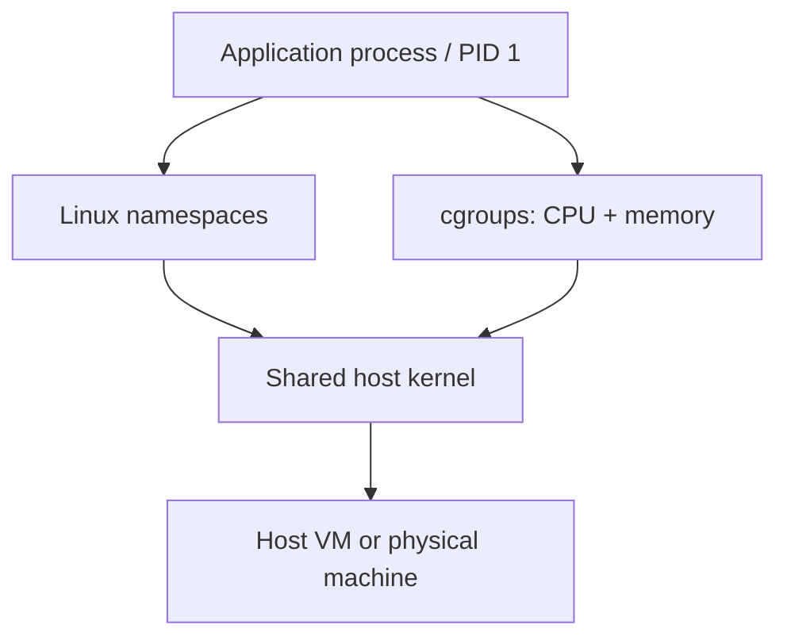
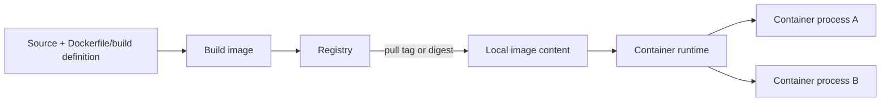
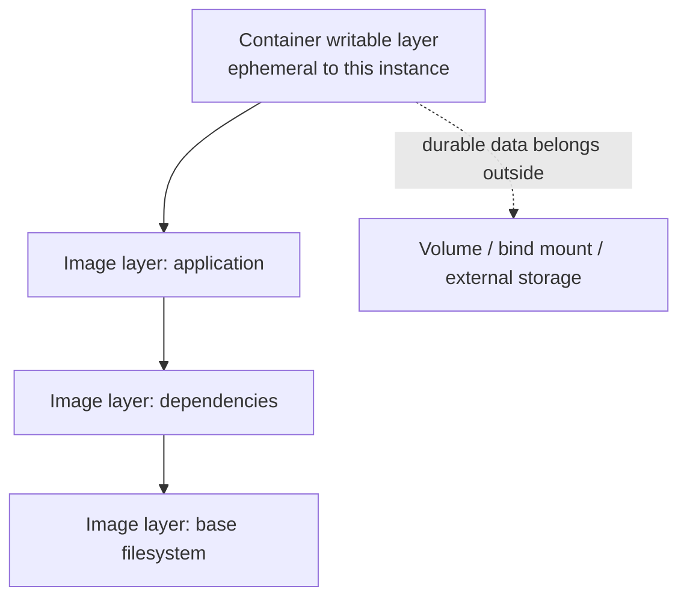
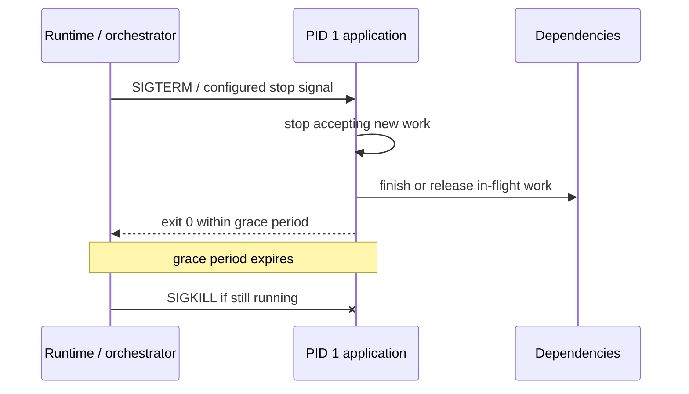

# Containers: Operate Images, Processes, Resources, and Lifecycle

## TL;DR

On December 17, 2023, Logto reported an 18-minute production outage after an automated GitHub Container Registry retention workflow deleted production Docker image content. Their multi-architecture image used a tagged root manifest while referenced sub-images remained untagged, so a cleanup rule deleted artifacts the running service still needed to pull. The operational lesson is broader than one registry: **a container deployment depends on an exact runnable artifact, a runtime contract, and a lifecycle that may replace processes at any time**.

> 💡 **Rule of thumb:** Treat a container as a **replaceable process created from an immutable image**, not as a tiny permanent server. Pin the artifact you intend to run, keep durable state outside the container writable layer, set explicit resource and lifecycle contracts, and make shutdown/restart routine.

- **Image and container are different objects:** An OCI image is a content-addressable package of filesystem layers and runtime configuration; a container is a running or stopped runtime instance created from that image.
- **Isolation comes from the host kernel:** Linux namespaces separate views of processes, networking, mounts, users, and other resources; cgroups account for and constrain CPU and memory. Containers usually share the host kernel.
- **Local writes are disposable by default:** The container writable layer is tied to that container instance. Persist important data through volumes, bind mounts, or external storage with an explicit durability owner.
- **Lifecycle is part of correctness:** PID 1, signals, graceful shutdown, health/readiness checks, restart behavior, and logs determine whether replacement is safe under deploys and failures.
- **Fatal pitfall:** Treating a mutable tag, writable layer, or long-running container identity as durable state. A re-pull, OOM kill, host replacement, or orchestrator reschedule can expose the assumption immediately.



<TermBox term="Container">
A **container** is an operating-system process environment created by a container runtime with an isolated view of selected host resources and an associated root filesystem. On common Linux deployments, containers share the host kernel instead of booting a separate guest kernel like a VM.
</TermBox>

## A container is a process boundary, not a lightweight VM

A container is not a VM. A virtual machine normally includes a guest operating system and virtualized hardware boundary; a Linux container normally runs ordinary host-kernel processes whose views and resource accounting are constrained.

The practical model is:

- **namespaces** isolate what a process can see, such as process IDs, mounts, network interfaces, hostnames, IPC, and optionally user IDs;
- **cgroups (control groups)** measure and constrain resources such as CPU and memory;
- the **container runtime** creates the process environment, applies the requested isolation/resource settings, mounts the root filesystem, and manages lifecycle actions;
- the **host kernel** still schedules the actual processes and enforces the isolation primitives.

That shared-kernel model is why containers start quickly, but it is also why container isolation should not be described as identical to a VM security boundary.

## Image, registry, runtime, container

<TermBox term="OCI Image">
An **OCI image** is an immutable, content-addressable package composed of a manifest, configuration, and ordered filesystem layers. The Open Container Initiative defines image and runtime specifications so compatible tooling can build, distribute, unpack, and run the artifact.
</TermBox>

An image is a template; a container is a runtime instance created from the image.



A registry stores and distributes image content. A human-friendly **tag** such as `app:2026-09-18` can be moved to different content depending on registry policy and workflow. A **digest** such as `sha256:...` identifies exact content. For reproducible deployment, record or pin the digest that was promoted, then update it deliberately when rebuilding for patches.

Multi-platform images add another layer: an image index can reference different manifests for Linux/amd64, Linux/arm64, and other platforms. Cleanup and retention rules must understand that graph instead of assuming every untagged child is unused.

## Layers are build artifacts; the writable layer is runtime scratch space

Image filesystem layers are immutable changesets. Starting a container presents those layers as one root filesystem and adds a container-specific writable layer on top.



Files written only to the writable layer disappear when that container is destroyed and recreated. Do not confuse "the process can read it after a restart inside the same container object" with durable storage.

Use:

- a **volume** when the runtime/platform should own a persistent mount;
- a **bind mount** when a deliberate host path must be exposed;
- external object, block, file, database, or queue services when the state belongs outside one host/container lifecycle;
- temporary files in the writable layer only when loss is acceptable.

<TermBox term="Ephemeral Container State">
**Ephemeral container state** is runtime data whose lifetime is intentionally tied to one replaceable container instance, such as caches, temporary files, and generated scratch data. Business records, uploads, queue progress, and other recovery-critical state need a durability boundary outside that instance.
</TermBox>

## Resource limits are kernel contracts, not monitoring labels

Without explicit constraints, a container process may compete for host CPU and memory according to the runtime and host configuration. Docker and orchestrators translate CPU/memory settings into kernel controls, commonly through cgroups.

For operations:

- measure normal and peak **CPU** and **memory/RAM** usage;
- set limits with enough headroom for real workload behavior;
- distinguish CPU throttling from memory exhaustion;
- investigate an **OOM / out-of-memory** termination from the runtime and kernel evidence, not only application logs;
- remember that SIGKILL from an OOM event cannot be handled by the application.

A memory limit is not a capacity plan by itself. If the workload legitimately needs more memory, repeatedly restarting an OOM-killed container only converts resource pressure into an availability incident.

## PID 1 and signals make shutdown part of the API

Inside a container, the entry process is commonly **PID 1** for that process namespace. How you launch it matters.

Docker's exec-form `ENTRYPOINT ["app"]` lets the application become the direct process. A shell-form entrypoint can insert `/bin/sh -c`; unless the shell forwards or replaces itself with the real application, termination signals may not reach the workload as intended.



Operate graceful shutdown deliberately:

1. stop admitting new work when termination begins;
2. finish, checkpoint, or safely abandon in-flight work according to the workload contract;
3. close listeners and dependency connections;
4. exit before the grace period expires;
5. make retry/redelivery safe when work can be interrupted.

## Health, readiness, restart, and replacement are different decisions

A running process is not necessarily a healthy service, and a healthy process is not necessarily ready for traffic.

- A **health/liveness** check asks whether the process should be restarted because it cannot make progress.
- A **readiness** check asks whether the instance should receive traffic right now.
- A **startup** check, where the platform supports it, protects slow initialization from premature liveness failure.
- A restart recreates process state; an orchestrator may instead replace the container on another host entirely.

Do not make liveness depend on a temporarily unavailable downstream system if doing so would cause every healthy replica to restart together.

## Ports and networking: listening is not reachability

A container may get its own network namespace and virtual interfaces, but `EXPOSE 8080`, a declared container port, or a listening socket does not automatically create end-to-end reachability.

Trace the full path:

```text
client -> load balancer/service -> host or overlay network -> container port -> listening process
```

Publishing a port is runtime/platform configuration. DNS, service discovery, firewall rules, load balancers, and cloud routes remain separate concerns covered by [Cloud Networking](/docs/cloud-infrastructure/cloud-networking).

## Logs should survive process replacement

Write application logs to **stdout/stderr** unless the platform contract explicitly requires another sink. The runtime or platform can collect and ship those streams.

Writing the only copy of logs to `/var/log/app.log` inside the writable layer makes incident evidence disappear with the container. Local log files can also consume writable-layer capacity if rotation is not controlled.

## Reduce privileges because containers share a kernel

A container boundary is useful isolation, but privileged containers can deliberately remove much of it.

Prefer:

- run the application as **non-root** when possible;
- drop Linux **capabilities** the process does not need;
- use the runtime's default **seccomp** profile or a reviewed stricter profile;
- avoid privileged mode and host namespace sharing unless the workload genuinely requires them;
- keep image contents minimal and patch/rebuild images instead of mutating production containers in place.

## Packaging is not orchestration

Containers define a packaging and runtime boundary. They do not by themselves decide:

- which host should run a replica;
- how many replicas exist;
- how failed replicas are replaced;
- how rolling deploys drain traffic;
- how service discovery works;
- how capacity scales.

Those are **orchestrator** or managed-platform responsibilities. Kubernetes, Amazon ECS, Nomad, and managed container services make different choices around scheduling and lifecycle.

Likewise, containerization does not answer whether a workload should use provisioned containers or a serverless operating model. Use [Containers vs Serverless](/docs/engineering-judgment/decision-guides/containers-vs-serverless) for that decision; this lesson focuses on operating the container boundary correctly.

## Production micro-scenario: deploy hangs, then duplicate work appears

A team packages a queue worker with a shell-form entrypoint. During a rolling deploy, the orchestrator sends SIGTERM, but the shell running as PID 1 does not forward the signal to the worker. The grace period expires and the runtime sends SIGKILL while the worker is halfway through a job.

- **Impact:** Deploys take the full termination timeout, workers disappear abruptly, and partially completed jobs are redelivered. Non-idempotent side effects appear twice.
- **Root cause:** The team treated "container stopped" as an infrastructure detail. PID 1 never delivered the termination signal to the real worker, and job processing had no interruption-safe completion contract.
- **Correct pattern:** Make the application the direct PID 1 process or forward signals correctly, stop intake on SIGTERM, finish/checkpoint bounded work within the grace period, and make redelivery idempotent.

## Check your mental model

> **Scenario:** A service writes user-generated reports to `/app/output` inside its container. The platform replaces the container after an OOM event. The new container starts from the same image digest, but yesterday's reports are missing. The team says the image must be corrupt.

<details>
<summary>Show the reasoning</summary>

The image can be perfectly correct. The reports were runtime state written into the old container's writable layer. Recreating from the same image reconstructs the immutable image content, not the deleted writable layer.

The fix is to classify the reports as durable application state and store them on an explicit persistent boundary such as object storage or a managed volume whose lifecycle is independent from the container. The OOM event exposed the storage model; it did not change the image.

</details>

## Container operations checklist

- [ ] **Artifact identity:** Can you identify the exact image digest running in each environment, and can registry retention preserve required manifests and layers?
- [ ] **Build reproducibility:** Is the image rebuilt and promoted rather than manually patched inside a running container?
- [ ] **State boundary:** Is every durable file or business record stored outside the container writable layer?
- [ ] **Resources:** Are CPU and memory limits based on workload measurements, with OOM and throttling observable?
- [ ] **PID 1:** Does the real application receive stop signals and reap/handle child processes as required?
- [ ] **Graceful shutdown:** Can in-flight work terminate safely inside the configured grace period?
- [ ] **Health vs readiness:** Do checks distinguish "restart me" from "temporarily stop sending traffic"?
- [ ] **Networking:** Is the path from service/load balancer to the listening container port explicitly understood?
- [ ] **Logging:** Are stdout/stderr or another durable logging path collected outside the container lifecycle?
- [ ] **Privileges:** Does the workload run non-root where possible, with unnecessary capabilities removed and seccomp kept enabled?
- [ ] **Replacement test:** Have you intentionally killed/recreated the container and verified recovery without manual repair?

## Sources

- [Logto postmortem: Docker image not found](https://blog.logto.io/postmortem-docker-image-not-found)
- [Open Container Initiative Runtime Specification](https://specs.opencontainers.org/runtime-spec/)
- [Open Container Initiative Image Specification](https://github.com/opencontainers/image-spec/blob/main/spec.md)
- [Docker: Running containers](https://docs.docker.com/engine/containers/run/)
- [Docker: Storage](https://docs.docker.com/engine/storage/)
- [Docker: Resource constraints](https://docs.docker.com/engine/containers/resource_constraints/)
- [Dockerfile reference: ENTRYPOINT, STOPSIGNAL, HEALTHCHECK](https://docs.docker.com/reference/dockerfile/)
- [Kubernetes: Pod lifecycle](https://kubernetes.io/docs/concepts/workloads/pods/pod-lifecycle/)
- [Kubernetes: Linux kernel security constraints](https://kubernetes.io/docs/concepts/security/linux-kernel-security-constraints/)

## Related lessons

- [Cloud Compute](/docs/cloud-infrastructure/cloud-compute)
- [Cloud Networking](/docs/cloud-infrastructure/cloud-networking)
- [Containers vs Serverless](/docs/engineering-judgment/decision-guides/containers-vs-serverless)
- [Deployment Strategies](/docs/delivery-operations/deployment-strategies)
