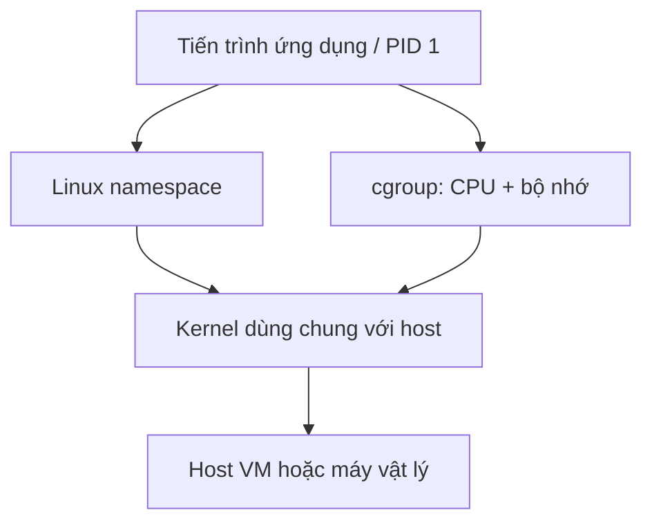
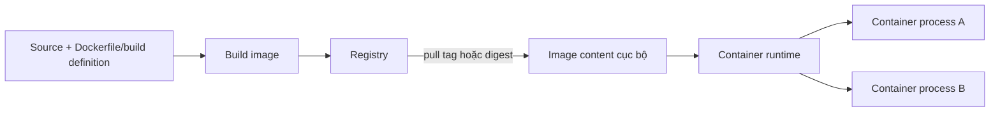
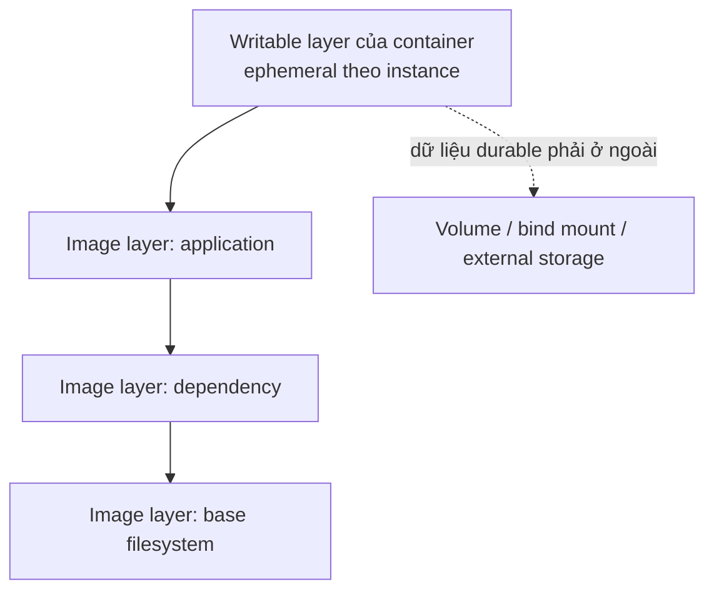
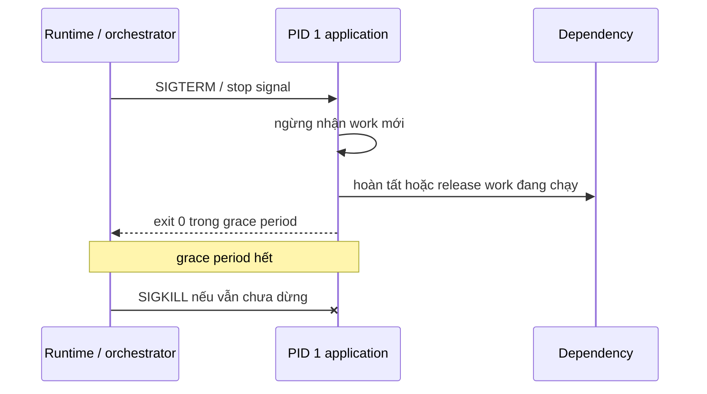

# Containers: Vận hành Image, Tiến trình, Tài nguyên và Vòng đời

## TL;DR

Ngày 17 tháng 12 năm 2023, Logto báo cáo một sự cố production kéo dài 18 phút sau khi workflow retention tự động của GitHub Container Registry xóa nội dung Docker image đang dùng cho production. Multi-architecture image của họ gắn tag ở root manifest trong khi các sub-image được tham chiếu vẫn không có tag, nên rule dọn dẹp đã xóa artifact mà service còn cần pull. Bài học vận hành rộng hơn một registry cụ thể: **một deployment container phụ thuộc vào đúng runnable artifact, runtime contract rõ ràng và vòng đời có thể thay thế tiến trình bất cứ lúc nào**.

> 💡 **Quy tắc bỏ túi:** Xem container là một **tiến trình có thể thay thế được tạo từ image bất biến**, không phải một máy chủ tí hon tồn tại vĩnh viễn. Pin artifact cần chạy, giữ durable state bên ngoài writable layer, đặt resource/lifecycle contract tường minh và biến shutdown/restart thành thao tác bình thường.

- **Image và container là hai đối tượng khác nhau:** OCI image là gói content-addressable gồm filesystem layer và runtime configuration; container là runtime instance đang chạy hoặc đã dừng được tạo từ image đó.
- **Isolation đến từ kernel của host:** Linux namespace tách góc nhìn về process, network, mount, user và các tài nguyên khác; cgroup đo và giới hạn CPU/bộ nhớ. Container thường dùng chung kernel với host.
- **Local write mặc định là disposable:** Writable layer của container gắn với chính instance đó. Dữ liệu quan trọng phải đi qua volume, bind mount hoặc external storage có owner về durability rõ ràng.
- **Lifecycle là một phần của correctness:** PID 1, signal, graceful shutdown, health/readiness check, restart behavior và log quyết định replacement có an toàn khi deploy hoặc xảy ra lỗi hay không.
- **Cạm bẫy chết người:** Xem mutable tag, writable layer hoặc identity của một container sống lâu như durable state. Một lần re-pull, OOM kill, host replacement hay orchestrator reschedule có thể làm giả định đó vỡ ngay lập tức.



<TermBox term="Container">
**Container** là môi trường tiến trình ở cấp hệ điều hành do container runtime tạo ra, với góc nhìn cô lập đối với một số tài nguyên của host và một root filesystem đi kèm. Trong deployment Linux phổ biến, container dùng chung kernel của host thay vì boot một guest kernel riêng như máy ảo.
</TermBox>

## Container là process boundary, không phải máy ảo thu nhỏ

Container không phải là máy ảo (VM). VM thường có guest operating system và boundary dựa trên virtualized hardware; Linux container thường chạy các tiến trình bình thường trên host kernel nhưng bị giới hạn góc nhìn và resource accounting.

Mental model thực dụng:

- **namespace (không gian tên)** cô lập những gì tiến trình nhìn thấy, như process ID, mount, network interface, hostname, IPC và tùy cấu hình là user ID;
- **cgroup (control group / nhóm kiểm soát)** đo và giới hạn tài nguyên như CPU và bộ nhớ;
- **container runtime** tạo môi trường tiến trình, áp isolation/resource setting, mount root filesystem và quản lý lifecycle action;
- **host kernel** vẫn thực sự schedule process và enforce các primitive cô lập.

Việc dùng chung kernel giúp container khởi động nhanh, nhưng cũng có nghĩa security boundary của container không nên được mô tả là giống hệt VM.

## Image, registry, runtime và container

<TermBox term="OCI Image">
**OCI image** là gói bất biến, content-addressable gồm manifest, configuration và các filesystem layer có thứ tự. Open Container Initiative định nghĩa image/runtime specification để tooling tương thích có thể build, phân phối, unpack và chạy artifact.
</TermBox>

Image là template; container là runtime instance được tạo từ image.



Registry lưu và phân phối image content. **Tag** dễ đọc như `app:2026-09-18` có thể được chuyển sang content khác tùy policy và workflow của registry. **Digest** như `sha256:...` định danh content chính xác. Muốn deployment tái lập được, hãy ghi lại hoặc pin digest đã promote rồi cập nhật có chủ đích khi rebuild để nhận patch.

Multi-platform image còn có thêm một lớp: image index có thể trỏ đến manifest riêng cho Linux/amd64, Linux/arm64 và platform khác. Cleanup/retention rule phải hiểu graph này thay vì cho rằng mọi child artifact không có tag đều không còn được dùng.

## Layer là build artifact; writable layer là scratch space lúc chạy

Các filesystem layer trong image là changeset bất biến. Khi start container, runtime trình bày các layer đó thành một root filesystem và thêm writable layer riêng của container lên trên.



File chỉ ghi vào writable layer sẽ biến mất khi container đó bị destroy và tạo lại. Đừng đánh đồng "process vẫn đọc được sau restart của cùng container object" với persistent storage thật sự.

Dùng:

- **volume** khi runtime/platform nên sở hữu persistent mount;
- **bind mount** khi cần expose một host path có chủ đích;
- object/block/file/database/queue service bên ngoài khi state thuộc lifecycle rộng hơn một host/container;
- file tạm trong writable layer chỉ khi mất dữ liệu là chấp nhận được.

<TermBox term="Ephemeral Container State">
**Ephemeral container state** là runtime data có lifetime cố ý gắn với một container instance có thể bị thay thế, ví dụ cache, temporary file và scratch data. Business record, upload, queue progress và state quan trọng cho recovery cần durability boundary nằm ngoài instance đó.
</TermBox>

## Resource limit là kernel contract, không chỉ là con số trên dashboard

Nếu không đặt constraint rõ ràng, process trong container có thể tranh CPU và memory của host theo cấu hình runtime/kernel. Docker và orchestrator chuyển CPU/memory setting thành kernel control, thường thông qua cgroup.

Khi vận hành:

- đo mức dùng **CPU** và **memory/RAM** ở steady state lẫn peak;
- đặt limit có headroom dựa trên workload thật;
- phân biệt CPU throttling với memory exhaustion;
- điều tra termination do **OOM / hết bộ nhớ** bằng evidence từ runtime và kernel, không chỉ application log;
- nhớ rằng SIGKILL do OOM không thể được application bắt để cleanup.

Memory limit không tự động là capacity plan. Nếu workload thực sự cần nhiều memory hơn, restart container sau mỗi OOM chỉ biến resource pressure thành availability incident.

## PID 1 và signal khiến shutdown trở thành một phần của contract

Bên trong container, entry process thường là **PID 1** trong process namespace đó. Cách launch process có ý nghĩa vận hành.

Exec-form của Docker như `ENTRYPOINT ["app"]` cho phép application trở thành process trực tiếp. Shell-form có thể chèn `/bin/sh -c`; nếu shell không forward signal hoặc không `exec` application, termination signal có thể không đến đúng workload.



Vận hành graceful shutdown có chủ đích:

1. dừng nhận work mới khi termination bắt đầu;
2. hoàn tất, checkpoint hoặc bỏ dở an toàn in-flight work theo workload contract;
3. đóng listener và dependency connection;
4. exit trước khi grace period hết;
5. làm retry/redelivery an toàn khi work có thể bị interrupt.

## Health, readiness, restart và replacement là các quyết định khác nhau

Process đang chạy chưa chắc là service khỏe; process khỏe chưa chắc đã sẵn sàng nhận traffic.

- **health/liveness** check hỏi process có mất khả năng tiến triển tới mức cần restart hay không;
- **readiness / sẵn sàng** check hỏi instance có nên nhận traffic ngay lúc này hay không;
- **startup** check, nếu platform hỗ trợ, bảo vệ initialization chậm khỏi liveness failure quá sớm;
- restart tạo lại process state; orchestrator cũng có thể thay hẳn container sang host khác.

Đừng để liveness phụ thuộc vào một downstream đang tạm lỗi nếu điều đó khiến tất cả replica khỏe mạnh restart đồng loạt.

## Port và network: listen không đồng nghĩa với reachability

Container có thể có network namespace và virtual interface riêng, nhưng `EXPOSE 8080`, khai báo container port hay mở listening socket không tự động tạo end-to-end reachability.

Hãy trace đầy đủ:

```text
client -> load balancer/service -> host hoặc overlay network -> container port -> process đang listen
```

Publish port là runtime/platform configuration. DNS, service discovery, firewall, load balancer và cloud route vẫn là concern riêng được trình bày ở [Cloud Networking](/vi/docs/cloud-infrastructure/cloud-networking).

## Log phải sống lâu hơn process

Ưu tiên ghi application log ra **stdout/stderr** trừ khi platform contract yêu cầu sink khác. Runtime hoặc platform có thể collect và ship các stream đó.

Nếu bản log duy nhất nằm ở `/var/log/app.log` trong writable layer, incident evidence sẽ biến mất cùng container. Local log file cũng có thể ăn hết dung lượng writable layer nếu rotation không được kiểm soát.

## Giảm đặc quyền vì container dùng chung kernel

Container boundary đem lại isolation hữu ích, nhưng privileged container có thể chủ động gỡ bỏ phần lớn isolation đó.

Ưu tiên:

- chạy application dưới user **non-root / không phải root** khi có thể;
- drop Linux **capabilities / đặc quyền** mà process không cần;
- giữ default **seccomp** profile của runtime hoặc dùng profile chặt hơn đã review;
- tránh privileged mode và host namespace sharing trừ khi workload thực sự yêu cầu;
- giữ image tối giản và patch bằng cách rebuild image thay vì sửa container production tại chỗ.

## Packaging không phải orchestration

Container định nghĩa packaging/runtime boundary. Tự nó không quyết định:

- replica chạy trên host nào;
- cần bao nhiêu replica;
- replica fail được thay thế thế nào;
- rolling deploy drain traffic ra sao;
- service discovery vận hành thế nào;
- capacity scale bằng cách nào.

Đó là trách nhiệm của **orchestrator / lớp điều phối** hoặc managed platform. Kubernetes, Amazon ECS, Nomad và các managed container service đưa ra contract khác nhau cho scheduling và lifecycle.

Containerization cũng không trả lời workload nên chạy bằng provisioned container hay operating model serverless. Dùng [Containers vs Serverless](/vi/docs/engineering-judgment/decision-guides/containers-vs-serverless) cho quyết định đó; bài này tập trung vào việc vận hành đúng container boundary.

## Micro-scenario production: deploy bị treo rồi xuất hiện duplicate work

Một đội đóng gói queue worker bằng shell-form entrypoint. Trong rolling deploy, orchestrator gửi SIGTERM nhưng shell đang làm PID 1 không forward signal cho worker thật. Grace period hết và runtime gửi SIGKILL khi worker mới xử lý được nửa job.

- **Hậu quả:** Deploy luôn chờ hết termination timeout, worker biến mất đột ngột và job xử lý dở bị redelivery. Side effect không idempotent xảy ra hai lần.
- **Nguyên nhân cốt lõi:** Đội xem "container dừng" chỉ là chi tiết infrastructure. PID 1 không chuyển termination signal đến worker thật, còn job processing không có contract hoàn tất an toàn khi bị interrupt.
- **Cách khắc phục chuẩn:** Để application làm PID 1 trực tiếp hoặc forward signal đúng cách, ngừng intake khi nhận SIGTERM, hoàn tất/checkpoint bounded work trong grace period và làm redelivery idempotent.

## Kiểm tra mental model

> **Tình huống:** Một service ghi report do người dùng tạo vào `/app/output` bên trong container. Platform thay container sau một sự kiện OOM. Container mới start từ đúng image digest cũ, nhưng report hôm qua biến mất. Đội kết luận image đã corrupt.

<details>
<summary>Show the reasoning</summary>

Image hoàn toàn có thể vẫn đúng. Report là runtime state được ghi vào writable layer của container cũ. Tạo lại từ cùng image chỉ tái dựng immutable image content, không thể tái dựng writable layer đã bị xóa.

Cách sửa là phân loại report thành durable application state rồi lưu vào persistent boundary tường minh như object storage hoặc managed volume có lifecycle độc lập với container. OOM chỉ làm lộ storage model sai; nó không làm thay đổi image.

</details>

## Checklist vận hành container

- [ ] **Artifact identity:** Có xác định được chính xác image digest đang chạy ở từng environment và retention policy có giữ đủ manifest/layer cần thiết không?
- [ ] **Build reproducibility:** Image có được rebuild/promote thay vì patch thủ công bên trong container đang chạy không?
- [ ] **State boundary:** Mọi file hoặc business record cần durable có nằm ngoài writable layer của container không?
- [ ] **Resources:** CPU/memory limit có dựa trên measurement và OOM/throttling có observable không?
- [ ] **PID 1:** Application thật có nhận stop signal và xử lý child process đúng nhu cầu không?
- [ ] **Graceful shutdown:** In-flight work có thể dừng an toàn bên trong grace period đã cấu hình không?
- [ ] **Health vs readiness:** Check có phân biệt "hãy restart tôi" với "tạm thời đừng gửi traffic" không?
- [ ] **Networking:** Đường đi từ service/load balancer đến listening container port có được hiểu tường minh không?
- [ ] **Logging:** stdout/stderr hoặc logging path bền vững khác có được collect ngoài lifecycle của container không?
- [ ] **Privileges:** Workload có chạy non-root khi có thể, drop capability không cần và giữ seccomp bật không?
- [ ] **Replacement test:** Đã cố ý kill/tạo lại container và xác minh recovery không cần repair thủ công chưa?

## Nguồn

- [Logto postmortem: Docker image not found](https://blog.logto.io/postmortem-docker-image-not-found)
- [Open Container Initiative Runtime Specification](https://specs.opencontainers.org/runtime-spec/)
- [Open Container Initiative Image Specification](https://github.com/opencontainers/image-spec/blob/main/spec.md)
- [Docker: Running containers](https://docs.docker.com/engine/containers/run/)
- [Docker: Storage](https://docs.docker.com/engine/storage/)
- [Docker: Resource constraints](https://docs.docker.com/engine/containers/resource_constraints/)
- [Dockerfile reference: ENTRYPOINT, STOPSIGNAL, HEALTHCHECK](https://docs.docker.com/reference/dockerfile/)
- [Kubernetes: Pod lifecycle](https://kubernetes.io/docs/concepts/workloads/pods/pod-lifecycle/)
- [Kubernetes: Linux kernel security constraints](https://kubernetes.io/docs/concepts/security/linux-kernel-security-constraints/)

## Bài liên quan

- [Cloud Compute](/vi/docs/cloud-infrastructure/cloud-compute)
- [Cloud Networking](/vi/docs/cloud-infrastructure/cloud-networking)
- [Containers vs Serverless](/vi/docs/engineering-judgment/decision-guides/containers-vs-serverless)
- [Deployment Strategies](/vi/docs/delivery-operations/deployment-strategies)
