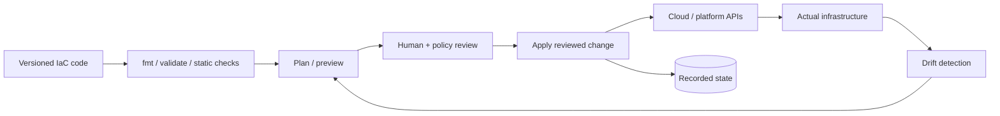
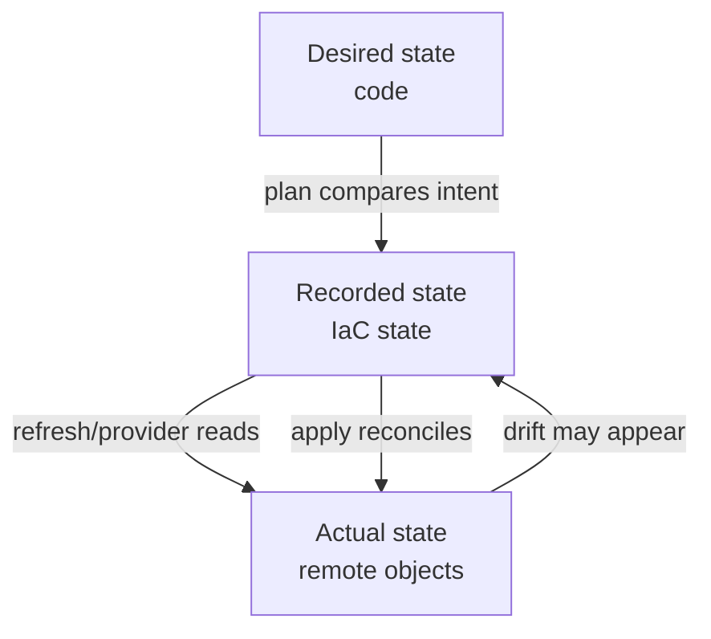
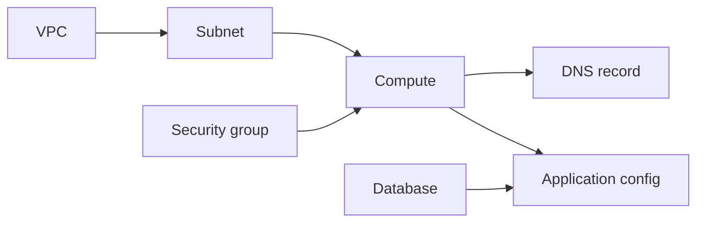
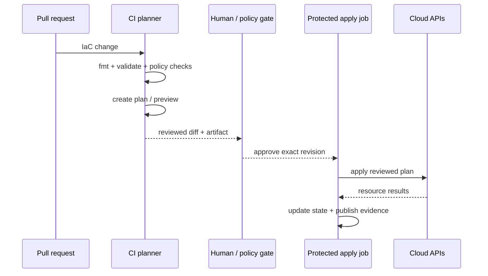

# Infrastructure as Code: Operate Plans, State, Drift, and Safe Change

## TL;DR

On February 28, 2017, an authorized Amazon S3 operator followed an established playbook while debugging a billing-system issue in US-EAST-1. One command input was entered incorrectly, removing a much larger set of servers than intended and contributing to a major regional S3 disruption. The incident was not caused by Terraform, but it demonstrates the central operating truth behind infrastructure automation: **automation executes intent at machine speed, so scope, review, and blast-radius controls matter as much as the code itself**.

> 💡 **Rule of thumb:** Treat every infrastructure change as a reviewed state transition: **code defines intent → plan exposes proposed actions → humans/policy bound the blast radius → apply executes the reviewed change → state records what the tool manages → drift detection checks reality afterward**.

- **IaC is more than configuration files:** The operational system includes desired configuration, provider plugins, resource addresses, recorded state, credentials, plans, policy checks, approvals, apply execution, and recovery procedures.
- **Plan and apply are different safety boundaries:** A plan explains create/update/replace/destroy actions before execution; apply is the mutating step. In automation, applying the exact reviewed saved plan is safer than silently generating a different plan later.
- **State is production data:** Terraform/OpenTofu/Pulumi state links logical resource addresses to real infrastructure and can contain sensitive values. Protect, lock, version, back up, and tightly authorize it.
- **Drift and refactors are explicit operations:** Out-of-band changes, imports, renames, module moves, and state migrations must be reconciled intentionally or the next plan can undo a hotfix or replace an object you meant to preserve.
- **Fatal pitfall:** Seeing “everything is in Git” and assuming infrastructure is safe. A reviewed repository can still produce destructive plans, stale-plan applies, state corruption, provider-upgrade surprises, or an oversized blast radius if execution controls are weak.



<TermBox term="Infrastructure State">
**Infrastructure state** is the IaC tool's recorded mapping between logical resources in code and real remote objects, plus attributes needed to plan future changes. It is not merely a cache: losing or corrupting the mapping can make the next plan misunderstand ownership.
</TermBox>

## Think in three states, not one

A useful IaC mental model separates:

1. **Desired state:** what code says should exist.
2. **Recorded state / state file:** what the tool believes it manages and the attributes recorded from prior operations.
3. **Actual state:** what the cloud or platform API says exists now.



Pulumi documents the same three-way model explicitly: desired state in the program, current recorded state in the stack, and actual provider state.

The operational mistake is treating Git as the only **source of truth** while ignoring that the tool also needs recorded ownership and the provider has live reality.

Git is the source of truth for intended configuration. The cloud API is the source of truth for what exists now. State is the tool's source of truth for which real object corresponds to which logical address.

## Plan is the reviewable change contract

A useful plan should make you answer:

- What will be **created**?
- What will be **updated in place**?
- What will be **replaced**?
- What will be **destroyed**?
- Which replacements cascade through dependencies?
- Which values are unknown until apply?
- Does the change affect one resource, one environment, or an entire organization?

Do not review a plan by scanning only the final count.

A plan with:

```text
0 to add, 2 to change, 1 to destroy
```

may be more dangerous than a plan creating 200 stateless objects if the destroyed resource is a production database or identity boundary.

### Saved plans matter in automation

Terraform and OpenTofu can save a plan and later apply that plan.

That creates a useful CI contract:

```text
commit SHA
  -> initialize exact dependencies
  -> create plan
  -> review plan artifact
  -> approve
  -> apply that reviewed plan artifact
```

If CI runs a fresh implicit plan during apply, the reviewed diff and executed diff may differ because code, variables, provider versions, state, or actual infrastructure changed in between.

A **saved plan is not timeless**. Treat a stale plan as invalid after material changes to:

- the IaC commit;
- input variables;
- provider/module versions;
- credentials or account/region context;
- state;
- manually changed infrastructure;
- imported or deleted resources.

Re-plan instead of forcing an old artifact through production.

<TermBox term="Saved Plan">
A **saved plan** is a serialized description of the exact actions an IaC engine intends to execute for a particular configuration, state snapshot, dependency set, and input context. It improves review-to-apply fidelity, but it does not freeze the real cloud while waiting for approval.
</TermBox>

## Apply is the mutating boundary

Apply is where cloud APIs change.

A robust pipeline separates permissions:

- pull-request jobs can validate and generate plans;
- protected apply jobs receive mutating cloud permissions;
- production apply requires explicit environment/review policy;
- emergency paths are audited separately.

Prefer short-lived CI identity through OIDC/federation over long-lived cloud access keys stored as CI secrets.

Use [Cloud IAM](/docs/cloud-infrastructure/cloud-iam) for the trust and permission model, and [Secrets Management](/docs/cloud-infrastructure/secrets-management) for any static credential that still cannot be removed.

## State is production data

Terraform's backend documentation warns that state can contain sensitive information. Saved plan files can also contain sensitive values in cleartext even when terminal output redacts them.

Protect state and plan artifacts like production credentials.

For production stacks:

- use a controlled **remote backend / remote state** location;
- encrypt storage and transport;
- restrict read/write IAM separately from ordinary repository access;
- enable backend versioning, snapshots, or another tested **backup** path;
- audit state access;
- prevent casual downloads to developer laptops;
- define recovery when state writes fail;
- set retention appropriate to incident recovery.

Do not commit `terraform.tfstate`, Pulumi stack state exports, or saved plan artifacts to Git.

## Lock state when concurrent writers are possible

Two concurrent applies against one state can both make decisions from overlapping snapshots.

The result can include:

- conflicting API changes;
- lost state updates;
- duplicate resources;
- one run undoing another run's assumptions.

Use backend locking or the platform's equivalent serialization capability.

Terraform notes that backend state locking support depends on the backend. Do not assume "remote" automatically means "safe concurrent apply."

One environment/state should normally have one mutating writer at a time.

## Split state to bound blast radius

One giant state file for an entire company creates coupling:

- every plan must read a huge graph;
- one state lock blocks unrelated work;
- one bad provider/config change reaches many systems;
- access to state reveals more sensitive values;
- recovery affects a large ownership domain.

Split state by durable ownership and lifecycle boundaries such as:

- production vs staging;
- network foundation vs application stacks;
- shared platform vs team-owned workloads;
- cloud account/project/subscription;
- high-criticality stateful infrastructure vs replaceable application infrastructure.

Do not split merely to make files smaller. Each boundary creates cross-stack dependencies and coordination cost.

A good boundary answers: **who owns changes here, who may apply them, and what failure domain should one bad plan be allowed to reach?**

## Dependency graphs determine change order

Terraform/OpenTofu infer **implicit dependencies** from references:

```hcl
subnet_id = aws_subnet.app.id
```

The reference creates a graph edge.

Use explicit `depends_on` only when a real dependency is invisible from data references.

Overusing explicit dependencies makes plans more conservative, increases unknown values, and can create unnecessary ordering.



Dependency graphs also explain replacement cascades. A small-looking change to an identity, subnet, or immutable attribute may force downstream resources to replace.

Always inspect replacement edges, not only the edited file.

## Lifecycle controls are guardrails, not recovery systems

Terraform lifecycle rules can alter planned behavior.

### `create_before_destroy`

Useful when an object can be replaced with overlap.

But it needs:

- spare capacity;
- names that allow both old and new objects;
- dependencies that tolerate coexistence;
- traffic cutover logic.

It cannot manufacture zero downtime for a stateful service that cannot run two copies safely.

### `prevent_destroy`

Useful as an extra guardrail around critical resources.

Important limitation: if the resource block is removed from configuration, the `prevent_destroy` rule is removed with it, so it is not an absolute deletion shield.

Use provider-level deletion protection, backups, IAM restrictions, and policy checks too.

### `ignore_changes`

Useful when another controller intentionally owns specific attributes.

Dangerous when used to hide unexplained drift.

If you add `ignore_changes` because "the plan is noisy," document who owns the ignored field and how that owner is audited.

Lifecycle settings are **not a backup system** and **not a rollback system**.

## Drift is an ownership decision

<TermBox term="Drift">
**Drift** is divergence between IaC-recorded/declared expectations and actual remote infrastructure. It can come from console edits, provider-side lifecycle changes, emergency commands, another automation system, or failed/partial operations.
</TermBox>

Common drift sources:

- console hotfixes;
- cloud CLI changes;
- auto-generated provider attributes;
- external controllers;
- incident-response edits;
- another IaC stack managing the same object;
- resources deleted manually.

When drift is detected, choose a direction intentionally.

### Remediate actual state back to code

Use when the out-of-band change was accidental or temporary.

Update/refresh recorded state as needed, review the plan, then re-apply desired code.

### Adopt the actual change into code

Use when the out-of-band change was correct and should remain.

Update code and recorded state so the next plan does not silently undo the production fix.

Pulumi documents these as remediation versus adoption. Terraform/OpenTofu workflows use refresh/import/config changes differently, but the ownership question is the same.

Never automate drift remediation blindly for high-risk resources until you understand which systems are allowed to mutate them.

## Import brings an existing object under management

Import is not "copy this resource into code automatically" in every tool.

Terraform/OpenTofu configuration-driven import associates an existing remote object with a resource address as part of plan/apply. OpenTofu explicitly recommends reviewing import through the normal plan/apply workflow.

Before import:

- prove the object is not already managed elsewhere;
- write the matching configuration;
- use the provider's correct import identity;
- inspect attributes that would change after import;
- verify no destructive normalization is planned.

One remote object should have one clear IaC owner.

## Resource addresses are identity inside the state model

Terraform/OpenTofu state associates a remote object with a **resource address**, such as:

```text
module.database.aws_db_instance.primary
```

Changing the address can look like removing one object and creating another even when your business intent is "same database, cleaner code structure."

### Use moved declarations for refactors

Terraform `moved` blocks declare old and new addresses:

```hcl
moved {
  from = aws_db_instance.primary
  to   = module.database.aws_db_instance.primary
}
```

Terraform then updates the address relationship during planning instead of interpreting the refactor as destroy/create.

OpenTofu supports analogous moved-block workflows.

For old/complex workflows, direct state move commands exist, but declarative refactoring is easier to review and preserve in history.

## Removing management is different from destroying infrastructure

Sometimes an IaC stack should stop owning an object without deleting it.

Terraform supports a `removed` block with `destroy = false` so the change can be reviewed through the normal workflow.

This is safer than casually deleting the resource block and hoping the plan "does the right thing."

After removal from state, some other owner must be explicit:

- another IaC stack imports it;
- another platform owns it;
- it is intentionally manual with documented controls.

Unowned production infrastructure is operational debt.

## Modules are contracts, not dumping grounds

A useful module has:

- one coherent ownership/capability boundary;
- small, intentional **inputs**;
- stable, meaningful **outputs**;
- narrow provider assumptions;
- documented lifecycle and replacement semantics;
- tests/examples for dangerous changes.

Avoid giant "company infrastructure" modules with dozens of feature flags.

A module version change is production code change. Review its changelog and generated plan.

## Pin providers and modules deliberately

Provider behavior changes can change plans even when your own IaC code does not.

For Terraform:

- declare provider version constraints;
- commit `.terraform.lock.hcl` so provider selections/checksums are reproducible;
- upgrade providers intentionally and review the resulting plan.

The dependency lock file locks provider selections; it is not a general lock for remote module source versions.

For registry modules, pin or constrain **module versions** in the module source configuration so upgrades happen deliberately.

OpenTofu has similar dependency/version concerns, while Pulumi uses its language package ecosystem plus provider/plugin versions. Exact mechanics are **tool-specific**.

Do not allow an unreviewed "latest" dependency upgrade in the same production apply as an unrelated infrastructure change.

## Policy checks should inspect intent before mutation

Useful policy-as-code or custom CI checks include:

- block public storage/network exposure unless explicitly approved;
- deny deletion of protected production resource classes;
- require encryption, backup, or logging flags;
- restrict regions/accounts;
- bound allowed instance sizes;
- flag plans with high destroy/replace counts;
- require ownership tags;
- reject long-lived IAM credentials.

Policy checks reduce classes of mistakes, but they do not prove the plan is business-correct.

A plan can satisfy every policy and still replace the wrong database.

## Safe CI/CD separates preview from mutation



Production pipeline rules should include:

- plan generated from immutable commit SHA;
- environment/account/region shown in review;
- saved plan or equivalent review-to-apply fidelity;
- one mutating writer per state;
- OIDC/federated short-lived credentials;
- **least privilege** on the apply identity;
- policy checks before mutation;
- logs that preserve who approved/applied;
- re-plan when state/context changes.

Avoid permanent administrator keys in CI.

## Partial apply is a real failure mode

An apply is not necessarily one giant cloud transaction.

If resource 7 of 20 fails:

- resources 1–6 may already exist or be changed;
- state may already include completed actions;
- later resources may not run;
- external side effects may exist.

Do not automatically "roll back everything" by running another destructive command.

Instead:

1. inspect state and provider reality;
2. understand completed actions;
3. fix the cause;
4. produce a fresh plan;
5. recover deliberately.

This is another reason state backups and audit logs matter.

## Rollback infrastructure by forward reasoning

Application rollback often means "deploy previous binary."

Infrastructure rollback is harder.

The previous code version may request destructive reversal:

- delete a newly created database;
- shrink a network range that is now in use;
- replace a migrated resource;
- remove a security control introduced after the old commit;
- downgrade a provider schema unexpectedly.

Prefer **forward recovery**:

- restore intended configuration;
- import/adopt reality if necessary;
- create replacement capacity safely;
- restore data from backup when data state is involved;
- use explicit migration paths.

Git revert is input to a new plan, not proof that production will return safely to its previous state.

## Production micro-scenario: a harmless refactor plans to recreate the database

A team moves its production database resource from the root configuration into a reusable `module "database"`. The HCL arguments are unchanged, so the pull request looks like structural cleanup. The new resource address is different, but no `moved` block or state migration is declared. CI shows one database destroy and one database create; the reviewer scans only the code diff and approves.

- **Impact:** Apply can destroy or replace the production database object, causing downtime and potentially catastrophic data-loss risk depending on provider deletion/backups.
- **Root cause:** The team treated source-code identity as separate from state identity. The IaC engine tracks the remote database through its resource address, so a rename/module move without an explicit move looked like "old object removed, new object requested."
- **Correct pattern:** Treat refactors as state migrations: declare a `moved` block or tool-appropriate equivalent, require plan review for destroy/replace actions, retain tested backups/provider deletion protection, use `prevent_destroy` only as an additional guardrail, and apply the migration in a controlled state boundary before unrelated changes.

## Check your mental model

> **Scenario:** An engineer makes an emergency console change to tighten a production security group. Git remains unchanged. The next morning, CI produces a plan that changes the security group back to the old rule. The engineer calls Terraform "wrong" because the live cloud configuration is more recent.

<details>
<summary>Show the reasoning</summary>

The tool is reconciling against the ownership model it has.

The console hotfix changed **actual state**, but desired code still expresses the old rule. Depending on refresh behavior and recorded state, the next plan can discover the drift and propose restoring the declared configuration.

The team must choose deliberately:

- if the hotfix was temporary, remediate actual state back to code after the incident;
- if the hotfix is the new intended configuration, update code and reconcile/import/refresh state as the tool requires before normal applies resume.

The failure is not "Git lost the race to the console." The failure is allowing two mutation paths without a process for deciding which one becomes the durable source of intent.

</details>

## Infrastructure as Code operations checklist

- [ ] **Scope:** Which account/project/subscription, region, environment, and state boundary can this change reach?
- [ ] **Plan:** Have create/update/replace/destroy actions been reviewed, not just the final resource counts?
- [ ] **Saved artifact:** Will apply execute the exact reviewed plan/revision, and is the plan still fresh enough to trust?
- [ ] **State:** Is state remote, encrypted, access-controlled, versioned/backed up, and recoverable?
- [ ] **Locking:** Can two mutating runs operate on this state concurrently, and what prevents that?
- [ ] **Secrets:** Could state or plan files contain passwords, tokens, private attributes, or backend credentials?
- [ ] **Drift:** Are console/CLI/emergency changes detected and either remediated or adopted deliberately?
- [ ] **Ownership:** Is each remote object managed by exactly one clear IaC owner?
- [ ] **Refactor:** Do renames/module moves use `moved` or an equivalent safe state migration?
- [ ] **Removal:** Are stop-managing operations explicit instead of accidentally deleting infrastructure?
- [ ] **Dependencies:** Are implicit references sufficient, with explicit `depends_on` used only for hidden real dependencies?
- [ ] **Lifecycle:** Are `create_before_destroy`, `prevent_destroy`, and `ignore_changes` used with their limitations understood?
- [ ] **Dependencies versions:** Are provider and module upgrades pinned/constrained and reviewed separately?
- [ ] **CI identity:** Does apply use OIDC/federation or another short-lived, least-privilege credential?
- [ ] **Policy:** Are high-risk public exposure, deletion, region, encryption, backup, and replacement patterns checked before apply?
- [ ] **Recovery:** Are partial apply, failed state write, provider outage, and state restore procedures documented and tested?

## Boundary with Kubernetes and Autoscaling

Infrastructure as Code can create Kubernetes clusters, node pools, networks, IAM bindings, and sometimes Kubernetes resources.

Use [Kubernetes Fundamentals](/docs/cloud-infrastructure/kubernetes-fundamentals) for reconciliation inside the Kubernetes API: Pods, controllers, Services, probes, scheduling, and workload runtime behavior.

Use [Autoscaling](/docs/cloud-infrastructure/autoscaling) for the feedback-control problem of changing capacity from demand signals.

IaC should declare the infrastructure/control configuration around those systems; it should not replace their own runtime reconciliation loops.

## Tool-specific semantics

Terraform, OpenTofu, and Pulumi share core ideas—desired configuration, providers, preview/plan, apply/update, state, imports, and drift—but exact behavior is **tool-specific**:

- Terraform/OpenTofu use HCL-style resource addresses and explicit state/refactoring workflows;
- Terraform has `moved`, `removed`, saved plan files, provider dependency lock files, and backend-specific locking behavior;
- OpenTofu supports configuration-driven import through plan/apply and its own backend/state semantics;
- Pulumi expresses desired infrastructure in general-purpose languages and documents desired/current/actual state plus refresh-based drift detection.

Always verify the exact provider/tool contract before operating production state.

## Sources

- [AWS — Summary of the Amazon S3 Service Disruption in US-EAST-1, February 28, 2017](https://aws.amazon.com/message/41926/)
- [Terraform — Plan command](https://developer.hashicorp.com/terraform/cli/commands/plan)
- [Terraform — Apply command](https://developer.hashicorp.com/terraform/cli/commands/apply)
- [Terraform — State storage and locking](https://developer.hashicorp.com/terraform/language/state/backends)
- [Terraform — Backend configuration and sensitive data](https://developer.hashicorp.com/terraform/language/backend)
- [Terraform — Lifecycle meta-argument](https://developer.hashicorp.com/terraform/language/meta-arguments/lifecycle)
- [Terraform — Moved block](https://developer.hashicorp.com/terraform/language/block/moved)
- [Terraform — Removed block](https://developer.hashicorp.com/terraform/language/block/removed)
- [Terraform — Refactor state](https://developer.hashicorp.com/terraform/language/state/refactor)
- [OpenTofu — Import](https://opentofu.org/docs/language/import/)
- [OpenTofu — Apply](https://opentofu.org/docs/cli/commands/apply/)
- [Pulumi — Detecting and reconciling drift](https://www.pulumi.com/docs/iac/operations/stack-management/drift/)
- [Pulumi — State and backends](https://www.pulumi.com/docs/reference/state/)

## Related lessons

- [Kubernetes Fundamentals](/docs/cloud-infrastructure/kubernetes-fundamentals)
- [Cloud IAM](/docs/cloud-infrastructure/cloud-iam)
- [Secrets Management](/docs/cloud-infrastructure/secrets-management)
- [Cloud Storage Models](/docs/cloud-infrastructure/cloud-storage-models)
