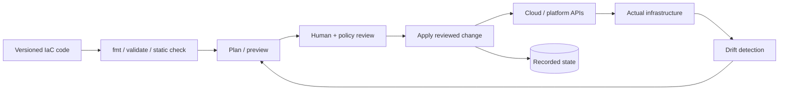
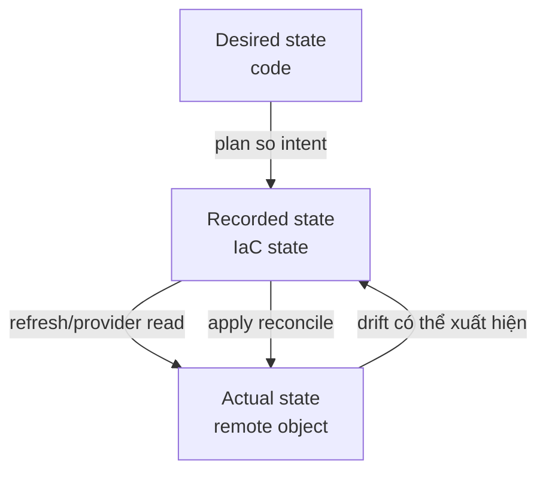
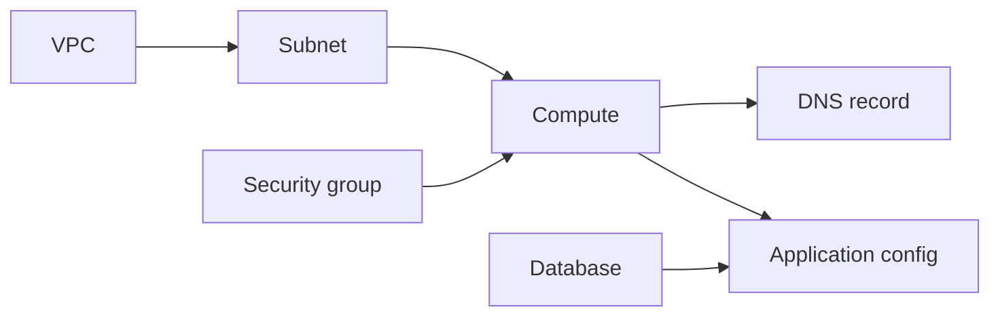
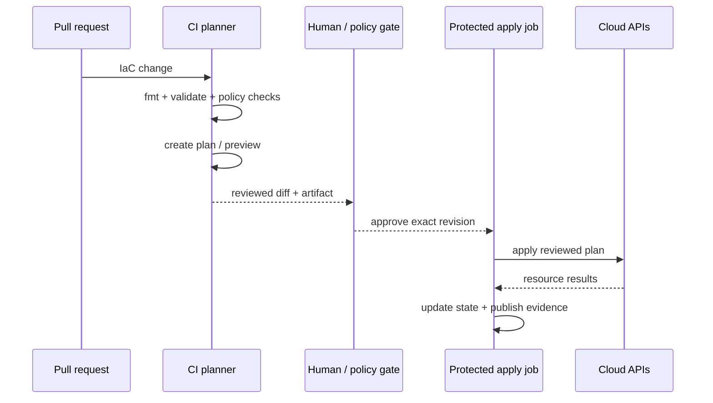

# Infrastructure as Code: Vận hành Plan, State, Drift và Thay đổi An toàn

## TL;DR

Ngày 28 tháng 02 năm 2017, một operator Amazon S3 được authorize đang theo established playbook để debug billing-system issue ở US-EAST-1. Một input của command bị nhập sai, làm automation remove tập server lớn hơn rất nhiều so với dự kiến và góp phần gây disruption S3 diện rộng trong region. Incident này không do Terraform gây ra, nhưng nó minh họa đúng operating truth của infrastructure automation: **automation thực thi intent ở tốc độ máy, nên scope, review và blast-radius guardrail quan trọng ngang với code**.

> 💡 **Quy tắc bỏ túi:** Xem mọi infrastructure change như một state transition được review: **code định nghĩa intent → plan expose proposed action → human/policy giới hạn blast radius → apply thực thi reviewed change → state ghi nhận object tool quản lý → drift detection kiểm reality sau đó**.

- **IaC không chỉ là configuration file:** Operational system còn gồm desired configuration, provider plugin, resource address, recorded state, credential, plan, policy check, approval, apply execution và recovery procedure.
- **Plan và apply là hai safety boundary khác nhau:** Plan giải thích create/update/replace/destroy trước execution; apply là bước mutate. Trong automation, apply đúng saved plan đã review an toàn hơn việc âm thầm generate một plan khác sau đó.
- **State là production data:** Terraform/OpenTofu/Pulumi state nối logical resource address với infrastructure thật và có thể chứa sensitive value. Phải protect, lock, version, backup và authorize chặt.
- **Drift và refactor là operation tường minh:** Out-of-band change, import, rename, module move và state migration phải được reconcile có chủ đích, nếu không plan tiếp theo có thể undo hotfix hoặc replace object bạn muốn giữ.
- **Cạm bẫy chết người:** Thấy “mọi thứ đã ở Git” rồi cho rằng infrastructure an toàn. Repo được review vẫn có thể tạo destructive plan, stale-plan apply, state corruption, provider-upgrade surprise hoặc blast radius quá lớn nếu execution control yếu.



<TermBox term="Infrastructure State">
**Infrastructure state / tệp trạng thái** là mapping mà IaC tool ghi nhận giữa logical resource trong code và remote object thật, cộng các attribute cần để plan change sau này. Nó không chỉ là cache: mất hoặc corrupt mapping có thể khiến plan kế tiếp hiểu sai ownership.
</TermBox>

## Hãy nghĩ theo ba state, không phải một

Mental model hữu ích tách:

1. **Desired state / trạng thái mong muốn:** code nói nên tồn tại gì.
2. **Recorded state / state file / trạng thái ghi nhận:** tool tin rằng nó đang quản lý gì và attribute nào đã ghi từ operation trước.
3. **Actual state / trạng thái thực tế / hạ tầng thực tế:** cloud/platform API nói gì đang tồn tại.



Pulumi document explicit cùng model ba phía: desired state trong program, current recorded state trong stack và actual provider state.

Operational mistake là coi Git như **nguồn sự thật / source of truth** duy nhất rồi bỏ qua recorded ownership và live reality của provider.

Git là source of truth cho intended configuration. Cloud API là source of truth cho cái đang tồn tại. State là source of truth của tool cho remote object nào tương ứng logical address nào.

## Plan là change contract có thể review

Plan hữu ích phải khiến bạn trả lời:

- gì sẽ **create**?
- gì **update in place**?
- gì **replace**?
- gì **destroy**?
- replacement nào cascade qua dependency?
- value nào unknown tới apply?
- change chạm một resource, một environment hay cả organization?

Đừng review plan bằng cách chỉ nhìn final count.

Plan:

```text
0 to add, 2 to change, 1 to destroy
```

có thể nguy hiểm hơn plan tạo 200 stateless object nếu object bị destroy là production database hoặc identity boundary.

### Saved plan quan trọng trong automation

Terraform/OpenTofu có thể save plan rồi apply plan đó.

Nó tạo CI contract hữu ích:

```text
commit SHA
  -> initialize exact dependencies
  -> create plan
  -> review plan artifact
  -> approve
  -> apply reviewed plan artifact
```

Nếu CI chạy fresh implicit plan lúc apply, reviewed diff và executed diff có thể khác vì code, variable, provider version, state hoặc actual infrastructure đã đổi.

**Saved plan / kế hoạch đã lưu không tồn tại mãi mãi.** Xem **stale plan / plan cũ** là invalid sau material change ở:

- IaC commit;
- input variable;
- provider/module version;
- credential hoặc account/region context;
- state;
- manually changed infrastructure;
- imported/deleted resource.

Re-plan thay vì ép old artifact qua production.

<TermBox term="Saved Plan">
**Saved plan** là serialized description của exact action mà IaC engine định execute cho một configuration, state snapshot, dependency set và input context cụ thể. Nó tăng review-to-apply fidelity nhưng không freeze cloud thật trong lúc chờ approval.
</TermBox>

## Apply là mutating boundary

Apply là nơi cloud API thay đổi.

Pipeline tốt tách permission:

- pull-request job được validate/generate plan;
- protected apply job mới nhận mutating cloud permission;
- production apply cần environment/review policy tường minh;
- emergency path được audit riêng.

Ưu tiên short-lived CI identity qua OIDC/federation thay vì long-lived cloud access key lưu trong CI secret.

Dùng [Cloud IAM](/vi/docs/cloud-infrastructure/cloud-iam) cho trust/permission model và [Secrets Management](/vi/docs/cloud-infrastructure/secrets-management) cho static credential chưa thể remove.

## State là production data

Terraform backend docs cảnh báo state có thể chứa **sensitive** information. Saved **plan cũng có thể chứa secret/sensitive value** ở cleartext dù terminal output redact.

Bảo vệ state và plan artifact như production credential.

Với production stack:

- dùng controlled **remote backend / remote state / backend từ xa**;
- encrypt storage và transport;
- restrict read/write IAM tách khỏi ordinary repo access;
- bật backend versioning, snapshot hoặc tested **backup / sao lưu** path;
- audit state access;
- tránh casual download xuống laptop;
- định nghĩa recovery khi state write fail;
- retention phù hợp incident recovery.

Đừng commit `terraform.tfstate`, Pulumi stack-state export hoặc saved plan artifact vào Git.

## Lock state khi có concurrent writer

Hai apply **đồng thời / concurrent** trên một state có thể cùng ra quyết định từ overlapping snapshot.

Hậu quả:

- conflicting API change;
- lost state update;
- duplicate resource;
- run này undo assumption của run kia.

Dùng backend **state lock / locking / khóa state** hoặc serialization capability tương đương.

Terraform ghi rõ state locking support phụ thuộc backend. Đừng giả định "remote" tự động đồng nghĩa "safe concurrent apply."

Một environment/state thường chỉ nên có một mutating writer tại một thời điểm.

## Tách state để giới hạn blast radius / phạm vi ảnh hưởng

Một giant state file cho cả công ty tạo coupling:

- plan phải đọc graph rất lớn;
- một lock block unrelated work;
- một bad provider/config change chạm nhiều system;
- access state lộ nhiều sensitive value;
- recovery chạm ownership domain rộng.

Tách theo durable ownership/lifecycle boundary:

- production vs staging;
- network foundation vs application stack;
- shared platform vs team-owned workload;
- cloud account/project/subscription;
- high-criticality stateful infra vs replaceable application infra.

Đừng split chỉ để file nhỏ. Mỗi boundary tạo cross-stack dependency/coordination cost.

Boundary tốt trả lời: **ai own change ở đây, ai được apply, và bad plan này được phép chạm failure domain nào?**

## Dependency graph quyết định change order

Terraform/OpenTofu infer **implicit dependency / phụ thuộc ngầm** từ reference:

```hcl
subnet_id = aws_subnet.app.id
```

Reference tạo graph edge.

Chỉ dùng explicit dependency / phụ thuộc tường minh qua `depends_on` khi dependency thật không thể hiện qua data reference.

Overuse explicit dependency làm plan conservative hơn, tăng unknown value và tạo ordering không cần thiết.



**Dependency graph / đồ thị phụ thuộc** cũng giải thích replacement cascade. Small change ở identity, subnet hoặc immutable attribute có thể force downstream replace.

Hãy inspect replacement edge, không chỉ file đã edit.

## Lifecycle control là guardrail, không phải recovery system

Terraform lifecycle rule có thể đổi planned behavior.

### `create_before_destroy`

Hữu ích khi object có thể replace với overlap.

Nhưng cần:

- spare capacity;
- name cho phép old/new cùng tồn tại;
- dependency tolerate coexistence;
- traffic cutover logic.

Nó không tự tạo zero downtime cho stateful service không thể chạy hai copy an toàn.

### `prevent_destroy`

Hữu ích như extra guardrail quanh critical resource.

Limitation quan trọng: nếu resource block bị remove khỏi configuration, `prevent_destroy` cũng biến mất cùng block, nên nó không phải absolute deletion shield.

Cần provider deletion protection, backup, IAM restriction và policy check nữa.

### `ignore_changes`

Hữu ích khi controller khác cố ý own một attribute cụ thể.

Nguy hiểm khi dùng để giấu unexplained drift.

Nếu thêm `ignore_changes` vì "plan noisy," document ai own ignored field và owner đó được audit thế nào.

Lifecycle setting **không phải backup** và **không phải rollback system**.

## Drift là ownership decision

<TermBox term="Drift">
**Drift / lệch trạng thái** là divergence giữa IaC recorded/declared expectation và actual remote infrastructure. Nó có thể đến từ console edit, provider lifecycle, emergency command, automation khác hoặc failed/partial operation.
</TermBox>

Nguồn drift phổ biến:

- console hotfix;
- cloud CLI change;
- provider-generated attribute;
- external controller;
- incident-response edit;
- IaC stack khác manage cùng object;
- resource bị delete thủ công.

Khi detect drift, chọn hướng reconcile có chủ đích.

### Remediate actual state về code

Dùng khi out-of-band change là accidental hoặc temporary.

Update/refresh recorded state khi cần, review plan rồi re-apply desired code.

### Adopt actual change vào code

Dùng khi out-of-band change đúng và cần giữ.

Update code và recorded state để plan sau không silently undo production fix.

Pulumi document hai hướng là remediation và adoption. Terraform/OpenTofu dùng refresh/import/config change khác nhau, nhưng ownership question giống nhau.

Đừng auto-remediate drift mù quáng với high-risk resource khi chưa rõ system nào được quyền mutate nó.

## Import đưa existing object vào management

Import không có nghĩa "copy resource này thành code tự động" ở mọi tool.

Terraform/OpenTofu configuration-driven **import** associate existing remote object với resource address trong plan/apply. OpenTofu khuyến nghị review import qua normal plan/apply workflow.

Trước import:

- chứng minh object không được manage ở nơi khác;
- viết matching configuration;
- dùng đúng provider import identity;
- inspect attribute sẽ đổi sau import;
- verify không có destructive normalization.

Một remote object nên có đúng một IaC owner rõ ràng.

## Resource address là identity trong state model

Terraform/OpenTofu state associate remote object với **resource address / địa chỉ resource**, ví dụ:

```text
module.database.aws_db_instance.primary
```

Đổi address có thể nhìn như remove object cũ và create object mới dù business intent là "cùng database, chỉ clean code structure."

### Dùng moved declaration khi refactor / đổi tên

Terraform `moved block / khối moved` khai báo old/new address:

```hcl
moved {
  from = aws_db_instance.primary
  to   = module.database.aws_db_instance.primary
}
```

Terraform update address relationship trong planning thay vì diễn giải refactor thành destroy/create.

OpenTofu hỗ trợ workflow moved tương tự.

Direct state move command tồn tại cho old/complex workflow, nhưng declarative refactor dễ review và giữ history hơn.

## Ngừng quản lý khác với destroy infrastructure

Đôi lúc IaC stack phải stop own object mà không delete nó.

Terraform hỗ trợ **removed block / khối removed** với `destroy = false` để change được review qua normal workflow:

```hcl
removed {
  from = aws_instance.legacy
  lifecycle {
    destroy = false
  }
}
```

Cách này an toàn hơn việc casual delete resource block rồi hy vọng plan "làm đúng."

Sau remove khỏi state, owner mới phải explicit:

- IaC stack khác import;
- platform khác own;
- intentional manual ownership với documented control.

Unowned production infrastructure là operational debt.

## Module là contract, không phải dumping ground

Module hữu ích có:

- coherent ownership/capability boundary;
- **input / đầu vào** nhỏ và intentional;
- **output / đầu ra** stable, meaningful;
- provider assumption hẹp;
- lifecycle/replacement semantics documented;
- test/example cho dangerous change.

Tránh giant "company infrastructure" module có hàng chục feature flag.

Module version change là production code change. Review changelog và generated plan của nó.

## Pin provider và module có chủ đích

Provider behavior change có thể đổi plan dù IaC code của bạn không đổi.

Với Terraform:

- declare **provider version / phiên bản provider** constraint;
- commit **dependency lock file / file khóa** `.terraform.lock.hcl` để provider selection/checksum reproducible;
- upgrade provider có chủ đích và review resulting plan.

Dependency lock file lock provider selection; nó không phải general lock cho remote module version.

Với registry module, pin/constrain **module version / phiên bản module** trong module source config để upgrade deliberate.

OpenTofu có concern dependency/version tương tự, còn Pulumi dùng language package ecosystem cùng provider/plugin version. Exact mechanic **khác nhau theo công cụ / tool-specific**.

Đừng cho unreviewed "latest" dependency upgrade đi cùng unrelated production apply.

## Policy check nên inspect intent trước mutation

Policy-as-code hoặc custom CI check hữu ích:

- block public storage/network exposure trừ khi explicit approve;
- deny delete protected production resource class;
- require encryption, backup hoặc logging flag;
- restrict region/account;
- bound allowed instance size;
- flag plan có destroy/replace count lớn;
- require ownership tag;
- reject long-lived IAM credential.

**Policy check / kiểm tra policy** giảm class mistake, nhưng không chứng minh plan business-correct.

Plan có thể pass mọi policy mà vẫn replace nhầm database.

## Safe CI/CD tách preview khỏi mutation



Production pipeline rule nên có:

- plan generated từ immutable commit SHA;
- environment/account/region hiển thị khi review;
- saved plan hoặc equivalent review-to-apply fidelity;
- một mutating writer mỗi state;
- OIDC/federation **short-lived / ngắn hạn** credential;
- apply identity theo **least privilege / đặc quyền tối thiểu**;
- policy-as-code trước mutation;
- log ai approve/apply;
- re-plan khi state/context đổi.

Tránh permanent administrator key trong CI.

## Partial apply là failure mode thật

Apply không nhất thiết là một giant cloud transaction.

Nếu resource 7/20 fail:

- resource 1–6 có thể đã create/change;
- state có thể đã ghi completed action;
- resource sau chưa chạy;
- external side effect có thể tồn tại.

Đừng tự động "rollback everything" bằng destructive command khác.

Thay vào đó:

1. inspect state và provider reality;
2. hiểu completed action;
3. fix cause;
4. tạo fresh plan;
5. recover có chủ đích.

Đây cũng là lý do state backup/versioning và audit log quan trọng.

## Rollback infrastructure bằng forward reasoning

Application rollback thường nghĩa "deploy previous binary."

Infrastructure rollback khó hơn.

Previous code version có thể yêu cầu destructive reversal:

- delete database vừa tạo;
- shrink network range đang được dùng;
- replace migrated resource;
- remove security control mới;
- downgrade provider schema bất ngờ.

Ưu tiên **forward recovery**:

- restore intended configuration;
- import/adopt reality nếu cần;
- create replacement capacity an toàn;
- restore data từ backup khi data state liên quan;
- dùng migration path explicit.

Git revert chỉ là input cho plan mới, không phải bằng chứng production sẽ quay lại safely.

## Micro-scenario production: refactor tưởng vô hại lại plan recreate database

Team chuyển production database resource từ root configuration vào reusable `module "database"`. HCL argument không đổi nên pull request nhìn như structural cleanup. Resource address mới khác nhưng không có `moved` block hay state migration. CI hiện một database destroy và một database create; reviewer chỉ scan code diff rồi approve.

- **Hậu quả:** Apply có thể destroy/replace production database object, gây downtime và data-loss risk nghiêm trọng tùy provider deletion/backup.
- **Nguyên nhân cốt lõi:** Team tách source-code identity khỏi state identity. IaC engine track remote database qua resource address, nên rename/module move không có explicit move trông như "old object removed, new object requested."
- **Cách khắc phục chuẩn:** Xem refactor như state migration: khai báo `moved` block hoặc equivalent theo tool, bắt review plan cho destroy/replace action, giữ tested backup/provider deletion protection, dùng `prevent_destroy` chỉ như extra guardrail và apply migration trong controlled state boundary trước unrelated change.

## Kiểm tra mental model

> **Tình huống:** Engineer làm emergency console change để tighten production security group. Git không đổi. Sáng hôm sau CI tạo plan đưa security group về old rule. Engineer nói Terraform "sai" vì live cloud configuration mới hơn.

<details>
<summary>Xem giải thích chi tiết</summary>

Tool đang reconcile theo ownership model nó có.

Console hotfix đổi **actual state**, nhưng desired code vẫn biểu diễn old rule. Tùy refresh behavior và recorded state, plan kế tiếp có thể discover drift rồi đề xuất restore declared configuration.

Team phải chọn có chủ đích:

- nếu hotfix temporary, remediate actual state về code sau incident;
- nếu hotfix là intended configuration mới, update code và reconcile/import/refresh state theo tool trước khi normal apply tiếp tục.

Failure không phải "Git thua console." Failure là cho hai mutation path tồn tại mà không có process quyết định path nào trở thành durable source of intent.

</details>

## Checklist vận hành Infrastructure as Code

- [ ] **Scope:** Change này chạm account/project/subscription, region, environment và state boundary nào?
- [ ] **Plan:** Create/update/replace/destroy action đã được review, không chỉ final resource count?
- [ ] **Saved artifact:** Apply có execute exact reviewed plan/revision và plan còn đủ fresh để tin không?
- [ ] **State:** State có remote, encrypted, access-controlled, versioned/backed up và recoverable không?
- [ ] **Locking:** Hai mutating run có thể chạy concurrent trên state không và control nào chặn?
- [ ] **Secrets:** State/plan file có thể chứa password, token, private attribute hoặc backend credential không?
- [ ] **Drift:** Console/CLI/emergency change có được detect rồi remediate/adopt deliberate không?
- [ ] **Ownership:** Mỗi remote object có đúng một clear IaC owner không?
- [ ] **Refactor:** Rename/module move có dùng `moved` hoặc safe state migration tương đương không?
- [ ] **Removal:** Stop-managing operation có explicit thay vì accidental delete infrastructure không?
- [ ] **Dependencies:** Implicit reference đã đủ chưa, `depends_on` chỉ dùng cho hidden real dependency?
- [ ] **Lifecycle:** `create_before_destroy`, `prevent_destroy`, `ignore_changes` có được dùng với limitation đã hiểu không?
- [ ] **Dependency versions:** Provider/module upgrade có pin/constrain và review riêng không?
- [ ] **CI identity:** Apply có dùng OIDC/federation hoặc short-lived least-privilege credential không?
- [ ] **Policy:** Public exposure, deletion, region, encryption, backup và replacement pattern high-risk có check trước apply không?
- [ ] **Recovery:** Partial apply, failed state write, provider outage và state restore procedure có documented/tested không?

## Ranh giới với Kubernetes và Autoscaling

Infrastructure as Code có thể create Kubernetes cluster, node pool, network, IAM binding và đôi khi Kubernetes resource.

Dùng [Kubernetes Fundamentals](/vi/docs/cloud-infrastructure/kubernetes-fundamentals) cho reconciliation bên trong Kubernetes API: Pod, controller, Service, probe, scheduling và workload runtime behavior.

Dùng [Autoscaling](/vi/docs/cloud-infrastructure/autoscaling) cho feedback-control problem thay đổi capacity từ demand signal.

IaC nên declare infrastructure/control configuration quanh các system đó; nó không thay runtime reconciliation loop của chúng.

## Semantics khác nhau theo công cụ

Terraform, OpenTofu và Pulumi share core idea—desired configuration, provider, preview/plan, apply/update, state, import và drift—nhưng exact behavior là **tool-specific / khác nhau theo công cụ**:

- Terraform/OpenTofu dùng HCL-style resource address và state/refactoring workflow explicit;
- Terraform có `moved`, `removed`, saved plan file, provider dependency lock file và backend-specific locking;
- OpenTofu hỗ trợ configuration-driven import qua plan/apply và backend/state semantics riêng;
- Pulumi biểu diễn desired infra bằng general-purpose language và document desired/current/actual state cộng refresh-based drift detection.

Luôn verify exact provider/tool contract trước khi vận hành production state.

## Nguồn

- [AWS — Summary of the Amazon S3 Service Disruption in US-EAST-1, February 28, 2017](https://aws.amazon.com/message/41926/)
- [Terraform — Plan command](https://developer.hashicorp.com/terraform/cli/commands/plan)
- [Terraform — Apply command](https://developer.hashicorp.com/terraform/cli/commands/apply)
- [Terraform — State storage and locking](https://developer.hashicorp.com/terraform/language/state/backends)
- [Terraform — Backend configuration and sensitive data](https://developer.hashicorp.com/terraform/language/backend)
- [Terraform — Lifecycle meta-argument](https://developer.hashicorp.com/terraform/language/meta-arguments/lifecycle)
- [Terraform — Moved block](https://developer.hashicorp.com/terraform/language/block/moved)
- [Terraform — Removed block](https://developer.hashicorp.com/terraform/language/block/removed)
- [Terraform — Refactor state](https://developer.hashicorp.com/terraform/language/state/refactor)
- [OpenTofu — Import](https://opentofu.org/docs/language/import/)
- [OpenTofu — Apply](https://opentofu.org/docs/cli/commands/apply/)
- [Pulumi — Detecting and reconciling drift](https://www.pulumi.com/docs/iac/operations/stack-management/drift/)
- [Pulumi — State and backends](https://www.pulumi.com/docs/reference/state/)

## Bài liên quan

- [Kubernetes Fundamentals](/vi/docs/cloud-infrastructure/kubernetes-fundamentals)
- [Cloud IAM](/vi/docs/cloud-infrastructure/cloud-iam)
- [Secrets Management](/vi/docs/cloud-infrastructure/secrets-management)
- [Cloud Storage Models](/vi/docs/cloud-infrastructure/cloud-storage-models)
