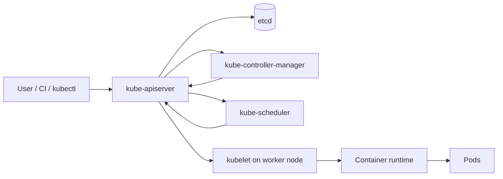
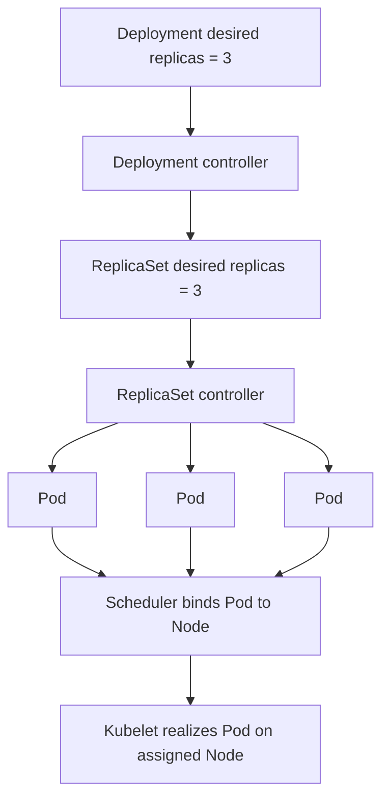
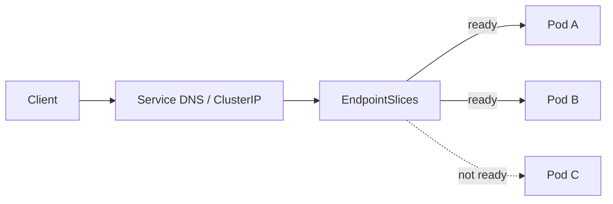
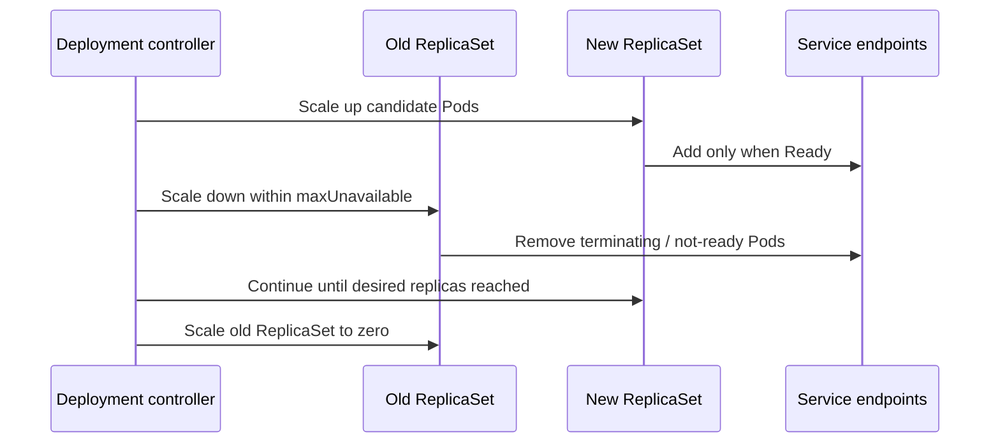

# Kubernetes Fundamentals: Reason About Reconciliation, Pods, Scheduling, and Services

## TL;DR

On July 19, 2019, Grafana Cloud's Hosted Prometheus service suffered a 26-minute outage after a Kubernetes Pod Priority rollout created an unexpected preemption chain. A new customer cluster used the default medium priority while existing production ingesters had not yet received the intended higher priority. New ingesters preempted production ingesters; the production ReplicaSet then created replacement Pods, and those replacements inherited the medium default and preempted more production ingesters. Kubernetes kept reconciling exactly as configured, but the global scheduling policy encoded the wrong intent. **The lesson is not that Kubernetes ignored desired state; it is that desired state includes placement and policy, and controllers will faithfully amplify a bad declaration.**

> 💡 **Rule of thumb:** Read Kubernetes as a chain of contracts: **API object spec → controller reconciliation → scheduler placement → kubelet runtime → readiness → Service endpoints**. When production disagrees with your intent, find the first contract where observed state diverges instead of treating the cluster as one opaque machine.

- **Kubernetes is a reconciliation system:** You submit desired state to the API; controllers repeatedly compare desired and actual state and make changes instead of executing a one-shot deployment script.
- **Pods are replaceable execution units:** A Pod is the scheduling/runtime unit for one or more tightly coupled containers, not a durable server identity. Deployments, ReplicaSets, StatefulSets, DaemonSets, Jobs, and CronJobs manage Pod lifecycles for different workload shapes.
- **Placement and runtime health are separate:** The scheduler decides where a Pod can fit; the kubelet runs containers and probes them; a Pod can be `Running` but not `Ready`, and a scheduled Pod can still crash, fail probes, or be removed from Service traffic.
- **Services decouple clients from Pod churn:** Labels/selectors and EndpointSlices connect a stable Service identity to the current ready backend set while Pods are created, replaced, or rescheduled.
- **Fatal pitfall:** Assuming Kubernetes automatically knows business intent. Wrong selectors, probes, requests, limits, priorities, rollout settings, or workload type can cause the control plane to make the system fail faster and more consistently.



<TermBox term="Reconciliation">
**Reconciliation** is the repeated control-loop process of comparing declared desired state with observed actual state and taking actions that move the system closer to the declaration. It is continuous, not a one-time "apply and forget" command.
</TermBox>

## Kubernetes is an API-driven control system

Kubernetes is often introduced as a container orchestrator, but the more useful mental model is:

```text
declare objects
  -> persist desired state in the API
  -> controllers observe objects
  -> scheduler assigns unscheduled Pods
  -> kubelet realizes Pod specs on nodes
  -> status and events flow back into the API
  -> controllers keep reconciling
```

The **API server** is the center of this interaction. Humans, `kubectl`, CI systems, controllers, schedulers, admission components, and many extensions communicate through the Kubernetes API rather than directly editing worker processes.

The API server stores cluster state in **etcd**, a consistent key-value backing store.

A useful object-level distinction is:

- `spec`: what you want;
- `status`: what Kubernetes currently observes;
- `metadata`: identity, labels, annotations, ownership, versioning, and other object metadata.

This means "the YAML was accepted" only proves the API accepted an object. It does not prove the workload is scheduled, healthy, ready, reachable, or serving the intended version.

## The control plane does not run your application containers

The control plane coordinates state.

Core responsibilities include:

- **kube-apiserver:** validates and exposes the Kubernetes HTTP API;
- **etcd:** stores API state;
- **kube-scheduler:** chooses a Node for Pods that do not yet have one;
- **kube-controller-manager:** runs built-in controllers that reconcile resources;
- cloud-specific integration may be handled by a cloud controller manager.

Worker Nodes run application workloads.

On each Node, **kubelet** watches Pod assignments for that Node and asks the container runtime to create and maintain the containers described by those Pod specs.



The controllers do not usually start containers themselves. They create or update API objects; other control loops continue the chain.

This decomposition matters during debugging because a symptom can belong to a different stage than the one you first suspect.

## A Pod is the smallest deployable compute object

<TermBox term="Pod">
A **Pod** is Kubernetes' smallest deployable compute object. It contains one or more tightly coupled containers that share a network namespace and can share volumes. The scheduler places the Pod as a unit onto one Node.
</TermBox>

A Pod is **not** "a container with YAML around it."

Multiple containers in one Pod are appropriate when they form one local execution unit:

- they must be co-scheduled;
- they communicate over `localhost`;
- they share lifecycle or local volumes;
- one is a sidecar/helper for the primary application.

Do not put unrelated services into one Pod merely because they talk to each other.

Pods are relatively **ephemeral and replaceable**. If a Node disappears, a higher-level controller normally creates replacement Pods; it does not resurrect the same Pod identity on another Node.

That is why application architecture should not depend on a Pod name or Pod IP remaining stable.

## Usually manage Pods through workload controllers

Creating naked Pods manually is useful for experiments, but production workloads usually need a controller.

### Deployment

A **Deployment** manages ReplicaSets and provides declarative rollout/rollback behavior for usually stateless workloads.

Updating the Deployment Pod template creates a new ReplicaSet. During a rolling update, Kubernetes scales the new ReplicaSet up and the old ReplicaSet down according to rollout settings such as `maxSurge` and `maxUnavailable`.

### ReplicaSet

A **ReplicaSet** maintains a target number of matching Pods.

If one managed Pod disappears, the ReplicaSet creates another because desired replicas and actual replicas no longer match.

This is the exact mechanism that contributed to the Grafana incident: replacement was correct from the ReplicaSet's perspective, while the cluster-wide priority policy made each replacement harmful.

### StatefulSet

Use **StatefulSet** when workload correctness requires stable network identity, stable persistent storage relationships, or ordered lifecycle behavior.

StatefulSet does not magically make the application itself state-safe. Database replication, backup, quorum, consistency, and failover semantics still belong to the database/system.

### DaemonSet

A **DaemonSet** aims to run a Pod on each eligible Node, commonly for node-local agents such as logging, networking, or monitoring components.

A first-time DaemonSet across a large cluster can create many Pods quickly, so its scope and resource impact matter.

### Job and CronJob

A **Job** represents finite work that should complete.

A **CronJob** creates Jobs on a schedule.

Do not force batch work into an always-running Deployment just because Deployments are familiar.

## Ownership explains why objects keep coming back

Kubernetes API objects can have **ownerReferences**.

A common chain is:

```text
Deployment
  owns ReplicaSet
    owns Pods
```

If you delete one managed Pod and it immediately returns, that is not Kubernetes "ignoring" you. The owner controller observed that actual state dropped below desired state and reconciled.

Before manually deleting or editing a generated child object, ask:

- which object owns this?
- which controller will rewrite or recreate it?
- should the desired state change happen at the owner instead?

This prevents fighting the controller loop.

## Labels and selectors create relationships

Kubernetes uses labels and selectors to connect many resources.

A Service may select Pods with:

```yaml
app: payments
tier: api
```

A Deployment's ReplicaSet also uses selectors to identify which Pods it manages.

Selectors are therefore correctness-critical joins.

Common failures include:

- Service selector matches zero Pods;
- Service selector matches Pods from another component;
- Deployment selector and Pod-template labels disagree;
- NetworkPolicy selector targets a broader set than expected;
- monitoring rules attach to the wrong labels.

Treat important labels as API design, not decoration.

## A Service is stable reachability over changing Pods

<TermBox term="Service">
A Kubernetes **Service** gives clients a stable network identity for a logical backend while the actual Pod set changes. With a selector-based Service, the control plane maintains EndpointSlices that represent the current matching endpoints and their readiness information.
</TermBox>



A Service does not create application replicas. It routes to endpoints.

A Deployment does not provide a stable client endpoint. It manages Pods.

Those are separate contracts.

For selector-based Services, the EndpointSlice controller tracks matching Pods. Readiness influences whether normal Service traffic should use an endpoint.

If `curl service-name` fails while Pods look healthy, inspect:

1. Service selector;
2. Pod labels;
3. EndpointSlices;
4. readiness;
5. Service `port` and `targetPort`;
6. network policy and data plane after the object relationships are confirmed.

## Pod phase is not traffic readiness

A Pod phase such as `Pending`, `Running`, `Succeeded`, or `Failed` is a coarse lifecycle summary.

**`Running` does not mean `Ready`.**

A Pod can be Running while:

- the application is still warming caches;
- a required connection pool is unavailable;
- the readiness probe is failing;
- one container is healthy while another is not;
- the Service selector does not match it;
- it is terminating.

This distinction is one of the highest-value Kubernetes debugging habits.

## Startup, readiness, and liveness answer different questions

### Startup probe

A **startup probe** asks whether initialization has completed enough for normal health checks to begin.

It protects slow-starting applications from being killed too early by liveness checks.

### Readiness probe

A **readiness probe** asks whether this Pod should receive traffic now.

A failed readiness probe removes the Pod from normal ready Service endpoints while leaving the container running.

Use readiness for temporary inability to serve traffic.

### Liveness probe

A **liveness probe** asks whether restarting the container is an appropriate recovery action.

A failed liveness probe can cause the kubelet to restart the container.

This makes liveness dangerous when used as a generic dependency check. If a database slows down and every application Pod fails liveness because the probe calls the database, Kubernetes can restart the whole fleet and amplify the outage.

The Kubernetes documentation explicitly warns that incorrect liveness probes can cause cascading failures.

## Container restart and Pod replacement are different events

Inside a Pod, container restarts follow the Pod's `restartPolicy`.

Repeated startup failures can show as `CrashLoopBackOff`, which is a backoff condition around repeated container restart attempts.

But a container restart is not the same as replacing the Pod object.

Examples:

- liveness failure: often restart container inside the same Pod;
- Deployment rollout: create replacement Pods from a new ReplicaSet;
- Node loss: controller eventually creates replacement Pods elsewhere;
- manual Pod delete: owner controller creates a new Pod.

The identity and failure boundary you are reasoning about matters.

## Graceful termination is part of rollout correctness

When Kubernetes terminates a Pod, kubelet normally gives containers a grace period and sends `SIGTERM` before forceful termination.

Applications should:

- stop accepting new work;
- drain or finish in-flight work when feasible;
- close listeners and connections cleanly;
- exit before `terminationGracePeriodSeconds` expires.

A process that ignores SIGTERM can turn ordinary rolling updates into request loss.

Readiness and termination are related but not identical. Do not assume "probe exists" means shutdown is graceful.

## Scheduling answers "where can this Pod run?"

The scheduler watches unscheduled Pods and chooses Nodes.

It considers information such as:

- resource requests;
- node availability;
- affinity/anti-affinity;
- topology constraints;
- taints/tolerations;
- priority and preemption;
- storage or hardware constraints.

Scheduling succeeds only when some Node satisfies the Pod's placement contract.

A Pod remaining `Pending` can therefore be a capacity or constraint problem rather than a container-runtime problem.

## Requests and limits are two different resource contracts

### Requests influence scheduling

CPU and memory **requests** tell Kubernetes how much resource a container asks the scheduler to reserve when deciding placement.

If Nodes have plenty of real idle CPU but insufficient *unallocated requested capacity*, a Pod can remain `Pending` / `Unschedulable`.

Requests are therefore part of cluster capacity accounting and bin packing.

### Limits constrain runtime

CPU and memory **limits** affect what the running container may consume.

Typical consequences:

- CPU throttling can occur when a container reaches its CPU limit;
- exceeding an effective memory limit can lead to an OOM kill.

A request is not "expected usage" and a limit is not "the scheduler reservation." They influence different stages.

Bad values create different failure modes:

- requests too high → low utilization, unschedulable Pods, excess cluster capacity;
- requests too low → scheduler packs too much onto Nodes relative to real demand;
- memory limit too low → OOM/restart loops;
- CPU limit too restrictive → latency from throttling.

## Priority and preemption are cluster-level policy

Pod Priority lets more important Pods be scheduled ahead of lower-priority work, and preemption may remove lower-priority Pods to make room.

This is powerful because it changes who loses during capacity contention.

The Grafana 2019 incident shows why default priority is not a cosmetic field. When a new cluster's Pods inherited the default medium priority while existing production ingesters had no priority, the scheduler's preemption decisions interacted with ReplicaSet reconciliation and produced a cascade.

Before introducing priority:

- identify which workloads may be preempted;
- verify replacement Pods do not recreate the same pressure loop;
- model capacity during rollout;
- make default priority behavior intentional;
- test on production-like cluster composition, not only isolated workloads.

## Configuration and secrets are separate API concerns

A **ConfigMap** stores non-confidential configuration data.

A Kubernetes **Secret** stores confidential data for Pods and other components, but using the Secret object does not complete the secret-management lifecycle.

Use [Secrets Management](/docs/cloud-infrastructure/secrets-management) for delivery, external secret stores, rotation, revocation, auditing, secret-zero elimination, and runtime-compromise boundaries.

Important Kubernetes-specific questions still include:

- environment variable or mounted file?
- does the application reload updates?
- which ServiceAccount can access the Secret?
- is encryption at rest configured for control-plane data?
- does a controller copy secret material into another object?

Keep sensitive data out of ConfigMaps.

## ServiceAccount is workload identity inside the cluster

A **ServiceAccount** is a namespaced non-human identity that Pods can use to authenticate to the Kubernetes API and, through configured integrations, sometimes to external systems.

Do not rely on the namespace's default ServiceAccount for every workload.

Assign a dedicated ServiceAccount when a workload needs permissions, and grant only the required RBAC.

For cloud API access, modern managed Kubernetes platforms can integrate Kubernetes workload identity with cloud IAM. The exact mapping is provider-specific; the [Cloud IAM](/docs/cloud-infrastructure/cloud-iam) lesson owns those provider trust and permission details.

## Namespaces scope names and policy, but are not magical isolation

Namespaces provide a scope for many Kubernetes objects and names.

They are useful for:

- organizational boundaries;
- RBAC scope;
- quota/policy scope;
- avoiding name collisions;
- grouping workloads.

A namespace by itself is **not** a complete security, network, or failure-isolation boundary.

For network isolation, **NetworkPolicy** can restrict Pod traffic when the cluster's network plugin actually implements NetworkPolicy enforcement.

For stronger multi-tenancy, also reason about RBAC, Pod security, node isolation, admission controls, quotas, secrets, cloud IAM, and sometimes separate clusters.

## Pod-local storage is not persistent application state

Container writable layers and many Pod-local volumes are tied to the Pod lifecycle.

For durable storage, Kubernetes provides **PersistentVolume (PV)** and **PersistentVolumeClaim (PVC)** abstractions.

A PVC is a workload's request for storage; a PV represents provisioned storage with a lifecycle independent of an individual Pod.

That abstraction does not erase storage semantics. You still need to understand the backing storage model, access mode, zone/topology, performance, snapshots, and recovery behavior from [Cloud Storage Models](/docs/cloud-infrastructure/cloud-storage-models).

StatefulSet can coordinate stable Pod/storage identity, but it does not make a database safe to scale or fail over automatically.

## Rolling updates are controller behavior, not guaranteed zero downtime

A Deployment RollingUpdate gradually changes ReplicaSets.

Key controls include:

- `maxSurge`: extra Pods allowed above desired replicas during rollout;
- `maxUnavailable`: how many desired replicas may be unavailable during rollout;
- readiness: when new Pods count as available for traffic;
- `minReadySeconds`: optional stability period before availability;
- `progressDeadlineSeconds`: how long progress may stall before Deployment reports failure.

Zero downtime additionally depends on:

- enough cluster capacity for surge;
- correct readiness probes;
- backward/forward compatibility;
- graceful termination;
- traffic draining;
- dependency capacity;
- schema migration strategy.

Kubernetes can perform a rollout exactly as declared while the application still experiences downtime.



Use `kubectl rollout status deployment/<name>` to observe rollout progress, and understand what `kubectl rollout undo` can and cannot revert. A Deployment revision tracks Pod-template changes; it does not roll back external databases, ConfigMap contents, cloud resources, or third-party side effects automatically.

## Debug Kubernetes by following the object chain

A useful order is:

### 1. Read desired and observed state

```bash
kubectl get deployment,pods,service
kubectl get pod <pod> -o yaml
```

Look at:

- `spec`;
- `status`;
- `status.conditions`;
- ready/available replica counts;
- generation / observed generation when relevant.

### 2. Ask the controller what happened

```bash
kubectl describe deployment <name>
kubectl describe pod <pod>
```

The **Events** section often reveals:

- scheduling failure;
- image pull failure;
- failed mounts;
- probe failures;
- eviction;
- preemption;
- admission errors.

Events are useful evidence but are not a durable long-term logging system.

### 3. Follow ownership

Check owner references:

```text
Pod -> ReplicaSet -> Deployment
```

Fix the owner-level desired state instead of patching generated children repeatedly.

### 4. Read application logs

```bash
kubectl logs <pod>
kubectl logs <pod> -c <container>
```

For restarted containers, inspect previous-instance logs when appropriate.

### 5. Trace Service reachability

Check:

- labels and Service selector;
- Pod Ready condition;
- EndpointSlices;
- ports;
- NetworkPolicy;
- DNS/network data plane only after the API relationships make sense.

This turns "Kubernetes is broken" into a sequence of falsifiable questions.

## Production micro-scenario: one probe endpoint turns a database slowdown into a fleet restart

A checkout API has 30 replicas. The team configures the same `/health` endpoint for readiness and liveness. That endpoint performs a database query. During a database latency spike, probes time out across the fleet. Pods first become not ready, then liveness failures cause kubelet to restart containers simultaneously. Startup recreates connection pools and cache warm-up load against the already degraded database.

- **Impact:** Available API capacity collapses during a dependency slowdown; request errors increase and recovery takes longer because the application fleet repeatedly restarts and reconnects.
- **Root cause:** The team modeled "database temporarily slow" as "this application process is irrecoverably dead." Liveness encoded a dependency condition that restart could not repair.
- **Correct pattern:** Make readiness represent ability to serve traffic, keep liveness focused on process states where restart is actually corrective, use startup probes for slow initialization, stagger thresholds, preserve bounded dependency behavior, and test probe failure semantics under degraded dependencies.

## Check your mental model

> **Scenario:** `kubectl get pods` shows all four API Pods as `Running`, but requests through the Service return 503. An engineer concludes the Service implementation or kube-proxy must be broken because "all Pods are running."

<details>
<summary>Show the reasoning</summary>

`Running` is a Pod phase, not proof of readiness or Service membership.

First inspect the `READY` column and Pod readiness conditions. Then compare Service selectors to Pod labels and inspect EndpointSlices.

If the EndpointSlice has no ready endpoints, the problem is upstream of Service packet routing: the Pods may be failing readiness, or the Service may select the wrong label set.

Only after the object relationship is correct should you move deeper into Service ports, NetworkPolicy, DNS, CNI/service-proxy behavior, or node networking.

The reasoning chain is:

```text
Pod exists
  != Pod Ready
  != selected by Service
  != present as ready endpoint
  != traffic path proven healthy
```

</details>

## Kubernetes fundamentals checklist

- [ ] **Desired state:** Which object contains the declaration you actually intend to change?
- [ ] **Ownership:** Which controller owns the object that is failing or being recreated?
- [ ] **Pod model:** Are tightly coupled containers grouped intentionally, with Pods treated as replaceable?
- [ ] **Workload controller:** Is Deployment, StatefulSet, DaemonSet, Job, or CronJob the correct lifecycle abstraction?
- [ ] **Selectors:** Do Deployment, Service, NetworkPolicy, and observability selectors match only the intended Pods?
- [ ] **Placement:** Are requests, affinity, topology, taints/tolerations, priority, and capacity compatible with scheduling?
- [ ] **Resources:** Are requests realistic for placement and are CPU/memory limits safe for runtime behavior?
- [ ] **Health:** Do startup, readiness, and liveness probes answer different operational questions correctly?
- [ ] **Termination:** Does the process handle SIGTERM and finish within `terminationGracePeriodSeconds`?
- [ ] **Service path:** Do Service selector, EndpointSlices, readiness, ports, and NetworkPolicy form a valid path?
- [ ] **Configuration:** Are non-secret settings in ConfigMaps and sensitive values handled through the intended secret-management path?
- [ ] **Identity:** Does each workload have an appropriate ServiceAccount and only required RBAC/cloud permissions?
- [ ] **Storage:** Is durable state on an intentional PVC/PV or external system rather than Pod-local storage?
- [ ] **Rollout:** Are `maxSurge`, `maxUnavailable`, readiness, capacity, compatibility, and rollback behavior understood?
- [ ] **Evidence:** Have you checked `status.conditions`, Events, ownerReferences, `kubectl describe`, and application logs before guessing at root cause?

## What this lesson intentionally does not cover

This lesson explains the Kubernetes execution and reconciliation model.

It does **not** teach full **cluster administration / control plane operations** such as:

- etcd backup and disaster recovery;
- API-server high availability;
- cluster upgrades;
- certificate rotation;
- CNI/CSI lifecycle;
- admission-webhook operations;
- multi-cluster fleet management.

It also does **not** teach Helm chart authoring or Terraform/Pulumi workflows. Those belong with [Infrastructure as Code](/docs/cloud-infrastructure/infrastructure-as-code).

Autoscaling mechanics, HPA/VPA behavior, metrics, and cluster capacity expansion belong with [Autoscaling](/docs/cloud-infrastructure/autoscaling).

The durable mental model to keep is simpler: **Kubernetes stores desired state as API objects and runs cooperating control loops that continuously move observed state toward that declaration.**

## Sources

- [Kubernetes — Components](https://kubernetes.io/docs/concepts/overview/components/)
- [Kubernetes — Controllers](https://kubernetes.io/docs/concepts/architecture/controller/)
- [Kubernetes — Pods](https://kubernetes.io/docs/concepts/workloads/pods/)
- [Kubernetes — Pod lifecycle](https://kubernetes.io/docs/concepts/workloads/pods/pod-lifecycle/)
- [Kubernetes — Deployments](https://kubernetes.io/docs/concepts/workloads/controllers/deployment/)
- [Kubernetes — Services](https://kubernetes.io/docs/concepts/services-networking/service/)
- [Kubernetes — EndpointSlices](https://kubernetes.io/docs/concepts/services-networking/endpoint-slices/)
- [Kubernetes — Liveness, readiness, and startup probes](https://kubernetes.io/docs/concepts/workloads/pods/probes/)
- [Kubernetes — ConfigMaps](https://kubernetes.io/docs/concepts/configuration/configmap/)
- [Kubernetes — Persistent Volumes](https://kubernetes.io/docs/concepts/storage/persistent-volumes/)
- [Kubernetes — Service Accounts](https://kubernetes.io/docs/concepts/security/service-accounts/)
- [Kubernetes — Network Policies](https://kubernetes.io/docs/concepts/services-networking/network-policies/)
- [Grafana Labs — How a Production Outage Was Caused Using Kubernetes Pod Priorities](https://grafana.com/blog/how-a-production-outage-was-caused-using-kubernetes-pod-priorities/)

## Related lessons

- [Containers](/docs/cloud-infrastructure/containers)
- [Secrets Management](/docs/cloud-infrastructure/secrets-management)
- [Cloud IAM](/docs/cloud-infrastructure/cloud-iam)
- [Cloud Storage Models](/docs/cloud-infrastructure/cloud-storage-models)
