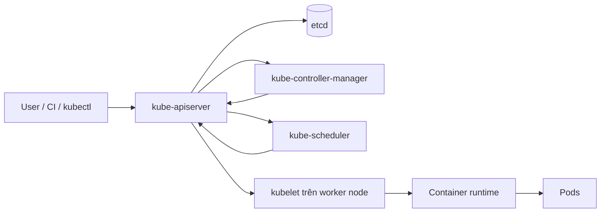
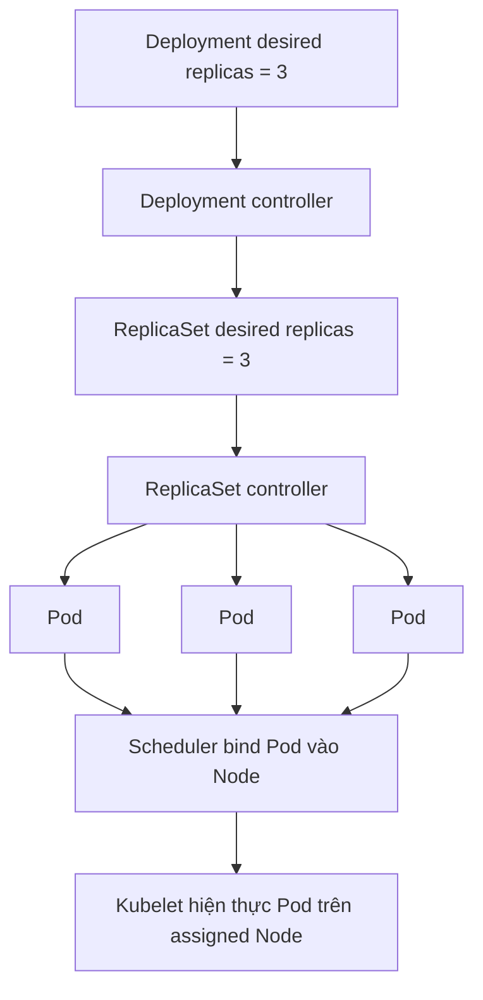
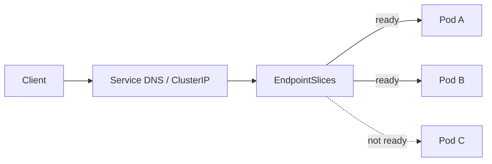
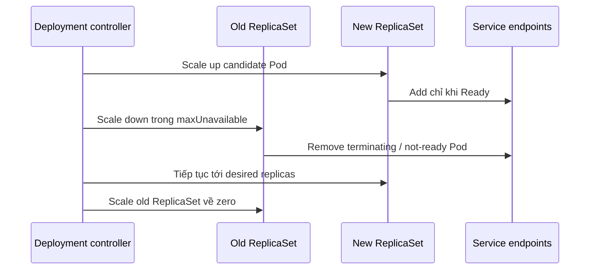

# Kubernetes Fundamentals: Suy luận Reconciliation, Pod, Scheduling và Service

## TL;DR

Ngày 19 tháng 07 năm 2019, dịch vụ Hosted Prometheus của Grafana Cloud gặp outage 26 phút sau khi rollout Kubernetes Pod Priority tạo một chuỗi preemption ngoài dự kiến. Một customer cluster mới dùng default priority mức medium trong khi production ingester cũ chưa được gán mức priority cao hơn như thiết kế. Ingester mới preempt production ingester; ReplicaSet production lại tạo replacement Pod, replacement đó tiếp tục nhận default medium rồi preempt thêm production ingester khác. Kubernetes tiếp tục reconcile đúng theo cấu hình, nhưng scheduling policy toàn cluster đã mã hóa sai ý định. **Bài học không phải Kubernetes bỏ qua desired state; placement và policy cũng là một phần desired state, và controller có thể khuếch đại một declaration sai rất trung thành.**

> 💡 **Quy tắc bỏ túi:** Đọc Kubernetes như chuỗi contract: **API object spec → controller reconciliation → scheduler placement → kubelet runtime → readiness → Service endpoints**. Khi production không khớp ý định, tìm contract đầu tiên nơi observed state lệch thay vì xem cả cluster như một cỗ máy đen.

- **Kubernetes là reconciliation system:** Bạn submit desired state vào API; controller liên tục so desired với actual state và tạo thay đổi thay vì chạy một deployment script một lần rồi kết thúc.
- **Pod là execution unit có thể thay thế:** Pod là đơn vị scheduling/runtime cho một hoặc nhiều container tightly coupled, không phải server identity bền vững. Deployment, ReplicaSet, StatefulSet, DaemonSet, Job và CronJob quản lý lifecycle Pod cho các workload shape khác nhau.
- **Placement và runtime health tách biệt:** Scheduler quyết định Pod fit ở Node nào; kubelet chạy container và probe; Pod có thể `Running` nhưng chưa `Ready`, và Pod đã schedule vẫn có thể crash, fail probe hoặc bị loại khỏi Service traffic.
- **Service tách client khỏi Pod churn:** Label/selector và EndpointSlice nối stable Service identity với tập backend hiện tại đang ready trong khi Pod được tạo, thay thế hoặc reschedule.
- **Cạm bẫy chết người:** Giả định Kubernetes tự hiểu business intent. Selector, probe, request, limit, priority, rollout setting hoặc workload type sai có thể khiến control plane làm hệ thống fail nhanh hơn và nhất quán hơn.



<TermBox term="Reconciliation">
**Reconciliation / đối chiếu trạng thái** là control-loop chạy lặp: so desired state đã khai báo với actual state quan sát được rồi thực hiện action để kéo hệ thống gần declaration hơn. Đây là quá trình liên tục, không phải lệnh "apply một lần rồi quên".
</TermBox>

## Kubernetes là API-driven control system

Kubernetes thường được giới thiệu là container orchestrator, nhưng mental model hữu ích hơn là:

```text
declare object
  -> lưu desired state trong API
  -> controller observe object
  -> scheduler assign Pod chưa có Node
  -> kubelet hiện thực Pod spec trên Node
  -> status và event quay về API
  -> controller tiếp tục reconcile
```

**API server** là trung tâm tương tác. Human, `kubectl`, CI system, controller, scheduler, admission component và extension giao tiếp qua Kubernetes API thay vì chỉnh trực tiếp process trên worker.

API server lưu cluster state trong **etcd**, consistent key-value backing store.

Ở cấp object, hãy tách:

- `spec`: bạn muốn gì;
- `status`: Kubernetes đang observe gì;
- `metadata`: identity, label, annotation, ownership, version và metadata khác.

Vì vậy "YAML được accept" chỉ chứng minh API đã nhận object. Nó không chứng minh workload đã schedule, healthy, ready, reachable hoặc đang serve đúng version.

## Control plane không chạy application container của bạn

Control plane điều phối state.

Các responsibility chính:

- **kube-apiserver:** validate và expose Kubernetes HTTP API;
- **etcd:** lưu API state;
- **kube-scheduler:** chọn Node cho Pod chưa được assign;
- **kube-controller-manager:** chạy built-in controller để reconcile resource;
- cloud-specific integration có thể do cloud controller manager xử lý.

Worker **Node / nút** chạy application workload.

Trên mỗi Node, **kubelet** watch Pod assignment dành cho Node đó rồi yêu cầu container runtime tạo và duy trì container theo Pod spec.



Controller thường không tự start container. Nó create/update API object; control loop khác tiếp tục chain.

Decomposition này quan trọng khi debug vì symptom có thể thuộc stage khác stage bạn nghi đầu tiên.

## Pod là smallest deployable compute object

<TermBox term="Pod">
**Pod** là smallest deployable compute object của Kubernetes. Nó chứa một hoặc nhiều container tightly coupled, share network namespace và có thể share volume. Scheduler place cả Pod như một unit lên một Node.
</TermBox>

Pod **không** phải "container có YAML bọc quanh."

Nhiều container trong một Pod hợp lý khi chúng tạo thành một local execution unit:

- phải co-schedule;
- giao tiếp qua `localhost`;
- share lifecycle hoặc local volume;
- một container là sidecar/helper của primary application.

Đừng đặt service không liên quan vào cùng Pod chỉ vì chúng nói chuyện với nhau.

Pod là entity tương đối **ephemeral / có thể thay thế**. Nếu Node biến mất, controller cấp cao thường create replacement Pod; nó không hồi sinh cùng Pod identity trên Node khác.

Vì vậy application không nên phụ thuộc Pod name hoặc Pod IP ổn định.

## Thường quản lý Pod qua workload controller

Create naked Pod thủ công hữu ích cho experiment, nhưng production workload thường cần controller.

### Deployment

**Deployment** quản lý ReplicaSet và cung cấp declarative rollout/rollback cho workload thường là stateless.

Update Deployment Pod template tạo ReplicaSet mới. Trong rolling update, Kubernetes scale ReplicaSet mới lên và old ReplicaSet xuống theo setting như `maxSurge` và `maxUnavailable`.

### ReplicaSet

**ReplicaSet** duy trì target số lượng matching Pod.

Nếu một managed Pod biến mất, ReplicaSet create Pod khác vì desired replicas và actual replicas không còn khớp.

Đó chính là mechanism góp phần vào incident Grafana: replacement là đúng từ góc nhìn ReplicaSet, nhưng cluster-wide priority policy làm mỗi replacement gây hại.

### StatefulSet

Dùng **StatefulSet** khi correctness cần stable network identity, stable persistent-storage relationship hoặc ordered lifecycle behavior.

StatefulSet không tự biến application thành state-safe. Database replication, backup, quorum, consistency và failover semantics vẫn thuộc database/system.

### DaemonSet

**DaemonSet** hướng tới chạy một Pod trên mỗi eligible Node, thường cho node-local agent như logging, networking hoặc monitoring.

First-time DaemonSet trên cluster lớn có thể create nhiều Pod rất nhanh, nên scope và resource impact phải được reasoning.

### Job và CronJob

**Job** biểu diễn finite work cần hoàn thành.

**CronJob** create Job theo schedule.

Đừng ép batch work vào luôn-running Deployment chỉ vì quen Deployment.

## Ownership giải thích vì sao object cứ quay lại

Kubernetes API object có thể có **ownerReferences / tham chiếu chủ sở hữu**.

Chain phổ biến:

```text
Deployment
  owns ReplicaSet
    owns Pods
```

Nếu bạn delete một managed Pod rồi nó quay lại ngay, Kubernetes không "phớt lờ" bạn. Owner controller thấy actual state thấp hơn desired state rồi reconcile.

Trước khi delete/edit generated child object thủ công, hãy hỏi:

- object này do ai own?
- controller nào sẽ rewrite/recreate nó?
- desired state có nên đổi ở owner không?

Cách này tránh đánh nhau với controller loop.

## Label và selector tạo relationship

Kubernetes dùng label và selector để nối nhiều resource.

Service có thể select Pod với:

```yaml
app: payments
tier: api
```

ReplicaSet của Deployment cũng dùng selector để xác định Pod nó quản lý.

Selector vì vậy là correctness-critical join.

Failure phổ biến:

- Service selector match zero Pod;
- Service selector match Pod của component khác;
- Deployment selector và Pod-template label không khớp;
- NetworkPolicy selector target rộng hơn dự kiến;
- monitoring rule attach nhầm label.

Hãy coi label quan trọng như API design, không phải decoration.

## Service tạo stable reachability trên tập Pod thay đổi

<TermBox term="Service">
Kubernetes **Service** cho client stable network identity tới một logical backend trong khi tập Pod thực tế thay đổi. Với selector-based Service, control plane duy trì EndpointSlice biểu diễn endpoint hiện tại và readiness information của chúng.
</TermBox>



Service không create application replica. Nó route tới endpoint.

Deployment không cung cấp stable client endpoint. Nó quản lý Pod.

Đó là hai contract riêng.

Với selector-based Service, EndpointSlice controller track matching Pod. Readiness ảnh hưởng endpoint có được dùng cho normal Service traffic hay không.

Nếu `curl service-name` fail trong khi Pod nhìn healthy, inspect:

1. Service selector;
2. Pod label;
3. EndpointSlice;
4. readiness;
5. Service `port` và `targetPort`;
6. network policy/data plane sau khi object relationship đã đúng.

## Pod phase không phải traffic readiness

Pod phase như `Pending`, `Running`, `Succeeded` hoặc `Failed` chỉ là coarse lifecycle summary.

**`Running` không đồng nghĩa `Ready` / sẵn sàng.**

Pod có thể Running trong khi:

- application đang warm cache;
- required connection pool unavailable;
- readiness probe fail;
- một container healthy còn container khác không;
- Service selector không match;
- Pod đang terminate.

Phân biệt này là một trong các Kubernetes debugging habit giá trị nhất.

## Startup, readiness và liveness trả lời ba câu khác nhau

### Startup probe

**Startup probe** hỏi initialization đã hoàn thành đủ để normal health check bắt đầu chưa.

Nó bảo vệ slow-starting app khỏi bị liveness kill quá sớm.

### Readiness probe

**Readiness probe** hỏi Pod này có nên nhận traffic ngay bây giờ không.

Readiness fail làm Pod bị loại khỏi normal ready Service endpoint trong khi container vẫn chạy.

Dùng readiness cho trạng thái tạm thời chưa serve được traffic.

### Liveness probe

**Liveness probe** hỏi restart container có phải recovery action phù hợp không.

Liveness fail có thể khiến kubelet restart container.

Điều này làm liveness nguy hiểm nếu dùng như generic dependency check. Nếu database chậm và mọi app Pod fail liveness vì probe query database, Kubernetes có thể restart cả fleet và khuếch đại outage.

Kubernetes docs cảnh báo liveness implement sai có thể gây cascading failure.

## Container restart và Pod replacement là event khác nhau

Bên trong Pod, container restart theo `restartPolicy`.

Startup failure lặp lại có thể hiện thành `CrashLoopBackOff`, tức backoff quanh repeated container restart attempt.

Nhưng container restart không giống replace Pod object.

Ví dụ:

- liveness fail: thường restart container trong cùng Pod;
- Deployment rollout: create replacement Pod từ ReplicaSet mới;
- Node loss: controller về sau create replacement Pod nơi khác;
- manual Pod delete: owner controller create Pod mới.

Identity/failure boundary bạn đang reasoning rất quan trọng.

## Graceful termination là một phần rollout correctness

Khi Kubernetes terminate Pod, kubelet thường cho container grace period và gửi `SIGTERM` trước forceful termination.

Application nên:

- ngừng nhận work mới;
- drain/finish in-flight work khi có thể;
- close listener/connection sạch;
- exit trước khi `terminationGracePeriodSeconds` hết.

Process ignore SIGTERM có thể biến rolling update bình thường thành request loss.

Readiness và termination liên quan nhưng không đồng nhất. Đừng nghĩ "có probe" nghĩa shutdown đã graceful.

## Scheduling trả lời "Pod này có thể chạy ở đâu?"

Scheduler watch unscheduled Pod và chọn Node.

Nó xét thông tin như:

- resource requests;
- node availability;
- affinity/anti-affinity;
- topology constraint;
- taint/toleration;
- priority và preemption;
- storage/hardware constraint.

Scheduling chỉ succeed khi ít nhất một Node thỏa placement contract.

Pod nằm `Pending` vì vậy có thể là capacity hoặc constraint problem, không phải container-runtime problem.

## Requests và limits là hai resource contract khác nhau

### Requests ảnh hưởng scheduling

CPU/memory **resource request / yêu cầu tài nguyên** cho scheduler biết lượng resource cần reserve khi quyết định placement.

Nếu Node có real idle CPU nhưng không đủ *unallocated requested capacity*, Pod vẫn có thể `Pending` / `Unschedulable` / không schedule được.

Request vì vậy là một phần capacity accounting và bin packing.

### Limits constrain runtime

CPU/memory **resource limit / giới hạn tài nguyên** ảnh hưởng container đang chạy được consume bao nhiêu.

Hậu quả điển hình:

- chạm CPU limit có thể bị **CPU throttling / giới hạn CPU**;
- vượt effective memory limit có thể bị **OOM / out-of-memory kill**.

Request không phải "expected usage" và limit không phải "scheduler reservation." Chúng tác động stage khác nhau.

Value sai tạo failure mode khác nhau:

- request quá cao → utilization thấp, Pod unschedulable, cluster dư capacity;
- request quá thấp → scheduler pack quá nhiều workload so với demand thật;
- memory limit quá thấp → OOM/restart loop;
- CPU limit quá chặt → latency do throttling.

## Priority và preemption là cluster-level policy

Pod Priority cho workload quan trọng schedule trước workload priority thấp hơn, và preemption có thể remove Pod thấp hơn để tạo chỗ.

Nó mạnh vì thay đổi ai mất capacity khi contention.

Incident Grafana 2019 cho thấy default priority không phải cosmetic field. Khi Pod của cluster mới nhận default medium còn production ingester cũ không có priority, scheduler preemption decision tương tác với ReplicaSet reconciliation và tạo cascade.

Trước khi introduce priority:

- xác định workload nào có thể bị preempt;
- verify replacement Pod không tái tạo cùng pressure loop;
- model capacity khi rollout;
- làm default priority behavior có chủ đích;
- test trên cluster composition giống production, không chỉ isolated workload.

## Configuration và secret là API concern riêng

**ConfigMap** lưu non-confidential configuration.

Kubernetes **Secret** lưu confidential data cho Pod/component, nhưng chỉ dùng Secret object chưa hoàn thành secret-management lifecycle.

Dùng [Secrets Management](/vi/docs/cloud-infrastructure/secrets-management) cho delivery, external secret store, rotation, revocation, auditing, loại secret zero và runtime-compromise boundary.

Kubernetes-specific question vẫn gồm:

- environment variable hay mounted file?
- application có reload update không?
- ServiceAccount nào access Secret?
- control-plane data có encryption at rest chưa?
- controller có copy secret material vào object khác không?

Đừng để sensitive data trong ConfigMap.

## ServiceAccount là workload identity bên trong cluster

**ServiceAccount / service account** là namespaced non-human identity mà Pod có thể dùng để authenticate tới Kubernetes API và, qua integration phù hợp, đôi khi tới external system.

Đừng để mọi workload dựa vào default ServiceAccount của namespace.

Assign dedicated ServiceAccount khi workload cần permission và chỉ grant RBAC cần thiết.

Với cloud API access, managed Kubernetes hiện đại có thể integrate Kubernetes workload identity với cloud IAM. Exact mapping phụ thuộc provider; bài [Cloud IAM](/vi/docs/cloud-infrastructure/cloud-iam) sở hữu trust/permission detail theo provider đó.

## Namespace scope name và policy, không phải magical isolation

**Namespace / không gian tên** tạo scope cho nhiều Kubernetes object và name.

Nó hữu ích cho:

- organizational boundary;
- RBAC scope;
- quota/policy scope;
- tránh name collision;
- group workload.

Namespace tự nó **không** phải complete security, network hoặc failure-isolation boundary.

Để network isolation, **NetworkPolicy / network policy** có thể restrict Pod traffic khi network plugin của cluster thực sự implement enforcement.

Với multi-tenancy mạnh hơn, còn phải reasoning RBAC, Pod security, node isolation, admission control, quota, secret, cloud IAM và đôi khi separate cluster.

## Pod-local storage không phải persistent application state

Container writable layer và nhiều Pod-local volume gắn với Pod lifecycle.

Với durable storage, Kubernetes có abstraction **PersistentVolume (PV)** và **PersistentVolumeClaim (PVC)**.

PVC là request storage từ workload; PV biểu diễn provisioned storage có lifecycle độc lập với individual Pod.

Abstraction đó không xóa storage semantics. Vẫn phải hiểu backing storage model, access mode, zone/topology, performance, snapshot và recovery từ [Cloud Storage Models](/vi/docs/cloud-infrastructure/cloud-storage-models).

StatefulSet có thể coordinate stable Pod/storage identity nhưng không tự làm database scale/failover an toàn.

## Rolling update là controller behavior, không phải bảo đảm zero downtime

Deployment RollingUpdate thay đổi ReplicaSet dần dần.

Control chính:

- `maxSurge`: số Pod dư cho phép vượt desired replicas khi rollout;
- `maxUnavailable`: số desired replica có thể unavailable;
- readiness: lúc nào Pod mới tính available cho traffic;
- `minReadySeconds`: optional stability period trước khi available;
- `progressDeadlineSeconds`: rollout stall bao lâu trước khi Deployment report failure.

Zero downtime còn phụ thuộc:

- đủ cluster capacity cho surge;
- readiness probe đúng;
- backward/forward compatibility;
- graceful termination;
- traffic draining;
- dependency capacity;
- schema migration strategy.

Kubernetes có thể rollout đúng declaration mà application vẫn downtime.



Dùng `kubectl rollout status deployment/<name>` để observe rollout progress và hiểu `kubectl rollout undo` / rollback có thể và không thể revert gì. Deployment revision track Pod-template change; nó không rollback external database, ConfigMap content, cloud resource hoặc third-party side effect tự động.

## Debug Kubernetes bằng cách follow object chain

Order hữu ích:

### 1. Đọc desired và observed state

```bash
kubectl get deployment,pods,service
kubectl get pod <pod> -o yaml
```

Xem:

- `spec`;
- `status`;
- `status.conditions` / điều kiện trạng thái;
- ready/available replica count;
- generation/observed generation khi liên quan.

### 2. Hỏi controller chuyện gì đã xảy ra

```bash
kubectl describe deployment <name>
kubectl describe pod <pod>
```

Phần **Events / sự kiện** thường lộ:

- scheduling failure;
- image pull failure;
- failed mount;
- probe failure;
- eviction;
- preemption;
- admission error.

Event là evidence hữu ích nhưng không phải durable long-term logging system.

### 3. Follow ownership

Check owner reference:

```text
Pod -> ReplicaSet -> Deployment
```

Fix owner-level desired state thay vì patch generated child lặp lại.

### 4. Đọc application log

```bash
kubectl logs <pod>
kubectl logs <pod> -c <container>
```

Với restarted container, inspect previous-instance log khi phù hợp.

### 5. Trace Service reachability

Check:

- label và Service selector;
- Pod Ready condition;
- EndpointSlice;
- port;
- NetworkPolicy;
- DNS/network data plane chỉ sau khi API relationship đã hợp lý.

Cách này biến "Kubernetes hỏng" thành chuỗi câu hỏi có thể falsify.

## Micro-scenario production: một probe endpoint biến database slowdown thành fleet restart

Checkout API có 30 replica. Team cấu hình cùng endpoint `/health` cho readiness và liveness. Endpoint này query database. Khi database latency spike, probe timeout trên cả fleet. Pod trước hết not ready, sau đó liveness failure làm kubelet restart container đồng thời. Startup lại tạo connection pool và cache warm-up load lên database vốn đã degraded.

- **Hậu quả:** Available API capacity collapse trong dependency slowdown; request error tăng và recovery lâu hơn vì application fleet liên tục restart/reconnect.
- **Nguyên nhân cốt lõi:** Team model "database tạm thời chậm" thành "application process này dead không hồi phục." Liveness encode dependency condition mà restart không sửa được.
- **Cách khắc phục chuẩn:** Để readiness biểu diễn ability to serve traffic, giữ liveness tập trung vào process state mà restart thật sự corrective, dùng startup probe cho slow initialization, stagger threshold, giữ dependency behavior bounded và test probe failure semantics khi dependency degraded.

## Kiểm tra mental model

> **Tình huống:** `kubectl get pods` cho thấy cả bốn API Pod đều `Running`, nhưng request qua Service trả 503. Engineer kết luận Service implementation hoặc kube-proxy hỏng vì "mọi Pod đều đang chạy."

<details>
<summary>Show the reasoning</summary>

`Running` là Pod phase, không phải bằng chứng readiness hoặc Service membership.

Trước tiên inspect cột `READY` và Pod readiness condition. Sau đó so Service selector với Pod label và inspect EndpointSlice.

Nếu EndpointSlice không có ready endpoint, vấn đề nằm trước Service packet routing: Pod có thể fail readiness hoặc Service select sai label set.

Chỉ sau khi object relationship đúng mới đi sâu Service port, NetworkPolicy, DNS, CNI/service-proxy behavior hoặc node networking.

Reasoning chain là:

```text
Pod tồn tại
  != Pod Ready
  != được Service select
  != xuất hiện như ready endpoint
  != traffic path đã được chứng minh healthy
```

</details>

## Checklist Kubernetes Fundamentals

- [ ] **Desired state:** Object nào chứa declaration thật sự bạn muốn đổi?
- [ ] **Ownership:** Controller nào own object đang fail hoặc cứ bị recreate?
- [ ] **Pod model:** Tightly coupled container có được group có chủ đích, với Pod được xem là replaceable không?
- [ ] **Workload controller:** Deployment, StatefulSet, DaemonSet, Job hay CronJob có đúng lifecycle abstraction không?
- [ ] **Selectors:** Deployment, Service, NetworkPolicy và observability selector có chỉ match Pod dự kiến không?
- [ ] **Placement:** Request, affinity, topology, taint/toleration, priority và capacity có tương thích scheduling không?
- [ ] **Resources:** Request có realistic cho placement và CPU/memory limit có an toàn cho runtime behavior không?
- [ ] **Health:** Startup, readiness và liveness probe có trả lời ba operational question khác nhau đúng không?
- [ ] **Termination:** Process có handle SIGTERM và finish trong `terminationGracePeriodSeconds` không?
- [ ] **Service path:** Service selector, EndpointSlice, readiness, port và NetworkPolicy có tạo path hợp lệ không?
- [ ] **Configuration:** Non-secret setting có ở ConfigMap và sensitive value đi qua secret-management path chủ đích không?
- [ ] **Identity:** Mỗi workload có ServiceAccount phù hợp và chỉ RBAC/cloud permission cần thiết không?
- [ ] **Storage:** Durable state có ở PVC/PV hoặc external system có chủ đích thay vì Pod-local storage không?
- [ ] **Rollout:** `maxSurge`, `maxUnavailable`, readiness, capacity, compatibility và rollback behavior đã hiểu chưa?
- [ ] **Evidence:** Đã check `status.conditions`, Events, ownerReferences, `kubectl describe` và application log trước khi đoán root cause chưa?

## Bài này cố ý không cover gì

Bài này giải thích Kubernetes execution/reconciliation model.

Nó **không** dạy full **cluster administration / quản trị cluster / vận hành control plane** như:

- etcd backup/disaster recovery;
- API-server high availability;
- cluster upgrade;
- certificate rotation;
- CNI/CSI lifecycle;
- admission-webhook operations;
- multi-cluster fleet management.

Bài này cũng **không dạy Helm** chart authoring và **không dạy Terraform**/Pulumi workflow. Các phần đó thuộc [Infrastructure as Code](/vi/docs/cloud-infrastructure/infrastructure-as-code).

Autoscaling mechanics, HPA/VPA behavior, metrics và cluster capacity expansion thuộc [Autoscaling](/vi/docs/cloud-infrastructure/autoscaling).

Mental model bền vững cần giữ đơn giản hơn: **Kubernetes lưu desired state thành API object và chạy các control loop phối hợp để liên tục kéo observed state về gần declaration đó.**

## Nguồn

- [Kubernetes — Components](https://kubernetes.io/docs/concepts/overview/components/)
- [Kubernetes — Controllers](https://kubernetes.io/docs/concepts/architecture/controller/)
- [Kubernetes — Pods](https://kubernetes.io/docs/concepts/workloads/pods/)
- [Kubernetes — Pod lifecycle](https://kubernetes.io/docs/concepts/workloads/pods/pod-lifecycle/)
- [Kubernetes — Deployments](https://kubernetes.io/docs/concepts/workloads/controllers/deployment/)
- [Kubernetes — Services](https://kubernetes.io/docs/concepts/services-networking/service/)
- [Kubernetes — EndpointSlices](https://kubernetes.io/docs/concepts/services-networking/endpoint-slices/)
- [Kubernetes — Liveness, readiness, and startup probes](https://kubernetes.io/docs/concepts/workloads/pods/probes/)
- [Kubernetes — ConfigMaps](https://kubernetes.io/docs/concepts/configuration/configmap/)
- [Kubernetes — Persistent Volumes](https://kubernetes.io/docs/concepts/storage/persistent-volumes/)
- [Kubernetes — Service Accounts](https://kubernetes.io/docs/concepts/security/service-accounts/)
- [Kubernetes — Network Policies](https://kubernetes.io/docs/concepts/services-networking/network-policies/)
- [Grafana Labs — How a Production Outage Was Caused Using Kubernetes Pod Priorities](https://grafana.com/blog/how-a-production-outage-was-caused-using-kubernetes-pod-priorities/)

## Bài liên quan

- [Containers](/vi/docs/cloud-infrastructure/containers)
- [Secrets Management](/vi/docs/cloud-infrastructure/secrets-management)
- [Cloud IAM](/vi/docs/cloud-infrastructure/cloud-iam)
- [Cloud Storage Models](/vi/docs/cloud-infrastructure/cloud-storage-models)
