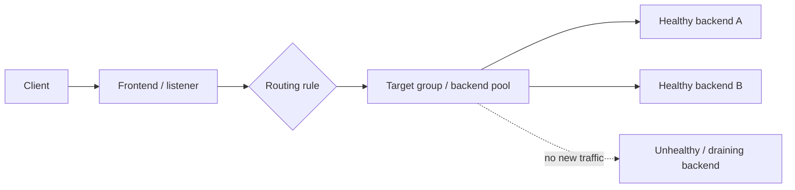
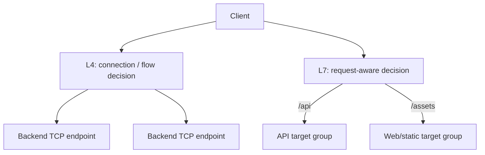
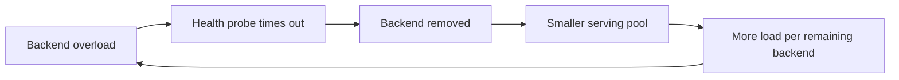
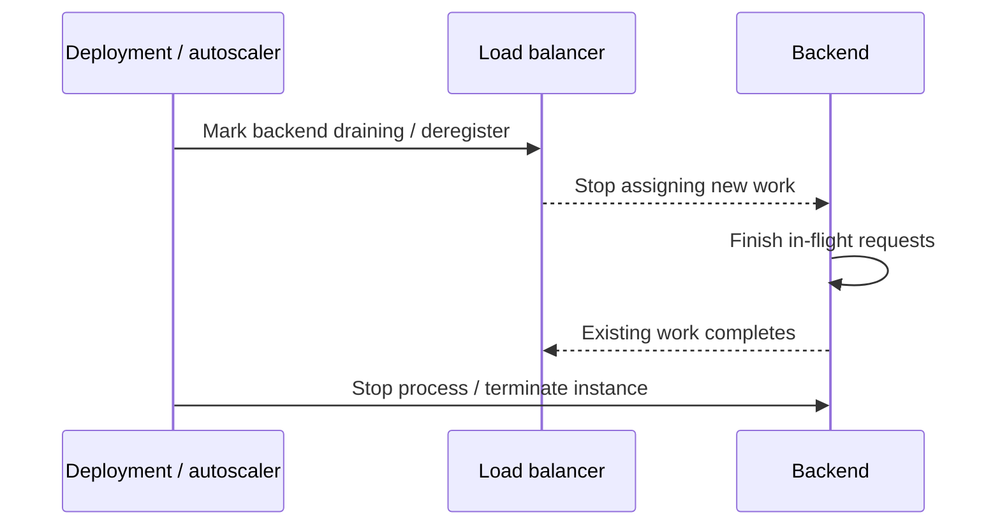

# Load Balancing: Operate Traffic Distribution, Health, and Draining

## TL;DR

On May 12, 2020, Slack suffered a 48-minute outage after its load-balancing control path stopped keeping HAProxy backend state fresh. Slack had rapidly scaled its web tier earlier that day, but a synchronization bug left many HAProxy processes with stale backend lists. When autoscaling later terminated older web instances, most load balancers still knew mainly about those old instances, so usable serving capacity collapsed even though newer webapp capacity existed. During the outage, overloaded instances also timed out health checks and were removed from service. **A load balancer is only as correct as its backend membership, health signal, routing policy, and target lifecycle.**

> 💡 **Rule of thumb:** Operate load balancing as a **traffic-control state machine**, not a magic even-spread box. Know which backends are eligible, why they are healthy, how a request is assigned, what happens during overload, and how a target enters or leaves service without dropping in-flight work.

- **The data path starts with protocol semantics:** Layer 4 balances connections using transport-level information; Layer 7 terminates or understands application protocols and can route by host, path, header, or other request attributes.
- **Backend eligibility comes before distribution:** Service discovery or registration defines possible targets; health/readiness determines which targets should receive new traffic.
- **Algorithms encode assumptions:** Round robin, least-outstanding/least-request, weighted routing, and hash-based distribution behave differently under unequal request cost, unequal backend capacity, and long-lived connections.
- **Target lifecycle is part of deploy safety:** Registration, warm-up or slow start, readiness, deregistration, and connection draining must align with application startup and graceful shutdown.
- **Fatal pitfall:** Using a health check that flips overloaded-but-recoverable instances out of service faster than remaining instances can absorb the traffic. The smaller pool becomes even hotter, more checks fail, and the load balancer can create an outage-amplifying feedback loop.



<TermBox term="Listener and Backend Pool">
A **listener** (or frontend) accepts traffic on an address, port, and protocol. A **target group / backend pool** is the set of destinations eligible for a routing rule. Cloud products use different names, but the operational boundary is the same: first match incoming traffic, then choose from an eligible backend set.
</TermBox>

## L4 and L7 answer different routing questions

A **Layer 4 (L4 / transport layer)** load balancer generally routes TCP, UDP, TLS, QUIC, or similar flows using network and transport information. It is useful when the application protocol should pass through unchanged, very high connection throughput matters, or routing decisions do not need HTTP semantics.

A **Layer 7 (L7 / application layer)** load balancer understands an application protocol such as HTTP. It can often:

- terminate TLS and present a managed certificate;
- route `api.example.com` and `static.example.com` differently;
- route `/checkout` and `/images` to different target groups;
- redirect HTTP to HTTPS;
- attach request-aware authentication, header manipulation, or web security features depending on the product.



Do not call L7 "better" than L4. Choose the layer that exposes the routing information you actually need while preserving the desired protocol and performance characteristics.

## The complete data path has two decisions

Operate a request in two stages:

1. **Rule selection:** Which listener and routing rule owns this traffic?
2. **Backend selection:** Which currently eligible target in that rule's pool receives it?

This distinction matters during debugging. A request can hit the correct load balancer but the wrong target group because of host/path rule precedence. Or it can hit the correct target group but fail because every member is unhealthy, draining, saturated, or unreachable.

Trace:

```text
DNS / VIP
  -> load-balancer frontend
  -> listener protocol + port
  -> routing rule
  -> target group / backend pool
  -> health/readiness eligibility
  -> distribution algorithm
  -> backend port
  -> application process
```

Then trace the return path as well. Network policy, source preservation, proxies, NAT, and TLS boundaries can differ between products.

## Health checks decide eligibility, not truth

<TermBox term="Health Check">
A **health check / health probe** is a repeated observation used by the load balancer to decide whether a backend should receive new traffic. It is an operational routing signal, not proof that every feature, dependency, or business transaction is correct.
</TermBox>

A useful health design separates at least two questions:

- **Is the process alive enough to make progress?**
- **Is this instance ready to receive new traffic now?**

A TCP connect probe proves something is listening, but not that the application can serve a valid request. An HTTP `/ready` endpoint can check more, but it can also become dangerous if it treats every transient dependency issue as a reason to remove the backend.

A health check is **not** a complete business-correctness test. If every instance marks itself unhealthy whenever a shared database is briefly slow, the load balancer can remove the whole fleet even though routing fewer requests might have allowed recovery.

### Health thresholds trade detection speed for stability

The common controls are:

- probe interval;
- timeout;
- unhealthy threshold;
- healthy threshold;
- expected status or response;
- check location or source.

Fast failure detection reduces time spent routing to a dead backend. But aggressive thresholds can create **flapping** when latency is near the probe timeout. Flapping repeatedly adds and removes capacity, causing traffic oscillation and connection churn.

Tune probes against actual failure/recovery times and alert on health-state transitions.

## Overload can make health checks amplify the incident



This feedback loop is especially dangerous when:

- health checks compete with user traffic for the same saturated worker pool;
- thresholds are too aggressive;
- autoscaling takes longer than health removal;
- every instance depends on the same slow database or downstream service;
- there is no load shedding or concurrency bound.

The Slack 2020 incident demonstrated multiple parts of this failure model: stale HAProxy membership concentrated traffic on a subset of hosts, and heavily loaded API instances timed out load-balancer health checks and were removed from service.

Correct operation requires capacity signals outside the load balancer too: CPU, queue depth, request concurrency, dependency latency, and saturation.

## Distribution algorithms are workload assumptions

No routing algorithm can make unequal work perfectly equal.

### Round robin

**Round robin** rotates new requests or connections across eligible targets. It is easy to reason about when targets have similar capacity and request cost is reasonably uniform.

It can perform poorly when one request runs for 20 ms and another for 20 seconds.

### Least outstanding / least request

A **least outstanding requests** or **least request** policy prefers backends with less current work. This can better adapt to variable request duration, but the exact metric and implementation are product-specific.

### Weighted routing

**Weighted** distribution sends different traffic shares to targets or pools. Use it when capacities differ or when deliberately shifting traffic, but verify whether weights apply per request, connection, endpoint, or higher-level pool.

### Hash-based routing

L4 products often use a flow hash such as source/destination addresses, ports, and protocol. Azure Load Balancer, for example, documents a five-tuple hash as its default distribution mode.

A hash gives stable mapping for a flow, not necessarily an even number of active requests. A few elephant flows can dominate one backend.

## Stickiness is coupling, not free locality

**Sticky sessions / session affinity** intentionally bias a client or session toward the same backend.

That can be useful for:

- legacy server-side session state;
- caches that are expensive to repopulate;
- protocols or applications that require affinity.

But stickiness reduces the load balancer's freedom to redistribute traffic. It can create hot backends, complicate failover, and hide an application-state problem.

Prefer externally shared or durable session state when possible. If stickiness is required, document:

- affinity key;
- cookie or hash lifetime;
- behavior when the target becomes unhealthy;
- how deployments and autoscaling affect existing sessions.

## TLS termination changes trust and observability boundaries

An L7 load balancer often **terminates TLS**: the client establishes HTTPS to the load balancer, which then forwards traffic to the backend over HTTP or a new TLS connection.

That changes:

- where certificates and private keys are managed;
- where client TLS metadata is visible;
- whether the backend sees the original client address directly or through forwarded metadata;
- whether traffic from load balancer to backend is encrypted;
- where protocol-level metrics and access logs exist.

Do not conflate "TLS terminated at the load balancer" with "backend traffic is secure." Define the second hop explicitly.

## New targets need readiness before full traffic

Registration is not the same as readiness.

A new instance may still be:

- warming JIT/runtime caches;
- establishing database pools;
- loading model or application data;
- populating local caches;
- waiting for schema/configuration compatibility.

AWS Application Load Balancer exposes a **slow start** target-group setting that can linearly increase a newly healthy target's share over a configured interval. Other platforms expose different readiness and rollout controls.

Whether or not the product has a slow-start feature, application readiness must prevent traffic before initialization is complete.

## Remove targets in the opposite order: stop new work, then drain

<TermBox term="Connection Draining">
**Connection draining** is the transition where a backend stops receiving new work while existing requests or connections are given time to finish. AWS calls the related target-group window a deregistration delay; Google Cloud also exposes connection-draining controls for supported backend types.
</TermBox>



A safe shutdown sequence is usually:

1. mark the instance not-ready or begin deregistration;
2. stop assigning new work;
3. allow **in-flight** requests/connections to complete within a bounded drain window;
4. terminate the application only after the grace period or known completion condition.

If the application exits first and deregistration propagates later, clients can receive resets or 5xx responses during every deployment.

Long-lived WebSocket, streaming, and TCP connections need a product-specific migration/reconnect strategy; "drain for 30 seconds" is not automatically enough.

## Zones change the capacity math

A multi-zone load balancer can have two related questions:

- Which zones can the frontend receive traffic in?
- Can a load-balancer node send traffic to healthy backends in other zones (**cross-zone** behavior)?

Provider defaults differ. Operate using the documented product behavior, not the generic phrase "multi-AZ."

Failure tests should include:

- one backend failure;
- one full zone losing backends;
- health checks failing from one location only;
- asymmetric backend counts per zone;
- cross-zone routing disabled or constrained;
- a deployment that temporarily reduces healthy capacity.

Keep enough healthy capacity after the failure you claim to tolerate.

## What happens when every backend is unhealthy?

This is one of the most important provider-specific questions.

AWS Application Load Balancer documents a **fail-open** behavior: if every registered target in a target group is unhealthy across enabled zones, it routes to all targets regardless of health status. That is a deliberate availability behavior, not a universal load-balancer rule.

Azure Standard Load Balancer documents different behavior for health-probe failure and established flows, and Google Cloud behavior varies by load-balancer/backend type.

Therefore record the exact selected product's behavior for:

- no healthy backends;
- all health probes failing;
- empty backend pool;
- zone failure;
- control-plane/API unavailability.

"Unhealthy means no traffic" is not portable.

## Provider examples: learn the product contract

| Platform | Useful operational examples | Important caveat |
| --- | --- | --- |
| **AWS Application Load Balancer** | L7 listener rules, target groups, round robin or least outstanding requests, health thresholds, stickiness, slow start, deregistration delay | ALB has documented fail-open behavior when all registered targets are unhealthy. Network Load Balancer has different L4 semantics. |
| **Google Cloud Load Balancing** | Multiple proxy and passthrough products, backend services, health checks, session affinity options, connection draining for supported backends | Health-check, timeout, affinity, and draining behavior depend on the selected load-balancer/backend type. |
| **Azure Load Balancer** | L4 frontend/rules/backend pools, TCP/HTTP/HTTPS health probes, five-tuple hash distribution, source-IP affinity options | It is not an L7 HTTP router; Azure's application-layer products have different contracts. Standard Load Balancer has specific all-probes-down behavior. |

The names look similar while semantics differ. Treat every load balancer as **product-specific** at the edges.

## Production micro-scenario: a "smart" readiness check takes the fleet down

A checkout service has 40 healthy application instances. Its readiness endpoint performs a database query with a 500 ms timeout. The primary database becomes slow for 20 seconds but remains capable of processing reduced traffic. Health probes hit the same database through every instance; most probes time out, so the load balancer removes 30 instances within seconds.

- **Impact:** Traffic concentrates on the 10 remaining backends, which saturate and also fail readiness. Client 5xx and latency spike even though the database might have recovered under reduced load.
- **Root cause:** The readiness check treated transient shared-dependency latency as proof that each backend was individually unable to serve. Aggressive thresholds converted dependency degradation into fleet-wide traffic oscillation.
- **Correct pattern:** Keep readiness focused on whether the instance itself can accept useful work, use dependency-aware degradation/load shedding separately, choose stable thresholds, cap concurrency, and alert on rapid healthy-host-count loss.

## Operate with four views of reality

Observe the load balancer and backend simultaneously.

### Traffic

- request/connection rate;
- bytes;
- routing rule and target group;
- per-target distribution;
- sticky-session concentration.

### Health

- healthy/unhealthy/draining target count;
- reason codes;
- health transition rate;
- probe latency and timeout.

### Outcome

- load-balancer-generated 4xx/5xx versus backend 4xx/5xx;
- backend latency;
- reset/timeout rate;
- TLS and handshake errors.

### Capacity

- backend CPU/memory;
- active/request concurrency;
- queue depth;
- connection pool usage;
- zone distribution;
- autoscaling state.

Access logs and metrics should let you answer: **which frontend accepted this request, which rule matched, which backend received it, and why was that backend eligible?**

## Check your mental model

> **Scenario:** A deployment script sends SIGTERM to a backend process and immediately deregisters it from the load balancer. The application needs up to 25 seconds to finish existing requests. The load balancer has a 60-second deregistration/connection-draining window. The team concludes the 60-second window guarantees zero dropped requests.

<details>
<summary>Show the reasoning</summary>

The order is wrong. Connection draining can only protect in-flight work if the backend stays alive while the load balancer stops assigning new traffic and existing work completes.

If the process begins shutting down or closes sockets before deregistration has propagated, requests can still fail despite a long drain setting. Begin draining first, stop new admissions, keep the application alive for in-flight work, then terminate after the relevant grace/drain condition.

Also verify long-lived connections separately; their expected lifetime may exceed the configured drain window.

</details>

## Load-balancing operations checklist

- [ ] **Layer:** Is this L4 flow balancing or L7 request routing, and do you know where TLS terminates?
- [ ] **Frontend:** Which address, listener, port, protocol, and routing rule receives this traffic?
- [ ] **Backend membership:** What system registers/removes targets, and how quickly does membership converge?
- [ ] **Health semantics:** Does the probe measure readiness without turning shared-dependency slowness into fleet-wide flapping?
- [ ] **Thresholds:** Are probe interval, timeout, and healthy/unhealthy thresholds backed by failure data?
- [ ] **Algorithm:** Does round robin, least-request, weighted, or hash-based routing match the workload shape?
- [ ] **Affinity:** Is stickiness necessary, and what happens to session state on target failure?
- [ ] **Warm-up:** Can new targets accept full traffic immediately, or do they need readiness/slow start?
- [ ] **Drain:** Does deregistration happen before process termination, with enough time for in-flight work?
- [ ] **Zones:** Is there enough healthy capacity after one zone or one backend pool fails?
- [ ] **All-unhealthy behavior:** Do you know whether this exact product fails open, fails closed, preserves flows, or does something else?
- [ ] **Observability:** Can access logs and metrics distinguish LB errors, backend errors, health transitions, saturation, and traffic skew?
- [ ] **Game day:** Have you tested backend failure, zone loss, probe failure, overload, and rolling deployment behavior?

## Sources

- [Slack Engineering — A Terrible, Horrible, No-Good, Very Bad Day at Slack](https://slack.engineering/a-terrible-horrible-no-good-very-bad-day-at-slack/)
- [Slack Engineering — All Hands on Deck](https://slack.engineering/all-hands-on-deck/)
- [AWS — What is an Application Load Balancer?](https://docs.aws.amazon.com/elasticloadbalancing/latest/application/introduction.html)
- [AWS — Health checks for Application Load Balancer target groups](https://docs.aws.amazon.com/elasticloadbalancing/latest/application/target-group-health-checks.html)
- [AWS — Application Load Balancer target-group attributes](https://docs.aws.amazon.com/elasticloadbalancing/latest/application/edit-target-group-attributes.html)
- [AWS — Register targets / connection draining](https://docs.aws.amazon.com/elasticloadbalancing/latest/application/target-group-register-targets.html)
- [Google Cloud — Backend services overview](https://cloud.google.com/load-balancing/docs/backend-service)
- [Google Cloud — Connection draining](https://cloud.google.com/load-balancing/docs/enabling-connection-draining)
- [Azure — Load Balancer distribution modes](https://learn.microsoft.com/en-us/azure/load-balancer/distribution-mode-concepts)
- [Azure — Load Balancer health probes](https://learn.microsoft.com/en-us/azure/load-balancer/load-balancer-custom-probe-overview)

## Related lessons

- [Cloud Networking](/docs/cloud-infrastructure/cloud-networking)
- [Cloud Compute](/docs/cloud-infrastructure/cloud-compute)
- [Serverless Compute](/docs/cloud-infrastructure/serverless-compute)
- [Service Resilience](/docs/backend-engineering/service-resilience)
