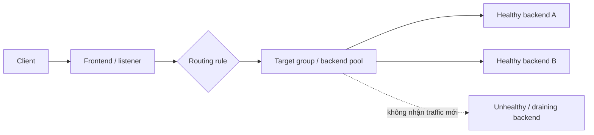
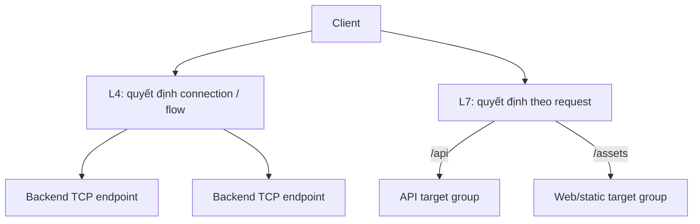
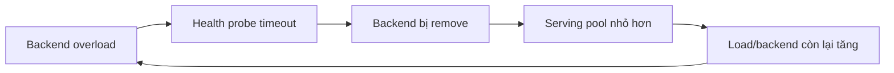
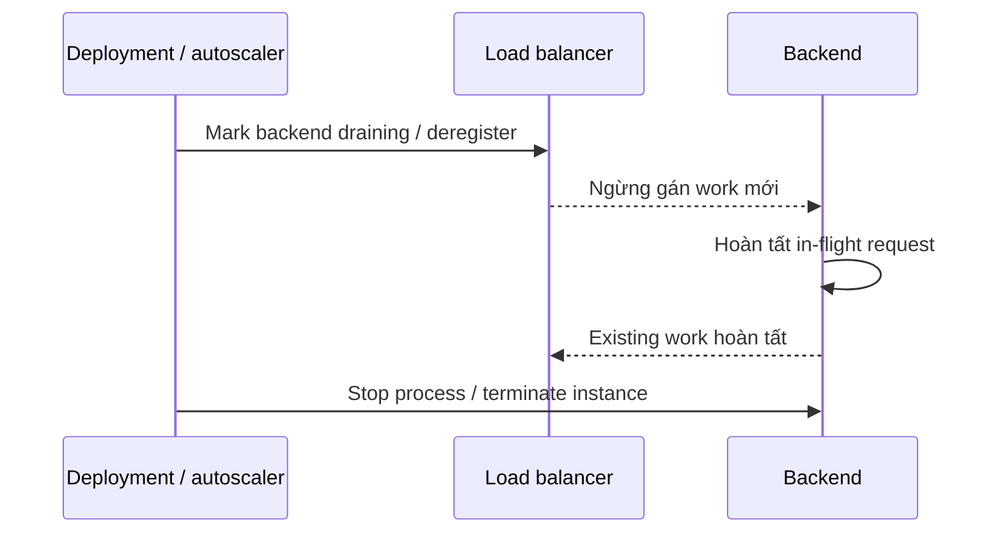

# Load Balancing: Vận hành Phân phối Traffic, Health và Draining

## TL;DR

Ngày 12 tháng 05 năm 2020, Slack gặp outage kéo dài 48 phút sau khi control path của load balancing ngừng cập nhật trạng thái backend HAProxy đúng cách. Slack đã scale web tier rất mạnh trước đó trong ngày, nhưng một bug đồng bộ để nhiều HAProxy process giữ danh sách backend stale. Khi autoscaling sau đó terminate các web instance cũ, phần lớn load balancer vẫn chủ yếu biết các instance cũ đó, khiến serving capacity mà LB nhìn thấy sụt mạnh dù các webapp instance mới vẫn tồn tại. Trong outage, instance bị quá tải cũng timeout health check và bị loại khỏi service. **Load balancer chỉ đúng khi backend membership, health signal, routing policy và target lifecycle của nó đúng.**

> 💡 **Quy tắc bỏ túi:** Vận hành load balancing như một **traffic-control state machine**, không phải hộp ma thuật chia đều request. Phải biết backend nào đang eligible, vì sao nó healthy, request được gán thế nào, điều gì xảy ra khi overload, và target vào/ra service ra sao mà không làm rơi in-flight work.

- **Data path bắt đầu từ protocol semantics:** Layer 4 phân phối connection bằng thông tin transport; Layer 7 terminate hoặc hiểu application protocol và có thể route theo host, path, header hoặc thuộc tính request khác.
- **Backend eligibility có trước distribution:** Service discovery/registration định nghĩa target có thể dùng; health/readiness quyết định target nào nên nhận traffic mới.
- **Algorithm mang theo giả định:** Round robin, least-outstanding/least-request, weighted routing và hash-based distribution phản ứng khác nhau khi request cost, backend capacity hoặc connection lifetime không đồng đều.
- **Target lifecycle là một phần deploy safety:** Registration, warm-up/slow start, readiness, deregistration và connection draining phải khớp startup/graceful shutdown của application.
- **Cạm bẫy chết người:** Dùng health check loại instance đang overload nhưng vẫn có khả năng hồi phục nhanh hơn tốc độ phần capacity còn lại có thể hấp thụ traffic. Pool nhỏ hơn càng nóng, thêm probe fail, và load balancer tạo feedback loop khuếch đại outage.



<TermBox term="Listener và Backend Pool">
**Listener** (hoặc frontend) nhận traffic trên address, port và protocol. **Target group / backend pool / nhóm đích** là tập destination eligible cho một routing rule. Cloud product dùng tên khác nhau, nhưng boundary vận hành giống nhau: trước hết match incoming traffic, sau đó chọn trong tập backend hợp lệ.
</TermBox>

## L4 và L7 trả lời hai câu hỏi routing khác nhau

**Layer 4 (L4 / lớp 4 / transport layer)** load balancer thường route TCP, UDP, TLS, QUIC hoặc flow tương tự bằng thông tin network/transport. Nó phù hợp khi application protocol cần pass-through không đổi, throughput connection rất cao là quan trọng, hoặc routing decision không cần HTTP semantics.

**Layer 7 (L7 / lớp 7 / application layer)** load balancer hiểu application protocol như HTTP. Nó thường có thể:

- TLS termination và dùng managed certificate;
- route `api.example.com` và `static.example.com` khác nhau;
- route `/checkout` và `/images` sang target group khác;
- redirect HTTP sang HTTPS;
- thêm request-aware authentication, header manipulation hoặc web security feature tùy product.



Đừng gọi L7 là "tốt hơn" L4. Chọn layer expose đúng routing information cần dùng trong khi giữ protocol/performance characteristic mong muốn.

## Data path đầy đủ có hai quyết định

Vận hành một request theo hai stage:

1. **Rule selection:** Listener và routing rule nào sở hữu traffic này?
2. **Backend selection:** Target đang eligible nào trong pool của rule nhận request?

Tách hai bước này rất quan trọng khi debug. Request có thể tới đúng load balancer nhưng vào sai target group vì precedence host/path rule. Hoặc request tới đúng target group nhưng fail vì mọi member đều unhealthy, draining, saturated hoặc unreachable.

Trace:

```text
DNS / VIP
  -> load-balancer frontend
  -> listener protocol + port
  -> routing rule
  -> target group / backend pool
  -> health/readiness eligibility
  -> distribution algorithm
  -> backend port
  -> application process
```

Sau đó trace cả return path. Network policy, source preservation, proxy, NAT và TLS boundary khác nhau giữa product.

## Health check quyết định eligibility, không quyết định toàn bộ sự thật

<TermBox term="Health Check">
**Health check / health probe / kiểm tra sức khỏe** là quan sát lặp lại mà load balancer dùng để quyết định backend có nên nhận traffic mới hay không. Đây là operational routing signal, không phải bằng chứng mọi feature, dependency hoặc business transaction đều đúng.
</TermBox>

Health design hữu ích nên tách ít nhất hai câu hỏi:

- **Process còn sống đủ để tiến triển không?**
- **Instance này có sẵn sàng nhận traffic mới ngay lúc này không?**

TCP connect probe chứng minh có thứ đang listen nhưng không chứng minh application phục vụ request hợp lệ. HTTP `/ready` có thể kiểm nhiều hơn, nhưng cũng nguy hiểm nếu xem mọi dependency issue ngắn hạn là lý do remove backend.

Health check **không** phải business-correctness test đầy đủ. Nếu mọi instance tự đánh dấu unhealthy bất cứ khi nào shared database chậm tạm thời, load balancer có thể remove cả fleet dù giảm traffic có thể đã cho hệ thống cơ hội hồi phục.

### Health threshold đánh đổi tốc độ phát hiện với độ ổn định

Control phổ biến:

- probe interval;
- timeout;
- unhealthy threshold;
- healthy threshold;
- expected status/response;
- check location/source.

Failure detection nhanh giảm thời gian route vào backend chết. Nhưng threshold quá aggressive gây **flapping / chập chờn** khi latency quanh probe timeout. Flapping liên tục add/remove capacity, tạo traffic oscillation và connection churn.

Tune probe theo failure/recovery time thực tế và alert health-state transition.

## Overload có thể khiến health check khuếch đại incident



Feedback loop này đặc biệt nguy hiểm khi:

- health check cạnh tranh user traffic trên cùng saturated worker pool;
- threshold quá aggressive;
- autoscaling chậm hơn health removal;
- mọi instance phụ thuộc cùng slow database/downstream;
- không có load shedding hoặc concurrency bound.

Incident Slack 2020 thể hiện nhiều phần của failure model này: HAProxy membership stale làm traffic tập trung vào một subset host, và API instance bị heavily loaded timeout load-balancer health check rồi bị loại khỏi service.

Vận hành đúng cần capacity signal ngoài LB: CPU, queue depth, request concurrency, dependency latency và saturation.

## Distribution algorithm là giả định về workload

Không algorithm nào làm unequal work thành cân bằng hoàn hảo.

### Round robin

**Round robin** luân phiên request hoặc connection mới giữa target eligible. Dễ reasoning khi target có capacity tương tự và request cost khá đồng đều.

Nó có thể lệch mạnh nếu request này chạy 20 ms còn request khác chạy 20 giây.

### Least outstanding / least request

Policy **least outstanding requests** hoặc **least request** ưu tiên backend đang có ít work hơn. Cách này thích ứng tốt hơn khi request duration biến động, nhưng metric và implementation cụ thể là product-specific.

### Weighted routing

**Weighted / trọng số** distribution gửi tỷ lệ traffic khác nhau tới target hoặc pool. Dùng khi capacity khác nhau hoặc cố ý traffic shifting, nhưng phải verify weight áp per request, connection, endpoint hay higher-level pool.

### Hash-based routing

L4 product thường dùng flow hash từ source/destination address, port và protocol. Azure Load Balancer, ví dụ, document five-tuple hash làm default distribution mode.

Hash tạo stable mapping cho một flow, không đảm bảo số active request đều. Vài elephant flow có thể chiếm một backend.

## Stickiness là coupling, không phải locality miễn phí

**Sticky session / session affinity / bám phiên** cố ý thiên một client/session về cùng backend.

Có thể hữu ích cho:

- legacy server-side session state;
- cache rất tốn chi phí repopulate;
- protocol/application yêu cầu affinity.

Nhưng stickiness giảm tự do redistribute traffic của LB. Nó có thể tạo hot backend, phức tạp failover và che giấu application-state problem.

Ưu tiên shared/durable session state bên ngoài nếu có thể. Nếu buộc phải dùng stickiness, document:

- affinity key;
- cookie/hash lifetime;
- behavior khi target unhealthy;
- deploy/autoscaling ảnh hưởng existing session ra sao.

## TLS termination thay đổi trust và observability boundary

L7 load balancer thường **TLS termination / kết thúc TLS**: client tạo HTTPS tới load balancer, rồi LB forward sang backend bằng HTTP hoặc TLS connection mới.

Điều đó thay đổi:

- nơi quản lý certificate/private key;
- nơi nhìn thấy client TLS metadata;
- backend thấy original client address trực tiếp hay qua forwarded metadata;
- traffic LB-to-backend có mã hóa hay không;
- nơi protocol metric/access log tồn tại.

Đừng đồng nhất "TLS terminate ở LB" với "backend traffic an toàn". Phải định nghĩa second hop riêng.

## Target mới cần readiness trước full traffic

Registration không đồng nghĩa readiness.

Instance mới có thể còn:

- warm JIT/runtime cache;
- thiết lập database pool;
- load model/application data;
- populate local cache;
- chờ schema/configuration compatibility.

AWS Application Load Balancer có **slow start** target-group setting để tăng dần share của target mới healthy trong một khoảng cấu hình. Platform khác có readiness/rollout control khác.

Dù product có slow-start feature hay không, application readiness phải ngăn traffic trước khi initialization hoàn tất.

## Remove target theo thứ tự ngược: dừng work mới rồi drain

<TermBox term="Connection Draining">
**Connection draining / rút kết nối** là transition trong đó backend ngừng nhận work mới nhưng existing request/connection được cho thời gian hoàn tất. AWS gọi cửa sổ liên quan ở target group là deregistration delay; Google Cloud cũng expose connection-draining control cho backend type được hỗ trợ.
</TermBox>



Shutdown sequence an toàn thường là:

1. mark instance not-ready hoặc bắt đầu deregistration;
2. ngừng gán work mới;
3. cho **in-flight / đang xử lý** request/connection hoàn tất trong bounded drain window;
4. chỉ terminate application sau grace period hoặc completion condition đã biết.

Nếu application exit trước rồi deregistration mới propagate, client có thể nhận reset/5xx trong mỗi deployment.

WebSocket, streaming và TCP connection dài cần migration/reconnect strategy riêng theo product; "drain 30 giây" không tự động đủ.

## Zone làm thay đổi capacity math

Multi-zone load balancer có hai câu hỏi liên quan:

- Frontend có thể nhận traffic ở zone / **Availability Zone (AZ) / vùng sẵn sàng** nào?
- Load-balancer node có thể gửi traffic sang healthy backend ở zone khác không (**cross-zone** behavior)?

Default của provider khác nhau. Hãy vận hành theo documented product behavior, không theo cụm từ generic "multi-AZ."

Failure test nên gồm:

- một backend fail;
- một zone mất toàn bộ backend;
- health check fail từ một location;
- backend count bất đối xứng giữa zone;
- cross-zone routing disabled hoặc constrained;
- deploy tạm giảm healthy capacity.

Phải giữ đủ healthy capacity sau failure mà hệ thống claim chịu được.

## Điều gì xảy ra khi mọi backend đều unhealthy?

Đây là một trong các câu hỏi provider-specific quan trọng nhất.

AWS Application Load Balancer document **fail-open** behavior: nếu mọi registered target trong target group đều unhealthy ở các enabled zone, ALB route tới tất cả target bất kể health status. Đây là availability behavior có chủ đích, không phải universal load-balancer rule.

Azure Standard Load Balancer document behavior khác khi health probe fail và với established flow; Google Cloud behavior thay đổi theo load-balancer/backend type.

Vì vậy phải ghi chính xác behavior của product được chọn cho:

- không có healthy backend;
- mọi health probe fail;
- backend pool rỗng;
- zone failure;
- control-plane/API unavailable.

"Unhealthy nghĩa là không có traffic" không portable.

## Ví dụ provider: học contract của sản phẩm

| Nền tảng | Ví dụ vận hành hữu ích | Caveat quan trọng |
| --- | --- | --- |
| **AWS Application Load Balancer** | L7 listener rule, target group, round robin hoặc least outstanding requests, health threshold, stickiness, slow start, deregistration delay | ALB có documented fail-open khi mọi registered target unhealthy. Network Load Balancer có L4 semantics khác. |
| **Google Cloud Load Balancing** | Nhiều proxy/passthrough product, backend service, health check, session affinity option, connection draining cho backend được hỗ trợ | Health-check, timeout, affinity và draining behavior phụ thuộc load-balancer/backend type đã chọn. |
| **Azure Load Balancer** | L4 frontend/rule/backend pool, TCP/HTTP/HTTPS health probe, five-tuple hash distribution, source-IP affinity option | Đây không phải L7 HTTP router; application-layer product của Azure có contract khác. Standard Load Balancer có all-probes-down behavior riêng. |

Tên gọi giống nhau trong khi semantics **khác nhau**. Xem mọi load balancer là **provider/product-specific** ở các edge case.

## Micro-scenario production: readiness "thông minh" làm cả fleet rơi xuống

Checkout service có 40 application instance healthy. Readiness endpoint chạy database query với timeout 500 ms. Primary database chậm trong 20 giây nhưng vẫn có thể xử lý nếu traffic giảm. Health probe chạm cùng database qua mọi instance; phần lớn probe timeout, nên load balancer remove 30 instance chỉ trong vài giây.

- **Hậu quả:** Traffic dồn vào 10 backend còn lại, chúng saturate rồi cũng fail readiness. Client 5xx và latency tăng mạnh dù database có thể đã hồi phục nếu load giảm.
- **Nguyên nhân cốt lõi:** Readiness check xem transient shared-dependency latency là bằng chứng từng backend riêng lẻ không thể serve. Threshold quá aggressive biến dependency degradation thành fleet-wide traffic oscillation.
- **Cách khắc phục chuẩn:** Giữ readiness tập trung vào việc instance có thể nhận useful work hay không, xử lý dependency-aware degradation/load shedding riêng, chọn threshold ổn định, cap concurrency và alert khi healthy-host-count giảm nhanh.

## Vận hành với bốn góc nhìn

Quan sát load balancer và backend đồng thời.

### Traffic

- request/connection rate;
- bytes;
- routing rule và target group;
- per-target distribution;
- sticky-session concentration.

### Health

- healthy/unhealthy/draining target count;
- reason code;
- health transition rate;
- probe latency/timeout.

### Outcome

- 4xx/5xx do load balancer tạo so với backend 4xx/5xx;
- backend latency;
- reset/timeout rate;
- TLS/handshake error.

### Capacity

- backend CPU/memory;
- active/request concurrency;
- queue depth;
- connection-pool usage;
- zone distribution;
- autoscaling state.

Access log và metric phải giúp trả lời: **frontend nào nhận request này, rule nào match, backend nào nhận nó, và vì sao backend đó eligible?**

## Kiểm tra mental model

> **Tình huống:** Deployment script gửi SIGTERM tới backend process rồi lập tức deregister nó khỏi load balancer. Application cần tối đa 25 giây để hoàn tất existing request. Load balancer có deregistration/connection-draining window 60 giây. Đội kết luận cửa sổ 60 giây đảm bảo zero dropped request.

<details>
<summary>Show the reasoning</summary>

Thứ tự đang sai. Connection draining chỉ bảo vệ in-flight work nếu backend còn sống trong khi load balancer ngừng gán traffic mới và existing work hoàn tất.

Nếu process bắt đầu shutdown hoặc đóng socket trước khi deregistration propagate, request vẫn có thể fail dù drain setting dài. Hãy begin draining trước, stop new admission, giữ application sống cho in-flight work rồi mới terminate sau grace/drain condition phù hợp.

Cũng phải verify long-lived connection riêng; lifetime kỳ vọng của chúng có thể dài hơn drain window.

</details>

## Checklist vận hành load balancing

- [ ] **Layer:** Đây là L4 flow balancing hay L7 request routing, và TLS terminate ở đâu?
- [ ] **Frontend:** Address, listener, port, protocol và routing rule nào nhận traffic?
- [ ] **Backend membership:** Hệ thống nào register/remove target và membership hội tụ nhanh đến đâu?
- [ ] **Health semantics:** Probe có đo readiness mà không biến shared-dependency slowness thành fleet-wide flapping không?
- [ ] **Thresholds:** Probe interval, timeout và healthy/unhealthy threshold có dựa trên failure data không?
- [ ] **Algorithm:** Round robin, least-request, weighted hay hash-based có khớp workload shape không?
- [ ] **Affinity:** Stickiness có thực sự cần và session state ra sao khi target fail?
- [ ] **Warm-up:** Target mới nhận full traffic ngay được không hay cần readiness/slow start?
- [ ] **Drain:** Deregistration có xảy ra trước process termination với đủ thời gian cho in-flight work không?
- [ ] **Zones:** Có đủ healthy capacity sau khi một zone hoặc một backend pool fail không?
- [ ] **All-unhealthy behavior:** Có biết product chính xác sẽ fail open, fail closed, giữ existing flow hay behavior khác không?
- [ ] **Observability:** Access log/metric có phân biệt LB error, backend error, health transition, saturation và traffic skew không?
- [ ] **Game day:** Đã test backend failure, zone loss, probe failure, overload và rolling deployment behavior chưa?

## Nguồn

- [Slack Engineering — A Terrible, Horrible, No-Good, Very Bad Day at Slack](https://slack.engineering/a-terrible-horrible-no-good-very-bad-day-at-slack/)
- [Slack Engineering — All Hands on Deck](https://slack.engineering/all-hands-on-deck/)
- [AWS — What is an Application Load Balancer?](https://docs.aws.amazon.com/elasticloadbalancing/latest/application/introduction.html)
- [AWS — Health checks for Application Load Balancer target groups](https://docs.aws.amazon.com/elasticloadbalancing/latest/application/target-group-health-checks.html)
- [AWS — Application Load Balancer target-group attributes](https://docs.aws.amazon.com/elasticloadbalancing/latest/application/edit-target-group-attributes.html)
- [AWS — Register targets / connection draining](https://docs.aws.amazon.com/elasticloadbalancing/latest/application/target-group-register-targets.html)
- [Google Cloud — Backend services overview](https://cloud.google.com/load-balancing/docs/backend-service)
- [Google Cloud — Connection draining](https://cloud.google.com/load-balancing/docs/enabling-connection-draining)
- [Azure — Load Balancer distribution modes](https://learn.microsoft.com/en-us/azure/load-balancer/distribution-mode-concepts)
- [Azure — Load Balancer health probes](https://learn.microsoft.com/en-us/azure/load-balancer/load-balancer-custom-probe-overview)

## Bài liên quan

- [Cloud Networking](/vi/docs/cloud-infrastructure/cloud-networking)
- [Cloud Compute](/vi/docs/cloud-infrastructure/cloud-compute)
- [Serverless Compute](/vi/docs/cloud-infrastructure/serverless-compute)
- [Service Resilience](/vi/docs/backend-engineering/service-resilience)
