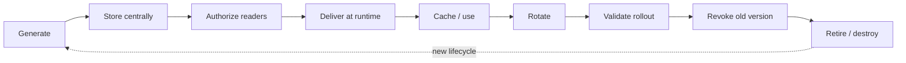
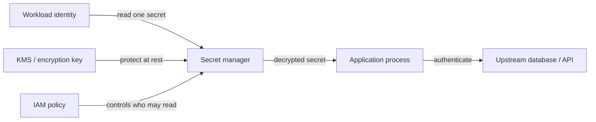
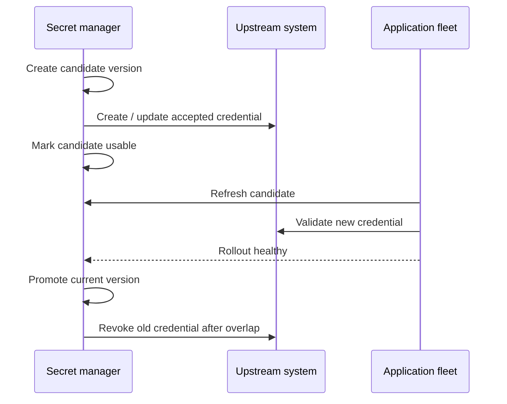
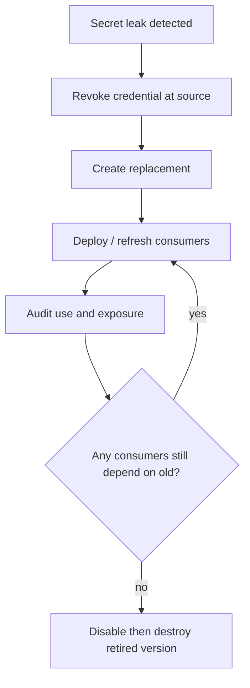

# Secrets Management: Operate Storage, Delivery, Rotation, and Revocation

## TL;DR

In Uber's 2016 breach, intruders accessed a private source-code repository and found a plaintext AWS access key. According to the U.S. Federal Trade Commission and Department of Justice, that key was then used to access and copy large quantities of data from Uber's cloud storage. The repository was private, but the credential was still a reusable bearer of authority once the repository account was compromised. **A private repository is not a secret store, and encryption at rest does not repair a leaked credential that is still valid.**

> 💡 **Rule of thumb:** First **eliminate the secret** when workload identity or federation can replace it. For every secret that remains, operate an explicit **secret lifecycle**: generate → store → authorize → deliver → cache → rotate → revoke → retire, with enough versioning and observability to roll forward or back safely.

- **Secrets are authority-bearing data:** Passwords, API keys, private tokens, signing material, connection credentials, and similar values must be treated differently from ordinary configuration because possession may be enough to authenticate or decrypt.
- **Secret storage and IAM solve different problems:** A secret manager protects and versions secret material; workload identity decides which process may fetch it. A vault without least-privilege IAM is only a centralized pile of powerful plaintext waiting to be read.
- **Delivery is part of the attack surface:** Source files, container layers, CI variables, environment variables, mounted files, process arguments, logs, crash dumps, and in-memory caches all have different exposure and refresh characteristics.
- **Rotation is a distributed rollout:** Creating a new secret version is only one step. The upstream system, application instances, caches, connection pools, rollback path, and old credential must move through a coordinated transition.
- **Fatal pitfall:** Rotating the value in the secret store first, immediately revoking the old credential, and assuming every workload has refreshed. Long-lived processes and existing connection pools may still hold the old value, turning a security improvement into an outage.



<TermBox term="Secret Zero">
**Secret zero** is the bootstrap credential a workload would need before it can retrieve other secrets. The preferred pattern is usually to replace that bootstrap secret with a platform-issued workload identity, managed identity, IAM role, service account, or federated token so the application does not need one long-lived credential merely to fetch another.
</TermBox>

## Start by asking whether the secret should exist

The safest static secret is the one you do not create.

Before creating an API key or password, ask whether the target system can accept:

- cloud workload identity;
- managed identity;
- service account tokens issued to the workload;
- short-lived STS credentials;
- OIDC federation from CI/CD;
- mutual TLS with managed certificate lifecycle;
- database IAM authentication or another platform-native identity mechanism.

For example, Azure documentation recommends managed identity for Azure services where possible, and Google Cloud recommends avoiding service-account keys when a safer attached or federated identity is available. AWS similarly recommends IAM roles and temporary credentials for workloads instead of embedding long-lived access keys.

A secrets manager is useful for credentials that still must exist. It should not become an excuse to preserve every legacy shared password forever.

## A secret is not ordinary configuration

Configuration answers questions such as:

- which region should this service use?
- how large is the worker pool?
- which feature flag is enabled?
- what timeout should this client use?

A secret answers questions such as:

- what password authenticates this database user?
- what API key authorizes billing requests?
- what private token signs or authenticates calls?
- what client credential lets this service obtain an access token?

The key difference is **authority**. Publishing a timeout value may reveal architecture. Publishing an active credential may let another caller become the application.

Do not classify a value as "not secret" merely because it appears in a URL, JSON file, connection string, or environment variable.

## Secret storage does not replace IAM

Use [Cloud IAM](/docs/cloud-infrastructure/cloud-iam) to decide **which principal may read or administer a secret**.

A strong operating model separates:

- **secret administrators:** create versions, configure rotation, delete or recover secrets;
- **secret consumers:** read only the exact secrets their workload needs;
- **auditors:** inspect metadata and logs without necessarily reading secret values;
- **rotation automation:** can create/update the target credential and move versions, but should not automatically receive unrelated secrets.



The diagram shows three different controls:

1. **IAM** controls who can request the value.
2. **KMS / key management** protects stored ciphertext and cryptographic key operations.
3. **Secrets management** stores versions, metadata, rotation state, and retrieval APIs.

They are related but not interchangeable.

A cryptographic key manager does not automatically solve password lifecycle. A secret manager encrypting values at rest does not stop an authorized compromised process from retrieving the **plaintext / decrypted** secret.

If the application must use a password, its process eventually sees usable secret material. Design for compromise containment, not magical invisibility.

## Bootstrap with workload identity, not another embedded password

The classic anti-pattern is:

```text
APP_SECRET_MANAGER_PASSWORD=...
```

stored in the application's image or deployment configuration so the app can fetch "real" secrets.

That merely moves the secret zero problem.

Prefer this chain:

```text
platform proves workload identity
  -> workload receives short-lived identity token
  -> IAM authorizes read of one secret
  -> secret manager returns one version
  -> application uses that secret against the upstream service
```

This keeps the long-lived application secret out of the codebase while letting IAM and audit logs identify which workload retrieved it.

## Keep secrets out of artifacts and accidental disclosure paths

### Source code and repositories

Never treat a private GitHub repository as a vault.

If a secret is committed:

- remove the value from the current code;
- **rotate or revoke the credential immediately**;
- then clean history if policy requires it.

Deleting the line or rewriting Git history does not invalidate copies already cloned, cached, logged, forked, indexed, or downloaded.

Enable **secret scanning** in source-control and CI systems, but treat detection as defense in depth. Scanning after commit is slower than never committing the secret.

### Container images and build artifacts

Do not bake secrets into:

- Dockerfile `ENV` or `ARG` values that become image metadata/layers;
- copied configuration files;
- generated assets;
- build caches;
- package artifacts.

A later Dockerfile step that deletes the file may not remove it from an earlier image layer.

Use build-secret mechanisms for build-time credentials and runtime secret delivery for runtime credentials.

### Logs, traces, and stdout

Redact:

- authorization headers;
- connection strings;
- secret JSON payloads;
- signed URLs when they grant access;
- database DSNs containing passwords;
- access tokens.

Structured logging libraries should classify sensitive fields explicitly.

Do not "debug" production authentication by printing the full credential to stdout.

### Command line and process arguments

Avoid putting secret values directly in CLI arguments or shell command history. AWS explicitly warns that command shells and utilities can expose command parameters containing secrets.

Prefer stdin, protected files, SDK calls, or provider-supported input mechanisms where practical.

## Delivery choices have different trade-offs

There is no universal delivery mechanism.

| Delivery pattern | Strengths | Operating risks |
| --- | --- | --- |
| **Runtime SDK/API fetch** | fine-grained IAM, version-aware, easy to audit, can refresh without restart | adds secret-manager dependency; needs retry/cache strategy |
| **Environment variable** | simple, supported by many platforms and libraries | often fixed at process start; may leak through diagnostics, child processes, config dumps, or support tooling |
| **Mounted file / volume** | works with file-oriented software; platform can sometimes refresh file content | application may not reload changes; file permissions and node isolation matter |
| **Sidecar / agent** | centralizes retrieval and renewal behavior | adds another local trust/runtime component |
| **Generated config file** | supports legacy applications | creates disk lifecycle, permission, cleanup, and rotation problems |

Google Cloud Secret Manager recommends direct API usage generally, while acknowledging that some platform integrations deliver secrets through files or environment variables. That is a good mental model: **environment variables are not universally unsafe, and they are not universally sufficient**.

Choose the delivery path by:

- how quickly rotation must propagate;
- whether the application can reload;
- whether subprocesses inherit the value;
- whether local disk is trusted;
- whether the app can tolerate secret-manager API failure;
- what audit trail you need.

## Treat the secret manager as a dependency

Fetching a secret on every user request is usually the wrong default.

If the secret manager becomes slow or unavailable, per-request retrieval can turn one control-plane issue into a fleet-wide request outage.

Common patterns include:

- retrieve on startup;
- cache in memory with a **cache TTL** or refresh interval;
- refresh asynchronously before expiration;
- keep the last known working version during short manager outages where policy permits;
- bound retries and avoid synchronized refresh storms;
- alert on refresh failure before the cached value expires.

Caching is a trade-off:

- longer TTL reduces dependency load and improves outage tolerance;
- shorter TTL propagates rotation/revocation faster.

Choose TTL from the security and availability objective, not a generic "five minutes" rule.

<TermBox term="Secret Version">
A **secret version** is an immutable or provider-managed revision of secret material under one logical secret name. Versioning lets applications roll out new credentials gradually, validate them, roll back to a known-good value, and disable old material deliberately instead of overwriting the only copy in place.
</TermBox>

## Pinning versus "latest" is a deployment decision

A dynamic alias such as "latest" is convenient, but it couples every consumer to the newest value immediately.

Google Cloud explicitly recommends referencing production secrets by version number rather than the `latest` alias in many workloads so a bad version can be tested, rolled out gradually, and rolled back through the existing release process.

AWS Secrets Manager uses staging labels during rotation:

- `AWSPENDING` for the candidate during rotation;
- `AWSCURRENT` for the current version;
- `AWSPREVIOUS` for the prior current version.

Azure Key Vault also keeps secret versions; provider integrations decide whether an application references a versioned or versionless secret URI/name.

There is no universal winner:

- **pin a version** when controlled rollout and rollback matter most;
- **follow an alias/current version** when rapid centralized rotation matters and every consumer handles refresh safely.

Document the intended model so operators know what "rotate this secret" actually changes.

## Rotation is a multi-system transaction without a database transaction

A credential exists in at least two places conceptually:

1. the secret manager;
2. the upstream system that accepts the credential.

The application fleet is a third participant because it caches or consumes versions.

A safe rotation must coordinate all three.



<TermBox term="Rotation Overlap">
A **rotation overlap** is the period in which both old and new credentials remain valid long enough for a distributed fleet to refresh safely. Some systems support two credential sets or alternating users; others require a carefully ordered single-user update. The overlap must be bounded so it improves availability without leaving old credentials valid indefinitely.
</TermBox>

## Zero-downtime rotation needs an application plan

### Prefer dual credentials when the upstream supports them

Two API keys, alternating database users, or two active certificate identities can provide a safer sequence:

1. create the new credential;
2. store it as a new secret version;
3. let workloads refresh;
4. verify new authentication succeeds;
5. stop issuing the old version;
6. revoke the old credential.

AWS Secrets Manager documents an **alternating users** strategy for some database credentials specifically to reduce authentication denial during rotation. Azure documents a two-key rotation pattern for resources that support two credential sets.

### Single-credential rotation is more fragile

If the upstream accepts only one password:

1. decide whether the upstream or secret store changes first;
2. minimize the mismatch window;
3. retry only known transient failures;
4. ensure every consumer refreshes promptly;
5. keep rollback mechanics explicit.

Azure's Key Vault rotation tutorial for a one-password SQL scenario calls out a real lag between creating a new secret version and updating SQL Server; during that window the new secret may not authenticate yet.

That is why "set new secret value" is not itself a complete rotation design.

## Existing connection pools can hide rotation bugs

Database credential rotation often surprises teams because established connections may continue working while new connections fail.

A fleet can look healthy until:

- an instance restarts;
- a connection ages out;
- autoscaling adds capacity;
- a failover rebuilds the pool.

Then every new connection starts using an invalid cached credential.

Test:

- fresh process startup after rotation;
- forced connection-pool recycle;
- scale-out during the overlap window;
- rollback to the old version;
- old-credential revocation after all new connections succeed.

Connection reuse is not evidence that rotation completed.

## Rollback and roll-forward both need known-good versions

A bad secret can be syntactically valid but operationally wrong:

- wrong database user;
- key for the wrong environment;
- missing permission;
- malformed certificate chain;
- value copied with whitespace;
- credential not yet active upstream.

Before promotion, run a targeted validation against the real dependency.

If validation fails:

- stop rollout;
- keep or restore the last known-good version;
- do not destroy the previous version;
- investigate the producer/rotation automation.

AWS's `AWSPREVIOUS` and Google Cloud's version pinning model make the broader principle visible: **version retention is a recovery tool**.

## Revocation is different from deleting a secret record

If an API key leaks, deleting the secret object from the manager does not necessarily invalidate the key at the upstream API provider.

Incident response should distinguish:

- **revoke at the authority source:** disable the database user, API token, certificate, or cloud key;
- **stop distribution:** disable the compromised secret version or change IAM so workloads cannot fetch it;
- **rotate consumers:** publish a replacement credential and refresh workloads;
- **search exposure:** source history, CI logs, build artifacts, tickets, chat, observability systems;
- **audit usage:** identify calls made with the leaked credential;
- **retire old material:** destroy old versions only after evidence shows they are no longer required.

For Google Cloud Secret Manager, a version can be **disabled** reversibly before it is destroyed. Its current best-practice guidance recommends disabling versions before permanent destruction to catch lingering dependencies.



## Deletion needs recovery semantics too

Deleting secrets aggressively can cause the same class of outage as rotating badly.

For production:

- prefer disable/deactivate before irreversible destroy where supported;
- understand provider recovery windows and purge protection;
- prevent accidental deletion of high-criticality secrets;
- separate "can read" from "can delete";
- test restore/recovery procedures;
- avoid automatic expiration for long-lived production secrets unless the application is designed for that hard stop.

Azure Key Vault supports soft-delete and purge-protection controls for vault objects. Google Cloud supports disabling versions before destruction and now also supports delayed destruction options. AWS Secrets Manager supports recovery windows for scheduled secret deletion.

The exact semantics are **provider-specific**.

## CI/CD should federate when possible

CI systems are common places for secrets to multiply because pipelines need deployment authority.

Prefer:

```text
CI job identity / OIDC claim
  -> cloud federation
  -> short-lived deployment identity
  -> deploy
```

over:

```text
long-lived cloud access key
  -> saved as CI secret
  -> copied across repos/projects
  -> rotated manually someday
```

Federation will not eliminate every secret: third-party APIs may still require static tokens. But it can remove high-value cloud root/deployment credentials from CI secret stores.

For remaining CI secrets:

- scope by environment/repository;
- protect production environments with approval where appropriate;
- do not echo values;
- rotate on staff/repository boundary changes;
- scan build logs and artifacts for accidental disclosure.

## Audit reads, changes, and rotation failures

A secrets program needs evidence.

Track at least:

- secret creation and deletion;
- new version creation;
- value access/read events where the provider exposes them;
- IAM policy changes;
- failed access attempts;
- rotation success/failure;
- disabled/destroyed versions;
- unusual readers or regions;
- use of old credentials after cutover.

Provider examples include:

- AWS CloudTrail for Secrets Manager API activity;
- Google Cloud Audit Logs for Secret Manager;
- Azure Key Vault logging through Azure Monitor / diagnostic settings.

Do not log the secret value into the audit event yourself.

## Provider examples: same lifecycle, different mechanics

| Concern | AWS | Google Cloud | Azure |
| --- | --- | --- | --- |
| Managed secret store | **AWS Secrets Manager** | **Google Cloud Secret Manager** | **Azure Key Vault** secrets |
| Workload bootstrap | IAM role / STS | service account / Workload Identity Federation | managed identity / Entra workload identity |
| Version model | staging labels such as `AWSCURRENT`, `AWSPENDING`, `AWSPREVIOUS` | numbered immutable secret versions plus aliases such as `latest` | Key Vault secret versions |
| Rotation | managed rotation or Lambda-based rotation for supported/custom targets | add new version; rotation notification/scheduling can drive external rotation workflows | Event Grid / Functions and service-specific patterns for secret rotation |
| Reversible retirement | retain/move staging labels before cleanup | disable a secret version before destroy | disable versions plus soft delete / purge protection at vault-object level |

These products **differ** in rotation automation, alias semantics, replication/location, deletion recovery, logging, quotas, and integration behavior. Learn the lifecycle once, then verify the exact product contract.

## Production micro-scenario: password rotation breaks only after autoscaling

A service has 80 pods connected to PostgreSQL. The database password is stored centrally and injected as an environment variable when each pod starts. Operations changes the database password and updates the secret store. Existing pooled database connections remain alive, so dashboards stay green for 30 minutes. A traffic spike triggers autoscaling; every new pod starts with the new secret, but the database update had actually failed and still accepts only the old password.

- **Impact:** Existing instances continue serving while all new instances fail readiness, autoscaling cannot add capacity, and the surviving pool saturates.
- **Root cause:** The team treated "new secret version exists" as proof that rotation succeeded. It did not validate the upstream credential, force fresh connections, or test new-instance startup before revoking/retiring the previous path.
- **Correct pattern:** Use staged rotation with candidate validation, overlap where supported, controlled refresh, explicit connection-pool tests, new-instance canaries, rollback to a known-good version, and old-credential revocation only after fresh authentication succeeds across the fleet.

## Check your mental model

> **Scenario:** A platform team moves a third-party API token from Git into a managed secret store. The app uses a tightly scoped workload identity to fetch it over TLS. The team concludes that even if the application process is compromised, the attacker cannot obtain the API token because the secret is encrypted at rest.

<details>
<summary>Show the reasoning</summary>

The secret manager protects the stored value and controls retrieval, but the application still needs usable plaintext to authenticate to the third-party API.

A compromised process running with the same workload identity may be able to call the secret manager, read the secret from application memory, intercept it at the client boundary, or use the application itself as a credential oracle.

The design is still much better than a token in Git because access is centralized, auditable, revocable, versioned, and scoped. But secret management reduces exposure and blast radius; it does not make a runtime compromise harmless.

Where possible, remove the static token entirely with workload federation or another short-lived identity protocol.

</details>

## Secrets management operations checklist

- [ ] **Eliminate:** Can workload identity, managed identity, IAM role, service account, federation, or certificate-based identity remove this static secret?
- [ ] **Classify:** Is the value actually authority-bearing secret material, or ordinary configuration?
- [ ] **Source:** Is the secret absent from source code, Git history, container images, package/build artifacts, Terraform state, tickets, and docs?
- [ ] **Delivery:** Is runtime SDK/API fetch, environment variable, mounted file, or agent delivery chosen intentionally for this application's refresh and exposure model?
- [ ] **Secret zero:** Does the workload authenticate to the secret manager with short-lived platform identity rather than another embedded credential?
- [ ] **IAM:** Can only the exact workload identities that need this secret read it, and are admin/delete rights separate?
- [ ] **Logging:** Are logs, traces, stdout, CLI arguments, crash reports, and support bundles prevented from exposing the value?
- [ ] **Versioning:** Does deployment know whether it pins a version or follows a current/latest alias, and can it roll back?
- [ ] **Caching:** Is cache TTL / refresh interval explicit, monitored, and compatible with both manager outages and revocation requirements?
- [ ] **Rotation:** Does the process update both the secret manager and the upstream authority, with validation and overlap where possible?
- [ ] **Connection pools:** Have fresh connections, process restarts, and scale-out been tested after rotation?
- [ ] **Revocation:** Can operators invalidate a leaked credential at the real authority source without waiting for normal rotation?
- [ ] **Audit:** Can you identify who read, changed, rotated, disabled, or deleted the secret?
- [ ] **Retirement:** Are old versions disabled first where possible, then destroyed only after dependency evidence is clean?
- [ ] **CI/CD:** Can OIDC/federation remove long-lived cloud credentials from the pipeline, and is secret scanning enabled?

## Boundary with Cloud IAM and key management

Use [Cloud IAM](/docs/cloud-infrastructure/cloud-iam) to reason about **who may retrieve or administer a secret** and how workload identity is established.

Secrets management answers a different question: **how does authority-bearing material live, move, change, and die safely after an authorized workload needs it?**

KMS/key-management systems protect cryptographic keys and encryption operations. A secret manager may use KMS underneath, but passwords, API tokens, connection credentials, and third-party secrets still need lifecycle, delivery, versioning, rotation, and revocation semantics above encryption at rest.

## Sources

- [FTC — Revised Uber complaint and 2016 breach details](https://www.ftc.gov/system/files/documents/cases/1523054_uber_technologies_revised_complaint_0.pdf)
- [DOJ — Uber non-prosecution agreement related to the 2016 data breach](https://www.justice.gov/usao-ndca/pr/uber-enters-non-prosecution-agreement)
- [AWS Secrets Manager — Best practices](https://docs.aws.amazon.com/secretsmanager/latest/userguide/best-practices.html)
- [AWS Secrets Manager — Secret versions and staging labels](https://docs.aws.amazon.com/secretsmanager/latest/userguide/whats-in-a-secret.html)
- [AWS Secrets Manager — Rotation strategies](https://docs.aws.amazon.com/secretsmanager/latest/userguide/rotation-strategy.html)
- [Google Cloud Secret Manager — Best practices](https://cloud.google.com/secret-manager/docs/best-practices)
- [Google Cloud Secret Manager — Rotation recommendations](https://cloud.google.com/secret-manager/docs/rotation-recommendations)
- [Google Cloud Secret Manager — Disable a secret version](https://cloud.google.com/secret-manager/docs/disable-secret-version)
- [Azure Key Vault — Automate rotation for one credential set](https://learn.microsoft.com/en-us/azure/key-vault/secrets/tutorial-rotation)
- [Azure Key Vault — Automate rotation for two credential sets](https://learn.microsoft.com/en-us/azure/key-vault/secrets/tutorial-rotation-dual)
- [Microsoft — Best practices for protecting secrets](https://learn.microsoft.com/en-us/azure/security/fundamentals/secrets-best-practices)

## Related lessons

- [Cloud IAM](/docs/cloud-infrastructure/cloud-iam)
- [Authentication & Authorization](/docs/backend-engineering/authentication-and-authorization)
- [Threat Modeling & Least Privilege](/docs/security/threat-modeling-and-least-privilege)
- [Containers](/docs/cloud-infrastructure/containers)
