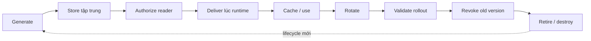
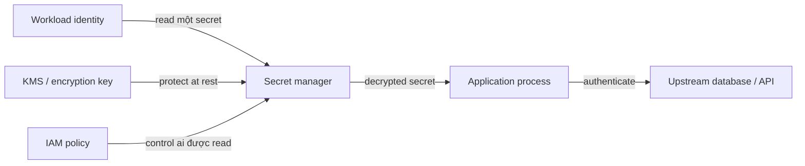
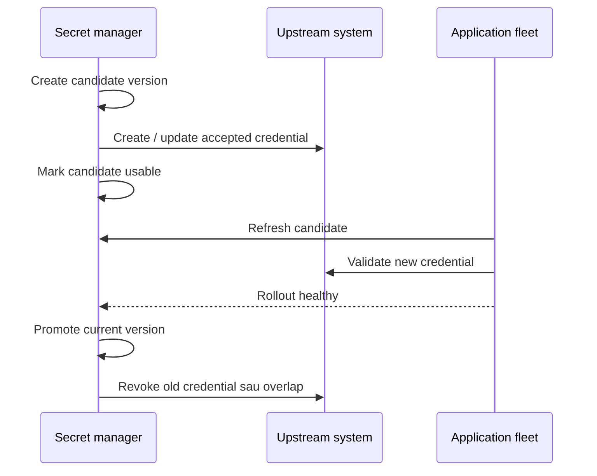
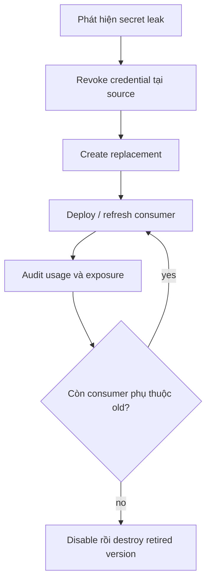

# Secrets Management: Vận hành Lưu trữ, Phân phối, Rotation và Revocation

## TL;DR

Trong breach Uber năm 2016, intruder truy cập một private source-code repository rồi tìm thấy AWS access key ở dạng plain text. Theo U.S. Federal Trade Commission và Department of Justice, key đó sau đó được dùng để access và copy lượng lớn dữ liệu từ cloud storage của Uber. Repository là private, nhưng credential vẫn là reusable bearer of authority sau khi repository account bị compromise. **Private repository không phải secret store, và encryption at rest không sửa được credential đã leak nhưng vẫn còn valid.**

> 💡 **Quy tắc bỏ túi:** Trước hết hãy **loại bỏ secret** nếu workload identity hoặc federation có thể thay thế nó. Với mọi secret còn lại, vận hành lifecycle tường minh: generate → store → authorize → deliver → cache → rotate → revoke → retire, với versioning và observability đủ để roll forward hoặc rollback an toàn.

- **Secret là authority-bearing data:** Password, API key, private token, signing material, connection credential và giá trị tương tự phải được đối xử khác ordinary configuration vì possession có thể đã đủ để authenticate hoặc decrypt.
- **Secret storage và IAM giải quyết hai bài toán khác nhau:** Secret manager bảo vệ và version secret material; workload identity quyết định process nào được fetch. Vault không có least-privilege IAM chỉ là một đống plaintext mạnh được gom về một chỗ chờ ai đó đọc.
- **Delivery là một phần attack surface:** Source file, container layer, CI variable, environment variable, mounted file, process argument, log, crash dump và in-memory cache có exposure/refresh characteristic khác nhau.
- **Rotation là distributed rollout:** Tạo secret version mới chỉ là một bước. Upstream system, application instance, cache, connection pool, rollback path và old credential phải chuyển qua transition được điều phối.
- **Cạm bẫy chết người:** Đổi value trong secret store trước, revoke old credential ngay rồi giả định mọi workload đã refresh. Long-lived process và existing connection pool có thể vẫn giữ old value, biến security improvement thành outage.



<TermBox term="Secret Zero">
**Secret zero** là bootstrap credential mà workload cần trước khi retrieve các secret khác. Pattern ưu tiên thường là thay bootstrap secret đó bằng platform-issued workload identity, managed identity, IAM role, service account hoặc federated token để application không phải giữ một long-lived credential chỉ để fetch một credential khác.
</TermBox>

## Bắt đầu bằng câu hỏi secret có nên tồn tại không

Static secret an toàn nhất là secret không được tạo.

Trước khi tạo API key hoặc password, hãy hỏi target system có nhận được:

- cloud workload identity;
- managed identity;
- service-account token cấp cho workload;
- short-lived STS credential;
- OIDC federation từ CI/CD;
- mutual TLS với managed certificate lifecycle;
- database IAM authentication hoặc platform-native identity mechanism khác.

Ví dụ, tài liệu Azure khuyến nghị managed identity cho Azure service khi có thể, Google Cloud khuyến nghị tránh service-account key nếu attached/federated identity an toàn hơn tồn tại, còn AWS khuyến nghị IAM role và temporary credential cho workload thay vì embedded long-lived access key.

Secret manager hữu ích cho credential vẫn bắt buộc phải tồn tại. Nó không nên trở thành lý do để giữ mọi legacy shared password mãi mãi.

## Secret không phải ordinary configuration

Configuration trả lời câu hỏi kiểu:

- service dùng region nào?
- worker pool lớn bao nhiêu?
- feature flag nào bật?
- client dùng timeout bao nhiêu?

Secret trả lời câu hỏi kiểu:

- password nào authenticate database user?
- API key nào authorize billing request?
- private token nào sign/authenticate call?
- client credential nào cho service lấy access token?

Khác biệt cốt lõi là **authority**. Publish timeout value có thể lộ architecture. Publish active credential có thể cho caller khác trở thành application.

Đừng gọi một value là "không secret" chỉ vì nó xuất hiện trong URL, JSON file, connection string hoặc environment variable.

## Secret storage không thay thế IAM

Dùng [Cloud IAM](/vi/docs/cloud-infrastructure/cloud-iam) để quyết định **principal nào được đọc hoặc administer secret**.

Operating model tốt tách:

- **secret administrator:** create version, configure rotation, delete/recover secret;
- **secret consumer:** chỉ đọc đúng secret workload cần;
- **auditor:** inspect metadata/log mà không nhất thiết đọc secret value;
- **rotation automation:** được create/update target credential và move version, nhưng không tự động được đọc secret không liên quan.



Diagram này có ba control khác nhau:

1. **IAM** control ai được request value.
2. **KMS / key management** bảo vệ stored ciphertext và cryptographic-key operation.
3. **Secrets management** giữ version, metadata, rotation state và retrieval API.

Chúng liên quan nhưng không interchangeable.

Cryptographic key manager không tự giải quyết password lifecycle. Secret manager encrypt value at rest không chặn một **compromised process / process bị compromise** vốn đã được authorize khỏi retrieve secret ở dạng **plaintext / đã giải mã**.

Nếu application phải dùng password, process cuối cùng vẫn thấy usable secret material. Design cho compromise containment, không cho "secret vô hình" tưởng tượng.

## Bootstrap bằng workload identity, không bằng password nhúng khác

Anti-pattern kinh điển là:

```text
APP_SECRET_MANAGER_PASSWORD=...
```

được lưu trong application image hoặc deployment config để app fetch "real" secret.

Cách này chỉ di chuyển bài toán secret zero.

Ưu tiên chain:

```text
platform chứng minh workload identity
  -> workload nhận short-lived identity token
  -> IAM authorize read một secret
  -> secret manager trả một version
  -> application dùng secret đó với upstream service
```

Cách này giữ long-lived application secret khỏi codebase và cho IAM/audit log định danh workload nào đã retrieve nó.

## Giữ secret khỏi artifact và accidental disclosure path

### Source code và repository

Đừng xem private GitHub repository là vault.

Nếu secret đã commit:

- remove value khỏi current code;
- **rotate hoặc revoke credential ngay**;
- rồi mới clean history nếu policy yêu cầu.

Xóa dòng code hoặc rewrite Git history không invalidate copy đã clone, cache, log, fork, index hoặc download.

Bật **secret scanning / quét secret** trong source-control và CI system, nhưng xem detection là defense in depth. Scan sau commit chậm hơn việc không commit ngay từ đầu.

### Container image và build artifact

Đừng bake secret vào:

- Dockerfile `ENV` hoặc `ARG` có thể đi vào image metadata/layer;
- copied configuration file;
- generated asset;
- build cache;
- package/build artifact.

Dockerfile step sau xóa file không nhất thiết loại file khỏi image layer trước đó.

Dùng build-secret mechanism cho build-time credential và runtime secret delivery cho runtime credential.

### Log, trace và stdout

Redact:

- authorization header;
- connection string;
- secret JSON payload;
- signed URL nếu nó grant access;
- database DSN chứa password;
- access token.

Structured logging library nên classify sensitive field tường minh.

Đừng "debug" production authentication bằng cách print full credential ra stdout.

### Command line và process argument

Tránh đưa secret value trực tiếp vào CLI/dòng lệnh, process argument hoặc shell history. AWS cảnh báo command shell và utility có thể expose command parameter chứa secret.

Ưu tiên stdin, protected file, SDK call hoặc provider-supported input mechanism khi phù hợp.

## Delivery choice có trade-off khác nhau

Không có universal delivery mechanism.

| Delivery pattern | Điểm mạnh | Operating risk |
| --- | --- | --- |
| **Runtime SDK/API fetch** | IAM chi tiết, version-aware, audit dễ, refresh không cần restart | thêm dependency vào secret manager; cần retry/cache strategy |
| **Environment variable / biến môi trường** | đơn giản, nhiều platform/library hỗ trợ | thường cố định lúc process start; có thể leak qua diagnostic, child process, config dump hoặc support tooling |
| **Mounted file / file mount / volume** | hợp software đọc file; platform đôi khi refresh file content | application có thể không reload; file permission và node isolation quan trọng |
| **Sidecar / agent** | gom retrieval/renewal behavior | thêm local trust/runtime component |
| **Generated config file** | hỗ trợ legacy application | tạo disk lifecycle, permission, cleanup và rotation problem |

Google Cloud Secret Manager khuyến nghị direct API nói chung nhưng thừa nhận một số platform integration deliver secret qua filesystem hoặc environment variable. Đây là mental model tốt: **environment variable không universally unsafe và cũng không universally sufficient**.

Chọn delivery path theo:

- rotation phải propagate nhanh tới đâu;
- application có reload được không;
- subprocess có inherit value không;
- local disk có trusted không;
- app chịu được secret-manager API failure không;
- cần audit trail mức nào.

## Xem secret manager như một dependency

Fetch secret ở mọi user request thường là default sai.

Nếu secret manager chậm hoặc **unavailable / gặp sự cố**, per-request retrieval có thể biến một control-plane outage thành fleet-wide request outage.

Pattern phổ biến:

- retrieve khi startup;
- cache trong memory với **cache TTL** hoặc refresh interval;
- refresh async trước expiration;
- giữ last-known-working version trong manager outage ngắn nếu policy cho phép;
- bound retry và tránh synchronized refresh storm;
- alert refresh failure trước khi cached value expire.

Caching có trade-off:

- TTL dài giảm dependency load và tăng outage tolerance;
- TTL ngắn propagate rotation/revocation nhanh hơn.

Chọn TTL từ security/availability objective, không từ generic rule "5 phút".

<TermBox term="Secret Version">
**Secret version / phiên bản secret** là revision immutable hoặc provider-managed của secret material dưới một logical secret name. Versioning cho application rollout credential mới từ từ, validate, rollback về known-good value và disable old material có chủ đích thay vì overwrite copy duy nhất.
</TermBox>

## Pin version hay "latest" là deployment decision

Dynamic alias như "latest" tiện nhưng couple mọi consumer vào newest value ngay lập tức.

Google Cloud khuyến nghị nhiều production workload reference secret theo version number thay vì `latest` alias để bad version được test, gradual rollout và rollback qua release process hiện có.

AWS Secrets Manager dùng staging label trong rotation:

- `AWSPENDING` cho candidate;
- `AWSCURRENT` cho current version;
- `AWSPREVIOUS` cho previous current version.

Azure Key Vault cũng giữ **secret version**; provider integration quyết định application reference versioned hay versionless secret URI/name.

Không có universal winner:

- **pin version** khi controlled rollout/rollback quan trọng nhất;
- **follow alias/current version** khi centralized rotation nhanh quan trọng và mọi consumer handle refresh an toàn.

Document model chủ đích để operator biết "rotate secret này" thực tế đổi gì.

## Rotation là multi-system transaction nhưng không có database transaction

Credential tồn tại về mặt logic ở ít nhất hai nơi:

1. secret manager;
2. upstream system chấp nhận credential.

Application fleet là participant thứ ba vì nó cache/consume version.

Rotation an toàn phải coordinate cả ba.



<TermBox term="Rotation Overlap">
**Rotation overlap** là khoảng thời gian cả old và new credential cùng valid đủ lâu để distributed fleet refresh an toàn. Một số system hỗ trợ **dual credential / two sets / hai bộ credential** hoặc alternating users; system khác cần single-user update được order cẩn thận. Overlap phải bounded để tăng availability mà không để old credential valid vô hạn.
</TermBox>

## Zero-downtime rotation cần application plan

### Ưu tiên dual credential khi upstream hỗ trợ

Hai API key, alternating database user hoặc hai active certificate identity cho sequence an toàn hơn:

1. create new credential;
2. store thành new secret version;
3. để workload refresh;
4. verify new authentication succeed;
5. ngừng issue old version;
6. revoke old credential.

AWS Secrets Manager document **alternating users** strategy cho một số database credential để giảm authentication denial trong rotation. Azure document two-key rotation pattern cho resource hỗ trợ two credential sets.

### Single-credential rotation fragile hơn

Nếu upstream chỉ nhận một password:

1. quyết định upstream hay secret store đổi trước;
2. minimize mismatch window;
3. retry chỉ failure transient đã biết;
4. đảm bảo mọi consumer refresh nhanh;
5. giữ rollback mechanic tường minh.

Tutorial Azure Key Vault cho SQL với một password gọi rõ một lag thực tế giữa tạo new secret version và update SQL Server; trong window đó new secret có thể chưa authenticate được.

Vì vậy "set new secret value" tự nó chưa phải rotation design hoàn chỉnh.

## Existing connection pool có thể che rotation bug

Database credential rotation thường làm team bất ngờ vì established connection có thể tiếp tục chạy trong khi new connection fail.

Fleet có thể nhìn healthy cho tới khi:

- instance restart;
- connection age out;
- autoscaling thêm capacity;
- failover rebuild pool.

Lúc đó mọi new connection bắt đầu dùng invalid cached credential.

Test:

- fresh process startup sau rotation;
- forced **connection pool / pool kết nối** recycle;
- scale-out trong overlap window;
- rollback về old version;
- revoke old credential sau khi mọi fresh authentication succeed.

Connection reuse không phải evidence rotation hoàn tất.

## Rollback và roll-forward đều cần known-good version

Bad secret có thể syntactically valid nhưng operationally sai:

- sai database user;
- key của sai environment;
- thiếu permission;
- malformed certificate chain;
- value bị copy thêm whitespace;
- credential chưa active upstream.

Trước promotion, chạy targeted validation với dependency thật.

Nếu validation fail:

- stop rollout;
- keep/restore last known-good version;
- đừng destroy previous version;
- investigate producer/rotation automation.

`AWSPREVIOUS` của AWS và version-pinning model của Google Cloud làm principle rộng hơn dễ thấy: **version retention là recovery tool**.

## Revocation khác với xóa secret record

Nếu API key leak, delete secret object khỏi manager không nhất thiết invalidate key ở upstream API provider.

Incident response phải tách:

- **revoke tại authority source:** disable database user, API token, certificate hoặc cloud key;
- **dừng distribution:** disable compromised secret version hoặc đổi IAM để workload không fetch được;
- **rotate consumer:** publish replacement credential và refresh workload;
- **search exposure:** source history, CI log, build artifact, ticket, chat, observability system;
- **audit usage:** tìm call đã dùng leaked credential;
- **retire old material:** chỉ destroy old version sau khi evidence cho thấy không còn dependency.

Với Google Cloud Secret Manager, version có thể **disable / vô hiệu hóa** theo cách reversible trước khi destroy. Best-practice hiện tại khuyến nghị disable version trước permanent destruction để bắt lingering dependency.



## Deletion cũng cần recovery semantics

Delete secret quá mạnh tay gây cùng class outage với bad rotation.

Với production:

- ưu tiên disable/deactivate trước irreversible destroy khi provider hỗ trợ;
- hiểu recovery window và purge protection;
- chống accidental deletion của high-criticality secret;
- tách quyền "can read" khỏi "can delete";
- test restore/recovery procedure;
- tránh automatic expiration cho long-lived production secret trừ khi application được design cho hard stop.

Azure Key Vault có soft-delete và purge-protection control cho vault object. Google Cloud hỗ trợ disable version trước destroy và hiện cũng có delayed-destruction option. AWS Secrets Manager hỗ trợ recovery window cho scheduled secret deletion.

Exact semantics là **provider-specific / khác nhau theo provider**.

## CI/CD nên federate khi có thể

CI system là nơi secret dễ nhân bản vì pipeline cần deployment authority.

Ưu tiên:

```text
CI job identity / OIDC claim
  -> cloud federation
  -> short-lived deployment identity
  -> deploy
```

thay cho:

```text
long-lived cloud access key
  -> lưu thành CI secret
  -> copy qua nhiều repo/project
  -> rotate manual "một ngày nào đó"
```

Federation không loại mọi secret: third-party API vẫn có thể cần static token. Nhưng nó loại high-value cloud deployment credential khỏi CI secret store.

Với CI secret còn lại:

- scope theo environment/repository;
- protect production environment bằng approval khi phù hợp;
- không echo value;
- rotate khi staff/repository boundary thay đổi;
- scan build log/artifact cho accidental disclosure.

## Audit read, change và rotation failure

Secrets program cần evidence.

Theo dõi ít nhất:

- secret creation/deletion;
- new version creation;
- value access/read event khi provider expose;
- IAM policy change;
- failed access;
- rotation success/failure;
- disabled/destroyed version;
- unusual reader hoặc region;
- old credential usage sau cutover.

Provider example:

- AWS CloudTrail cho Secrets Manager API activity;
- Google Cloud Audit Logs cho Secret Manager;
- Azure Activity Log / Azure Monitor diagnostic logging cho Key Vault.

Đừng log secret value vào audit event của chính mình.

## Ví dụ provider: cùng lifecycle, khác mechanic

| Concern | AWS | Google Cloud | Azure |
| --- | --- | --- | --- |
| Managed secret store | **AWS Secrets Manager** | **Google Cloud Secret Manager** | **Azure Key Vault** secrets |
| Workload bootstrap | IAM role / STS | service account / Workload Identity Federation | managed identity / Entra workload identity |
| Version model | staging label `AWSCURRENT`, `AWSPENDING`, `AWSPREVIOUS` | numbered immutable secret version + alias như `latest` | Key Vault **secret version** |
| Rotation | managed rotation hoặc Lambda-based rotation cho supported/custom target | add new version; rotation notification/schedule có thể drive external workflow | Event Grid / Functions và service-specific secret-rotation pattern |
| Reversible retirement | giữ/move staging label trước cleanup | disable secret version trước destroy | disable version + soft delete / purge protection ở vault-object level |

Các product **khác nhau** về rotation automation, alias semantics, replication/location, deletion recovery, logging, quota và integration behavior. Học lifecycle một lần rồi verify exact product contract.

## Micro-scenario production: password rotation chỉ vỡ sau autoscaling

Service có 80 pod kết nối PostgreSQL. Database password được lưu tập trung và inject thành environment variable khi mỗi pod start. Operations đổi database password và update secret store. Existing pooled connection vẫn sống nên dashboard xanh 30 phút. Traffic spike trigger autoscaling; mọi new pod start với new secret nhưng database update thật ra đã fail và vẫn chỉ nhận old password.

- **Hậu quả:** Existing instance tiếp tục serve nhưng mọi new instance fail readiness, autoscaling không add capacity và surviving pool saturate.
- **Nguyên nhân cốt lõi:** Team xem "new secret version tồn tại" là proof rotation succeed. Họ không validate upstream credential, force fresh connection hoặc test new-instance startup trước khi revoke/retire previous path.
- **Cách khắc phục chuẩn:** Dùng staged rotation với candidate validation, overlap khi hỗ trợ, controlled refresh, explicit connection-pool test, new-instance canary, rollback về known-good version và chỉ revoke old credential sau khi fresh authentication succeed toàn fleet.

## Kiểm tra mental model

> **Tình huống:** Platform team chuyển third-party API token từ Git vào managed secret store. App dùng tightly scoped workload identity để fetch qua TLS. Team kết luận nếu application process bị compromise, attacker vẫn không lấy được API token vì secret được encrypt at rest.

<details>
<summary>Show the reasoning</summary>

Secret manager bảo vệ stored value và control retrieval, nhưng application vẫn cần usable plaintext để authenticate tới third-party API.

Compromised process chạy cùng workload identity có thể gọi secret manager, đọc secret từ application memory, intercept ở client boundary hoặc dùng chính application như credential oracle.

Design vẫn tốt hơn token trong Git rất nhiều vì access tập trung, audit được, revoke được, versioned và scoped. Nhưng secret management giảm exposure/blast radius; nó không làm runtime compromise vô hại.

Khi có thể, remove static token hoàn toàn bằng workload federation hoặc short-lived identity protocol khác.

</details>

## Checklist vận hành Secrets Management

- [ ] **Eliminate:** Workload identity, managed identity, IAM role, service account, federation hoặc certificate identity có thể loại static secret này không?
- [ ] **Classify:** Value là authority-bearing secret material hay ordinary configuration?
- [ ] **Source:** Secret có vắng khỏi source code, Git history, container image, package/build artifact, Terraform state, ticket và docs không?
- [ ] **Delivery:** Runtime SDK/API fetch, environment variable, mounted file hay agent delivery đã được chọn có chủ đích cho refresh/exposure model của app chưa?
- [ ] **Secret zero:** Workload authenticate vào secret manager bằng short-lived platform identity thay vì embedded credential khác chưa?
- [ ] **IAM:** Chỉ đúng workload identity cần secret này mới đọc được, và admin/delete right có tách không?
- [ ] **Logging:** Log, trace, stdout, CLI argument, crash report và support bundle có được chặn khỏi expose value không?
- [ ] **Versioning:** Deployment có biết nó pin version hay follow current/latest alias, và rollback được không?
- [ ] **Caching:** Cache TTL / refresh interval có explicit, monitored và tương thích cả manager outage lẫn revocation requirement không?
- [ ] **Rotation:** Process có update cả secret manager lẫn upstream authority với validation và overlap khi có thể không?
- [ ] **Connection pools:** Fresh connection, process restart và scale-out đã được test sau rotation chưa?
- [ ] **Revocation:** Operator có invalidate leaked credential tại real authority source mà không chờ normal rotation không?
- [ ] **Audit:** Có biết ai read, change, rotate, disable hoặc delete secret không?
- [ ] **Retirement:** Old version có được disable trước khi destroy khi có thể, và chỉ destroy sau clean dependency evidence không?
- [ ] **CI/CD:** OIDC/federation có thể loại long-lived cloud credential khỏi pipeline không, và secret scanning đã bật chưa?

## Ranh giới với Cloud IAM và key management

Dùng [Cloud IAM](/vi/docs/cloud-infrastructure/cloud-iam) để reasoning **ai được retrieve/administer secret** và workload identity được establish thế nào.

Secrets management trả lời câu khác: **authority-bearing material sống, di chuyển, thay đổi và chết an toàn thế nào sau khi authorized workload cần nó?**

KMS/key-management system bảo vệ cryptographic key và encryption operation. Secret manager có thể dùng KMS bên dưới, nhưng password, API token, connection credential và third-party secret vẫn cần lifecycle, delivery, versioning, rotation và revocation semantics phía trên encryption at rest.

## Nguồn

- [FTC — Revised Uber complaint and 2016 breach details](https://www.ftc.gov/system/files/documents/cases/1523054_uber_technologies_revised_complaint_0.pdf)
- [DOJ — Uber non-prosecution agreement related to the 2016 data breach](https://www.justice.gov/usao-ndca/pr/uber-enters-non-prosecution-agreement)
- [AWS Secrets Manager — Best practices](https://docs.aws.amazon.com/secretsmanager/latest/userguide/best-practices.html)
- [AWS Secrets Manager — Secret versions and staging labels](https://docs.aws.amazon.com/secretsmanager/latest/userguide/whats-in-a-secret.html)
- [AWS Secrets Manager — Rotation strategies](https://docs.aws.amazon.com/secretsmanager/latest/userguide/rotation-strategy.html)
- [Google Cloud Secret Manager — Best practices](https://cloud.google.com/secret-manager/docs/best-practices)
- [Google Cloud Secret Manager — Rotation recommendations](https://cloud.google.com/secret-manager/docs/rotation-recommendations)
- [Google Cloud Secret Manager — Disable a secret version](https://cloud.google.com/secret-manager/docs/disable-secret-version)
- [Azure Key Vault — Automate rotation for one credential set](https://learn.microsoft.com/en-us/azure/key-vault/secrets/tutorial-rotation)
- [Azure Key Vault — Automate rotation for two credential sets](https://learn.microsoft.com/en-us/azure/key-vault/secrets/tutorial-rotation-dual)
- [Microsoft — Best practices for protecting secrets](https://learn.microsoft.com/en-us/azure/security/fundamentals/secrets-best-practices)

## Bài liên quan

- [Cloud IAM](/vi/docs/cloud-infrastructure/cloud-iam)
- [Authentication & Authorization](/vi/docs/backend-engineering/authentication-and-authorization)
- [Threat Modeling & Least Privilege](/vi/docs/security/threat-modeling-and-least-privilege)
- [Containers](/vi/docs/cloud-infrastructure/containers)
